# Agentic Document Extraction with Vision-Language Models

**Community of Practice Presentation**

---

## What We Built

A document extraction pipeline that uses **InternVL3.5-8B** (0.3B vision encoder + 8.2B language model) to pull structured fields from scanned business documents — invoices, receipts, bank statements, travel expenses, vehicle logbooks. The system processes documents end-to-end: classify, extract, and evaluate against ground truth.

What makes it interesting is not the model — it's how the pipeline wraps the model in **agentic control loops** that make it behave more intelligently than any single prompt could.

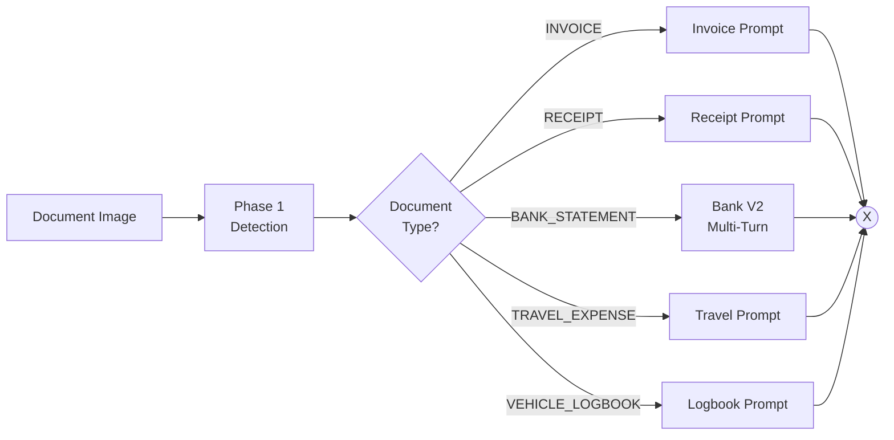

*Continued — extraction and evaluation:*

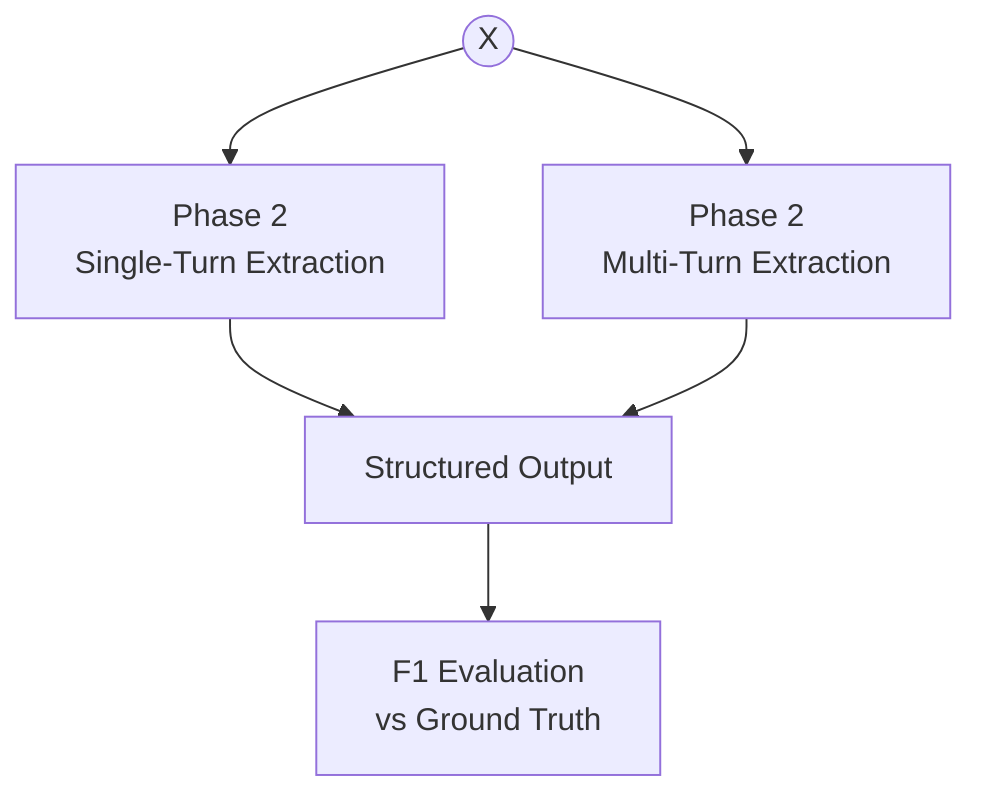

---

## Scaling: Multi-GPU Parallelism

### The strategic choice: split the data, not the model

We have an 8B vision-language model and multiple GPUs. There are two fundamental approaches:

- **Pipeline parallelism** — split the *model* across GPUs (each GPU holds different layers)
- **Data parallelism** — split the *data* across GPUs (each GPU holds the complete model)

We chose data parallelism.

### Pipeline parallelism (`device_map="auto"`)

One model, sharded across GPUs layer-by-layer. HuggingFace Accelerate assigns transformer layers to GPUs based on available memory. A single `from_pretrained(..., device_map="auto")` call distributes the model automatically. At each layer boundary, a PyTorch hook moves the hidden state tensor to the next GPU via `.to(device)`.

HuggingFace describes this as "pretty naive — there is no clever pipeline parallelism involved, just using the GPUs sequentially" [[1]](#references).

**The pipeline bubble problem.** During autoregressive generation, each token requires a full sequential pass through all layers. With layers split across N GPUs, only one GPU is active at any moment — the others idle in a "bubble." For inference on 2 GPUs, each GPU is idle roughly 50% of the time.

- CMU's PipeFill paper measured pipeline bubbles at **15-30% idle time** in training, exceeding 60% in some configurations [[2]](#references)
- TensorRT-LLM benchmarks show pipeline parallelism across 2 GPUs *reduced* throughput from 22.2 to 21.1 tokens/s and **increased latency from 45.1 to 53.9 ms/token** [[3]](#references)

**When it makes sense:** When the model does not fit on a single GPU (70B+ parameters). For our 8B model at 17 GB in bfloat16, every GPU we use has enough memory. Pipeline parallelism solves the wrong problem.

### Data parallelism (chosen)

Load an independent, complete model copy on each GPU. Partition the images. Each GPU processes its chunk independently. Merge results when done.

Each GPU works independently — zero inter-GPU communication during inference:

| Configuration | Throughput | How |
| --- | --- | --- |
| 1 GPU, sequential | 1x | Baseline |
| 1 GPU, batched (batch=8) | 3-5x | Vision encoder amortisation |
| 4 GPUs, sequential | ~4x | 4 independent workers |
| **4 GPUs, batched (batch=4 each)** | **~12-20x** | **Data parallelism x batching** |

For bank statements (multi-turn sequential extraction that cannot be batched), data parallelism is the **only** scaling mechanism — 4 GPUs process 4 bank statements concurrently.

### How images are distributed

This is the fundamental difference between the approaches. Our production workload processes 195 document images across 4 GPUs:

**Pipeline parallelism** sends every image through every GPU. Each GPU holds a slice of the model's layers, so all 195 images must traverse the full GPU 0 → 1 → 2 → 3 chain, with hidden state transfers at each boundary. The GPUs split the *model*, not the *data*.

**Data parallelism** sends each image to exactly one GPU. There are two levels of splitting:

**Level 1 — Partition across GPUs** (chunk size). The 195 images are divided into contiguous chunks using `math.ceil(195 / 4) = 49`:

| GPU | Images | Chunk size |
| --- | --- | --- |
| GPU 0 | 0 – 48 | 49 |
| GPU 1 | 49 – 97 | 49 |
| GPU 2 | 98 – 146 | 49 |
| GPU 3 | 147 – 194 | 48 |

**Level 2 — Batch within each GPU** (batch size). Each GPU processes its chunk in mini-batches of **4 images** per forward pass (the default "balanced" batch size for InternVL3-8B). GPU 0 runs 13 forward passes (12 batches of 4, one of 1). All 4 GPUs do this in parallel.

The batch size is **not** the chunk size. The chunk size determines how many images a GPU is *responsible for*. The batch size determines how many images fit in a single `batch_chat()` call — bounded by VRAM. The strategy is configurable: conservative (1), balanced (4), aggressive (8-16).

### VRAM budget: why batch_size=4

The batch size limit comes from a simple accounting of GPU memory. For InternVL3.5-8B in bfloat16:

| Component | Memory | How |
| --- | --- | --- |
| Model weights (bfloat16) | ~17 GB | 8.5B parameters × 2 bytes |
| CUDA kernels + framework overhead | ~2 GB | Allocator, cuBLAS handles, graph cache |
| **Fixed cost (always present)** | **~19 GB** | |
| Per-image pixel values (11 tiles) | ~0.1 GB | 11 × 3 × 448 × 448 × 2 bytes |
| Per-image KV cache + activations | ~2-4 GB | Varies with sequence length and max_new_tokens |
| **Per-image cost** | **~2-4 GB** | |

On our target hardware (24 GB L4 / A10G GPUs), this leaves **~5 GB** for inference — enough for 1-2 images per batch. The "balanced" default of **batch_size=4** targets higher-VRAM configurations, but on 24 GB GPUs the conservative strategy (batch_size=1) is the practical ceiling. If a batch does OOM, the pipeline halves it recursively until it fits.

Each GPU holds the complete model and processes its subset independently. The GPUs split the *data*, not the *model*. No inter-GPU communication occurs during inference.

This is why the two optimisations compose multiplicatively — data parallelism gives ~4x (4 GPUs), batching gives 3-5x (amortised vision encoder overhead), and together they deliver ~12-20x over a single-GPU sequential baseline. Pipeline parallelism cannot improve throughput because the sequential chain is the bottleneck.

### Side-by-side comparison

| Criterion | Pipeline Parallelism | Multiprocessing | Multithreading |
| --- | --- | --- | --- |
| **What gets split** | The model (layers across GPUs) | The data (images across GPUs) | The data (images across GPUs) |
| **Model copies** | 1 (sharded) | N (full copy per GPU) | N (full copy per GPU) |
| **Image routing** | Every image visits every GPU | Each image visits 1 GPU | Each image visits 1 GPU |
| **Inter-GPU communication** | Every layer boundary, every token | None | None |
| **Throughput scaling (4 GPUs)** | ~1x (pipeline bubble) | ~4x | ~4x |
| **Combined with per-GPU batching** | Limited by single pipeline | ~12-20x | ~12-20x |
| **Startup overhead** | Minimal | 30-60s per worker | Microseconds per thread |
| **Import cost** | Once | N times (5+ sec each) [[5]](#references) | Once |
| **Result transfer** | N/A (single model) | Pickle via IPC | Direct memory access |
| **Works on PCIe (no NVLink)** | Degraded | Full speed | Full speed |
| **Fault isolation** | N/A | Full (process boundary) | None (shared process) |
| **Bank statement multi-turn** | No improvement | Linear speedup | Linear speedup |
| **VRAM efficiency** | High (shared weights) | Low (N copies) | Low (N copies) |
| **Model size requirement** | Any (designed for large models) | Must fit on 1 GPU | Must fit on 1 GPU |

For an 8B model that fits on a single GPU, the choice is clear: **split the data, not the model.** The remaining question is how to implement data parallelism — threading or multiprocessing.

---

## The GIL and Why Threads Beat Processes

### Python's GIL problem

Python's **Global Interpreter Lock (GIL)** prevents multiple threads from executing Python bytecode at the same time. Even on a 64-core server, only one thread runs Python at any given moment.

For CPU-bound work, this is a real limitation. But GPU inference is not CPU-bound.

### PyTorch's escape hatch

PyTorch is mostly C++ and CUDA under the hood. When you call `model.generate()`, the actual computation happens in CUDA kernels and C++ extension code. PyTorch **explicitly releases the GIL** before entering these code paths (via `pybind11::gil_scoped_release`).

```text
Thread 0:  [Python setup] → release GIL → [CUDA kernel on GPU 0] → reacquire GIL → [result]
Thread 1:  [Python setup] → release GIL → [CUDA kernel on GPU 1] → reacquire GIL → [result]
                                           ^^^^^^^^^^^^^^^^^^^^^^^^
                                           These run truly in parallel
```

The Python bookkeeping (tokenising inputs, parsing JSON) takes microseconds. The CUDA inference takes seconds. The GIL serialises the microseconds; the seconds run in true parallel. Profiling confirms this split: Fireworks AI measured **>50% of wall-clock time** at batch-size-1 as CPU overhead waiting for kernel launches [[10]](#references) — exactly the time other threads can use.

### Threading vs multiprocessing

| Criterion | Multithreading | Multiprocessing |
| --- | --- | --- |
| **Serialisation cost** | None — threads share memory | Must pickle results across process boundaries. CUDA tensors use IPC handles but require the sender to stay alive [[7]](#references) |
| **Model sharing** | Direct reference to loaded model | Each process loads its own 17 GB copy |
| **Startup time** | Microseconds per thread | ~42 ms per process (spawn) [[4]](#references). CUDA requires `spawn` not `fork` — ~20x slower than forking |
| **Import cost** | Import `transformers`/`torch` once | Each process reimports everything (5+ sec each) [[5]](#references). Combined with torch and model loading, each worker takes 30-60 seconds to become ready [[6]](#references) |
| **True GPU parallelism** | Yes (GIL released during CUDA) | Yes (separate GIL per process) |
| **True CPU parallelism** | No (single GIL) | Yes (separate GIL per process) |
| **Fault isolation** | None (shared process) | Full (process boundary) |
| **Lifecycle management** | Simple — context managers work naturally | Complex — zombie process handling, signal propagation, IPC cleanup |

The last three rows are the crux. Multiprocessing gives CPU parallelism and fault isolation that threading cannot. But GPU inference doesn't need CPU parallelism — the GPU does the heavy lifting, and PyTorch releases the GIL while it runs.

**When multiprocessing makes sense:** Fault isolation (one GPU crash doesn't kill others), CPU-heavy preprocessing that genuinely needs parallel Python execution, long-running servers where spawn cost amortises to nothing, or when using thread-unsafe libraries like bitsandbytes quantisation [[8]](#references). None of these apply to our batch inference workload.

### The one caveat: sequential model loading

The `transformers` library uses lazy imports and module-level caching that are not thread-safe. If two threads call `AutoModel.from_pretrained()` simultaneously, they can hit race conditions.

The solution: **load models sequentially, run inference in parallel.** This adds 10-30 seconds of sequential startup (loading from local cache or EFS), far less than multiprocessing's per-worker import overhead.

```python
import threading

_load_lock = threading.Lock()

def load_model_on_gpu(gpu_id: int):
    with _load_lock:  # One model loads at a time
        model = AutoModel.from_pretrained(
            model_path,
            device_map=f"cuda:{gpu_id}",
            torch_dtype=torch.bfloat16,
        )
    return model

# Phase 1: Sequential loading (safe)
models = [load_model_on_gpu(i) for i in range(num_gpus)]

# Phase 2: Parallel inference (fast)
with ThreadPoolExecutor(max_workers=num_gpus) as executor:
    futures = [executor.submit(infer, models[i], chunks[i]) for i in range(num_gpus)]
```

### Multi-GPU architecture

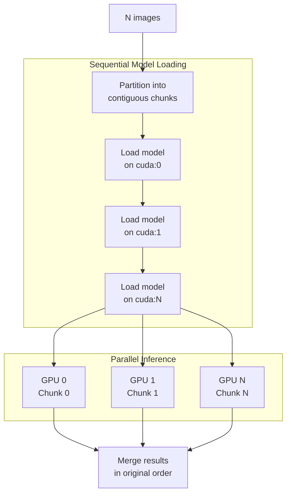

### Batched inference

For non-bank documents, each GPU also supports **batched inference** via InternVL3's `batch_chat()` API, processing multiple images in a single forward pass:

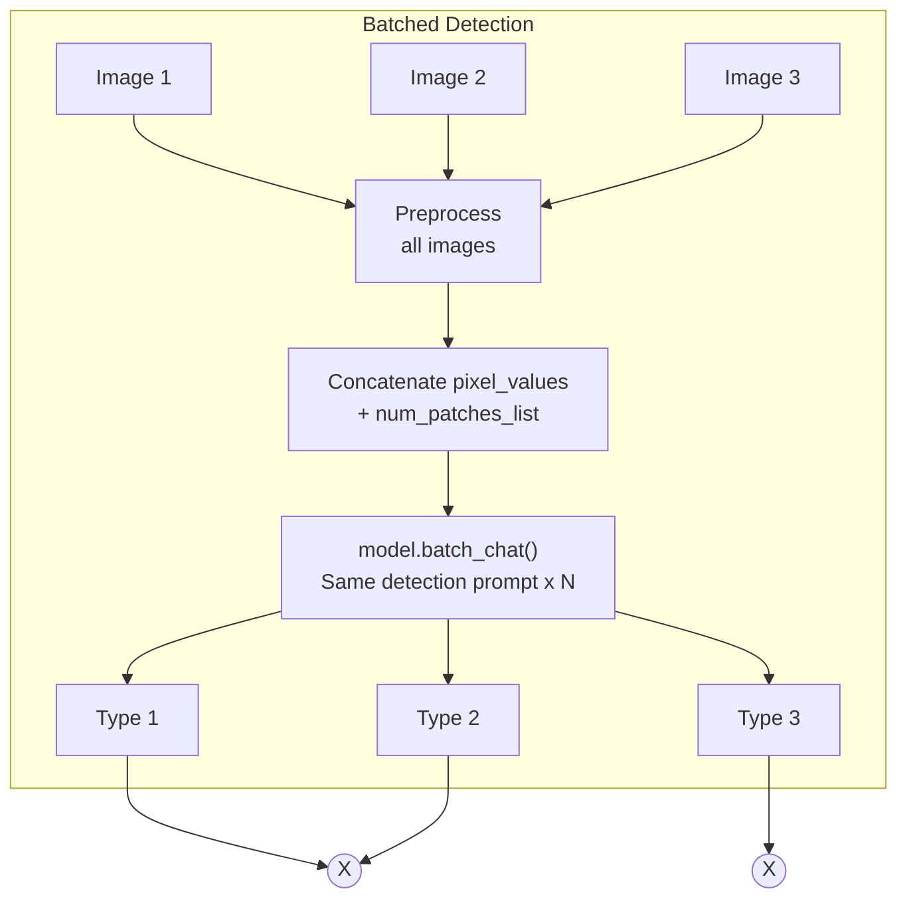

*Continued — extraction:*

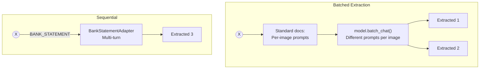

OOM resilience: if a batch fails with `OutOfMemoryError`, the pipeline splits it in half and retries recursively until `batch_size=1`. This self-correcting behaviour is detailed in Pattern 3 below.

---

## Production Deployment: KFP on AWS

Everything above — data parallelism, ThreadPoolExecutor, batched inference, OOM recovery — runs identically in production. The deployment target is **Kubeflow Pipelines (KFP)** on AWS, and data parallelism maps cleanly onto its execution model.

### How code reaches KFP

The pipeline runs as a containerised KFP step. The deployment flow:

1. A **git tag push** triggers CI/CD, which builds the container image and registers the pipeline
2. The **KFP manifest** defines `input_params` — model type, num_gpus, batch_size, image directory — and resource requests (GPU count, memory)
3. KFP launches a **pod** with the requested resources; `input_params` are resolved to **CLI arguments** via `{inputValue: ...}` placeholders in the component spec
4. **`entrypoint.sh`** receives those CLI arguments, activates the conda environment from EFS, runs GPU health checks, and hands off to `cli.py`
5. `cli.py` takes over — model loading, data-parallel inference, evaluation, reporting — exactly as it does locally

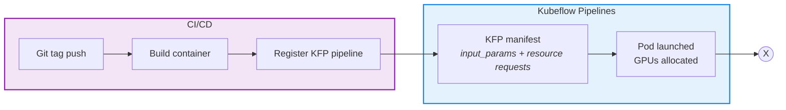

*Continued — container execution:*

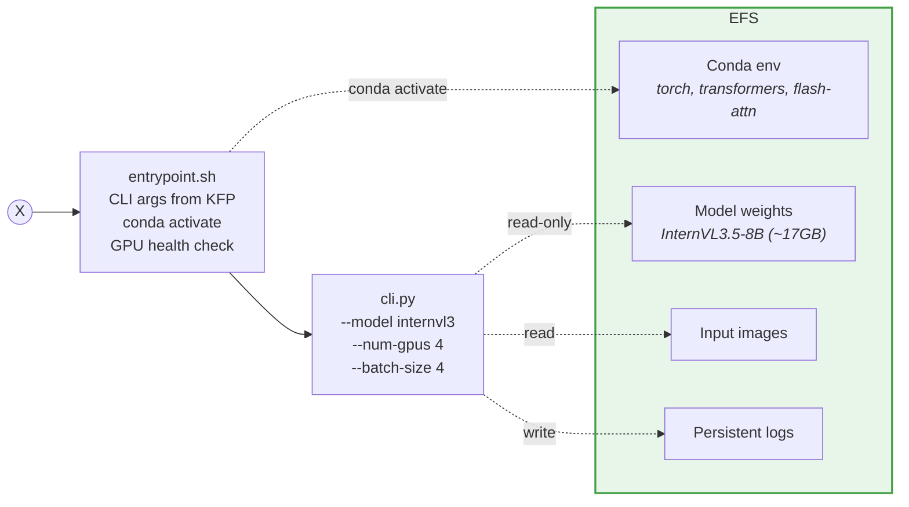

The entrypoint script handles the operational details: fail-fast shell settings (`set -euo pipefail`), timestamped logging to EFS, CUDA device ordering for reproducible GPU indexing, and a cleanup trap that always reports exit code and elapsed time — even on OOM kills.

### Why data parallelism is the natural fit for KFP

KFP's execution model and data parallelism share a key property: **everything happens inside a single container**.

| KFP provides | Data parallelism needs | Alignment |
|---|---|---|
| N GPUs allocated to one pod | N independent model copies | Direct — one copy per GPU |
| Single container process | ThreadPoolExecutor (in-process) | No IPC, no serialisation |
| EFS volume mount | Shared model weights + images | Read-only mount, all GPUs load from same path |
| CLI arguments from manifest | `num_gpus`, `batch_size` params | KFP resolves `{inputValue}` placeholders to CLI args |

Scaling from 1 GPU to 4 GPUs requires **zero code changes** — just update `num_gpus` in the KFP manifest. The ThreadPoolExecutor runs identically whether the pod has 1 GPU or 8. EFS provides model weights (read-only, loaded independently by each GPU), input images, and persistent logs.

This is the same reason we chose ThreadPoolExecutor over multiprocessing: threads share the process address space, so the orchestrator collects results directly — no pickling, no IPC, no process coordination. In a container, this simplicity matters even more: fewer moving parts means fewer failure modes in a pod that can be preempted or OOM-killed at any time.

### Why not pipeline or tensor parallelism in KFP

Pipeline and tensor parallelism both require **inter-GPU communication during inference** — hidden state transfers at every layer boundary (pipeline) or all-reduce operations at every layer (tensor). In a KFP context, this creates problems:

- **Pipeline parallelism**: Sequential GPU usage with pipeline bubbles. No throughput gain for a model that fits on one GPU — it solves the wrong problem (fitting large models, not processing more images)
- **Tensor parallelism**: Requires NVLink-class interconnect for the per-layer all-reduce to not dominate latency. Cloud GPU configurations (L4, A10G) are typically PCIe-connected, where all-reduce overhead can actually reduce throughput. Also requires specialised serving frameworks that complicate the container

Data parallelism needs **zero GPU-to-GPU communication**. Each GPU loads, infers, and returns results independently. This works on any interconnect, on any GPU count, with no framework beyond `threading` and `torch`.

---

## The Case for FlashAttention2

The VRAM budget above tells the story: on a 24 GB A10G, the model consumes ~19 GB before a single image is processed, leaving ~5 GB for inference. Standard attention makes this worse by materialising full N×N attention matrices in VRAM. FlashAttention2 would eliminate this overhead entirely — and we don't have it yet.

This section explains why it is the highest-impact optimisation remaining.

### GPU memory hierarchy

Understanding the hardware is key to understanding why FlashAttention2 matters.

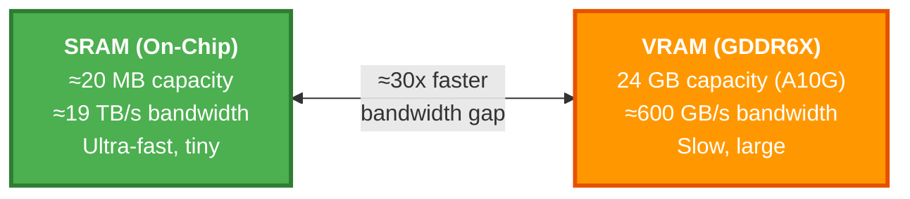

> **The bottleneck is not compute — it's memory bandwidth.**
> The GPU can compute far faster than it can move data between VRAM and SRAM.

### Standard attention today — 6 VRAM transfers

Standard attention materialises the full N×N attention matrix in VRAM, requiring **multiple round trips** between slow VRAM and fast SRAM.

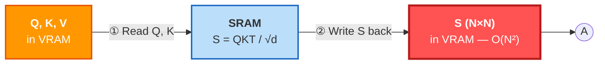

*Continued:*

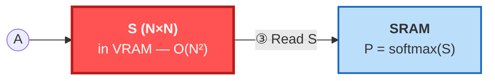

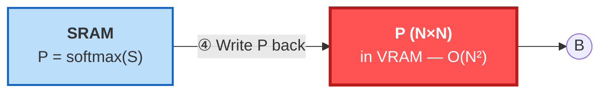

*Continued:*

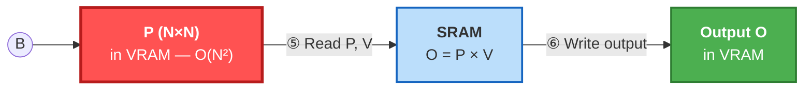

### What FlashAttention2 would change — 2 VRAM transfers

FlashAttention2 **tiles** the computation so the N×N matrix is never fully materialised. Everything stays in fast SRAM using an online softmax algorithm.

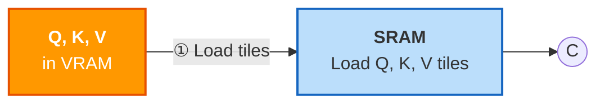

*Continued — fused kernel:*

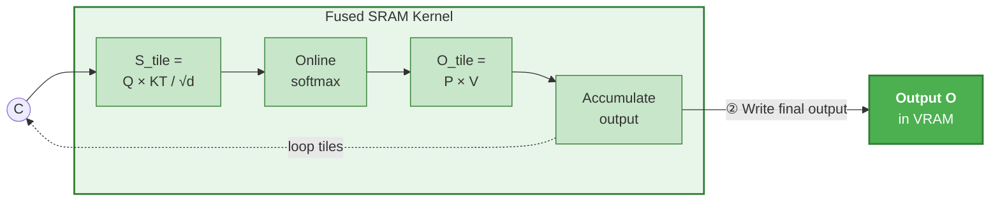

### Side-by-side comparison

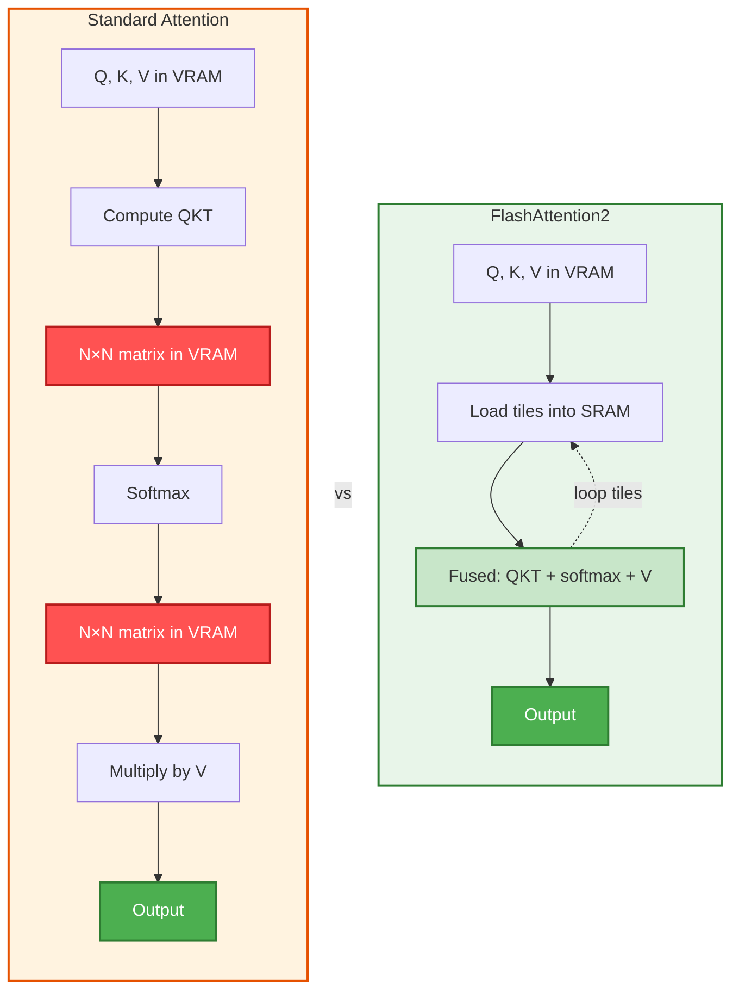

### VRAM impact — InternVL3.5-8B on A10G (24 GB)

This is where the VRAM budget from earlier meets reality. Standard attention eats 1-2 GB in N×N matrices, leaving almost no room to batch. FlashAttention2 would reclaim that space entirely:

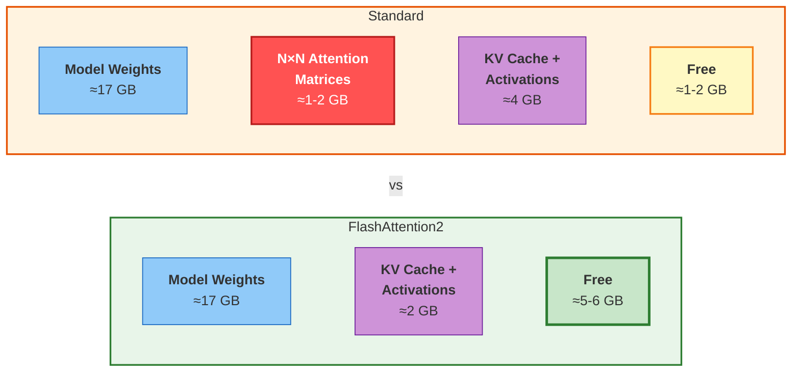

### Expected impact

| Metric | Standard Attention (current) | FlashAttention2 (proposed) |
|--------|-------------------|-----------------|
| Attention memory | O(N²) — full N×N in VRAM | O(N) — tiles in SRAM only |
| VRAM round trips | 6 per attention layer | 2 per attention layer |
| Speed | Memory-bandwidth bound | Compute bound (ideal) |
| A10G batch size (InternVL3.5) | ~2 images | ~3-4 images |
| A10G throughput | Baseline | ~2-3x faster |
| N×N matrix in VRAM | Yes | Never |
| Result | — | Mathematically identical |

> FlashAttention2 doesn't change **what** is computed — it changes **where** it's computed.
> By keeping work in fast SRAM and eliminating VRAM round trips, it would unlock both speed and memory savings — directly addressing the VRAM constraint that currently limits our batch size on A10G GPUs.

### The online softmax trick

The key algorithmic insight — computing exact softmax without seeing all values at once:

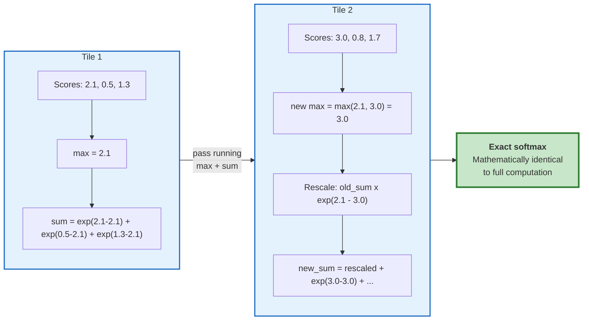

Each tile updates a **running maximum** and **running sum**, rescaling previous results. The final output is **mathematically identical** to computing softmax over the full row.

---

## Why "Agentic" Is the Right Lens

Every architectural choice in this pipeline follows the same pattern:

> **Observe** something (a classification, a column layout, an OOM error, a balance mismatch)
> **Reason** about it (map to a strategy, halve a batch, compute a delta)
> **Act** accordingly (route to a prompt, retry, correct a value)

The VLM is not a black box that receives an image and returns JSON. It is a component inside feedback loops — its outputs drive pipeline decisions, and those decisions determine what the model sees next. This is what separates "run a prompt" from "run an agent."

Four patterns implement this today:

| # | Pattern | Observe | Act |
| - | ------- | ------- | --- |
| 1 | Dynamic Routing | Document classification | Select type-specific prompt, fields, token budget |
| 2 | Multi-Turn Bank Extraction | Column headers (Turn 0) | Template Turn 1 prompt with detected column names |
| 3 | Self-Correcting OOM Fallback | CUDA OutOfMemoryError | Recursively halve batch, retry |
| 4 | Balance Self-Verification | Extracted values vs balance column | Swap or derive correct debit/credit |

---

## Pattern 1: Dynamic Routing (Detect-then-Route)

The pipeline never runs a generic "extract everything" prompt. A lightweight detection call classifies the document first, and the classification output selects everything downstream.

### The observe-reason-act loop

**Observe**: Send the image with a short detection prompt. The VLM returns a free-text classification.

```text
What type of business document is this?

Answer with one of:
- INVOICE (includes bills, quotes, estimates)
- RECEIPT (includes purchase receipts)
- BANK_STATEMENT (includes credit card statements)
- TRAVEL_EXPENSE (includes boarding passes, airline tickets)
- VEHICLE_LOGBOOK (includes motor vehicle logbooks, mileage logs)
```

Generation is cheap — greedy decoding, `max_new_tokens=200`, `temperature=0.1`.

**Reason**: The raw response is resolved to a canonical type through a three-stage cascade:

1. **Exact substring match** against `type_mappings` from YAML (e.g., `"credit card statement"` -> `BANK_STATEMENT`)
2. **Keyword fallback** via `fallback_keywords` per type
3. **Default**: `UNIVERSAL` (configurable via `settings.fallback_type`)

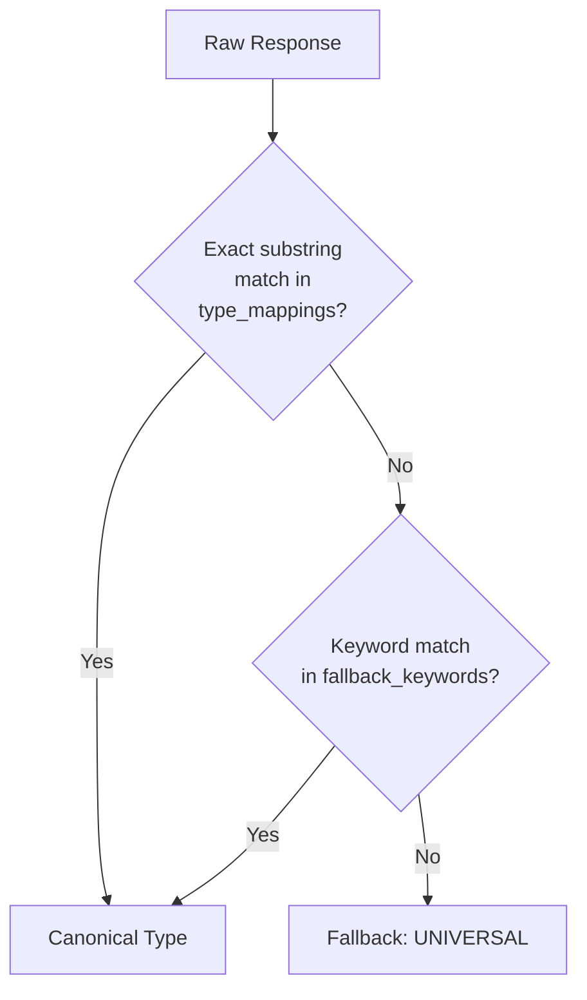

**Act**: The canonical type drives four downstream decisions:

| What | How |
| ---- | --- |
| Extraction prompt | Looked up in `prompt_config["extraction_files"]` per type |
| Field list | Loaded from `field_definitions.yaml` for that type |
| Token budget | `_calculate_max_tokens()` scales with field count |
| Processing path | `BANK_STATEMENT` routes to multi-turn extractor (Pattern 2) |

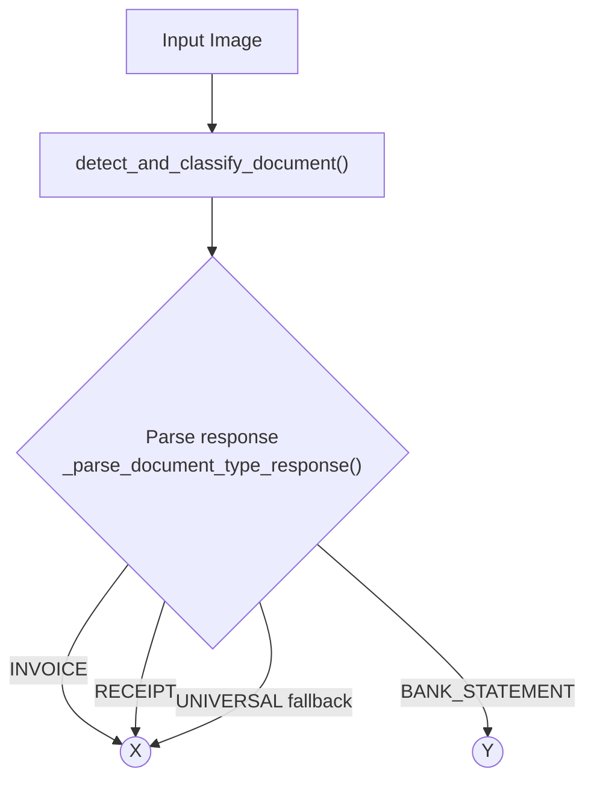

*Continued — extraction paths:*

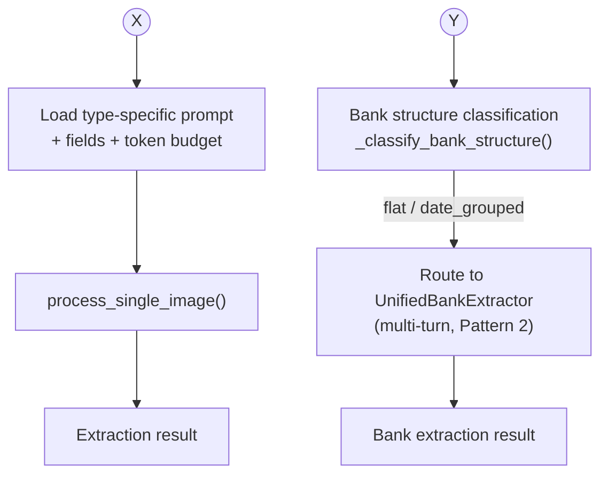

### Why this matters

The detection call is not a preprocessing step done by a separate classifier — it is the *same VLM* making an observation that the pipeline uses to decide what to do next. The model's first output literally selects its own second prompt. This is the simplest agentic pattern: one model call parameterizes another.

### What each document type extracts

| Type | Fields | Examples |
| ---- | ------ | -------- |
| INVOICE (14 fields) | ABN, supplier, payer, dates, line items, GST, totals | `BUSINESS_ABN: 12345678901`, `TOTAL_AMOUNT: $85.00` |
| RECEIPT (14 fields) | Same schema as invoice | Transaction date in `INVOICE_DATE` |
| TRAVEL_EXPENSE (9 fields) | Passenger, mode, route, travel dates, GST, total | `TRAVEL_MODE: plane`, `TRAVEL_ROUTE: SYD\|MEL` |
| VEHICLE_LOGBOOK (16 fields) | Vehicle details, odometer, km, business % | `BUSINESS_USE_PERCENTAGE: 0.65` |
| BANK_STATEMENT (5 fields) | Date range, descriptions, dates, amounts | Via multi-turn (Pattern 2) |

For standard documents (non-bank), extraction is single-turn: image + type-specific prompt -> structured `KEY: value` response. The prompt instructs the model to return `NOT_FOUND` for missing fields — a sentinel the evaluation layer handles explicitly.

### Standard document extraction flow

```mermaid
sequenceDiagram
    participant P as Pipeline
    participant M as InternVL3
    participant C as Cleaner

    P->>P: Load type-specific prompt from YAML
    P->>P: Calculate max_tokens for document type
    P->>M: Image + extraction prompt
    M-->>P: Raw KEY: value response
    P->>P: hybrid_parse_response(raw, expected_fields)
    P->>C: ExtractionCleaner.clean(parsed_data)
    C-->>P: Cleaned structured dict
```

---

## Pattern 2: Multi-Turn Bank Extraction (Observe-Reason-Act)

Bank statements are the hardest document type. Column layouts vary wildly across financial institutions — some have separate Debit/Credit columns, others use a signed Amount column, some include a running Balance, some don't. A single prompt cannot handle this diversity.

### The observe-reason-act loop

**Observe (Turn 0)**: Ask the VLM what column headers it sees.

```text
"List the exact column headers from the transaction table"
```

The model returns something like `"Date, Description, Debit, Credit, Balance"`.

**Reason**: `ColumnMatcher.match()` maps each detected header to a semantic role using pattern matching against `bank_column_patterns.yaml`. The resulting `ColumnMapping` determines the extraction strategy:

| Columns detected | Strategy selected |
| ---------------- | ----------------- |
| balance + debit/credit | `BALANCE_DESCRIPTION` — richest signal, enables Pattern 4 |
| balance + amount (no debit/credit) | `AMOUNT_DESCRIPTION` — signed amounts, negative = withdrawal |
| debit/credit (no balance) | `DEBIT_CREDIT_DESCRIPTION` — direct extraction |
| none of the above | `TABLE_EXTRACTION` — generic schema fallback |

```mermaid
flowchart LR
    H[Detected Headers] --> CM[ColumnMatcher]
    CM --> Q1{"Has Balance<br/>column?"}
    Q1 -->|Yes| D1(("D"))
    Q1 -->|No| D2(("E"))
```

*Has-balance branch:*

```mermaid
flowchart LR
    D1(("D")) --> Q2{"Has Debit/Credit<br/>columns?"}
    Q2 -->|Yes| S1["BALANCE_DESCRIPTION<br/>(balance + debit/credit)"]
    Q2 -->|No| Q4{Has Amount?}
    Q4 -->|Yes| S2["AMOUNT_DESCRIPTION<br/>(balance + signed amount)"]
    Q4 -->|No| S1
```

*No-balance branch:*

```mermaid
flowchart TD
    D2(("E")) --> Q3{"Has Amount<br/>column?"}
    Q3 -->|Yes| S2b["AMOUNT_DESCRIPTION<br/>(signed amount only)"]
    Q3 -->|No| Q5{Has Debit/Credit?}
    Q5 -->|Yes| S3["DEBIT_CREDIT_DESCRIPTION<br/>(no balance column)"]
    Q5 -->|No| S4["TABLE_EXTRACTION<br/>(schema fallback)"]
```

**Act (Turn 1)**: The extraction prompt is templated with the *actual detected column names*:

```python
prompt = prompt_template.format(
    balance_col=mapping.balance,        # e.g., "Balance"
    desc_col=mapping.description,       # e.g., "Description"
    debit_col=mapping.debit or "Debit",
    credit_col=mapping.credit or "Credit",
)
```

This makes every extraction prompt document-specific. The model is told to look for "Balance" because Turn 0 confirmed that column exists — not because we assumed it would.

```mermaid
sequenceDiagram
    participant P as Pipeline
    participant V as VLM
    participant M as ColumnMatcher

    P->>V: Turn 0: "What column headers do you see?"
    V-->>P: "Date | Description | Debit | Credit | Balance"
    P->>M: parse_headers() + match()
    M-->>P: ColumnMapping(date="Date", debit="Debit", credit="Credit", balance="Balance")
    Note over P: Strategy = BALANCE_DESCRIPTION<br/>(has balance + debit/credit)
    P->>V: Turn 1: "Extract transactions using columns:<br/>Balance={Balance}, Debit={Debit}, Credit={Credit}"
    V-->>P: Structured transaction rows
    P->>P: BalanceCorrector.correct_transactions() (Pattern 4)
    P->>P: TransactionFilter.filter_debits()
    P-->>P: Final extraction result
```

### Why multi-turn beats single-turn

| Challenge | Single-turn problem | Multi-turn solution |
| --------- | ------------------- | ------------------- |
| Variable column layouts | Model guesses column semantics | Turn 0 detects actual headers |
| Debit vs credit ambiguity | Misclassified transaction direction | Strategy-specific prompts with column names |
| Long transaction tables | Truncated output | Dedicated extraction turn with 4096 token budget |
| Balance column presence | One prompt can't handle all formats | Strategy adapts to what's actually there |

---

## Pattern 3: Self-Correcting OOM Fallback

For non-bank documents, the pipeline supports **batched inference** — processing multiple images in a single forward pass via InternVL3's `batch_chat()` API. But batches can fail unpredictably: tile counts vary across images, and a batch that fits in VRAM for simple documents may OOM on complex ones.

### The observe-reason-act loop

**Observe**: `torch.cuda.OutOfMemoryError` during `model.batch_chat()`.

**Reason**: The batch is too large for available VRAM. But we don't know which image caused it — so split the batch in half and retry both halves.

**Act**: Recursive halving with GPU cleanup done *outside* the except block:

```python
oom = False
try:
    responses = self.model.batch_chat(...)
except torch.cuda.OutOfMemoryError:
    oom = True  # Flag — exit except ASAP

if oom:
    # Outside except — traceback released, tensors can be freed
    del pixel_values, all_pixel_values, num_patches_list
    gc.collect()
    torch.cuda.empty_cache()

    mid = len(image_paths) // 2
    r1 = self.batch_detect_documents(image_paths[:mid])
    r2 = self.batch_detect_documents(image_paths[mid:])
    return r1 + r2
```

Base case: batch size 1 falls back to sequential `detect_and_classify_document()`.

**Why cleanup must be outside except**: Inside an `except` block, Python's traceback holds references to all intermediate activation tensors from the failed forward pass. `torch.cuda.empty_cache()` inside `except` is a no-op — the tensors are still referenced. Setting `oom = True` and checking after the block closes releases the traceback first.

```mermaid
flowchart TD
    A["batch_chat(N images)"] --> B{OOM?}
    B -->|No| C[Return results]
    B -->|Yes| D["Set oom=True<br/>(exit except block)"]
    D --> Z(("Z"))

    style D fill:#fee,stroke:#c00
```

*Continued — cleanup and decision:*

```mermaid
flowchart LR
    Z(("Z")) --> E["del tensors<br/>gc.collect()<br/>empty_cache()"]
    E --> F{N > 1?}
    F -->|No| J["Sequential fallback<br/>detect_and_classify_document()"]
    J --> C[Return results]
    F -->|Yes| X(("X"))

    style E fill:#efe,stroke:#0a0
```

*Continued — recursive split:*

```mermaid
flowchart TD
    X(("X")) --> G["Split: N/2 + N/2"]
    G --> H["batch_chat(first half)"]
    G --> I["batch_chat(second half)"]
    H --> B{OOM?}
    I --> B
    B -->|No| C[Return results]
    B -->|Yes| R["Recurse: halve again"]
```

### Why this is agentic

The pipeline observes a runtime failure (OOM), reasons about the cause (batch too large for available VRAM), and acts by adapting its strategy — all without human intervention. The recursive halving finds the largest batch size that fits, maximizing throughput while guaranteeing completion. Combined with `_resilient_generate()` (3-attempt retry with progressively minimal generation configs), the system self-corrects at multiple levels.

---

## Pattern 4: Balance Arithmetic Self-Verification

After the VLM extracts bank transactions, the pipeline uses an **accounting invariant** to detect and correct misclassified debits and credits. This is the most "agentic" pattern — the system verifies its own work using domain knowledge.

### The invariant

For any consecutive pair of transactions with parseable balances:

```text
balance_delta = current_balance - previous_balance

if delta < 0 --> transaction is a DEBIT  of abs(delta)
if delta > 0 --> transaction is a CREDIT of delta
if delta ~ 0 --> no significant transaction (within tolerance)
```

### The observe-reason-act loop

**Observe**: Walk the extracted transaction rows in chronological order, maintaining a sliding `prev_balance`. For each row, compute `balance_delta = current_balance - prev_balance`.

**Reason**: Compare the delta's sign against the VLM's classification:
- Delta negative but VLM put amount in Credit -> misclassified
- Delta positive but VLM put amount in Debit -> misclassified
- Delta matches the VLM's column -> confirmed correct

**Act**: Three possible corrections:

| Scenario | Action |
| -------- | ------ |
| VLM column matches delta | Confirm; clear the other column |
| VLM put amount in wrong column | **Swap**: move value to correct column |
| Neither column matches expected amount | **Derive**: set from the delta |

The corrector only *swaps* values between columns — it never recalculates amounts from the VLM's raw output. Amounts are derived from the delta only as a last resort.

```mermaid
flowchart LR
    A[Extracted transaction rows] --> B{Has parseable balance?}
    B -->|No| C[Keep original row]
    C --> UU(("U"))
    B -->|Yes| DD(("D"))
```

*Continued — delta sign decision:*

```mermaid
flowchart LR
    DD(("D")) --> D1["Compute delta =<br/>current_balance - prev_balance"]
    D1 --> E{"delta < 0?<br/>(balance decreased)"}
    E -->|Yes| FF(("F"))
    E -->|No| G{"delta > 0?<br/>(balance increased)"}
    G -->|Yes| HH(("H"))
    G -->|No| II(("I"))
```

*Debit path (delta < 0):*

```mermaid
flowchart LR
    FF(("F")) --> F1["Expected: DEBIT of |delta|"]
    F1 --> J{LLM debit matches?}
    J -->|Yes| K["Confirm debit<br/>clear credit"]
    J -->|No| L{LLM credit matches?}
    L -->|Yes| M["SWAP: credit -> debit<br/>type_corrections += 1"]
    L -->|No| N["DERIVE: debit = |delta|"]
    K --> UU(("U"))
    M --> UU
    N --> UU
```

*Credit path (delta > 0):*

```mermaid
flowchart TD
    HH(("H")) --> H1["Expected: CREDIT of delta"]
    H1 --> O{LLM credit matches?}
    O -->|Yes| P["Confirm credit<br/>clear debit"]
    O -->|No| Q{LLM debit matches?}
    Q -->|Yes| R["SWAP: debit -> credit<br/>type_corrections += 1"]
    Q -->|No| S["DERIVE: credit = delta"]
    II(("I")) --> T[Keep original row]
    P --> UU(("U"))
    R --> UU
    S --> UU
    T --> UU
    UU --> U["Update prev_balance<br/>--> next row"]
```

### Worked example

The VLM extracts:

| Row | Description | Debit | Credit | Balance |
| --- | ----------- | ----- | ------ | ------- |
| 1 | Opening Balance | -- | -- | $1,000.00 |
| 2 | Electric bill | -- | $150.00 | $850.00 |
| 3 | Salary deposit | -- | $2,000.00 | $2,850.00 |

**Row 2**: `delta = 850 - 1000 = -150` (negative = debit). The VLM put $150.00 in *Credit*, but the delta says Debit. **Swap**: move $150.00 to Debit, clear Credit. `type_corrections += 1`.

**Row 3**: `delta = 2850 - 850 = +2000` (positive = credit). The VLM put $2,000.00 in Credit and the delta confirms it. No correction needed.

Corrected output:

| Row | Description | Debit | Credit | Balance |
| --- | ----------- | ----- | ------ | ------- |
| 1 | Opening Balance | -- | -- | $1,000.00 |
| 2 | Electric bill | $150.00 | -- | $850.00 |
| 3 | Salary deposit | -- | $2,000.00 | $2,850.00 |

### Why this matters

The pipeline treats the VLM's extraction as a *hypothesis*, not ground truth. It uses an external invariant (accounting math) to verify and correct the model's output — a form of self-verification that doesn't require another model call. This is the pattern most likely to generalize: any domain with checkable invariants can use post-extraction verification.

---

## Configuration as Agent State

Agentic systems need state — the parameters that shape their observe-reason-act loops. In this pipeline, all tuneable state lives in YAML with a strict precedence cascade:

```mermaid
flowchart LR
    CLI["CLI flags<br/>(highest priority)"] --> YAML["run_config.yml"]
    YAML --> ENV["ENV vars<br/>(IVL_ prefix)"]
    ENV --> DEF["Dataclass defaults<br/>(lowest priority)"]
```

No hardcoded values in Python code. Every magic number has a YAML home:

| Config source | Controls |
| ------------- | -------- |
| `config/run_config.yml` | Model path, dtype, max_tiles, batch sizes, generation params, GPU thresholds |
| `config/field_definitions.yaml` | Fields per document type, min_tokens, evaluation thresholds |
| `prompts/document_type_detection.yaml` | Detection prompts, type mappings, fallback type |
| `prompts/internvl3_prompts.yaml` | Extraction prompts per document type |
| `config/bank_prompts.yaml` | Multi-turn bank extraction prompt templates |
| `config/bank_column_patterns.yaml` | Header-to-semantic-column matching patterns |

This means every agentic decision — which type to fallback to, how many tokens to budget, what patterns match a column header — is configurable without code changes. Prompts are version-controlled separately from logic.

---

## Summary: Observe-Reason-Act Across the Pipeline

| Pattern | Observe | Reason | Act |
| ------- | ------- | ------ | --- |
| **Dynamic Routing** | VLM classifies document type | Map response to canonical type via YAML | Select type-specific prompt, fields, token budget |
| **Multi-Turn Bank** | VLM reads column headers (Turn 0) | `ColumnMatcher` maps to semantic roles, selects strategy | Template Turn 1 prompt with detected column names |
| **OOM Fallback** | CUDA OOM error | Batch too large for VRAM | Recursively halve batch until it fits |
| **Balance Verification** | Extracted values + balance column | `balance_delta` determines true type | Swap or derive correct debit/credit |

### Key architectural decisions through the agentic lens

| Decision | Agentic justification |
| -------- | --------------------- |
| Two-phase pipeline (detect then extract) | Pattern 1: model's first observation parameterizes its second action |
| Multi-turn bank extraction | Pattern 2: Turn 0 observation directly shapes Turn 1 prompt |
| Greedy decoding (temperature=0) | Agents need deterministic observations — creative variation hurts downstream reasoning |
| Balance correction as post-processing | Pattern 4: self-verification using domain invariants, zero additional inference cost |
| Batch inference with OOM fallback | Pattern 3: self-healing runtime that adapts to available resources |
| Data parallelism over pipeline parallelism | Split the data, not the model — 4x throughput vs ~1x with pipeline bubbles |
| Threads over processes for multi-GPU | GIL release during CUDA kernels makes threads sufficient; zero IPC overhead |
| FlashAttention2 (planned) | O(N) vs O(N²) memory — would enable larger batches, 2-3x throughput on A10G |
| YAML-driven everything | Agent state must be inspectable, tuneable, and version-controlled |
| Position-aware F1 over set-based F1 | Evaluation must reflect the agent's actual output ordering, not just content |
| Duck-typed processor interface | New models just implement `generate()` + the two pipeline hooks — no base class coupling |

---

## What We Don't Do (Yet)

**Infrastructure:**

- **FlashAttention2** — The highest-impact optimisation remaining. Would reclaim ~1-2 GB of VRAM per attention layer on A10G, enabling larger batch sizes and 2-3x throughput. Requires `flash-attn` package and Ampere+ GPU architecture.

**Pipeline capabilities:**

- **Re-prompting on low confidence** — Detection returns a confidence score, but low confidence just uses the fallback type. No retry with a refined prompt.
- **Tool use** — The VLM has no access to calculators, databases, or web search. All verification is Python code.
- **Explicit chain-of-thought planning** — Strategy selection is deterministic code, not model reasoning.
- **Multi-model consensus** — We support InternVL3 and Llama but never run both on the same document to cross-check.
- **Iterative refinement** — Malformed extraction output is parsed as-is, never retried with a corrective prompt.
- **Human-in-the-loop escalation** — Low-confidence or heavily-corrected results are not flagged for review.

---

## References

1. HuggingFace, ["Handling Big Models for Inference"](https://huggingface.co/docs/accelerate/en/concept_guides/big_model_inference) — Accelerate documentation on `device_map="auto"` behaviour
2. Yile Gu et al., ["PipeFill: Using GPUs During Bubbles in Pipeline-Parallel LLM Training"](https://arxiv.org/abs/2410.07192) — CMU, 2024. Pipeline bubble measurements (15-60% idle)
3. NVIDIA TensorRT-LLM, [Issue #1102: Pipeline Parallelism Performance](https://github.com/NVIDIA/TensorRT-LLM/issues/1102) — Benchmarks showing PP2 slower than single GPU
4. SuperFastPython, ["Forking is 20x Faster Than Spawning"](https://superfastpython.com/fork-faster-than-spawn/) — Process creation benchmarks (spawn ~42 ms vs fork ~2 ms)
5. HuggingFace Transformers, [Issue #16863: Import Time](https://github.com/huggingface/transformers/issues/16863) — `import transformers` taking 5+ seconds
6. HuggingFace Transformers, [Issue #23870: DataLoader Slowdown](https://github.com/huggingface/transformers/issues/23870) — Combined torch + transformers import at 23.6 seconds
7. PyTorch, ["Multiprocessing Best Practices"](https://docs.pytorch.org/docs/stable/notes/multiprocessing.html) — CUDA tensor sharing, IPC handles, shared memory
8. HuggingFace Transformers, [Issue #25197: Multithreading with Quantisation](https://github.com/huggingface/transformers/issues/25197) — Thread-unsafe bitsandbytes behaviour
9. PyTorch, ["CUDA Semantics"](https://docs.pytorch.org/docs/stable/notes/cuda.html) — GIL release during CUDA operations, thread-local device selection
10. Fireworks AI, ["Speed, Python: Pick Two"](https://fireworks.ai/blog/speed-python-pick-two-how-cuda-graphs-enable-fast-python-code-for-deep-learning) — Profiling showing ~57% CPU overhead at batch-size-1 (LLaMA-2 7B, A100)
