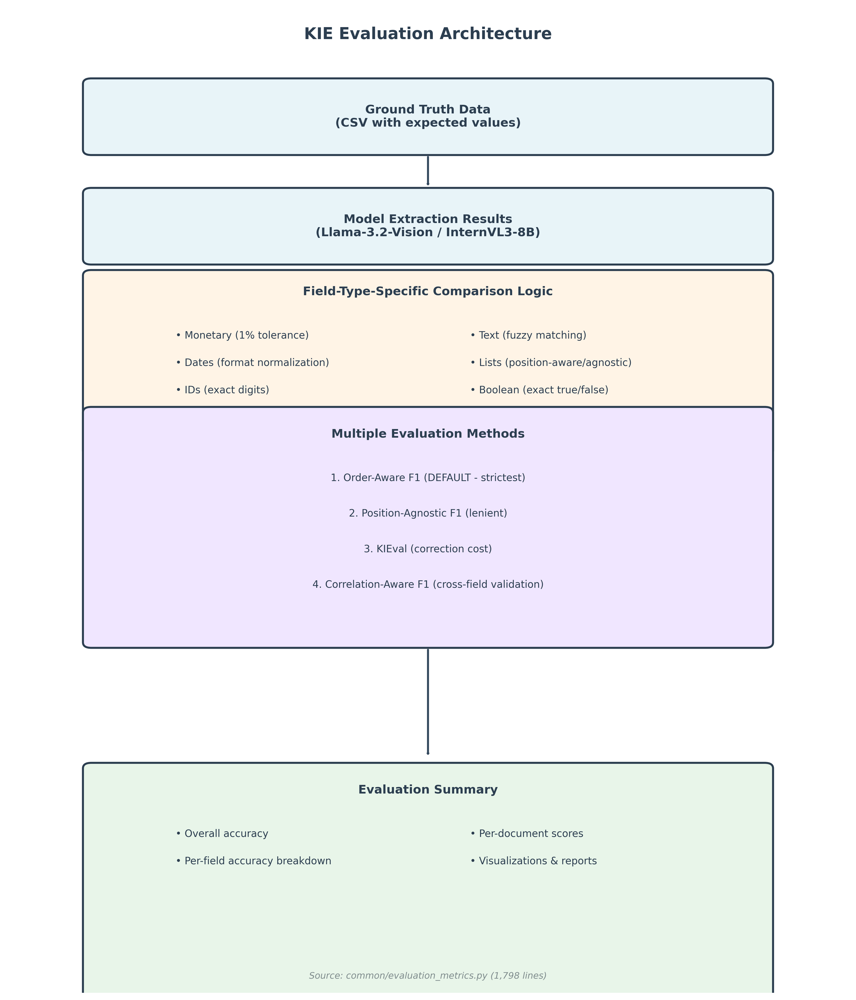

# Key Information Extraction: Evaluation Methodology

**Comparing Vision-Language Models for Business Document Processing**

---

## Table of Contents

1. [Introduction](#page-1-introduction)
2. [Evaluation Architecture](#page-2-evaluation-architecture)
3. [Field-Type-Specific Comparison Logic](#page-3-field-type-specific-comparison)
4. [Understanding Evaluation Metrics](#page-4-understanding-evaluation-metrics)
5. [Metric Comparison: Examples & Trade-offs](#page-5-metric-comparison)
6. [Document-Aware Evaluation](#page-6-document-aware-evaluation)
7. [Quality Thresholds & Outputs](#page-7-quality-thresholds)
8. [Implementation Details](#page-8-implementation-details)

---

<a name="page-1-introduction"></a>
## Page 1: Introduction

### The Challenge

Evaluating **Key Information Extraction (KIE)** from business documents requires more than simple exact matching:

- Documents vary in structure (invoices vs receipts vs bank statements)
- OCR introduces noise and variations
- Field types have different tolerance requirements
- Order matters for some fields (transactions) but not others (metadata)

### Our Approach

We implement **multiple evaluation methods** with **field-type-specific logic** to:

1. Accurately assess extraction quality across document types
2. Provide nuanced scoring (0.0-1.0) rather than binary correct/incorrect
3. Support different use cases (strict production vs exploratory research)
4. Enable fair model comparison (Llama-3.2-Vision vs InternVL3)

---

<a name="page-2-evaluation-architecture"></a>
## Page 2: Evaluation Architecture

### Core Components



**Architecture Flow:**

1. **Ground Truth Data** → CSV file with expected field values
2. **Model Extraction Results** → Output from Llama-3.2-Vision or InternVL3-8B
3. **Field-Type-Specific Comparison** → Monetary, dates, IDs, text, lists, boolean
4. **Multiple Evaluation Methods** → 4 different metric options for different use cases
5. **Evaluation Summary** → Comprehensive metrics, visualizations, and reports

### Module Location

**Source:** `common/evaluation_metrics.py` (1,798 lines)

**Key Functions:**
- `calculate_field_accuracy()` - Field-type routing
- `evaluate_extraction_results()` - Batch evaluation orchestration
- `calculate_field_accuracy_with_method()` - Metric selection router

---

<a name="page-3-field-type-specific-comparison"></a>
## Page 3: Field-Type-Specific Comparison Logic

### Why Field Types Matter

Different field types require different comparison strategies:

| Field Type | Example Field | Comparison Logic | Rationale |
|------------|---------------|------------------|-----------|
| **Monetary** | `TOTAL_AMOUNT` | Numeric with 1% tolerance | Handles rounding, formatting ($1,234.56 vs 1234.56) |
| **Numeric ID** | `BUSINESS_ABN` | Exact digits only | Critical identifiers require precision |
| **Phone** | `BUSINESS_PHONE` | Digits with partial credit | OCR errors common, 80% digit match = 0.8 score |
| **Date** | `INVOICE_DATE` | Format normalization | "16/07/2025" = "16-Jul-25" = "Jul 16, 2025" |
| **List** | `LINE_ITEM_DESCRIPTIONS` | Overlap-based or position-based | Depends on evaluation method chosen |
| **Boolean** | `IS_GST_INCLUDED` | Strict true/false | Binary values need exact match |
| **Text** | `SUPPLIER_NAME` | Fuzzy word-overlap (≥80%) | Handles variations like "Pty Ltd" vs "PTY LTD" |

### Example: Monetary Field Comparison

```python
Extracted:     "$1,234.56"
Ground Truth:  "1234.56"

1. Normalize: Remove $, commas → "1234.56" = "1234.56"
2. Parse to float: 1234.56 = 1234.56
3. Calculate tolerance: 1234.56 * 0.01 = 12.35
4. Check difference: |1234.56 - 1234.56| = 0.00 ≤ 12.35
5. Result: MATCH (score = 1.0)
```

### Example: Date Field Comparison

```python
Extracted:     "16-Jul-25"
Ground Truth:  "16/07/2025"

1. Extract components: ["16", "07", "25"] vs ["16", "07", "2025"]
2. Normalize year: "25" → "2025"
3. Compare components: {16, 07, 2025} = {16, 07, 2025}
4. Result: MATCH (score = 1.0)
```

### Example: Text Field Fuzzy Matching

```python
Extracted:     "Test Company"
Ground Truth:  "Test Company Pty Ltd"

1. Lowercase & split: {"test", "company"} vs {"test", "company", "pty", "ltd"}
2. Calculate overlap: intersection = 2, union = 4
3. Word overlap ratio: 2/4 = 0.50
4. Check threshold: 0.50 < 0.80
5. Substring check: "Test Company" in "Test Company Pty Ltd" ✓
6. Result: FUZZY MATCH (score = 0.9)
```

---

<a name="page-4-understanding-evaluation-metrics"></a>
## Page 4: Understanding Evaluation Metrics

### 1. Exact Match Accuracy

**Definition:** Binary scoring - either 100% match or 0% match.

**Example:**
```python
Extracted:     "Test Company Pty Ltd"
Ground Truth:  "Test Company Pty Ltd"
Score:         1.0 (MATCH)

Extracted:     "Test Company"
Ground Truth:  "Test Company Pty Ltd"
Score:         0.0 (MISS)
```

**Limitations:**
- Too strict for real-world OCR noise
- No partial credit for close matches
- Penalizes minor formatting differences

**When to use:** Critical fields requiring absolute precision (e.g., legal document IDs)

---

### 2. ANLS (Average Normalized Levenshtein Similarity)

**Definition:** Character-level edit distance normalized by string length, with 0.5 threshold.

**Formula:**
```
similarity = 1 - (edit_distance / max_length)
ANLS score = similarity if similarity ≥ 0.5 else 0.0
```

**Example 1: High Similarity**
```python
Extracted:     "Test Compnay Pty Ltd"  # Typo: "Compnay"
Ground Truth:  "Test Company Pty Ltd"

Edit Distance: 2 (delete 'n', insert 'an')
Max Length:    21
Similarity:    1 - (2/21) = 0.905
ANLS Score:    0.905 ✓ (above 0.5 threshold)
```

**Example 2: Low Similarity**
```python
Extracted:     "ABC Corp"
Ground Truth:  "Test Company Pty Ltd"

Edit Distance: 18
Max Length:    21
Similarity:    1 - (18/21) = 0.143
ANLS Score:    0.0 (below 0.5 threshold)
```

**Advantages:**
- Handles OCR errors gracefully
- Standard in DocVQA/Document AI research
- Character-level precision

**Limitations:**
- Single-value fields only (not for lists)
- 0.5 threshold may be too lenient/strict depending on use case

**Our Implementation:** Used for text fields in `calculate_field_accuracy_f1()` when Levenshtein package available

---

### 3. Position-Agnostic F1

**Definition:** Set-based matching - items only need to match in value, order doesn't matter.

**How it works:**
```python
True Positives (TP):  Extracted items that match ANY ground truth item
False Positives (FP): Extracted items with no ground truth match
False Negatives (FN): Ground truth items not matched by extraction

Precision = TP / (TP + FP)
Recall    = TP / (TP + FN)
F1 Score  = 2 × (Precision × Recall) / (Precision + Recall)
```

**Example: Perfect Match (Different Order)**
```python
Extracted:    ["banana", "apple", "cherry"]
Ground Truth: ["apple", "banana", "cherry"]

Matching:
  "banana" → matches GT "banana" ✓ (TP)
  "apple"  → matches GT "apple"  ✓ (TP)
  "cherry" → matches GT "cherry" ✓ (TP)

TP = 3, FP = 0, FN = 0
Precision = 3/(3+0) = 1.0
Recall    = 3/(3+0) = 1.0
F1 Score  = 1.0 (100%)
```

**Example: Partial Match (Over-extraction)**
```python
Extracted:    ["apple", "banana", "cherry", "durian"]
Ground Truth: ["apple", "banana", "cherry"]

Matching:
  "apple"  → matches GT "apple"  ✓ (TP)
  "banana" → matches GT "banana" ✓ (TP)
  "cherry" → matches GT "cherry" ✓ (TP)
  "durian" → no GT match         ✗ (FP)

TP = 3, FP = 1, FN = 0
Precision = 3/(3+1) = 0.75
Recall    = 3/(3+0) = 1.0
F1 Score  = 2×(0.75×1.0)/(0.75+1.0) = 0.857 (85.7%)
```

**Example: Partial Match (Under-extraction)**
```python
Extracted:    ["apple", "banana"]
Ground Truth: ["apple", "banana", "cherry"]

Matching:
  "apple"  → matches GT "apple"  ✓ (TP)
  "banana" → matches GT "banana" ✓ (TP)
  Missing: "cherry"              ✗ (FN)

TP = 2, FP = 0, FN = 1
Precision = 2/(2+0) = 1.0
Recall    = 2/(2+1) = 0.667
F1 Score  = 2×(1.0×0.667)/(1.0+0.667) = 0.800 (80%)
```

**When to use:** Metadata fields where order doesn't matter (e.g., unordered line items, features list)

**Our Implementation:** `calculate_field_accuracy_f1_position_agnostic()` (line 1334)

---

### 4. Position-Aware F1 (Order-Aware F1)

**Definition:** Position-based matching - items must match in BOTH value AND position.

**How it works:**
```python
Compare position-by-position:
  Position i: If extracted[i] matches ground_truth[i] → TP
              If mismatch at position i → FN (wrong item)
  Extra positions in extracted → FP
  Missing positions in ground truth → FN
```

**Example: Perfect Match (Same Order)**
```python
Extracted:    ["apple", "banana", "cherry"]
Ground Truth: ["apple", "banana", "cherry"]

Position 0: "apple"  = "apple"  ✓ (TP)
Position 1: "banana" = "banana" ✓ (TP)
Position 2: "cherry" = "cherry" ✓ (TP)

TP = 3, FP = 0, FN = 0
F1 Score = 1.0 (100%)
```

**Example: Order Matters!**
```python
Extracted:    ["banana", "apple", "cherry"]
Ground Truth: ["apple", "banana", "cherry"]

Position 0: "banana" ≠ "apple"  ✗ (FN - expected apple, got banana)
Position 1: "apple"  ≠ "banana" ✗ (FN - expected banana, got apple)
Position 2: "cherry" = "cherry" ✓ (TP)

TP = 1, FP = 0, FN = 2
Precision = 1/(1+0) = 1.0
Recall    = 1/(1+2) = 0.333
F1 Score  = 2×(1.0×0.333)/(1.0+0.333) = 0.500 (50%)
```

**Example: Bank Statement Transactions (Why Position Matters)**
```python
Ground Truth Transactions:
  Date          Description           Amount
  ────────────  ──────────────────   ─────────
  16-Jul-25  |  EFTPOS Woolworths  |  $45.20
  17-Jul-25  |  Salary Deposit     |  $3000.00
  18-Jul-25  |  EFTPOS Pizza Hut   |  $28.50

Extracted (CORRECT ORDER):
  TRANSACTION_DATES:          ["16-Jul-25", "17-Jul-25", "18-Jul-25"]
  LINE_ITEM_DESCRIPTIONS:     ["EFTPOS Woolworths", "Salary Deposit", "EFTPOS Pizza Hut"]
  TRANSACTION_AMOUNTS_PAID:   ["45.20", "3000.00", "28.50"]

Position-Aware F1: 100% ✓
→ Date[0] corresponds to Description[0] and Amount[0]


Extracted (WRONG ORDER):
  TRANSACTION_DATES:          ["17-Jul-25", "16-Jul-25", "18-Jul-25"]
  LINE_ITEM_DESCRIPTIONS:     ["EFTPOS Woolworths", "Salary Deposit", "EFTPOS Pizza Hut"]
  TRANSACTION_AMOUNTS_PAID:   ["45.20", "3000.00", "28.50"]

Position-Aware F1: 33% ✗
→ Date[0] "17-Jul-25" does NOT correspond to Description[0] "EFTPOS Woolworths"
→ This misalignment would corrupt financial analysis!

Position-Agnostic F1: 100% (but WRONG - doesn't catch the error!)
```

**When to use:** Sequential/temporal data where order has semantic meaning (transactions, events, timelines)

**Our Implementation:** `calculate_field_accuracy_f1()` (line 1539) - **DEFAULT method**

---

<a name="page-5-metric-comparison"></a>
## Page 5: Metric Comparison - When to Use Each

### Comparison Matrix

| Metric | Strictness | List Support | Order Sensitivity | Best Use Case |
|--------|-----------|--------------|-------------------|---------------|
| **Exact Match** | Strictest | ✗ | N/A | Legal IDs, exact strings |
| **ANLS** | Moderate | ✗ | N/A | OCR text with typos |
| **Position-Agnostic F1** | Lenient | ✓ | Low | Unordered metadata |
| **Position-Aware F1** | Strict | ✓ | High | Ordered transactions |
| **KIEval** | Context-dependent | ✓ | Low | Application cost analysis |
| **Correlation-Aware F1** | Very Strict | ✓ | Very High | Multi-field validation |

---

### Real-World Scenario: Invoice Line Items

**Ground Truth:**
```
LINE_ITEM_DESCRIPTIONS:  ["Widget A", "Widget B", "Widget C"]
LINE_ITEM_PRICES:        ["$10.00", "$20.00", "$30.00"]
LINE_ITEM_QUANTITIES:    ["2", "1", "3"]
```

**Extraction Scenario 1: Correct Values, Wrong Order**
```python
Extracted:
  LINE_ITEM_DESCRIPTIONS: ["Widget B", "Widget A", "Widget C"]
  LINE_ITEM_PRICES:       ["$20.00", "$10.00", "$30.00"]
  LINE_ITEM_QUANTITIES:   ["1", "2", "3"]

Position-Agnostic F1:  100% ✓ (all items present)
Position-Aware F1:     33%  ✗ (only position 2 matches)
Correlation-Aware F1:  100% ✓ (Widget B still paired with $20/qty 1)

Best Choice: Correlation-Aware F1 (detects semantic alignment)
```

**Extraction Scenario 2: Over-extraction**
```python
Extracted:
  LINE_ITEM_DESCRIPTIONS: ["Widget A", "Widget B", "Widget C", "Widget D"]
  LINE_ITEM_PRICES:       ["$10.00", "$20.00", "$30.00", "$40.00"]

Position-Agnostic F1:  75%  (3 TP, 1 FP, 0 FN)
Position-Aware F1:     75%  (same - no order errors)
Exact Match:           0%   (too strict)

Best Choice: Position-Agnostic F1 (fair penalty for hallucination)
```

**Extraction Scenario 3: Corrupted Text (OCR Errors)**
```python
Extracted:          "Test Compnay Pty Ltd"  # OCR error: 'n' inserted
Ground Truth:       "Test Company Pty Ltd"

Exact Match:   0%    (too harsh)
ANLS:          90.5% (fair - minor error)
Fuzzy Match:   90%   (substring logic)

Best Choice: ANLS (standard for OCR evaluation)
```

---

### Why We Use Position-Aware F1 as Default

**Key Reasons:**

1. **Semantic Correctness:** Bank transactions, line items, and temporal data require order preservation
2. **Real-World Application:** Downstream systems (accounting, analytics) depend on correct sequencing
3. **Error Detection:** Catches model mistakes that position-agnostic methods miss
4. **Production Readiness:** Stricter evaluation → higher confidence in deployment

**Trade-off:** May underestimate performance for inherently unordered fields

**Solution:** Document-type-specific evaluation (see Page 6)

---

<a name="page-6-document-aware-evaluation"></a>
## Page 6: Document-Aware Evaluation

### Adapting to Document Types

Different document types have different field requirements:

```python
┌─────────────────────┬──────────────┬─────────────────────────────────┐
│ Document Type       │ Field Count  │ Key Field Categories            │
├─────────────────────┼──────────────┼─────────────────────────────────┤
│ Invoice             │ 14           │ Business details, line items,   │
│                     │              │ financial totals, tax           │
├─────────────────────┼──────────────┼─────────────────────────────────┤
│ Receipt             │ 14           │ Same as invoice                 │
│                     │              │ (INVOICE_DATE = transaction dt) │
├─────────────────────┼──────────────┼─────────────────────────────────┤
│ Bank Statement      │ 5 (eval)     │ Transactions, dates, amounts    │
│                     │ +2 (valid)   │ (+2 validation-only fields)     │
└─────────────────────┴──────────────┴─────────────────────────────────┘
```

### Invoice/Receipt Fields (14 fields)

```yaml
Identification:
  - DOCUMENT_TYPE

Business Details:
  - BUSINESS_ABN
  - SUPPLIER_NAME
  - BUSINESS_ADDRESS

Customer Details:
  - PAYER_NAME
  - PAYER_ADDRESS

Temporal:
  - INVOICE_DATE

Line Items:
  - LINE_ITEM_DESCRIPTIONS
  - LINE_ITEM_QUANTITIES
  - LINE_ITEM_PRICES
  - LINE_ITEM_TOTAL_PRICES

Financial:
  - IS_GST_INCLUDED
  - GST_AMOUNT
  - TOTAL_AMOUNT
```

### Bank Statement Fields (5 evaluation fields)

```yaml
Identification:
  - DOCUMENT_TYPE

Temporal:
  - STATEMENT_DATE_RANGE

Transactions:
  - LINE_ITEM_DESCRIPTIONS      # Transaction descriptions
  - TRANSACTION_DATES
  - TRANSACTION_AMOUNTS_PAID

Validation-Only (NOT evaluated):
  - TRANSACTION_AMOUNTS_RECEIVED  # Used for balance calculation
  - ACCOUNT_BALANCE               # Used for mathematical validation
```

**Why exclude validation-only fields?**
- `TRANSACTION_AMOUNTS_RECEIVED` is often calculable from `TRANSACTION_AMOUNTS_PAID` (negative values)
- `ACCOUNT_BALANCE` requires complex mathematical validation logic
- These fields support validation but don't directly measure extraction quality

---

### Field Count Verification

**Source:** `config/field_definitions.yaml`

```yaml
document_fields:
  invoice:
    count: 14
    fields: [DOCUMENT_TYPE, BUSINESS_ABN, ...]

  receipt:
    count: 14
    fields: [DOCUMENT_TYPE, BUSINESS_ABN, ...]

  bank_statement:
    count: 5
    fields: [DOCUMENT_TYPE, STATEMENT_DATE_RANGE, ...]
```

**Implementation:** `common/config.py::get_document_type_fields()` (line 717)

---

### Document Type Detection & Field Selection

```python
# In evaluation_metrics.py (line 551-569)

# 1. Extract document type from model output
doc_type_raw = extracted_data.get("DOCUMENT_TYPE", "invoice").lower()

# 2. Map to canonical type
type_mapping = {
    "invoice": "invoice",
    "tax invoice": "invoice",
    "estimate": "invoice",
    "receipt": "receipt",
    "bank statement": "bank_statement",
    "statement": "bank_statement",
}
doc_type = type_mapping.get(doc_type_raw, "invoice")

# 3. Get document-specific fields
from common.config import get_document_type_fields
fields_to_evaluate = get_document_type_fields(doc_type)

# 4. Evaluate only relevant fields
for field in fields_to_evaluate:
    extracted_value = extracted_data.get(field, "NOT_FOUND")
    ground_truth_value = gt_data.get(field, "NOT_FOUND")
    accuracy_score = calculate_field_accuracy(
        extracted_value, ground_truth_value, field
    )
```

**Benefits:**
- No penalty for missing fields that don't exist on document type
- Fair comparison across heterogeneous datasets
- Accurate per-document-type metrics

---

<a name="page-7-quality-thresholds"></a>
## Page 7: Quality Thresholds & Outputs

### Deployment Readiness Thresholds

```python
# From config.py (lines 424-435)

DEPLOYMENT_READY_THRESHOLD = 0.90      # 90% - Production ready
PILOT_READY_THRESHOLD = 0.80           # 80% - Pilot testing
NEEDS_OPTIMIZATION_THRESHOLD = 0.70    # 70% - Needs improvement

# Field-level thresholds
EXCELLENT_FIELD_THRESHOLD = 0.90       # ≥90% = Excellent
GOOD_FIELD_THRESHOLD = 0.80            # ≥80% = Good
POOR_FIELD_THRESHOLD = 0.50            # <50% = Poor
```

### Evaluation Summary Structure

```python
{
    "overall_accuracy": 0.87,              # Average of per-image accuracies
    "overall_correct": 245.8,              # Sum of field scores (partial credit)
    "overall_total": 280,                  # Total fields evaluated

    "field_accuracies": {
        "TOTAL_AMOUNT": {
            "accuracy": 0.95,              # 95% accuracy
            "correct": 19.0,               # 19.0 points (out of 20 documents)
            "total": 20                    # Evaluated in 20 documents
        },
        "LINE_ITEM_DESCRIPTIONS": {
            "accuracy": 0.78,              # 78% accuracy (F1 score)
            "correct": 15.6,
            "total": 20
        },
        # ... all other fields
    },

    "images_evaluated": 20,
    "best_performing_image": "invoice_001.png",
    "best_performance_accuracy": 0.98,
    "worst_performing_image": "receipt_042.png",
    "worst_performance_accuracy": 0.65,
    "perfect_documents": 5,                # Documents with ≥99% accuracy

    "summary_stats": {
        "best_fields": [
            ("DOCUMENT_TYPE", {"accuracy": 1.0, ...}),
            ("BUSINESS_ABN", {"accuracy": 0.95, ...}),
            # ... top 5
        ],
        "worst_fields": [
            ("LINE_ITEM_QUANTITIES", {"accuracy": 0.62, ...}),
            # ... bottom 5
        ],
        "avg_field_accuracy": 0.83
    }
}
```

---

### Output Files Generated

```bash
# 1. Raw Extraction Results
{model}_batch_extraction_{timestamp}.csv
  → Columns: image_name, FIELD_1, FIELD_2, ..., FIELD_N
  → One row per document

# 2. Detailed Evaluation Metrics
{model}_evaluation_results_{timestamp}.json
  → Complete evaluation summary (structure above)
  → Field-level details, per-document scores

# 3. Executive Summary
{model}_executive_summary_{timestamp}.md
  → Human-readable markdown report
  → Key findings, recommendations

# 4. Deployment Checklist
{model}_deployment_checklist_{timestamp}.md
  → Production readiness assessment
  → Field-level recommendations

# 5. Visualizations (if enabled)
{model}_field_accuracy_bar_{timestamp}.png
{model}_performance_dashboard_{timestamp}.png
{model}_document_quality_{timestamp}.png
```

**Configuration:** `common/config.py` (lines 442-446, 883-892)

---

### Visualization Examples

**Field Accuracy Bar Chart:**
- X-axis: Field names
- Y-axis: Accuracy (0-100%)
- Color-coded: Green (≥90%), Yellow (80-90%), Red (<80%)

**Performance Dashboard (2×2 grid):**
1. Overall accuracy trend
2. Field category breakdown
3. Document type performance
4. Perfect vs problematic documents

**Document Quality Distribution:**
- Histogram of per-document accuracy scores
- Identifies clusters of high/low performance

---

<a name="page-8-implementation-details"></a>
## Page 8: Implementation Details

### Code Architecture

```
common/
├── evaluation_metrics.py          # Core evaluation logic (1,798 lines)
│   ├── calculate_field_accuracy()           # Field-type routing
│   ├── calculate_field_accuracy_f1()        # Position-Aware F1
│   ├── calculate_field_accuracy_f1_position_agnostic()
│   ├── calculate_field_accuracy_kieval()
│   ├── calculate_correlation_aware_f1()
│   └── evaluate_extraction_results()        # Batch orchestration
│
├── standalone_evaluator.py        # Simplified evaluator (352 lines)
│   └── StandaloneEvaluator class            # Document-type metrics
│
├── config.py                      # Configuration & schema (1,054 lines)
│   ├── get_document_type_fields()
│   ├── filter_evaluation_fields()
│   └── Quality thresholds
│
└── field_definitions_loader.py    # Field schema loader (95 lines)
    └── SimpleFieldLoader class

config/
└── field_definitions.yaml         # Field definitions (235 lines)
    ├── document_fields (invoice, receipt, bank_statement)
    ├── field_descriptions
    ├── field_categories
    └── evaluation settings
```

---

### Method Selection Router

```python
# From evaluation_metrics.py (line 1251)

def calculate_field_accuracy_with_method(
    extracted_value: str,
    ground_truth_value: str,
    field_name: str,
    method: str = "order_aware_f1",  # DEFAULT
    debug: bool = False,
    extracted_data: dict = None,
    ground_truth_data: dict = None,
    document_type: str = None,
) -> dict:
    """
    Router function to calculate field accuracy using specified method.

    Available methods:
        - 'order_aware_f1': Position-aware F1 (DEFAULT)
        - 'f1': Position-agnostic F1
        - 'kieval': KIEval correction cost metric
        - 'correlation': Correlation-Aware F1
    """

    if method == "correlation" or method == "correlation_aware_f1":
        return calculate_correlation_aware_f1(
            extracted_data, ground_truth_data, document_type, debug
        )
    elif method == "f1" or method == "position_agnostic_f1":
        return calculate_field_accuracy_f1_position_agnostic(
            extracted_value, ground_truth_value, field_name, debug
        )
    elif method == "kieval":
        return calculate_field_accuracy_kieval(
            extracted_value, ground_truth_value, field_name, debug
        )
    else:  # Default: order_aware_f1
        return calculate_field_accuracy_f1(
            extracted_value, ground_truth_value, field_name, debug
        )
```

---

### Evaluation Workflow

```python
# High-level evaluation workflow

# 1. Load ground truth
from common.evaluation_metrics import load_ground_truth
ground_truth_map = load_ground_truth("data/ground_truth.csv")

# 2. Process documents with model
extraction_results = []
for image_path in image_files:
    result = model_processor.process_single_image(image_path)
    extraction_results.append(result)

# 3. Evaluate against ground truth
from common.evaluation_metrics import evaluate_extraction_results
evaluation_summary = evaluate_extraction_results(
    extraction_results,
    ground_truth_map
)

# 4. Generate reports
from common.reporting import generate_executive_summary
generate_executive_summary(evaluation_summary, "model_name")

# 5. Create visualizations (optional)
from common.visualizations import create_field_accuracy_chart
create_field_accuracy_chart(evaluation_summary, "model_name")
```

---

### Partial Credit Scoring

**Key Innovation:** Float scores (0.0-1.0) instead of binary (0 or 1)

```python
# Example from calculate_field_accuracy() (line 99)

# Phone number with OCR errors
Extracted:     "0299876543"  # One digit wrong
Ground Truth:  "0299876543"

extracted_digits = "0299876543"
ground_truth_digits = "0299876543"

if len(extracted_digits) == len(ground_truth_digits):
    matches = sum(1 for e, g in zip(extracted_digits, ground_truth_digits)
                  if e == g)
    match_ratio = matches / len(ground_truth_digits)  # 9/10 = 0.9

    if match_ratio >= 0.8:
        score = 0.8  # Partial credit
    elif match_ratio >= 0.6:
        score = 0.5
    else:
        score = 0.0

# Result: score = 0.8 (instead of binary 0.0)
```

**Benefits:**
- More nuanced quality assessment
- Rewards near-misses appropriately
- Better reflects real-world extraction quality

---

### Fuzzy Text Matching with Levenshtein

```python
# From calculate_field_accuracy_f1() (line 1692)

try:
    from Levenshtein import distance as levenshtein_distance

    # Calculate edit distance
    edit_dist = levenshtein_distance(
        extracted_normalized.lower(),
        ground_truth_normalized.lower()
    )

    max_len = max(len(extracted_normalized), len(ground_truth_normalized))

    if max_len == 0:
        similarity = 1.0
    else:
        similarity = 1.0 - (edit_dist / max_len)

    # ANLS-style threshold: ≥50% similarity required
    if similarity >= 0.5:
        f1_score = similarity  # Partial credit
    else:
        f1_score = 0.0

except ImportError:
    # Fallback to exact match if Levenshtein not available
    if extracted_normalized.lower() == ground_truth_normalized.lower():
        f1_score = 1.0
    else:
        f1_score = 0.0
```

---

## Summary: Key Takeaways

### 1. Multiple Metrics for Different Needs

- **Exact Match:** Too strict for production (OCR noise)
- **ANLS:** Standard for OCR text evaluation
- **Position-Agnostic F1:** Good for unordered metadata
- **Position-Aware F1:** **Default** - best for ordered data
- **KIEval:** Application-centric correction cost
- **Correlation-Aware F1:** Multi-field semantic validation

### 2. Field-Type-Specific Logic Matters

Don't treat all fields the same:
- Monetary fields need tolerance (rounding)
- Dates need format normalization
- IDs need exact matching
- Text needs fuzzy matching

### 3. Document-Aware Evaluation is Critical

- **Invoice/Receipt:** 14 fields
- **Bank Statement:** 5 evaluation fields (+ 2 validation-only)
- No penalty for missing irrelevant fields

### 4. Partial Credit Scoring (0.0-1.0)

More informative than binary correct/incorrect:
- Rewards near-misses
- Reflects real-world quality better
- Enables nuanced model comparison

### 5. Position Matters for Transactions

**Critical insight:** For bank statements and sequential data:
```
Position-Agnostic F1 = 100% but data is WRONG
Position-Aware F1 = 33% and correctly identifies misalignment
```

Use the right metric for the right data type!

---

## Questions?

**Documentation:**
- Code: `common/evaluation_metrics.py`
- Config: `config/field_definitions.yaml`
- Implementation: `common/standalone_evaluator.py`

**Key Configuration:**
- Thresholds: `common/config.py` lines 424-435
- Field Types: `config/field_definitions.yaml` lines 177-204
- Output Patterns: `common/config.py` lines 442-446

**For More Information:**
- See project `CLAUDE.md` for development workflow
- Check `evaluation_metrics.py` docstrings for detailed API
