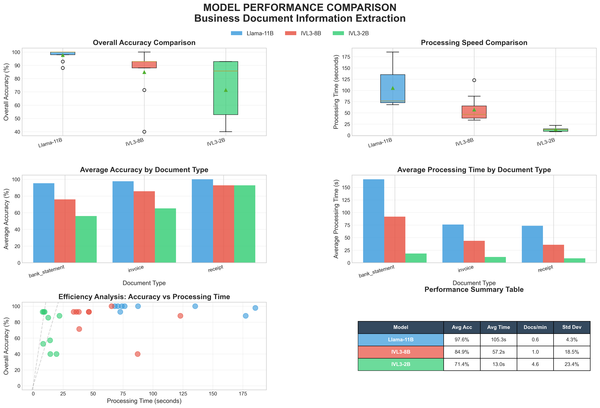
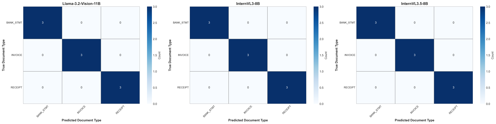
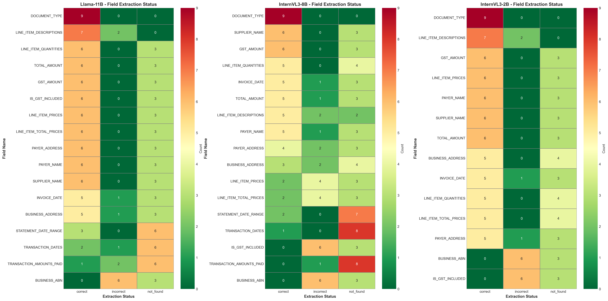
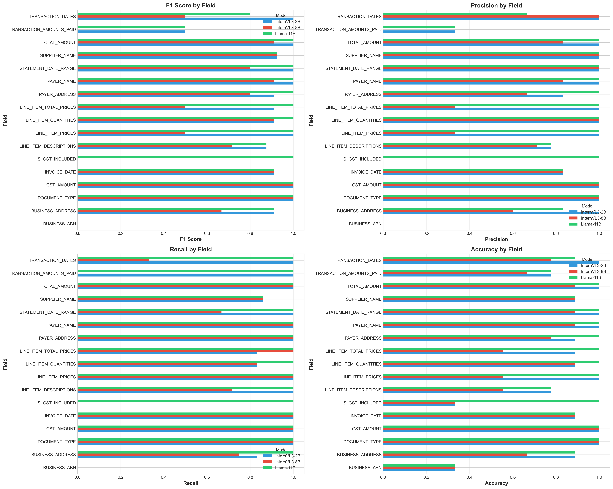
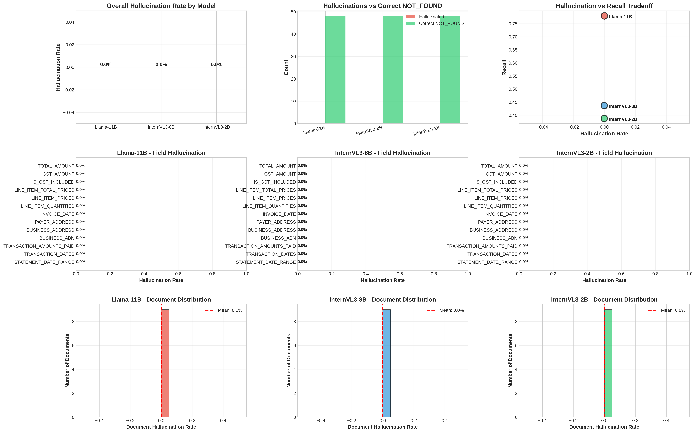

# Model Comparison Analysis Report

**Auto-Generated from Notebook**: 2025-11-14 01:54:13
**Source**: `model_comparison.ipynb`
**Dataset**: 9 documents (3 bank statements, 3 invoices, 3 receipts)
**Evaluation Fields**: 17 business document fields

---

## Executive Summary

### Overall Performance Metrics

| Model | F1 Score | Precision | Recall | Accuracy | Median Speed | Throughput |
|-------|----------|-----------|--------|----------|--------------|------------|
| **Llama-3.2-Vision-11B** | 0.7762 | 0.7762 | 0.7762 | 88.02% | 8.4s | 7.1 docs/min |
| **InternVL3-Quantized-8B** | 0.7354 | 0.8038 | 0.6778 | 76.05% | 27.7s | 2.2 docs/min |
| **InternVL3-NonQuantized-2B** | 0.6854 | 0.7053 | 0.6667 | 73.97% | 8.2s | 7.3 docs/min |

### Key Findings

**Winner (F1 Score)**: Llama-3.2-Vision-11B

**Highest Precision**: InternVL3-Quantized-8B (0.8038)

**Highest Recall**: Llama-3.2-Vision-11B (0.7762)

**Fastest**: InternVL3-NonQuantized-2B (8.2s)

---

## Visualizations

All visualizations are generated in `output/visualizations/`:

### 1. Executive Performance Dashboard


**6-panel comprehensive view:**
- Overall accuracy distribution (box plots)
- Processing speed comparison
- Accuracy by document type
- Processing time by document type
- Efficiency analysis (accuracy vs speed)
- Performance summary table

### 2. Document Type Classification


**3-model confusion matrices** showing classification performance for:
- Bank Statements (3 docs, 33.3%)
- Invoices (3 docs, 33.3%)
- Receipts (3 docs, 33.3%)

### 3. Field Extraction Status


**Breakdown of extraction status:**
- Correct extractions (matches ground truth)
- Incorrect extractions (wrong value)
- Not Found (field not extracted)

### 4. Per-Field Metrics


**4-panel analysis:**
- F1 Score by field
- Precision by field
- Recall by field
- Accuracy by field


### 5. Field-Level Accuracy Analysis


**3-panel comprehensive view:**
- Field accuracy comparison (horizontal bar chart across all models)
- Field accuracy heatmap (color-coded performance matrix)
- Model specialization distribution (fields where each model performs best)

### 6. Hallucination Analysis


**9-panel breakdown:**
- Overall hallucination rates
- Hallucinations vs correct NOT_FOUND
- Hallucination-recall tradeoff
- Per-field hallucination (3 models)
- Document-level distribution (3 models)

### Hallucination Rates

| Model | Hallucination Rate | Correct NOT_FOUND Rate | Total Hallucinations |
|-------|-------------------|------------------------|----------------------|
| **Llama-11B** | 0.0% | 100.0% | 0 |
| **InternVL3-8B** | 0.0% | 100.0% | 0 |
| **InternVL3-2B** | 0.0% | 100.0% | 0 |

**Interpretation:**
- **Hallucination Rate**: % of NOT_FOUND fields where model invented a value
- **Correct NOT_FOUND Rate**: % of NOT_FOUND fields correctly identified as absent

---

## Per-Field Performance Summary

### Field-Level Accuracy by Model

| Field | Llama-11B | InternVL3-8B | InternVL3-2B | Best Model | Best Score |
|-------|-----------|--------------|--------------|------------|------------|
| DOCUMENT_TYPE | 100.0% | 100.0% | 100.0% | InternVL3-NonQuantized-2B | 100.0% |
| TOTAL_AMOUNT | 100.0% | 100.0% | 100.0% | InternVL3-NonQuantized-2B | 100.0% |
| GST_AMOUNT | 100.0% | 100.0% | 100.0% | InternVL3-NonQuantized-2B | 100.0% |
| PAYER_ADDRESS | 100.0% | 97.2% | 100.0% | InternVL3-NonQuantized-2B | 100.0% |
| STATEMENT_DATE_RANGE | 100.0% | 100.0% | 94.4% | InternVL3-Quantized-8B | 100.0% |
| LINE_ITEM_QUANTITIES | 100.0% | 83.3% | 97.6% | Llama-3.2-Vision | 100.0% |
| BUSINESS_ABN | 100.0% | 83.3% | 83.3% | Llama-3.2-Vision | 100.0% |
| LINE_ITEM_TOTAL_PRICES | 100.0% | 66.7% | 83.3% | Llama-3.2-Vision | 100.0% |
| INVOICE_DATE | 83.3% | 83.3% | 83.3% | InternVL3-NonQuantized-2B | 83.3% |
| BUSINESS_ADDRESS | 81.7% | 80.6% | 81.7% | InternVL3-NonQuantized-2B | 81.7% |
| PAYER_NAME | 66.7% | 66.7% | 66.7% | InternVL3-NonQuantized-2B | 66.7% |
| SUPPLIER_NAME | 66.7% | 66.7% | 66.7% | InternVL3-NonQuantized-2B | 66.7% |
| LINE_ITEM_DESCRIPTIONS | 87.5% | 51.1% | 59.3% | Llama-3.2-Vision | 87.5% |
| TRANSACTION_DATES | 74.2% | 67.9% | 48.3% | Llama-3.2-Vision | 74.2% |
| LINE_ITEM_PRICES | 100.0% | 16.7% | 66.7% | Llama-3.2-Vision | 100.0% |
| IS_GST_INCLUDED | 100.0% | 0.0% | 0.0% | Llama-3.2-Vision | 100.0% |
| TRANSACTION_AMOUNTS_PAID | 0.0% | 0.0% | 0.0% | InternVL3-NonQuantized-2B | 0.0% |

---

## Model Specialization

### Fields Where Each Model Performs Best

| Model | Best-Performing Fields | Percentage | Count |
|-------|----------------------|------------|-------|
| **Llama-3.2-Vision-11B** | 41.2% | 7/17 | SECONDARY |
| **InternVL3-Quantized-8B** | 5.9% | 1/17 | SECONDARY |
| **InternVL3-NonQuantized-2B** | 52.9% | 9/17 | PRIMARY |

---

## Deployment Recommendations

Based on the analysis above:

### 1. Document Classification (PRIMARY)
Use the model with highest document type classification accuracy for initial routing and categorization.

### 2. Field Extraction Strategy (SECONDARY)
Consider an ensemble approach leveraging each model's field specialization:
- Use model-specific strengths for particular fields
- Implement confidence-based routing
- Fall back to best overall performer for general fields

### 3. High-Volume Processing
Balance speed vs quality based on throughput requirements:
- **Fastest processing**: InternVL3-NonQuantized-2B (~8.2s/doc)
- **Best accuracy**: Llama-3.2-Vision-11B (88.02% overall)
- **Best balance**: Consider throughput constraints and acceptable accuracy threshold

### 4. Hallucination Sensitivity: Critical Business Decision

#### Understanding Hallucination in Document Extraction

**Hallucination** = Model extracts a value when ground truth is `NOT_FOUND`

**Example:**
- Ground Truth: `BUSINESS_ABN = NOT_FOUND` (field doesn't exist in document)
- Model Output: `BUSINESS_ABN = "12345678901"` ← **HALLUCINATION** (invented data)

#### The Tradeoff: Precision vs Recall

**High Precision (Low Hallucination)**
- Model only extracts when very confident
- **Few false positives** (hallucinations)
- **Many false negatives** (missed fields)
- Conservative approach: "Only extract what you're sure about"

**High Recall (Risk of Hallucination)**
- Model extracts aggressively to catch all fields
- **Few false negatives** (catches most fields)
- **More false positives** (risk of hallucinations)
- Aggressive approach: "Extract everything, review later"

#### Relationship to Metrics

```
Precision = Correct Extractions / All Extractions
  → High precision = Low hallucination rate
  → Model is cautious, only extracts when confident

Recall = Correct Extractions / All Fields That Should Be Extracted
  → High recall = Catches more fields
  → Risk: May hallucinate to achieve higher coverage

Hallucination Rate = Hallucinations / NOT_FOUND Opportunities
  → Direct measure of false positive risk
  → Critical for production reliability
```

#### Model Selection Guide Based on Use Case

**Choose HIGH PRECISION Model (InternVL3-Quantized-8B: 80.38%) if:**
- ✅ Processing financial/regulatory data (invoices, tax documents)
- ✅ Automated processing with no human review
- ✅ **False data is worse than missing data**
- ✅ You can afford to manually review `NOT_FOUND` fields
- ✅ Compliance and audit requirements
- ✅ Low tolerance for hallucinations

**Example**: Bank reconciliation where a hallucinated amount could cause financial errors.

**Choose HIGH RECALL Model (Llama-3.2-Vision-11B: 77.62%) if:**
- ✅ Comprehensive data capture is critical
- ✅ Human review pipeline can catch errors
- ✅ **Missing data is worse than wrong data**
- ✅ Initial screening/discovery use case
- ✅ Maximizing field coverage is priority
- ✅ Can tolerate some false positives

**Example**: Legal document discovery where missing a field could have serious consequences.

**Choose BALANCED Model (for high-volume processing) if:**
- ✅ High-volume processing requirements
- ✅ Need reasonable precision and recall
- ✅ Speed is a critical factor
- ✅ Standard business document processing

**Example**: Receipt processing for expense management with human spot-checking.

#### Your Model Performance Profile

Based on the analysis:

| Model | Precision | Recall | F1 | Best For |
|-------|-----------|--------|----|----|
| **Llama-3.2-Vision-11B** | 77.62% | 77.62% | 0.7762 | 🏆 Best Recall🏆 Best F1 |
| **InternVL3-Quantized-8B** | 80.38% | 67.78% | 0.7354 | 🏆 Best Precision |
| **InternVL3-NonQuantized-2B** | 70.53% | 66.67% | 0.6854 |  |

**Key Insights:**
- **Precision Leader**: InternVL3-Quantized-8B (80.38%)
- **Recall Leader**: Llama-3.2-Vision-11B (77.62%)
- **F1 Leader**: Llama-3.2-Vision-11B (0.7762)
- **Speed vs Accuracy Tradeoff**: Consider throughput requirements against quality needs

#### Production Deployment Strategy

**Phase 1: Initial Deployment**
1. Choose model based on your primary business constraint:
   - **Financial accuracy** → Highest precision model
   - **Data completeness** → Highest recall model
   - **High volume** → Fastest processing model

**Phase 2: Monitoring**
2. Track in production:
   - Hallucination rate on `NOT_FOUND` fields
   - Manual review costs (false negatives)
   - Error correction costs (false positives)

**Phase 3: Optimization**
3. Adjust strategy based on actual costs:
   - If missing fields cost more → Switch to higher recall model
   - If hallucinations cost more → Switch to higher precision model
   - If volume is issue → Consider faster model with review pipeline

**Phase 4: Advanced Optimization**
4. Consider ensemble approaches:
   - Use high-precision model for critical fields (amounts, dates)
   - Use high-recall model for descriptive fields (line items)
   - Route by document confidence scores

---

## Related Documentation

- [FIELD_COMPARISON.md](FIELD_COMPARISON.md) - Detailed field-by-field analysis
- [ACCURACY_PARADOX_EXPLAINED.md](ACCURACY_PARADOX_EXPLAINED.md) - Why Accuracy > F1 for extraction
- [HALLUCINATION_ANALYSIS.md](HALLUCINATION_ANALYSIS.md) - Hallucination analysis methodology

---

**Report Auto-Generated**: 2025-11-14 01:54:13
**Source Notebook**: `model_comparison.ipynb`
**Visualizations**: `output/visualizations/`
**Next Update**: Re-run notebook to refresh all metrics and visualizations
