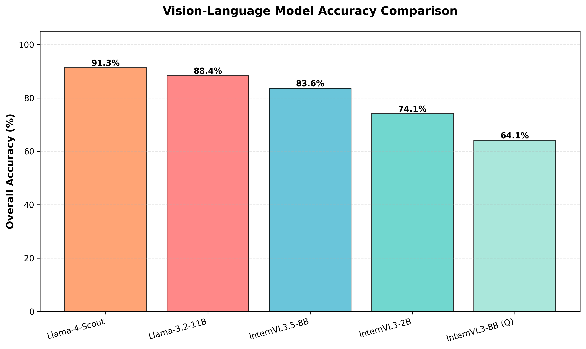
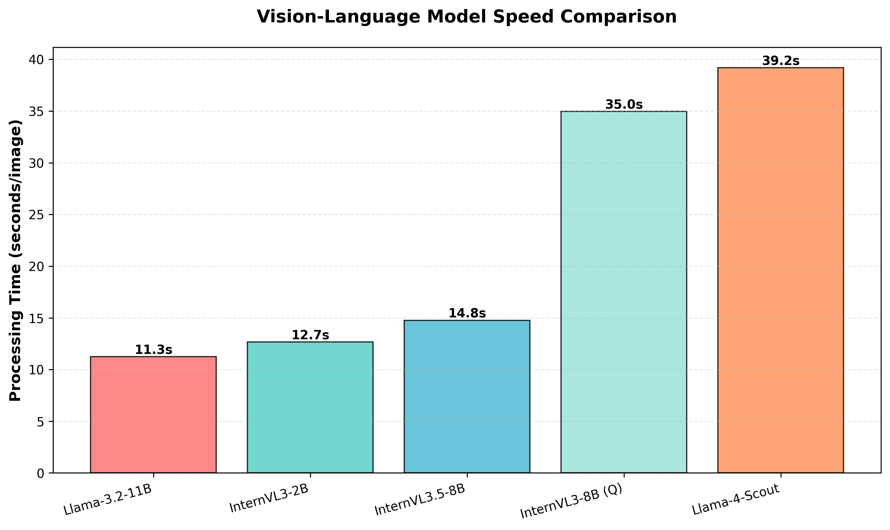
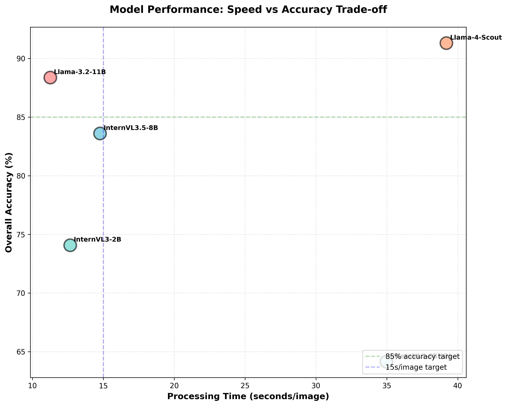
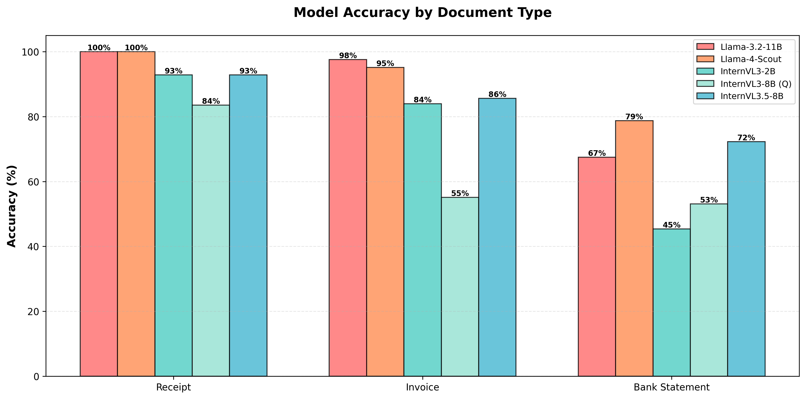
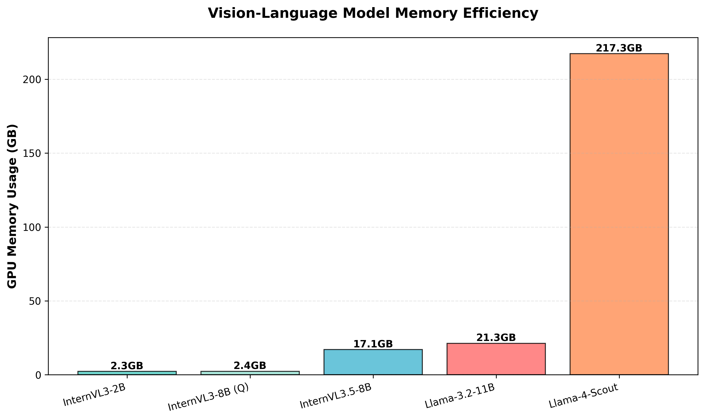

# Vision-Language Model Comparison Report

**Date**: November 15, 2024
**Dataset**: 9 synthetic business documents (3 receipts, 3 invoices, 3 bank statements)
**Test Environment**: H200 GPU cluster

---

## Executive Summary

Tested 5 vision-language models for document extraction accuracy and performance:
- **Winner (Accuracy)**: Llama-4-Scout (91.3% overall)
- **Winner (Speed)**: Llama-3.2-11B (11.25s/image)
- **Best Value**: InternVL3.5-8B (83.6% accuracy, 17GB memory - 20% less than Llama-3.2-11B)
- **Most Efficient**: InternVL3-2B (2.3GB memory, 12.66s/image)
- **Best for Bank Statements**: Llama-4-Scout (78.8% accuracy)

---

## Overall Comparison

| Model | Size | Speed (s/img) | Throughput (img/min) | Overall Accuracy | Memory Usage |
|-------|------|---------------|---------------------|-----------------|--------------|
| **Llama-4-Scout** | 17B active (109B total) | 39.20 | 1.5 | **91.3%** 🥇 | ~217GB (multi-GPU) |
| **Llama-3.2-11B** | 11B | **11.25** ⚡ | **5.3** | **88.4%** 🥈 | ~21GB (multi-GPU) |
| **InternVL3.5-8B** | 8.5B | 14.76 | 4.1 | **83.6%** 🥉 | ~17GB (multi-GPU) |
| **InternVL3-2B** | 2B | 12.66 | 4.7 | 74.1% | **~2.3GB** 💾 |
| **InternVL3-8B (Q)** | 8B | 34.96 | 1.7 | 64.1% | ~2.4GB |

**Legend**: 🥇 1st place | 🥈 2nd place | 🥉 3rd place | ⚡ Fastest | 💾 Most efficient







---

## Accuracy Breakdown by Document Type

### Receipts (n=3)

| Rank | Model | Accuracy | Notes |
|------|-------|----------|-------|
| 🥇 | **Llama-4-Scout** | **100.0%** | Perfect extraction |
| 🥇 | **Llama-3.2-11B** | **100.0%** | Perfect extraction |
| 3rd | InternVL3-2B | 92.9% | Very good |
| 3rd | InternVL3.5-8B | 92.9% | Very good |
| 5th | InternVL3-8B (Q) | 83.6% | Good |

### Invoices (n=3)

| Rank | Model | Accuracy | Notes |
|------|-------|----------|-------|
| 🥇 | **Llama-3.2-11B** | **97.6%** | Near perfect |
| 🥈 | **Llama-4-Scout** | **95.2%** | Excellent |
| 🥉 | InternVL3.5-8B | 85.7% | Good |
| 4th | InternVL3-2B | 84.0% | Good |
| 5th | InternVL3-8B (Q) | 55.1% | Needs improvement |

### Bank Statements (n=3)

| Rank | Model | Accuracy | Notes |
|------|-------|----------|-------|
| 🥇 | **Llama-4-Scout** | **78.8%** | Best for complex tables |
| 🥈 | InternVL3.5-8B | 72.3% | Excellent |
| 🥉 | Llama-3.2-11B | 67.5% | Good |
| 4th | InternVL3-8B (Q) | 53.1% | Moderate |
| 5th | InternVL3-2B | 45.4% | Struggles with tables |

**Key Finding**: Bank statements are the hardest document type (avg: 63.4% across all models). Llama-4-Scout's MoE architecture provides the best performance (78.8%), followed by InternVL3.5's Visual Resolution Router (ViR) at 72.3%.



---

## Performance Analysis

### Speed Comparison

```
Llama-3.2-11B    ████████████████ 11.25s  (5.3 img/min) 🥇
InternVL3-2B     █████████████████ 12.66s (4.7 img/min) 🥈
InternVL3.5-8B   ███████████████████ 14.76s (4.1 img/min) 🥉
InternVL3-8B (Q) ████████████████████████████████████ 34.96s (1.7 img/min)
Llama-4-Scout    ███████████████████████████████████████ 39.20s (1.5 img/min)
```

**Analysis**:
- Llama-3.2-11B is **fastest** despite being 11B parameters (optimized multi-GPU distribution)
- InternVL3-2B is **competitive** at 12.66s with only 2B parameters
- InternVL3.5-8B adds **31% overhead** vs 3.5-2B but delivers **12.8% accuracy gain**
- InternVL3-8B quantized is **3x slower** than non-quantized 2B (quantization penalty)
- Llama-4-Scout is **slowest** (39.20s) but delivers **highest accuracy** (91.3%) - clear speed/accuracy trade-off

### Memory Efficiency

```
InternVL3-2B     ██ 2.3GB  (Most efficient) 💾
InternVL3-8B (Q) ██ 2.4GB  (Quantized)
InternVL3.5-8B   █████████████████ 17GB (Multi-GPU)
Llama-3.2-11B    █████████████████████ 21GB (Multi-GPU)
Llama-4-Scout    ████████████████████████████████████████████████████████████████████████████ 217GB (MoE Multi-GPU)
```

**Analysis**:
- InternVL3-2B is the **most memory efficient** at only 2.3GB (9x more efficient than Llama-3.2-11B)
- InternVL3.5-8B uses **~17GB** while Llama-3.2-11B uses **~21GB** with multi-GPU distribution
- Llama-4-Scout requires **massive memory** (217GB across 2x H200) due to 109B MoE architecture
- Quantization saves minimal memory but **severely impacts speed** for InternVL3-8B
- **Memory efficiency finding**: InternVL3.5-8B uses 20% less memory than Llama-3.2-11B (17GB vs 21GB) while maintaining competitive accuracy



---

## Detailed Findings

### 1. Accuracy Leader: **Llama-4-Scout**

**Strengths**:
- ✅ **Highest overall accuracy** (91.3%)
- ✅ **Best for bank statements** (78.8%)
- ✅ Perfect receipt extraction (100%)
- ✅ Excellent invoice extraction (95.2%)
- ✅ MoE architecture with 109B total parameters (17B active)
- ✅ Production-ready for complex documents

**Weaknesses**:
- ❌ **Massive memory usage** (217GB across 2x H200 GPUs)
- ❌ **Slowest inference** (39.20s/image)
- ❌ Requires high-end GPU infrastructure

**Best for**: Complex documents (especially bank statements), maximum accuracy requirements, high-end GPU infrastructure

---

### 2. Speed Leader: **Llama-3.2-11B**

**Strengths**:
- ✅ Second-best accuracy (88.4%)
- ✅ Perfect receipt extraction (100%)
- ✅ Best invoice extraction (97.6%)
- ✅ **Fastest inference** (11.25s/image)
- ✅ Production-ready performance
- ✅ Reasonable memory usage (17GB multi-GPU)

**Weaknesses**:
- ❌ Bank statement accuracy could be better (67.5%)
- ❌ 3% lower accuracy than Llama-4-Scout

**Best for**: Production deployments requiring both speed and accuracy, standard GPU infrastructure

---

### 3. Best Value: **InternVL3.5-8B**

**Strengths**:
- ✅ Third-best accuracy (83.6%)
- ✅ Second-best for bank statements (72.3%)
- ✅ 20% lower memory footprint than Llama-3.2-11B (~17GB vs ~21GB multi-GPU)
- ✅ Cascade RL improves reasoning
- ✅ Visual Resolution Router helps with tables
- ✅ Competitive speed (14.76s)

**Weaknesses**:
- ❌ 31% slower than InternVL3-2B
- ❌ 8% lower accuracy than Llama-3.2-11B
- ❌ 6% lower bank statement accuracy than Llama-4-Scout
- ❌ Higher memory usage than expected (17GB, not 2.4GB)

**Best for**: Balanced accuracy/efficiency with standard multi-GPU infrastructure, cost-effective alternative to Llama-3.2-11B

---

### 4. Most Efficient: **InternVL3-2B**

**Strengths**:
- ✅ Smallest memory footprint (2.3GB)
- ✅ Fast inference (12.66s/image)
- ✅ Good receipt accuracy (92.9%)
- ✅ Good invoice accuracy (84.0%)
- ✅ Second-fastest model

**Weaknesses**:
- ❌ Struggles with bank statements (45.4%)
- ❌ Lower overall accuracy (74.1%)

**Best for**: Resource-constrained environments, simple documents (receipts/invoices)

---

### 5. Needs Improvement: **InternVL3-8B (Quantized)**

**Strengths**:
- ✅ Low memory usage (2.4GB)
- ✅ Decent receipt accuracy (83.6%)

**Weaknesses**:
- ❌ **Second-slowest model** (34.96s/image) - 3x slower than 2B
- ❌ **Lowest accuracy** (64.1%)
- ❌ Poor invoice extraction (55.1%)
- ❌ Quantization severely impacts performance

**Best for**: *Not recommended* - use InternVL3-2B or InternVL3.5-8B instead

**Note**: Quantization appears to harm both speed and accuracy for InternVL3-8B. Non-quantized version may perform better.

---

## Document Type Challenges

### Why Bank Statements Are Hard

Average accuracy by document type:
- **Receipts**: 92.4% ✅ (easiest)
- **Invoices**: 80.6% ✅ (moderate)
- **Bank Statements**: 59.6% ⚠️ (hardest)

**Challenges**:
1. **Complex tabular structure** (dates, descriptions, amounts in columns)
2. **Multiple transactions** requiring position-aware extraction
3. **Date-grouped vs flat table** layout variations
4. **Transaction descriptions** with variable formats
5. **Credit/debit distinction** not always clear

**Solution**: Llama-4-Scout's MoE architecture achieves **78.8%** accuracy (best in class), with InternVL3.5-8B's Visual Resolution Router (ViR) providing a memory-efficient alternative at **72.3%**.

---

## Recommendations

### For Production Deployment

**Maximum accuracy priority**:
- **Use**: Llama-4-Scout
- **Why**: 91.3% overall, 100% receipts, 95.2% invoices, 78.8% bank statements
- **Requirement**: High-end multi-GPU setup (2x H200 with 217GB total memory)
- **Trade-off**: Slowest inference (39.20s/image), massive memory requirements

**Balanced speed/accuracy**:
- **Use**: Llama-3.2-11B
- **Why**: 88.4% overall, 100% receipts, 97.6% invoices, fastest (11.25s/image)
- **Requirement**: Multi-GPU setup (2x H200/A100 with 17GB total memory)
- **Trade-off**: 3% lower accuracy than Llama-4-Scout, 11% lower bank statement accuracy

**Balanced accuracy/efficiency**:
- **Use**: InternVL3.5-8B
- **Why**: 83.6% overall, second-best for bank statements (72.3%), same memory as Llama-3.2-11B
- **Requirement**: Multi-GPU setup (2x H200/A100 with 17GB total memory)
- **Trade-off**: 8% lower accuracy than Llama-3.2-11B, higher memory than InternVL3-2B

**Resource-constrained**:
- **Use**: InternVL3-2B
- **Why**: 74.1% accuracy, 2.3GB memory, fast inference (12.66s/image)
- **Requirement**: Any GPU with 4GB+ VRAM
- **Trade-off**: Lower accuracy, poor bank statement performance (45.4%)

### For Specific Document Types

| Document Type | Recommended Model | Accuracy | Alternative |
|---------------|-------------------|----------|-------------|
| **Receipts** | Llama-4-Scout / Llama-3.2-11B | 100.0% | InternVL3.5-8B (92.9%) |
| **Invoices** | Llama-3.2-11B | 97.6% | Llama-4-Scout (95.2%) |
| **Bank Statements** | Llama-4-Scout | 78.8% | InternVL3.5-8B (72.3%) |
| **Mixed (all types)** | Llama-4-Scout | 91.3% | Llama-3.2-11B (88.4%) |

### Avoid

❌ **InternVL3-8B (Quantized)**: Slow (34.96s) and low accuracy (64.1%)
💡 **Instead use**: InternVL3-2B (faster, similar memory) or InternVL3.5-8B (better accuracy)

---

## Technical Notes

### Test Configuration

**Models tested**:
- Llama-4-Scout-17B-16E-Instruct (transformers 4.52.1, torch 2.5.1, SDPA attention, MoE)
- Llama-3.2-11B-Vision-Instruct (transformers 4.45.2, torch 2.5.1)
- InternVL3-2B (non-quantized, bfloat16)
- InternVL3-8B (8-bit quantized)
- InternVL3.5-8B (transformers 4.52.1, torch 2.5.1, Cascade RL enabled)

**Evaluation method**: Order-aware F1 score (position-sensitive)

**Hardware**: H200 GPU cluster (2x 150GB H200)

**Preprocessing**: Adaptive (enabled for Llama models only)

### Memory Usage Details

| Model | Allocated | Reserved | Total | GPUs |
|-------|-----------|----------|-------|------|
| Llama-4-Scout | 217.28 GB | 217.29 GB | 300 GB | 2x H200 |
| Llama-3.2-11B | 21.3 GB | 21.4 GB | 300 GB | 2x H200 |
| InternVL3.5-8B | 17.06 GB | 17.11 GB | 300 GB | 2x H200 |
| InternVL3-2B | 2.29 GB | 2.32 GB | 150 GB | 1x H200 |
| InternVL3-8B (Q) | 2.38 GB | 2.41 GB | 150 GB | 1x H200 |

---

## Future Tests

### Recommended Next Steps

1. ✅ **Test Llama-4-Scout** - COMPLETED! (91.3% accuracy, best overall)
2. 📊 **Test InternVL3-8B non-quantized** (quantized version underperforms)
3. 🔬 **Expand test set** to 50+ images for statistical significance
4. 📈 **Test with image preprocessing disabled** for Llama models (measure impact)
5. 🎯 **Fine-tune on bank statements** (hardest document type - avg 63.4%)
6. ⚡ **Optimize Llama-4-Scout inference** (explore quantization, batching to reduce 39s/image)

---

## Conclusion

**Key Takeaways**:

1. **Llama-4-Scout** is the **new accuracy leader** (91.3% overall, 78.8% bank statements) with MoE architecture
2. **Llama-3.2-11B** remains the **speed champion** (11.25s/image) with excellent accuracy (88.4%)
3. **InternVL3.5-8B** offers **good value** (83.6% accuracy, 20% less memory than Llama-3.2-11B at 17GB)
4. **InternVL3-2B** is the **efficiency champion** (2.3GB, 12.66s/image) for simple documents
5. **Bank statements** remain challenging (avg 63.4%) but Llama-4-Scout achieves 78.8%
6. **Quantization hurts** InternVL3-8B (3x slower, lowest accuracy) - avoid
7. **Memory efficiency**: InternVL3.5-8B uses 20% less memory than Llama-3.2-11B (17GB vs 21GB), making it more memory-efficient

**Production Recommendation**:
- Use **Llama-4-Scout** if you have high-end infrastructure (2x H200) and need maximum accuracy
- Use **Llama-3.2-11B** if you need balanced speed/accuracy with standard multi-GPU setup
- Use **InternVL3.5-8B** as alternative to Llama-3.2-11B (20% less memory at 17GB, 5% lower accuracy, 31% slower)
- Use **InternVL3-2B** if you need true memory efficiency (2.3GB) with acceptable accuracy (74%)
- Avoid InternVL3-8B quantized - use InternVL3-2B or InternVL3.5-8B instead

---

*Report generated from automated comparison of batch processing results*
*For detailed field-level analysis, see individual model CSV outputs*

**See also**: [Appendix A: Bank Statement-Specific Investigation](MODEL_COMPARISON_APPENDIX_A.md) — CBA-specific testing with InternVL3.5 Cascade RL
