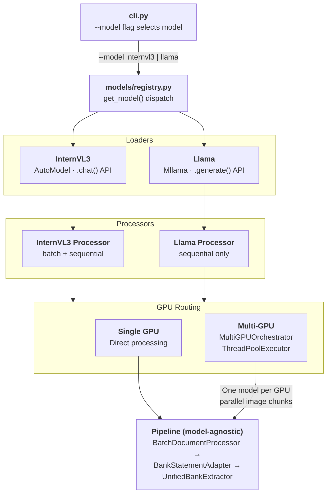
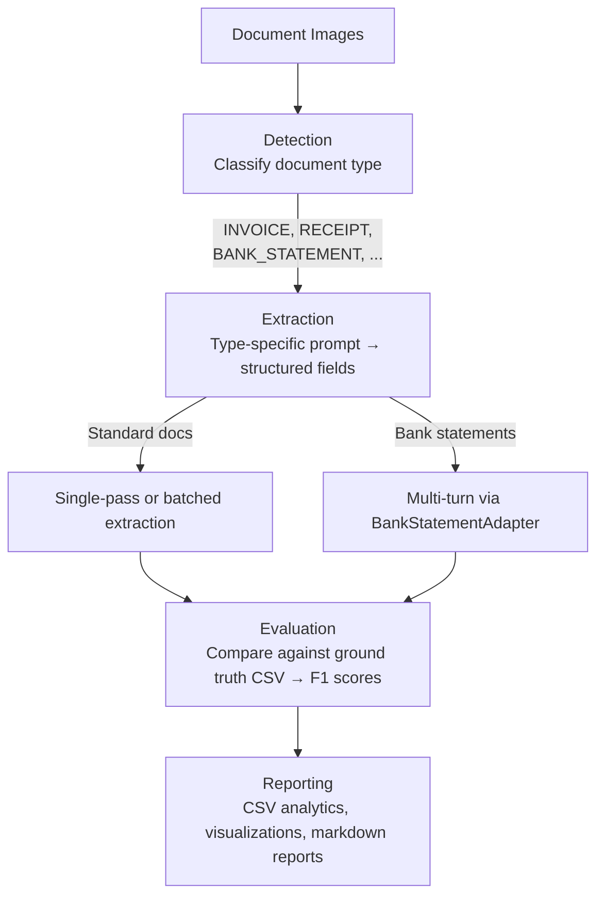
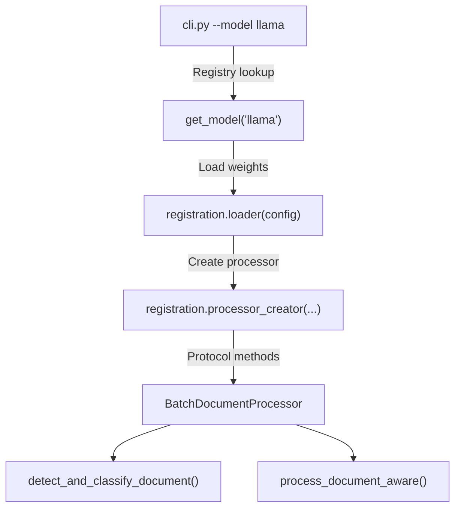
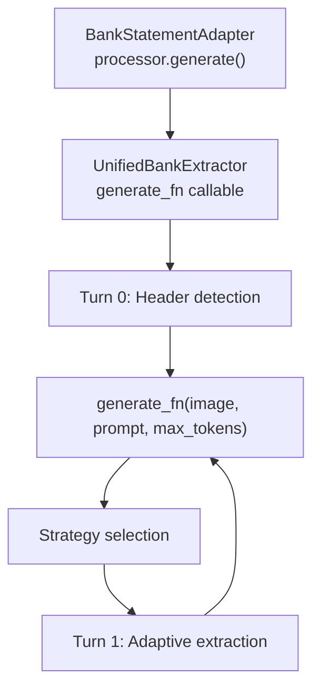
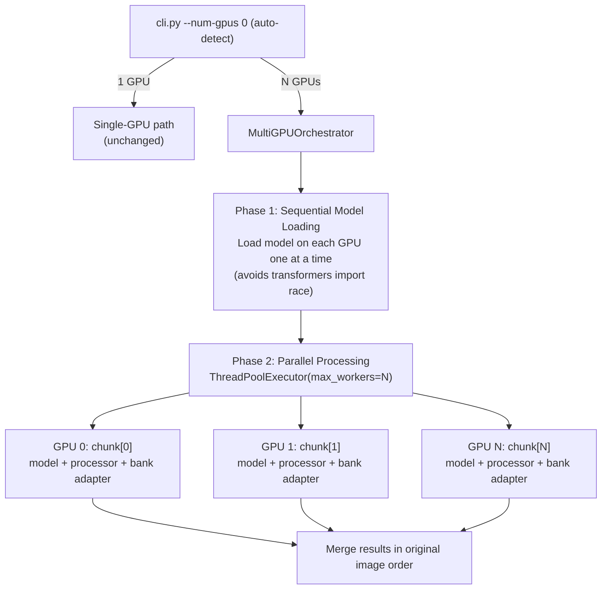

# Document Extraction Pipeline

A production-ready CLI for extracting structured fields from business document images using vision-language models. Supports multiple models via a Protocol + Registry architecture, batched inference, multi-GPU parallel processing, automatic GPU memory management, multi-turn bank statement extraction, and evaluation against ground truth.

**Supported models:**

| Model | Type | Bank Extraction | Batch Inference |
|-------|------|-----------------|-----------------|
| InternVL3.5-8B | `internvl3` | Multi-turn | Yes |
| Llama 3.2-11B Vision | `llama` | Multi-turn | Sequential only |

## Architecture Overview

The pipeline uses a **Protocol + Registry** pattern that cleanly separates model-specific code from pipeline orchestration. Adding a new model requires zero changes to existing pipeline code.



### Key Design Principles

1. **Protocol-based interface** (`models/protocol.py`): A `@runtime_checkable` Protocol defines the contract all processors must satisfy. The pipeline never imports a concrete processor class.

2. **Registry with lazy loading** (`models/registry.py`): All `torch`/`transformers` imports live inside function bodies. Importing the registry has zero GPU overhead. Models self-register at the bottom of the file.

3. **Callable-based bank extraction**: `UnifiedBankExtractor` accepts a `generate_fn` callable (the processor's `generate()` method), eliminating model-type branching. Both models get the full multi-turn bank extraction pipeline (Turn 0: header detection, Turn 1: adaptive extraction with strategy selection).

4. **Config cascade**: CLI flags > YAML (`run_config.yml`) > dataclass defaults. The `--model` flag selects which registered model to use.

## Project Structure

```
.
├── cli.py                                 # CLI entry point (subcommands + --model flag)
├── entrypoint.sh                          # KFP pipeline entrypoint (task dispatch)
├── pipeline/
│   ├── __init__.py                        # Stage function exports
│   ├── io_schemas.py                      # Data contracts between stages
│   ├── classify.py                        # Classification stage (→ CSV)
│   ├── extract.py                         # Extraction stage (→ JSON)
│   └── evaluate.py                        # Evaluation stage (→ CSV + JSON)
├── config/
│   ├── run_config.yml                     # Single source of truth for all config
│   ├── field_definitions.yaml             # Document types, fields, evaluation settings
│   ├── bank_column_patterns.yaml          # Column header patterns for bank extraction
│   └── model_config.yaml                  # Model configs for unified bank extraction
├── prompts/
│   ├── document_type_detection.yaml       # Detection prompts + type mappings
│   ├── internvl3_prompts.yaml             # InternVL3 extraction prompts
│   └── llama_prompts.yaml                 # Llama extraction prompts
├── models/
│   ├── protocol.py                        # DocumentProcessor Protocol definition
│   ├── registry.py                        # Model registry + lazy loaders
│   ├── base_processor.py                      # BaseDocumentProcessor ABC (shared logic)
│   ├── document_aware_internvl3_processor.py  # InternVL3 processor
│   ├── document_aware_llama_processor.py      # Llama processor
│   └── internvl3_image_preprocessor.py        # Image tiling and tensor preparation
├── common/
│   ├── pipeline_config.py                 # PipelineConfig dataclass, config merging
│   ├── field_config.py                    # Field schema, accessors, evaluation filtering
│   ├── model_config.py                    # Generation config, batch sizes, YAML overrides
│   ├── batch_processor.py                 # Batch orchestration (detection → extraction)
│   ├── multi_gpu.py                       # Multi-GPU parallel processing orchestrator
│   ├── bank_statement_adapter.py          # Multi-turn bank extraction adapter
│   ├── unified_bank_extractor.py          # Auto-selects bank extraction strategy
│   ├── gpu_optimization.py                # CUDA memory management, OOM recovery
│   ├── robust_gpu_memory.py               # GPU memory detection across hardware
│   ├── bank_statement_calculator.py       # Transaction type/amount derivation
│   ├── batch_analytics.py                 # DataFrames and statistics
│   ├── batch_reporting.py                 # Executive summaries and reports
│   ├── batch_visualizations.py            # Dashboards, heatmaps, charts
│   ├── evaluation_metrics.py              # Ground truth comparison, F1 scores
│   ├── extraction_cleaner.py              # Value normalisation and cleaning
│   ├── extraction_parser.py               # Raw model output → structured dicts
│   ├── simple_prompt_loader.py            # Prompt loading from YAML files
│   └── field_definitions_loader.py        # Field definitions from YAML
└── environment_ivl35.yml                  # Conda environment specification
```

## Quick Start

```bash
# 1. Create environment
conda env create -f environment_ivl35.yml
conda activate vision_notebooks

# 2. Run with InternVL3 (default)
python cli.py -d ./images -o ./output

# 3. Run with Llama
python cli.py --model llama -d ./images -o ./output

# 4. Evaluation mode (with ground truth)
python cli.py --model llama -d ./images -o ./output -g ./ground_truth.csv

# 5. Multi-GPU parallel processing (auto-detects available GPUs)
python cli.py -d ./images -o ./output --num-gpus 0

# 6. Using config file
python cli.py --config config/run_config.yml
```

## Pipeline Flow



**Batch processing**: Detection runs in batches (configurable). Standard documents extract in batches (InternVL3) or sequentially (Llama). Bank statements always use sequential multi-turn extraction via `BankStatementAdapter`, which dispatches to the correct model-specific generation method.

**Multi-GPU**: When multiple GPUs are available, `MultiGPUOrchestrator` partitions images into contiguous chunks and processes them in parallel — one independent model per GPU. This is true data parallelism via `ThreadPoolExecutor` (PyTorch releases the GIL during CUDA kernels). Results are merged in original image order. See [Multi-GPU Parallel Processing](#multi-gpu-parallel-processing).

## Composable Pipeline Stages

The pipeline decomposes into independent stages, each producing a well-defined intermediate format consumed by the next. This enables running stages independently, inspecting/correcting intermediate results, and assigning different resource profiles per stage.

```
classify  →  extract  →  evaluate
  GPU          GPU         CPU
```

### CLI Subcommands

```bash
# Stage 1: Classification only → CSV
python cli.py classify -d ./images -o ./output --model internvl3

# Stage 2: Extraction from classification CSV → JSON
python cli.py extract --classifications ./output/csv/batch_*_classifications.csv -o ./output

# Stage 3: Evaluation from extraction JSON (CPU-only, no model needed)
python cli.py evaluate --extractions ./output/batch_results/batch_*_extractions.json \
  -g ./ground_truth.csv -o ./output

# Full pipeline (all stages in one shot)
python cli.py run -d ./images -o ./output -g ./ground_truth.csv

# Backward-compat: bare flags (no subcommand) defaults to full pipeline
python cli.py -d ./images -o ./output -g ./ground_truth.csv
```

### Intermediate Formats

| Stage | Output | Format | Human-editable |
|-------|--------|--------|----------------|
| **classify** | `csv/batch_{ts}_classifications.csv` | CSV (image_path, doc_type, confidence) | Yes — fix misclassifications before extraction |
| **extract** | `batch_results/batch_{ts}_extractions.json` | JSON (nested extracted_data dicts) | Yes — inspect field values |
| **evaluate** | `csv/batch_{ts}_eval_summary.csv` + `batch_results/batch_{ts}_eval_detail.json` | CSV summary + JSON field-level detail | Read-only |

### KFP Entrypoint

`entrypoint.sh` dispatches to the correct `cli.py` subcommand based on `$KFP_TASK`. Each task maps to a KFP pipeline stage with its own resource profile.

| KFP Task | CLI Subcommand | GPU | Use Case |
|----------|---------------|-----|----------|
| `run_batch_inference` | (none) | Yes | Full pipeline, backward compat |
| `classify_documents` | `classify` | Yes | Classification only → CSV |
| `extract_documents` | `extract` | Yes | Extraction from CSV → JSON |
| `evaluate_extractions` | `evaluate` | **No** | CPU-only evaluation from JSON |

All operational paths (`DATA_DIR`, `OUTPUT_DIR`, `GROUND_TRUTH`, `LOG_DIR`) are defined once in `entrypoint.sh` with sensible production defaults. KFP `input_params` override the defaults when set. Paths are passed as CLI flags to `cli.py`, which gives them highest priority (`CLI > YAML > defaults`). `run_config.yml` path fields are only used for direct `python cli.py` runs during local development.

**Local usage examples** (override defaults via env vars):

```bash
# Full pipeline (backward compat)
KFP_TASK=run_batch_inference \
  model=internvl3 \
  image_dir=/efs/shared/PoC_data/evaluation_data_Feb/bank \
  output=/efs/shared/PoC_data/output \
  num_gpus=4 \
  bash entrypoint.sh

# Classification only
KFP_TASK=classify_documents \
  model=internvl3 \
  bash entrypoint.sh

# Extraction from classification CSV
KFP_TASK=extract_documents \
  classifications_csv=/efs/shared/PoC_data/output/csv/batch_20260222_classifications.csv \
  bash entrypoint.sh

# Evaluation from extraction JSON (CPU-only, no model needed)
KFP_TASK=evaluate_extractions \
  extractions_json=/efs/shared/PoC_data/output/batch_results/batch_20260222_extractions.json \
  bash entrypoint.sh
```

Direct CLI flags can also be appended — they take precedence over env vars:

```bash
KFP_TASK=classify_documents bash entrypoint.sh --model internvl3 -d /efs/shared/PoC_data/evaluation_data_Feb/bank
```

**Env var overrides per task** (all have production defaults — none are strictly required):

| Task | Commonly overridden | Optional |
|------|---------------------|----------|
| `run_batch_inference` | `model`, `image_dir`, `output` | `num_gpus`, `batch_size`, `ground_truth`, `bank_v2`, `balance_correction` |
| `classify_documents` | `model`, `image_dir`, `output` | `num_gpus`, `batch_size`, `document_types`, `max_images` |
| `extract_documents` | `classifications_csv` | `model`, `output`, `num_gpus`, `batch_size`, `bank_v2`, `balance_correction` |
| `evaluate_extractions` | `extractions_json` | `output`, `ground_truth` |

## The Protocol + Registry System

### DocumentProcessor Protocol

Every model processor must satisfy the `DocumentProcessor` Protocol defined in `models/protocol.py`:

```python
@runtime_checkable
class DocumentProcessor(Protocol):
    model: Any           # The underlying vision-language model
    tokenizer: Any       # The tokenizer (or processor) for the model
    batch_size: int      # Current batch size for inference

    def detect_and_classify_document(
        self, image_path: str, verbose: bool = False
    ) -> ClassificationResult:
        """Classify the document type from an image."""
        ...

    def process_document_aware(
        self, image_path: str, classification_info: dict[str, Any], verbose: bool = False
    ) -> ExtractionResult:
        """Extract fields from a document based on its classification."""
        ...
```

Return types use `TypedDict` (`ClassificationResult`, `ExtractionResult`) for self-documenting contracts and IDE autocomplete.

**Optional batch support** via `BatchCapableProcessor` Protocol (checked with `isinstance()` in `batch_processor.py`):

```python
@runtime_checkable
class BatchCapableProcessor(Protocol):
    def batch_detect_documents(self, image_paths: list[str], ...) -> list[ClassificationResult]: ...
    def batch_extract_documents(self, image_paths: list[str], ...) -> list[ExtractionResult]: ...
```

If a processor doesn't satisfy `BatchCapableProcessor`, the pipeline automatically falls back to sequential processing. No stubs or `NotImplementedError` needed.

### Model Registry

`models/registry.py` is the central dispatch table. Each model registers a `ModelRegistration`:

```python
@dataclass
class ModelRegistration:
    model_type: str              # "internvl3", "llama", etc.
    loader: Callable             # (config) -> ContextManager[(model, tokenizer)]
    processor_creator: Callable  # (model, tokenizer, config, ...) -> DocumentProcessor
    prompt_file: str             # "internvl3_prompts.yaml"
    description: str = ""        # Human-readable description
```

**Key design**: All `torch` and `transformers` imports are deferred to function bodies inside the loaders and creators. Importing the registry module has zero GPU/ML overhead.

### How Model Selection Works



The CLI validates the model type early (fail-fast):

```python
try:
    get_model(resolved_model_type)
except ValueError:
    # "Unknown model type: 'foo'. Available: internvl3, llama"
```

### Bank Statement Multi-Turn Extraction

Both models get the sophisticated multi-turn bank extraction pipeline:



The `generate_fn` callable is the processor's `generate()` method, which each model implements differently (InternVL3: `model.chat()`, Llama: `processor.apply_chat_template()` + `model.generate()`). The bank extraction pipeline is completely model-agnostic.

## Adding a New Model

Adding a new vision-language model requires **3 files** — no changes to existing pipeline code. See [Appendix B: Adding a New Model](#appendix-b-adding-a-new-model) for the full step-by-step guide.

## CLI Reference

```
python cli.py [OPTIONS]
```

### Data Options

| Flag | Default | Description |
|------|---------|-------------|
| `-d, --data-dir` | *from YAML* | Directory containing document images |
| `-o, --output-dir` | *from YAML* | Output directory for results |
| `-g, --ground-truth` | `None` | Ground truth CSV (omit for inference-only) |
| `--max-images` | `None` (all) | Limit number of images to process |
| `--document-types` | `None` (all) | Filter by type, comma-separated: `INVOICE,RECEIPT` |

### Model Options

| Flag | Default | Description |
|------|---------|-------------|
| `--model` | `internvl3` | Model type (`internvl3`, `llama`). Auto-discovered from registry. |
| `-m, --model-path` | *auto-detected* | Path to model weights directory |
| `--max-tiles` | `18` | Image tiles (more = better OCR, more VRAM) |
| `--flash-attn / --no-flash-attn` | `true` | Flash Attention 2 (disable for V100) |
| `--dtype` | `bfloat16` | Torch dtype: `bfloat16`, `float16`, `float32` |

### Processing Options

| Flag | Default | Description |
|------|---------|-------------|
| `-b, --batch-size` | `None` (auto) | Images per batch (`null` = auto-detect from VRAM) |
| `--num-gpus` | `0` (auto) | GPUs for parallel processing (`0` = auto-detect, `1` = single, `N` = use N) |
| `--bank-v2 / --no-bank-v2` | `true` | Multi-turn bank statement extraction |
| `--balance-correction / --no-balance-correction` | `true` | Balance validation for bank statements |

### Output Options

| Flag | Default | Description |
|------|---------|-------------|
| `--no-viz / --viz` | `false` | Skip visualization generation |
| `--no-reports / --reports` | `false` | Skip report generation |
| `-v, --verbose / -q, --quiet` | `false` | Verbose debug output |
| `-V, --version` | | Show version and exit |

### Configuration

| Flag | Description |
|------|-------------|
| `-c, --config` | Path to YAML config file (defaults to `config/run_config.yml`) |

### Priority Order

CLI flags override YAML, which overrides environment variables, which override dataclass defaults:

```
CLI  >  YAML (run_config.yml)  >  PipelineConfig defaults
```

`config/run_config.yml` is **always loaded** automatically. The `--config` flag overrides which YAML file is used.


## YAML Configuration

`config/run_config.yml` is the single source of truth for all tunable parameters. Every section is optional — missing keys fall back to Python defaults.

### `model` — Model identity and selection

```yaml
model:
  type: internvl3              # Model type: internvl3 | llama
  path: /path/to/model/weights
  max_tiles: 18                # Image tiles (H200: 18-36, V100: 14, L4: 18)
  flash_attn: true             # Flash Attention 2 (disable for V100)
  dtype: bfloat16              # bfloat16 | float16 | float32
  max_new_tokens: 2000         # Max generation tokens
```

### `data` — Input paths

```yaml
# Local-dev defaults — overridden by entrypoint.sh in production
data:
  dir: /efs/shared/PoC_data/evaluation_data_Feb/bank
  ground_truth: /efs/shared/PoC_data/evaluation_data_Feb/bank/ground_truth_bank.csv
  max_images: null             # null = all
  document_types: null         # null = all, or: INVOICE,RECEIPT,BANK_STATEMENT
```

### `output` — Output paths and toggles

```yaml
# Local-dev defaults — overridden by entrypoint.sh in production
output:
  dir: /efs/shared/PoC_data/output
  skip_visualizations: false
  skip_reports: false
```

### `processing` — Runtime behaviour

```yaml
processing:
  batch_size: null             # null = auto-detect from VRAM, 1 = sequential
  num_gpus: 0                  # 0 = auto-detect all GPUs, 1 = single, N = use N GPUs
  bank_v2: true                # Multi-turn bank statement extraction
  balance_correction: true     # Balance validation
  verbose: false
```

### `batch` — Batch processing tuning

Controls how images are grouped into batches for inference.

```yaml
batch:
  default_sizes: {internvl3: 4, internvl3-2b: 4, internvl3-8b: 4}
  max_sizes: {internvl3: 8, internvl3-2b: 8, internvl3-8b: 16}
  conservative_sizes: {internvl3: 1, internvl3-2b: 2, internvl3-8b: 1}
  min_size: 1
  strategy: balanced            # conservative | balanced | aggressive
  auto_detect: true             # Auto-select batch size from VRAM
  memory_safety_margin: 0.8     # Fraction of VRAM to use
  clear_cache_after_batch: true
  timeout_seconds: 300
  fallback_enabled: true
  fallback_steps: [8, 4, 2, 1] # OOM fallback: halve until success
```

**Strategies**: `conservative` uses minimum safe sizes, `balanced` uses defaults, `aggressive` uses maximum sizes. When `auto_detect` is enabled, VRAM is measured and the strategy is selected automatically based on `gpu.memory_thresholds`.

### `generation` — Token generation parameters

```yaml
generation:
  max_new_tokens_base: 2000     # Base token budget
  max_new_tokens_per_field: 50  # Extra tokens per extraction field
  do_sample: false              # Greedy decoding (deterministic)
  use_cache: true               # KV cache (required for quality)
  num_beams: 1                  # No beam search
  repetition_penalty: 1.0
  token_limits:
    2b: null                    # Use field-count calculation
    8b: 800                     # Hard cap for 8B model
```

### `gpu` — GPU memory management

```yaml
gpu:
  memory_thresholds:
    low: 8                      # GB — triggers conservative batching
    medium: 16                  # GB — triggers balanced batching
    high: 24                    # GB — triggers aggressive batching
    very_high: 64               # GB — triggers maximum batching
  cuda_max_split_size_mb: 128   # CUDA allocator block size
  fragmentation_threshold_gb: 0.5
  critical_fragmentation_threshold_gb: 1.0
  max_oom_retries: 3
  cudnn_benchmark: true
```

### `model_loading` — Model loading options

```yaml
model_loading:
  trust_remote_code: true       # Required for InternVL3 custom code
  use_fast_tokenizer: false     # Slow tokenizer for compatibility
  low_cpu_mem_usage: true       # Reduce CPU RAM during loading
  device_map: auto              # Automatic multi-GPU distribution
  default_paths:                # Auto-detection search order
    - /home/jovyan/nfs_share/models/InternVL3_5-8B
    - /models/InternVL3_5-8B
    - ./models/InternVL3_5-8B
```

### Hardware Presets

**L4 / A10G (24 GB VRAM)**:
```yaml
model:
  max_tiles: 18
  flash_attn: true
  dtype: bfloat16
batch:
  strategy: balanced
```

**L40S (48 GB VRAM)**:
```yaml
model:
  max_tiles: 24
  flash_attn: true
  dtype: bfloat16
batch:
  strategy: aggressive
```

## Multi-GPU Parallel Processing

When multiple GPUs are available, the pipeline distributes images across GPUs for near-linear speedup. Each GPU loads an independent copy of the model and processes a contiguous subset of images in parallel.

### Architecture



### Why ThreadPoolExecutor (not multiprocessing)

- PyTorch releases the GIL during CUDA kernel execution — threads get true GPU parallelism
- Shared memory space simplifies result collection (no serialization overhead)
- Each thread targets a different GPU via `device_map="cuda:N"`

### Usage

```bash
# Auto-detect all available GPUs (recommended)
python cli.py -d ./images -o ./output --num-gpus 0

# Explicit: use 2 GPUs
python cli.py -d ./images -o ./output --num-gpus 2

# Single GPU (default when only 1 GPU available)
python cli.py -d ./images -o ./output --num-gpus 1
```

Or in `config/run_config.yml`:

```yaml
processing:
  num_gpus: 0    # 0 = auto-detect all GPUs
```

### Key design decisions

1. **Independent model per GPU**: No model sharding. Each GPU loads a complete copy of the model (~16-18GB for 8B models). This simplifies the architecture and avoids cross-GPU communication.

2. **Contiguous image partitioning**: Images are split into N roughly equal chunks (not round-robin), preserving file ordering and keeping memory access patterns clean.

3. **Bank adapter per GPU**: Each worker creates its own `BankStatementAdapter` with its own `processor.generate` callable — no shared mutable state between threads.

4. **Sequential loading, parallel processing**: Models are loaded one at a time (Phase 1) to avoid `transformers` lazy-import race conditions, then all GPUs process in parallel (Phase 2).

5. **Post-processing on CPU**: Analytics, visualizations, and reports run once on merged results after all GPUs finish.

### Hardware examples

| Setup | Images | Wall Clock | Throughput | Notes |
|-------|--------|------------|------------|-------|
| 1x L4 (24GB) | 12 bank | ~18 min | 0.67 img/min | Sequential baseline |
| 2x L4 (24GB) | 12 bank | ~12 min | 1.0 img/min | ~1.5x speedup |
| 4x L4 (24GB) | 12 bank | ~6 min | 2.0 img/min | ~3x speedup |
| 4x A10G (24GB) | 12 bank | ~5 min | 2.4 img/min | Similar to L4 |

Bank statements are the slowest document type (~90s/image, multi-turn extraction). Standard documents (invoices, receipts) are much faster and benefit proportionally more from parallelism.

### Fail-fast validation

If you request more GPUs than are available, the pipeline fails immediately:

```
FATAL: Requested 4 GPUs but only 2 available
```

### Model compatibility

Multi-GPU works with any registered model — InternVL3, Llama, or custom models. Each GPU gets its own complete model + processor stack via the same `load_model()` / `create_processor()` path used for single-GPU.

## Configuring a New Document Type

Adding a new document type requires changes to **3 YAML files** — no Python code changes needed. See [Appendix A: Configuring a New Document Type](#appendix-a-configuring-a-new-document-type) for the full step-by-step guide with a worked purchase order example.

---

## Appendix A: Configuring a New Document Type

Adding a new document type requires changes to **3 YAML files** — no Python code changes needed. Here's a worked example adding a **purchase order** document type.

### Step 1: Register the document type and its fields

**File**: `config/field_definitions.yaml`

Add the new type under `document_fields`, list it in `supported_document_types`, and add aliases:

```yaml
document_fields:
  # ... existing types ...

  purchase_order:
    count: 10
    fields:
      - DOCUMENT_TYPE
      - BUSINESS_ABN
      - SUPPLIER_NAME
      - BUSINESS_ADDRESS
      - PAYER_NAME
      - PAYER_ADDRESS
      - INVOICE_DATE          # PO date (reuse existing field)
      - LINE_ITEM_DESCRIPTIONS
      - LINE_ITEM_QUANTITIES
      - TOTAL_AMOUNT

  universal:
    count: 35                  # Update count to include any new fields
    fields:
      # ... add any NEW fields here (existing ones are already listed) ...
```

Add to the supported types list:

```yaml
supported_document_types:
  - invoice
  - receipt
  - bank_statement
  - travel_expense
  - vehicle_logbook
  - purchase_order              # <-- add
```

Add aliases so detection can map variations to the canonical name:

```yaml
document_type_aliases:
  # ... existing aliases ...

  purchase_order:
    - purchase order
    - po
    - purchase requisition
    - procurement order
```

If your new type introduces fields that aren't already in the universal set, add their descriptions:

```yaml
field_descriptions:
  # ... existing descriptions ...
  # (purchase_order reuses existing fields, so nothing to add here)
```

And classify them in `field_categories` and `evaluation.field_types` as appropriate.

### Step 2: Add detection support

**File**: `prompts/document_type_detection.yaml`

Add the new type to the detection prompt options:

```yaml
prompts:
  detection:
    prompt: |
      What type of business document is this?

      Answer with one of:
      - INVOICE
      - RECEIPT
      - BANK_STATEMENT
      - TRAVEL_EXPENSE
      - VEHICLE_LOGBOOK
      - PURCHASE_ORDER              # <-- add
```

Add type mappings so model responses get normalised:

```yaml
type_mappings:
  # ... existing mappings ...
  "purchase order": "PURCHASE_ORDER"
  "po": "PURCHASE_ORDER"
  "procurement order": "PURCHASE_ORDER"
```

Add fallback keywords (checked when type mappings don't match):

```yaml
fallback_keywords:
  # ... existing keywords ...
  # Put before INVOICE since POs can contain "invoice"-like language
  PURCHASE_ORDER:
    - purchase order
    - procurement
    - requisition
```

### Step 3: Write the extraction prompt

**File**: `prompts/internvl3_prompts.yaml` **and** `prompts/llama_prompts.yaml`

Add an extraction prompt keyed to the document type name. The key must match the name in `field_definitions.yaml`:

```yaml
prompts:
  # ... existing prompts ...

  purchase_order:
    name: "Purchase Order Extraction"
    description: "Extract 10 purchase order fields"
    prompt: |
      Extract ALL data from this purchase order image.
      Respond in exact format below with actual values or NOT_FOUND.

      DOCUMENT_TYPE: PURCHASE_ORDER
      BUSINESS_ABN: NOT_FOUND
      SUPPLIER_NAME: NOT_FOUND
      ...
```

**Important**: Add the prompt to **each model's prompt file**. You can tailor the prompt per model (e.g., different instruction styles for InternVL3 vs Llama).

### Step 4: Prepare evaluation data (optional)

To evaluate extraction accuracy, create a ground truth CSV with columns matching your field names:

```
filename,DOCUMENT_TYPE,BUSINESS_ABN,SUPPLIER_NAME,...,TOTAL_AMOUNT
po_001.png,PURCHASE_ORDER,12 345 678 901,Acme Corp,...,$5000.00
```

Then run:

```bash
python cli.py -d /efs/shared/PoC_data/purchase_orders -o /efs/shared/PoC_data/output -g /efs/shared/PoC_data/ground_truth_po.csv
```

### Checklist

| File | What to add |
|------|-------------|
| `config/field_definitions.yaml` | `document_fields.<type>`, `supported_document_types`, `document_type_aliases`, field descriptions/categories |
| `prompts/document_type_detection.yaml` | Detection prompt options, `type_mappings`, `fallback_keywords` |
| `prompts/internvl3_prompts.yaml` | Extraction prompt with field template |
| `prompts/llama_prompts.yaml` | Extraction prompt with field template |
| Ground truth CSV *(optional)* | One row per image with expected field values |

The pipeline automatically discovers new document types from these YAML files — the prompt key in the prompts YAML is matched against `supported_document_types` in `field_definitions.yaml` to build the extraction routing table. No Python code changes required.

### Layout Variants

If your document type has distinct visual layouts (like bank statements with flat vs. date-grouped formats), you can create layout-specific prompts by adding a suffix:

```yaml
# prompts/internvl3_prompts.yaml
prompts:
  purchase_order_domestic:
    prompt: |
      # Prompt optimised for domestic POs ...

  purchase_order_international:
    prompt: |
      # Prompt optimised for international POs with customs fields ...
```

Register the suffixes in the settings section:

```yaml
settings:
  structure_suffixes: ["_flat", "_date_grouped", "_domestic", "_international"]
```

The pipeline strips these suffixes to map back to the base `PURCHASE_ORDER` type for field validation and evaluation.

---

## Appendix B: Adding a New Model

Adding a new vision-language model requires **3 files** — no changes to existing pipeline code.

### Step 1: Create the processor

Create `models/document_aware_<name>_processor.py` inheriting from `BaseDocumentProcessor` and implementing the `DocumentProcessor` Protocol:

```python
from typing import override
from PIL import Image
from models.base_processor import BaseDocumentProcessor

class DocumentAwareMyModelProcessor(BaseDocumentProcessor):
    """Must satisfy DocumentProcessor Protocol.

    Inherits shared logic from BaseDocumentProcessor:
    - detect_and_classify_document() — YAML-driven detection + parsing
    - process_document_aware() — prompt/field resolution + extraction
    - get_extraction_prompt(), get_supported_document_types()

    Only model-specific inference needs to be implemented.
    """

    def __init__(self, field_list, model_path, debug, pre_loaded_model,
                 pre_loaded_tokenizer, prompt_config, field_definitions, ...):
        self.model = pre_loaded_model
        self.tokenizer = pre_loaded_tokenizer
        # Call shared init (validates config, loads field defs, sets batch size)
        self._init_shared(
            field_list=field_list,
            prompt_config=prompt_config,
            field_definitions=field_definitions,
            debug=debug,
            model_type_key="mymodel",
        )

    @override
    def generate(self, image: Image.Image, prompt: str, max_tokens: int = 1024) -> str:
        """Model-specific inference — the one method where every model differs."""
        # Use your model's API to generate a response from image + prompt
        ...

    @override
    def _calculate_max_tokens(self, field_count: int, document_type: str) -> int:
        """Model-specific token budget calculation."""
        return field_count * 50 + 500

    def process_single_image(self, image_path, custom_prompt=None,
                             custom_max_tokens=None, field_list=None):
        """Process one image — called by inherited process_document_aware()."""
        ...
```

`BaseDocumentProcessor` provides all shared logic (detection, classification, prompt lookup, field resolution). You only implement `generate()`, `_calculate_max_tokens()`, and `process_single_image()`.

### Step 2: Create extraction prompts

Create `prompts/<name>_prompts.yaml` with per-document-type extraction prompts:

```yaml
prompts:
  invoice:
    name: "Invoice Extraction"
    prompt: |
      Extract the following fields from this invoice...
      DOCUMENT_TYPE: ...
      SUPPLIER_NAME: ...

  receipt:
    name: "Receipt Extraction"
    prompt: |
      ...

  bank_statement_flat:
    name: "Flat Table Bank Statement"
    prompt: |
      ...

  bank_statement_date_grouped:
    name: "Date-Grouped Bank Statement"
    prompt: |
      ...

  universal:
    name: "Universal Extraction"
    prompt: |
      ...

settings:
  max_tokens: 800
  temperature: 0.0
```

### Step 3: Register in the registry

Add to `models/registry.py`:

```python
def _mymodel_loader(config):
    """Context manager for loading MyModel."""
    from contextlib import contextmanager

    import torch
    from transformers import AutoModelForVision, AutoProcessor

    @contextmanager
    def _loader(cfg):
        model = None
        processor = None
        try:
            processor = AutoProcessor.from_pretrained(str(cfg.model_path))
            model = AutoModelForVision.from_pretrained(
                str(cfg.model_path), dtype=cfg.torch_dtype, device_map=cfg.device_map,
            )
            yield model, processor
        finally:
            del model, processor
            if torch.cuda.is_available():
                torch.cuda.empty_cache()

    return _loader(config)


def _mymodel_processor_creator(model, tokenizer, config, prompt_config,
                                universal_fields, field_definitions):
    from models.document_aware_mymodel_processor import DocumentAwareMyModelProcessor

    return DocumentAwareMyModelProcessor(
        field_list=universal_fields,
        model_path=str(config.model_path),
        debug=config.verbose,
        pre_loaded_model=model,
        pre_loaded_tokenizer=tokenizer,
        prompt_config=prompt_config,
        field_definitions=field_definitions,
    )


register_model(
    ModelRegistration(
        model_type="mymodel",
        loader=_mymodel_loader,
        processor_creator=_mymodel_processor_creator,
        prompt_file="mymodel_prompts.yaml",
        description="My Vision-Language Model",
    )
)
```

### Step 4: Run it

```bash
python cli.py --model mymodel -d /efs/shared/PoC_data/evaluation_data_Feb/bank -o /efs/shared/PoC_data/output
```

The `--model` flag auto-discovers registered models. `--help` shows the available options.

### Bank statement support

Bank statement multi-turn extraction works automatically for any model. `BankStatementAdapter` passes `processor.generate` as a callable to `UnifiedBankExtractor`, which uses it for all generation — no model-specific code needed.

### Checklist

| Step | File | What to create/modify |
|------|------|----------------------|
| 1 | `models/document_aware_<name>_processor.py` | Inherit `BaseDocumentProcessor`, implement `generate()` + `_calculate_max_tokens()` + `process_single_image()` |
| 2 | `prompts/<name>_prompts.yaml` | Per-document-type extraction prompts |
| 3 | `models/registry.py` | Lazy loader + processor creator + `register_model()` |

No changes needed to: `cli.py`, `batch_processor.py`, `bank_statement_adapter.py`, `unified_bank_extractor.py`, `pipeline_config.py`, or any evaluation/reporting code.
