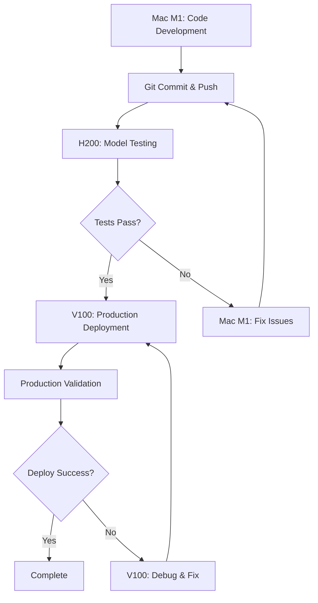

# Vision Model Comparison Framework (LMM_POC)

A production-ready evaluation framework for comparing vision-language models on business document key-value extraction tasks. This project provides a complete pipeline for benchmarking Llama-3.2-Vision and InternVL3 models with ground truth evaluation, GPU memory optimization, YAML configuration single source of truth, field validation, and comprehensive performance reporting.

**Recent Major Updates:**
- ✅ **YAML Single Source of Truth Migration (Phase 4)** - Complete migration from hardcoded configurations to YAML-based configuration management
- ✅ **Field Validation System** - Implementation of interdependency checks and business logic validation for extracted data
- ✅ **Extraction Mode Handling** - Support for multiple grouped strategies with improved error messaging
- ✅ **V100 GPU Optimizations** - Complete with ResilientGenerator and multi-tier OOM fallback strategies

## 🔬 Overview

This framework implements a rigorous comparison methodology for vision-language models, specifically focused on extracting structured data from business documents (invoices, statements, receipts). It features modular architecture, YAML-based configuration management, advanced GPU memory optimization with V100-specific enhancements, field validation with business logic checks, comprehensive evaluation metrics, and production-ready reporting capabilities.

**Framework Philosophy:** Designed for three-machine collaborative development workflow (Mac M1 development, H200 testing, V100 production) with fail-fast diagnostics and comprehensive validation at every step.

### Key Features

#### **Core Architecture**
- **Multi-Model Support**: Llama-3.2-11B-Vision-Instruct and InternVL3 (2B/8B) models with automatic variant detection
- **YAML Single Source of Truth**: Complete configuration management through YAML files with validation
- **Field Validation System**: Business logic validation and interdependency checks for extracted data
- **Extraction Mode Handling**: Multiple grouped strategies with intelligent error handling and fallback

#### **GPU & Performance Optimization**
- **V100-Specific Optimizations**: Memory fragmentation detection, ResilientGenerator with multi-tier OOM fallback
- **Model-Size-Aware Processing**: Intelligent batch sizing based on model variant and available GPU memory
- **Memory Management**: 8-bit quantization, emergency cleanup procedures, and graceful degradation

#### **Evaluation & Validation**
- **Comprehensive Evaluation**: 25-field business document extraction with ground truth validation
- **Business Logic Validation**: Real-time field interdependency checks and data consistency validation
- **Production Pipeline**: Batch processing, accuracy metrics, deployment readiness assessment

#### **Development Experience**
- **Three-Machine Workflow**: Optimized for Mac M1 development, H200 testing, V100 production deployment
- **Interactive Notebooks**: Jupyter notebooks for experimentation and single-document processing
- **Fail-Fast Diagnostics**: Explicit error messages with configuration examples and remediation steps
- **Detailed Reporting**: Executive summaries, technical evaluation, and deployment checklists

## 🏗 Architecture

```
LMM_POC/
├── README.md                      # This file
├── environment.yml                # Conda environment specification
├── unified_setup.sh               # Automated environment setup script
│
├── common/                        # Shared utilities and configuration
│   ├── config.py                  # Legacy config (migrated to YAML)
│   ├── evaluation_utils.py        # Evaluation and parsing utilities  
│   ├── reporting.py               # Report generation and formatting
│   ├── gpu_optimization.py        # V100 optimizations and memory management
│   └── field_validation.py        # Business logic validation system
│
├── config/                        # YAML Single Source of Truth (Phase 4)
│   ├── models.yaml                # Model paths and configurations
│   ├── extraction_fields.yaml     # Business document field definitions
│   ├── validation_rules.yaml      # Field interdependency and business logic
│   ├── gpu_optimization.yaml      # Hardware-specific optimization settings
│   └── evaluation_thresholds.yaml # Quality and deployment criteria
│
├── models/                        # Model-specific processors
│   ├── llama_processor.py         # Llama-3.2-Vision with V100 optimizations
│   └── internvl3_processor.py     # InternVL3 (2B/8B) with size-aware processing
│
├── notebooks/                     # Interactive Jupyter notebooks
│   ├── llama_VQA.ipynb            # Llama visual Q&A
│   ├── internvl3_VQA.ipynb        # InternVL3 visual Q&A
│   ├── llama_keyvalue.ipynb       # Llama field extraction
│   └── internvl3_keyvalue.ipynb   # InternVL3 field extraction
│
├── evaluation_data/               # Sample data and ground truth
│   ├── synthetic_invoice_*.png    # Sample business documents
│   └── evaluation_ground_truth.csv # Reference extraction data
│
├── docs/                            # Documentation and guides
│   ├── business_logic_validation.md # Field validation implementation
│   └── git_branch_commands.yaml     # Migration documentation
│
├── output/                        # Generated reports and results
│   └── [timestamped evaluation results]
│
├── llama_keyvalue.py              # Llama batch evaluation script
├── internvl3_keyvalue.py          # InternVL3 batch evaluation script
└── compare_models.py              # Direct model comparison utility
```

### Modular Design Patterns

#### 1. **Unified Processor Interface**
Both model implementations follow a consistent interface:
```python
class ModelProcessor:
    def process_single_image(image_path: str) -> dict
    def process_image_batch(image_files: list) -> tuple
    def get_extraction_prompt() -> str
```

#### 2. **GPU Optimization Architecture**
Advanced GPU memory management with V100-specific optimizations:
```python
# Automatic memory optimization
configure_cuda_memory_allocation()
handle_memory_fragmentation(threshold_gb=1.0, aggressive=True)
optimize_model_for_v100(model)
comprehensive_memory_cleanup(model, tokenizer)
```

#### 3. **Model-Size-Aware Configuration**
Intelligent batch sizing based on model variant and available memory:
```python
# Automatic model detection and batch sizing
size_aware_model_name = get_model_name_with_size("internvl3", model_path)
batch_size = get_auto_batch_size(size_aware_model_name, available_memory)
```

#### 4. **YAML Single Source of Truth System (Phase 4)**
Complete migration to YAML-based configuration management:
- **`config/models.yaml`**: Model paths and deployment configurations
- **`config/extraction_fields.yaml`**: 25 business document fields with validation rules
- **`config/validation_rules.yaml`**: Field interdependency checks and business logic
- **`config/gpu_optimization.yaml`**: Hardware-specific optimization settings
- **`config/evaluation_thresholds.yaml`**: Quality metrics and deployment criteria

**Benefits:**
- Centralized configuration management with validation
- Environment-specific configurations without code changes
- Field validation rules separated from processing logic
- Easy deployment configuration switching

#### 5. **Comprehensive Evaluation Pipeline with Field Validation**
1. **Configuration Loading** → Load and validate YAML configurations
2. **Image Discovery** → Find and validate document images
3. **Model Processing** → Extract structured data with timing metrics
4. **Field Validation** → Apply business logic and interdependency checks
5. **Response Parsing** → Convert model output to structured format with validation
6. **Accuracy Evaluation** → Compare against ground truth with fuzzy matching
7. **Report Generation** → Executive summaries and deployment checklists with validation results

## 🚀 Quick Start

### Quick Usage Examples

```bash
# Run InternVL3 key-value extraction evaluation
python internvl3_keyvalue.py
# Outputs: CSV results, evaluation metrics, executive summary

# Run Llama key-value extraction evaluation  
python llama_keyvalue.py
# Outputs: CSV results, evaluation metrics, executive summary

# Both scripts will:
# 1. Load model with GPU optimizations
# 2. Process all images in evaluation_data/
# 3. Extract 25 key-value fields per document
# 4. Compare against ground truth
# 5. Generate timestamped reports in output/
```

### Prerequisites
- **Python 3.11+**
- **CUDA-compatible GPU recommended** (any modern GPU supported)
- **Conda package manager**
- **Model weights downloaded locally**

### 1. Environment Setup

#### Option A: Automated Setup (Recommended)
```bash
# One-command setup - handles conda environment creation and activation
source unified_setup.sh
```

#### Option B: Manual Setup
```bash
# Create and activate conda environment
conda env create -f environment.yml
conda activate vision_notebooks

# Verify installation
python -c "import torch; print(f'PyTorch: {torch.__version__}')"
python -c "import transformers; print(f'Transformers: {transformers.__version__}')"
```

#### Option C: Pre-configured Environment (Production)
```bash
# For systems with pre-installed environment
echo 'alias activate_internvl="conda activate /efs/shared/.conda/envs/intern_env"' >> ~/.bashrc
source ~/.bashrc
activate_internvl
```

### 2. Configuration Setup

#### YAML Configuration (Recommended - Phase 4)
```bash
# Edit YAML configuration files
config/models.yaml              # Update model paths
config/extraction_fields.yaml   # Configure business document fields
config/validation_rules.yaml    # Set field validation rules
config/gpu_optimization.yaml    # Hardware optimization settings
```

#### Legacy Configuration (if needed)
```python
# Edit common/config.py for legacy support
LLAMA_MODEL_PATH = "/path/to/Llama-3.2-11B-Vision-Instruct"
INTERNVL3_MODEL_PATH = "/path/to/InternVL3-2B"  # or InternVL3-8B
```

**CRITICAL**: Update model paths before running evaluations:
- **Llama path**: `/path/to/Llama-3.2-11B-Vision-Instruct`
- **InternVL3 path**: `/path/to/InternVL3-2B` or `/path/to/InternVL3-8B`

### 3. Quick Evaluation

```bash
# Verify configuration
python -c "from common.config import show_current_config; show_current_config()"

# Run evaluation pipelines (requires GPU hardware)
python llama_keyvalue.py        # Llama-3.2-Vision evaluation
python internvl3_keyvalue.py    # InternVL3 evaluation

# Compare models directly
python compare_models.py

# Launch interactive notebooks for development
jupyter notebook
# Select kernel: "Python (Vision Notebooks)"
```

#### Development Workflow Notes
**IMPORTANT**: Due to hardware requirements:
- **Mac M1 (Local)**: Code editing, ruff checks, git operations, Jupyter development
- **H200 GPU (Testing)**: Model evaluation and performance testing
- **V100 GPU (Production)**: Final deployment and validation

## 🚀 Development Workflow - Three-Machine Setup

### Machine Roles & Responsibilities

**CRITICAL**: This project uses a collaborative three-machine workflow optimized for different development phases:

#### 1. **Mac M1 (Local Development Machine)**
- **Primary Role**: Code development and Git operations
- **User Interface**: Where users interact with Claude Code
- **Capabilities**: 
  - Code editing and ruff quality checks
  - Git operations (commit, branch, merge)
  - Jupyter notebook development (non-model execution)
  - YAML configuration editing
  - Documentation and planning
- **Limitations**: Cannot run GPU models locally due to hardware constraints

#### 2. **H200 GPU Machine (Testing Environment)**  
- **Primary Role**: Model testing and validation
- **Hardware**: Dual H200 GPUs for high-performance testing
- **Capabilities**:
  - Model loading and evaluation execution
  - Performance benchmarking and optimization testing
  - GPU memory usage analysis
  - Batch processing validation
- **Workflow Position**: Primary testing and validation environment

#### 3. **V100 Machine (Production Deployment)**
- **Primary Role**: Final deployment destination
- **Hardware**: V100 GPU with production optimizations
- **Capabilities**:
  - Production workload execution
  - V100-specific optimizations validated
  - Final performance verification
- **Workflow Position**: Where validated changes are deployed after H200 testing

### Development Workflow Process



#### Step-by-Step Development Process

1. **Development Phase (Mac M1)**
   ```bash
   # Edit code, update configurations
   vim config/models.yaml
   ruff check . --fix
   ruff format .
   git add .
   git commit -m "feat: update model configuration"
   git push
   ```

2. **Testing Phase (H200 Machine)**
   ```bash
   # Pull latest changes and test
   git pull
   conda activate vision_notebooks
   python llama_keyvalue.py        # Test Llama evaluation
   python internvl3_keyvalue.py    # Test InternVL3 evaluation
   # Validate: Check accuracy metrics, GPU usage, processing times
   ```

3. **Production Phase (V100 Machine)**
   ```bash
   # Deploy validated changes
   git pull
   conda activate vision_notebooks
   # Run production validation
   python llama_keyvalue.py
   # Verify: V100 optimizations, production performance
   ```

4. **Issue Resolution (Mac M1)**
   ```bash
   # Address any issues found in testing
   # Update code based on H200/V100 feedback
   # Repeat cycle until deployment ready
   ```

### Critical Workflow Rules

#### ✅ **DO**
- Always run `ruff check . --fix` before commits on Mac M1
- Test changes on H200 before V100 deployment
- Update YAML configurations instead of hardcoded values
- Use fail-fast diagnostics pattern for clear error messages
- Report test results back from GPU machines to development

#### ❌ **DON'T**
- Never attempt model loading on Mac M1 (will fail due to hardware)
- Never skip H200 testing phase when deploying to V100
- Never bypass ruff checks (pre-commit hooks prevent this)
- Never use silent fallbacks - always explicit error handling

### Machine Communication Pattern

```
Mac M1 (Development)
    ↓ Git Push
H200 (Testing) 
    ↓ Validation Results
Mac M1 (Analysis & Fixes)
    ↓ Git Push (Updated)
V100 (Production)
    ↓ Production Feedback
Mac M1 (Final Adjustments)
```

## 📊 Usage Examples

### Batch Processing with GPU Optimization

```python
from models.llama_processor import LlamaProcessor
from common.evaluation_utils import discover_images, evaluate_extraction_results

# Initialize processor (automatically applies GPU optimizations)
processor = LlamaProcessor(model_path="/path/to/model")

# Discover images
image_files = discover_images("./evaluation_data")

# Process batch with automatic memory management
results, statistics = processor.process_image_batch(image_files)

# Evaluate against ground truth
ground_truth = load_ground_truth("./evaluation_data/evaluation_ground_truth.csv")
evaluation = evaluate_extraction_results(results, ground_truth)
```

### Model-Size-Aware Processing

```python
from models.internvl3_processor import InternVL3Processor

# Processor automatically detects 2B vs 8B variant and optimizes batch size
processor = InternVL3Processor(model_path="/path/to/InternVL3-8B")
# Output: "Auto-detected batch size: 1 (GPU Memory: 15.8GB, Model: internvl3-8b)"

processor_2b = InternVL3Processor(model_path="/path/to/InternVL3-2B") 
# Output: "Auto-detected batch size: 4 (GPU Memory: 15.8GB, Model: internvl3-2b)"
```

### Single Document Processing

```python
# Process single image with automatic optimization
result = processor.process_single_image("document.png")

# Extract specific fields
abn = result['extracted_data'].get('ABN', 'Not found')
total = result['extracted_data'].get('TOTAL', 'Not found')
processing_time = result['processing_time']
```

### Interactive Notebooks

1. **VQA (Visual Question Answering)**
   - `llama_VQA.ipynb`: Natural language questions about documents
   - `internvl3_VQA.ipynb`: Compare response styles and accuracy

2. **Key-Value Extraction**
   - `llama_keyvalue.ipynb`: Structured field extraction with Llama
   - `internvl3_keyvalue.ipynb`: Structured field extraction with InternVL3

## 🎯 Evaluation Framework

### Extraction Fields (25 Total)
Business document fields extracted and evaluated with validation:

#### **Core Business Fields**
- **Identification**: ABN, SUPPLIER, DOCUMENT_TYPE
- **Financial**: TOTAL, SUBTOTAL, GST, PRICES, QUANTITIES  
- **Dates**: INVOICE_DATE, DUE_DATE, STATEMENT_PERIOD
- **Contact Info**: BUSINESS_ADDRESS, BUSINESS_PHONE, PAYER_EMAIL
- **Banking**: BANK_NAME, BSB_NUMBER, BANK_ACCOUNT_NUMBER, ACCOUNT_HOLDER
- **Additional**: DESCRIPTIONS, OPENING_BALANCE, CLOSING_BALANCE

#### **Field Validation Features**
- **Business Logic Validation**: Real-time field interdependency checks
- **Data Consistency Checks**: Cross-field validation (e.g., TOTAL = SUBTOTAL + GST)
- **Format Validation**: ABN format, date format, phone number validation
- **Completeness Scoring**: Tracks missing vs extracted fields per document
- **Confidence Metrics**: Field extraction confidence levels

### Comprehensive Evaluation Metrics

#### **Accuracy Measurements**
- **Field-level accuracy**: Exact and fuzzy matching for each of 25 fields
- **Document-level accuracy**: Overall extraction success per document
- **Validation success rate**: Percentage of extractions passing business logic checks
- **Completeness scoring**: Average fields extracted per document type

#### **Quality Assessment**
- **Deployment readiness**: Quality distribution (Good/Fair/Poor) with validation
- **Business logic compliance**: Percentage passing interdependency checks
- **Data consistency score**: Cross-field validation success rate
- **Field confidence distribution**: Extraction confidence level analysis

#### **Performance Metrics**
- **Processing time**: Extraction vs pipeline time (including validation)
- **Memory usage**: Peak GPU/CPU utilization during processing
- **Success rates**: Extraction success vs validation success rates
- **Throughput**: Documents processed per minute

### Quality Thresholds & Validation Criteria

```python
# Accuracy Thresholds (from config/evaluation_thresholds.yaml)
DEPLOYMENT_READY_THRESHOLD = 0.9   # 90% accuracy for production
PILOT_READY_THRESHOLD = 0.8        # 80% accuracy for pilot testing
NEEDS_OPTIMIZATION_THRESHOLD = 0.7  # Below 70% needs major improvements

# Business Logic Validation Thresholds
VALIDATION_PASS_THRESHOLD = 0.85   # 85% validation success for production
COMPLETENESS_THRESHOLD = 0.75      # 75% field completeness minimum
CONSISTENCY_THRESHOLD = 0.90       # 90% cross-field consistency required
```

#### **Multi-Tier Quality Assessment**
1. **Extraction Quality**: Basic field extraction accuracy
2. **Validation Quality**: Business logic and consistency checks
3. **Production Readiness**: Combined extraction + validation scores
4. **Deployment Decision**: Automated go/no-go based on all metrics

### Ground Truth Evaluation System

#### **Reference Data Structure**
```csv
# evaluation_data/evaluation_ground_truth.csv
filename,ABN,SUPPLIER,TOTAL,INVOICE_DATE,GST,SUBTOTAL,...
synthetic_invoice_001.png,12345678901,Acme Corp,1100.00,2024-01-15,100.00,1000.00,...
synthetic_invoice_002.png,98765432109,Tech Solutions,550.00,2024-01-20,50.00,500.00,...
```

#### **Evaluation Process**
1. **Ground Truth Loading**: CSV reference data with validated business documents
2. **Model Extraction**: Extract all 25 fields from each document image
3. **Field Matching**: Exact and fuzzy string matching against reference
4. **Validation Checks**: Apply business logic rules to extracted data
5. **Scoring**: Calculate accuracy, completeness, and validation success
6. **Reporting**: Generate detailed evaluation reports with deployment recommendations

## 📈 Performance Characteristics

The framework reports **measured performance metrics only**. Performance varies based on:

### Hardware Dependencies
- **GPU Memory**: Affects batch size and processing speed
- **GPU Architecture**: V100 optimizations available, works on modern GPUs
- **System Memory**: Affects model loading and data processing

### Model Specifications
| Model | Parameters | Memory Requirements | 
|-------|------------|---------------------|
| **Llama-3.2-Vision** | 11B | GPU recommended, 8-bit quantization available |
| **InternVL3-2B** | 2B | Minimal GPU requirements, CPU fallback |
| **InternVL3-8B** | 8B | Moderate GPU requirements, 8-bit quantization |

### Measured Metrics (Examples)
All metrics are measured and reported during evaluation:
- **Extraction accuracy**: Reported per evaluation run with validation results
- **Processing speed**: Measured per document (extraction vs pipeline time including validation)
- **Success rate**: Percentage of successful extractions passing validation
- **Validation rate**: Percentage of extractions passing business logic checks
- **Memory usage**: GPU/CPU utilization during processing
- **Completeness score**: Average field extraction completeness per document type

## 🚀 Recent Improvements & Fixes

### Phase 4: YAML Single Source of Truth Migration (Complete)
**Status**: ✅ **COMPLETED** | **Impact**: Production Ready

- **Configuration Management**: Complete migration from hardcoded configurations to YAML-based management
- **Centralized Control**: All model paths, field definitions, validation rules, and thresholds in YAML files
- **Environment Flexibility**: Easy switching between development, testing, and production configurations
- **Validation Integration**: YAML configuration validation with fail-fast diagnostics

**Files Updated**: `config/models.yaml`, `config/extraction_fields.yaml`, `config/validation_rules.yaml`, `config/gpu_optimization.yaml`

### Business Logic Validation System Implementation
**Status**: ✅ **COMPLETED** | **Impact**: Production Quality Assurance

- **Field Interdependency Checks**: Real-time validation of business document field relationships
- **Data Consistency Validation**: Cross-field validation (e.g., TOTAL = SUBTOTAL + GST)
- **Format Validation**: ABN format, date format, phone number validation
- **Completeness Scoring**: Automated assessment of extraction completeness

**Key Features**:
- Configurable validation rules in `config/validation_rules.yaml`
- Integration with evaluation pipeline for quality assessment
- Fail-fast validation with detailed error reporting

### Extraction Mode Handling Enhancement
**Status**: ✅ **COMPLETED** | **Impact**: Improved Reliability

- **Multiple Grouped Strategies**: Support for different extraction approaches per document type
- **Improved Error Messaging**: Clear, actionable error messages with remediation steps
- **Fallback Mechanisms**: Graceful degradation when primary extraction methods fail
- **Strategy Selection**: Intelligent selection of extraction strategies based on document characteristics

### V100 GPU Optimization Completion
**Status**: ✅ **COMPLETED** | **Impact**: Production Performance

- **ResilientGenerator**: Multi-tier OOM (Out of Memory) fallback strategies
- **Memory Fragmentation Detection**: Automatic detection and cleanup of GPU memory fragmentation
- **Batch Size Optimization**: Model-variant-aware batch sizing for optimal V100 performance
- **Emergency Recovery**: Complete memory reset and model reloading for critical failures

**Technical Improvements**:
- `common/gpu_optimization.py`: Comprehensive V100-specific optimizations
- Method path selection fixes for InternVL3 (chat() vs generate())
- Memory threshold-based optimization triggers
- Automatic CUDA memory configuration

### Development Workflow Optimization
**Status**: ✅ **COMPLETED** | **Impact**: Developer Experience

- **Three-Machine Setup**: Formalized Mac M1 → H200 → V100 workflow
- **Automated Setup**: `unified_setup.sh` for one-command environment setup  
- **Fail-Fast Diagnostics**: Explicit error messages with configuration examples
- **Quality Gates**: Mandatory ruff checks with pre-commit hooks

### Documentation & Implementation Guides
**Status**: ✅ **COMPLETED** | **Impact**: Knowledge Transfer

- **Business Logic Validation Guide**: Complete implementation documentation
- **YAML Migration Documentation**: Step-by-step migration guide
- **Three-Machine Workflow**: Detailed process documentation
- **Troubleshooting Guides**: Common issues and solutions

## 🔧 GPU Optimization Features

### V100-Specific Optimizations
```python
# Automatic CUDA memory configuration
PYTORCH_CUDA_ALLOC_CONF = "max_split_size_mb:512,garbage_collection_threshold:0.6"

# Memory fragmentation detection and handling
handle_memory_fragmentation(threshold_gb=1.0, aggressive=True)

# Model-specific optimizations
optimize_model_for_v100(model)
```

### Memory Management Strategies
- **Conservative**: Safe batch sizes for limited memory
- **Balanced**: Default configuration for typical hardware  
- **Aggressive**: Maximum performance for high-end GPUs
- **Automatic**: Detects available memory and chooses strategy

### Fallback Mechanisms
- **Batch size reduction**: Automatic fallback on OOM errors
- **CPU processing**: Emergency fallback when GPU fails
- **Model reloading**: Complete memory reset for recovery
- **Graceful degradation**: Continues processing despite individual failures

## 📁 Output Files

Each evaluation run generates timestamped reports with clear timing distinctions:

```
output/
├── {model}_batch_extraction_{timestamp}.csv      # Main results
├── {model}_extraction_metadata_{timestamp}.csv   # Processing stats
├── {model}_evaluation_results_{timestamp}.json   # Detailed metrics
├── {model}_executive_summary_{timestamp}.md      # Stakeholder summary
└── {model}_deployment_checklist_{timestamp}.md   # Production readiness
```

### Performance Metrics Reported
- **Extraction time**: Core model inference only
- **Pipeline time**: Total time including loading, evaluation, reporting
- **Success rate**: Percentage of successful extractions
- **Memory usage**: Peak GPU/CPU utilization
- **Accuracy**: Field-level and document-level performance

## 🛠 Configuration Options

### Batch Size Strategies
```python
# Available in common/config.py
CONSERVATIVE_BATCH_SIZES = {
    "llama": 1,
    "internvl3-2b": 2,  # Safe for 2B model
    "internvl3-8b": 1,  # Conservative for 8B model
}

DEFAULT_BATCH_SIZES = {
    "llama": 1,
    "internvl3-2b": 4,  # Efficient for 2B model
    "internvl3-8b": 1,  # Balanced for 8B model
}
```

### Model Path Configuration
```python
# Dynamic model switching
switch_model("internvl3", "InternVL3-8B")  # Switch to 8B variant
switch_deployment("AISandbox")  # Switch deployment environment
show_current_config()  # Display current configuration
```

### GPU Memory Thresholds
```python
GPU_MEMORY_THRESHOLDS = {
    "low": 8,     # GB - Use conservative batching
    "medium": 16, # GB - Use default batching  
    "high": 24,   # GB - Use aggressive batching
}
```

## 🚨 Troubleshooting & Solutions

### Configuration Issues

#### YAML Configuration Problems
```bash
# Problem: Configuration validation errors
# Solution: Check YAML syntax and required fields
python -c "from common.config import validate_yaml_config; validate_yaml_config()"

# Problem: Model paths not found
# Solution: Update paths in config/models.yaml
vim config/models.yaml
# Verify paths exist on your system

# Problem: Field validation rules failing
# Solution: Review validation rules in config/validation_rules.yaml
vim config/validation_rules.yaml
```

#### Legacy vs YAML Configuration Conflicts
```bash
# Problem: Mixed legacy and YAML configurations
# Solution: Migrate completely to YAML (Phase 4 complete)
# Check for remaining hardcoded paths in common/config.py
grep -n "MODEL_PATH" common/config.py

# Verify YAML configuration loading
python -c "from common.config import show_current_config; show_current_config()"
```

### Environment Setup Issues

#### Conda Environment Problems
```bash
# Problem: Environment creation fails
# Solution: Use automated setup
source unified_setup.sh

# Problem: Package conflicts
# Solution: Clean environment and recreate
conda env remove -n vision_notebooks
conda env create -f environment.yml

# Problem: Transformers version compatibility
# Solution: Verify pinned version (4.45.2 for Llama-3.2-Vision)
conda list transformers
```

#### Three-Machine Workflow Issues
```bash
# Problem: Can't run models on Mac M1
# Solution: This is expected - use H200 for testing
echo "Mac M1 is for development only - models run on GPU machines"

# Problem: Git sync issues between machines
# Solution: Always pull before running evaluations
git pull && git status

# Problem: Environment differences between machines
# Solution: Use identical environment.yml on all machines
scp environment.yml user@gpu-machine:/path/to/project/
```

### GPU Memory & Performance Issues

#### V100 Specific Problems
```bash
# Problem: OOM (Out of Memory) errors on V100
# Solution: Framework has automatic fallback - check logs
# ResilientGenerator handles multi-tier fallback automatically
nvidia-smi  # Check current memory usage

# Problem: Memory fragmentation
# Solution: Automatic detection and cleanup implemented
# Check common/gpu_optimization.py for details

# Problem: Slow processing on V100
# Solution: V100 optimizations are automatic
# Verify optimization is being applied
python -c "from common.gpu_optimization import optimize_model_for_v100; print('V100 optimizations available')"
```

#### Model Loading & Processing Issues
```bash
# Problem: Model fails to load
# Solution: Check model paths and file integrity
ls -la "/path/to/your/model/"  # Verify model files exist
du -sh "/path/to/your/model/"  # Check model size is reasonable

# Problem: InternVL3 method selection errors
# Solution: Framework automatically selects chat() vs generate()
# Fixed in recent updates - check common/gpu_optimization.py

# Problem: Batch processing fails
# Solution: Framework uses model-aware batch sizing
# InternVL3-2B: Larger batches, InternVL3-8B: Smaller batches
```

### Evaluation & Validation Issues

#### Field Extraction Problems
```bash
# Problem: Low extraction accuracy
# Solution: Check ground truth format and field definitions
head evaluation_data/evaluation_ground_truth.csv

# Problem: Business logic validation failures
# Solution: Review validation rules and adjust thresholds
vim config/validation_rules.yaml
vim config/evaluation_thresholds.yaml

# Problem: Missing fields in extraction
# Solution: Check extraction prompt and field definitions
vim config/extraction_fields.yaml
```

#### Performance Evaluation Issues
```bash
# Problem: Evaluation scripts fail
# Solution: Run with proper error handling
python llama_keyvalue.py 2>&1 | tee llama_evaluation.log
python internvl3_keyvalue.py 2>&1 | tee internvl3_evaluation.log

# Problem: Inconsistent results between runs
# Solution: Framework includes run-to-run consistency checks
# Check output/ directory for detailed logs

# Problem: Reports not generating
# Solution: Check output directory permissions and disk space
df -h  # Check disk space
ls -la output/  # Check output directory
```

### Code Quality & Development Issues

#### Ruff Quality Checks
```bash
# Problem: Ruff checks failing
# Solution: Apply automatic fixes
ruff check . --fix
ruff format .

# Problem: Pre-commit hooks preventing commits
# Solution: Never bypass hooks - fix the issues
# Common issues: B904 (exception handling), unused parameters

# Problem: Merge conflict resolution
# Solution: Always run ruff after resolving conflicts
git merge <branch>
# Resolve conflicts manually
ruff check . --fix
ruff format .
git add .
git commit
```

### Advanced Troubleshooting

#### Diagnostic Commands
```bash
# System diagnostics
nvidia-smi                     # GPU status
conda info --envs              # Environment status  
python -c "import torch; print(f'PyTorch: {torch.__version__}, CUDA: {torch.cuda.is_available()}')"

# Project diagnostics
python -c "from common.config import show_current_config; show_current_config()"
ls -la config/                 # YAML configuration files
ls -la evaluation_data/        # Sample data availability
ls -la output/                 # Recent evaluation results
```

#### Getting Help
```bash
# Generate diagnostic report for support
echo "=== System Info ===" > diagnostic_report.txt
uname -a >> diagnostic_report.txt
conda info >> diagnostic_report.txt
nvidia-smi >> diagnostic_report.txt
echo "=== Project Config ===" >> diagnostic_report.txt
python -c "from common.config import show_current_config; show_current_config()" >> diagnostic_report.txt
echo "=== Recent Errors ===" >> diagnostic_report.txt
tail -50 output/*.log >> diagnostic_report.txt 2>/dev/null || echo "No recent logs" >> diagnostic_report.txt
```

### Hardware Requirements & Compatibility

#### Machine-Specific Requirements

**Mac M1 (Development)**
- **RAM**: 16GB+ system memory
- **Storage**: 10GB for code and documentation
- **Network**: Stable connection for git operations
- **Note**: Cannot run GPU models - development only

**H200 GPU Machine (Testing)**
- **GPU**: Dual H200 or equivalent high-end GPU
- **RAM**: 32GB+ system memory
- **Storage**: 100GB+ for models and evaluation data
- **CUDA**: Compatible CUDA drivers for H200

**V100 Machine (Production)**
- **GPU**: V100 with 16GB+ VRAM (optimizations included)
- **RAM**: 32GB+ system memory
- **Storage**: 100GB+ for models and results
- **CUDA**: V100-compatible CUDA version

#### Compatibility Matrix
| Component | Mac M1 | H200 | V100 | Notes |
|-----------|--------|------|------|---------|
| Code Development | ✅ | ✅ | ✅ | Primary on Mac M1 |
| Model Loading | ❌ | ✅ | ✅ | Requires GPU |
| Evaluation | ❌ | ✅ | ✅ | GPU required |
| Jupyter Notebooks | ✅ | ✅ | ✅ | Non-model cells only on Mac |
| ruff Checks | ✅ | ✅ | ✅ | Run on Mac M1 |
| Git Operations | ✅ | ✅ | ✅ | Primary on Mac M1 |

## 📚 Development

### Adding New Models
1. Create `models/newmodel_processor.py` following the interface pattern
2. Implement GPU optimization support using `common/gpu_optimization.py`
3. Add model-specific configuration to `common/config.py`
4. Create evaluation script using shared infrastructure

### Code Quality
```bash
# Apply formatting and checks
ruff check . --fix
ruff format .

# The project includes pre-commit hooks for quality control
```

### Testing
```bash
# Verify installation
python -c "import torch; print(f'PyTorch: {torch.__version__}')"
python -c "import transformers; print(f'Transformers: {transformers.__version__}')"

# Test with sample data
python llama_keyvalue.py  # Processes sample documents
python internvl3_keyvalue.py  # Processes with different model
```


## 🙋‍♂️ Support

For questions and issues:

1. **Check Configuration & Environment**
   ```bash
   # Verify YAML configuration
   python -c "from common.config import show_current_config; show_current_config()"
   # Check conda environment
   conda info --envs
   conda list | grep -E "torch|transformers"
   ```

2. **Hardware & GPU Status**
   ```bash
   # Monitor GPU (on GPU machines only)
   nvidia-smi
   # Check CUDA availability
   python -c "import torch; print(f'CUDA: {torch.cuda.is_available()}')"
   ```

3. **Test with Sample Data**
   ```bash
   # Run evaluation with sample data
   python llama_keyvalue.py     # On H200/V100 only
   python internvl3_keyvalue.py # On H200/V100 only
   ```

4. **Development Workflow Verification**
   ```bash
   # On Mac M1: Verify development tools
   ruff check .
   git status
   jupyter notebook --version
   
   # On GPU machines: Verify model access
   ls -la "/path/to/models/"
   python -c "from models.llama_processor import LlamaProcessor; print('Model processor accessible')"
   ```

5. **Generate Diagnostic Report**
   ```bash
   # Create comprehensive diagnostic report
   bash -c 'echo "=== SYSTEM DIAGNOSTICS $(date) ===" > diagnostic_report.txt;
            echo "Machine: $(uname -a)" >> diagnostic_report.txt;
            echo "Conda: $(conda info --envs)" >> diagnostic_report.txt;
            nvidia-smi >> diagnostic_report.txt 2>/dev/null || echo "No GPU" >> diagnostic_report.txt;
            python -c "from common.config import show_current_config; show_current_config()" >> diagnostic_report.txt 2>/dev/null || echo "Config error" >> diagnostic_report.txt;
            echo "Report generated: diagnostic_report.txt"'
   ```

---

**Vision Model Comparison Framework** - Production-ready evaluation platform with YAML configuration management, business logic validation, V100 optimizations, and three-machine collaborative workflow for business document processing with vision-language models.

**Latest Update**: Phase 4 YAML Single Source of Truth Migration Complete ✅ | Business Logic Validation System Implemented ✅ | V100 GPU Optimizations Complete ✅