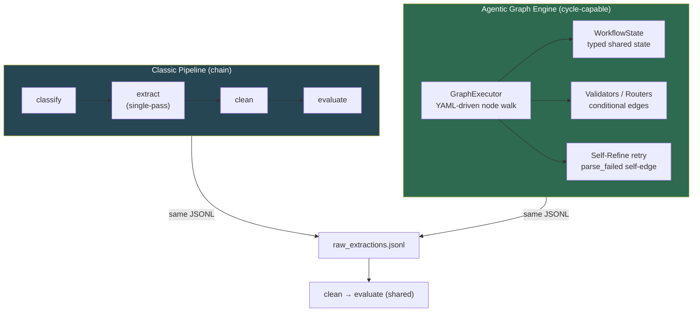
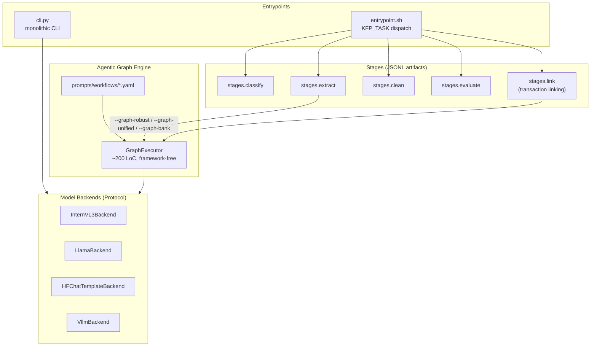
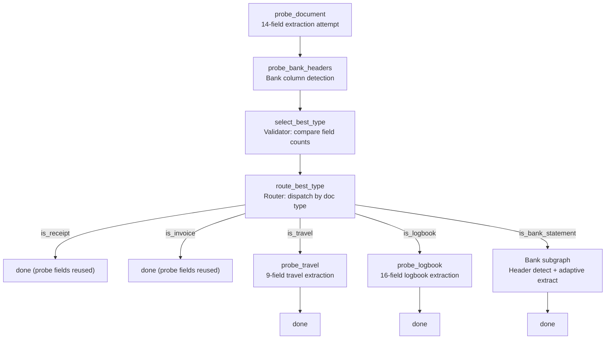
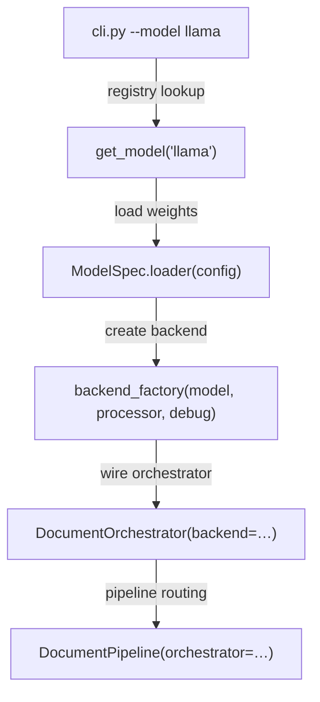
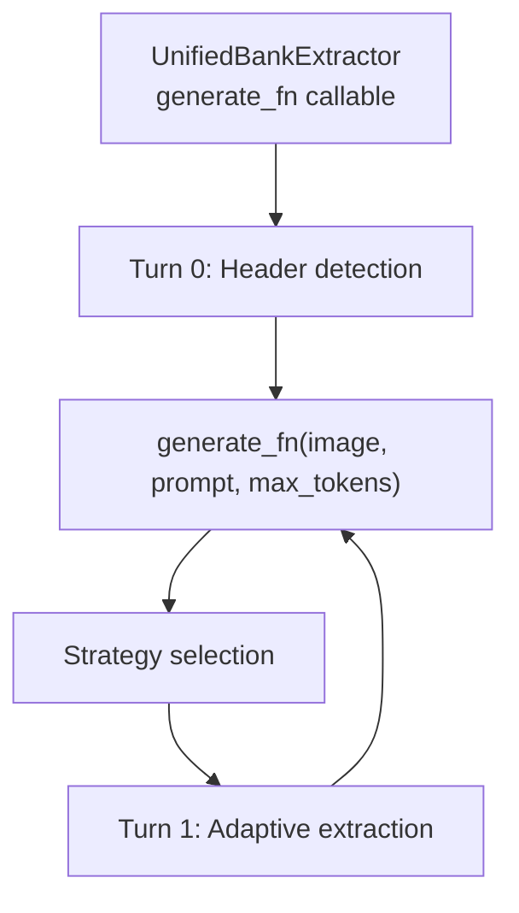
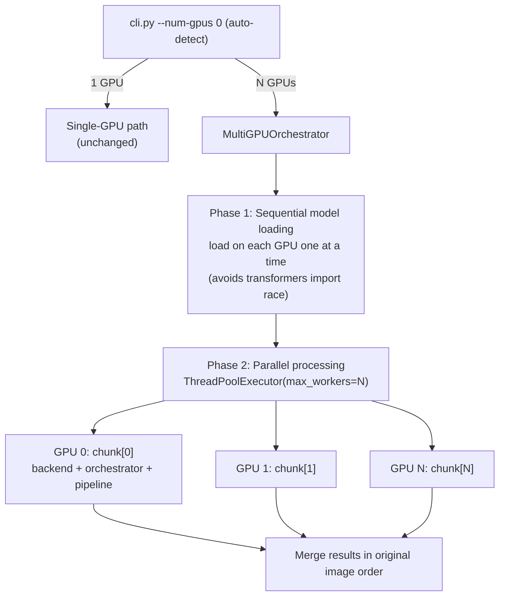

# Agentic Document Extraction Engine

A vision-language extraction system for business documents. Two execution shapes share the same JSONL artifact contract:

- **Classic pipeline** — chain-shaped: `classify → extract (single-pass) → clean → evaluate`. Right for invoices, receipts, travel expenses, and vehicle logbooks where one image maps to one prompt.
- **Agentic graph engine** — cycle-capable: YAML-defined node graphs with typed shared state (`WorkflowState`), conditional routing, validators, and Self-Refine retry on parse failure. Right for multi-turn workloads (bank statements, receipt-to-bank transaction linking) and probe-based classification (`the extraction IS the classification`).

Both modes emit the same `raw_extractions.jsonl`, so the downstream `clean` and `evaluate` stages are unchanged. The graph engine is implemented in ~200 lines of framework-free Python (`common/graph_executor.py`) with no LangChain / LangGraph dependency.

> **Engine deep-dive**: see [`common/AGENTIC_ENGINE_README.md`](common/AGENTIC_ENGINE_README.md) for the GraphExecutor walk loop, node types, parser registry, post-processing helpers, and a step-by-step guide to authoring new workflows. See [`docs/graph_extraction_engine.md`](docs/graph_extraction_engine.md) for the probe-based classification design and bank subgraph internals.

---

## Two Execution Shapes


```mermaid
graph TB
    subgraph Classic["Classic Pipeline (chain)"]
        C1["classify"] --> C2["extract<br/>(single-pass)"] --> C3["clean"] --> C4["evaluate"]
    end

    subgraph Graph["Agentic Graph Engine (cycle-capable)"]
        G1["GraphExecutor<br/>YAML-driven node walk"]
        G2["WorkflowState<br/>typed shared state"]
        G3["Validators / Routers<br/>conditional edges"]
        G4["Self-Refine retry<br/>parse_failed self-edge"]
        G1 --> G2
        G1 --> G3
        G1 --> G4
    end

    Classic -->|same JSONL| Out["raw_extractions.jsonl"]
    Graph -->|same JSONL| Out
    Out --> CL["clean → evaluate (shared)"]

    style Classic fill:#264653,color:#fff
    style Graph fill:#2d6a4f,color:#fff
```

### When each shape is used

| Workload | Shape | Why |
|---|---|---|
| Invoice / receipt / travel / logbook extraction | Single-pass | One image → one prompt → field set. No state to carry between turns. |
| Bank statement extraction | Multi-turn | Turn 0 detects column headers; Turn 1 adapts the extraction prompt to that layout. Two implementations: `UnifiedBankExtractor` (default) and the graph engine via `--graph-bank` (opt-in). |
| Receipt-to-bank transaction linking | Cross-image graph | Receipt fields are injected into the bank-statement matching prompt. Validator gates the match by amount tolerance. |
| Mixed-type batches | Probe-based graph (`--graph-robust`) | One extraction probe + one bank-header probe; the engine picks the winner by counting recovered fields. Eliminates misclassification-induced extraction errors. |

---

## Supported Document Types

| Type | Key | Fields | Extraction Method |
|------|-----|--------|-------------------|
| Invoice | `INVOICE` | 14 | Single-pass (batched or sequential) |
| Receipt | `RECEIPT` | 14 | Single-pass (batched or sequential) |
| Bank Statement | `BANK_STATEMENT` | 5 | Multi-turn (UnifiedBankExtractor or graph) |
| Travel Expense | `TRAVEL` | 9 | Single-pass with dedicated probe |
| Vehicle Logbook | `LOGBOOK` | 16 | Single-pass with dedicated probe |
| Transaction Link | `TRANSACTION_LINK` | 8 | Cross-image graph (receipt + bank statement) |
| Universal | `UNIVERSAL` | 35 | Superset fallback |

## Registered Models

| Model | Type | Backend | Bank Extraction | Batch Inference |
|-------|------|---------|-----------------|-----------------|
| InternVL3.5-8B | `internvl3` | HF (custom) | Multi-turn | Yes |
| InternVL3.5-14B | `internvl3-14b` | HF (custom) | Multi-turn | Yes |
| InternVL3.5-38B | `internvl3-38b` | HF (custom, sharded) | Multi-turn | Yes |
| Llama 3.2-11B Vision | `llama` | HF (custom) | Multi-turn | Sequential only |
| Llama 4 Scout 17B-16E | `llama4scout` | HF (chat template) | Multi-turn | Sequential only |
| Granite 4.0 3B Vision | `granite4` | HF (chat template) | Multi-turn | Sequential only |
| Qwen3-VL-8B | `qwen3vl` | HF (chat template) | Multi-turn | Sequential only |
| Qwen3.5-27B | `qwen35` | HF (chat template, sharded) | Multi-turn | Sequential only |
| Nemotron Nano 12B v2 VL | `nemotron` | HF (chat template) | Multi-turn | Sequential only |
| InternVL3.5-8B (vLLM) | `internvl3-vllm` | vLLM | Multi-turn | PagedAttention |
| Llama 4 Scout W4A16 | `llama4scout-w4a16` | vLLM | Multi-turn | PagedAttention |
| Qwen3-VL-8B (vLLM) | `qwen3vl-vllm` | vLLM | Multi-turn | PagedAttention |
| Gemma 4 31B-it | `gemma4` | vLLM | Multi-turn | PagedAttention |

---

## Architecture Overview

The system has two entrypoints (`entrypoint.sh` for KFP/dev, `cli.py` for ad-hoc), four shared stages, the graph engine for multi-turn workloads, and a Protocol-based backend layer:


```mermaid
graph TD
    subgraph Entrypoints
        EP["entrypoint.sh<br/>KFP_TASK dispatch"]
        CLI["cli.py<br/>monolithic CLI"]
    end

    subgraph Stages["Stages (JSONL artifacts)"]
        S1["stages.classify"]
        S2["stages.extract"]
        S3["stages.clean"]
        S4["stages.evaluate"]
        S5["stages.link<br/>(transaction linking)"]
    end

    subgraph GraphEngine["Agentic Graph Engine"]
        GE["GraphExecutor<br/>~200 LoC, framework-free"]
        WF["prompts/workflows/*.yaml"]
        WF --> GE
    end

    subgraph Backends["Model Backends (Protocol)"]
        IVL["InternVL3Backend"]
        LLAMA["LlamaBackend"]
        HF["HFChatTemplateBackend"]
        VLLM["VllmBackend"]
    end

    EP --> S1 & S2 & S3 & S4 & S5
    CLI --> Backends

    S2 -->|--graph-robust / --graph-unified / --graph-bank| GE
    S5 --> GE
    GE --> Backends
```

### Key Design Principles

1. **Composition over inheritance.** `DocumentOrchestrator` *has-a* `ModelBackend` rather than inheriting from a base class. Backends implement a 3-method Protocol (`model`, `processor`, `generate()`); all shared logic lives in the orchestrator.

2. **Declarative model registration** (`models/registry.py`). `ModelSpec` and `VllmSpec` dataclasses replace ~600 lines of hand-written loaders. Each registration is ~8 lines.

3. **Ports & Adapters response handling** (`common/response_handler.py`). Four narrow Protocol ports — `ResponseParser`, `FieldCleaner`, `BusinessValidator`, `FieldSchemaPort` — compose into a `ResponseHandler` that runs parse → clean → validate. GPU-free testable.

4. **Callable-based bank extraction.** `UnifiedBankExtractor` accepts a `generate_fn` callable, so HF and vLLM backends share the same multi-turn pipeline with no model-type branching.

5. **Config cascade.** CLI flags > YAML (`run_config.yml`) > env vars (`IVL_*`) > dataclass defaults. `AppConfig.load()` collapses what was a 7-step config dance plus 13 mutable globals.

6. **Graph engine as additive layer.** `GraphExecutor` walks YAML-defined node graphs with typed `WorkflowState`, Self-Refine retry on parse failure, and a `WorkflowTrace` for observability. It produces the same JSONL artifact format as the single-pass path, so `clean.py` and `evaluate.py` are unchanged.

---

## The Agentic Graph Engine

The `GraphExecutor` is a YAML-driven node graph walker for multi-turn, multi-probe extraction. ~200 lines of framework-free Python with `match/case` dispatch (PEP 634).

### Core Concepts

- **Nodes** — each node is a prompt template with a parser and named edges to the next node.
- **Typed state** — `WorkflowState` carries parser outputs between nodes, accessed via dot-paths (`detect_headers.column_mapping.debit`). Implements the MetaGPT structured-output pattern: downstream nodes consume typed dicts, not raw strings.
- **Validators and routers** — `type: validator` nodes run named checks (e.g. `amount_gate`) and emit `ok` / `failed`. `type: router` nodes branch on state conditions. Neither makes a model call.
- **Self-Refine retry** — on `ParseError`, the executor follows the `parse_failed` self-edge, appending a `reflection` template (with `{error}` substituted) to the original prompt. After exhausting `max_retries`, it proceeds via `ok` with the error payload — never silently drops data.
- **Circuit breaker** — `max_graph_steps=20` (configurable) caps total node executions, preventing infinite loops from misconfigured edges.
- **Observability** — `WorkflowTrace` records every node visited, every edge taken, retry counts, total model calls, and elapsed time. Serialized into `raw_extractions.jsonl`.

### Available Workflows

| Workflow | YAML | Flag / Stage | Description |
|----------|------|--------------|-------------|
| Robust Extract | `robust_extract.yaml` | `--graph-robust` | Probe-based classification + extraction |
| Unified Extract | `unified_extract.yaml` | `--graph-unified` | Classify + extract in a single graph pass |
| Bank Extract | `bank_extract.yaml` | `--graph-bank` | Graph-based bank statement extraction |
| Transaction Link | `transaction_link.yaml` | `python -m stages.link` | Cross-image receipt-to-bank matching |

### Probe-Based Classification (`--graph-robust`)

Eliminates misclassification by replacing the separate classification call with two extraction probes. The validator picks the winner; the extracted fields from the winning probe are reused, so receipts and invoices need no second pass.


```mermaid
graph TD
    PD["probe_document<br/>14-field extraction attempt"]
    PB["probe_bank_headers<br/>Bank column detection"]
    SBT["select_best_type<br/>Validator: compare field counts"]
    RBT["route_best_type<br/>Router: dispatch by doc type"]

    PD --> PB --> SBT --> RBT

    RBT -->|"is_receipt"| DONE1["done (probe fields reused)"]
    RBT -->|"is_invoice"| DONE2["done (probe fields reused)"]
    RBT -->|"is_travel"| PT["probe_travel<br/>9-field travel extraction"]
    RBT -->|"is_logbook"| PL["probe_logbook<br/>16-field logbook extraction"]
    RBT -->|"is_bank_statement"| BANK["Bank subgraph<br/>Header detect + adaptive extract"]

    PT --> DONE3["done"]
    PL --> DONE4["done"]
    BANK --> DONE5["done"]
```

**Model calls per document type**:
- Receipt / Invoice — 2 (document probe + bank-header probe; fields already extracted)
- Travel / Logbook — 3 (probes + type-specific extraction)
- Bank Statement — 4 (probes + header detect + adaptive extraction)

The `select_best_type` validator scores both probes: the document probe by counting non-`NOT_FOUND` fields, the bank probe by counting detected column mappings. Bank wins when it has 3+ real columns AND the document probe scored below 6 fields.

### Transaction Linking (`stages.link`)

Pairs a receipt image with a bank statement image and produces a single `raw_extractions.jsonl` record:

```bash
python -m stages.link \
  --pairs pairs.csv \
  --data-dir /data/images \
  --output /artifacts/raw_extractions.jsonl \
  --model internvl3-vllm
```

The four-node graph (`extract_receipts → detect_headers → match_to_statement → validate_amounts`) flows receipt fields and bank header columns into the matching prompt; an amount-tolerance validator overrides matches that disagree by >1%.

---

## The Classic Pipeline

For document types where one prompt extracts everything (invoices, receipts, travel, logbooks), the classic four-stage chain is the simpler path:

```
classify (GPU) → classifications.jsonl
    → extract (GPU) → raw_extractions.jsonl
        → clean (CPU) → cleaned_extractions.jsonl
            → evaluate (CPU) → evaluation_results.jsonl
```

CPU stages don't need a GPU allocation, which matters for KFP pod scheduling.

The `extract` stage routes by document type:
- Invoice / receipt / travel / logbook → single-pass via `DocumentOrchestrator.process()`
- Bank statement → multi-turn via `UnifiedBankExtractor` (or graph if `--graph-bank` is set)

---

## Quick Start

### Using `entrypoint.sh` (recommended for dev/production)

`entrypoint.sh` handles conda activation, GPU health checks, logging, and wall-clock timing automatically. Configuration comes from environment variables and `config/run_config.yml`.

```bash
# Classic 4-stage pipeline (classify → extract → clean → evaluate)
KFP_TASK=run_batch_inference \
  image_dir=../evaluation_data/synthetic \
  ground_truth=../evaluation_data/synthetic/ground_truth.jsonl \
  bash entrypoint.sh

# Graph 3-stage probe-based pipeline (extract --graph-robust → clean → evaluate)
KFP_TASK=run_graph_robust \
  image_dir=../evaluation_data/synthetic \
  ground_truth=../evaluation_data/synthetic/ground_truth.jsonl \
  bash entrypoint.sh

# Inference only (no ground truth, skip evaluation)
KFP_TASK=run_graph_robust \
  image_dir=../evaluation_data/synthetic \
  bash entrypoint.sh
```

### Using `cli.py` (ad-hoc experimentation)

```bash
# Create environment
conda env create -f conda_envs/IVL3.5_env.yml
conda activate vision_notebooks

# Run with InternVL3 (default)
python cli.py -d ./images -o ./output

# Run with Llama
python cli.py --model llama -d ./images -o ./output

# Evaluation mode (with ground truth)
python cli.py --model llama -d ./images -o ./output -g ./ground_truth.csv

# Multi-GPU parallel processing (auto-detects available GPUs)
python cli.py -d ./images -o ./output --num-gpus 0
```

### Using run scripts (no entrypoint overhead)

`scripts/run_*.sh` call `stages.*` directly without conda activation or GPU health checks. Useful when your environment is already set up.

```bash
bash scripts/run_graph_robust.sh    # Probe-based graph pipeline
bash scripts/run_graph_unified.sh   # Unified classify+extract graph
bash scripts/run_graph_bank.sh      # Graph-based bank extraction
bash scripts/run_baseline_bank.sh   # Legacy single-prompt bank extraction
```

---

## Project Structure

```
.
├── cli.py                                 # Monolithic CLI (--model flag)
├── entrypoint.sh                          # KFP_TASK dispatch
├── config/
│   ├── run_config.yml                     # Single source of truth for tunables
│   ├── field_definitions.yaml             # Document types, fields, evaluation settings
│   └── model_config.yaml                  # Model configs for unified bank extraction
├── prompts/
│   ├── document_type_detection.yaml       # Detection prompts + type mappings
│   ├── internvl3_prompts.yaml             # Per-model extraction prompts
│   ├── llama_prompts.yaml                 #   …
│   ├── llama4scout_prompts.yaml
│   ├── qwen3vl_prompts.yaml
│   ├── bank_prompts.yaml                  # Bank statement multi-turn prompts
│   ├── bank_column_patterns.yaml          # Column header patterns
│   └── workflows/                         # Graph-engine workflow YAMLs
│       ├── robust_extract.yaml            #   probe-based classification + extraction
│       ├── unified_extract.yaml           #   classify + extract in one graph
│       ├── bank_extract.yaml              #   graph-based bank statement extraction
│       └── transaction_link.yaml          #   cross-image receipt → bank matching
├── models/
│   ├── protocol.py                        # DocumentProcessor Protocol + TypedDicts
│   ├── backend.py                         # ModelBackend + BatchInference Protocols
│   ├── registry.py                        # Declarative ModelSpec/VllmSpec registrations
│   ├── model_loader.py                    # Generic loader factories
│   ├── orchestrator.py                    # DocumentOrchestrator (composition-based)
│   ├── attention.py                       # SDPA attention routing
│   ├── sharding.py                        # Multi-GPU model sharding
│   └── backends/
│       ├── internvl3.py                   # .chat() / .batch_chat()
│       ├── llama.py                       # .apply_chat_template() + .generate()
│       ├── hf_chat_template.py            # Parametric backend (Qwen, Nemotron, Granite, …)
│       └── vllm_backend.py                # vLLM offline engine
├── common/
│   ├── app_config.py                      # AppConfig.load() — unified config cascade
│   ├── pipeline_config.py                 # PipelineConfig dataclass
│   ├── pipeline_ops.py                    # load_model, create_processor, run_batch
│   ├── document_pipeline.py               # DocumentPipeline (detect → extract → evaluate)
│   ├── graph_executor.py                  # GraphExecutor — YAML graph walker
│   ├── graph_generate.py                  # generate_fn factories (vLLM, simple)
│   ├── extraction_types.py                # NodeGenParams, WorkflowState, ExtractionSession, …
│   ├── turn_parsers.py                    # 4 parsers + post-processing helpers + registry
│   ├── unified_bank_extractor.py          # 2-turn adaptive bank extraction
│   ├── bank_post_process.py               # select_best_type validator, balance correction
│   ├── response_handler.py                # ResponseHandler (ports & adapters)
│   ├── extraction_parser.py               # Raw model output → structured dicts
│   ├── extraction_cleaner.py              # Value normalisation
│   ├── extraction_evaluator.py            # Per-image evaluation (fail-fast)
│   ├── evaluation_metrics.py              # Ground truth comparison, F1
│   ├── multi_gpu.py                       # MultiGPUOrchestrator (ThreadPoolExecutor)
│   ├── gpu_memory.py                      # VRAM queries, fragmentation handling
│   ├── batch_*.py                         # Analytics, reporting, visualizations
│   ├── prompt_catalog.py                  # Unified YAML prompt loading
│   ├── field_schema.py                    # FieldSchema (frozen, cached singleton)
│   └── AGENTIC_ENGINE_README.md           # Engine deep-dive (read this for graph internals)
├── stages/
│   ├── classify.py                        # Stage 1: document detection (GPU)
│   ├── extract.py                         # Stage 2: field extraction (GPU)
│   ├── clean.py                           # Stage 3: parse + clean (CPU)
│   ├── evaluate.py                        # Stage 4: evaluation (CPU)
│   ├── link.py                            # Cross-image transaction linking (GPU, graph)
│   └── io.py                              # JSONL streaming writer + resumption
├── scripts/
│   ├── run_graph_robust.sh                # 3-stage probe-based pipeline
│   ├── run_graph_unified.sh               # 3-stage unified classify+extract
│   ├── run_graph_bank.sh                  # 4-stage graph-based bank extraction
│   ├── run_baseline_bank.sh               # 4-stage legacy bank extraction
│   ├── csv_to_jsonl.py                    # Convert ground truth CSV → JSONL
│   └── resolve_yaml_defaults.py           # Extract YAML defaults for entrypoint.sh
├── tests/                                 # pytest suite (graph executor, parsers, … all GPU-free)
├── conda_envs/                            # Conda environment YAMLs
├── docs/                                  # Design docs and analysis
└── notebooks/                             # Experiments and benchmarks
```

---

## Pipeline Modes

| Mode | `KFP_TASK` | Stages | Best For |
|------|------------|--------|----------|
| Classic | `run_batch_inference` | classify → extract → clean → evaluate | Production KFP, separate GPU pods, one-prompt-per-type docs |
| Robust (graph) | `run_graph_robust` | extract `--graph-robust` → clean → evaluate | Mixed-type batches, eliminating misclassification errors |
| Unified (graph) | `run_graph_unified` | extract `--graph-unified` → clean → evaluate | Single graph pass for classify + extract |
| Bank graph | `run_graph_bank` | classify → extract `--graph-bank` → clean → evaluate | Graph-based bank extraction with explicit classify step |

**Classic mode** runs classification as a separate GPU process, then feeds `classifications.jsonl` into the extract stage. Mirrors the KFP pod-per-stage deployment.

**Robust mode** skips classification. The extract stage runs two probes per image (document field probe + bank header probe), then a validator picks the winner by counting recovered fields. *The extraction is the classification.*

---

## entrypoint.sh Reference

`entrypoint.sh` dispatches work via the `KFP_TASK` environment variable. It handles:
- Conda activation (configurable via `LMM_CONDA_ENV`)
- CUDA environment setup (`CUDA_DEVICE_ORDER`, `VLLM_ATTENTION_BACKEND`)
- GPU health check (VRAM, temperature, ECC errors)
- Timestamped logging to EFS (configurable via `LMM_LOG_DIR` or `run_config.yml`)
- Wall-clock timing across stages
- YAML defaults from `config/run_config.yml`

### Environment Variables

| Variable | Required | Description |
|----------|----------|-------------|
| `KFP_TASK` | Yes | Pipeline mode or stage name |
| `image_dir` | Yes | Directory of document images |
| `ground_truth` | No | Ground truth CSV or JSONL (omit for inference-only) |
| `output` | No | Output directory (default: `./outputs`) |
| `model` | No | Model type (default: from `run_config.yml`, fallback `internvl3`) |
| `num_gpus` | No | GPU count (`0`=auto, `1`=single, `N`=use N) |
| `LMM_CONDA_ENV` | No | Conda environment path (default: production path) |
| `LMM_LOG_DIR` | No | Log directory (default: from `run_config.yml`) |

### Orchestrated Pipelines (local dev — chain all stages in one shell)

```bash
# Classic 4-stage pipeline
KFP_TASK=run_batch_inference \
  image_dir=../evaluation_data/synthetic \
  ground_truth=../evaluation_data/synthetic/ground_truth.jsonl \
  bash entrypoint.sh

# Graph 3-stage probe-based pipeline
KFP_TASK=run_graph_robust \
  image_dir=../evaluation_data/synthetic \
  ground_truth=../evaluation_data/synthetic/ground_truth.jsonl \
  bash entrypoint.sh
```

### Individual Stages (KFP production — one pod per stage)

```bash
# Stage 1: Classify (GPU) — writes classifications.jsonl
KFP_TASK=classify \
  image_dir=../evaluation_data/synthetic \
  output=./outputs \
  model=internvl3 \
  bash entrypoint.sh

# Stage 2: Extract (GPU) — reads classifications.jsonl, writes raw_extractions.jsonl
# Crash-resumable: re-reads partial output and resumes.
KFP_TASK=extract \
  image_dir=../evaluation_data/synthetic \
  output=./outputs \
  model=internvl3 \
  bash entrypoint.sh

# Stage 3: Clean (CPU) — reads raw_extractions.jsonl, writes cleaned_extractions.jsonl
KFP_TASK=clean \
  output=./outputs \
  bash entrypoint.sh

# Stage 4: Evaluate (CPU) — writes evaluation_results.jsonl
KFP_TASK=evaluate \
  output=./outputs \
  ground_truth=../evaluation_data/synthetic/ground_truth.jsonl \
  bash entrypoint.sh
```

### Artifact Flow

```
classify (GPU) → classifications.jsonl
    → extract (GPU) → raw_extractions.jsonl
        → clean (CPU) → cleaned_extractions.jsonl
            → evaluate (CPU) → evaluation_results.jsonl
```

With `--graph-robust`, classification is folded into the extract stage:

```
extract --graph-robust (GPU) → raw_extractions.jsonl
    → clean (CPU) → cleaned_extractions.jsonl
        → evaluate (CPU) → evaluation_results.jsonl
```

---

## stages.* CLI Reference

Each stage module is also callable directly via `python -m stages.<name>`.

### `stages.classify`

```bash
python -m stages.classify \
  --data-dir ../evaluation_data/synthetic \
  --output-dir ./outputs/classifications.jsonl \
  --model internvl3
```

| Flag | Default | Description |
|------|---------|-------------|
| `--data-dir, -d` | *required* | Directory of document images |
| `--output-dir, -o` | *required* | Output JSONL path |
| `--model` | `internvl3` | Model type |
| `--batch-size` | `None` (auto) | Images per batch |
| `--config` | `None` | YAML config path |
| `--verbose/--no-verbose` | `None` | Debug logging |
| `--debug/--no-debug` | `None` | Extra debug output |

### `stages.extract`

```bash
# Classic mode (uses classifications from Stage 1)
python -m stages.extract \
  --classifications ./outputs/classifications.jsonl \
  --data-dir ../evaluation_data/synthetic \
  --output-dir ./outputs/raw_extractions.jsonl \
  --model internvl3

# Robust mode (probe-based, no classifications needed)
python -m stages.extract \
  --data-dir ../evaluation_data/synthetic \
  --output-dir ./outputs/raw_extractions.jsonl \
  --graph-robust

# Unified mode (classify + extract in one graph)
python -m stages.extract \
  --data-dir ../evaluation_data/synthetic \
  --output-dir ./outputs/raw_extractions.jsonl \
  --graph-unified

# Graph-based bank extraction (with classifications)
python -m stages.extract \
  --classifications ./outputs/classifications.jsonl \
  --data-dir ../evaluation_data/bank \
  --output-dir ./outputs/raw_extractions.jsonl \
  --graph-bank
```

| Flag | Default | Description |
|------|---------|-------------|
| `--classifications` | `None` | Input classifications JSONL (required for classic mode) |
| `--data-dir, -d` | *required* | Directory of document images |
| `--output-dir, -o` | *required* | Output JSONL path |
| `--model` | `internvl3` | Model type |
| `--batch-size` | `None` (auto) | Images per batch |
| `--bank-v2/--no-bank-v2` | `true` | Multi-turn bank extraction (UnifiedBankExtractor) |
| `--balance-correction/--no-balance-correction` | `true` | Balance validation for bank statements |
| `--graph-bank/--no-graph-bank` | `false` | Use graph-engine bank extraction |
| `--graph-unified/--no-graph-unified` | `false` | Unified classify+extract graph |
| `--graph-robust/--no-graph-robust` | `false` | Probe-based classification graph |
| `--config` | `None` | YAML config path |
| `--verbose/--no-verbose` | `None` | Debug logging |
| `--debug/--no-debug` | `None` | Extra debug output |

### `stages.clean`

```bash
python -m stages.clean \
  --input ./outputs/raw_extractions.jsonl \
  --output-dir ./outputs/cleaned_extractions.jsonl
```

| Flag | Default | Description |
|------|---------|-------------|
| `--input, -i` | *required* | Input raw extractions JSONL |
| `--output-dir, -o` | *required* | Output cleaned extractions JSONL path |
| `--debug` | `false` | Debug output |

### `stages.evaluate`

```bash
python -m stages.evaluate \
  --input ./outputs/cleaned_extractions.jsonl \
  --ground-truth ../evaluation_data/synthetic/ground_truth.jsonl \
  --output-dir ./outputs/evaluation
```

| Flag | Default | Description |
|------|---------|-------------|
| `--input, -i` | *required* | Input cleaned extractions JSONL |
| `--ground-truth, -g` | *required* | Ground truth CSV or JSONL |
| `--output-dir, -o` | *required* | Output directory for evaluation results |
| `--math-enhancement/--no-math-enhancement` | `false` | Bank balance calculations |
| `--wall-clock-start` | `None` | Pipeline start epoch (for wall-clock timing) |

### `stages.link`

Cross-image transaction linking — pairs receipts with bank statements via the four-node graph (`extract_receipts → detect_headers → match_to_statement → validate_amounts`).

```bash
python -m stages.link \
  --pairs pairs.csv \
  --data-dir /data/images \
  --output /artifacts/raw_extractions.jsonl \
  --model internvl3-vllm
```

| Flag | Default | Description |
|------|---------|-------------|
| `--pairs` | *required* | CSV with `receipt_file`, `bank_statement_file` columns |
| `--data-dir, -d` | *required* | Directory containing the images |
| `--output, -o` | *required* | Path to write `raw_extractions.jsonl` |
| `--model` | `internvl3-vllm` | Model type for loading |
| `--workflow` | built-in | Path to custom workflow YAML |
| `--config` | `None` | Path to `run_config.yml` |

Output is compatible with `stages.clean` and `stages.evaluate` — `transaction_link` is registered in `field_definitions.yaml` with 8 fields.

---

## Ground Truth Formats

Two formats are supported:

**CSV** — all columns present for all rows; fields not applicable to a document type are filled with `NOT_FOUND`. The evaluator uses `field_definitions.yaml` to determine which fields to score per type.

```csv
filename,DOCUMENT_TYPE,SUPPLIER_NAME,TOTAL_AMOUNT,...
receipt_001.png,RECEIPT,Coffee Shop,$4.50,...
```

**JSONL (recommended)** — each record carries only its document type's fields. The evaluator scores exactly the fields present in each record; no `field_definitions.yaml` lookup needed.

```json
{"filename": "receipt_001.png", "DOCUMENT_TYPE": "RECEIPT", "SUPPLIER_NAME": "Coffee Shop", "TOTAL_AMOUNT": "$4.50"}
{"filename": "bank_001.png", "DOCUMENT_TYPE": "BANK_STATEMENT", "STATEMENT_DATE_RANGE": "01/01/2026 - 31/01/2026"}
{"filename": "travel_001.png", "DOCUMENT_TYPE": "TRAVEL", "PASSENGER_NAME": "Jane Doe", "TRAVEL_MODE": "Flight"}
```

Convert CSV → JSONL:

```bash
python -m scripts.csv_to_jsonl \
  --csv ../evaluation_data/synthetic/ground_truth_synthetic.csv \
  --output ../evaluation_data/synthetic/ground_truth.jsonl
```

---

## The Composition Architecture

### `ModelBackend` Protocol

Every backend satisfies the Protocol in `models/backend.py`:

```python
@runtime_checkable
class ModelBackend(Protocol):
    model: Any
    processor: Any

    def generate(
        self, image: Image.Image, prompt: str, params: GenerationParams,
    ) -> str: ...
```

Backends that support batched inference optionally implement `BatchInference`:

```python
@runtime_checkable
class BatchInference(Protocol):
    def generate_batch(
        self, images: list[Image.Image], prompts: list[str], params: GenerationParams,
    ) -> list[str]: ...
```

`DocumentOrchestrator` checks for `BatchInference` at construction and routes accordingly. No stubs or `NotImplementedError` paths.

### `DocumentOrchestrator`

`models/orchestrator.py` owns all shared extraction logic:

- Detection and classification (YAML-driven prompts via `PromptCatalog`)
- Prompt resolution (document type → extraction prompt)
- Field list management (via `FieldSchema`)
- Response handling (`ResponseHandler`: parse → clean → validate)
- OOM recovery with progressive batch halving
- Batch routing (single vs batched based on `BatchInference` support)

The orchestrator delegates *only* raw `generate()` / `generate_batch()` to the backend.

### Declarative Model Registration

`models/registry.py` uses `ModelSpec` and `VllmSpec` dataclasses. Each replaces ~200 lines of hand-written loader code:

```python
# Standard HF model — ~8 lines
register_hf_model(
    ModelSpec(
        model_type="qwen3vl",
        model_class="Qwen3VLForConditionalGeneration",
        prompt_file="qwen3vl_prompts.yaml",
        description="Qwen3-VL-8B-Instruct vision-language model",
        attn_implementation="flash_attention_2",
        message_style="two_step",
    )
)

# vLLM model — ~5 lines
register_vllm_model(
    VllmSpec(
        model_type="qwen3vl-vllm",
        prompt_file="qwen3vl_prompts.yaml",
        description="Qwen3-VL-8B via vLLM (PagedAttention)",
    )
)
```

All `torch` and `transformers` imports are deferred to function bodies inside the loader factories. Importing the registry module has zero GPU/ML overhead.

### Backend Types

| Backend | Class | Used By | API |
|---------|-------|---------|-----|
| InternVL3 | `InternVL3Backend` | `internvl3`, `internvl3-14b`, `internvl3-38b` | `model.chat()` / `model.batch_chat()` |
| Llama | `LlamaBackend` | `llama` | `processor.apply_chat_template()` + `model.generate()` |
| HF Chat Template | `HFChatTemplateBackend` | `qwen3vl`, `qwen35`, `nemotron`, `llama4scout`, `granite4` | Parametric: `one_step` or `two_step` template styles |
| vLLM | `VllmBackend` | All `*-vllm` variants, `gemma4` | OpenAI-compatible chat API via offline engine |

### How Model Selection Works


```mermaid
graph TD
    A["cli.py --model llama"]
    B["get_model('llama')"]
    C["ModelSpec.loader(config)"]
    D["backend_factory(model, processor, debug)"]
    E["DocumentOrchestrator(backend=…)"]
    F["DocumentPipeline(orchestrator=…)"]

    A -->|registry lookup| B
    B -->|load weights| C
    C -->|create backend| D
    D -->|wire orchestrator| E
    E -->|pipeline routing| F
```

### Bank Statement Multi-Turn Extraction

Both HF and vLLM backends share the multi-turn pipeline via `UnifiedBankExtractor`:


```mermaid
graph TD
    UBE["UnifiedBankExtractor<br/>generate_fn callable"]
    T0["Turn 0: Header detection"]
    GEN["generate_fn(image, prompt, max_tokens)"]
    STRAT["Strategy selection"]
    T1["Turn 1: Adaptive extraction"]

    UBE --> T0 --> GEN
    GEN --> STRAT
    STRAT --> T1 --> GEN
```

The `generate_fn` callable is `DocumentOrchestrator.generate()`, which delegates to the backend. The bank extraction pipeline is completely model-agnostic.

The graph-engine alternative (`--graph-bank`) implements the same two-turn shape inside a `bank_extract.yaml` workflow, with the additional benefits of typed state, Self-Refine retry, and observability traces.

---

## Adding a New Model

### Standard HF Models (most common)

For models that use `processor.apply_chat_template()` + `model.generate()`, add a single `ModelSpec` to `models/registry.py` and a prompt YAML file. **No new Python files needed.**

#### Step 1 — Create extraction prompts

Create `prompts/<name>_prompts.yaml`:

```yaml
prompts:
  invoice:
    name: "Invoice Extraction"
    prompt: |
      Extract the following fields from this invoice...
      DOCUMENT_TYPE: ...
      SUPPLIER_NAME: ...

  receipt:
    name: "Receipt Extraction"
    prompt: |
      ...

  bank_statement_flat:
    name: "Flat Table Bank Statement"
    prompt: |
      ...

  universal:
    name: "Universal Extraction"
    prompt: |
      ...

settings:
  max_tokens: 800
  temperature: 0.0
```

#### Step 2 — Register in the registry

```python
register_hf_model(
    ModelSpec(
        model_type="mymodel",
        model_class="MyModelForConditionalGeneration",
        prompt_file="mymodel_prompts.yaml",
        description="My Vision-Language Model",
        message_style="two_step",  # or "one_step"
    )
)
```

#### Step 3 — Run it

```bash
python cli.py --model mymodel -d ./images -o ./output
```

### Models with Non-Standard APIs

For models that don't use the standard HF chat template API (e.g. InternVL3's `.chat()`), provide a custom `backend_factory`:

```python
def _mymodel_backend(model, processor, debug):
    from models.backends.mymodel import MyModelBackend
    return MyModelBackend(model=model, processor=processor, debug=debug)

register_hf_model(
    ModelSpec(
        model_type="mymodel",
        model_class="AutoModel",
        prompt_file="mymodel_prompts.yaml",
        backend_factory=_mymodel_backend,
    )
)
```

Create `models/backends/mymodel.py` implementing `ModelBackend`:

```python
class MyModelBackend:
    def __init__(self, model, processor, *, debug=False):
        self.model = model
        self.processor = processor

    def generate(self, image: Image.Image, prompt: str, params: GenerationParams) -> str:
        ...
```

### vLLM Models

```python
register_vllm_model(
    VllmSpec(
        model_type="mymodel-vllm",
        prompt_file="mymodel_prompts.yaml",
        description="My Model via vLLM",
    )
)
```

### Checklist

| Scenario | Files to Create / Modify |
|----------|--------------------------|
| Standard HF model | `prompts/<name>_prompts.yaml` + 1 `ModelSpec` in `registry.py` |
| Custom-API HF model | Above + `models/backends/<name>.py` + `backend_factory` |
| vLLM model | `prompts/<name>_prompts.yaml` (if new) + 1 `VllmSpec` in `registry.py` |

No changes needed to: `cli.py`, `orchestrator.py`, `document_pipeline.py`, `unified_bank_extractor.py`, `pipeline_config.py`, or any evaluation/reporting code.

---

## cli.py Reference

```
python cli.py [OPTIONS]
```

### Data Options

| Flag | Default | Description |
|------|---------|-------------|
| `-d, --data-dir` | *from YAML* | Directory containing document images |
| `-o, --output-dir` | *from YAML* | Output directory for results |
| `-g, --ground-truth` | `None` | Ground truth CSV or JSONL (omit for inference-only) |
| `--max-images` | `None` (all) | Limit number of images to process |
| `--document-types` | `None` (all) | Filter by type, comma-separated: `INVOICE,RECEIPT` |

### Model Options

| Flag | Default | Description |
|------|---------|-------------|
| `--model` | `internvl3` | Model type. Auto-discovered from registry. |
| `-m, --model-path` | *auto-detected* | Path to model weights directory |
| `--max-tiles` | `18` | Image tiles (more = better OCR, more VRAM) |
| `--flash-attn / --no-flash-attn` | `true` | Flash Attention 2 (disable for V100) |
| `--dtype` | `bfloat16` | Torch dtype: `bfloat16`, `float16`, `float32` |

### Processing Options

| Flag | Default | Description |
|------|---------|-------------|
| `-b, --batch-size` | `None` (auto) | Images per batch (`null` = auto-detect from VRAM) |
| `--num-gpus` | `0` (auto) | GPUs for parallel processing (`0` = auto, `1` = single, `N` = use N) |
| `--bank-v2 / --no-bank-v2` | `true` | Multi-turn bank statement extraction |
| `--balance-correction / --no-balance-correction` | `true` | Balance validation for bank statements |

### Output Options

| Flag | Default | Description |
|------|---------|-------------|
| `--no-viz / --viz` | `false` | Skip visualization generation |
| `--no-reports / --reports` | `false` | Skip report generation |
| `-v, --verbose / -q, --quiet` | `false` | Verbose debug output |
| `-V, --version` | | Show version and exit |

### Configuration

| Flag | Description |
|------|-------------|
| `-c, --config` | Path to YAML config file (defaults to `config/run_config.yml`) |

### Priority Order

CLI flags override YAML, which overrides environment variables, which override dataclass defaults:

```
CLI  >  YAML (run_config.yml)  >  ENV (IVL_*)  >  PipelineConfig defaults
```

`config/run_config.yml` is **always loaded** automatically. The `--config` flag overrides which YAML file is used.

### Environment Variables

All prefixed with `IVL_`:

```bash
IVL_DATA_DIR=/path/to/images
IVL_OUTPUT_DIR=/path/to/output
IVL_MODEL_TYPE=llama
IVL_MODEL_PATH=/models/Llama-3.2-11B-Vision-Instruct
IVL_BATCH_SIZE=4
IVL_NUM_GPUS=0
IVL_MAX_TILES=14
IVL_FLASH_ATTN=false
IVL_DTYPE=float32
IVL_VERBOSE=true
```

---

## YAML Configuration

`config/run_config.yml` is the single source of truth for tunables. Every section is optional — missing keys fall back to Python defaults.

### `model` — identity and selection

```yaml
model:
  type: internvl3              # internvl3 | llama | qwen3vl | …
  path: /path/to/model/weights
  max_tiles: 18                # H200: 18-36, V100: 14, L4: 18
  flash_attn: true             # disable for V100
  dtype: bfloat16              # bfloat16 | float16 | float32
  max_new_tokens: 2000
```

### `data` — input paths

```yaml
data:
  dir: ../evaluation_data/synthetic
  ground_truth: ../evaluation_data/synthetic/ground_truth.jsonl
  max_images: null
  document_types: null         # null = all, or: INVOICE,RECEIPT,BANK_STATEMENT
```

### `output` — output paths and toggles

```yaml
output:
  dir: ../evaluation_data/output
  skip_visualizations: false
  skip_reports: false
```

### `processing` — runtime behaviour

```yaml
processing:
  batch_size: null             # null = auto-detect from VRAM, 1 = sequential
  num_gpus: 0                  # 0 = auto, 1 = single, N = use N
  bank_v2: true                # multi-turn bank extraction
  balance_correction: true
  verbose: false
```

### `batch` — batch processing tuning

```yaml
batch:
  default_sizes:      {internvl3: 4, internvl3-2b: 4, internvl3-8b: 4}
  max_sizes:          {internvl3: 8, internvl3-2b: 8, internvl3-8b: 16}
  conservative_sizes: {internvl3: 1, internvl3-2b: 2, internvl3-8b: 1}
  min_size: 1
  strategy: balanced            # conservative | balanced | aggressive
  auto_detect: true
  memory_safety_margin: 0.8
  clear_cache_after_batch: true
  timeout_seconds: 300
  fallback_enabled: true
  fallback_steps: [8, 4, 2, 1]  # OOM fallback: halve until success
```

`conservative` uses minimum safe sizes, `balanced` uses defaults, `aggressive` uses maximum sizes. With `auto_detect`, VRAM is measured and the strategy is selected automatically based on `gpu.memory_thresholds`.

### `generation` — token generation parameters

```yaml
generation:
  max_new_tokens_base: 2000
  max_new_tokens_per_field: 50
  do_sample: false              # greedy decoding (deterministic)
  use_cache: true
  num_beams: 1
  repetition_penalty: 1.0
  token_limits:
    2b: null                    # use field-count calculation
    8b: 800                     # hard cap for 8B model
```

### `gpu` — memory management

```yaml
gpu:
  memory_thresholds:
    low:       8                # GB → conservative batching
    medium:    16               # GB → balanced batching
    high:      24               # GB → aggressive batching
    very_high: 64               # GB → maximum batching
  cuda_max_split_size_mb: 128
  fragmentation_threshold_gb: 0.5
  critical_fragmentation_threshold_gb: 1.0
  max_oom_retries: 3
  cudnn_benchmark: true
```

### `model_loading` — model loading options

```yaml
model_loading:
  trust_remote_code: true       # required for InternVL3 custom code
  use_fast_tokenizer: false
  low_cpu_mem_usage: true
  device_map: auto
  default_paths:
    - /home/jovyan/nfs_share/models/InternVL3_5-8B
    - /models/InternVL3_5-8B
    - ./models/InternVL3_5-8B
```

### Hardware Presets

**L4 / A10G (24 GB VRAM)**

```yaml
model:
  max_tiles: 18
  flash_attn: true
  dtype: bfloat16
batch:
  strategy: balanced
```

**L40S (48 GB VRAM)**

```yaml
model:
  max_tiles: 24
  flash_attn: true
  dtype: bfloat16
batch:
  strategy: aggressive
```

---

## Multi-GPU Parallel Processing

When multiple GPUs are available, the system distributes images across GPUs for near-linear speedup. Each GPU loads an independent copy of the model and processes a contiguous subset of images in parallel.

### Architecture


```mermaid
graph TD
    CLI["cli.py --num-gpus 0 (auto-detect)"]
    CLI -->|1 GPU| SINGLE["Single-GPU path<br/>(unchanged)"]
    CLI -->|N GPUs| ORCH["MultiGPUOrchestrator"]

    ORCH --> PHASE1["Phase 1: Sequential model loading<br/>load on each GPU one at a time<br/>(avoids transformers import race)"]
    PHASE1 --> PHASE2["Phase 2: Parallel processing<br/>ThreadPoolExecutor(max_workers=N)"]

    PHASE2 --> GPU0["GPU 0: chunk[0]<br/>backend + orchestrator + pipeline"]
    PHASE2 --> GPU1["GPU 1: chunk[1]"]
    PHASE2 --> GPUN["GPU N: chunk[N]"]

    GPU0 --> MERGE["Merge results in original image order"]
    GPU1 --> MERGE
    GPUN --> MERGE
```

### Why ThreadPoolExecutor (not multiprocessing)

- PyTorch releases the GIL during CUDA kernel execution → threads get true GPU parallelism.
- Shared memory space simplifies result collection (no serialization overhead).
- Each thread targets a different GPU via `device_map="cuda:N"`.

### Usage

```bash
# Auto-detect all available GPUs (recommended)
python cli.py -d ./images -o ./output --num-gpus 0

# Explicit: use 2 GPUs
python cli.py -d ./images -o ./output --num-gpus 2

# Single GPU (default when only 1 GPU available)
python cli.py -d ./images -o ./output --num-gpus 1
```

Or in `config/run_config.yml`:

```yaml
processing:
  num_gpus: 0    # 0 = auto-detect all GPUs
```

### Key Design Decisions

1. **Independent model per GPU.** No model sharding. Each GPU loads a complete copy (~16-18 GB for 8B models). Simplifies the architecture and avoids cross-GPU communication.
2. **Contiguous image partitioning.** Images split into N roughly equal chunks (not round-robin), preserving file ordering and keeping memory access patterns clean.
3. **Sequential loading, parallel processing.** Models loaded one at a time (Phase 1) to avoid `transformers` lazy-import race conditions, then all GPUs process in parallel (Phase 2).
4. **Post-processing on CPU.** Analytics, visualizations, and reports run once on merged results after all GPUs finish.

### Hardware Examples

| Setup | Images | Wall Clock | Throughput | Notes |
|-------|--------|------------|------------|-------|
| 1× L4 (24 GB) | 12 bank | ~18 min | 0.67 img/min | Sequential baseline |
| 2× L4 (24 GB) | 12 bank | ~12 min | 1.0 img/min | ~1.5× speedup |
| 4× L4 (24 GB) | 12 bank | ~6 min | 2.0 img/min | ~3× speedup |
| 4× A10G (24 GB) | 12 bank | ~5 min | 2.4 img/min | Similar to L4 |

Bank statements are the slowest document type (~90 s/image, multi-turn). Standard documents (invoices, receipts) are much faster and benefit proportionally more from parallelism.

### Fail-Fast Validation

```
FATAL: Requested 4 GPUs but only 2 available
```

### Model Compatibility

Multi-GPU works with any registered model. Each GPU gets its own complete backend + orchestrator + pipeline stack via the same `load_model()` / `create_processor()` path used for single-GPU.

---

## Configuring a New Document Type

Adding a new document type requires changes to **3 YAML files** — no Python code. Worked example: a **purchase order** document type.

### Step 1 — Register the document type and its fields

**File**: `config/field_definitions.yaml`

```yaml
document_fields:
  # … existing types …

  purchase_order:
    count: 10
    fields:
      - DOCUMENT_TYPE
      - BUSINESS_ABN
      - SUPPLIER_NAME
      - BUSINESS_ADDRESS
      - PAYER_NAME
      - PAYER_ADDRESS
      - INVOICE_DATE          # PO date (reuse existing field)
      - LINE_ITEM_DESCRIPTIONS
      - LINE_ITEM_QUANTITIES
      - TOTAL_AMOUNT

  universal:
    count: 35                  # update count to include any new fields
    fields:
      # … add any NEW fields here (existing ones already listed) …

supported_document_types:
  - invoice
  - receipt
  - bank_statement
  - travel
  - logbook
  - purchase_order              # ← add

document_type_aliases:
  # … existing aliases …
  purchase_order:
    - purchase order
    - po
    - purchase requisition
    - procurement order
```

### Step 2 — Add detection support

**File**: `prompts/document_type_detection.yaml`

Add the new type to the detection prompt options, `type_mappings`, and `fallback_keywords`.

### Step 3 — Write the extraction prompt

**File**: `prompts/internvl3_prompts.yaml` **and** `prompts/llama_prompts.yaml` (and any other model prompt files)

```yaml
prompts:
  # … existing prompts …

  purchase_order:
    name: "Purchase Order Extraction"
    description: "Extract 10 purchase order fields"
    prompt: |
      Extract ALL data from this purchase order image.
      Respond in exact format below with actual values or NOT_FOUND.

      DOCUMENT_TYPE: PURCHASE_ORDER
      BUSINESS_ABN: NOT_FOUND
      SUPPLIER_NAME: NOT_FOUND
      ...
```

### Step 4 — Prepare evaluation data (optional)

```json
{"filename": "po_001.png", "DOCUMENT_TYPE": "PURCHASE_ORDER", "BUSINESS_ABN": "12 345 678 901", "SUPPLIER_NAME": "Acme Corp", "TOTAL_AMOUNT": "$5000.00"}
```

Then run:

```bash
KFP_TASK=run_graph_robust \
  image_dir=./purchase_orders \
  ground_truth=./ground_truth_po.jsonl \
  bash entrypoint.sh
```

### Checklist

| File | What to add |
|------|-------------|
| `config/field_definitions.yaml` | `document_fields.<type>`, `supported_document_types`, `document_type_aliases`, field descriptions/categories |
| `prompts/document_type_detection.yaml` | Detection prompt options, `type_mappings`, `fallback_keywords` |
| `prompts/<model>_prompts.yaml` | Extraction prompt with field template (one per model) |
| Ground truth JSONL/CSV *(optional)* | One record per image with expected field values |

The system automatically discovers new document types from these YAML files — the prompt key in the prompts YAML is matched against `supported_document_types` in `field_definitions.yaml` to build the extraction routing table. No Python changes required.

### Layout Variants

If your document type has distinct visual layouts (like bank statements with flat vs. date-grouped formats), create layout-specific prompts by adding a suffix:

```yaml
# prompts/internvl3_prompts.yaml
prompts:
  purchase_order_domestic:
    prompt: |
      # optimised for domestic POs …

  purchase_order_international:
    prompt: |
      # optimised for international POs with customs fields …
```

Register the suffixes in the settings section:

```yaml
settings:
  structure_suffixes: ["_flat", "_date_grouped", "_domestic", "_international"]
```

The system strips these suffixes to map back to the base `PURCHASE_ORDER` type for field validation and evaluation.

---

## Further Reading

- [`common/AGENTIC_ENGINE_README.md`](common/AGENTIC_ENGINE_README.md) — graph engine deep-dive: GraphExecutor walk loop, node types, parser registry, post-processing helpers, vLLM feature integration, references to Self-Refine and MetaGPT.
- [`docs/graph_extraction_engine.md`](docs/graph_extraction_engine.md) — probe-based classification design, bank subgraph internals, workflow authoring guide.
- [`docs/MULTI_GPU_STRATEGY.md`](docs/MULTI_GPU_STRATEGY.md) — multi-GPU design rationale.
- [`docs/CONFIG_DRIVEN_DISPATCH.md`](docs/CONFIG_DRIVEN_DISPATCH.md) — declarative model registration design.
- [`docs/agentic_patterns.md`](docs/agentic_patterns.md) — agentic workflow patterns reference.
