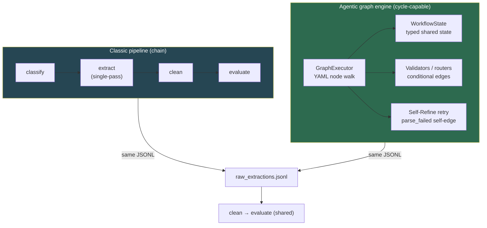
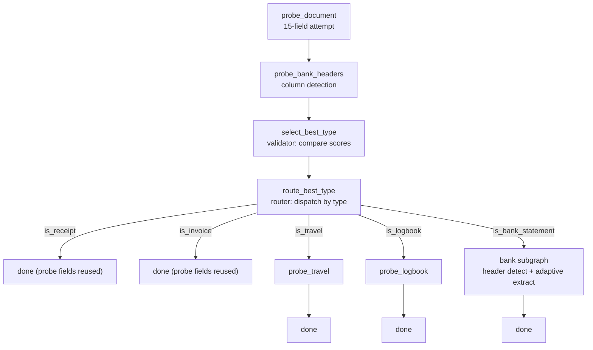
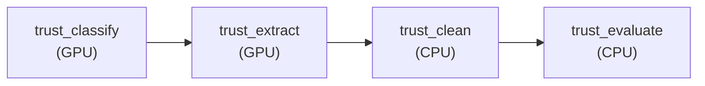
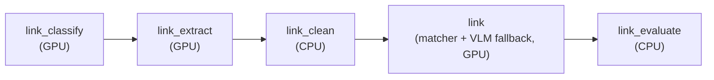

# Agentic Document Extraction & Linking Engine

A vision-language system that turns **Australian business documents** (invoices, receipts,
bank statements, travel expenses, vehicle logbooks) into **structured, evaluated data**, and
that **cross-references documents** to detect relationships — receipt-to-bank-transaction
matching and NRO Private Wealth **trust-distribution compliance**.

It is built around a single model, **InternVL3.5-8B**, and is designed to run as a
**Kubeflow Pipelines (KFP)** job in production while remaining runnable end-to-end on a
laptop or sandbox GPU box.

> **This README is the handover document.** It is organised in three parts:
> **WHAT** the system is and produces · **HOW** to run and configure it (with `entrypoint.sh`
> at the centre) · **WHY** the architecture is shaped the way it is. Read it top to bottom for
> onboarding; jump to Part II to operate it; read Part III before changing it.

---

# Table of Contents

**Part I — WHAT**
- [What the system does](#what-the-system-does)
- [What it produces: the JSONL artifact contract](#what-it-produces-the-jsonl-artifact-contract)
- [Supported document types](#supported-document-types)
- [The model: InternVL3.5-8B](#the-model-internvl35-8b)
- [Two execution shapes](#two-execution-shapes)

**Part II — HOW**
- [`entrypoint.sh`: the front door](#entrypointsh-the-front-door)
- [Pipeline modes & per-stage tasks](#pipeline-modes--per-stage-tasks)
- [The classic pipeline](#the-classic-pipeline)
- [The robust (probe-based) pipeline](#the-robust-probe-based-pipeline)
- [Trust distribution compliance pipeline](#trust-distribution-compliance-pipeline)
- [Transaction linking](#transaction-linking)
- [`stages.*` CLI reference](#stages-cli-reference)
- [`cli.py` (ad-hoc)](#clipy-ad-hoc)
- [YAML configuration](#yaml-configuration)
- [Ground truth formats](#ground-truth-formats)
- [Multi-GPU parallel processing](#multi-gpu-parallel-processing)
- [Configuring a new document type](#configuring-a-new-document-type)

**Part III — WHY**
- [Why two entrypoints](#why-two-entrypoints)
- [Why a staged JSONL contract](#why-a-staged-jsonl-contract)
- [Why composition over inheritance](#why-composition-over-inheritance)
- [Why a declarative model registry](#why-a-declarative-model-registry)
- [Why ports & adapters for response handling](#why-ports--adapters-for-response-handling)
- [Why a callable-based bank extractor](#why-a-callable-based-bank-extractor)
- [Why a framework-free graph engine](#why-a-framework-free-graph-engine)
- [Why probe-based classification](#why-probe-based-classification)
- [Why this multi-GPU design](#why-this-multi-gpu-design)
- [Why these GPU memory & attention choices](#why-these-gpu-memory--attention-choices)
- [Why config is the single source of truth](#why-config-is-the-single-source-of-truth)

**Appendices**
- [Project structure](#project-structure)
- [Config completeness (for the Data Engineering team)](#config-completeness-for-the-data-engineering-team)
- [Development & handoff notes](#development--handoff-notes)
- [Authoritative sources](#authoritative-sources)

---

# Part I — WHAT

## What the system does

The engine performs two kinds of work over scanned/synthetic Australian business documents:

1. **Structured Information Extraction** — given a document image, classify its type and
   extract a fixed, type-specific set of fields (e.g. an invoice's ABN, supplier, line items,
   totals) as `FIELD: value` pairs, then score the result against ground truth.

2. **Transaction & relationship linking** — given *multiple* documents, cross-reference them:
   - **Receipt → bank statement**: match a receipt to the corresponding line in a bank
     statement, gated by an amount-tolerance check.
   - **Trust distribution compliance**: cross-reference the **four documents of a trust
     distribution case** (trust return, distribution statement, income schedule, beneficiary
     ITR) and algorithmically detect NRO-relevant discrepancies.

Both kinds of work flow through the **same downstream contract** (see below), so cleaning and
evaluation are shared regardless of how the raw data was produced.


```mermaid
graph LR
    IMG["Document images"] --> EXT["Extraction / Linking<br/>(GPU, InternVL3.5-8B)"]
    EXT --> RAW["raw_extractions.jsonl"]
    RAW --> CLEAN["clean (CPU)"]
    CLEAN --> EVAL["evaluate (CPU)"]
    EVAL --> OUT["scores + reports"]
    style EXT fill:#2d6a4f,color:#fff
```

## What it produces: the JSONL artifact contract

Every run is a chain of **append-only JSONL files**. Each stage reads one artifact and writes
the next. This contract is the backbone of the whole system — it is what lets stages run in
**separate processes / separate KFP pods** and what makes long runs **crash-resumable**.

| Artifact | Written by | One record per | Key fields |
|---|---|---|---|
| `classifications.jsonl` | `classify` | image | `image_name`, `document_type`, `confidence`, `raw_response` |
| `raw_extractions.jsonl` | `extract` / `link` | image (or case) | `image_name`, `document_type`, `raw_response`, `processing_time` |
| `cleaned_extractions.jsonl` | `clean` | image | `image_name`, `document_type`, `extracted_data` (structured dict) |
| `evaluation_results.jsonl` | `evaluate` | image | `image_name`, `document_type`, per-field accuracy, `median_f1` |
| `transaction_links.jsonl` | `link` (`stages.transaction_link`) | receipt | `image_name`, `case_id`, `matched`, `confidence`, `match_scores`, `bank_transaction_*` |

The graph engine emits the **same** `raw_extractions.jsonl` shape (plus an embedded
`WorkflowTrace`), so `clean` and `evaluate` are identical whether the data came from the
single-pass path or the graph. The streaming writer flushes **per record** in append mode, so a
killed process leaves a valid partial file that the next run resumes from
(`stages/io.py` — `write_jsonl` / `append_jsonl` / `StreamingJsonlWriter`, `read_completed_images`).
Every GPU stage resumes this way: `classify` and `extract` both read the partial output, skip the
already-processed images, and **append** the rest.

## Supported document types

Field counts are authoritative in `config/field_definitions.yaml`
(`document_fields.<type>.count`). All counts below are verified against that file.

| Type | Key | Fields | Extraction method |
|------|-----|--------|-------------------|
| Invoice | `INVOICE` | 14 | Single-pass (batched or sequential) |
| Receipt | `RECEIPT` | 14 | Single-pass (batched or sequential) |
| Bank Statement | `BANK_STATEMENT` | 5 | Multi-turn (`UnifiedBankExtractor`, or graph via `--graph-bank`) |
| Travel Expense | `TRAVEL` | 9 | Single-pass with dedicated probe |
| Vehicle Logbook | `LOGBOOK` | 16 | Single-pass with dedicated probe |
| Transaction Link | `TRANSACTION_LINK` | 8 | Cross-image graph (receipt + bank statement) |
| Trust Distribution Link | `TRUST_DISTRIBUTION_LINK` | 9 | 4-stage trust pipeline |
| Universal | `UNIVERSAL` | 33 | Superset fallback |

New document types are added in **YAML only** — see
[Configuring a new document type](#configuring-a-new-document-type).

## The model: InternVL3.5-8B

The project standardises on **InternVL3.5-8B**, served through a **single deployment backend**:
vLLM. There is no HuggingFace `model.chat()` path — the system is **vLLM-only**.

| Attribute | `internvl3-vllm` (vLLM) — **production default** |
|---|---|
| `--model` key | `internvl3-vllm` |
| Backend class | `VllmBackend` (`models/backends/vllm_backend.py`) |
| Loader | vLLM offline engine (PagedAttention) |
| Inference API | OpenAI-compatible chat over the offline engine |
| Bank extraction | Multi-turn via `UnifiedBankExtractor` |
| Batch inference | Yes (PagedAttention; data-parallel via `common/vllm_dp.py`) |
| Prompt file | `prompts/internvl3_prompts.yaml` |

The active backend is whatever `bootstrap.model.type` in `config/run_config.yml` says — currently
**`internvl3-vllm`**. The `stages.link` / `stages.link trust-link` commands also default their
`--model` flag to `internvl3-vllm`; `stages.classify` / `stages.extract` leave `--model` unset
and let the config cascade resolve it (which lands on `internvl3-vllm` from the YAML).

**Production performance note (2026):** on real single-page bank-statement images,
InternVL3.5-8B scores roughly **~62%** end-to-end — dense-table parsing (row alignment, column
detection, amount OCR) is the bottleneck. The high dev-set numbers seen earlier came from a tiny
9-image set and are not representative. A document-OCR specialist preprocessor is the
recommended next intervention before swapping the main VLM.

### The registered InternVL3.5 vLLM variants

`models/registry.py` registers exactly **three** model keys, all InternVL3.5 over vLLM:

```
internvl3-vllm        # 8B — production default (not sharded)
internvl3-14b-vllm    # 14B — requires_sharding=True
internvl3-38b-vllm    # 38B — requires_sharding=True
```

The **8B** (`internvl3-vllm`) is the supported, tuned, and tested production model. The 14B and
38B variants are registered for scale-up experiments and are flagged `requires_sharding=True`;
the 8B is **not** sharded. There are no HuggingFace, llama, qwen, granite, nemotron, or gemma keys.

> Verify the live list at any time:
> `python -c "from models.registry import list_models; print(list_models())"`
> See [Why this multi-GPU design](#why-this-multi-gpu-design) for why the 8B is loaded whole.

## Two execution shapes

The same model and the same JSONL contract are driven by two execution shapes. Choosing between
them is the first architectural decision a reader needs to understand.


```mermaid
graph TB
    subgraph Classic["Classic pipeline (chain)"]
        C1["classify"] --> C2["extract<br/>(single-pass)"] --> C3["clean"] --> C4["evaluate"]
    end
    subgraph Graph["Agentic graph engine (cycle-capable)"]
        G1["GraphExecutor<br/>YAML node walk"]
        G2["WorkflowState<br/>typed shared state"]
        G3["Validators / routers<br/>conditional edges"]
        G4["Self-Refine retry<br/>parse_failed self-edge"]
        G1 --> G2 & G3 & G4
    end
    Classic -->|same JSONL| Out["raw_extractions.jsonl"]
    Graph -->|same JSONL| Out
    Out --> CL["clean → evaluate (shared)"]
    style Classic fill:#264653,color:#fff
    style Graph fill:#2d6a4f,color:#fff
```

| Workload | Shape | Why |
|---|---|---|
| Invoice / receipt / travel / logbook | Single-pass | One image → one prompt → field set; no state to carry between turns. |
| Bank statement | Multi-turn | Turn 0 detects column headers; Turn 1 adapts the extraction prompt to that layout. |
| Receipt → bank linking | Matcher-first + targeted VLM fallback | An algorithmic matcher links receipts against already-extracted bank rows; only unconfident cases go to a single-image VLM lookup, gated by amount tolerance. |
| Trust distribution compliance | 4-stage pipeline (4 docs/case) | Classify 4 doc types → extract linking fields → validate compliance algorithmically → score. |
| Mixed-type batches | Probe-based graph (`--graph-robust`) | Two extraction probes; the engine picks the winner by counting recovered fields. *The extraction IS the classification.* |

The graph engine (`common/graph_executor.py`, ~547 lines) is **framework-free Python** — no
LangChain / LangGraph dependency. See [`common/AGENTIC_ENGINE_README.md`](common/AGENTIC_ENGINE_README.md)
for the walk loop, node types, and a guide to authoring workflows.

---

# Part II — HOW

## `entrypoint.sh`: the front door

**`entrypoint.sh` is the primary way the system is run** in both KFP production and local dev. It
is the first script that executes when a KFP container starts. Its job is to turn a single
environment variable — `KFP_TASK` — plus a handful of KFP-injected `input_params` into the right
`python -m stages.*` invocation, after preparing the runtime.

### What it sets up (in order)

1. **Shell safety** — `set -o errexit -o nounset -o pipefail` so any failure stops the run loudly.
2. **CUDA determinism** — `CUDA_DEVICE_ORDER=PCI_BUS_ID` so `cuda:0` always maps to the same
   physical GPU; log lines like "GPU 0 failed" then match `nvidia-smi`.
3. **YAML defaults (single resolver)** — `scripts/resolve_yaml_defaults.py` (PyYAML) fills in the
   log dirs, `data_dir` / `ground_truth` / `output_dir`, and all `trust_*` / `linking_*` paths from
   `run_config.yml` so the `typer`-required stage flags always receive concrete values. PyYAML lives
   only inside the conda env (the **base** env has no `yaml` on DEV/PROD), so the resolver is run
   with the env's own interpreter **by path** (`$CONDA_ENV/bin/python`) — no activation needed just
   to launch it. This runs *before* the `tee` redirect so the log dir is known. The script then
   `exec`-redirects all stdout/stderr through `tee` to a timestamped log file
   (`entrypoint_YYYYMMDD_HHMMSS.log`) — console output (for the KFP UI) **and** a persistent log.
   Trust tasks use `pipeline.trust.log_dir`; transaction-linking uses `pipeline.linking.log_dir`;
   all others use `bootstrap.logging.log_dir`. There is **no silent fallback** — a missing log dir
   is fatal.
4. **Conda activation** — `conda activate` the env (default `/home/jovyan/.conda/envs/vllm_env2`,
   overridable via `LMM_CONDA_ENV`; the same `$CONDA_ENV` bootstrapped in step 3). The env **cannot**
   come from `run_config.yml` — parsing that YAML needs PyYAML, which only exists inside the very env
   being located (chicken-and-egg), so it is bootstrapped from `LMM_CONDA_ENV` or the script default.
   After activation, prepend `$CONDA_PREFIX/lib` to `LD_LIBRARY_PATH` so the env's `libstdc++` (with
   `GLIBCXX_3.4.30`) is found before the older system copy.
5. **GPU health check** — `nvidia-smi` dump of VRAM, temperature, and ECC errors, with a warning
   if any GPU reports an error state. Cheaper to catch here than mid-inference after a 60s load.
6. **Wall-clock timing & cleanup trap** — a `trap ... EXIT` always logs the exit code and elapsed
   seconds, even on OOM/crash.

> **Why one resolver, run by the env's own python:** logging must be wired up *before* `tee`, and
> the log dir lives in `run_config.yml`, which needs PyYAML to parse. PyYAML isn't in the base/system
> python on DEV/PROD, so rather than maintain a second stdlib-only parser, the single
> `resolve_yaml_defaults.py` is invoked with `$CONDA_ENV/bin/python` (the env interpreter, by path)
> before `conda activate`. One parser, one source of truth — see [Why two entrypoints](#why-two-entrypoints).

### How KFP passes configuration

The KFP pipeline YAML defines `input_params` (model, image_dir, output, num_gpus, ground_truth,
…) that users fill in via the KFP UI. KFP injects these as **environment variables**;
`entrypoint.sh` reads them and translates them into stage flags. KFP stringifies an unset param
as the literal `"None"`, so the script's `_is_set()` helper rejects both empty and `"None"`.

### Environment variables

| Variable | Required | Description |
|---|---|---|
| `KFP_TASK` | **Yes** | Pipeline mode or stage name (dispatch key) |
| `image_dir` | Yes (non-trust) | Directory of document images |
| `ground_truth` | No | Ground truth CSV/JSONL (omit for inference-only) |
| `output` | No | Output directory (default `./outputs`) |
| `model` | No | Model type (falls back to `run_config.yml` → `internvl3-vllm`) |
| `num_gpus` | No | `0`=auto, `1`=single, `N`=use N |
| `CLEAR_PREV_OUTPUT` | No | `true` = delete previous **output** artifacts (never logs) and recompute; unset/`false` = **resume**, skipping already-processed images (default) |
| `trust_data_dir` | Yes (trust) | Root dir of trust documents |
| `trust_quads` | Trust (after classify) | Quads CSV produced by `trust_classify` |
| `trust_ground_truth` | No | Ground-truth YAML for trust compliance eval |
| `linking_data_dir` / `linking_output` / `linking_ground_truth` / `linking_evaluation_dir` / `linking_log_dir` | No (linking) | Transaction-linking paths (else from `pipeline.linking.*` in `run_config.yml`) |
| `LMM_CONDA_ENV` | No | Conda env path (default `/home/jovyan/.conda/envs/vllm_env2`) |
| `LMM_LOG_DIR` / `LMM_TRUST_LOG_DIR` | No | Log dir override (else from `run_config.yml`) |

`CLEAR_PREV_OUTPUT` is normalised (`tr` to lowercase, `None`→`false`) and **validated at
startup** before any work — an invalid value fails fast with a four-part diagnostic.

> **Why resume is the default:** in production, new images drip into `image_dir` over time, so a
> re-run should process only the **new** arrivals, not reprocess the whole directory. A full
> clean-slate run is opt-in via `CLEAR_PREV_OUTPUT=true`. The clearing helper only ever deletes
> explicit artifact **files** that a stage owns — never a directory, never a log path.

### Usage patterns

```bash
# Classic 4-stage pipeline (classify → extract → clean → evaluate)
KFP_TASK=run_batch_inference \
  image_dir=/persistent/storage/annotations/evaluation_data/synthetic \
  ground_truth=/persistent/storage/annotations/evaluation_data/synthetic/ground_truth.jsonl \
  bash entrypoint.sh

# Robust 3-stage probe-based pipeline (extract --graph-robust → clean → evaluate)
KFP_TASK=run_graph_robust \
  image_dir=/persistent/storage/annotations/evaluation_data/synthetic \
  ground_truth=/persistent/storage/annotations/evaluation_data/synthetic/ground_truth.jsonl \
  bash entrypoint.sh

# Inference only (no ground truth — evaluation is skipped)
KFP_TASK=run_graph_robust image_dir=/persistent/storage/annotations/evaluation_data/synthetic bash entrypoint.sh

# Trust distribution compliance (all paths from run_config.yml)
KFP_TASK=run_trust_pipeline bash entrypoint.sh

# Clean-slate re-run instead of resume
KFP_TASK=run_batch_inference CLEAR_PREV_OUTPUT=true image_dir=... bash entrypoint.sh

# Extra args after the script name go straight to the stage (last wins)
bash entrypoint.sh --verbose
```

### Internal structure (for maintainers)

The dispatcher is a single `case "${KFP_TASK}"` near the bottom. To avoid drift between the
local orchestrators and the per-pod branches, each stage's `python -m stages.*` invocation lives
in **one shared runner function** (`_run_classify`, `_run_extract`, `_run_trust_*`,
`_run_cpu_stages`), called by *both* its standalone pod branch and the orchestrator that chains
stages. Runners hold only the invocation; orchestration policy (logging labels, output clearing,
elapsed-time files) stays in the caller, because the per-pod path writes per-stage
`.inference_elapsed` files while the orchestrator path tracks a single wall-clock.

## Pipeline modes & per-stage tasks

`KFP_TASK` accepts both **orchestrated modes** (chain several stages in one shell — local dev
only, *not* in the KFP DAG) and **individual stage names** (one KFP pod each).

| Mode | `KFP_TASK` | Stages | Best for |
|---|---|---|---|
| Classic | `run_batch_inference` | classify → extract → clean → evaluate | Production-shaped local runs; one-prompt-per-type docs |
| Robust (graph) | `run_graph_robust` | extract `--graph-robust` → clean → evaluate | Mixed-type batches; eliminating misclassification |
| Trust compliance | `run_trust_pipeline` | trust_classify → trust_extract → trust_clean → trust_evaluate | NRO Private Wealth trust compliance |
| Transaction linking | `run_transaction_link` | classify → extract → clean → transaction_link → evaluate_linking | Receipt → bank-statement debit matching (matcher-first, VLM fallback) |

**Individual stage tasks (one KFP pod each):**
`classify`, `extract`, `clean`, `evaluate`,
`trust_classify`, `trust_extract`, `trust_clean`, `trust_evaluate`,
`link_classify`, `link_extract`, `link_clean`, `link`, `link_evaluate`.
(`filter` is a deprecated no-op kept for KFP manifest compatibility.)

> **Not orchestrated:** `--graph-unified` and `--graph-bank` exist only as flags on the `extract`
> stage (and as `scripts/run_graph_unified.sh` / `run_graph_bank.sh`). There is **no**
> `run_graph_unified` or `run_graph_bank` `KFP_TASK`.

In the classic 4-stage path, each phase is a **fresh `python` process** — the model loads, runs,
and exits, tearing down the CUDA context and fully releasing GPU memory before the next phase.
This mirrors pod-per-stage KFP deployment and isolates GPU state between stages.

```bash
# KFP production — one pod per stage:
KFP_TASK=classify  image_dir=... output=./outputs bash entrypoint.sh   # GPU → classifications.jsonl
KFP_TASK=extract   image_dir=... output=./outputs bash entrypoint.sh   # GPU → raw_extractions.jsonl (resumable)
KFP_TASK=clean     output=./outputs bash entrypoint.sh                  # CPU → cleaned_extractions.jsonl
KFP_TASK=evaluate  output=./outputs ground_truth=... bash entrypoint.sh # CPU → evaluation_results.jsonl
```

## The classic pipeline

For document types where one prompt extracts everything (invoices, receipts, travel, logbooks),
the four-stage chain is the simplest path:

```
classify (GPU) → classifications.jsonl
    → extract (GPU) → raw_extractions.jsonl
        → clean (CPU) → cleaned_extractions.jsonl
            → evaluate (CPU) → evaluation_results.jsonl
```

CPU stages need no GPU allocation, which matters for KFP pod scheduling. The `extract` stage
routes by document type: standard types go single-pass via `DocumentOrchestrator.process()`;
bank statements go multi-turn via `UnifiedBankExtractor` (or the graph if `--graph-bank` is set).

## The robust (probe-based) pipeline

`run_graph_robust` skips the separate classify stage. The `extract` stage runs **two probes per
image** — a 15-field document probe and a bank-header probe — then a validator picks the winner
by counting recovered fields. *The extraction is the classification* (see
[Why probe-based classification](#why-probe-based-classification)).


```mermaid
graph TD
    PD["probe_document<br/>15-field attempt"]
    PB["probe_bank_headers<br/>column detection"]
    SBT["select_best_type<br/>validator: compare scores"]
    RBT["route_best_type<br/>router: dispatch by type"]
    PD --> PB --> SBT --> RBT
    RBT -->|is_receipt| D1["done (probe fields reused)"]
    RBT -->|is_invoice| D2["done (probe fields reused)"]
    RBT -->|is_travel| PT["probe_travel"] --> D3["done"]
    RBT -->|is_logbook| PL["probe_logbook"] --> D4["done"]
    RBT -->|is_bank_statement| BANK["bank subgraph<br/>header detect + adaptive extract"] --> D5["done"]
```

**Model calls per type** (verified against `robust_extract.yaml` node counts):
receipt/invoice = **2**, travel/logbook = **3**, bank statement = **4**.

The `select_best_type` validator (`common/bank_post_process.py`) scores the document probe by
counting non-`NOT_FOUND` fields and the bank probe by counting detected column mappings. **Bank
wins when `bank_score >= 3` AND `doc_score < 6`.** A secondary rule forces `RECEIPT` if the
document probe found a `PAYMENT_DATE`.

## Trust distribution compliance pipeline

Validates NRO Private Wealth trust-distribution compliance by cross-referencing **4 documents
per case**: a trust return, a distribution statement, an income schedule, and a beneficiary ITR.
This is a **4-stage pipeline**, not a single graph call.


```mermaid
graph LR
    A["trust_classify<br/>(GPU)"] --> B["trust_extract<br/>(GPU)"] --> C["trust_clean<br/>(CPU)"] --> D["trust_evaluate<br/>(CPU)"]
```

| Stage | Module | GPU? | Responsibility |
|---|---|---|---|
| `trust_classify` | `stages.trust_classify` | GPU | Classifies the 4 trust doc types from a flat directory of `CASEXXX_*` files (evidence-based parser — see below); writes `trust_classifications.jsonl` and assembles a **quads CSV** (one row per case → its 4 documents). |
| `trust_extract` | `stages.link trust-link` | GPU | Reads the quads CSV, runs `trust_distribution_extract.yaml`, extracts linking fields from each document (**one VLM call per document → 4 per case**). Writes `raw_extractions.jsonl`. **Compliance validation is deferred.** Crash-resumable by `case_id`. |
| `trust_clean` | `stages.trust_clean` | CPU | Re-parses the per-node raw responses and runs `run_trust_compliance()` (`common/trust_compliance.py`) — **pure Python, no model call** — classifying discrepancies. |
| `trust_evaluate` | `stages.evaluate_trust` | CPU | Scores per-field accuracy, compliance detection (precision/recall/F1/confusion matrix), and discrepancy-classification accuracy against the ground-truth YAML. Renders Rich tables; writes `trust_evaluation_results.jsonl`. |

**Evidence-based classification:** `trust_classify` does not ask the VLM to name the document
type directly. It extracts observable evidence (header text, presence of an ABN/TFN, a
distribution table, the "Item 13" indicator, who it is addressed to) and derives the type via
priority-ordered rules (`common/trust_classify_parser.py`) — more robust and auditable than a
free-text type label.

### Discrepancy classification (verified against code)

`run_trust_compliance()` compares extracted fields algorithmically and classifies the **first**
matching discrepancy. All four conditions use a percentage tolerance read from
`pipeline.trust.amount_tolerance` (1% = `0.01`) — `trust_clean` loads it and passes it into the
validator, and the trust **evaluator** reads the same key — so the value is YAML-driven, not hardcoded:

| Discrepancy type | Condition |
|---|---|
| `under_reported_income` | ITR trust income **<** distribution-statement income, beyond tolerance |
| `over_claimed_franking` | ITR franking credit **>** distribution-statement franking, beyond tolerance |
| `missing_cgt` | Distribution statement CGT **> 0** but income schedule reports **$0** (no tolerance) |
| `trust_return_mismatch` | Trust-return share **≠** distribution share, beyond tolerance |

The 9 output fields are: `DOCUMENT_TYPE`, `TRUST_ABN`, `BENEFICIARY_TFN`, `SHARE_OF_NET_INCOME`,
`FRANKING_CREDIT`, `CAPITAL_GAIN_COMPONENT`, `COMPLIANCE_STATUS`, `DISCREPANCY_TYPE`,
`DISCREPANCY_DETAILS`.

### Running it

```bash
# Local dev — chain all 4 stages (paths from run_config.yml)
KFP_TASK=run_trust_pipeline bash entrypoint.sh

# KFP production — one pod per stage
KFP_TASK=trust_classify  bash entrypoint.sh   # GPU — classify docs, build quads CSV
KFP_TASK=trust_extract   bash entrypoint.sh   # GPU — extract linking fields
KFP_TASK=trust_clean     bash entrypoint.sh   # CPU — compliance validation
KFP_TASK=trust_evaluate  bash entrypoint.sh   # CPU — scoring (needs trust_ground_truth)
```

If no quads CSV exists but a ground-truth YAML is set, `entrypoint.sh` auto-generates the quads
via `scripts/generate_trust_manifest.py` (`_ensure_trust_quads`).

**Document layout** is configured under `pipeline.trust.subdirectories` in `run_config.yml`.
In **production** all four map to `.` (a single flat directory of `CASEXXX_*` files, from which
`trust_classify` builds the quads CSV). A **development** layout can point each type at a
pre-sorted subdirectory:

```yaml
pipeline:
  trust:
    subdirectories:
      trust_return: .            # production: flat dir
      distribution_stmt: .
      income_schedule: .
      beneficiary_itr: .
      # dev alternative: trust_returns / distribution_statements / trust_income_schedules / beneficiary_itrs
```

## Transaction linking

Matches receipts/invoices to the corresponding **debit row of a bank statement**. The production
path is **matcher-first**: the classic GPU stages first classify and extract *all* documents in
the linking dataset; then `stages.transaction_link` links each receipt **algorithmically**
(`common/transaction_matcher.py` — amount gate + date-window + description-overlap scoring)
against the bank rows the extract stage already pulled. Only receipts the matcher cannot link
with sufficient confidence fall through to a **targeted single-image VLM lookup**
(`common/vlm_linker.py`, prompt `prompts/single_receipt_link.yaml`), and even those VLM matches
must pass the amount gate. This sidesteps long-table attention decay: the VLM is asked to locate
*one* debit row, never to re-read the whole statement.


```mermaid
graph LR
    A["link_classify<br/>(GPU)"] --> B["link_extract<br/>(GPU)"] --> C["link_clean<br/>(CPU)"] --> D["link<br/>(matcher + VLM fallback, GPU)"] --> E["link_evaluate<br/>(CPU)"]
```

```bash
# Local dev — chain all 5 phases (paths from pipeline.linking.* in run_config.yml)
KFP_TASK=run_transaction_link bash entrypoint.sh

# KFP production — one pod per stage (mirrors the trust_* split pods)
KFP_TASK=link_classify  bash entrypoint.sh   # GPU — classify the linking dataset
KFP_TASK=link_extract   bash entrypoint.sh   # GPU — extract fields (incl. all bank rows)
KFP_TASK=link_clean     bash entrypoint.sh   # CPU — parse/clean responses
KFP_TASK=link           bash entrypoint.sh   # GPU — matcher-first linking → transaction_links.jsonl
KFP_TASK=link_evaluate  bash entrypoint.sh   # CPU — link recall/precision + throughput
```

All knobs live under `pipeline.linking` in `run_config.yml` (`case_key_pattern`, the four
`hybrid_*` matcher thresholds, `vlm_prompt` / `vlm_max_tokens` / `vlm_temperature`, and the
dataset paths) — every key is required; `stages/transaction_link.py` fails fast on a missing one.
The GPU pods write elapsed seconds to `.inference_elapsed` (classify truncates, extract and link
append) so `link_evaluate` can report end-to-end throughput, exactly as the trust pods do.
`link_evaluate` accepts CSV/JSONL/YAML ground truth; the orchestrated mode skips evaluation when
`pipeline.linking.ground_truth` is unset, while a standalone `link_evaluate` pod fails fast.

An older **graph-based pairs mode** still exists for ad-hoc experiments: `stages.link --pairs`
runs the four-node `transaction_link.yaml` workflow over explicit receipt/statement pairs and
emits a `raw_extractions.jsonl` record compatible with `stages.clean` / `stages.evaluate`
(`transaction_link` = 8 fields). It is not wired into any `KFP_TASK`.

## `stages.*` CLI reference

Each stage is callable via `python -m stages.<name>`. The tables below reflect the `typer`
definitions; **`python -m stages.<name> --help` is always authoritative**.

### `stages.classify` (GPU)

| Flag | Default | Description |
|---|---|---|
| `--data-dir, -d` | *required* | Directory of document images |
| `--output-dir, -o` | *required* | Output JSONL path |
| `--model` | `None` → YAML | Model type (unset ⇒ resolved from `run_config.yml`) |
| `--batch-size` | `None` (auto) | Images per detection batch |
| `--config` | `None` | YAML config path |
| `--verbose/--no-verbose` | `None` | Tier-B output (init details) |
| `--debug/--no-debug` | `None` | Tier-C output (parsing debug, prompt dumps) |

### `stages.extract` (GPU)

| Flag | Default | Description |
|---|---|---|
| `--classifications` | `None` | Input classifications JSONL (required for classic mode) |
| `--data-dir, -d` | *required* | Directory of document images |
| `--output-dir, -o` | *required* | Output JSONL path |
| `--model` | `None` → YAML | Model type |
| `--batch-size` | `None` (auto) | Images per extraction batch |
| `--bank-v2/--no-bank-v2` | `None` → YAML | Multi-turn bank extraction (unset ⇒ `pipeline.processing.bank_v2`) |
| `--balance-correction/--no-balance-correction` | `None` → YAML | Balance validation (unset ⇒ `pipeline.processing.balance_correction`) |
| `--graph-bank/--no-graph-bank` | `false` | Graph-engine bank extraction (overrides `bank_v2`) |
| `--graph-unified/--no-graph-unified` | `false` | Unified classify+extract graph (skips Stage 1) |
| `--graph-robust/--no-graph-robust` | `false` | Probe-based classification graph (skips Stage 1) |
| `--max-num-seqs` | `None` | Override vLLM `max_num_seqs` (continuous-batching sweep: 4 → 8 → 16) |
| `--config` | `None` | YAML config path |
| `--verbose/--no-verbose` | `None` | Tier-B output |
| `--debug/--no-debug` | `None` | Tier-C output |

```bash
# Classic mode (uses Stage 1 classifications)
python -m stages.extract --classifications ./outputs/classifications.jsonl \
  --data-dir /persistent/storage/annotations/evaluation_data/synthetic --output-dir ./outputs/raw_extractions.jsonl

# Robust mode (probe-based, no classifications needed)
python -m stages.extract --data-dir /persistent/storage/annotations/evaluation_data/synthetic \
  --output-dir ./outputs/raw_extractions.jsonl --graph-robust
```

### `stages.clean` (CPU)

| Flag | Default | Description |
|---|---|---|
| `--input, -i` | *required* | Input raw extractions JSONL |
| `--output-dir, -o` | *required* | Output cleaned extractions JSONL path |
| `--debug` | `false` | Debug logging |

### `stages.evaluate` (CPU)

| Flag | Default | Description |
|---|---|---|
| `--input, -i` | *required* | Input cleaned extractions JSONL |
| `--ground-truth, -g` | *required* | Ground truth CSV or JSONL |
| `--output-dir, -o` | *required* | Output directory for evaluation results |
| `--math-enhancement/--no-math-enhancement` | `false` | Bank balance calculations |
| `--inference-seconds` | `None` | GPU inference wall-clock seconds (extract elapsed); used for throughput. Falls back to the sum of per-image `processing_time`. |

### `stages.transaction_link` (= `link`) (GPU)

| Flag | Default | Description |
|---|---|---|
| `--extractions, -i` | *required* | `cleaned_extractions.jsonl` from the clean stage |
| `--output, -o` | *required* | Path to write `transaction_links.jsonl` |
| `--data-dir` | *required* | Image directory (needed for the VLM fallback) |
| `--model` | `None` → YAML | Model type (unset ⇒ `bootstrap.model.type`) |
| `--config` | `None` | Path to `run_config.yml` |
| `--debug` | `false` | Debug logging |

### `stages.evaluate_linking` (= `link_evaluate`) (CPU)

| Flag | Default | Description |
|---|---|---|
| `--input, -i` | *required* | `transaction_links.jsonl` from the link stage |
| `--ground-truth, -g` | *required* | Ground truth (`.csv`, `.jsonl`, `.yml`, or `.yaml`) |
| `--output-dir, -o` | *required* | Directory for evaluation output |
| `--inference-seconds` | `None` | GPU inference wall-clock seconds for throughput |
| `--config` | `None` | Path to `run_config.yml` |
| `--debug` | `false` | Debug logging |

### `stages.link` (pairs mode, ad-hoc) (GPU)

| Flag | Default | Description |
|---|---|---|
| `--pairs` | *required* | CSV with `receipt_file`, `bank_statement_file` columns |
| `--data-dir, -d` | *required* | Directory containing the images |
| `--output, -o` | *required* | Path to write `raw_extractions.jsonl` |
| `--model` | `internvl3-vllm` | Model type for loading |
| `--workflow` | `None` (built-in) | Path to a custom workflow YAML |
| `--config` | `None` | Path to `run_config.yml` |

### `stages.link trust-link` (= `trust_extract`) (GPU)

| Flag | Default | Description |
|---|---|---|
| `--quads` | *required* | Quads CSV (`case_id` + 4 document columns) |
| `--data-dir, -d` | *required* | Root directory containing the document subdirs |
| `--output, -o` | *required* | Path to write `raw_extractions.jsonl` |
| `--model` | `internvl3-vllm` | Model type for loading |
| `--workflow` | `None` (built-in) | Path to a custom workflow YAML |
| `--config` | `None` | Path to `run_config.yml` |

### `stages.trust_classify` (GPU)

| Flag | Default | Description |
|---|---|---|
| `--data-dir, -d` | *required* | Directory of `CASEXXX_*` document files |
| `--output-dir, -o` | *required* | Directory for classification output |
| `--model` | `None` → YAML | Model type override |
| `--config` | `None` | Path to `run_config.yml` |
| `--classifications` | `None` | Explicit classifications JSONL output path |
| `--quads` | `None` | Explicit complete-quads CSV output path |
| `--quads-incomplete` | `None` | Explicit incomplete-quads CSV output path |

### `stages.trust_clean` (CPU)

| Flag | Default | Description |
|---|---|---|
| `--input, -i` | *required* | Input raw extractions JSONL (from trust extract) |
| `--output, -o` | *required* | Path to write `trust_compliance_results.jsonl` |

### `stages.evaluate_trust` (CPU)

| Flag | Default | Description |
|---|---|---|
| `--input, -i` | *required* | Input raw/compliance JSONL from the trust pipeline |
| `--ground-truth, -g` | *required* | Path to `trust_distribution_links.yml` |
| `--output-dir, -o` | *required* | Directory for evaluation output |
| `--classifications, -c` | `None` | Trust classifications JSONL (optional doc-classification scoring) |
| `--classification-gt` | `None` | Trust classification ground-truth YAML |
| `--inference-seconds` | `None` | GPU inference seconds for throughput |

`stages/io.py` is a helper module (not a CLI stage): atomic/streaming JSONL writers
(`write_jsonl`, `append_jsonl`, `StreamingJsonlWriter`), readers, and `read_completed_images()` —
the resumption primitive shared by every GPU stage (both `classify` and `extract` append to a
partial output rather than overwriting it).

### Run scripts (no entrypoint overhead)

`scripts/run_*.sh` call `stages.*` directly without conda activation or GPU health checks —
useful when your environment is already set up:

```bash
bash scripts/run_graph_robust.sh    # probe-based graph pipeline
bash scripts/run_graph_unified.sh   # unified classify+extract graph
bash scripts/run_graph_bank.sh      # graph-based bank extraction
bash scripts/run_baseline_bank.sh   # legacy single-prompt bank extraction
```

## `cli.py` (ad-hoc)

`cli.py` is a **single monolithic process** for ad-hoc experimentation: it runs detect → extract
→ (optional) evaluate in one Python invocation, with analytics, visualisations, and reports.
Use `entrypoint.sh` for anything production-shaped; use `cli.py` for quick local iteration and
notebooks.

```bash
# Create the environment (production env file)
conda env create -f conda_envs/vllm_env.yml

# Inference + evaluation
python cli.py -d ./images -o ./output -g ./ground_truth.jsonl

# Multi-GPU (auto-detect all GPUs)
python cli.py -d ./images -o ./output --num-gpus 0
```

Key flags (full set via `python cli.py --help`):

| Flag | Default | Description |
|---|---|---|
| `-d, --data-dir` | *from YAML* | Image directory |
| `-o, --output-dir` | *from YAML* | Output directory |
| `-g, --ground-truth` | `None` | Ground truth (omit for inference-only) |
| `--max-images` | `None` (all) | Limit images processed |
| `--document-types` | `None` (all) | Filter, comma-separated: `INVOICE,RECEIPT` |
| `--model` | *from YAML* | Model type (registry-discovered) |
| `-m, --model-path` | *auto* | Weights directory |
| `--max-tiles` / `--min-tiles` | *from config* | Image tiling (more tiles = better OCR, more VRAM) |
| `--flash-attn / --no-flash-attn` | `true` | Flash Attention 2 |
| `--dtype` | `bfloat16` | `bfloat16` / `float16` / `float32` |
| `-b, --batch-size` | `None` (auto) | Images per batch (`null` = auto from VRAM) |
| `--num-gpus` | `0` (auto) | `0`=auto, `1`=single, `N`=use N |
| `--bank-v2 / --no-bank-v2` | *from YAML* | Multi-turn bank extraction (`pipeline.processing.bank_v2`) |
| `--balance-correction / --no-balance-correction` | *from YAML* | Bank balance validation (`pipeline.processing.balance_correction`) |
| `--enforce-eager / --no-enforce-eager` | `false` | vLLM only: skip CUDA-graph compile |
| `-c, --config` | `config/run_config.yml` | YAML config path |

## YAML configuration

**`config/run_config.yml` is the single source of truth** for tunables. Read the file itself for
the authoritative, commented set. The file is organised into exactly **four** top-level sections:

| Section | What lives under it |
|---|---|
| `bootstrap` | The minimal set the entrypoint + model loader need first: `model` (type, path, max_tiles, flash_attn, enforce_eager, dtype, chat_template, device_map, default_paths), `gpus` (num_gpus, data_parallel_size), `logging` (log_dir). |
| `inference` | Everything that shapes generation: `max_new_tokens`, `tiling` (`pre_tiling`, `budgets`), `generation`, `vllm` (engine params), `tracing`. |
| `pipeline` | Per-task settings: `information_extraction` (`input` / `output` paths for the main pipeline), `classification`, `processing`, `token_budgets`, `trust`, `linking`, `batch`, `extraction` (`order`, `secondary_sort`, `skip_labels`), `bank_header_cache`. |
| `resources` | `gpu_memory` thresholds and `infrastructure` timeouts. |

> The former top-level `io:` section was retired (2026-06-10) into
> `pipeline.information_extraction.*` so the three pipelines (information_extraction / trust /
> linking) are symmetric — each owns its paths under `pipeline.<name>`. A leftover `io:` block
> now **fails fast**; a PROD `run_config.yml` must migrate in lockstep with this code. The
> trust and linking tasks reuse the same classify/extract/clean stages on their own datasets:
> `entrypoint.sh` (`_resolve_trust_vars` / `_resolve_linking_vars`) repoints the shared path
> globals at `pipeline.trust.*` / `pipeline.linking.*`, shadowing `information_extraction.*`
> for the duration of that task.

### Config cascade

```
CLI flags  >  YAML (run_config.yml)  >  PipelineConfig dataclass defaults
```

`AppConfig.load()` (`common/app_config.py`) resolves this cascade; `config/run_config.yml` loads
automatically when present, and `--config` overrides which file is used. There are exactly
**two** config surfaces: the YAML for operator intent, and CLI flags for what `entrypoint.sh`
computes per stage. (A former `IVL_*` environment-variable layer below the YAML was removed —
nothing set it, and because YAML keys shadowed it, a manifest-set `IVL_*` var silently lost.
Shell-level vars like `LMM_*` / `NCCL_*` are `entrypoint.sh` concerns, not part of this cascade.)

### Fail-fast on missing required keys

`AppConfig.load()` raises `ConfigError` — with a four-part diagnostic naming the file and the
dotted key path — when any of these **required** sections/keys is missing or invalid:

- `pipeline.extraction.order` (must be a list of doc-type strings)
- `pipeline.extraction.secondary_sort` (must be `none` / `image_area_asc` / `image_area_desc`)
- `pipeline.extraction.skip_labels` (must be a list; may be empty)
- `inference.tiling.budgets` (must contain a `default` entry with `max_tiles`)
- `pipeline.bank_header_cache` (must contain `enabled` + a valid regex `key_pattern`)

In addition, **a present section must be complete** (`common/pipeline_config.py` —
`_require_section_keys`): a section may be omitted wholly (CLI-driven modes supply those values
via flags), but once it appears in the YAML it must declare **every** key explicitly — an
explicit `null` keeps default behavior visible, while a missing key would silently fall through
to a Python dataclass default. Enforced for:

| Section | Keys that must all be declared |
|---|---|
| `bootstrap.model` | `type`, `path`, `max_tiles`, `min_tiles`, `flash_attn`, `enforce_eager`, `dtype` |
| `bootstrap.gpus` | `num_gpus`, `data_parallel_size` |
| `inference` | `max_new_tokens` |
| `pipeline.information_extraction.input` | `dir`, `ground_truth`, `max_images`, `document_types` |
| `pipeline.information_extraction.output` | `dir`, `skip_visualizations`, `skip_reports` |
| `pipeline.processing` | `batch_size`, `bank_v2`, `balance_correction`, `verbose`, `debug` |

There is no silent fallback for any of these — a missing required key fails before any GPU work
begins. `pipeline.linking` is validated separately by `stages/transaction_link.py` (every key
required, same four-part diagnostics), and `pipeline.trust.amount_tolerance` /
`pipeline.trust.linking_fields` by `stages/evaluate_trust.py`.

### Representative excerpts (verified values)

```yaml
bootstrap:
  model:                          # present section ⇒ all keys declared (fail-fast)
    type: internvl3-vllm          # production default (InternVL3.5-8B via vLLM)
    path: /home/jovyan/nfs_share/models/InternVL3_5-8B
    max_tiles: 18
    min_tiles: null               # null = disabled; set (e.g. 6) for adaptive tiling
    flash_attn: true
    enforce_eager: true           # vLLM: true = skip CUDA-graph compile (faster startup)
    dtype: bfloat16
    chat_template: none           # vLLM: none = use the model's own template
    device_map: auto
    # default_paths is a per-model-type MAP (not a list). The loader picks the entry
    # matching bootstrap.model.type, falling back to PipelineConfig.DEFAULT_MODEL_PATHS.
    default_paths:
      internvl3: /home/jovyan/nfs_share/models/InternVL3_5-8B
      internvl3-vllm: /home/jovyan/nfs_share/models/InternVL3_5-8B
  gpus:
    num_gpus: 0                   # 0 = auto, 1 = single, N = use N
    data_parallel_size: null      # null = auto (num_gpus for vLLM)

inference:
  max_new_tokens: 3500            # raised to avoid truncation on 30+ row statements
  tiling:
    budgets:                      # per-doc-type tile floors/ceilings (validated key)
      default:        { min_tiles: 1,  max_tiles: 18 }
      bank_statement: { min_tiles: 12, max_tiles: 18 }
      invoice:        { min_tiles: 1,  max_tiles: 12 }
      receipt:        { min_tiles: 1,  max_tiles: 6 }
  vllm:
    defaults:
      gpu_memory_utilization: 0.90
      max_model_len: 8192
      max_num_seqs: 1
      limit_mm_per_prompt: 1
      enable_prefix_caching: true
    models:                       # per-model engine overrides
      internvl3-vllm:
        max_model_len: 16384      # 18 tiles + thumbnail ~= 4.9k vision + prompt + output
        limit_mm_per_prompt: 19   # 18 detail tiles + 1 thumbnail (required when pre_tiling on)

pipeline:
  processing:                     # present section ⇒ ALL five keys must be declared
    batch_size: null              # null = auto-detect from VRAM, 1 = sequential
    bank_v2: true
    balance_correction: false     # NOTE: explicitly disabled (reduces accuracy)
    verbose: false
    debug: false
  trust:
    amount_tolerance: 0.01        # trust-eval amount match tolerance (relative)
    linking_fields:               # nested map (not a flat list)
      id_fields:                  # compared as ABN/TFN (space-normalised exact match)
        - trust_abn
        - beneficiary_tfn
      amount_fields:              # compared numerically within amount_tolerance
        - share_of_net_income
        - franking_credit
        - capital_gain_component
  linking:                        # transaction linking — EVERY key required (fail-fast)
    case_key_pattern: "^(?P<case>[^_]+)_"  # group files by case (split on first "_")
    vlm_prompt: single_receipt_link        # fallback prompt file in prompts/ (without .yaml)
    vlm_max_tokens: 4096
    vlm_temperature: 0.0          # MUST be 0.0 — the shared generate seam is deterministic
    hybrid_amount_tolerance: 0.01 # $ gate for an algorithmic amount match
    hybrid_date_window_days: 5    # business-day window for date scoring
    hybrid_description_threshold: 0.3  # min token-overlap fraction for description support
    hybrid_min_confidence: LOW    # min matcher confidence to accept without VLM (HIGH|MEDIUM|LOW)
```

## Ground truth formats

**CSV** — all columns present for all rows; fields not applicable to a type are `NOT_FOUND`. The
evaluator uses `field_definitions.yaml` to determine which fields to score per type.

**JSONL (recommended)** — each record carries only its document type's fields; the evaluator
scores exactly the fields present, no schema lookup needed:

```json
{"filename": "receipt_001.png", "DOCUMENT_TYPE": "RECEIPT", "SUPPLIER_NAME": "Coffee Shop", "TOTAL_AMOUNT": "$4.50"}
{"filename": "bank_001.png", "DOCUMENT_TYPE": "BANK_STATEMENT", "STATEMENT_DATE_RANGE": "01/01/2026 - 31/01/2026"}
```

Convert CSV → JSONL:

```bash
python -m scripts.csv_to_jsonl \
  --csv /persistent/storage/annotations/evaluation_data/synthetic/ground_truth_synthetic.csv \
  --output /persistent/storage/annotations/evaluation_data/synthetic/ground_truth.jsonl
```

Trust evaluation uses a **YAML** ground truth (`trust_distribution_links.yml`), not CSV/JSONL.

## Multi-GPU parallel processing

When multiple GPUs are available, the system distributes images across them for near-linear
speedup. Each GPU loads an **independent copy** of the 8B model and processes a contiguous subset.

```bash
python cli.py -d ./images -o ./output --num-gpus 0    # auto-detect all GPUs (recommended)
python cli.py -d ./images -o ./output --num-gpus 2    # explicit: 2 GPUs
python cli.py -d ./images -o ./output --num-gpus 1    # single GPU
```

`--num-gpus`: `0` = auto-detect, `1` = single, `N` = use exactly N (fail-fast if `N > available`,
e.g. `FATAL: Requested 4 GPUs but only 2 available`). See
[Why this multi-GPU design](#why-this-multi-gpu-design) for the rationale.

## Configuring a new document type

Adding a document type requires **YAML changes only** — no Python. Worked example: a purchase
order.

1. **Register the type and fields** in `config/field_definitions.yaml` (`document_fields.<type>`
   with `count` + `fields`, add to `supported_document_types`, add `document_type_aliases`).
2. **Add detection support** in `prompts/document_type_detection.yaml` (prompt options,
   `type_mappings`, `fallback_keywords`).
3. **Write the extraction prompt** in `prompts/internvl3_prompts.yaml` under `prompts.<type>`.
4. *(Optional)* add ground-truth records.

| File | What to add |
|---|---|
| `config/field_definitions.yaml` | `document_fields.<type>`, `supported_document_types`, `document_type_aliases` |
| `prompts/document_type_detection.yaml` | detection options, `type_mappings`, `fallback_keywords` |
| `prompts/internvl3_prompts.yaml` | extraction prompt with the field template |

For types with distinct visual layouts (like bank statements: flat vs date-grouped), create
layout-specific prompts with a suffix and register it under `settings.structure_suffixes`; the
system strips the suffix to map back to the base type for validation and evaluation.

---

# Part III — WHY

This part records the reasoning behind the design so the next team can change it safely. Each
decision is paired with the trade-off it resolves.

## Why two entrypoints

`cli.py` and `entrypoint.sh` exist for **two different deployment models**, not by accident:

- **`cli.py` — a single monolithic process.** Detect → extract → evaluate in one Python run.
  Ideal for ad-hoc local inference, notebooks, and tests (`run_pipeline()` is independently
  callable). One model load, one CUDA context.
- **`entrypoint.sh` — KFP pod-per-stage orchestration.** Each stage is its own pod with its own
  GPU/CPU allocation, started by KFP setting `KFP_TASK=<stage>`. The script's job is environment
  prep (conda, CUDA, logging, GPU health) plus translating KFP-injected env vars into stage
  flags. The orchestrated `run_*` tasks chain stages locally to *simulate* the KFP DAG for
  sandbox iteration — they are explicitly **not** part of the production DAG.

Logging must be live *before* the environment that contains PyYAML is activated. Rather than keep a
second stdlib-only parser for that pre-activation window, `entrypoint.sh` runs the single
`resolve_yaml_defaults.py` with the conda env's own interpreter addressed by path
(`$CONDA_ENV/bin/python`) — which has PyYAML without needing `conda activate` — then activates the
env normally. One resolver, no fragile regex YAML parsing.

## Why a staged JSONL contract

Splitting the pipeline into discrete JSONL artifacts buys three things at once:

1. **GPU/CPU separation.** `clean` and `evaluate` are pure CPU; isolating them as their own
   stages means KFP can schedule them on cheap CPU pods instead of holding a GPU.
2. **Crash resumability.** The streaming writer appends and flushes per record, so a killed GPU
   stage leaves a valid partial file; the next run reads it with `read_completed_images()` and
   processes only what's missing. This is what makes resume-by-default (production's norm) work.
3. **Process isolation between GPU stages.** Each stage is a fresh process, so the CUDA context
   is torn down and GPU memory fully released between classify and extract — no fragmentation
   leak crossing stage boundaries.

The graph engine emits the identical contract, so adopting it required **zero changes** to clean
or evaluate.

## Why composition over inheritance

`DocumentOrchestrator` *has-a* `ModelBackend` rather than inheriting from a base processor. It
replaced an inheritance chain (`BaseDocumentProcessor` → `SimpleDocumentProcessor`) with a single
class that owns all shared logic (detection, prompt resolution, response handling, OOM recovery,
batch routing) and delegates **only** raw `generate()` / `generate_batch()` to the backend. The
backend satisfies a 3-member runtime-checkable Protocol (`model`, `processor`, `generate`).
Swapping or adding a model implementation never touches the orchestrator.

```python
@runtime_checkable
class ModelBackend(Protocol):
    model: Any
    processor: Any
    def generate(self, image: Image.Image, prompt: str, params: GenerationParams) -> str: ...
```

Backends that support batching also implement `BatchInference` (`generate_batch`).
`DocumentOrchestrator` checks for it once at construction (`supports_batch`) and routes
accordingly — no stubs, no `NotImplementedError` paths.

## Why a declarative model registry

`models/registry.py` registers each model as a `VllmSpec` dataclass (`ModelRegistration` under the
hood) instead of a hand-written loader (~600 lines of near-identical code collapsed to ~8-line
registrations). Two properties matter:

- **Zero GPU/ML overhead on import.** All `torch` / `vllm` imports are deferred to loader function
  bodies, so importing the registry (e.g. to list models, or in CI) costs nothing.
- **Uniform reuse.** A new InternVL3.5 variant needs only `register_vllm_model(VllmSpec(...))` plus
  a prompt YAML — see the three live registrations (`internvl3-vllm`, `internvl3-14b-vllm`,
  `internvl3-38b-vllm`). The registry uses PEP 695 `type` statements, so it requires Python 3.12+.

## Why ports & adapters for response handling

`common/response_handler.py` defines four narrow Protocol **ports** —
`FieldSchemaPort` (what fields exist), `ResponseParser` (text → dict), `FieldCleaner` (normalise
a value), `BusinessValidator` (cross-field rules) — composed by a `ResponseHandler` that runs
`parse → clean → validate`. Every port is **GPU-free and unit-testable in isolation**: response
parsing can be tested at scale with zero GPU time, and validation rules can change without
touching the orchestrator. The `tests/` suite is entirely GPU-free for exactly this reason.

## Why a callable-based bank extractor

`UnifiedBankExtractor` accepts a `generate_fn(image, prompt, max_tokens) -> str` **callable**, not
a model object. The multi-turn algorithm (Turn 0 detect column headers → Turn 1 adapt the
extraction prompt to that layout) is therefore **model-agnostic** — it carries no
model-type branching. The same code works against any backend, and supplying a cached column
mapping lets it skip Turn 0 entirely. Bank statements are the system's hardest workload, so
keeping their control flow free of backend `if`-ladders is what keeps it maintainable.

## Why a framework-free graph engine

The multi-turn and linking workloads need cycles, conditional routing, and retry — but
**not** a heavyweight agent framework. `common/graph_executor.py` (~547 lines) is a YAML-driven
node-graph walker using `match/case` dispatch (PEP 634), with no LangChain/LangGraph dependency.
Key properties:

- **Typed shared state.** `WorkflowState` carries parser outputs between nodes via dot-paths
  (e.g. `detect_headers.column_mapping.debit`); downstream nodes consume typed dicts, not strings.
- **Self-Refine retry.** On a `ParseError`, the executor follows a `parse_failed` self-edge,
  appending a `reflection` template (with `{error}` substituted) to the prompt. After
  `max_retries`, it proceeds via the `ok` edge **carrying the error payload** — it **never
  silently drops data**.
- **Circuit breaker.** `max_graph_steps` (default 20) caps total node executions so a misconfigured
  edge can't loop forever.
- **Observability.** `WorkflowTrace` records every node visited, edge taken, retry count, total
  model calls, and elapsed time, serialised into `raw_extractions.jsonl`.

Parsers live in `common/turn_parsers.py` — **7** parsers behind a registry (`header_list`,
`receipt_list`, `transaction_match`, `field_value`, `classification`, `balance_description`,
`amount_description`) plus post-processing helpers (`enforce_amount_gate`, `dedup_by_field`).

Workflow YAMLs live in `prompts/workflows/`:

| Workflow | Wired into | Status |
|---|---|---|
| `robust_extract.yaml` | `extract --graph-robust` | live |
| `unified_extract.yaml` | `extract --graph-unified` | live |
| `bank_extract.yaml` | `extract --graph-bank` | live |
| `transaction_link.yaml` | `stages.link` (pairs mode, ad-hoc) | live — but the production linking path is `stages.transaction_link` (matcher-first, no graph) |
| `trust_distribution_extract.yaml` | `stages.link trust-link` | live |
| `trust_distribution_link.yaml` | *(nothing)* | **dead code** — a legacy single-graph variant with an inline compliance validator; not loaded by any code path. Treat as dead unless intentionally revived. |

## Why probe-based classification

A separate classification call is a misclassification risk: get the type wrong and the
type-specific extraction is wrong too. The robust workflow replaces it with **two extraction
probes** (a 15-field document probe + a bank-header probe). A validator scores both and picks the
winner; the winning probe's fields are **reused**, so receipts and invoices need no second pass
(only 2 model calls). *The extraction is the classification* — there is no separate label to get
wrong. Bank statements still need the adaptive subgraph, so they cost 4 calls; travel/logbook
cost 3 (a type-specific probe after the winner is chosen).

## Why this multi-GPU design

Multi-GPU lives in two places, both vLLM-native:

1. **Data parallel for classify/extract** (`common/vllm_dp.py` + `common/vllm_dp_workers.py`):
   one tp=1 engine per GPU, each in a spawned process pinned via `CUDA_VISIBLE_DEVICES` *before*
   any torch/vLLM import. Images are partitioned round-robin and re-ordered on merge; every worker
   queues its results (or its exception) back to the parent, which fails loud if a worker dies —
   a shard's results are never silently lost.
2. **Tensor parallel for the link fallback** (`stages/transaction_link.py`): a single tp=4
   sharded engine — the only tp>1 stage (2x faster than serial tp=1 for the targeted VLM
   lookups). NCCL needs the release pod template's large `/dev/shm`.

## Why these GPU memory & attention choices

- **OOM cleanup happens *outside* the `except` block.** Python's traceback holds references to
  every frame of the failed forward pass — including activation tensors on the GPU — so calling
  `empty_cache()` *inside* `except` frees nothing. The orchestrator's `_resilient_generate` flags
  the OOM, exits the `except`, then runs `gc.collect()` + `empty_cache()` and retries at half the
  token budget. `common/gpu_memory.py` releases fragmented memory only when
  `(reserved - allocated)` exceeds a threshold, and can target a single `cuda:N` for the
  multi-GPU worker case.
- **Attention backend is vLLM's choice.** `VllmSpec.attention_backend`
  (`models/model_loader.py`) pins the backend per model; on Ampere+ vLLM uses FlashAttention
  natively. (The HF-era eager→SDPA monkeypatch was deleted with the transformers backend.)

## Why config is the single source of truth

`config/run_config.yml` is authoritative; Python must not shadow it with hardcoded defaults. The
fail-fast validator in `app_config.py` enforces this for the required keys, with diagnostics that
always state **what** is wrong, **where** to fix it (file + dotted path), **what** a valid value
looks like, and **how** to recover. Operator intent must be readable from the YAML alone — which
is why no-op features are committed as explicit values (`extraction_skip_labels: []`,
`secondary_sort: none`) rather than omitted, and why a **present** config section must declare
every key explicitly (see [Config completeness](#config-completeness-for-the-data-engineering-team)).

---

# Appendices

## Project structure

```
.
├── cli.py                                 # Monolithic ad-hoc CLI (--model flag)
├── entrypoint.sh                          # KFP_TASK dispatch (the front door)
├── config/
│   ├── run_config.yml                     # SINGLE SOURCE OF TRUTH for tunables
│   ├── field_definitions.yaml             # Document types, fields, evaluation settings
│   └── model_config.yaml                  # Model configs for unified bank extraction
├── prompts/
│   ├── document_type_detection.yaml       # Detection prompts + type mappings
│   ├── trust_document_type_detection.yaml # Trust-specific detection prompts
│   ├── internvl3_prompts.yaml             # InternVL3.5-8B extraction prompts
│   ├── bank_prompts.yaml                  # Bank statement multi-turn prompts
│   ├── bank_column_patterns.yaml          # Column header patterns
│   ├── single_receipt_link.yaml           # Targeted VLM-fallback prompt (transaction linking)
│   └── workflows/                         # Graph-engine workflow YAMLs (see table above)
├── models/
│   ├── backend.py                         # ModelBackend + BatchInference Protocols
│   ├── registry.py                        # Declarative VllmSpec registrations
│   ├── model_loader.py                    # vLLM loader factory
│   ├── orchestrator.py                    # DocumentOrchestrator (composition-based)
│   └── backends/
│       └── vllm_backend.py                 # vLLM backend (internvl3-vllm)
├── common/
│   ├── app_config.py                      # AppConfig.load() — cascade + fail-fast validation
│   ├── pipeline_config.py                 # PipelineConfig dataclass + YAML flattening/validation
│   ├── pipeline_ops.py                    # load_model, create_processor, run_batch
│   ├── document_pipeline.py               # DocumentPipeline (detect → extract → evaluate)
│   ├── graph_executor.py                  # GraphExecutor — YAML graph walker (~547 LoC)
│   ├── extraction_types.py                # WorkflowState, NodeGenParams, WorkflowTrace, …
│   ├── turn_parsers.py                    # 7 parsers + post-processing helpers + registry
│   ├── unified_bank_extractor.py          # 2-turn adaptive bank extraction (callable-based)
│   ├── bank_post_process.py               # select_best_type validator, balance correction
│   ├── bank_corrector.py / bank_header_cache.py / bank_types.py / bank_statement_calculator.py
│   ├── trust_compliance.py                # Trust compliance validator (pure Python)
│   ├── trust_classify_parser.py           # Evidence-based trust doc classification
│   ├── transaction_matcher.py             # Algorithmic receipt→bank-row matcher (CPU)
│   ├── vlm_linker.py                      # Targeted single-image VLM fallback lookup
│   ├── response_handler.py                # ResponseHandler (ports & adapters)
│   ├── extraction_parser.py / extraction_cleaner.py / extraction_sort.py
│   ├── extraction_evaluator.py / evaluation_metrics.py
│   ├── gpu_memory.py                      # VRAM queries, fragmentation handling
│   ├── vllm_dp.py / vllm_dp_workers.py    # vLLM data-parallel helpers
│   ├── field_schema.py                    # FieldSchema (frozen, cached singleton)
│   └── AGENTIC_ENGINE_README.md           # Engine deep-dive (graph internals)
├── stages/
│   ├── classify.py / extract.py           # Classic GPU stages 1–2
│   ├── clean.py / evaluate.py             # Classic CPU stages 3–4
│   ├── link.py                            # Graph-based linking: pairs mode (ad-hoc) + trust-link (GPU)
│   ├── transaction_link.py                # Matcher-first receipt→bank linking + VLM fallback (GPU)
│   ├── evaluate_linking.py                # Linking recall/precision/throughput scoring (CPU)
│   ├── trust_classify.py                  # Trust stage 1: classify docs, build quads (GPU)
│   ├── trust_clean.py / evaluate_trust.py # Trust CPU stages 3–4
│   └── io.py                              # JSONL streaming writer + resumption primitive
├── scripts/
│   ├── run_graph_*.sh / run_baseline_bank.sh
│   ├── resolve_yaml_defaults.py           # single PyYAML resolver (run via $CONDA_ENV/bin/python)
│   ├── csv_to_jsonl.py                    # ground-truth CSV → JSONL
│   └── generate_trust_manifest.py         # quads CSV from trust ground-truth YAML
├── tests/                                 # pytest suite (GPU-free) — local only, gitignored
├── conda_envs/                            # vllm_env.yml (production), IVL3.5_env.yml, …
└── docs/                                  # design docs (transaction_linking_comparison.md)
```

## Config completeness (for the Data Engineering team)

The project policy is that `run_config.yml` is authoritative for **every** key, and the
historical gap here is now closed:

- The five structurally-required keys (extraction order, tiling budgets, bank-header cache, …)
  fail fast in `app_config.py`.
- The trust-eval `pipeline.trust.amount_tolerance` / `pipeline.trust.linking_fields` are read
  from config with their own four-part diagnostics (`stages/evaluate_trust.py` →
  `_load_trust_eval_config`); the trust **validator** receives the same tolerance from
  `trust_clean` — nothing trust-related is Python-hardcoded.
- `pipeline.linking.*` is fully required — `stages/transaction_link.py` fails fast on any
  missing key.
- **Present sections must be complete** (`common/pipeline_config.py` →
  `_require_section_keys`): if `bootstrap.model`, `bootstrap.gpus`, `inference`,
  `pipeline.information_extraction.input`/`.output`, or `pipeline.processing` appears in the
  YAML, every key in it must be declared (explicit `null` allowed) — a missing key fails fast
  instead of silently falling through to a `PipelineConfig` dataclass default.

The one **deliberate** residual: a section that is *wholly absent* still resolves from
`PipelineConfig` dataclass defaults — this keeps ad-hoc CLI-driven runs (all values via flags)
working without a YAML. Production should never rely on it: ship a complete `run_config.yml`,
and remember a leftover top-level `io:` block fails fast (migrate it to
`pipeline.information_extraction.*`).

## Development & handoff notes

- **Environment:** `conda env create -f conda_envs/vllm_env.yml` (production, matches
  `entrypoint.sh`'s default `/home/jovyan/.conda/envs/vllm_env2`) or `conda_envs/IVL3.5_env.yml`. Project is
  uniformly **Python 3.12** (pinned) — `models/registry.py`
  uses PEP 695 `type` statements that require 3.12+. Never downgrade an env YAML to 3.11.
- **Inference is remote-only** — model inference runs on the GPU server; only linting, formatting,
  and validation run locally.
- **Tests:** `tests/` is gitignored (local only). Run with `pytest` (GPU-free suite); target ≥80%
  coverage (`pytest --cov=common --cov=models --cov=stages`).
- **Linting:** `ruff check --fix` then `ruff format`; `mypy . --ignore-missing-imports`. Line
  length 108.
- **Config discipline:** do not reintroduce hardcoded config values in Python; prefer extending
  the fail-fast validation in `app_config.py` / `pipeline_config.py` (see Config completeness).
- **Prompt authoring:** prompts must be generic — never embed store names, amounts, or any data
  from real evaluation images; examples must use fictitious merchant names.

## Authoritative sources

When this README and the code disagree, the code wins. The fast-moving details live here:

- `models/registry.py` — the registered models (`list_models()`)
- `config/run_config.yml` — config keys and values
- `config/field_definitions.yaml` — document types and field counts
- `entrypoint.sh` — the `KFP_TASK` dispatch and per-stage runners
- `python -m stages.<name> --help` — stage flags
- [`common/AGENTIC_ENGINE_README.md`](common/AGENTIC_ENGINE_README.md) — graph engine deep-dive
- [`docs/transaction_linking_comparison.md`](docs/transaction_linking_comparison.md) — linking design comparison
