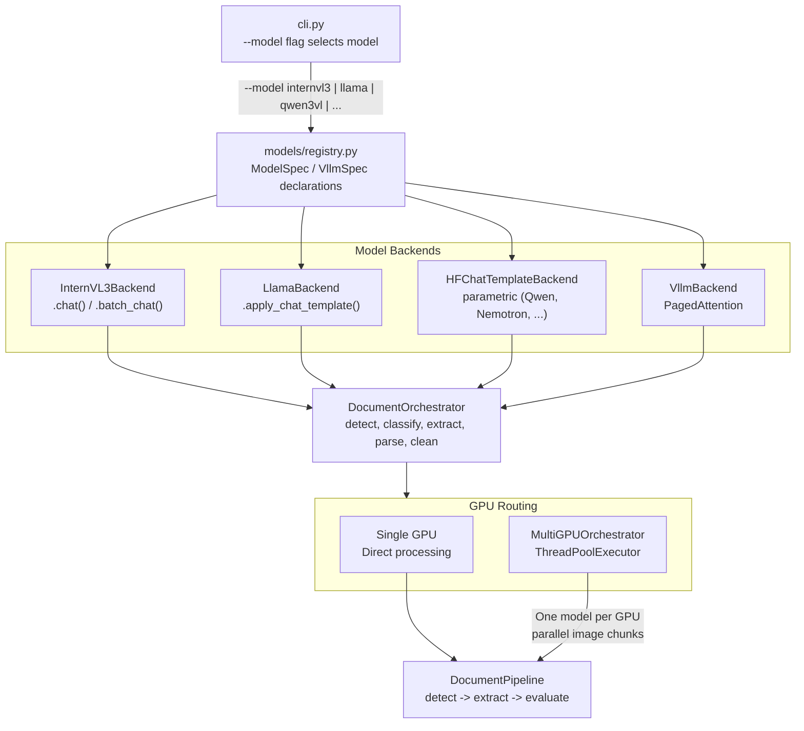
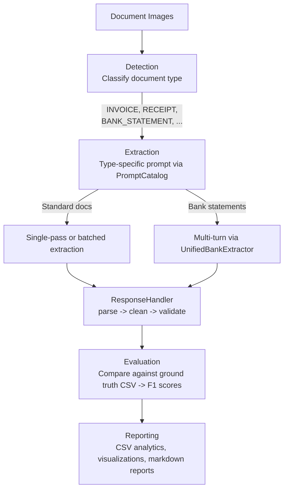
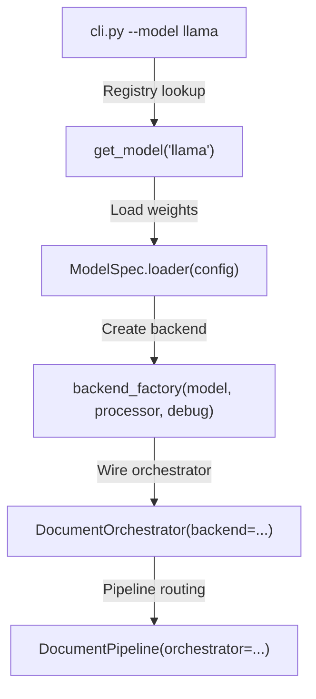
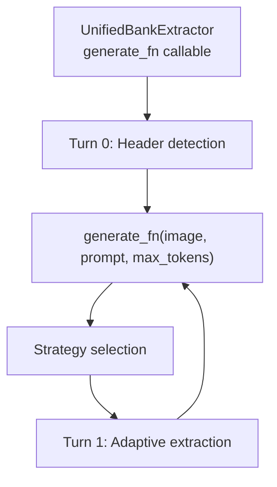
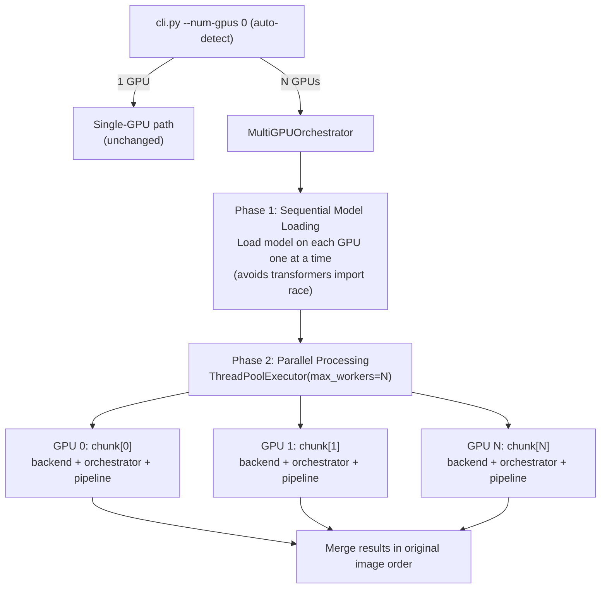

# Document Extraction Pipeline

A production-ready CLI for extracting structured fields from business document images using vision-language models. Supports 12+ models via a declarative ModelSpec registry, composition-based orchestration, batched inference, multi-GPU parallel processing, automatic GPU memory management, multi-turn bank statement extraction, and evaluation against ground truth.

**Registered models:**

| Model | Type | Backend | Bank Extraction | Batch Inference |
|-------|------|---------|-----------------|-----------------|
| InternVL3.5-8B | `internvl3` | HF (custom) | Multi-turn | Yes |
| InternVL3.5-14B | `internvl3-14b` | HF (custom) | Multi-turn | Yes |
| InternVL3.5-38B | `internvl3-38b` | HF (custom, sharded) | Multi-turn | Yes |
| Llama 3.2-11B Vision | `llama` | HF (custom) | Multi-turn | Sequential only |
| Llama 4 Scout 17B-16E | `llama4scout` | HF (chat template) | Multi-turn | Sequential only |
| Granite 4.0 3B Vision | `granite4` | HF (chat template) | Multi-turn | Sequential only |
| Qwen3-VL-8B | `qwen3vl` | HF (chat template) | Multi-turn | Sequential only |
| Qwen3.5-27B | `qwen35` | HF (chat template, sharded) | Multi-turn | Sequential only |
| Nemotron Nano 12B v2 VL | `nemotron` | HF (chat template) | Multi-turn | Sequential only |
| InternVL3.5-8B (vLLM) | `internvl3-vllm` | vLLM | Multi-turn | PagedAttention |
| Llama 4 Scout W4A16 | `llama4scout-w4a16` | vLLM | Multi-turn | PagedAttention |
| Qwen3-VL-8B (vLLM) | `qwen3vl-vllm` | vLLM | Multi-turn | PagedAttention |
| Gemma 4 31B-it | `gemma4` | vLLM | Multi-turn | PagedAttention |

## Architecture Overview

The pipeline uses a **composition-based** architecture where `DocumentOrchestrator` owns all shared logic (detection, prompt loading, parsing, cleaning, OOM recovery) and delegates raw inference to thin `ModelBackend` implementations. Adding a new model is a ~10-line declarative `ModelSpec` registration -- no new Python files needed for standard HuggingFace models.


```mermaid
graph TD
    CLI["cli.py<br/>--model flag selects model"]
    REG["models/registry.py<br/>ModelSpec / VllmSpec declarations"]

    CLI -->|"--model internvl3 | llama | qwen3vl | ..."| REG

    subgraph Backends["Model Backends"]
        IVL["InternVL3Backend<br/>.chat() / .batch_chat()"]
        LLAMA["LlamaBackend<br/>.apply_chat_template()"]
        HF["HFChatTemplateBackend<br/>parametric (Qwen, Nemotron, ...)"]
        VLLM["VllmBackend<br/>PagedAttention"]
    end

    REG --> IVL
    REG --> LLAMA
    REG --> HF
    REG --> VLLM

    ORCH["DocumentOrchestrator<br/>detect, classify, extract, parse, clean"]

    IVL --> ORCH
    LLAMA --> ORCH
    HF --> ORCH
    VLLM --> ORCH

    subgraph GPU["GPU Routing"]
        SINGLE["Single GPU<br/>Direct processing"]
        MULTI["MultiGPUOrchestrator<br/>ThreadPoolExecutor"]
    end

    ORCH --> GPU

    PIPELINE["DocumentPipeline<br/>detect -> extract -> evaluate"]

    SINGLE --> PIPELINE
    MULTI -->|"One model per GPU<br/>parallel image chunks"| PIPELINE
```

### Key Design Principles

1. **Composition over inheritance**: `DocumentOrchestrator` has-a `ModelBackend` instead of inheriting from a base class. Backends implement a 3-method Protocol (`model`, `processor`, `generate()`). All shared logic lives in the orchestrator.

2. **Declarative model registration** (`models/model_loader.py`): `ModelSpec` and `VllmSpec` dataclasses replace ~600 lines of hand-written loader functions. Each registration is ~8 lines of configuration.

3. **Ports & Adapters for response handling** (`common/response_handler.py`): Four narrow Protocol ports (`ResponseParser`, `FieldCleaner`, `BusinessValidator`, `FieldSchemaPort`) compose into a `ResponseHandler` that runs parse -> clean -> validate. GPU-free testable.

4. **Callable-based bank extraction**: `UnifiedBankExtractor` accepts a `generate_fn` callable, eliminating model-type branching. Both HF and vLLM models get the full multi-turn bank extraction pipeline.

5. **Config cascade**: CLI flags > YAML (`run_config.yml`) > ENV vars (`IVL_*`) > dataclass defaults. `AppConfig.load()` replaces the former 7-step config dance and 13 mutable globals.

## Project Structure

```
.
├── cli.py                                 # CLI entry point (--model flag)
├── config/
│   ├── run_config.yml                     # Single source of truth for all config
│   ├── field_definitions.yaml             # Document types, fields, evaluation settings
│   └── model_config.yaml                  # Model configs for unified bank extraction
├── prompts/
│   ├── document_type_detection.yaml       # Detection prompts + type mappings
│   ├── internvl3_prompts.yaml             # InternVL3 extraction prompts
│   ├── llama_prompts.yaml                 # Llama extraction prompts
│   ├── llama4scout_prompts.yaml           # Llama 4 Scout extraction prompts
│   ├── qwen3vl_prompts.yaml              # Qwen3-VL extraction prompts
│   ├── bank_prompts.yaml                  # Bank statement multi-turn prompts
│   ├── bank_column_patterns.yaml          # Column header patterns for bank extraction
│   └── ...                                # Additional model/task prompt files
├── models/
│   ├── protocol.py                        # DocumentProcessor Protocol + TypedDicts
│   ├── backend.py                         # ModelBackend + BatchInference Protocols
│   ├── registry.py                        # Declarative ModelSpec/VllmSpec registrations
│   ├── model_loader.py                    # Generic loader factories (ModelSpec, VllmSpec)
│   ├── orchestrator.py                    # DocumentOrchestrator (composition-based)
│   ├── internvl3_image_preprocessor.py    # Image tiling and tensor preparation
│   ├── attention.py                       # SDPA attention routing
│   ├── gpu_utils.py                       # GPU device queries
│   ├── sharding.py                        # Multi-GPU model sharding
│   └── backends/
│       ├── internvl3.py                   # InternVL3 .chat() / .batch_chat()
│       ├── llama.py                       # Llama 3.2 .apply_chat_template()
│       ├── hf_chat_template.py            # Parametric backend (Qwen, Nemotron, etc.)
│       └── vllm_backend.py               # vLLM offline engine backend
├── common/
│   ├── app_config.py                      # AppConfig.load() — unified config
│   ├── pipeline_config.py                 # PipelineConfig dataclass, config merging
│   ├── pipeline_ops.py                    # load_model, create_processor, run_batch
│   ├── document_pipeline.py               # DocumentPipeline (detect -> extract -> evaluate)
│   ├── field_schema.py                    # FieldSchema (frozen, cached singleton)
│   ├── prompt_catalog.py                  # PromptCatalog — unified YAML prompt loading
│   ├── response_handler.py                # ResponseHandler (ports & adapters)
│   ├── extraction_parser.py               # Raw model output -> structured dicts
│   ├── extraction_cleaner.py              # Value normalisation and cleaning
│   ├── extraction_evaluator.py            # Per-image evaluation logic
│   ├── evaluation_metrics.py              # Ground truth comparison, F1 scores
│   ├── unified_bank_extractor.py          # Multi-turn bank extraction (2-turn adaptive)
│   ├── bank_corrector.py                  # Balance correction and transaction filtering
│   ├── bank_types.py                      # Bank extraction dataclasses and enums
│   ├── bank_statement_calculator.py       # Transaction type/amount derivation
│   ├── multi_gpu.py                       # MultiGPUOrchestrator (ThreadPoolExecutor)
│   ├── gpu_memory.py                      # get_available_memory, release_memory
│   ├── batch_processor.py                 # print_accuracy_by_document_type()
│   ├── batch_analytics.py                 # DataFrames and statistics
│   ├── batch_reporting.py                 # Executive summaries and reports
│   ├── batch_visualizations.py            # Dashboards, heatmaps, charts
│   ├── batch_types.py                     # BatchResult, BatchStats, etc.
│   ├── model_config.py                    # Generation config, batch sizes
│   └── simple_model_evaluator.py          # Quick model accuracy summary
├── conda_envs/                            # Conda environment YAML files
├── docs/                                  # Documentation and design docs
├── notebooks/                             # Jupyter notebooks (experiments, benchmarks)
├── CoP_Presentation/                      # Community of Practice presentation materials
└── evaluation_data/                       # Ground truth CSVs and test images
```

## Quick Start

```bash
# 1. Create environment
conda env create -f conda_envs/IVL3.5_env.yml
conda activate vision_notebooks

# 2. Run with InternVL3 (default)
python cli.py -d ./images -o ./output

# 3. Run with Llama
python cli.py --model llama -d ./images -o ./output

# 4. Evaluation mode (with ground truth)
python cli.py --model llama -d ./images -o ./output -g ./ground_truth.csv

# 5. Multi-GPU parallel processing (auto-detects available GPUs)
python cli.py -d ./images -o ./output --num-gpus 0

# 6. Using config file
python cli.py --config config/run_config.yml
```

## Pipeline Flow


```mermaid
graph TD
    IMG["Document Images"] --> DET

    DET["Detection<br/>Classify document type"]
    DET -->|"INVOICE, RECEIPT,<br/>BANK_STATEMENT, ..."| EXT

    EXT["Extraction<br/>Type-specific prompt via PromptCatalog"]
    EXT -->|"Standard docs"| STD["Single-pass or batched extraction"]
    EXT -->|"Bank statements"| BANK["Multi-turn via UnifiedBankExtractor"]

    STD --> RESP["ResponseHandler<br/>parse -> clean -> validate"]
    BANK --> RESP

    RESP --> EVAL["Evaluation<br/>Compare against ground truth CSV -> F1 scores"]
    EVAL --> RPT["Reporting<br/>CSV analytics, visualizations, markdown reports"]
```

**Batch processing**: Detection runs in batches (configurable). Standard documents extract in batches (InternVL3 via `BatchInference`) or sequentially. Bank statements always use sequential multi-turn extraction via `UnifiedBankExtractor`, which accepts the backend's `generate()` as a callable.

**Multi-GPU**: When multiple GPUs are available, `MultiGPUOrchestrator` partitions images into contiguous chunks and processes them in parallel -- one independent model per GPU. This is true data parallelism via `ThreadPoolExecutor` (PyTorch releases the GIL during CUDA kernels). Results are merged in original image order. See [Multi-GPU Parallel Processing](#multi-gpu-parallel-processing).

## The Composition Architecture

### ModelBackend Protocol

Every model backend must satisfy the `ModelBackend` Protocol defined in `models/backend.py`:

```python
@runtime_checkable
class ModelBackend(Protocol):
    model: Any
    processor: Any

    def generate(
        self, image: Image.Image, prompt: str, params: GenerationParams,
    ) -> str: ...
```

Backends that support batched inference optionally implement `BatchInference`:

```python
@runtime_checkable
class BatchInference(Protocol):
    def generate_batch(
        self, images: list[Image.Image], prompts: list[str], params: GenerationParams,
    ) -> list[str]: ...
```

The `DocumentOrchestrator` checks for `BatchInference` support at construction and routes accordingly. No stubs or `NotImplementedError` needed.

### DocumentOrchestrator

`models/orchestrator.py` is the single class that owns all shared extraction logic:

- Detection and classification (YAML-driven prompts via `PromptCatalog`)
- Prompt resolution (document type -> extraction prompt)
- Field list management (via `FieldSchema`)
- Response handling (via `ResponseHandler`: parse -> clean -> validate)
- OOM recovery with progressive batch halving
- Batch routing (single vs batched based on `BatchInference` support)

The orchestrator delegates **only** raw `generate()` / `generate_batch()` to the backend.

### Declarative Model Registration

`models/registry.py` uses `ModelSpec` and `VllmSpec` dataclasses for declarative registration. Each replaces ~200 lines of hand-written loader code:

```python
# Standard HF model -- ~8 lines
register_hf_model(
    ModelSpec(
        model_type="qwen3vl",
        model_class="Qwen3VLForConditionalGeneration",
        prompt_file="qwen3vl_prompts.yaml",
        description="Qwen3-VL-8B-Instruct vision-language model",
        attn_implementation="flash_attention_2",
        message_style="two_step",
    )
)

# vLLM model -- ~5 lines
register_vllm_model(
    VllmSpec(
        model_type="qwen3vl-vllm",
        prompt_file="qwen3vl_prompts.yaml",
        description="Qwen3-VL-8B via vLLM (PagedAttention)",
    )
)
```

All `torch` and `transformers` imports are deferred to function bodies inside the loader factories. Importing the registry module has zero GPU/ML overhead.

### Backend Types

| Backend | Class | Used By | API |
|---------|-------|---------|-----|
| InternVL3 | `InternVL3Backend` | `internvl3`, `internvl3-14b`, `internvl3-38b` | `model.chat()` / `model.batch_chat()` |
| Llama | `LlamaBackend` | `llama` | `processor.apply_chat_template()` + `model.generate()` |
| HF Chat Template | `HFChatTemplateBackend` | `qwen3vl`, `qwen35`, `nemotron`, `llama4scout`, `granite4` | Parametric: `one_step` or `two_step` template styles |
| vLLM | `VllmBackend` | All `*-vllm` variants, `gemma4` | OpenAI-compatible chat API via offline engine |

### How Model Selection Works


```mermaid
graph TD
    A["cli.py --model llama"]
    B["get_model('llama')"]
    C["ModelSpec.loader(config)"]
    D["backend_factory(model, processor, debug)"]
    E["DocumentOrchestrator(backend=...)"]
    F["DocumentPipeline(orchestrator=...)"]

    A -->|"Registry lookup"| B
    B -->|"Load weights"| C
    C -->|"Create backend"| D
    D -->|"Wire orchestrator"| E
    E -->|"Pipeline routing"| F
```

### Bank Statement Multi-Turn Extraction

Both HF and vLLM models get the sophisticated multi-turn bank extraction pipeline:


```mermaid
graph TD
    UBE["UnifiedBankExtractor<br/>generate_fn callable"]
    T0["Turn 0: Header detection"]
    GEN["generate_fn(image, prompt, max_tokens)"]
    STRAT["Strategy selection"]
    T1["Turn 1: Adaptive extraction"]

    UBE --> T0 --> GEN
    GEN --> STRAT
    STRAT --> T1 --> GEN
```

The `generate_fn` callable is the orchestrator's `generate()` method, which delegates to the backend. The bank extraction pipeline is completely model-agnostic.

## Adding a New Model

### Standard HF Models (most common)

For models that use `processor.apply_chat_template()` + `model.generate()`, add a single `ModelSpec` to `models/registry.py` and a prompt YAML file. **No new Python files needed.**

#### Step 1: Create extraction prompts

Create `prompts/<name>_prompts.yaml` with per-document-type extraction prompts:

```yaml
prompts:
  invoice:
    name: "Invoice Extraction"
    prompt: |
      Extract the following fields from this invoice...
      DOCUMENT_TYPE: ...
      SUPPLIER_NAME: ...

  receipt:
    name: "Receipt Extraction"
    prompt: |
      ...

  bank_statement_flat:
    name: "Flat Table Bank Statement"
    prompt: |
      ...

  universal:
    name: "Universal Extraction"
    prompt: |
      ...

settings:
  max_tokens: 800
  temperature: 0.0
```

#### Step 2: Register in the registry

Add to `models/registry.py`:

```python
register_hf_model(
    ModelSpec(
        model_type="mymodel",
        model_class="MyModelForConditionalGeneration",
        prompt_file="mymodel_prompts.yaml",
        description="My Vision-Language Model",
        message_style="two_step",  # or "one_step"
    )
)
```

#### Step 3: Run it

```bash
python cli.py --model mymodel -d ./images -o ./output
```

### Models with Non-Standard APIs

For models that don't use the standard HF chat template API (e.g., InternVL3's `.chat()`), provide a custom `backend_factory`:

```python
def _mymodel_backend(model, processor, debug):
    from models.backends.mymodel import MyModelBackend
    return MyModelBackend(model=model, processor=processor, debug=debug)

register_hf_model(
    ModelSpec(
        model_type="mymodel",
        model_class="AutoModel",
        prompt_file="mymodel_prompts.yaml",
        backend_factory=_mymodel_backend,
    )
)
```

Create `models/backends/mymodel.py` implementing `ModelBackend`:

```python
class MyModelBackend:
    def __init__(self, model, processor, *, debug=False):
        self.model = model
        self.processor = processor

    def generate(self, image: Image.Image, prompt: str, params: GenerationParams) -> str:
        # Model-specific inference
        ...
```

### vLLM Models

```python
register_vllm_model(
    VllmSpec(
        model_type="mymodel-vllm",
        prompt_file="mymodel_prompts.yaml",
        description="My Model via vLLM",
    )
)
```

### Checklist

| Scenario | Files to Create/Modify |
|----------|----------------------|
| Standard HF model | `prompts/<name>_prompts.yaml` + 1 `ModelSpec` in `registry.py` |
| Custom-API HF model | Above + `models/backends/<name>.py` + `backend_factory` function |
| vLLM model | `prompts/<name>_prompts.yaml` (if new) + 1 `VllmSpec` in `registry.py` |

No changes needed to: `cli.py`, `orchestrator.py`, `document_pipeline.py`, `unified_bank_extractor.py`, `pipeline_config.py`, or any evaluation/reporting code.

## CLI Reference

```
python cli.py [OPTIONS]
```

### Data Options

| Flag | Default | Description |
|------|---------|-------------|
| `-d, --data-dir` | *from YAML* | Directory containing document images |
| `-o, --output-dir` | *from YAML* | Output directory for results |
| `-g, --ground-truth` | `None` | Ground truth CSV (omit for inference-only) |
| `--max-images` | `None` (all) | Limit number of images to process |
| `--document-types` | `None` (all) | Filter by type, comma-separated: `INVOICE,RECEIPT` |

### Model Options

| Flag | Default | Description |
|------|---------|-------------|
| `--model` | `internvl3` | Model type. Auto-discovered from registry. |
| `-m, --model-path` | *auto-detected* | Path to model weights directory |
| `--max-tiles` | `18` | Image tiles (more = better OCR, more VRAM) |
| `--flash-attn / --no-flash-attn` | `true` | Flash Attention 2 (disable for V100) |
| `--dtype` | `bfloat16` | Torch dtype: `bfloat16`, `float16`, `float32` |

### Processing Options

| Flag | Default | Description |
|------|---------|-------------|
| `-b, --batch-size` | `None` (auto) | Images per batch (`null` = auto-detect from VRAM) |
| `--num-gpus` | `0` (auto) | GPUs for parallel processing (`0` = auto-detect, `1` = single, `N` = use N) |
| `--bank-v2 / --no-bank-v2` | `true` | Multi-turn bank statement extraction |
| `--balance-correction / --no-balance-correction` | `true` | Balance validation for bank statements |

### Output Options

| Flag | Default | Description |
|------|---------|-------------|
| `--no-viz / --viz` | `false` | Skip visualization generation |
| `--no-reports / --reports` | `false` | Skip report generation |
| `-v, --verbose / -q, --quiet` | `false` | Verbose debug output |
| `-V, --version` | | Show version and exit |

### Configuration

| Flag | Description |
|------|-------------|
| `-c, --config` | Path to YAML config file (defaults to `config/run_config.yml`) |

### Priority Order

CLI flags override YAML, which overrides environment variables, which override dataclass defaults:

```
CLI  >  YAML (run_config.yml)  >  ENV (IVL_*)  >  PipelineConfig defaults
```

`config/run_config.yml` is **always loaded** automatically. The `--config` flag overrides which YAML file is used.

### Environment Variables

All prefixed with `IVL_`:

```bash
IVL_DATA_DIR=/path/to/images
IVL_OUTPUT_DIR=/path/to/output
IVL_MODEL_TYPE=llama           # Model type selection
IVL_MODEL_PATH=/models/Llama-3.2-11B-Vision-Instruct
IVL_BATCH_SIZE=4
IVL_NUM_GPUS=0                 # 0 = auto-detect, 1 = single, N = use N GPUs
IVL_MAX_TILES=14
IVL_FLASH_ATTN=false
IVL_DTYPE=float32
IVL_VERBOSE=true
```

## YAML Configuration

`config/run_config.yml` is the single source of truth for all tunable parameters. Every section is optional -- missing keys fall back to Python defaults.

### `model` -- Model identity and selection

```yaml
model:
  type: internvl3              # Model type: internvl3 | llama | qwen3vl | ...
  path: /path/to/model/weights
  max_tiles: 18                # Image tiles (H200: 18-36, V100: 14, L4: 18)
  flash_attn: true             # Flash Attention 2 (disable for V100)
  dtype: bfloat16              # bfloat16 | float16 | float32
  max_new_tokens: 2000         # Max generation tokens
```

### `data` -- Input paths

```yaml
data:
  dir: ../evaluation_data/synthetic
  ground_truth: ../evaluation_data/synthetic/ground_truth_synthetic.csv
  max_images: null             # null = all
  document_types: null         # null = all, or: INVOICE,RECEIPT,BANK_STATEMENT
```

### `output` -- Output paths and toggles

```yaml
output:
  dir: ../evaluation_data/output
  skip_visualizations: false
  skip_reports: false
```

### `processing` -- Runtime behaviour

```yaml
processing:
  batch_size: null             # null = auto-detect from VRAM, 1 = sequential
  num_gpus: 0                  # 0 = auto-detect all GPUs, 1 = single, N = use N GPUs
  bank_v2: true                # Multi-turn bank statement extraction
  balance_correction: true     # Balance validation
  verbose: false
```

### `batch` -- Batch processing tuning

Controls how images are grouped into batches for inference.

```yaml
batch:
  default_sizes: {internvl3: 4, internvl3-2b: 4, internvl3-8b: 4}
  max_sizes: {internvl3: 8, internvl3-2b: 8, internvl3-8b: 16}
  conservative_sizes: {internvl3: 1, internvl3-2b: 2, internvl3-8b: 1}
  min_size: 1
  strategy: balanced            # conservative | balanced | aggressive
  auto_detect: true             # Auto-select batch size from VRAM
  memory_safety_margin: 0.8     # Fraction of VRAM to use
  clear_cache_after_batch: true
  timeout_seconds: 300
  fallback_enabled: true
  fallback_steps: [8, 4, 2, 1] # OOM fallback: halve until success
```

**Strategies**: `conservative` uses minimum safe sizes, `balanced` uses defaults, `aggressive` uses maximum sizes. When `auto_detect` is enabled, VRAM is measured and the strategy is selected automatically based on `gpu.memory_thresholds`.

### `generation` -- Token generation parameters

```yaml
generation:
  max_new_tokens_base: 2000     # Base token budget
  max_new_tokens_per_field: 50  # Extra tokens per extraction field
  do_sample: false              # Greedy decoding (deterministic)
  use_cache: true               # KV cache (required for quality)
  num_beams: 1                  # No beam search
  repetition_penalty: 1.0
  token_limits:
    2b: null                    # Use field-count calculation
    8b: 800                     # Hard cap for 8B model
```

### `gpu` -- GPU memory management

```yaml
gpu:
  memory_thresholds:
    low: 8                      # GB -- triggers conservative batching
    medium: 16                  # GB -- triggers balanced batching
    high: 24                    # GB -- triggers aggressive batching
    very_high: 64               # GB -- triggers maximum batching
  cuda_max_split_size_mb: 128   # CUDA allocator block size
  fragmentation_threshold_gb: 0.5
  critical_fragmentation_threshold_gb: 1.0
  max_oom_retries: 3
  cudnn_benchmark: true
```

### `model_loading` -- Model loading options

```yaml
model_loading:
  trust_remote_code: true       # Required for InternVL3 custom code
  use_fast_tokenizer: false     # Slow tokenizer for compatibility
  low_cpu_mem_usage: true       # Reduce CPU RAM during loading
  device_map: auto              # Automatic multi-GPU distribution
  default_paths:                # Auto-detection search order
    - /home/jovyan/nfs_share/models/InternVL3_5-8B
    - /models/InternVL3_5-8B
    - ./models/InternVL3_5-8B
```

### Hardware Presets

**L4 / A10G (24 GB VRAM)**:
```yaml
model:
  max_tiles: 18
  flash_attn: true
  dtype: bfloat16
batch:
  strategy: balanced
```

**L40S (48 GB VRAM)**:
```yaml
model:
  max_tiles: 24
  flash_attn: true
  dtype: bfloat16
batch:
  strategy: aggressive
```

## Multi-GPU Parallel Processing

When multiple GPUs are available, the pipeline distributes images across GPUs for near-linear speedup. Each GPU loads an independent copy of the model and processes a contiguous subset of images in parallel.

### Architecture


```mermaid
graph TD
    CLI["cli.py --num-gpus 0 (auto-detect)"]
    CLI -->|"1 GPU"| SINGLE["Single-GPU path<br/>(unchanged)"]
    CLI -->|"N GPUs"| ORCH["MultiGPUOrchestrator"]

    ORCH --> PHASE1["Phase 1: Sequential Model Loading<br/>Load model on each GPU one at a time<br/>(avoids transformers import race)"]
    PHASE1 --> PHASE2["Phase 2: Parallel Processing<br/>ThreadPoolExecutor(max_workers=N)"]

    PHASE2 --> GPU0["GPU 0: chunk[0]<br/>backend + orchestrator + pipeline"]
    PHASE2 --> GPU1["GPU 1: chunk[1]<br/>backend + orchestrator + pipeline"]
    PHASE2 --> GPUN["GPU N: chunk[N]<br/>backend + orchestrator + pipeline"]

    GPU0 --> MERGE["Merge results in original image order"]
    GPU1 --> MERGE
    GPUN --> MERGE
```

### Why ThreadPoolExecutor (not multiprocessing)

- PyTorch releases the GIL during CUDA kernel execution -- threads get true GPU parallelism
- Shared memory space simplifies result collection (no serialization overhead)
- Each thread targets a different GPU via `device_map="cuda:N"`

### Usage

```bash
# Auto-detect all available GPUs (recommended)
python cli.py -d ./images -o ./output --num-gpus 0

# Explicit: use 2 GPUs
python cli.py -d ./images -o ./output --num-gpus 2

# Single GPU (default when only 1 GPU available)
python cli.py -d ./images -o ./output --num-gpus 1
```

Or in `config/run_config.yml`:

```yaml
processing:
  num_gpus: 0    # 0 = auto-detect all GPUs
```

### Key design decisions

1. **Independent model per GPU**: No model sharding. Each GPU loads a complete copy of the model (~16-18GB for 8B models). This simplifies the architecture and avoids cross-GPU communication.

2. **Contiguous image partitioning**: Images are split into N roughly equal chunks (not round-robin), preserving file ordering and keeping memory access patterns clean.

3. **Sequential loading, parallel processing**: Models are loaded one at a time (Phase 1) to avoid `transformers` lazy-import race conditions, then all GPUs process in parallel (Phase 2).

4. **Post-processing on CPU**: Analytics, visualizations, and reports run once on merged results after all GPUs finish.

### Hardware examples

| Setup | Images | Wall Clock | Throughput | Notes |
|-------|--------|------------|------------|-------|
| 1x L4 (24GB) | 12 bank | ~18 min | 0.67 img/min | Sequential baseline |
| 2x L4 (24GB) | 12 bank | ~12 min | 1.0 img/min | ~1.5x speedup |
| 4x L4 (24GB) | 12 bank | ~6 min | 2.0 img/min | ~3x speedup |
| 4x A10G (24GB) | 12 bank | ~5 min | 2.4 img/min | Similar to L4 |

Bank statements are the slowest document type (~90s/image, multi-turn extraction). Standard documents (invoices, receipts) are much faster and benefit proportionally more from parallelism.

### Fail-fast validation

If you request more GPUs than are available, the pipeline fails immediately:

```
FATAL: Requested 4 GPUs but only 2 available
```

### Model compatibility

Multi-GPU works with any registered model. Each GPU gets its own complete backend + orchestrator + pipeline stack via the same `load_model()` / `create_processor()` path used for single-GPU.

## Ground Truth Document Type Override (Temporary)

When running in evaluation mode (`-g` flag), the pipeline automatically overrides the model's predicted document type with the ground truth document type from the CSV. This isolates the impact of misclassification on extraction accuracy -- the detection prompt still runs, but its result is replaced before routing.

**Why this matters**: Receipt/invoice confusion is cosmetic (same extraction pipeline), but misclassification as `BANK_STATEMENT` routes through a completely different multi-turn extraction pipeline, producing garbage results. This override lets you measure that impact.

### How it works

- Fires between Phase 1 (detection) and Phase 2 (extraction routing) in `DocumentPipeline`
- Only activates when `ground_truth_data` is populated (i.e., `-g` flag was passed)
- Logs every override: `GT override: image.jpg INVOICE -> RECEIPT`
- When no ground truth is provided, the code path is skipped entirely -- zero impact on inference-only runs

## GPU Load Balancing Shuffle

When using multi-GPU processing, images are normally partitioned into contiguous chunks by filename. Because bank statement filenames tend to cluster together, one GPU can end up with most of the slow multi-turn extractions while the others finish early.

`MultiGPUOrchestrator` accepts a `shuffle` flag (default `False`) that randomizes image order before partitioning, distributing document types evenly across GPUs. It uses a fixed seed (`42`) for deterministic reproducibility, and runs before the inference timer starts so it does not affect throughput calculations.

## Configuring a New Document Type

Adding a new document type requires changes to **3 YAML files** -- no Python code changes needed. Here's a worked example adding a **purchase order** document type.

### Step 1: Register the document type and its fields

**File**: `config/field_definitions.yaml`

Add the new type under `document_fields`, list it in `supported_document_types`, and add aliases:

```yaml
document_fields:
  # ... existing types ...

  purchase_order:
    count: 10
    fields:
      - DOCUMENT_TYPE
      - BUSINESS_ABN
      - SUPPLIER_NAME
      - BUSINESS_ADDRESS
      - PAYER_NAME
      - PAYER_ADDRESS
      - INVOICE_DATE          # PO date (reuse existing field)
      - LINE_ITEM_DESCRIPTIONS
      - LINE_ITEM_QUANTITIES
      - TOTAL_AMOUNT

  universal:
    count: 35                  # Update count to include any new fields
    fields:
      # ... add any NEW fields here (existing ones are already listed) ...
```

Add to the supported types list:

```yaml
supported_document_types:
  - invoice
  - receipt
  - bank_statement
  - travel_expense
  - vehicle_logbook
  - purchase_order              # <-- add
```

Add aliases so detection can map variations to the canonical name:

```yaml
document_type_aliases:
  # ... existing aliases ...

  purchase_order:
    - purchase order
    - po
    - purchase requisition
    - procurement order
```

### Step 2: Add detection support

**File**: `prompts/document_type_detection.yaml`

Add the new type to the detection prompt options, `type_mappings`, and `fallback_keywords`.

### Step 3: Write the extraction prompt

**File**: `prompts/internvl3_prompts.yaml` **and** `prompts/llama_prompts.yaml` (and any other model prompt files)

Add an extraction prompt keyed to the document type name:

```yaml
prompts:
  # ... existing prompts ...

  purchase_order:
    name: "Purchase Order Extraction"
    description: "Extract 10 purchase order fields"
    prompt: |
      Extract ALL data from this purchase order image.
      Respond in exact format below with actual values or NOT_FOUND.

      DOCUMENT_TYPE: PURCHASE_ORDER
      BUSINESS_ABN: NOT_FOUND
      SUPPLIER_NAME: NOT_FOUND
      ...
```

### Step 4: Prepare evaluation data (optional)

To evaluate extraction accuracy, create a ground truth CSV with columns matching your field names:

```
filename,DOCUMENT_TYPE,BUSINESS_ABN,SUPPLIER_NAME,...,TOTAL_AMOUNT
po_001.png,PURCHASE_ORDER,12 345 678 901,Acme Corp,...,$5000.00
```

Then run:

```bash
python cli.py -d ./purchase_orders -o ./output -g ./ground_truth_po.csv
```

### Checklist

| File | What to add |
|------|-------------|
| `config/field_definitions.yaml` | `document_fields.<type>`, `supported_document_types`, `document_type_aliases`, field descriptions/categories |
| `prompts/document_type_detection.yaml` | Detection prompt options, `type_mappings`, `fallback_keywords` |
| `prompts/<model>_prompts.yaml` | Extraction prompt with field template (one per model) |
| Ground truth CSV *(optional)* | One row per image with expected field values |

The pipeline automatically discovers new document types from these YAML files -- the prompt key in the prompts YAML is matched against `supported_document_types` in `field_definitions.yaml` to build the extraction routing table. No Python code changes required.

### Layout Variants

If your document type has distinct visual layouts (like bank statements with flat vs. date-grouped formats), you can create layout-specific prompts by adding a suffix:

```yaml
# prompts/internvl3_prompts.yaml
prompts:
  purchase_order_domestic:
    prompt: |
      # Prompt optimised for domestic POs ...

  purchase_order_international:
    prompt: |
      # Prompt optimised for international POs with customs fields ...
```

Register the suffixes in the settings section:

```yaml
settings:
  structure_suffixes: ["_flat", "_date_grouped", "_domestic", "_international"]
```

The pipeline strips these suffixes to map back to the base `PURCHASE_ORDER` type for field validation and evaluation.
