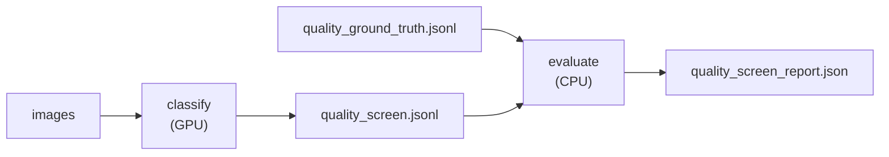

# Image-Quality Screen

Given a photographed receipt or invoice, decide whether it is good enough to
process — before anything tries to read it. One vision-language model
(**InternVL3.5-8B** via vLLM) answers six yes/no questions about the image and
gives one graded verdict, and a scoring stage compares those answers to the
corpus's own defect labels.

It runs as a two-pod **Kubeflow Pipelines** job, and end to end on a single
sandbox GPU box with one command.

> **Results, limitations and the PROD runbook live in
> [IMAGE_QUALITY_SCREEN.md](IMAGE_QUALITY_SCREEN.md).** This file is the
> engineering handover: how it is built, how to run it, and why it is shaped
> the way it is.

---

## Contents

- [What this branch is — and is not](#what-this-branch-is--and-is-not)
- [The two stages](#the-two-stages)
- [Running it](#running-it)
- [Configuration](#configuration)
- [Resume](#resume)
- [Repository layout](#repository-layout)
- [Development](#development)
- [Design notes](#design-notes)
- [Known gaps](#known-gaps)

---

## What this branch is — and is not

This is a **standalone fork**. It is not a subset of a larger extraction
system that you can grow back into one — the rest was deleted, deliberately,
and the branch is not intended to merge to `main`.

**Deliberately absent.** Listed because the first instinct on inheriting a repo
is to go looking for these, and they are not hiding:

| Not here | Why |
| --- | --- |
| Field extraction, cleaning, evaluation | A screen never reads the document. It looks at the paper. |
| Document-type classification | The screen runs *before* classification and does not know invoice from receipt. |
| Bank-statement handling, transaction linking, trust compliance | Other pipelines, other branches. |
| A `clean` stage between the two | `clean` normalises free-text field values. These answers are fixed tokens — `YES`/`NO` and one of `GOOD`/`FAIR`/`POOR` — so there is nothing to normalise. |
| Batched inference | No backend ever implemented it. Throughput comes from sharding across GPUs, not from batching within a process. |
| A CLI (`cli.py`) | `entrypoint.sh` is the only entry point. |

The one thing this leaves that looks odd: the GPU task is still called
`classify`. The name is kept because the KFP manifest dispatches on it, and
renaming needs this repo and the manifest to land together.

## The two stages


```mermaid
flowchart LR
    A[images] --> B["classify<br/>(GPU)"]
    B --> C[quality_screen.jsonl]
    D[quality_ground_truth.jsonl] --> E
    C --> E["evaluate<br/>(CPU)"]
    E --> F[quality_screen_report.json]
```

They are separate pods because they want **opposite hardware**. The manifest
gives `classify` every available GPU and `evaluate` none — which is why
`evaluate` reads its configuration directly rather than through `AppConfig`,
whose validation would insist on a model path that pod cannot see.

`classify` writes one record per image carrying the six answers, the graded
verdict, the raw model response for audit, and the settings that produced it
(prompt variant, tile budget, run timestamp). `evaluate` scores those against
the corpus labels and prints a report.

Malformed responses are kept as records rather than dropped. An image that
vanishes quietly between the corpus and the report shrinks the denominator and
flatters the score.

## Running it

Always through `entrypoint.sh`. It resolves configuration, activates the conda
environment, pre-warms the tokenizer and sets up logging; invoking
`python -m stages.…` directly skips all of that.

`KFP_TASK` selects the stage. It comes from the environment — in production
from the KFP manifest — and **cannot** live in `run_config.yml`, because both
pods read the same config file and a value there would make them do identical
work. There is no default: a missing task is a misconfigured pod, and guessing
would let it finish successfully having done the wrong thing.

| `KFP_TASK` | What it does | Hardware |
| --- | --- | --- |
| `check` | Print the resolved configuration and stop. Exits 0. | none |
| `classify` | Screen every image, write `quality_screen.jsonl`. | all GPUs |
| `evaluate` | Score the screen, write and print the report. | CPU only |
| `screen` | `classify` then `evaluate`, in one shell. **Sandbox only.** | all GPUs |

**Sandbox — one command.** Paths come from `run_config.yml`:

```bash
KFP_TASK=check  bash entrypoint.sh      # what will this run against?
KFP_TASK=screen bash entrypoint.sh      # both stages
```

**Production — two pods**, each with `KFP_TASK` set in its own env:

```bash
KFP_TASK=classify image_dir=<corpus> output=<run-dir> bash entrypoint.sh
KFP_TASK=evaluate ground_truth=<corpus>/quality_ground_truth.jsonl \
                  output=<run-dir> bash entrypoint.sh
```

`screen` must **never** appear in the KFP manifest. In a pod it would run the
CPU-only scoring inside the GPU pod, holding every card idle through it.

**Overrides**, all environment variables, so a comparison run cannot silently
become the default:

| Variable | Effect |
| --- | --- |
| `screen_variant` | Prompt variant, overriding config |
| `screen_min_tiles` / `screen_max_tiles` | Tile budget |
| `screen_max_images` | Screen only the first N images by filename (smoke tests) |
| `CLEAR_PREV_OUTPUT` | `true` (default) rescreens everything; `false` resumes |
| `LMM_LOG_DIR` | Log directory, overriding config entirely |
| `LMM_CONDA_ENV` | Conda environment path |

## Configuration

`config/run_config.yml` is the single source of truth. Every key is required —
there are no silent defaults, and a missing key fails at startup with a
diagnostic naming the file, the dotted key path, a valid example and a fix.

**The four paths that move together.** These are written out in full rather
than derived from a shared root, so that reading any one line tells you where
it points:

```yaml
pipeline:
  information_extraction:
    input:
      dir: <corpus>                                   # the images
      ground_truth: <corpus>/quality_ground_truth.jsonl   # the labels, beside them
    output:
      dir: <run-dir>                                  # where this run writes
bootstrap:
  logging:
    log_dir: <run-dir>/logs                           # under output.dir
```

The cost of spelling them out is that three can be updated and one left behind,
and two of those mistakes are silent — a stale `ground_truth` scores one corpus
against another set's answers and reports an ordinary-looking number, because
filenames repeat across generated corpora. So **startup checks** that
`ground_truth` sits under `input.dir` and `log_dir` under `output.dir`, and
refuses the config otherwise. Nothing is derived; the check only rejects paths
that cannot all be true at once.

Under KFP, `output.dir` is the only writable path in the pod — hence the second
rule.

**The screen's own block**, `pipeline.quality_screen`:

```yaml
prompt_file: prompts/quality_screen.yaml
variant: quality_screen_v12      # which prompt; a variant, not a constant
output_name: quality_screen.jsonl
condition_to_level: {...}        # corpus condition -> OVERALL level
tiling: {min_tiles: 12, max_tiles: 12}
```

`min_tiles` is the lever, not `max_tiles`. InternVL picks its tile grid by
closest aspect-ratio match, so a small receipt settles on roughly **one** tile
and never approaches the ceiling on its own — and at one tile the model
describes a heavily damaged receipt as being in good physical condition, word
for word identically to a clean one. Raising the floor forces the denser grid.
12 is measured; 6 rescued heavy damage but not moderate.

`prompts/quality_screen.yaml` holds the variants. Each carries its own
`evidence:` block declaring the **polarity** of every question — whether `YES`
means the defect is present or absent. `evaluate` reads polarity from the
variant that produced the run, not from config: scoring defect-phrased answers
as though they were good-phrased produces a complete, plausible report of
inverted numbers.

## Resume

This runs as a pipeline and images arrive over time, so a re-run should cost
only the new arrivals. `CLEAR_PREV_OUTPUT=false` screens only images with no
record yet.

What makes it safe: a kept record must carry the **same prompt variant and the
same tile budget** as the run resuming from it. Both change the answers, so a
file holding some `v11` answers and some `v12` answers is not one run — and
nothing downstream could tell, because `evaluate` would score the mixture and
report a perfectly ordinary number. When the settings have moved, the stage
discards everything and rescreens, loudly.

A clean slate is the **default**. Resume is the cheaper path, but defaulting to
it would mean a run silently inheriting whatever an earlier run left behind.

Because a resumed file is built by several runs, records carry a run timestamp
and the report says so:

```
NOTE: these records were screened across 2 runs (… .. …) — the classify stage
resumed rather than rescreening.
```

Without that line, `330 scored / missing 0` is what a *successful* resume
produces and also what a full rescreen produces, and the two are
indistinguishable.

## Repository layout

```
entrypoint.sh                    the only entry point; task dispatch
config/run_config.yml            single source of configuration
prompts/quality_screen.yaml      prompt variants + per-variant polarity

stages/quality_screen.py         classify: screen images, write records
stages/evaluate_quality_screen.py  evaluate: score records, write report

common/quality_screen_parser.py  read the model's answers (no rewriting)
common/quality_screen_scorer.py  precision/recall/F1, per criterion and type
common/app_config.py             config loading + fail-fast validation
common/pipeline_config.py        config dataclass, path-consistency check
common/vllm_dp.py                shard images across GPUs
common/vllm_dp_workers.py        the per-GPU worker
models/orchestrator.py           prompt -> model -> text
models/backends/vllm_backend.py  the vLLM seam

scripts/resolve_yaml_defaults.py entrypoint's YAML reader
scripts/check_thinking.py        30s check for InternVL emitting <think>
scripts/vllm_diagnostic.py       environment compatibility check
```

That is the whole of it — 11 modules under `common/`, 5 under `models/`, 2
stages. Everything reachable from the two entry points is listed above.

`DocumentOrchestrator` used to require a prompt-routing config, a universal
field list and per-type field definitions to be constructed. The screen
supplied all three and read none of them, and that requirement was the only
thing keeping `prompts/internvl3_prompts.yaml`, the field schema, the prompt
catalogue and the response handler in the tree — files nothing read, held up by
a constructor argument. Cutting the argument let all of them go.

## Development

```bash
conda activate /opt/homebrew/Caskroom/miniforge/base/envs/du
pytest tests/                                  # unit tests, all CPU
ruff check --fix --ignore ARG001,ARG002,F841 .
ruff format .
mypy . --ignore-missing-imports
```

Inference runs on a GPU box only — never locally.

The stages inject their inference callable, so everything they do with a
response is testable on CPU against canned text. That is why the parser, the
scorer, image selection and the resume logic are all separate functions rather
than inline: what needs a GPU is kept to a single adapter call.

Where a guard exists to prevent a specific silent failure, there is a test that
was **verified to fail** when the guard is removed. A regex that quietly
matches nothing passes vacuously and is worse than no test.

## Design notes

**Chain of thought is load-bearing.** The six per-criterion questions exist to
improve the final verdict, not for their own sake. Measured: `OVERALL` accuracy
48% with no criteria questions, 55% with an early set, 80% with the current
ones. A control prompt asking only for the verdict labels 18 of 20 clean images
as damaged.

**Polarity is a precision/recall dial.** Defect-phrased questions ("is it
blurry?") give high precision and find about a third of the defects.
Good-phrased ("is it sharp?") give near-perfect recall and over-flag. v12
mixes them deliberately: a screen should buy recall, because a false positive
costs a second look and a false negative ships a bad image into extraction.

**Every record is self-describing.** Variant, tile budget and run timestamp are
stamped on each one. This is not bookkeeping for its own sake — each has caused
or prevented a specific wrong number, and `evaluate` scores against what the
run recorded rather than against what config currently says.

**Fail fast, with four elements.** Every validation error names what is wrong,
where to fix it, what a valid value looks like, and a one-line remediation. A
stack trace is not a diagnostic: if you have to read the source to understand
the error, the message failed.

## Known gaps

See [IMAGE_QUALITY_SCREEN.md](IMAGE_QUALITY_SCREEN.md) for the measured
results. The standing problems:

- **CREASE recall ≈ 0.03.** Reproduces on independent data and under every
  prompt variant tried. Structural, not sampling. Undiagnosed — most likely
  the corpus's folds are too subtle to see, but that is not established.
- **Receipt SHADOW recall 0.000** against invoice SHADOW 1.000. Same status.
- **Never tested against real photographs.** The whole corpus is synthetically
  degraded. This is the largest gap before production.
- **Not measured: whether a flagged image actually extracts worse.** The screen
  is scored against defect labels, not against downstream extraction accuracy,
  so its practical value is inferred rather than demonstrated.
