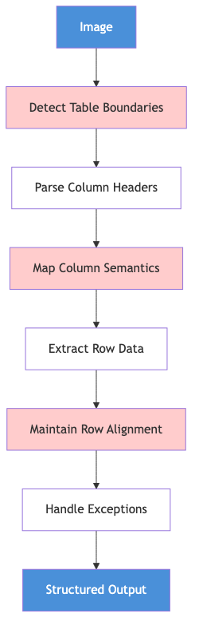
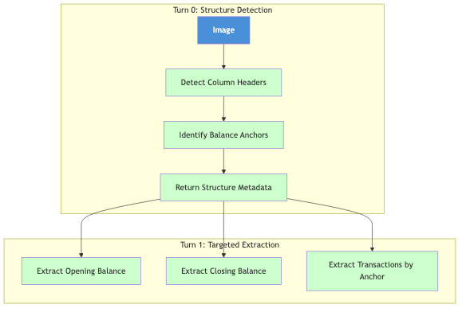
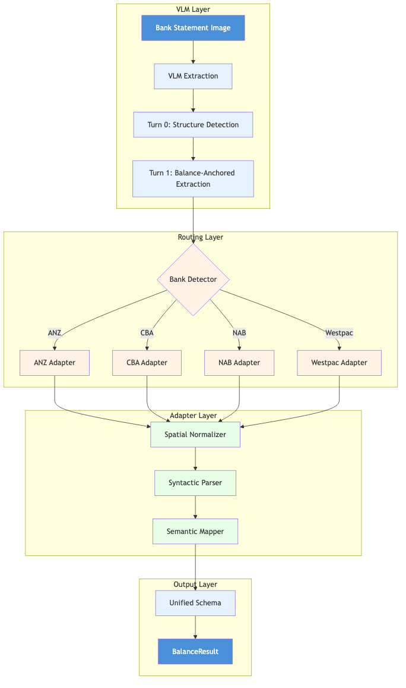

# Appendix B: Bank Statement Extraction Technical Analysis

## B.1 The Challenge

Extracting structured transaction data from Australian Big Four bank statements using Vision Language Models (VLMs) presents fundamental challenges rooted in the mismatch between VLM training paradigms and document structure requirements.

---

## B.2 Inductive Bias Mismatch

VLMs are pre-trained on **natural image-caption pairs**—photographs of objects, scenes, and activities. This creates inductive biases optimized for visual content understanding, not structured document extraction.

| Natural Images | Bank Statements |
|----------------|-----------------|
| Continuous color gradients | High-contrast text on white |
| Objects with organic shapes | Rigid tabular structures |
| Semantic meaning from visual content | Semantic meaning from spatial position |
| Global scene understanding | Fine-grained character recognition |
| "What" matters more than "where" | **Position is meaning** |

### The Spatial-Semantic Gap

In natural images, a dog is a dog regardless of position. In bank statements:

- A number under "Debit" = money out
- The same number under "Credit" = money in
- "Balance" at top = opening; at bottom = closing
- Column alignment determines transaction ownership

VLM attention mechanisms can learn positional semantics, but this fights against pre-training biases optimized for content-centric understanding.

---

## B.3 Three Dimensions of Variation

Big Four bank statements vary across three orthogonal dimensions:


### B.3.1 Spatial Variation (where data appears)

| Bank | Layout Characteristics |
|------|------------------------|
| ANZ | Dense multi-column layouts, compact spacing |
| CommBank | Cleaner single-flow statements |
| NAB | Variable header/footer structures |
| Westpac | Multiple format versions in circulation |

### B.3.2 Syntactic Variation (how data is formatted)

| Element | Format Variations |
|---------|-------------------|
| Dates | `DD/MM/YYYY`, `DD MMM YYYY`, `DD-MM-YY` |
| Amounts | `$1,234.56`, `1234.56`, `(1234.56)`, `1234.56 CR` |
| Debits/Credits | Separate columns, signed values, CR/DR suffix |
| Descriptions | Payee-first, reference-first, mixed |

### B.3.3 Semantic Variation (what data means)

| Concept | Terminology Variations |
|---------|------------------------|
| Money out | "Withdrawal", "Debit", "DR", "Payment" |
| Money in | "Credit", "Deposit", "CR", "Receipt" |
| Starting balance | "Opening Balance", "Balance B/F", "Previous Balance" |
| Ending balance | "Closing Balance", "Balance C/F", "Current Balance" |

---

## B.4 Why Table Extraction Fails

Full table extraction requires the VLM to perform multiple dependent reasoning steps:



**Error Compounding**: Each step introduces error that propagates downstream.

| Step | Failure Mode | Cascade Effect |
|------|--------------|----------------|
| Table boundaries | Missed rows at edges | Incomplete extraction |
| Column semantics | Debit/Credit confusion | Sign errors on all amounts |
| Row alignment | Cell misattribution | Wrong amounts for transactions |
| Exception handling | Merged cell failure | Corrupted multi-line entries |

### Empirical Finding

**3-turn table extraction** (detect structure → extract headers → extract rows) shows:
- High variance (30%+ std dev)
- Hallucinated table structures
- Row misalignment on 40%+ of complex statements

---

## B.5 Why Balance Extraction Works

Balance extraction reformulates the problem to play to VLM strengths:



### Why This Works

| VLM Strength | Balance Extraction Alignment |
|--------------|------------------------------|
| Pattern recognition | "Closing Balance" is a recognizable text anchor |
| Local context reasoning | Balance values appear near labels |
| Flexible interpretation | Works across format variations |

### Key Insight

Balance extraction doesn't require the VLM to maintain **global structural consistency**. Each extraction is locally grounded to a visual anchor, reducing error propagation.

---

## B.6 Architectural Solution

We trade **unpredictable model failures** for **predictable code complexity**:

| Approach | VLM Burden | Code Burden | Failure Mode |
|----------|------------|-------------|--------------|
| Pure VLM table extraction | High | Low | Stochastic hallucinations |
| VLM + Bank-specific adapters | Lower | Higher | Deterministic edge cases |

**Deterministic bugs are debuggable; stochastic failures are not.**

### Pipeline Architecture



### Component Responsibilities

| Component | Input | Output | Variation Handled |
|-----------|-------|--------|-------------------|
| **VLM Extraction** | Image | Raw text + structure hints | None (bank-agnostic) |
| **Bank Detector** | Raw extraction | Bank type enum | Logo/header patterns |
| **Spatial Normalizer** | Raw positions | Canonical positions | Layout differences |
| **Syntactic Parser** | Raw formats | Standard formats | Date/amount formats |
| **Semantic Mapper** | Bank terminology | Canonical terms | Terminology differences |

---

## B.7 Design Patterns

### Strategy Pattern

Each bank adapter implements a common interface with bank-specific logic:

```python
class StatementAdapter(ABC):
    @abstractmethod
    def normalize_spatial(self, vlm_output: dict) -> dict:
        """Map bank-specific regions to canonical positions."""
        ...

    @abstractmethod
    def parse_syntactic(self, normalized: dict) -> dict:
        """Convert bank-specific formats to standard formats."""
        ...

    @abstractmethod
    def map_semantic(self, parsed: dict) -> BalanceResult:
        """Map bank terminology to canonical terms."""
        ...
```

### Registry Pattern

Bank adapters are registered and retrieved by type:

```python
registry = AdapterRegistry()
registry.register(BankType.ANZ, ANZAdapter())
registry.register(BankType.CBA, CBAAdapter())

# Usage
adapter = registry.get(detected_bank_type)
result = adapter.process(vlm_output)
```

**Benefits**:
- Adding a new bank = one new file
- Each adapter is independently testable
- Main pipeline remains bank-agnostic

---

## B.8 Two-Turn Extraction Protocol

### Turn 1: Structure Detection

**Prompt objective**: Identify document structure without extracting content.

**Outputs**:
- Column headers detected (e.g., `["Date", "Description", "Debit", "Credit", "Balance"]`)
- Balance anchor positions (opening, closing)
- Table region boundaries
- Date format detected

### Turn 2: Balance-Anchored Extraction

**Prompt objective**: Extract content using Turn 1 structure as context.

**Strategy**: Use detected column names dynamically in prompts:

```python
prompt = f"""
Extract transactions from this bank statement.
Column structure: {detected_headers}
Place amounts under the correct column:
- Amounts under "{debit_col}" → debit field
- Amounts under "{credit_col}" → credit field
"""
```

**Key principle**: Prompts are **content-generic** (no specific transaction data) but **structure-dynamic** (adapt to detected layout).

---

## B.9 Empirical Results

### Model Comparison (CBA Synthetic Dataset, L40 GPU)

| Model | Accuracy | Std Dev | Time | Constraint |
|-------|----------|---------|------|------------|
| Llama-3.2-Vision | 85.9% | 22.3% | 271.7s | Full resolution |
| InternVL3.5-8B | 84.3% | 24.4% | 106.6s | 12 patches max |
| InternVL3-8B | 56.3% | 30.8% | 82.2s | 12 patches max |

### Key Finding

**InternVL3.5 achieves 28 percentage points higher accuracy than InternVL3** despite:
- Near-identical DocVQA scores (~92%)
- Same architecture (ViT-MLP-LLM)
- Same parameter count (8B)

**Explanation**: InternVL3.5's Cascade Reinforcement Learning reduces output variance, critical for consistent structured extraction. Standard benchmarks (DocVQA) fail to capture this because they test localized QA, not global structural consistency.

### Field-Level Performance

| Field | Llama-3.2 | InternVL3 | InternVL3.5 |
|-------|-----------|-----------|-------------|
| Document Type | 100% | 100% | 100% |
| Statement Date | 100% | 75% | 100% |
| Transaction Date | 77% | 40% | 76% |
| Line Item Descr | 77% | 32% | 69% |
| Transaction Amt | 76% | 35% | 77% |

InternVL3 fails precisely on **structured field extraction**—the tasks requiring spatial-semantic reasoning.

---

## B.10 Recommendations

### Model Selection

| Priority | Model | Rationale |
|----------|-------|-----------|
| **Accuracy** | Llama-3.2-Vision | 85.9% but 271s/doc |
| **Efficiency** | InternVL3.5-8B | 84.3% at 107s/doc (best accuracy/time) |
| **Avoid** | InternVL3-8B | High variance (30.8%) causes unreliable outputs |

### Architecture Principles

1. **Use VLM for OCR-like extraction**, not structural reasoning
2. **Encode structure in deterministic code** via bank-specific adapters
3. **Route by bank type** to isolate variation handling
4. **Validate with schema** to catch errors reliably

### Future Work

- **Qwen2.5-VL-7B**: Higher DocVQA (95.7%) suggests strong OCR—candidate for testing
- **Confidence scoring**: Route uncertain extractions to manual review
- **Template versioning**: Handle format changes within banks over time

---

## B.11 References

Wang, W., Gao, Z., Gu, L., et al. (2025). InternVL3.5: Advancing Open-Source Multimodal Models in Versatility, Reasoning, and Efficiency. *arXiv preprint arXiv:2508.18265*.

Zhu, J., Wang, W., Chen, Z., et al. (2025). InternVL3: Exploring Advanced Training and Test-Time Recipes for Open-Source Multimodal Models. *arXiv preprint arXiv:2504.10479*.

Wolpert, D.H. (1996). The Lack of A Priori Distinctions Between Learning Algorithms. *Neural Computation*, 8(7), 1341-1390.

Battaglia, P.W., et al. (2018). Relational inductive biases, deep learning, and graph networks. *arXiv preprint arXiv:1806.01261*.
