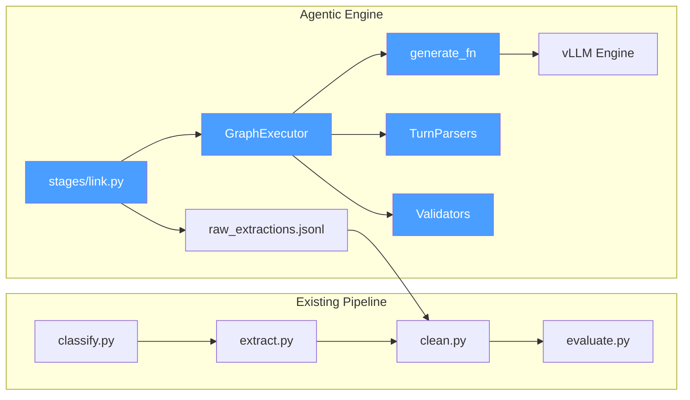
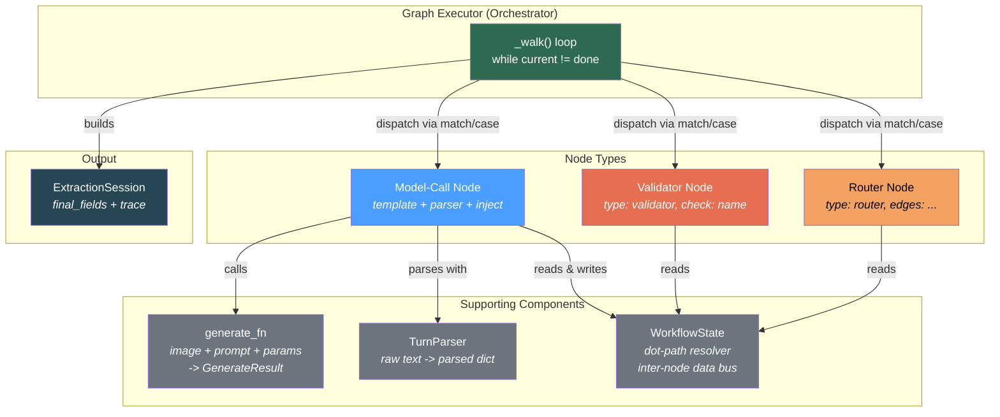
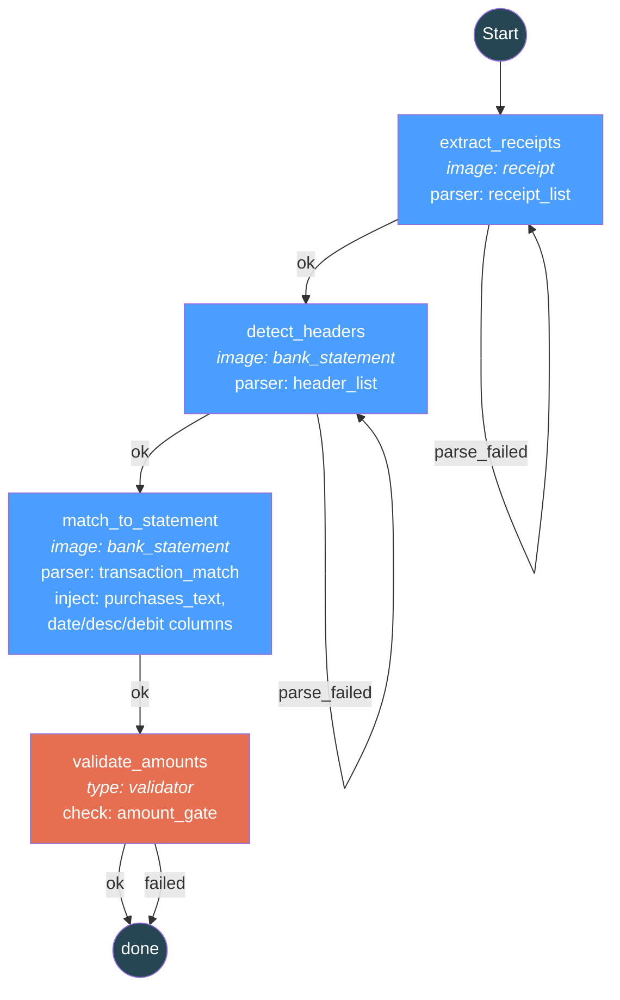
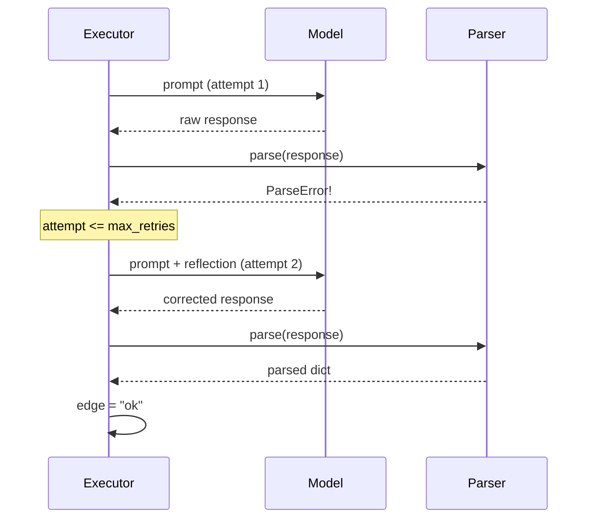
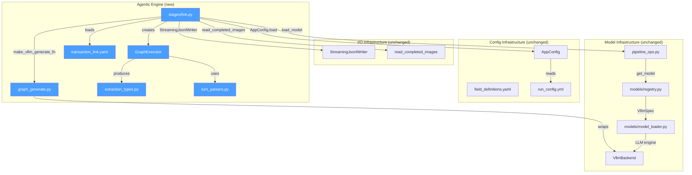

# Agentic Extraction Engine

A YAML-driven, graph-based multi-turn extraction engine for vision-language
models.  Walks a directed node graph against one or more images, accumulating
structured state between turns, with Self-Refine retry, validators, and
full observability -- all in ~200 lines of framework-free Python with
structural pattern matching.

## Table of Contents

- [Motivation](#motivation)
- [Architecture Overview](#architecture-overview)
- [Graph Components](#graph-components)
- [Workflow YAML Format](#workflow-yaml-format)
- [Transaction Linking Walkthrough](#transaction-linking-walkthrough)
- [API Reference](#api-reference)
- [Generate Function Wrappers](#generate-function-wrappers)
- [Turn Parsers](#turn-parsers)
- [Design Patterns](#design-patterns)
- [Structural Pattern Matching Sites](#structural-pattern-matching-sites)
- [vLLM Feature Integration](#vllm-feature-integration)
- [CLI Usage](#cli-usage)
- [Testing](#testing)
- [Integration with Existing Pipeline](#integration-with-existing-pipeline)
- [File Inventory](#file-inventory)
- [References](#references)

---

## Motivation

The existing pipeline handles single-turn extraction well: one image in,
one model call, one raw response out.  But two workloads need multi-turn
coordination:

1. **Transaction linking** -- cross-image: a receipt image and a bank
   statement image must be processed in sequence, with data flowing
   between turns (extracted receipt details are injected into the
   matching prompt).
2. **Multi-turn extraction** -- single-image: split a complex extraction
   (e.g. invoice headers + line items) into focused model calls with
   validation between them.

Rather than hard-wiring each workflow, the engine reads a declarative
YAML graph and walks it generically.  New workflows are added by writing
YAML, not Python.

---

## Architecture Overview



The agentic engine is a **pure additive layer**.  It produces the same
`raw_extractions.jsonl` artifact that `stages/extract.py` produces,
so the downstream `clean.py` and `evaluate.py` stages work unchanged.
No existing file is modified.

---

## Graph Components

The engine is composed of five distinct component types that collaborate
during graph execution.  Each has a single responsibility:



### Component Descriptions

**GraphExecutor** -- the orchestrator.  Owns the `_walk()` loop, node
dispatch (via `match/case`), retry logic, and session assembly.  Has no
knowledge of specific document types or model APIs; it delegates inference
to `generate_fn` and parsing to `TurnParser` instances.

**Model-Call Node** -- the workhorse.  Defined by a `template` key in
YAML.  Resolves `{placeholder}` references from prior node outputs
(the `inject` map), calls `generate_fn`, and routes the response
through a named parser.  On `ParseError`, it can follow a
`parse_failed` edge back to itself (Self-Refine retry) with a
`reflection` template appended.

**Validator Node** -- a pure logic gate.  Defined by `type: validator`
and `check: <name>`.  Makes no model call.  Reads accumulated
`WorkflowState`, runs a named check (e.g. `amount_gate`), and
emits `"ok"` or `"failed"` edge.  Can mutate state (e.g. override
match results).

**Router Node** -- a conditional branch.  Defined by `type: router`.
Evaluates conditions against `WorkflowState` and selects an edge
(e.g. `has_balance_debit`, `has_amount`, `default`).  Used for
bank-statement strategy selection in multi-turn extraction.

**WorkflowState** -- the inter-node data bus.  A dict of
`node_key -> NodeResult`.  Provides `get(dot_path)` for resolving
references like `"detect_headers.column_mapping.debit"` and
`has(node_key)` for checking whether a node has executed.
Implements the MetaGPT pattern: structured outputs between nodes
prevent garbage propagation.

**generate_fn** -- the model abstraction.  A callable with signature
`(Image, str, NodeGenParams) -> GenerateResult`.  Factory functions
(`make_vllm_generate_fn`, `make_simple_generate_fn`) adapt existing
backends to this interface without modifying them.

**TurnParser** -- the response interpreter.  A Protocol with
`parse(raw_response, context) -> dict`.  Four concrete implementations
handle different response formats.  Raises `ParseError` on failure,
which the executor catches for retry decisions.

---

## Workflow YAML Format

Each workflow is a YAML file in `prompts/workflows/`.  The schema:

```yaml
name: workflow_name
description: Human-readable description.

# Cross-image only: declare named image inputs
inputs:
  - name: receipt
    type: image
  - name: bank_statement
    type: image

nodes:
  node_name:
    # Which image this node processes (cross-image only; defaults to "primary")
    image: receipt

    # The prompt template.  {placeholders} are resolved from prior nodes.
    template: |
      Extract data from this image.
      Prior result: {prior_data}

    # Map placeholders to dot-path references in WorkflowState
    inject:
      prior_data: "earlier_node.parsed_key.nested_key"

    # Generation parameters
    max_tokens: 1024
    temperature: 0.0
    stop: ["\n\n\n"]          # vLLM stop sequences
    logprobs: 5               # top-k per-token logprobs
    output_schema:             # JSON schema for constrained decoding
      type: object
      properties: ...

    # Parser to interpret the response (default: field_value)
    parser: receipt_list

    # Self-Refine retry
    max_retries: 1
    reflection: |
      Could not parse your response: {error}
      Please try again using the correct format.

    # Edges: where to go next
    edges:
      ok: next_node
      parse_failed: node_name  # self-loop for retry

  validator_node:
    type: validator
    check: amount_gate         # named validator function
    edges:
      ok: done
      failed: done

  router_node:
    type: router
    edges:
      has_balance_debit: strategy_a
      has_amount: strategy_b
      default: strategy_c

# Declarative post-processing after graph reaches "done"
post_processing:
  - type: dedup
    field: RECEIPT_STORE
```

**Reserved terminal**: `done` -- the graph exits when any edge points
to `done`.

**Start node**: the first key in the `nodes` dict (YAML preserves
insertion order).

---

## Transaction Linking Walkthrough

The production `transaction_link` workflow processes a receipt image
paired with a bank statement image through four nodes:



**Data flow between nodes:**

| Source Node | Parsed Output | Consumed By | Via Inject |
|-------------|---------------|-------------|------------|
| `extract_receipts` | `formatted_text` | `match_to_statement` | `{purchases_text}` |
| `detect_headers` | `column_mapping.date` | `match_to_statement` | `{date_column}` |
| `detect_headers` | `column_mapping.description` | `match_to_statement` | `{description_column}` |
| `detect_headers` | `column_mapping.debit` | `match_to_statement` | `{debit_column}` |
| `extract_receipts` | `receipts` list | `validate_amounts` | Direct state access |
| `match_to_statement` | `matches` list | `validate_amounts` | Direct state access |

**Output**: The executor builds `final_fields` by mapping parser output
to the `transaction_link` schema fields:

| Parser Field | Schema Field |
|-------------|--------------|
| `receipts[i].DATE` | `RECEIPT_DATE` (pipe-separated) |
| `matches[i].RECEIPT_STORE` | `RECEIPT_DESCRIPTION` |
| `matches[i].RECEIPT_TOTAL` | `RECEIPT_TOTAL` |
| `matches[i].TRANSACTION_DATE` | `BANK_TRANSACTION_DATE` |
| `matches[i].TRANSACTION_DESCRIPTION` | `BANK_TRANSACTION_DESCRIPTION` |
| `matches[i].TRANSACTION_AMOUNT` | `BANK_TRANSACTION_DEBIT` |

---

## API Reference

### `GraphExecutor`

```python
from common.graph_executor import GraphExecutor

executor = GraphExecutor(
    generate_fn,                    # (Image, str, NodeGenParams) -> GenerateResult
    parsers,                        # dict[str, TurnParser]
    default_max_tokens=4096,        # fallback when YAML omits max_tokens
    max_graph_steps=20,             # circuit breaker
)

session = executor.run(
    document_type="TRANSACTION_LINK",
    definition=workflow_def,        # parsed YAML dict
    images={"receipt": "...", "bank_statement": "..."},  # cross-image
    # OR image_path="..."           # single-image
    image_name="pair_001",          # optional; defaults to filename stem
    extra_fields={"BANK_STATEMENT_FILE": "bank.png"},  # extra final_fields
)
```

### `ExtractionSession`

```python
session.document_type       # "TRANSACTION_LINK"
session.final_fields        # {"DOCUMENT_TYPE": ..., "RECEIPT_DATE": ..., ...}
session.raw_response        # "FIELD: value\nFIELD: value\n..."
session.node_results        # list[NodeResult] -- all nodes executed
session.trace               # WorkflowTrace -- observability
session.input_images        # {"receipt": "...", "bank_statement": "..."}
session.to_record()         # dict for raw_extractions.jsonl
```

### `WorkflowState`

```python
state.has("detect_headers")                          # bool
state.get("detect_headers.column_mapping.debit")     # "Debit"
state.get("extract_receipts.formatted_text")         # "Purchase 1: ..."
state.get("extract_receipts.receipts")               # [{"STORE": ..., ...}]
```

### `NodeGenParams`

```python
from common.extraction_types import NodeGenParams

params = NodeGenParams(
    max_tokens=2000,
    temperature=0.0,
    stop=["\n\n\n"],
    output_schema={"type": "object", ...},  # constrained decoding
    logprobs=5,
)
```

---

## Generate Function Wrappers

### vLLM Backend

```python
from common.graph_generate import make_vllm_generate_fn

generate_fn = make_vllm_generate_fn(
    engine,                                 # vLLM LLM instance
    chat_template_kwargs={"enable_thinking": False},  # optional
)
```

Builds `SamplingParams` via `match/case` on `NodeGenParams`:
- `output_schema=dict()` -> `StructuredOutputsParams(json=schema)`
- `stop=list()` -> stop sequences
- `logprobs=int()` -> per-token logprobs

### Simple Backend (HuggingFace)

```python
from common.graph_generate import make_simple_generate_fn

generate_fn = make_simple_generate_fn(processor)
# processor must have: generate(image, prompt, max_tokens) -> str
```

No structured output or logprobs support.

---

## Turn Parsers

All parsers implement the `TurnParser` Protocol:

```python
class TurnParser(Protocol):
    def parse(self, raw_response: str, context: WorkflowState) -> dict[str, Any]: ...
```

| Parser | YAML Key | Input Format | Output Keys |
|--------|----------|-------------|-------------|
| `HeaderListParser` | `header_list` | Numbered list, CSV, pipe-separated | `headers`, `column_mapping` |
| `ReceiptListParser` | `receipt_list` | `--- RECEIPT N ---` blocks | `receipts`, `formatted_text`, `receipt_count` |
| `TransactionMatchParser` | `transaction_match` | `--- RECEIPT N ---` match blocks | `matches`, `match_count` |
| `FieldValueParser` | `field_value` | `FIELD: value` lines | Flat `{FIELD: value}` dict |

All parsers raise `ParseError` on failure, which the executor catches
for Self-Refine retry decisions.

### Post-Processing Helpers

- `enforce_amount_gate(receipts, matches)` -- overrides `MATCHED_TRANSACTION`
  to `NOT_FOUND` when receipt total and transaction amount differ by >1%.
- `dedup_by_field(records, field_name)` -- deduplicates records, keeping
  first occurrence.

---

## Design Patterns

### Self-Refine (Level 2 Agentic)

On `ParseError`, if `max_retries > 0` and a `reflection` template
exists, the executor follows the `parse_failed` edge back to the same
node.  The reflection template (with `{error}` substituted) is appended
to the original prompt, giving the model explicit feedback about what
went wrong.  After exhausting retries, the executor proceeds via the
`"ok"` edge with the error payload -- it never silently drops data.



### MetaGPT Pattern

`WorkflowState` accumulates typed, structured output from each node.
Downstream nodes access prior results via dot-path references
(`state.get("detect_headers.column_mapping.date")`).  This prevents
garbage propagation: if a parser produces structured output, downstream
nodes can rely on its shape rather than re-parsing raw text.

### Circuit Breaker

`max_graph_steps=20` (configurable) caps total node executions.  If
the graph exceeds this limit, `RuntimeError` is raised.  This prevents
infinite loops from misconfigured `parse_failed` self-edges or
circular routing.

### Observability

`WorkflowTrace` records every node visited, every edge taken (as
`(from, edge_name, to)` tuples), retry counts per node, total model
calls, and total elapsed time.  All of this is serialized into the
`raw_extractions.jsonl` output for post-hoc analysis.

---

## Structural Pattern Matching Sites

The engine uses Python 3.12 `match/case` (PEP 634) for exhaustive,
auditable dispatch at six sites:

| Site | File | Matches On | Purpose |
|------|------|-----------|---------|
| Definition dispatch | `graph_executor.py:run()` | `{"inputs": [...], "nodes": {...}}` vs `{"nodes": {...}}` | Cross-image vs single-image workflow |
| Node execution | `graph_executor.py:_execute_node()` | `{"type": "validator"}` / `{"type": "router"}` / `{"template": ...}` | Node type dispatch |
| Generation mode | `graph_executor.py:_execute_model_call()` | `NodeGenParams(output_schema=dict())` vs `_` | Structured output vs free-text parsing |
| Validator dispatch | `graph_executor.py:_run_validator()` | `check_name` string | Named validator selection |
| Post-processing | `graph_executor.py:_run_post_processing()` | `{"type": "dedup", "field": ...}` | Post-processing step dispatch |
| SamplingParams build | `graph_generate.py:make_vllm_generate_fn()` | `NodeGenParams` fields | vLLM parameter construction |

---

## vLLM Feature Integration

The engine consumes these vLLM capabilities through the `generate_fn`
wrapper, without modifying the existing `VllmBackend`:

| Feature | vLLM API | Engine Use | YAML Opt-In |
|---------|----------|-----------|-------------|
| Structured outputs | `StructuredOutputsParams(json=schema)` | Constrained JSON decoding per node | `output_schema: {type: object, ...}` |
| Stop sequences | `SamplingParams(stop=[...])` | Early termination (header detection) | `stop: ["\n\n\n"]` |
| Logprobs | `SamplingParams(logprobs=N)` | Confidence scoring on match results | `logprobs: 5` |
| Prefix caching | `enable_prefix_caching=True` | Automatic for same-image multi-turn | Engine-level flag |
| Paged attention | Default | Multi-turn variable-length sequences | Already active |

---

## CLI Usage

### Transaction Linking

```bash
python -m stages.link \
    --pairs pairs.csv \
    --data-dir /data/images \
    --output /artifacts/raw_extractions.jsonl \
    --model internvl3-vllm
```

**Options:**

| Flag | Default | Description |
|------|---------|-------------|
| `--pairs` | (required) | CSV with `receipt_file`, `bank_statement_file` columns |
| `--data-dir`, `-d` | (required) | Directory containing the images |
| `--output`, `-o` | (required) | Path to write `raw_extractions.jsonl` |
| `--model` | `internvl3-vllm` | Model type for loading |
| `--workflow` | built-in | Path to custom workflow YAML |
| `--config` | `None` | Path to `run_config.yml` |

**Pairs CSV format:**

```csv
receipt_file,bank_statement_file
receipt_001.png,bank_statement_001.png
receipt_002.png,bank_statement_001.png
```

**Resumption**: if the output file exists with partial results from a
crashed run, the stage skips already-processed pairs and appends.

### Downstream Processing

The output is compatible with the existing clean and evaluate stages:

```bash
python -m stages.clean \
    --extractions /artifacts/raw_extractions.jsonl \
    --output /artifacts/cleaned_extractions.jsonl

python -m stages.evaluate \
    --extractions /artifacts/cleaned_extractions.jsonl \
    --ground-truth /data/ground_truth.csv \
    --output /artifacts/evaluation_results.jsonl
```

---

## Testing

All tests are GPU-free and use mock `generate_fn` with canned responses.

```bash
pytest tests/test_graph_executor.py tests/test_turn_parsers.py -v
```

### Test Coverage

**`test_graph_executor.py`** (13 tests):

| Test Class | Tests | What It Verifies |
|-----------|-------|-----------------|
| `TestSingleNode` | 2 | Single-node field extraction, `raw_response` format |
| `TestMultiNode` | 2 | Full 4-node cross-image workflow, inject dot-path resolution |
| `TestRetry` | 2 | Self-Refine retry on `ParseError`, exhausted retries proceed via `"ok"` |
| `TestCircuitBreaker` | 1 | `max_graph_steps` raises `RuntimeError` |
| `TestValidator` | 2 | Amount gate pass (amounts match), fail (mismatch overrides match) |
| `TestSerialization` | 1 | `to_record()` structure for JSONL |
| `TestErrorHandling` | 3 | Missing kwargs, unrecognized definition shape |

**`test_turn_parsers.py`** (27 tests):

| Test Class | Tests | What It Verifies |
|-----------|-------|-----------------|
| `TestHeaderListParser` | 6 | Numbered, CSV, pipe, markdown, empty, label skipping |
| `TestReceiptListParser` | 4 | Single/multiple receipts, error, extra fields |
| `TestTransactionMatchParser` | 4 | Match, NOT_FOUND, multiple, empty |
| `TestFieldValueParser` | 3 | Basic, empty, no-colon |
| `TestParseAmount` | 5 | Currency parsing edge cases |
| `TestEnforceAmountGate` | 3 | Pass, override, NOT_FOUND unchanged |
| `TestDedupByField` | 2 | Dedup, missing-field retention |

---

## Integration with Existing Pipeline



**Key integration points:**

- **Model loading**: `stages/link.py` uses `pipeline_ops.load_model()` --
  the same function used by `stages/extract.py`.
- **Config cascade**: Uses `AppConfig.load(cli_args, config_path)` --
  the same CLI > YAML > ENV > defaults cascade.
- **Output format**: `ExtractionSession.to_record()` produces the
  identical JSONL schema, so `clean.py` and `evaluate.py` consume it
  without changes.
- **Field definitions**: `transaction_link` is registered in
  `config/field_definitions.yaml` with 8 fields, so field lookup
  and F1 scoring work automatically.
- **I/O helpers**: Reuses `StreamingJsonlWriter` (crash-safe per-record
  flushing) and `read_completed_images` (resumption) from `stages/io.py`.

---

## File Inventory

| File | Purpose |
|------|---------|
| `common/extraction_types.py` | Dataclasses: `NodeGenParams`, `GenerateResult`, `NodeResult`, `WorkflowState`, `WorkflowTrace`, `ExtractionSession` |
| `common/turn_parsers.py` | `TurnParser` protocol + 4 parsers + post-processing helpers + registry |
| `common/graph_executor.py` | `GraphExecutor`: graph walk loop, node dispatch, retry, validators, final field builder |
| `common/graph_generate.py` | `make_vllm_generate_fn()` and `make_simple_generate_fn()` factory functions |
| `prompts/workflows/transaction_link.yaml` | 4-node cross-image workflow: extract receipts -> detect headers -> match -> validate |
| `stages/link.py` | Transaction linking CLI stage: pairs CSV -> `GraphExecutor` -> JSONL |
| `tests/test_graph_executor.py` | 13 GPU-free tests for `GraphExecutor` with mock `generate_fn` |
| `tests/test_turn_parsers.py` | 27 GPU-free tests for all parsers and helpers |

---

## References

### Agentic Workflow Theory

- [Agentic Workflows: Emerging Architectures and Design Patterns (Vellum AI, 2026)](https://www.vellum.ai/blog/agentic-workflows-emerging-architectures-and-design-patterns) --
  Level 1/2/3 taxonomy, ReAct, Self-Refine, Reflexion patterns.
  This engine implements Level 2 (Router Workflows): model outputs
  drive routing, but execution is predefined.

- [Agentic Document Workflows (LlamaIndex, 2026)](https://www.llamaindex.ai/blog/introducing-agentic-document-workflows) --
  Cross-document coordination, state preservation, validation loops.
  Directly influenced the `WorkflowState` inter-node data bus design.

- [2026 Guide to Agentic Workflow Architectures (StackAI)](https://www.stackai.com/blog/the-2026-guide-to-agentic-workflow-architectures) --
  Observability, retry/escalation, production checklist.
  Informed the `WorkflowTrace` design and circuit breaker.

### Self-Refine Pattern

- [Self-Refine: Iterative Refinement with Self-Feedback (Madaan et al., 2023)](https://arxiv.org/abs/2303.17651) --
  The foundational paper on iterative self-refinement.  The engine's
  `reflection` template + `parse_failed` self-edge implements this
  pattern: feed the error back to the model and retry.

### MetaGPT Pattern

- [MetaGPT: Meta Programming for Multi-Agent Collaborative Framework (Hong et al., 2023)](https://arxiv.org/abs/2308.00352) --
  Structured outputs between agents prevent garbage propagation.
  `WorkflowState` enforces this by requiring parsers to produce
  typed dicts, not raw strings, for downstream consumption.

### Python Language Features

- [PEP 634 -- Structural Pattern Matching (Python 3.10+)](https://peps.python.org/pep-0634/) --
  `match/case` syntax used at six dispatch sites for exhaustive,
  auditable branching on definition shapes, node types, and
  generation parameters.

### vLLM

- [vLLM Structured Outputs](https://docs.vllm.ai/en/latest/features/structured_outputs.html) --
  `StructuredOutputsParams(json=schema)`, xgrammar/guidance/outlines
  backends.  Consumed via `output_schema` YAML key.

- [vLLM Automatic Prefix Caching](https://docs.vllm.ai/en/latest/design/automatic_prefix_caching.html) --
  Hash-based KV block caching for shared prefixes.  Multi-turn
  workflows on the same image benefit automatically.

- [vLLM SamplingParams](https://docs.vllm.ai/en/latest/api/params/sampling_params.html) --
  `logprobs`, `stop`, `temperature`, `structured_output` parameters.
  The `make_vllm_generate_fn` wrapper translates `NodeGenParams` to
  `SamplingParams` via pattern matching.

### Document Extraction

- [Receipt-to-Bank-Transaction Matching (internal)](prompts/staged_transaction_linking.yaml) --
  The original 3-stage prompt design for transaction linking, now
  promoted to a production stage via this engine.
