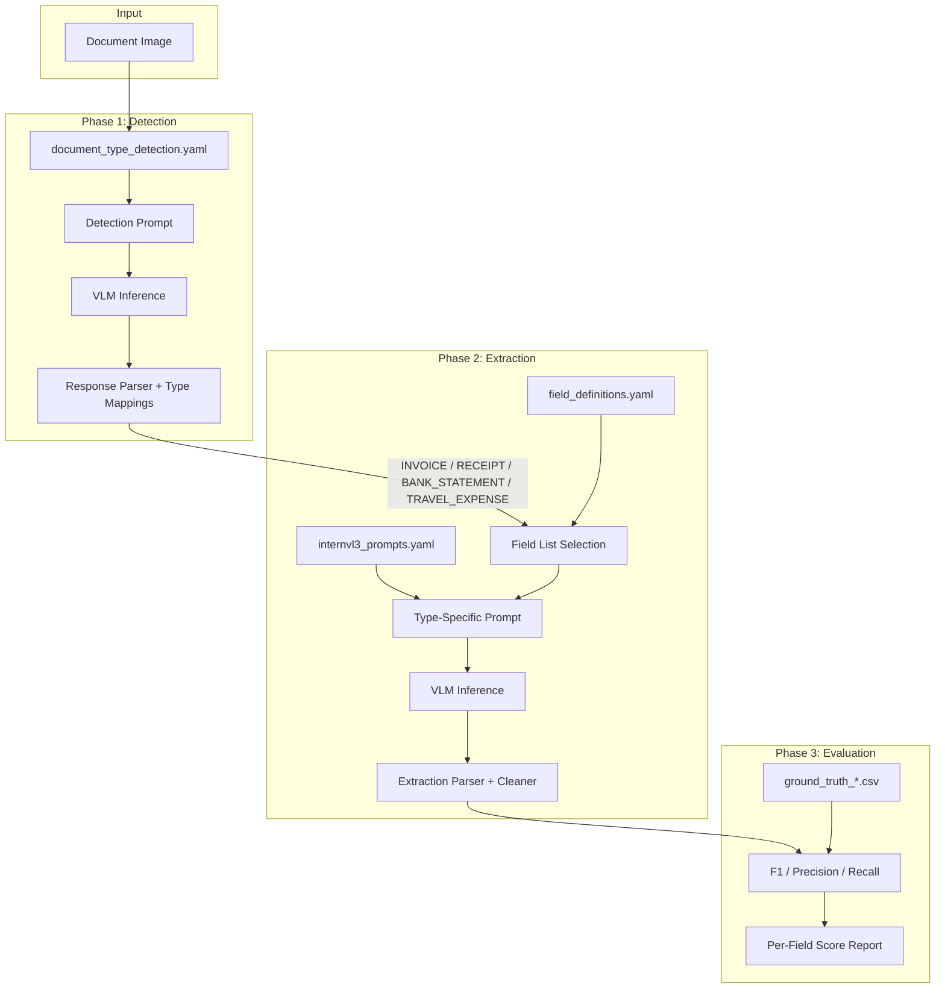
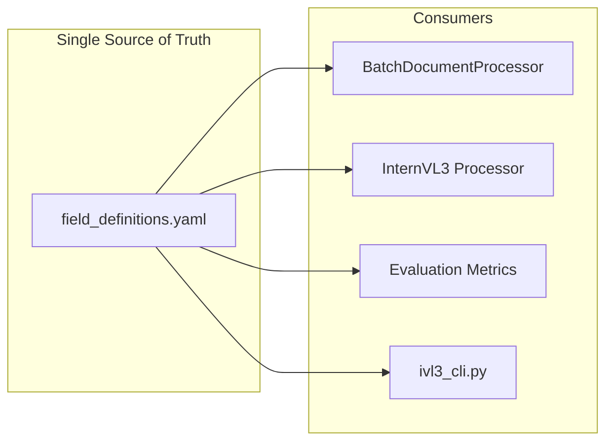
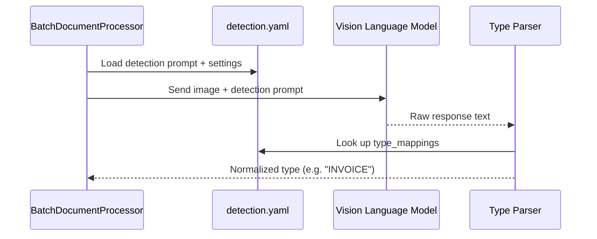
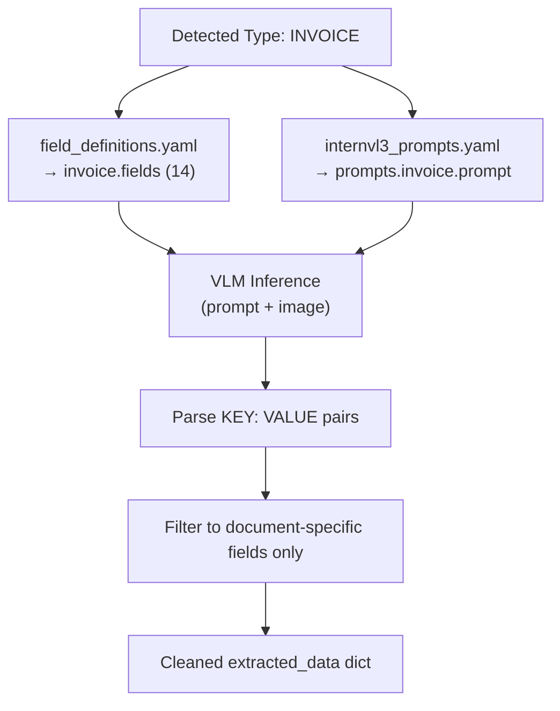
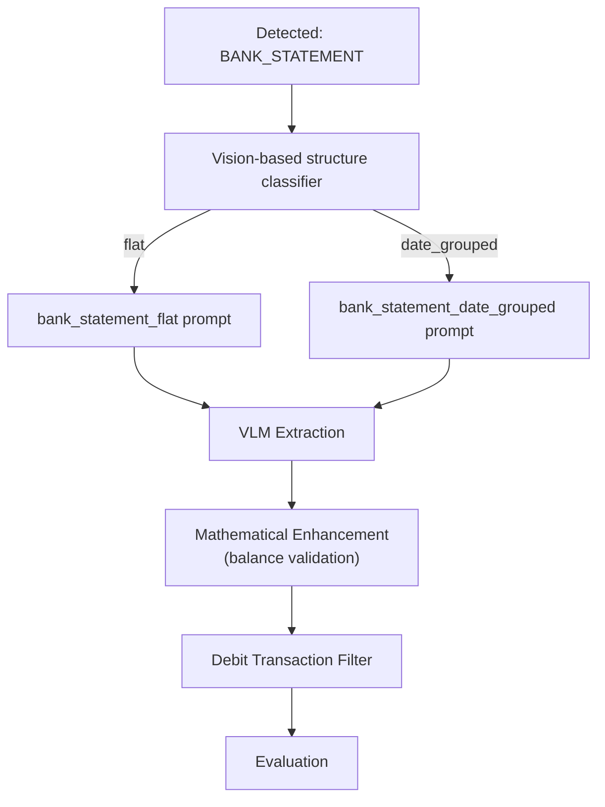
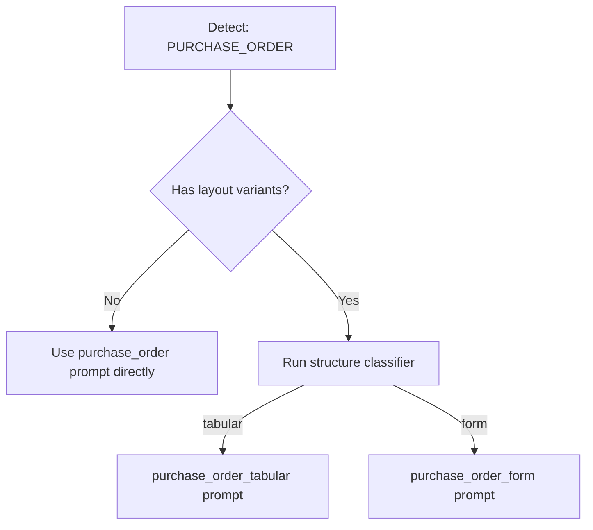

# Config-Driven Dispatch Pattern

How the LMM_POC pipeline routes document images through detection, extraction, and evaluation using YAML configuration as the single source of truth — and how to extend it to new document types.

## Pattern Origins

Config-Driven Dispatch is not a single named pattern from a textbook — it is a composition of three established software design principles applied together:

| Principle | Origin | How we apply it |
|---|---|---|
| **Strategy Pattern** | Gamma et al., *Design Patterns* (GoF, 1994) | The detected document type selects which extraction prompt and field list to use at runtime, without changing the processing code itself. Each document type is effectively a different "strategy" for extraction. |
| **Table-Driven Design** | McConnell, *Code Complete* (2004, Ch. 18) | YAML lookup tables (`type_mappings`, `document_fields`, `prompts`) replace `if/elif` chains. Adding a new document type means adding rows to tables, not writing new branches. |
| **Convention over Configuration** | Ruby on Rails / DHH (2004); widely adopted | Prompt keys match document type names match ground truth directory names. The system resolves `"invoice"` to `field_definitions.yaml → invoice`, `internvl3_prompts.yaml → invoice`, and `evaluation_data/inv_rec/` by naming convention alone — no explicit wiring required. |

The combination is powerful: the Strategy Pattern provides the runtime polymorphism, Table-Driven Design makes that polymorphism data-driven rather than code-driven, and Convention over Configuration eliminates the glue code that would otherwise connect them. The result is a pipeline where new document types require only configuration changes.

## Architecture Overview

The pipeline processes document images in three phases: **detect** the document type, **extract** fields using a type-specific prompt, and **evaluate** against ground truth. Every phase is driven by YAML configuration — no code changes are needed for standard document types.



## The Four Configuration Files

All pipeline behaviour is defined in four YAML files and one CSV per document type. No Python code references document types by name — everything is looked up dynamically.

| File | Purpose | Keyed by |
|---|---|---|
| `config/field_definitions.yaml` | Field lists, types, categories, aliases | `document_type` (lowercase) |
| `prompts/document_type_detection.yaml` | Detection prompts, visual indicators, type mappings | prompt variant key |
| `prompts/internvl3_prompts.yaml` | Extraction prompts per document type | `document_type` (lowercase) |
| `evaluation_data/<type>/ground_truth_<type>.csv` | Ground truth values for evaluation | `filename` column |



## Phase 1: Detection Dispatch

When an image enters the pipeline, the system classifies it using a VLM prompt defined in `document_type_detection.yaml`.

### Detection flow



### Type mappings normalise VLM output

The VLM may respond with varied phrasing. The `type_mappings` section normalises these to canonical types:

```yaml
# prompts/document_type_detection.yaml
type_mappings:
  "invoice": "INVOICE"
  "tax invoice": "INVOICE"
  "bill": "INVOICE"
  "receipt": "RECEIPT"
  "bank statement": "BANK_STATEMENT"
  "boarding pass": "TRAVEL_EXPENSE"
  "e-ticket": "TRAVEL_EXPENSE"
  # ... every expected variation
```

The parser (`_parse_document_type_response`) walks these mappings first, then falls back to keyword matching, then to `settings.fallback_type`.

## Phase 2: Extraction Dispatch

Once the document type is known, the pipeline selects the correct field list and extraction prompt — both looked up by the same document type key.

### Field selection from `field_definitions.yaml`

```yaml
# config/field_definitions.yaml
document_fields:
  invoice:
    count: 14
    fields:
      - DOCUMENT_TYPE
      - BUSINESS_ABN
      - SUPPLIER_NAME
      # ... 11 more fields

  bank_statement:
    count: 5
    fields:
      - DOCUMENT_TYPE
      - STATEMENT_DATE_RANGE
      - LINE_ITEM_DESCRIPTIONS
      - TRANSACTION_DATES
      - TRANSACTION_AMOUNTS_PAID

  travel_expense:
    count: 9
    fields:
      - DOCUMENT_TYPE
      - PASSENGER_NAME
      - TRAVEL_MODE
      # ... 6 more fields
```

This is the **single source of truth** for what fields exist per document type. The function `load_document_field_definitions()` in `common/batch_processor.py` loads this at runtime with fail-fast validation.

### Prompt selection from `internvl3_prompts.yaml`

The extraction prompt is loaded by key matching the document type:

```python
# Simplified dispatch logic (actual code in batch_processor.py and
# document_aware_internvl3_processor.py)

extraction_key = document_type.lower()   # e.g. "invoice"
prompt = SimplePromptLoader.load_prompt("internvl3_prompts.yaml", extraction_key)
field_list = load_document_field_definitions()[extraction_key]
```

Each prompt lists every expected field with `NOT_FOUND` defaults so the VLM knows the exact output schema:

```yaml
# prompts/internvl3_prompts.yaml
prompts:
  invoice:
    name: "Invoice Extraction"
    prompt: |
      Extract ALL data from this invoice image.
      DOCUMENT_TYPE: INVOICE
      BUSINESS_ABN: NOT_FOUND
      SUPPLIER_NAME: NOT_FOUND
      ...
```

### Dispatch flow



### Document-aware field reduction

Instead of extracting all 19 universal fields for every document, the pipeline only asks for fields relevant to the detected type. This improves both accuracy and speed:

| Document Type | Fields | Reduction vs Universal |
|---|---|---|
| Invoice / Receipt | 14 | 26% fewer |
| Travel Expense | 9 | 53% fewer |
| Bank Statement | 5 | 74% fewer |

## Phase 3: Evaluation Dispatch

Evaluation is also config-driven. Field types (monetary, date, boolean, list) determine comparison logic:

```yaml
# config/field_definitions.yaml
evaluation:
  field_types:
    monetary:
      - GST_AMOUNT
      - TOTAL_AMOUNT
      - TRANSACTION_AMOUNTS_PAID
    boolean:
      - IS_GST_INCLUDED
    date:
      - INVOICE_DATE
      - TRANSACTION_DATES
    list:
      - LINE_ITEM_DESCRIPTIONS
      - LINE_ITEM_QUANTITIES
```

The evaluation module (`common/evaluation_metrics.py`) reads these types to select the right comparison strategy per field — no hardcoded field names.

## Special Case: Structure Variants

Some document types have layout variants that require different extraction prompts. Bank statements are the current example:



The structure classifier (`common/vision_bank_statement_classifier.py`) uses the VLM itself to analyse layout, then appends a suffix to the prompt key:

```python
structure_type = classify_bank_statement_structure_vision(image_path, model)
extraction_key = f"bank_statement_{structure_type}"  # "bank_statement_flat" or "bank_statement_date_grouped"
```

Both variants share the same field list from `field_definitions.yaml` — only the prompt changes.

---

## Adding a New Document Type

### Checklist


Steps 1-4 are **config-only** (YAML/CSV). Step 5 is a minor code addition. The walkthrough below uses a hypothetical `PURCHASE_ORDER` type.

---

### Step 1: Define fields in `config/field_definitions.yaml`

Add the new type under `document_fields` with its field list:

```yaml
document_fields:
  # ... existing types ...

  purchase_order:
    count: 10
    fields:
      - DOCUMENT_TYPE
      - PO_NUMBER
      - VENDOR_NAME
      - VENDOR_ADDRESS
      - BUYER_NAME
      - BUYER_ADDRESS
      - ORDER_DATE
      - LINE_ITEM_DESCRIPTIONS
      - LINE_ITEM_QUANTITIES
      - TOTAL_AMOUNT
```

Then update the supporting sections:

```yaml
# Add descriptions for new fields
field_descriptions:
  PO_NUMBER: "Purchase order number"
  VENDOR_NAME: "Vendor/supplier company name"
  BUYER_NAME: "Buying organization name"
  BUYER_ADDRESS: "Buying organization address"
  ORDER_DATE: "Date the purchase order was issued (DD/MM/YYYY)"

# Categorise fields
field_categories:
  identification:
    - PO_NUMBER           # ADD
  business_details:
    - VENDOR_NAME         # already exists as SUPPLIER_NAME alias
    - VENDOR_ADDRESS      # ADD
  customer_details:
    - BUYER_NAME          # ADD
    - BUYER_ADDRESS       # ADD
  temporal:
    - ORDER_DATE          # ADD

# Classify field types for evaluation
evaluation:
  field_types:
    monetary:
      - TOTAL_AMOUNT      # already listed
    date:
      - ORDER_DATE        # ADD
    list:
      - LINE_ITEM_DESCRIPTIONS  # already listed
      - LINE_ITEM_QUANTITIES    # already listed

# Add aliases
document_type_aliases:
  purchase_order:
    - purchase order
    - po
    - p.o.

# Register as supported
supported_document_types:
  - invoice
  - receipt
  - bank_statement
  - travel_expense
  - purchase_order        # ADD
```

### Step 2: Add detection rules in `prompts/document_type_detection.yaml`

Add visual indicators to the detection prompt and type mappings for response normalisation:

```yaml
prompts:
  detection_complex:
    prompt: |
      # ... existing indicators ...

      PURCHASE ORDER INDICATORS:
      - Header: "PURCHASE ORDER", "P.O.", "PO NUMBER"
      - Layout: Buyer header -> Vendor "Ship To" -> Line items -> Approval
      - Key fields: PO number, delivery date, line items with quantities
      - Visual: Company letterhead, approval signatures, delivery terms

      # ... update response options ...
      - PURCHASE_ORDER (for purchase orders, P.O.s)

  detection_simple:
    prompt: |
      What type of business document is this image?
      Respond with only: INVOICE or RECEIPT or BANK_STATEMENT or TRAVEL_EXPENSE or PURCHASE_ORDER

# Add type mappings
type_mappings:
  "purchase order": "PURCHASE_ORDER"
  "purchase_order": "PURCHASE_ORDER"
  "purchaseorder": "PURCHASE_ORDER"
  "po": "PURCHASE_ORDER"
  "p.o.": "PURCHASE_ORDER"
```

### Step 3: Create extraction prompt in `prompts/internvl3_prompts.yaml`

Add a prompt key matching the lowercase document type:

```yaml
prompts:
  # ... existing prompts ...

  purchase_order:
    name: "Purchase Order Extraction"
    description: "Extract 10 purchase order fields"
    prompt: |
      Extract ALL data from this purchase order image.
      Respond in exact format below with actual values or NOT_FOUND.

      DOCUMENT_TYPE: PURCHASE_ORDER
      PO_NUMBER: NOT_FOUND
      VENDOR_NAME: NOT_FOUND
      VENDOR_ADDRESS: NOT_FOUND
      BUYER_NAME: NOT_FOUND
      BUYER_ADDRESS: NOT_FOUND
      ORDER_DATE: NOT_FOUND
      LINE_ITEM_DESCRIPTIONS: NOT_FOUND
      LINE_ITEM_QUANTITIES: NOT_FOUND
      TOTAL_AMOUNT: NOT_FOUND

      Instructions:
      - Find PO number: Usually at top right, prefixed "PO" or "P.O."
      - Find vendor: Company fulfilling the order
      - Find buyer: Organization placing the order
      - Find date: Use DD/MM/YYYY format
      - Find line items: List with " | " separator
      - Find amounts: Include $ symbol
      - Replace NOT_FOUND with actual values
```

### Step 4: Create ground truth data

```
evaluation_data/
  purchase_order/
    ground_truth_purchase_order.csv
    po_001.png
    po_002.png
    ...
```

CSV structure — column names must match `field_definitions.yaml` exactly:

```csv
filename,DOCUMENT_TYPE,PO_NUMBER,VENDOR_NAME,VENDOR_ADDRESS,BUYER_NAME,BUYER_ADDRESS,ORDER_DATE,LINE_ITEM_DESCRIPTIONS,LINE_ITEM_QUANTITIES,TOTAL_AMOUNT
po_001.png,PURCHASE_ORDER,PO-2024-0042,Acme Supplies,"123 Industrial Rd, Sydney",TechCorp,"456 Business Ave, Melbourne",15/03/2024,Widget A | Widget B,100 | 50,$7500.00
```

### Step 5: Add parser keywords (minor code change)

In `models/document_aware_internvl3_processor.py`, method `_parse_document_type_response` (~line 699), add a keyword branch:

```python
elif any(word in response_lower for word in ["purchase", "order", "po"]):
    return "PURCHASE_ORDER"
```

### Step 6: Validate with `load_document_field_definitions()`

The loader currently hardcodes which document types to validate at startup. In `common/batch_processor.py` line 87, update the required types list:

```python
# Current
for doc_type in ["invoice", "receipt", "bank_statement"]:

# Updated
for doc_type in ["invoice", "receipt", "bank_statement", "purchase_order"]:
```

And add the new type to the result builder (~line 114):

```python
# Add purchase_order if defined in YAML
if "purchase_order" in doc_fields and "fields" in doc_fields["purchase_order"]:
    result["purchase_order"] = doc_fields["purchase_order"]["fields"]
```

> **Note**: A future improvement could make this fully dynamic by iterating `supported_document_types` from the YAML instead of maintaining a hardcoded list.

---

## Adding Structure Variants (Optional)

If your new document type has multiple layouts, follow the bank statement pattern:



1. **Create a classifier** — write a function similar to `classify_bank_statement_structure_vision()` that uses the VLM to identify the layout variant
2. **Add variant prompts** — add `purchase_order_tabular` and `purchase_order_form` keys to the extraction prompt YAML
3. **Wire the suffix** — in `process_document_aware()`, append the structure suffix to the prompt key

The field list stays the same for all variants — only the prompt changes.

---

## File Reference

| File | Role |
|---|---|
| `config/field_definitions.yaml` | Field lists, types, categories, aliases (single source of truth) |
| `prompts/document_type_detection.yaml` | Detection prompts, type mappings, settings |
| `prompts/internvl3_prompts.yaml` | Extraction prompts per document type |
| `common/batch_processor.py` | Orchestrates detect -> extract -> evaluate pipeline |
| `common/simple_prompt_loader.py` | Loads prompts from YAML by file + key |
| `common/evaluation_metrics.py` | Field-type-aware accuracy scoring |
| `models/document_aware_internvl3_processor.py` | InternVL3 detection + extraction logic |
| `common/vision_bank_statement_classifier.py` | Structure variant classification (bank statements) |
| `common/bank_statement_adapter.py` | Multi-turn extraction for complex tables |
| `evaluation_data/*/ground_truth_*.csv` | Ground truth per document type |

## Design Principles

1. **YAML is the single source of truth** — field lists, prompt text, type mappings, and evaluation rules all live in config files, not code
2. **Fail fast with diagnostics** — `load_document_field_definitions()` validates structure at load time and raises clear errors with remediation steps
3. **Document-aware field reduction** — each type extracts only its relevant fields, improving accuracy and reducing token usage
4. **InternVL3-focused pipeline** — single model path eliminates routing complexity
5. **Convention over configuration** — prompt keys match document type names, ground truth directories match type names, field lists use the same uppercase names everywhere
