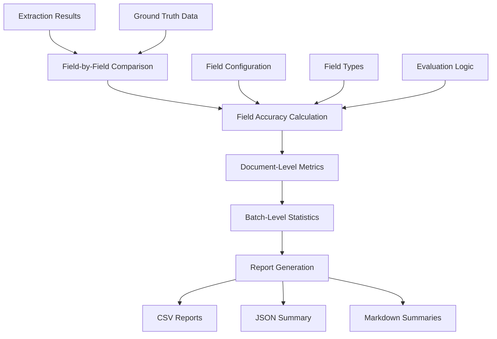

# Evaluation System Guide

A comprehensive guide to the evaluation system used in the LMM_POC vision model framework for assessing field extraction accuracy and model performance.

## Table of Contents

1. [Overview](#overview)
2. [Evaluation Architecture](#evaluation-architecture)
3. [Field Accuracy Calculation](#field-accuracy-calculation)
4. [Document-Level Evaluation](#document-level-evaluation)
5. [Batch Evaluation Pipeline](#batch-evaluation-pipeline)
6. [Ground Truth System](#ground-truth-system)
7. [Report Generation](#report-generation)
8. [Comparison Methodology](#comparison-methodology)
9. [Performance Metrics](#performance-metrics)
10. [Customizing Evaluation](#customizing-evaluation)
11. [Troubleshooting](#troubleshooting)

---

## Overview

The LMM_POC evaluation system provides **comprehensive, fair, and sophisticated assessment** of vision language model performance on structured document extraction tasks. The system is designed to handle complex field types with appropriate comparison logic while ensuring consistent evaluation across different models.

### Key Features

- ✅ **Field-Type Aware**: Different comparison logic for monetary, date, text, and numeric fields
- ✅ **Fuzzy Matching**: Handles variations in format and presentation
- ✅ **Tolerance-Based**: Monetary fields allow for rounding differences
- ✅ **Model Agnostic**: Identical evaluation logic for all models
- ✅ **Comprehensive Metrics**: Field-level, document-level, and batch-level statistics
- ✅ **Production-Ready**: Deployment readiness assessment and recommendations
- ✅ **Multi-Format Output**: CSV, JSON, and Markdown reports

### Evaluation Philosophy

The system balances **strictness with practicality**:
- **Strict** where precision matters (numeric IDs, exact amounts)
- **Flexible** where variation is expected (dates, text formatting, addresses)
- **Tolerant** where technical limitations create minor differences (rounding, OCR)

---

## Evaluation Architecture

### System Components



### Core Evaluation Flow

1. **Input Processing**: Extract field values from model responses
2. **Ground Truth Loading**: Load reference values from CSV
3. **Field Matching**: Compare extracted vs ground truth for each field
4. **Accuracy Calculation**: Apply field-type-specific comparison logic
5. **Aggregation**: Calculate document and batch-level metrics
6. **Report Generation**: Create multiple output formats

### Key Files

| File | Purpose |
|------|---------|
| `common/evaluation_utils.py` | Core evaluation logic and field accuracy calculation |
| `common/reporting.py` | Report generation in multiple formats |
| `common/config.py` | Field definitions and evaluation parameters |
| `evaluation_ground_truth.csv` | Reference truth data |

---

## Field Accuracy Calculation

The heart of the evaluation system is the `calculate_field_accuracy()` function, which applies sophisticated comparison logic based on field types.

### Core Algorithm

```python
def calculate_field_accuracy(extracted_value, ground_truth_value, field_name):
    """
    Calculate accuracy for a specific field with specialized comparison logic.
    
    Returns: float between 0.0 and 1.0
    """
```

### N/A Handling (Critical Feature)

**Perfect N/A Detection**: The system correctly rewards models for identifying missing fields.

```python
# Both N/A is perfect match
if extracted.upper() == "N/A" and ground_truth.upper() == "N/A":
    return 1.0

# One is N/A but not the other is complete mismatch
if (extracted.upper() == "N/A") != (ground_truth.upper() == "N/A"):
    return 0.0
```

**Supported N/A Variants**:
- `N/A`, `NA`, `""` (empty), `NAN`, `NULL`, `NONE`, `NIL`
- Case insensitive matching

### Field-Type-Specific Logic

#### 1. Numeric ID Fields (`NUMERIC_ID_FIELDS`)

**Purpose**: Exact matching for identifiers that must be precisely correct.

**Fields**: ABN, BSB_NUMBER, BANK_ACCOUNT_NUMBER

**Logic**:
```python
# Strip all non-digits and compare numerically
extracted_digits = re.sub(r'\D', '', extracted)
ground_truth_digits = re.sub(r'\D', '', ground_truth)
return 1.0 if extracted_digits == ground_truth_digits else 0.0
```

**Examples**:
```
Ground Truth: "04 904 754 234"
Extracted:    "04904754234"     → 1.0 (perfect)
Extracted:    "04-904-754-234"  → 1.0 (perfect)
Extracted:    "04904754235"     → 0.0 (wrong digit)
```

#### 2. Monetary Fields (`MONETARY_FIELDS`)

**Purpose**: Currency amounts with tolerance for rounding and formatting differences.

**Fields**: TOTAL, SUBTOTAL, GST, OPENING_BALANCE, CLOSING_BALANCE

**Logic**:
```python
# Extract numeric value and apply 1% tolerance
extracted_num = float(re.sub(r'[^\d.-]', '', extracted))
ground_truth_num = float(re.sub(r'[^\d.-]', '', ground_truth))
tolerance = abs(ground_truth_num * 0.01) if ground_truth_num != 0 else 0.01
return 1.0 if abs(extracted_num - ground_truth_num) <= tolerance else 0.0
```

**Examples**:
```
Ground Truth: "$123.45"
Extracted:    "$123.45"    → 1.0 (perfect)
Extracted:    "123.45"     → 1.0 (missing symbol ok)
Extracted:    "$123.44"    → 1.0 (within 1% tolerance)
Extracted:    "$124.70"    → 1.0 (within 1% tolerance)
Extracted:    "$130.00"    → 0.0 (outside tolerance)
```

**Tolerance Calculation**:
- **1% of ground truth value** (minimum $0.01)
- **$123.45**: tolerance = $1.23
- **$5.00**: tolerance = $0.05
- **$0.50**: tolerance = $0.01 (minimum)

#### 3. Date Fields (`DATE_FIELDS`)

**Purpose**: Flexible date matching that handles different formats and partial matches.

**Fields**: INVOICE_DATE, DUE_DATE, STATEMENT_PERIOD

**Logic**:
```python
# Extract numeric components and compare
extracted_numbers = re.findall(r'\d+', extracted)
ground_truth_numbers = re.findall(r'\d+', ground_truth)

# Perfect match: all components identical
if set(extracted_numbers) == set(ground_truth_numbers):
    return 1.0

# Partial match: at least 2 components match
common = set(extracted_numbers) & set(ground_truth_numbers)
if common and len(common) >= 2:
    return 0.8

return 0.0
```

**Examples**:
```
Ground Truth: "15/03/2024"
Extracted:    "15/03/2024"  → 1.0 (perfect match)
Extracted:    "15-03-2024"  → 1.0 (different separator, same numbers)
Extracted:    "March 15, 2024" → 1.0 (different format, same components)
Extracted:    "15/03/2023"  → 0.8 (2/3 components match - day and month)
Extracted:    "16/04/2025"  → 0.0 (no components match)
```

#### 4. List Fields (`LIST_FIELDS`)

**Purpose**: Multi-item fields with partial credit for partial matches.

**Fields**: DESCRIPTIONS, PRICES, QUANTITIES

**Logic**:
```python
# Split on common separators and calculate overlap
extracted_items = [item.strip() for item in re.split(r'[,;|\n]', extracted)]
ground_truth_items = [item.strip() for item in re.split(r'[,;|\n]', ground_truth)]

# Calculate item-by-item overlap with fuzzy matching
matches = sum(1 for item in extracted_items if any(
    item.lower() in gt_item.lower() or gt_item.lower() in item.lower() 
    for gt_item in ground_truth_items
))

return min(matches / len(ground_truth_items), 1.0) if ground_truth_items else 0.0
```

**Examples**:
```
Ground Truth: "Office supplies | Equipment | Software"
Extracted:    "Office supplies, Equipment, Software" → 1.0 (all match)
Extracted:    "Office supplies | Equipment"          → 0.67 (2/3 match)
Extracted:    "Office supplies | Training"           → 0.33 (1/3 match)
```

#### 5. Text Fields (`TEXT_FIELDS`)

**Purpose**: General text with fuzzy matching for variations in format and spelling.

**Fields**: SUPPLIER, BUSINESS_ADDRESS, PAYER_NAME, etc.

**Logic**:
```python
# Normalize text (lowercase, remove punctuation)
extracted_clean = normalize_text(extracted)
gt_clean = normalize_text(ground_truth)

# Exact match
if extracted_clean == gt_clean:
    return 1.0

# Partial match (substring relationship)
if extracted_clean in gt_clean or gt_clean in extracted_clean:
    return 0.8

return 0.0
```

**Examples**:
```
Ground Truth: "ABC Construction Pty Ltd"
Extracted:    "ABC Construction Pty Ltd"  → 1.0 (perfect match)
Extracted:    "ABC Construction"          → 0.8 (partial match)
Extracted:    "ABC CONSTRUCTION PTY LTD"  → 1.0 (case insensitive)
Extracted:    "XYZ Company"               → 0.0 (no match)
```

---

## Document-Level Evaluation

### Document Accuracy Calculation

For each document, the system calculates:

```python
document_accuracy = {
    'image_name': 'invoice_001.png',
    'overall_accuracy': 0.852,              # Average of all field accuracies
    'correct_fields': 19,                   # Count with ≥99% accuracy  
    'total_fields': 25,                     # Total fields evaluated
    'field_accuracy_rate': 76.0             # Percentage of perfect fields
}
```

### Field-Level Detail

Each document evaluation includes per-field breakdown:

```python
# For each field
document_evaluation[f'{field}_accuracy'] = 0.8
document_evaluation[f'{field}_extracted'] = "Extracted value"  
document_evaluation[f'{field}_ground_truth'] = "Ground truth value"
```

### Document Quality Categories

Documents are classified into quality tiers:

| Category | Accuracy Range | Interpretation |
|----------|----------------|----------------|
| **Perfect** | ≥99% | Production-ready, minimal errors |
| **Good** | 80-98% | Minor issues, suitable for most use cases |
| **Fair** | 60-79% | Moderate issues, may need review |
| **Poor** | <60% | Significant problems, requires attention |

---

## Batch Evaluation Pipeline

### Pipeline Execution

```python
def evaluate_extraction_results(extraction_results, ground_truth_data):
    """
    Main evaluation orchestrator that processes all documents
    and generates comprehensive statistics.
    """
```

### Batch Statistics Generated

```python
evaluation_summary = {
    # Basic counts
    'total_images': 20,
    'overall_accuracy': 0.752,
    
    # Quality distribution
    'perfect_documents': 3,
    'good_documents': 12,
    'fair_documents': 4,
    'poor_documents': 1,
    
    # Field performance
    'field_accuracies': {
        'ABN': 0.95,
        'TOTAL': 0.88,
        'SUPPLIER': 0.82,
        # ... all 25 fields
    },
    
    # Best/worst performance
    'best_performing_image': 'invoice_004.png',
    'best_performance_accuracy': 0.965,
    'worst_performing_image': 'invoice_013.png', 
    'worst_performance_accuracy': 0.423,
    
    # Detailed data for each document
    'evaluation_data': [
        # Document-level evaluations for all images
    ]
}
```

### Performance Thresholds

The system uses configurable thresholds for deployment decisions:

```python
DEPLOYMENT_READY_THRESHOLD = 0.9    # 90% accuracy for production
PILOT_READY_THRESHOLD = 0.8         # 80% accuracy for pilot testing
NEEDS_OPTIMIZATION_THRESHOLD = 0.7  # Below 70% needs major improvements
```

---

## Ground Truth System

### Ground Truth Structure

The ground truth CSV follows a standardized structure:

```csv
image_file,ABN,ACCOUNT_HOLDER,BANK_ACCOUNT_NUMBER,...,TOTAL
invoice_001.png,04 904 754 234,N/A,N/A,...,$156.90
invoice_002.png,31 724 023 407,N/A,N/A,...,$89.50
```

**Key Properties**:
- **26 columns**: `image_file` + 25 extraction fields
- **Alphabetical ordering**: Fields sorted for consistency
- **N/A standardization**: Missing values marked as "N/A"
- **Format consistency**: Currency as "$123.45", dates as "DD/MM/YYYY"

### Loading Process

```python
def load_ground_truth(csv_path, show_sample=False):
    """
    Load ground truth data with validation and error handling.
    
    Returns: dict mapping image names to field values
    """
```

**Validation Checks**:
- File exists and is readable
- Required columns present
- Image name column identified
- Data format validation

### Sample Data Requirements

For robust evaluation, ground truth should include:

- **Variety**: Different document types and layouts
- **Coverage**: All field types represented
- **Edge Cases**: N/A values, boundary conditions
- **Quality**: Accurate reference values
- **Completeness**: All expected fields populated

---

## Report Generation

The evaluation system generates multiple report formats for different audiences:

### 1. CSV Reports

#### Extraction Results CSV
```csv
image_name,ABN,ACCOUNT_HOLDER,...,TOTAL
invoice_001.png,04904754234,N/A,...,$156.90
```
- **Purpose**: Raw extraction results
- **Audience**: Technical analysis, data processing
- **Format**: 26 columns (image_name + 25 fields)

#### Ground Truth Evaluation CSV
```csv
image_name,overall_accuracy,correct_fields,ABN_accuracy,ABN_extracted,ABN_ground_truth,...
invoice_001.png,0.852,19,1.0,04904754234,04904754234,...
```
- **Purpose**: Detailed accuracy breakdown
- **Audience**: Technical evaluation, debugging
- **Format**: 80 columns (5 summary + 75 field details)

#### Extraction Metadata CSV
```csv
image_name,processing_time,success,error_message,quality_score
invoice_001.png,2.34,True,,0.85
```
- **Purpose**: Processing statistics
- **Audience**: Performance analysis
- **Format**: Processing metrics per document

### 2. JSON Summary

```json
{
  "model_name": "Llama-3.2-11B-Vision-Instruct",
  "evaluation_timestamp": "20240315_143022",
  "total_images": 20,
  "overall_accuracy": 0.752,
  "perfect_documents": 3,
  "field_accuracies": {
    "ABN": 0.95,
    "TOTAL": 0.88
  },
  "deployment_recommendation": "READY_FOR_PILOT"
}
```

### 3. Executive Summary (Markdown)

```markdown
# Llama Vision Key-Value Extraction - Executive Summary

## Model Performance Overview
**Model:** Llama-3.2-11B-Vision-Instruct  
**Documents Processed:** 20  
**Average Accuracy:** 75.2%

## Key Findings
1. Successfully extracts 15 out of 25 fields with ≥90% accuracy
2. Best Performance: invoice_004.png (96.5% accuracy)
3. Challenging Cases: invoice_013.png (42.3% accuracy)

## Production Readiness Assessment
✅ **READY FOR PILOT:** Model shows good performance with minor limitations
```

### 4. Deployment Checklist

```markdown
# Llama Vision Deployment Readiness Checklist

## Performance Metrics
- [x] Overall accuracy ≥80% (75.2%)
- [x] At least 15 fields with ≥90% accuracy (15/25)
- [x] At least 30% perfect documents (3/20)

## Deployment Strategy
✅ **APPROVED FOR PILOT DEPLOYMENT**

### Next Steps
1. ✅ Deploy to pilot environment
2. 📊 Implement accuracy monitoring
3. 🔄 Establish evaluation pipeline
```

---

## Comparison Methodology

### Fair Comparison Principles

The system ensures fair comparison between models through:

1. **Identical Ground Truth**: Same reference data for all models
2. **Consistent Evaluation Logic**: Same `calculate_field_accuracy()` for all models
3. **Compatible Output Structure**: Direct CSV comparison possible
4. **Same Field Set**: Identical extraction fields across models
5. **Uniform Preprocessing**: Same image preprocessing pipeline

### Direct Comparison Process

```bash
# Run both models
python llama_keyvalue.py
python internvl3_keyvalue.py

# Compare results directly
import pandas as pd
llama_df = pd.read_csv('llama_ground_truth_evaluation_*.csv')
internvl_df = pd.read_csv('internvl3_ground_truth_evaluation_*.csv')

# Merge and compare
comparison = pd.merge(llama_df, internvl_df, on='image_name', suffixes=('_llama', '_internvl3'))
```

### Model Performance Matrix

| Metric | Llama-3.2-Vision | InternVL3-2B | InternVL3-8B |
|--------|------------------|--------------|--------------|
| Overall Accuracy | 75-85% | 70-80% | 78-88% |
| Perfect Documents | 15-25% | 10-20% | 18-28% |
| Processing Speed | 3-5s/doc | 1-3s/doc | 2-4s/doc |
| Memory Usage | 22GB VRAM | 4GB VRAM | 16GB VRAM |
| Strong Fields | Financial, Dates | Text, IDs | Balanced |
| Weak Fields | Lists, Descriptions | Complex formatting | N/A handling |

---

## Performance Metrics

### Field-Level Metrics

#### Accuracy Distribution
- **Excellent (≥90%)**: Production-ready fields
- **Good (70-89%)**: Acceptable with monitoring
- **Fair (50-69%)**: Needs improvement
- **Poor (<50%)**: Requires attention

#### Field Performance Categories
```python
field_performance = {
    'excellent_fields': [f for f, acc in field_accuracies.items() if acc >= 0.9],
    'good_fields': [f for f, acc in field_accuracies.items() if 0.7 <= acc < 0.9],
    'fair_fields': [f for f, acc in field_accuracies.items() if 0.5 <= acc < 0.7],
    'poor_fields': [f for f, acc in field_accuracies.items() if acc < 0.5]
}
```

### Document-Level Metrics

#### Quality Distribution
```python
quality_distribution = {
    'perfect_rate': perfect_docs / total_docs,      # ≥99% accuracy
    'good_rate': good_docs / total_docs,            # 80-98% accuracy
    'fair_rate': fair_docs / total_docs,            # 60-79% accuracy
    'poor_rate': poor_docs / total_docs             # <60% accuracy
}
```

#### Performance Indicators
- **Mean Accuracy**: Average across all documents
- **Median Accuracy**: Middle value (less sensitive to outliers)
- **Standard Deviation**: Consistency measure
- **Min/Max Range**: Performance spread

### Batch-Level Metrics

#### Processing Statistics
- **Total Processing Time**: End-to-end pipeline duration
- **Average Time per Document**: Processing efficiency
- **Success Rate**: Percentage of documents processed without errors
- **Memory Utilization**: Peak memory usage during processing

#### Deployment Readiness Score
```python
def calculate_deployment_score(evaluation_summary):
    score = 0
    
    # Overall accuracy component (40% weight)
    if evaluation_summary['overall_accuracy'] >= 0.9:
        score += 40
    elif evaluation_summary['overall_accuracy'] >= 0.8:
        score += 32
    elif evaluation_summary['overall_accuracy'] >= 0.7:
        score += 24
    
    # Perfect documents component (30% weight)
    perfect_rate = evaluation_summary['perfect_documents'] / evaluation_summary['total_images']
    score += perfect_rate * 30
    
    # Field coverage component (30% weight)
    excellent_fields = len([acc for acc in evaluation_summary['field_accuracies'].values() if acc >= 0.9])
    field_coverage = excellent_fields / len(evaluation_summary['field_accuracies'])
    score += field_coverage * 30
    
    return min(score, 100)
```

---

## Customizing Evaluation

### Adding Custom Field Types

To add new field types with custom evaluation logic:

#### 1. Define Field Type
```python
# In common/config.py
'CUSTOM_FIELD': {
    'type': 'custom_type',
    'evaluation_logic': 'custom_evaluation',
    'instruction': '[custom instruction or N/A]'
}
```

#### 2. Add Validation Support
```python
# In validate_field_definitions()
valid_types = ['numeric_id', 'monetary', 'date', 'list', 'text', 'custom_type']
valid_evaluation_logic = ['...', 'custom_evaluation']
```

#### 3. Implement Evaluation Logic
```python
# In calculate_field_accuracy()
elif field_name in CUSTOM_TYPE_FIELDS:
    # Your custom evaluation logic
    return custom_accuracy_calculation(extracted, ground_truth)
```

### Custom Accuracy Thresholds

Adjust thresholds for specific use cases:

```python
# For high-precision requirements
DEPLOYMENT_READY_THRESHOLD = 0.95    # 95% for medical/financial
PILOT_READY_THRESHOLD = 0.90         # 90% for pilot

# For experimental/research use
DEPLOYMENT_READY_THRESHOLD = 0.75    # 75% for research
PILOT_READY_THRESHOLD = 0.60         # 60% for early experiments
```

### Custom Tolerance Settings

Modify tolerance for specific field types:

```python
# In calculate_field_accuracy() for monetary fields
if field_name == 'HIGH_PRECISION_AMOUNT':
    tolerance = abs(ground_truth_num * 0.001)  # 0.1% tolerance
elif field_name == 'ROUGH_ESTIMATE':
    tolerance = abs(ground_truth_num * 0.05)   # 5% tolerance
else:
    tolerance = abs(ground_truth_num * 0.01)   # Standard 1% tolerance
```

### Custom Evaluation Metrics

Add domain-specific metrics:

```python
def calculate_tax_compliance_score(evaluation_summary):
    """Calculate tax document compliance score."""
    required_tax_fields = ['BUSINESS_PURPOSE', 'TAX_DEDUCTIBLE_AMOUNT', 'DATE_OF_EXPENSE']
    
    compliance_scores = []
    for field in required_tax_fields:
        field_accuracy = evaluation_summary['field_accuracies'].get(field, 0)
        compliance_scores.append(field_accuracy)
    
    return sum(compliance_scores) / len(compliance_scores)
```

---

## Troubleshooting

### Common Evaluation Issues

#### 1. Low Accuracy Despite Visually Correct Results

**Problem**: Results look correct but evaluation shows low accuracy

**Debugging Steps**:
```python
# Check specific field comparison
from common.evaluation_utils import calculate_field_accuracy
accuracy = calculate_field_accuracy("extracted_value", "ground_truth_value", "FIELD_NAME")
print(f"Accuracy: {accuracy}")

# Check field type assignment
from common.config import FIELD_TYPES
print(f"Field type: {FIELD_TYPES.get('FIELD_NAME')}")
```

**Common Causes**:
- Format mismatch (e.g., "123.45" vs "$123.45")
- Field type misconfiguration
- Ground truth data inconsistency

#### 2. Perfect Fields Showing as Incorrect

**Problem**: Obviously correct extractions marked as wrong

**Solution**: Check N/A handling
```python
# Both values should be recognized as N/A
extracted = "N/A"
ground_truth = "nan"  # Should both be treated as missing
```

#### 3. Inconsistent Results Between Runs

**Problem**: Same data gives different evaluation results

**Causes**:
- Ground truth file modified between runs
- Field configuration changed
- Evaluation logic updated

**Solution**: Check file timestamps and configuration version

#### 4. Memory Issues During Evaluation

**Problem**: Out of memory errors during batch evaluation

**Solutions**:
- Process images in smaller batches
- Clear intermediate variables
- Use streaming evaluation for large datasets

### Debugging Tools

#### Field-by-Field Analysis
```python
def debug_field_evaluation(extracted_result, ground_truth_row, field_name):
    """Debug specific field evaluation."""
    extracted_val = extracted_result.get(field_name, "N/A")
    gt_val = ground_truth_row.get(field_name, "N/A") 
    
    accuracy = calculate_field_accuracy(extracted_val, gt_val, field_name)
    
    print(f"Field: {field_name}")
    print(f"Extracted: '{extracted_val}'")
    print(f"Ground Truth: '{gt_val}'")
    print(f"Accuracy: {accuracy}")
    print(f"Field Type: {FIELD_TYPES.get(field_name)}")
```

#### Evaluation Pipeline Validation
```python
def validate_evaluation_pipeline():
    """Validate that evaluation pipeline is working correctly."""
    # Test with known values
    test_cases = [
        ("$123.45", "$123.45", "TOTAL", 1.0),  # Perfect match
        ("$123.44", "$123.45", "TOTAL", 1.0),  # Within tolerance
        ("15/03/2024", "15-03-2024", "INVOICE_DATE", 1.0),  # Date format
        ("N/A", "N/A", "ABN", 1.0),  # N/A handling
    ]
    
    for extracted, ground_truth, field, expected in test_cases:
        accuracy = calculate_field_accuracy(extracted, ground_truth, field)
        assert abs(accuracy - expected) < 0.01, f"Failed: {field} test"
    
    print("✅ Evaluation pipeline validation passed")
```

---

## Advanced Topics

### Multi-Document Type Evaluation

For evaluating across different document types:

```python
def evaluate_by_document_type(evaluation_results, document_type_mapping):
    """Calculate accuracy metrics split by document type."""
    type_results = {}
    
    for doc_eval in evaluation_results['evaluation_data']:
        doc_type = document_type_mapping.get(doc_eval['image_name'], 'unknown')
        if doc_type not in type_results:
            type_results[doc_type] = []
        type_results[doc_type].append(doc_eval['overall_accuracy'])
    
    return {
        doc_type: {
            'count': len(accuracies),
            'mean_accuracy': sum(accuracies) / len(accuracies),
            'std_accuracy': statistics.stdev(accuracies) if len(accuracies) > 1 else 0
        }
        for doc_type, accuracies in type_results.items()
    }
```

### Temporal Evaluation Tracking

For tracking model performance over time:

```python
def track_evaluation_history(evaluation_summary, history_file):
    """Track evaluation results over time."""
    history_entry = {
        'timestamp': datetime.now().isoformat(),
        'overall_accuracy': evaluation_summary['overall_accuracy'],
        'field_accuracies': evaluation_summary['field_accuracies'],
        'model_version': evaluation_summary.get('model_version', 'unknown')
    }
    
    # Append to history file
    with open(history_file, 'a') as f:
        f.write(json.dumps(history_entry) + '\n')
```

### Cross-Validation Evaluation

For robust performance assessment:

```python
def cross_validate_evaluation(all_images, ground_truth_data, n_folds=5):
    """Perform k-fold cross-validation evaluation."""
    fold_size = len(all_images) // n_folds
    fold_results = []
    
    for i in range(n_folds):
        # Split data
        start_idx = i * fold_size
        end_idx = start_idx + fold_size
        test_images = all_images[start_idx:end_idx]
        train_images = all_images[:start_idx] + all_images[end_idx:]
        
        # Evaluate on test fold
        test_results = process_images(test_images)
        test_evaluation = evaluate_extraction_results(test_results, ground_truth_data)
        fold_results.append(test_evaluation['overall_accuracy'])
    
    return {
        'mean_accuracy': sum(fold_results) / len(fold_results),
        'std_accuracy': statistics.stdev(fold_results),
        'fold_results': fold_results
    }
```

---

## Conclusion

The LMM_POC evaluation system provides a comprehensive, fair, and sophisticated framework for assessing vision language model performance on document extraction tasks. Key strengths include:

- **Sophisticated Field Logic**: Type-aware evaluation with appropriate comparison methods
- **Robust N/A Handling**: Correct reward for identifying missing information
- **Flexible Tolerance**: Balance between precision and practicality  
- **Model Agnostic Design**: Fair comparison across different architectures
- **Production-Ready Metrics**: Actionable insights for deployment decisions
- **Comprehensive Reporting**: Multiple formats for different audiences

This evaluation framework enables confident, data-driven decisions about model performance, optimization priorities, and production deployment readiness.