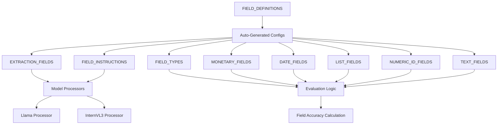

# Field Configuration System Guide

A comprehensive guide to the centralized field configuration system in the LMM_POC vision model evaluation framework.

## Table of Contents

1. [Overview](#overview)
2. [Architecture](#architecture)
3. [Field Definition Structure](#field-definition-structure)
4. [Field Types](#field-types)
5. [Evaluation Logic](#evaluation-logic)
6. [Adding New Fields](#adding-new-fields)
7. [Replacing All Fields](#replacing-all-fields)
8. [Configuration Validation](#configuration-validation)
9. [Best Practices](#best-practices)
10. [Examples](#examples)
11. [Troubleshooting](#troubleshooting)

---

## Overview

The LMM_POC framework uses a **centralized field configuration system** that serves as the single source of truth for all field specifications. This system eliminates code duplication, ensures consistency across models, and makes field management trivial.

### Key Benefits

- ✅ **Single Source of Truth**: All field specs in `common/config.py`
- ✅ **Perfect Consistency**: Both Llama and InternVL3 use identical field instructions
- ✅ **Automatic Scaling**: Prompts, evaluation, and reports adapt to any field count
- ✅ **Type-Driven Logic**: Field types automatically determine evaluation behavior
- ✅ **Validation Built-In**: Configuration errors caught early
- ✅ **Easy Maintenance**: Add/modify/remove fields in one location

### Before vs After

#### Before (Scattered Configuration)
```
models/llama_processor.py:       field_instructions = {...}
models/internvl3_processor.py:   [value or N/A] for all fields
common/evaluation_utils.py:      hardcoded field type lists
```

#### After (Centralized Configuration)
```
common/config.py:    FIELD_DEFINITIONS = {...}  # Everything here!
All other files:     Import from centralized config
```

---

## Architecture

### Core Components



### File Structure

```
common/config.py                 # 🎯 SINGLE SOURCE OF TRUTH
├── FIELD_DEFINITIONS           # Complete field specifications
├── Derived Configurations     # Auto-generated from FIELD_DEFINITIONS
├── Field Type Groupings        # For evaluation logic
└── Validation Function         # Ensures consistency

models/llama_processor.py        # ✅ Uses centralized config
models/internvl3_processor.py    # ✅ Uses centralized config
common/evaluation_utils.py       # ✅ Uses centralized config
```

---

## Field Definition Structure

Each field in `FIELD_DEFINITIONS` follows a standardized structure:

```python
'FIELD_NAME': {
    'type': 'field_type',                    # Required: Field data type
    'instruction': '[field instruction]',    # Required: Model instruction
    'evaluation_logic': 'logic_type',        # Required: How to evaluate accuracy
    'description': 'Human description',      # Required: Documentation
    'required': True/False                   # Required: Whether field is mandatory
}
```

### Required Keys

| Key | Type | Description |
|-----|------|-------------|
| `type` | string | Field data type (see [Field Types](#field-types)) |
| `instruction` | string | Instruction for models in format `[instruction or N/A]` |
| `evaluation_logic` | string | Evaluation method (see [Evaluation Logic](#evaluation-logic)) |
| `description` | string | Human-readable description for documentation |
| `required` | boolean | Whether this field must be present in all documents |

### Example Field Definition

```python
'TOTAL': {
    'type': 'monetary',
    'instruction': '[total amount in dollars or N/A]',
    'evaluation_logic': 'monetary_with_tolerance',
    'description': 'Final total amount including all charges',
    'required': True
}
```

---

## Field Types

The system supports five distinct field types, each with specific characteristics:

### 1. `numeric_id`
**Purpose**: Exact numeric identifiers that must match precisely.

**Examples**: ABN, BSB numbers, account numbers
```python
'ABN': {
    'type': 'numeric_id',
    'instruction': '[11-digit Australian Business Number or N/A]',
    'evaluation_logic': 'exact_numeric_match',
    'description': 'Australian Business Number for tax identification',
    'required': True
}
```

**Evaluation Behavior**: 
- Strips non-digits and compares numerically
- No tolerance for differences
- Perfect match = 1.0, any difference = 0.0

### 2. `monetary`
**Purpose**: Currency amounts with tolerance for rounding differences.

**Examples**: TOTAL, GST, SUBTOTAL
```python
'GST': {
    'type': 'monetary',
    'instruction': '[GST amount in dollars or N/A]',
    'evaluation_logic': 'monetary_with_tolerance',
    'description': 'Goods and Services Tax amount',
    'required': False
}
```

**Evaluation Behavior**:
- Extracts numeric value from currency strings
- Allows 1% tolerance for rounding differences
- Handles currency symbols, commas, formatting

### 3. `date`
**Purpose**: Date fields with flexible format matching.

**Examples**: INVOICE_DATE, DUE_DATE
```python
'INVOICE_DATE': {
    'type': 'date',
    'instruction': '[invoice date or N/A]',
    'evaluation_logic': 'flexible_date_match',
    'description': 'Date invoice was issued',
    'required': False
}
```

**Evaluation Behavior**:
- Extracts date components (numbers)
- Perfect match: All components match (1.0)
- Partial match: 2+ components match (0.8)
- Format-agnostic: `05/09/2025` matches `05-09-2025`

### 4. `list`
**Purpose**: Fields containing multiple items or values.

**Examples**: DESCRIPTIONS, PRICES, QUANTITIES
```python
'PRICES': {
    'type': 'list',
    'instruction': '[individual prices in dollars or N/A]',
    'evaluation_logic': 'list_overlap_match',
    'description': 'List of individual item prices',
    'required': False
}
```

**Evaluation Behavior**:
- Splits on common separators (`,`, `;`, `|`, newlines)
- Calculates overlap between extracted and ground truth items
- Partial credit based on number of matching items

### 5. `text`
**Purpose**: General text fields with fuzzy matching.

**Examples**: SUPPLIER, BUSINESS_ADDRESS, PAYER_NAME
```python
'SUPPLIER': {
    'type': 'text',
    'instruction': '[supplier name or N/A]',
    'evaluation_logic': 'fuzzy_text_match',
    'description': 'Name of goods/services provider',
    'required': False
}
```

**Evaluation Behavior**:
- Exact match (case-insensitive): 1.0
- Partial match (substring relationship): 0.8
- No match: 0.0

---

## Evaluation Logic

Each field type maps to specific evaluation logic implemented in `common/evaluation_utils.py`:

### Evaluation Logic Types

| Logic Type | Used By | Behavior |
|------------|---------|----------|
| `exact_numeric_match` | numeric_id | Strip non-digits, exact comparison |
| `monetary_with_tolerance` | monetary | Numeric comparison with 1% tolerance |
| `flexible_date_match` | date | Component-based date matching |
| `list_overlap_match` | list | Item-by-item overlap calculation |
| `fuzzy_text_match` | text | Case-insensitive with partial matching |

### Custom Evaluation Logic

To add new evaluation logic:

1. **Add to valid list** in `validate_field_definitions()`:
```python
valid_evaluation_logic = [
    'exact_numeric_match', 'monetary_with_tolerance', 'flexible_date_match',
    'list_overlap_match', 'fuzzy_text_match', 
    'your_new_logic_type'  # Add here
]
```

2. **Implement in `calculate_field_accuracy()`**:
```python
elif field_name in YOUR_NEW_TYPE_FIELDS:
    # Your custom evaluation logic here
    return accuracy_score
```

3. **Add field type grouping**:
```python
YOUR_NEW_TYPE_FIELDS = [k for k, v in FIELD_DEFINITIONS.items() if v['type'] == 'your_new_type']
```

---

## Adding New Fields

Adding new fields is now a **single-step process**:

### Step 1: Add to FIELD_DEFINITIONS

Edit `common/config.py` and add your field:

```python
FIELD_DEFINITIONS = {
    # ... existing fields ...
    
    'BUSINESS_PURPOSE': {
        'type': 'text',
        'instruction': '[business reason for expense or N/A]',
        'evaluation_logic': 'fuzzy_text_match',
        'description': 'Justification for business expense deduction',
        'required': False
    },
    'TAX_DEDUCTIBLE_AMOUNT': {
        'type': 'monetary',
        'instruction': '[amount claimable for tax purposes or N/A]',
        'evaluation_logic': 'monetary_with_tolerance',
        'description': 'Actual tax-deductible portion of expense',
        'required': True
    }
}
```

### That's It!

Everything else updates automatically:
- ✅ **EXTRACTION_FIELDS**: Auto-updated with new field names
- ✅ **FIELD_INSTRUCTIONS**: Auto-generated for both models
- ✅ **Evaluation Logic**: Applied based on field type
- ✅ **Field Count**: Updates in prompts and reports
- ✅ **CSV Output**: New columns added automatically

### Update Ground Truth

Don't forget to add corresponding columns to your ground truth CSV:

```csv
image_file,ABN,TOTAL,BUSINESS_PURPOSE,TAX_DEDUCTIBLE_AMOUNT,...
invoice_001.png,12345678901,$123.45,Client meeting,$123.45,...
```

---

## Replacing All Fields

To completely replace the field set (e.g., switching from business documents to tax documents):

### Step 1: Define New Field Set

Replace the entire `FIELD_DEFINITIONS` dictionary:

```python
# Tax Document Fields Example
FIELD_DEFINITIONS = {
    'BUSINESS_PURPOSE': {
        'type': 'text',
        'instruction': '[business reason for expense or N/A]',
        'evaluation_logic': 'fuzzy_text_match',
        'description': 'Justification for business expense deduction',
        'required': True
    },
    'CLAIMANT_NAME': {
        'type': 'text',
        'instruction': '[person claiming expense or N/A]',
        'evaluation_logic': 'fuzzy_text_match',
        'description': 'Name of person/entity claiming expense',
        'required': True
    },
    'EXPENSE_AMOUNT': {
        'type': 'monetary',
        'instruction': '[total expense amount in dollars or N/A]',
        'evaluation_logic': 'monetary_with_tolerance',
        'description': 'Total amount of the expense',
        'required': True
    },
    'DATE_OF_EXPENSE': {
        'type': 'date',
        'instruction': '[date when expense occurred or N/A]',
        'evaluation_logic': 'flexible_date_match',
        'description': 'Date the expense was incurred',
        'required': True
    },
    'RECEIPT_NUMBER': {
        'type': 'numeric_id',
        'instruction': '[receipt or transaction number or N/A]',
        'evaluation_logic': 'exact_numeric_match',
        'description': 'Unique receipt/transaction identifier',
        'required': False
    },
    'EXPENSE_CATEGORY': {
        'type': 'text',
        'instruction': '[expense category (Travel/Equipment/Training/etc.) or N/A]',
        'evaluation_logic': 'fuzzy_text_match',
        'description': 'Type/category of business expense',
        'required': False
    },
    'TAX_DEDUCTIBLE_AMOUNT': {
        'type': 'monetary',
        'instruction': '[amount claimable for tax purposes or N/A]',
        'evaluation_logic': 'monetary_with_tolerance',
        'description': 'Tax-deductible portion of expense',
        'required': True
    },
    'PAYMENT_METHOD': {
        'type': 'text',
        'instruction': '[how expense was paid (Card/Cash/Transfer) or N/A]',
        'evaluation_logic': 'fuzzy_text_match',
        'description': 'Method used to pay for expense',
        'required': False
    }
}
```

### Step 2: Create New Ground Truth

Create ground truth CSV with new field structure:

```csv
image_file,BUSINESS_PURPOSE,CLAIMANT_NAME,EXPENSE_AMOUNT,DATE_OF_EXPENSE,RECEIPT_NUMBER,EXPENSE_CATEGORY,TAX_DEDUCTIBLE_AMOUNT,PAYMENT_METHOD
receipt_001.png,Client meeting,John Smith,$89.50,15/03/2024,R12345,Travel,$89.50,Credit Card
invoice_002.png,Equipment purchase,Jane Doe,$1234.00,20/03/2024,INV-5678,Equipment,$1234.00,Bank Transfer
```

### Step 3: Test

```bash
python llama_keyvalue.py
python internvl3_keyvalue.py
```

The entire system automatically adapts to the new field structure!

---

## Configuration Validation

The system includes comprehensive validation to catch configuration errors early:

### Validation Rules

1. **Required Keys**: All fields must have `type`, `instruction`, `evaluation_logic`, `description`, `required`
2. **Valid Types**: Only `numeric_id`, `monetary`, `date`, `list`, `text` allowed
3. **Valid Evaluation Logic**: Must match implemented evaluation functions
4. **Instruction Format**: Must be in `[instruction or N/A]` format
5. **N/A Mention**: All instructions must mention N/A option

### Validation Function

```python
def validate_field_definitions():
    """Validate that all field definitions are complete and consistent."""
    for field_name, definition in FIELD_DEFINITIONS.items():
        # Check required keys
        # Validate field type
        # Validate evaluation logic  
        # Check instruction format
        # Ensure N/A handling
```

### Error Examples

```python
# ❌ Missing required key
'BAD_FIELD': {
    'type': 'text',
    # Missing 'instruction', 'evaluation_logic', etc.
}
# Error: Field 'BAD_FIELD' missing required key: 'instruction'

# ❌ Invalid type
'BAD_FIELD': {
    'type': 'invalid_type',  # Not in valid_types list
}
# Error: Field 'BAD_FIELD' has invalid type: 'invalid_type'

# ❌ Bad instruction format
'BAD_FIELD': {
    'instruction': 'field value',  # Missing brackets and N/A
}
# Error: Field 'BAD_FIELD' instruction must be in format '[instruction or N/A]'
```

---

## Best Practices

### Field Naming
- Use **ALL_CAPS** with underscores
- Be **specific and descriptive**
- Keep **alphabetical order** for consistent CSV columns
- Use **standard terminology** where possible

```python
# ✅ Good
'TAX_DEDUCTIBLE_AMOUNT': { ... }
'BUSINESS_PURPOSE': { ... }

# ❌ Avoid
'amount': { ... }           # Too generic
'business-purpose': { ... } # Use underscores, not hyphens
'taxDeductibleAmount': { ... } # Use ALL_CAPS
```

### Field Instructions
- Always use **[instruction or N/A]** format
- Be **specific about the expected format**
- Include **measurement units** where applicable
- Mention **source documents** when relevant

```python
# ✅ Good instructions
'[11-digit Australian Business Number or N/A]'
'[total amount in dollars or N/A]'
'[account number from bank statements only or N/A]'

# ❌ Poor instructions
'[ABN]'                    # Missing N/A option
'business number'          # Missing brackets
'[amount]'                 # Not specific enough
```

### Field Types
- Use **most specific type** possible
- Consider **evaluation behavior** when choosing type
- Group **similar fields** with same type for consistency

```python
# ✅ Good type choices
'TOTAL': {'type': 'monetary'}      # Will get tolerance matching
'ABN': {'type': 'numeric_id'}      # Will get exact matching
'SUPPLIER': {'type': 'text'}       # Will get fuzzy matching

# ❌ Poor type choices
'TOTAL': {'type': 'text'}          # Won't get numeric tolerance
'ABN': {'type': 'text'}            # Won't strip formatting
```

### Required Fields
- Mark **essential fields** as `required: True`
- Use **sparingly** - only for fields that must always be present
- Consider **document type variations**

```python
# ✅ Reasonable required fields
'TOTAL': {'required': True}        # All financial docs have totals
'CLAIMANT_NAME': {'required': True} # All tax docs need claimant

# ❌ Too restrictive
'BANK_NAME': {'required': True}    # Only bank statements have this
'GST': {'required': True}          # Not all amounts have GST
```

---

## Examples

### Complete Tax Document Configuration

```python
FIELD_DEFINITIONS = {
    'BUSINESS_PURPOSE': {
        'type': 'text',
        'instruction': '[business reason for this expense or N/A]',
        'evaluation_logic': 'fuzzy_text_match',
        'description': 'Business justification for expense deduction',
        'required': True
    },
    'CLAIMANT_NAME': {
        'type': 'text',
        'instruction': '[name of person claiming expense or N/A]',
        'evaluation_logic': 'fuzzy_text_match',
        'description': 'Person or entity claiming the expense',
        'required': True
    },
    'DATE_OF_EXPENSE': {
        'type': 'date',
        'instruction': '[date when expense occurred or N/A]',
        'evaluation_logic': 'flexible_date_match',
        'description': 'Date the expense was incurred',
        'required': True
    },
    'EXPENSE_AMOUNT': {
        'type': 'monetary',
        'instruction': '[total expense amount in dollars or N/A]',
        'evaluation_logic': 'monetary_with_tolerance',
        'description': 'Total amount of the expense',
        'required': True
    },
    'EXPENSE_CATEGORY': {
        'type': 'text',
        'instruction': '[expense category (Travel/Equipment/Training/Meals/Other) or N/A]',
        'evaluation_logic': 'fuzzy_text_match',
        'description': 'Category of business expense for tax purposes',
        'required': False
    },
    'GST_AMOUNT': {
        'type': 'monetary',
        'instruction': '[GST component of expense in dollars or N/A]',
        'evaluation_logic': 'monetary_with_tolerance',
        'description': 'Goods and Services Tax portion',
        'required': False
    },
    'PAYMENT_METHOD': {
        'type': 'text',
        'instruction': '[how expense was paid (Credit Card/Cash/Bank Transfer/Other) or N/A]',
        'evaluation_logic': 'fuzzy_text_match',
        'description': 'Method used to pay for the expense',
        'required': False
    },
    'RECEIPT_NUMBER': {
        'type': 'numeric_id',
        'instruction': '[receipt or transaction number or N/A]',
        'evaluation_logic': 'exact_numeric_match',
        'description': 'Unique receipt or transaction identifier',
        'required': False
    },
    'SUPPLIER_NAME': {
        'type': 'text',
        'instruction': '[name of business that provided goods/services or N/A]',
        'evaluation_logic': 'fuzzy_text_match',
        'description': 'Business that provided the goods or services',
        'required': False
    },
    'TAX_DEDUCTIBLE_AMOUNT': {
        'type': 'monetary',
        'instruction': '[amount that can be claimed for tax purposes or N/A]',
        'evaluation_logic': 'monetary_with_tolerance',
        'description': 'Actual amount claimable on tax return',
        'required': True
    }
}
```

### Medical Record Configuration Example

```python
FIELD_DEFINITIONS = {
    'PATIENT_ID': {
        'type': 'numeric_id',
        'instruction': '[patient identification number or N/A]',
        'evaluation_logic': 'exact_numeric_match',
        'description': 'Unique patient identifier',
        'required': True
    },
    'PATIENT_NAME': {
        'type': 'text',
        'instruction': '[patient full name or N/A]',
        'evaluation_logic': 'fuzzy_text_match',
        'description': 'Patient first and last name',
        'required': True
    },
    'DATE_OF_VISIT': {
        'type': 'date',
        'instruction': '[date of medical visit or N/A]',
        'evaluation_logic': 'flexible_date_match',
        'description': 'Date patient visited healthcare provider',
        'required': True
    },
    'DIAGNOSIS': {
        'type': 'text',
        'instruction': '[primary diagnosis or condition or N/A]',
        'evaluation_logic': 'fuzzy_text_match',
        'description': 'Primary medical diagnosis',
        'required': False
    },
    'MEDICATIONS': {
        'type': 'list',
        'instruction': '[list of prescribed medications or N/A]',
        'evaluation_logic': 'list_overlap_match',
        'description': 'Medications prescribed during visit',
        'required': False
    },
    'TREATMENT_COST': {
        'type': 'monetary',
        'instruction': '[total cost of treatment in dollars or N/A]',
        'evaluation_logic': 'monetary_with_tolerance',
        'description': 'Total cost for medical treatment',
        'required': False
    }
}
```

---

## Troubleshooting

### Common Issues

#### 1. ValidationError on Import

**Problem**: Getting validation errors when importing config
```
ValueError: Field 'TOTAL' missing required key: 'instruction'
```

**Solution**: Check that all fields have required keys:
```python
'TOTAL': {
    'type': 'monetary',           # ✅ Required
    'instruction': '[...]',       # ✅ Required  
    'evaluation_logic': '...',    # ✅ Required
    'description': '...',         # ✅ Required
    'required': True              # ✅ Required
}
```

#### 2. Invalid Field Type Error

**Problem**: Using unsupported field type
```
ValueError: Field 'CUSTOM_FIELD' has invalid type: 'custom_type'
```

**Solution**: Use only supported types:
- `numeric_id`, `monetary`, `date`, `list`, `text`

Or add custom type support by extending validation and evaluation logic.

#### 3. Instruction Format Error

**Problem**: Incorrect instruction format
```
ValueError: Field 'TOTAL' instruction must be in format '[instruction or N/A]'
```

**Solution**: Ensure proper format:
```python
# ✅ Correct
'instruction': '[total amount in dollars or N/A]'

# ❌ Incorrect
'instruction': 'total amount in dollars'     # Missing brackets
'instruction': '[total amount in dollars]'  # Missing N/A option
```

#### 4. Fields Not Appearing in Output

**Problem**: New fields not showing up in CSV or evaluation

**Solution**: 
1. Check field is in `FIELD_DEFINITIONS`
2. Restart any running processes to reload config
3. Verify field appears in `EXTRACTION_FIELDS` list
4. Check ground truth CSV has corresponding column

#### 5. Evaluation Logic Not Applied

**Problem**: Field not getting expected evaluation behavior

**Solution**:
1. Verify field type matches expected behavior
2. Check field appears in correct type grouping (e.g., `MONETARY_FIELDS`)
3. Ensure evaluation logic is implemented for field type
4. Test with simple cases to isolate issue

### Debug Commands

#### Check Configuration Loading
```python
from common.config import FIELD_DEFINITIONS, EXTRACTION_FIELDS
print(f"Total fields: {len(EXTRACTION_FIELDS)}")
print("Field types:", {k: v['type'] for k, v in FIELD_DEFINITIONS.items()})
```

#### Verify Field Type Groupings
```python
from common.config import MONETARY_FIELDS, DATE_FIELDS, NUMERIC_ID_FIELDS
print("Monetary fields:", MONETARY_FIELDS)
print("Date fields:", DATE_FIELDS)
print("Numeric ID fields:", NUMERIC_ID_FIELDS)
```

#### Test Individual Field Evaluation
```python
from common.evaluation_utils import calculate_field_accuracy
accuracy = calculate_field_accuracy("$123.45", "$123.45", "TOTAL")
print(f"TOTAL accuracy: {accuracy}")
```

---

## Advanced Topics

### Custom Field Types

To add completely new field types:

1. **Add to validation**:
```python
valid_types = ['numeric_id', 'monetary', 'date', 'list', 'text', 'your_new_type']
```

2. **Add type grouping**:
```python
YOUR_NEW_TYPE_FIELDS = [k for k, v in FIELD_DEFINITIONS.items() if v['type'] == 'your_new_type']
```

3. **Implement evaluation logic**:
```python
elif field_name in YOUR_NEW_TYPE_FIELDS:
    # Your custom evaluation logic here
    return accuracy_score
```

### Conditional Field Requirements

For fields that are required only in certain document types:

```python
'PATIENT_ID': {
    'type': 'numeric_id',
    'required': True,  # Always required for medical docs
    'conditional_requirements': {
        'document_type': ['medical_record', 'lab_report']
    }
}
```

### Field Dependencies

For fields that depend on other field values:

```python
'GST_RATE': {
    'type': 'text',
    'required': False,
    'depends_on': ['GST'],  # Only relevant if GST field has value
    'instruction': '[GST rate percentage or N/A]'
}
```

### Multi-Language Support

For international document processing:

```python
'SUPPLIER': {
    'type': 'text',
    'instruction': '[supplier name or N/A]',
    'instruction_es': '[nombre del proveedor o N/A]',
    'instruction_fr': '[nom du fournisseur ou N/A]',
    'evaluation_logic': 'fuzzy_text_match'
}
```

---

## Conclusion

The centralized field configuration system provides a robust, maintainable foundation for vision model evaluation. By consolidating all field specifications into a single source of truth, the system ensures consistency, reduces errors, and makes field management trivial.

Key takeaways:
- **One location** controls all field behavior
- **Type-driven logic** ensures appropriate evaluation
- **Automatic validation** catches configuration errors
- **Perfect consistency** across all models and components
- **Trivial maintenance** for adding or modifying fields

This architecture positions the LMM_POC framework as a flexible, professional tool suitable for any document processing task requiring structured field extraction.