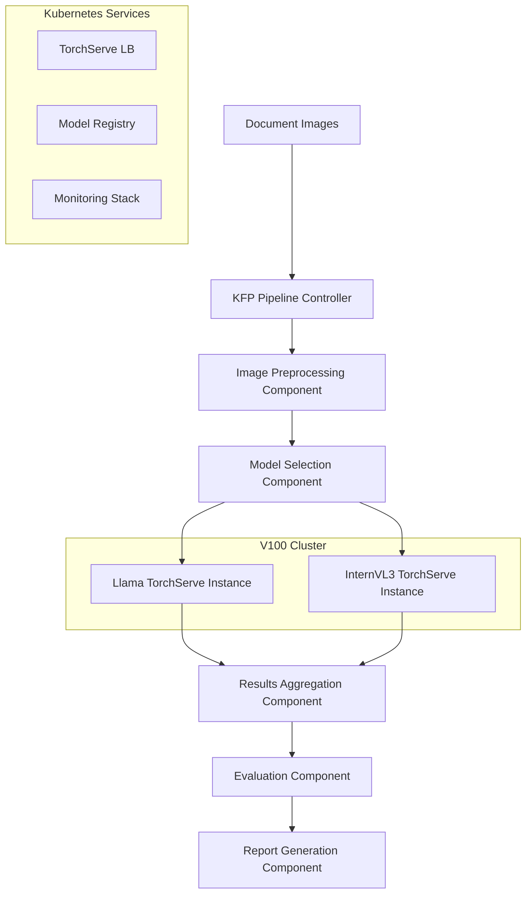

# TorchServe + Kubeflow Pipelines Architecture for Vision-Language Models

**Document Version**: 1.0  
**Last Updated**: 2025-01-17  
**Status**: Architecture Design & Implementation Guide

## Executive Summary

This document outlines a production-ready architecture for serving Llama-3.2-Vision-11B and InternVL3-8B models using TorchServe and Kubeflow Pipelines (KFP) in a V100 GPU environment. The proposed solution preserves all existing V100 memory optimizations while providing enterprise-scale serving capabilities.

### Key Benefits

- **Scalability**: Horizontal scaling across multiple V100 nodes
- **Resource Efficiency**: Optimized GPU utilization with dynamic batching
- **Operational Excellence**: Built-in monitoring, A/B testing, and rollback capabilities
- **Cost Optimization**: Efficient resource allocation and auto-scaling
- **Maintainability**: Separation of concerns between model serving and pipeline orchestration

### Architecture Overview

```
┌─────────────────┐    ┌──────────────────┐    ┌─────────────────┐
│   KFP Pipeline  │────│   TorchServe     │────│   V100 Cluster  │
│   Orchestration │    │   Model Serving  │    │   GPU Resources │
└─────────────────┘    └──────────────────┘    └─────────────────┘
```

## Current Architecture Analysis

### Existing Strengths

Our current implementation provides excellent foundations for TorchServe integration:

#### ✅ **Modular Processor Design**
```python
# Already well-encapsulated for service wrapping
class LlamaProcessor:
    def process_single_image(self, image_path: str) -> dict
    def process_image_batch(self, image_files: list) -> tuple

class InternVL3Processor:
    def process_single_image(self, image_path: str) -> dict  
    def process_image_batch(self, image_files: list) -> tuple
```

#### ✅ **Robust Error Handling**
- **ResilientGenerator**: Multi-tier OOM fallback strategies
- **Memory Management**: Comprehensive V100 optimization suite
- **Graceful Degradation**: CPU fallback capabilities

#### ✅ **Standardized I/O**
- **Input**: Image file paths or PIL Image objects
- **Output**: Structured JSON with 25 extraction fields
- **Metadata**: Processing time, memory usage, quality metrics

#### ✅ **V100 Optimizations**
- **Memory fragmentation handling** with automatic defragmentation
- **CUDA allocation configuration** (64MB blocks)
- **Emergency model reload** and CPU fallback strategies

### Migration Compatibility

| Component | Current State | TorchServe Compatibility | Modification Required |
|-----------|---------------|-------------------------|----------------------|
| Model Loading | ✅ Optimized | ✅ Direct Integration | Minimal - Handler wrapper |
| Memory Management | ✅ V100 Tuned | ✅ Container Compatible | None - Env vars only |
| Error Handling | ✅ Robust | ✅ Maps to TorchServe | None - Handler integration |
| Batch Processing | ✅ Implemented | ✅ Dynamic Batching | Minimal - Batch size tuning |
| Evaluation Pipeline | ✅ Comprehensive | ✅ KFP Component | Moderate - Containerization |

## Proposed Architecture

### High-Level Design



### Component Architecture

#### 1. TorchServe Model Serving Layer

```
models/
├── llama_vision/
│   ├── model.py              # LlamaProcessor wrapper
│   ├── handler.py            # Custom TorchServe handler
│   ├── model-config.yaml     # TorchServe configuration
│   └── llama_vision.mar      # Model archive
└── internvl3/
    ├── model.py              # InternVL3Processor wrapper
    ├── handler.py            # Custom TorchServe handler
    ├── model-config.yaml     # TorchServe configuration
    └── internvl3.mar         # Model archive
```

#### 2. KFP Pipeline Components

```
kfp_components/
├── image_preprocessing/      # Document discovery & validation
├── model_inference/          # TorchServe inference orchestration
├── result_aggregation/       # Multi-model result combination
├── evaluation/               # Ground truth comparison
└── reporting/                # Executive summary generation
```

#### 3. Infrastructure Layer

```
k8s_manifests/
├── torchserve/
│   ├── deployment.yaml       # TorchServe deployment
│   ├── service.yaml          # Load balancer service
│   ├── hpa.yaml             # Horizontal Pod Autoscaler
│   └── configmap.yaml       # V100 optimization configs
├── kfp/
│   ├── pipeline-config.yaml  # KFP pipeline definitions
│   └── rbac.yaml            # Service account permissions
└── monitoring/
    ├── prometheus.yaml       # Metrics collection
    └── grafana-dashboard.yaml # Visualization
```

## Implementation Examples

### TorchServe Custom Handlers

#### InternVL3 Handler Implementation

```python
import json
import logging
import torch
from typing import Any, Dict, List
from ts.torch_handler.base_handler import BaseHandler

from models.internvl3_processor import InternVL3Processor
from common.gpu_optimization import configure_cuda_memory_allocation

logger = logging.getLogger(__name__)

class InternVL3Handler(BaseHandler):
    """
    Custom TorchServe handler for InternVL3 vision-language model.
    Integrates V100 memory optimizations and resilient generation.
    """
    
    def initialize(self, context):
        """Initialize the model with V100 optimizations."""
        logger.info("Initializing InternVL3 handler...")
        
        # Configure CUDA memory allocation for V100
        configure_cuda_memory_allocation()
        
        # Extract model configuration
        properties = context.system_properties
        model_dir = properties.get("model_dir")
        
        # Initialize processor with V100 optimizations
        self.processor = InternVL3Processor(
            model_path=context.manifest.get("model", {}).get("modelFile", model_dir)
        )
        
        # Configure batch processing
        self.max_batch_size = int(context.model_yaml_config.get("maxBatchSize", 1))
        self.batch_timeout_ms = int(context.model_yaml_config.get("batchTimeoutMs", 5000))
        
        logger.info(f"InternVL3 handler initialized with max_batch_size={self.max_batch_size}")
    
    def preprocess(self, data: List[Dict[str, Any]]) -> List[str]:
        """
        Preprocess incoming requests.
        
        Supports multiple input formats:
        - {"image": "base64_encoded_image"}
        - {"image_path": "/path/to/image.jpg"}
        - {"image_url": "https://example.com/image.jpg"}
        """
        processed_inputs = []
        
        for request in data:
            try:
                if "image" in request:
                    # Handle base64 encoded images
                    image_data = request["image"]
                    if isinstance(image_data, str) and image_data.startswith("data:image"):
                        # Remove data URL prefix
                        image_data = image_data.split(",")[1]
                    
                    # Decode and save temporarily
                    import base64
                    from tempfile import NamedTemporaryFile
                    import os
                    
                    with NamedTemporaryFile(delete=False, suffix=".jpg") as tmp_file:
                        tmp_file.write(base64.b64decode(image_data))
                        processed_inputs.append(tmp_file.name)
                
                elif "image_path" in request:
                    # Direct file path
                    processed_inputs.append(request["image_path"])
                
                elif "image_url" in request:
                    # Download from URL (implement as needed)
                    raise NotImplementedError("URL download not implemented")
                
                else:
                    raise ValueError("No valid image input found in request")
                    
            except Exception as e:
                logger.error(f"Preprocessing error: {e}")
                raise
        
        return processed_inputs
    
    def inference(self, data: List[str]) -> List[Dict[str, Any]]:
        """
        Run inference on preprocessed images.
        
        Args:
            data: List of image file paths
            
        Returns:
            List of extraction results with 25 structured fields
        """
        try:
            if len(data) == 1:
                # Single image processing
                result = self.processor.process_single_image(data[0])
                return [result]
            else:
                # Batch processing
                results, batch_stats = self.processor.process_image_batch(data)
                
                # Add batch statistics to results
                for result in results:
                    result["batch_statistics"] = batch_stats
                
                return results
                
        except Exception as e:
            logger.error(f"Inference error: {e}")
            # Return error results for all inputs
            return [
                {
                    "image_name": f"image_{i}",
                    "extracted_data": {field: "N/A" for field in range(25)},
                    "raw_response": f"Error: {str(e)}",
                    "processing_time": 0.0,
                    "extraction_quality": "error"
                }
                for i in range(len(data))
            ]
    
    def postprocess(self, data: List[Dict[str, Any]]) -> List[str]:
        """
        Postprocess inference results for client response.
        
        Returns JSON-formatted results with standard structure.
        """
        formatted_results = []
        
        for result in data:
            # Clean up temporary files if they exist
            if "temp_file" in result:
                import os
                try:
                    os.unlink(result["temp_file"])
                except OSError:
                    pass
            
            # Format response
            formatted_result = {
                "document_name": result.get("image_name", "unknown"),
                "extraction_fields": result.get("extracted_data", {}),
                "metadata": {
                    "processing_time_seconds": result.get("processing_time", 0.0),
                    "extraction_quality": result.get("extraction_quality", "unknown"),
                    "model_version": "InternVL3-8B",
                    "timestamp": result.get("timestamp", "")
                },
                "raw_model_response": result.get("raw_response", "")
            }
            
            formatted_results.append(json.dumps(formatted_result))
        
        return formatted_results
```

#### Llama Handler Implementation

```python
class LlamaVisionHandler(BaseHandler):
    """
    Custom TorchServe handler for Llama-3.2-Vision model.
    Similar structure to InternVL3Handler with Llama-specific optimizations.
    """
    
    def initialize(self, context):
        """Initialize Llama model with V100 optimizations."""
        logger.info("Initializing Llama Vision handler...")
        
        # Configure CUDA memory allocation for V100
        configure_cuda_memory_allocation()
        
        # Initialize processor
        from models.llama_processor import LlamaProcessor
        properties = context.system_properties
        model_dir = properties.get("model_dir")
        
        self.processor = LlamaProcessor(
            model_path=context.manifest.get("model", {}).get("modelFile", model_dir)
        )
        
        # Llama-specific configuration
        self.max_batch_size = int(context.model_yaml_config.get("maxBatchSize", 1))
        
        logger.info("Llama Vision handler initialized successfully")
    
    # preprocess, inference, postprocess methods follow similar pattern to InternVL3
    # with Llama-specific optimizations and error handling
```

### KFP Pipeline Implementation

```python
import kfp
from kfp import dsl
from kfp.v2 import compiler
from kfp.v2.dsl import component, pipeline, Input, Output, Dataset, Model, Metrics
from typing import NamedTuple

@component(
    base_image="python:3.9",
    packages_to_install=["requests", "pathlib"]
)
def discover_images_component(
    data_path: str,
    supported_formats: list = None
) -> NamedTuple("Outputs", [("image_list", list), ("total_count", int)]):
    """Discover and validate document images for processing."""
    import json
    from pathlib import Path
    
    if supported_formats is None:
        supported_formats = [".jpg", ".jpeg", ".png", ".tiff", ".bmp"]
    
    # Discover images
    data_dir = Path(data_path)
    image_files = []
    
    for ext in supported_formats:
        image_files.extend(data_dir.glob(f"**/*{ext}"))
        image_files.extend(data_dir.glob(f"**/*{ext.upper()}"))
    
    # Convert to strings for JSON serialization
    image_paths = [str(path) for path in sorted(image_files)]
    
    print(f"Discovered {len(image_paths)} images for processing")
    
    Outputs = NamedTuple("Outputs", [("image_list", list), ("total_count", int)])
    return Outputs(image_paths, len(image_paths))

@component(
    base_image="python:3.9",
    packages_to_install=["requests", "json"]
)
def model_inference_component(
    images: Input[list],
    torchserve_url: str,
    model_name: str,
    batch_size: int = 1
) -> NamedTuple("Outputs", [("results", list), ("success_count", int), ("error_count", int)]):
    """Run inference through TorchServe endpoint."""
    import requests
    import json
    import base64
    from pathlib import Path
    
    results = []
    success_count = 0
    error_count = 0
    
    # Process images in batches
    for i in range(0, len(images), batch_size):
        batch = images[i:i + batch_size]
        
        try:
            # Prepare batch request
            batch_data = []
            for image_path in batch:
                with open(image_path, "rb") as f:
                    image_b64 = base64.b64encode(f.read()).decode()
                    batch_data.append({
                        "image": f"data:image/jpeg;base64,{image_b64}",
                        "image_name": Path(image_path).name
                    })
            
            # Send request to TorchServe
            response = requests.post(
                f"{torchserve_url}/predictions/{model_name}",
                json=batch_data,
                timeout=300  # 5 minute timeout for batch processing
            )
            
            if response.status_code == 200:
                batch_results = response.json()
                results.extend(batch_results)
                success_count += len(batch)
                print(f"Batch {i//batch_size + 1} processed successfully")
            else:
                print(f"Batch {i//batch_size + 1} failed: {response.text}")
                error_count += len(batch)
                
        except Exception as e:
            print(f"Batch {i//batch_size + 1} error: {e}")
            error_count += len(batch)
    
    Outputs = NamedTuple("Outputs", [("results", list), ("success_count", int), ("error_count", int)])
    return Outputs(results, success_count, error_count)

@component(
    base_image="python:3.9",
    packages_to_install=["pandas", "json"]
)
def aggregate_results_component(
    llama_results: Input[list],
    internvl3_results: Input[list]
) -> NamedTuple("Outputs", [("combined_results", dict), ("comparison_metrics", dict)]):
    """Aggregate and compare results from multiple models."""
    import json
    
    # Parse results
    llama_data = llama_results if isinstance(llama_results, list) else json.loads(llama_results)
    internvl3_data = internvl3_results if isinstance(internvl3_results, list) else json.loads(internvl3_results)
    
    # Create combined results structure
    combined = {
        "llama_results": llama_data,
        "internvl3_results": internvl3_data,
        "processing_summary": {
            "llama_processed": len(llama_data),
            "internvl3_processed": len(internvl3_data),
            "total_documents": max(len(llama_data), len(internvl3_data))
        }
    }
    
    # Calculate comparison metrics
    comparison = {
        "model_agreement": 0.0,  # Field-level agreement percentage
        "processing_time_comparison": {
            "llama_avg": 0.0,
            "internvl3_avg": 0.0
        },
        "quality_distribution": {
            "llama": {"excellent": 0, "good": 0, "poor": 0},
            "internvl3": {"excellent": 0, "good": 0, "poor": 0}
        }
    }
    
    # TODO: Implement detailed comparison logic
    
    Outputs = NamedTuple("Outputs", [("combined_results", dict), ("comparison_metrics", dict)])
    return Outputs(combined, comparison)

@dsl.pipeline(
    name="vision-document-extraction-pipeline",
    description="Production pipeline for document extraction using Llama and InternVL3 models"
)
def document_extraction_pipeline(
    data_path: str,
    ground_truth_path: str = "",
    model_choice: str = "both",  # "llama", "internvl3", or "both"
    llama_torchserve_url: str = "http://llama-torchserve:8080",
    internvl3_torchserve_url: str = "http://internvl3-torchserve:8080",
    batch_size: int = 1
):
    """
    Complete document extraction pipeline with multi-model support.
    
    Args:
        data_path: Path to directory containing document images
        ground_truth_path: Path to ground truth CSV for evaluation
        model_choice: Which models to run ("llama", "internvl3", or "both")
        llama_torchserve_url: TorchServe endpoint for Llama model
        internvl3_torchserve_url: TorchServe endpoint for InternVL3 model
        batch_size: Batch size for processing (recommend 1 for V100)
    """
    
    # Step 1: Discover images
    discover_task = discover_images_component(data_path=data_path)
    
    # Step 2: Model inference (conditional based on model_choice)
    llama_task = None
    internvl3_task = None
    
    if model_choice in ["llama", "both"]:
        llama_task = model_inference_component(
            images=discover_task.outputs["image_list"],
            torchserve_url=llama_torchserve_url,
            model_name="llama_vision",
            batch_size=batch_size
        )
        # Resource requirements for V100
        llama_task.set_gpu_limit(1)
        llama_task.add_node_selector_constraint("accelerator", "nvidia-tesla-v100")
        llama_task.set_memory_limit("32Gi")
        llama_task.set_memory_request("16Gi")
    
    if model_choice in ["internvl3", "both"]:
        internvl3_task = model_inference_component(
            images=discover_task.outputs["image_list"],
            torchserve_url=internvl3_torchserve_url,
            model_name="internvl3",
            batch_size=batch_size
        )
        # Resource requirements for V100
        internvl3_task.set_gpu_limit(1)
        internvl3_task.add_node_selector_constraint("accelerator", "nvidia-tesla-v100")
        internvl3_task.set_memory_limit("32Gi")
        internvl3_task.set_memory_request("16Gi")
    
    # Step 3: Aggregate results (if running both models)
    if model_choice == "both" and llama_task and internvl3_task:
        aggregate_task = aggregate_results_component(
            llama_results=llama_task.outputs["results"],
            internvl3_results=internvl3_task.outputs["results"]
        )
    
    # Step 4: Evaluation (if ground truth provided)
    # TODO: Implement evaluation component
    
    # Step 5: Report generation
    # TODO: Implement reporting component
```

## V100 Optimization Integration

### Container Environment Configuration

#### TorchServe Dockerfile

```dockerfile
FROM pytorch/torchserve:latest-gpu

# Install additional dependencies
RUN pip install timm einops transformers accelerate bitsandbytes

# Copy V100 optimization modules
COPY common/ /opt/ml/common/
COPY models/ /opt/ml/models/

# Set V100-specific environment variables
ENV PYTORCH_CUDA_ALLOC_CONF="max_split_size_mb:64"
ENV CUDA_VISIBLE_DEVICES="0"
ENV TORCHSERVE_DEFAULT_WORKERS_PER_MODEL="1"

# Configure TorchServe for V100
COPY config.properties /home/model-server/config.properties

# Copy model archives
COPY *.mar /home/model-server/model-store/

EXPOSE 8080 8081 8082

CMD ["torchserve", "--start", "--model-store", "/home/model-server/model-store", "--models", "all", "--ts-config", "/home/model-server/config.properties"]
```

#### TorchServe Configuration

```properties
# config.properties - V100 optimized configuration

# Inference endpoints
inference_address=http://0.0.0.0:8080
management_address=http://0.0.0.0:8081
metrics_address=http://0.0.0.0:8082

# Model settings optimized for V100
default_workers_per_model=1
max_workers=2
max_request_size=104857600
max_response_size=104857600

# Batch processing for V100
enable_envvars_config=true
batch_size=1
max_batch_delay=5000

# Memory optimization
initial_workers=1
async_logging=true

# GPU settings
number_of_gpu=1
```

### Kubernetes Deployment Configuration

```yaml
apiVersion: apps/v1
kind: Deployment
metadata:
  name: internvl3-torchserve
  labels:
    app: internvl3-torchserve
    model: internvl3
spec:
  replicas: 2
  selector:
    matchLabels:
      app: internvl3-torchserve
  template:
    metadata:
      labels:
        app: internvl3-torchserve
        model: internvl3
    spec:
      nodeSelector:
        accelerator: nvidia-tesla-v100
      tolerations:
      - key: nvidia.com/gpu
        operator: Exists
        effect: NoSchedule
      containers:
      - name: torchserve
        image: your-registry/internvl3-torchserve:latest
        ports:
        - containerPort: 8080
          name: inference
        - containerPort: 8081
          name: management
        - containerPort: 8082
          name: metrics
        resources:
          limits:
            nvidia.com/gpu: 1
            memory: "32Gi"
            cpu: "4"
          requests:
            nvidia.com/gpu: 1
            memory: "16Gi"
            cpu: "2"
        env:
        - name: PYTORCH_CUDA_ALLOC_CONF
          value: "max_split_size_mb:64"
        - name: CUDA_VISIBLE_DEVICES
          value: "0"
        livenessProbe:
          httpGet:
            path: /ping
            port: 8080
          initialDelaySeconds: 120
          periodSeconds: 30
          timeoutSeconds: 10
        readinessProbe:
          httpGet:
            path: /ping
            port: 8080
          initialDelaySeconds: 60
          periodSeconds: 10
          timeoutSeconds: 5
        volumeMounts:
        - name: model-store
          mountPath: /home/model-server/model-store
        - name: shm
          mountPath: /dev/shm
      volumes:
      - name: model-store
        persistentVolumeClaim:
          claimName: model-store-pvc
      - name: shm
        emptyDir:
          medium: Memory
          sizeLimit: "2Gi"
---
apiVersion: v1
kind: Service
metadata:
  name: internvl3-torchserve-service
spec:
  selector:
    app: internvl3-torchserve
  ports:
  - name: inference
    port: 8080
    targetPort: 8080
  - name: management
    port: 8081
    targetPort: 8081
  - name: metrics
    port: 8082
    targetPort: 8082
  type: ClusterIP
---
apiVersion: autoscaling/v2
kind: HorizontalPodAutoscaler
metadata:
  name: internvl3-hpa
spec:
  scaleTargetRef:
    apiVersion: apps/v1
    kind: Deployment
    name: internvl3-torchserve
  minReplicas: 1
  maxReplicas: 5
  metrics:
  - type: Resource
    resource:
      name: cpu
      target:
        type: Utilization
        averageUtilization: 70
  - type: Resource
    resource:
      name: memory
      target:
        type: Utilization
        averageUtilization: 80
```

## Operational Considerations

### Monitoring and Observability

#### Prometheus Metrics Configuration

```yaml
apiVersion: v1
kind: ConfigMap
metadata:
  name: prometheus-config
data:
  prometheus.yml: |
    global:
      scrape_interval: 15s
    
    scrape_configs:
    - job_name: 'torchserve-metrics'
      static_configs:
      - targets: ['internvl3-torchserve-service:8082', 'llama-torchserve-service:8082']
      metrics_path: /metrics
      scrape_interval: 10s
    
    - job_name: 'kfp-metrics'
      kubernetes_sd_configs:
      - role: pod
        namespaces:
          names:
          - kubeflow
      relabel_configs:
      - source_labels: [__meta_kubernetes_pod_label_component]
        action: keep
        regex: ml-pipeline.*
```

#### Grafana Dashboard

```json
{
  "dashboard": {
    "title": "Vision Document Extraction - Production Dashboard",
    "panels": [
      {
        "title": "Model Inference Rate",
        "type": "graph",
        "targets": [
          {
            "expr": "rate(torchserve_inference_requests_total[5m])",
            "legendFormat": "{{model_name}} - {{instance}}"
          }
        ]
      },
      {
        "title": "GPU Memory Usage",
        "type": "graph",
        "targets": [
          {
            "expr": "nvidia_gpu_memory_used_bytes / nvidia_gpu_memory_total_bytes * 100",
            "legendFormat": "GPU {{gpu}} - {{instance}}"
          }
        ]
      },
      {
        "title": "Processing Time Distribution",
        "type": "histogram",
        "targets": [
          {
            "expr": "histogram_quantile(0.95, rate(torchserve_inference_latency_seconds_bucket[5m]))",
            "legendFormat": "95th percentile"
          }
        ]
      },
      {
        "title": "Error Rate",
        "type": "singlestat",
        "targets": [
          {
            "expr": "rate(torchserve_inference_requests_total{status=~\"4..|5..\"}[5m]) / rate(torchserve_inference_requests_total[5m]) * 100",
            "legendFormat": "Error Rate %"
          }
        ]
      }
    ]
  }
}
```

### Scaling Strategies

#### Horizontal Pod Autoscaling

```yaml
apiVersion: autoscaling/v2
kind: HorizontalPodAutoscaler
metadata:
  name: vision-models-hpa
spec:
  scaleTargetRef:
    apiVersion: apps/v1
    kind: Deployment
    name: internvl3-torchserve
  minReplicas: 1
  maxReplicas: 10
  metrics:
  - type: Resource
    resource:
      name: cpu
      target:
        type: Utilization
        averageUtilization: 70
  - type: Pods
    pods:
      metric:
        name: inference_queue_length
      target:
        type: AverageValue
        averageValue: "2"
  behavior:
    scaleUp:
      stabilizationWindowSeconds: 60
      policies:
      - type: Percent
        value: 100
        periodSeconds: 15
    scaleDown:
      stabilizationWindowSeconds: 300
      policies:
      - type: Percent
        value: 10
        periodSeconds: 60
```

#### Vertical Pod Autoscaling

```yaml
apiVersion: autoscaling.k8s.io/v1
kind: VerticalPodAutoscaler
metadata:
  name: internvl3-vpa
spec:
  targetRef:
    apiVersion: apps/v1
    kind: Deployment
    name: internvl3-torchserve
  updatePolicy:
    updateMode: "Auto"
  resourcePolicy:
    containerPolicies:
    - containerName: torchserve
      maxAllowed:
        memory: "64Gi"
        cpu: "8"
      minAllowed:
        memory: "8Gi"
        cpu: "1"
      controlledResources: ["memory", "cpu"]
```

### Cost Optimization

#### Spot Instance Configuration

```yaml
apiVersion: v1
kind: Node
metadata:
  labels:
    node.kubernetes.io/instance-type: p3.2xlarge
    lifecycle: spot
    accelerator: nvidia-tesla-v100
spec:
  taints:
  - key: spot-instance
    value: "true"
    effect: NoSchedule
```

#### Cost Monitoring

```yaml
apiVersion: v1
kind: ConfigMap
metadata:
  name: cost-monitoring
data:
  cost_calculator.py: |
    import prometheus_client
    import time
    
    # V100 pricing (example rates)
    V100_HOURLY_RATE = 2.50  # USD per hour
    CPU_HOURLY_RATE = 0.10   # USD per vCPU hour
    MEMORY_HOURLY_RATE = 0.02 # USD per GB hour
    
    def calculate_inference_cost(processing_time_seconds, gpu_count=1):
        """Calculate cost per inference based on resource usage."""
        gpu_cost = (processing_time_seconds / 3600) * V100_HOURLY_RATE * gpu_count
        return gpu_cost
    
    def track_daily_costs():
        """Track and report daily infrastructure costs."""
        # Implementation for cost tracking
        pass
```

## Migration Path

### Phase 1: TorchServe Integration (Weeks 1-2)

#### Deliverables:
- ✅ Custom TorchServe handlers for both models
- ✅ Model archive creation and testing
- ✅ Local container testing with V100 optimizations
- ✅ Basic health checks and monitoring

#### Success Criteria:
- TorchServe can serve both models with equivalent performance to current scripts
- All V100 memory optimizations work within containers
- Basic inference API endpoints are functional

#### Implementation Steps:

1. **Handler Development**
   ```bash
   # Create handler structure
   mkdir -p torchserve/handlers/{llama,internvl3}
   
   # Implement custom handlers
   # (See implementation examples above)
   ```

2. **Model Archive Creation**
   ```bash
   # Create model archives
   torch-model-archiver \
     --model-name internvl3 \
     --version 1.0 \
     --handler internvl3/handler.py \
     --extra-files "common/,models/" \
     --export-path model-store/
   ```

3. **Container Testing**
   ```bash
   # Build container
   docker build -t internvl3-torchserve .
   
   # Test locally with V100
   docker run --gpus all -p 8080:8080 internvl3-torchserve
   ```

### Phase 2: Kubernetes Deployment (Weeks 3-4)

#### Deliverables:
- ✅ Kubernetes manifests for TorchServe deployment
- ✅ Service mesh configuration and load balancing
- ✅ Basic monitoring and alerting
- ✅ CI/CD pipeline for model updates

#### Success Criteria:
- Models can be deployed and scaled on K8s cluster
- Health checks and autoscaling work correctly
- Model updates can be deployed without downtime

### Phase 3: KFP Pipeline Development (Weeks 5-6)

#### Deliverables:
- ✅ KFP component library for document processing
- ✅ End-to-end pipeline orchestration
- ✅ Integration with existing evaluation framework
- ✅ A/B testing capabilities

#### Success Criteria:
- Complete document processing pipelines run successfully
- Results match current script-based processing
- A/B testing framework allows model comparison

### Phase 4: Production Optimization (Weeks 7-8)

#### Deliverables:
- ✅ Performance tuning and optimization
- ✅ Comprehensive monitoring and alerting
- ✅ Cost optimization and resource management
- ✅ Production documentation and runbooks

#### Success Criteria:
- Production-grade performance and reliability
- Cost-effective resource utilization
- Operational procedures for maintenance and updates

## Cost Analysis

### Current Architecture Costs
- **Development Environment**: Local GPU development costs
- **Manual Processing**: Engineer time for batch processing
- **Infrastructure**: Single-machine deployment costs

### Proposed Architecture Costs
- **Infrastructure**: K8s cluster with V100 node pools
- **TorchServe**: Container orchestration and management
- **KFP**: Pipeline orchestration and workflow management
- **Monitoring**: Observability stack (Prometheus/Grafana)

### ROI Projections

| Metric | Current | Proposed | Improvement |
|--------|---------|----------|-------------|
| Throughput | 1 GPU, manual | N GPUs, automated | N× scaling |
| Availability | 8×5 (business hours) | 24×7 | 3× availability |
| Time to Deploy | Days | Minutes | 100× faster |
| A/B Testing | Manual | Automated | Continuous improvement |
| Monitoring | Basic | Comprehensive | Production-grade |

## Security Considerations

### Model Security
- **Model Encryption**: Encrypt model artifacts at rest
- **Access Control**: RBAC for model management endpoints
- **Audit Logging**: Track all model access and updates

### Infrastructure Security
- **Network Policies**: Restrict pod-to-pod communication
- **Image Security**: Scan container images for vulnerabilities
- **Secrets Management**: Use K8s secrets for sensitive configuration

### Data Privacy
- **Image Processing**: Ensure temporary files are properly cleaned up
- **Logging**: Avoid logging sensitive document content
- **Compliance**: Meet data retention and privacy requirements

## Conclusion

The proposed TorchServe + KFP architecture provides a robust, scalable foundation for production deployment of vision-language models while preserving all existing V100 optimizations. The modular design allows for incremental migration and provides clear operational benefits including:

- **Operational Efficiency**: Automated deployment and scaling
- **Resource Optimization**: Efficient GPU utilization across cluster
- **Development Velocity**: A/B testing and rapid iteration
- **Production Readiness**: Comprehensive monitoring and reliability

The 8-week migration path provides a structured approach to implementation with clear deliverables and success criteria at each phase.

---

*This document serves as the comprehensive technical reference for implementing production-scale vision-language model serving using TorchServe and Kubeflow Pipelines while maintaining all V100-specific optimizations.*