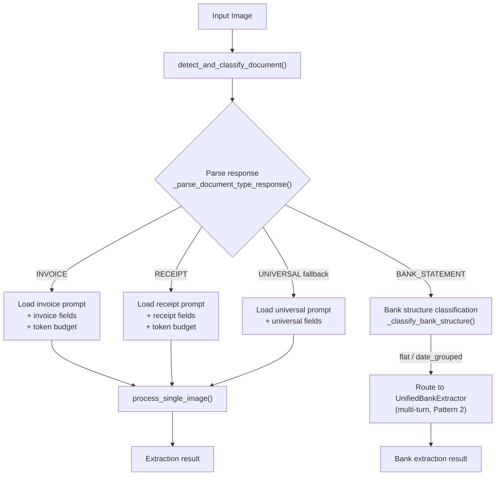
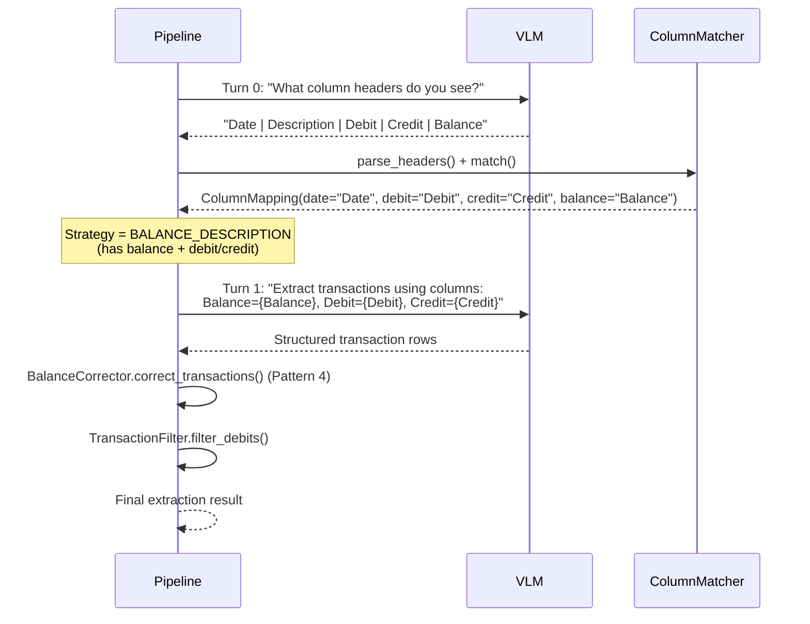
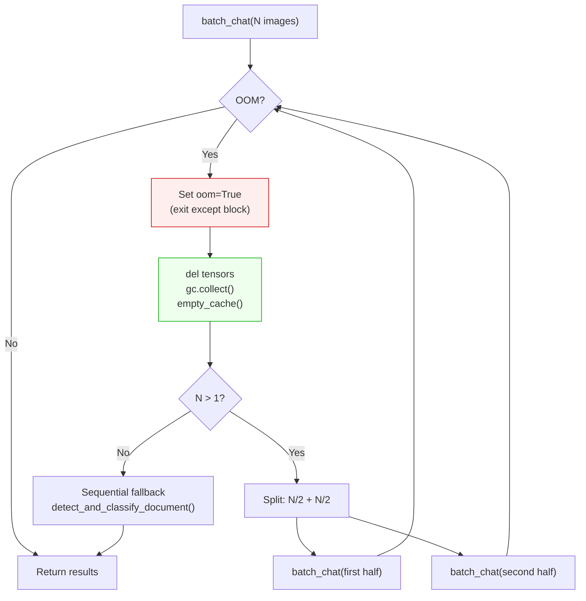
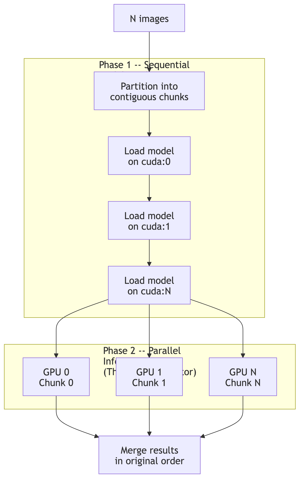
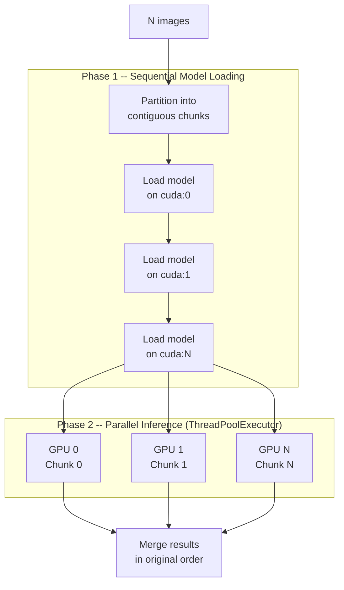
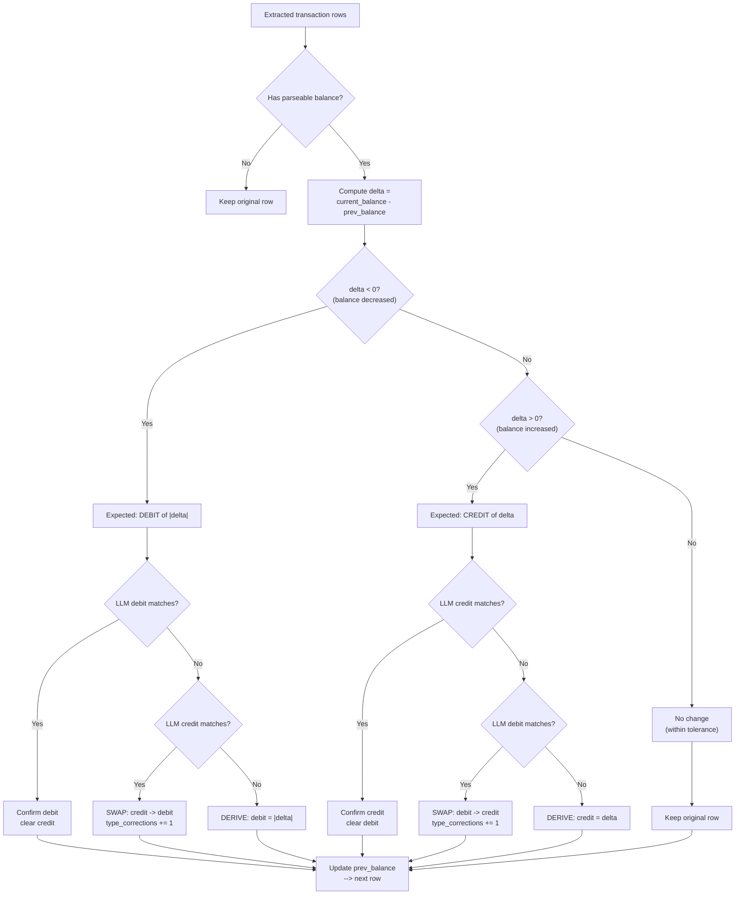
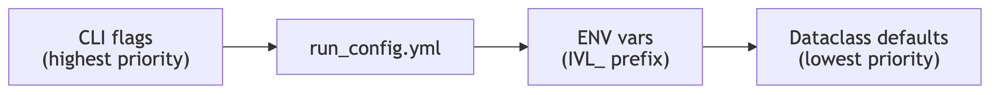
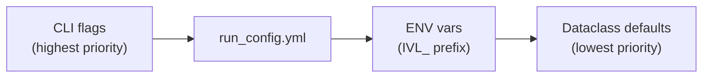

# Agentic Document Extraction: Architecture & Methodology

## What We Built

A document extraction pipeline that uses **InternVL3.5-8B** (0.3B vision encoder + 8.2B language model) to pull structured fields from scanned business documents — invoices, receipts, bank statements, travel expenses, vehicle logbooks. The system processes documents end-to-end: classify, extract, and evaluate against ground truth.

What makes it interesting is not the model — it's how the pipeline wraps the model in **agentic control loops** that make it behave more intelligently than any single prompt could.

## Why "Agentic" Is the Right Lens

Every architectural choice in this pipeline follows the same pattern:

> **Observe** something (a classification, a column layout, an OOM error, a balance mismatch)
> **Reason** about it (map to a strategy, halve a batch, compute a delta)
> **Act** accordingly (route to a prompt, retry, correct a value)

The VLM is not a black box that receives an image and returns JSON. It is a component inside feedback loops — its outputs drive pipeline decisions, and those decisions determine what the model sees next. This is what separates "run a prompt" from "run an agent."

Four patterns implement this today:

| # | Pattern | Observe | Act |
| - | ------- | ------- | --- |
| 1 | Dynamic Routing | Document classification | Select type-specific prompt, fields, token budget |
| 2 | Multi-Turn Bank Extraction | Column headers (Turn 0) | Template Turn 1 prompt with detected column names |
| 3 | Self-Correcting OOM Fallback | CUDA OutOfMemoryError | Recursively halve batch, retry |
| 4 | Balance Self-Verification | Extracted values vs balance column | Swap or derive correct debit/credit |

---

## Pattern 1: Dynamic Routing (Detect-then-Route)

The pipeline never runs a generic "extract everything" prompt. A lightweight detection call classifies the document first, and the classification output selects everything downstream.

### The observe-reason-act loop

**Observe**: Send the image with a short detection prompt. The VLM returns a free-text classification.

```text
What type of business document is this?

Answer with one of:
- INVOICE (includes bills, quotes, estimates)
- RECEIPT (includes purchase receipts)
- BANK_STATEMENT (includes credit card statements)
- TRAVEL_EXPENSE (includes boarding passes, airline tickets)
- VEHICLE_LOGBOOK (includes motor vehicle logbooks, mileage logs)
```

Generation is cheap — greedy decoding, `max_new_tokens=200`, `temperature=0.1`.

**Reason**: The raw response is resolved to a canonical type through a three-stage cascade:

1. **Exact substring match** against `type_mappings` from YAML (e.g., `"credit card statement"` -> `BANK_STATEMENT`)
2. **Keyword fallback** via `fallback_keywords` per type
3. **Default**: `UNIVERSAL` (configurable via `settings.fallback_type`)

**Act**: The canonical type drives four downstream decisions:

| What | How | Code ref |
| ---- | --- | -------- |
| Extraction prompt | Looked up in `prompt_config["extraction_files"]` per type | `base_processor.py:363` |
| Field list | Loaded from `field_definitions.yaml` for that type | `base_processor.py:414` |
| Token budget | `_calculate_max_tokens()` scales with field count | `base_processor.py:418` |
| Processing path | `BANK_STATEMENT` routes to multi-turn extractor (Pattern 2) | `base_processor.py:353` |


<details>
<summary>Mermaid source</summary>



</details>

### Why this matters

The detection call is not a preprocessing step done by a separate classifier — it is the *same VLM* making an observation that the pipeline uses to decide what to do next. The model's first output literally selects its own second prompt. This is the simplest agentic pattern: one model call parameterizes another.

### What each document type extracts

| Type | Fields | Examples |
| ---- | ------ | -------- |
| INVOICE (14 fields) | ABN, supplier, payer, dates, line items, GST, totals | `BUSINESS_ABN: 12345678901`, `TOTAL_AMOUNT: $85.00` |
| RECEIPT (14 fields) | Same schema as invoice | Transaction date in `INVOICE_DATE` |
| TRAVEL_EXPENSE (9 fields) | Passenger, mode, route, travel dates, GST, total | `TRAVEL_MODE: plane`, `TRAVEL_ROUTE: SYD\|MEL` |
| VEHICLE_LOGBOOK (16 fields) | Vehicle details, odometer, km, business % | `BUSINESS_USE_PERCENTAGE: 0.65` |
| BANK_STATEMENT (5 fields) | Date range, descriptions, dates, amounts | Via multi-turn (Pattern 2) |

For standard documents (non-bank), extraction is single-turn: image + type-specific prompt -> structured `KEY: value` response. The prompt instructs the model to return `NOT_FOUND` for missing fields — a sentinel the evaluation layer handles explicitly.

---

## Pattern 2: Multi-Turn Bank Extraction (Observe-Reason-Act)

Bank statements are the hardest document type. Column layouts vary wildly across financial institutions — some have separate Debit/Credit columns, others use a signed Amount column, some include a running Balance, some don't. A single prompt cannot handle this diversity.

### The observe-reason-act loop

**Observe (Turn 0)**: Ask the VLM what column headers it sees.

```text
"List the exact column headers from the transaction table"
```

The model returns something like `"Date, Description, Debit, Credit, Balance"`.

**Reason**: `ColumnMatcher.match()` maps each detected header to a semantic role using pattern matching against `bank_column_patterns.yaml`. The resulting `ColumnMapping` determines the extraction strategy:

| Columns detected | Strategy selected |
| ---------------- | ----------------- |
| balance + debit/credit | `BALANCE_DESCRIPTION` — richest signal, enables Pattern 4 |
| balance + amount (no debit/credit) | `AMOUNT_DESCRIPTION` — signed amounts, negative = withdrawal |
| debit/credit (no balance) | `DEBIT_CREDIT_DESCRIPTION` — direct extraction |
| none of the above | `TABLE_EXTRACTION` — generic schema fallback |

**Act (Turn 1)**: The extraction prompt is templated with the *actual detected column names*:

```python
prompt = prompt_template.format(
    balance_col=mapping.balance,        # e.g., "Balance"
    desc_col=mapping.description,       # e.g., "Description"
    debit_col=mapping.debit or "Debit",
    credit_col=mapping.credit or "Credit",
)
```

This makes every extraction prompt document-specific. The model is told to look for "Balance" because Turn 0 confirmed that column exists — not because we assumed it would.


<details>
<summary>Mermaid source</summary>



</details>

### Why multi-turn beats single-turn

| Challenge | Single-turn problem | Multi-turn solution |
| --------- | ------------------- | ------------------- |
| Variable column layouts | Model guesses column semantics | Turn 0 detects actual headers |
| Debit vs credit ambiguity | Misclassified transaction direction | Strategy-specific prompts with column names |
| Long transaction tables | Truncated output | Dedicated extraction turn with 4096 token budget |
| Balance column presence | One prompt can't handle all formats | Strategy adapts to what's actually there |

---

## Pattern 3: Self-Correcting OOM Fallback

For non-bank documents, the pipeline supports **batched inference** — processing multiple images in a single forward pass via InternVL3's `batch_chat()` API. But batches can fail unpredictably: tile counts vary across images, and a batch that fits in VRAM for simple documents may OOM on complex ones.

### The observe-reason-act loop

**Observe**: `torch.cuda.OutOfMemoryError` during `model.batch_chat()`.

**Reason**: The batch is too large for available VRAM. But we don't know which image caused it — so split the batch in half and retry both halves.

**Act**: Recursive halving with GPU cleanup done *outside* the except block:

```python
oom = False
try:
    responses = self.model.batch_chat(...)
except torch.cuda.OutOfMemoryError:
    oom = True  # Flag — exit except ASAP

if oom:
    # Outside except — traceback released, tensors can be freed
    del pixel_values, all_pixel_values, num_patches_list
    gc.collect()
    torch.cuda.empty_cache()

    mid = len(image_paths) // 2
    r1 = self.batch_detect_documents(image_paths[:mid])
    r2 = self.batch_detect_documents(image_paths[mid:])
    return r1 + r2
```

Base case: batch size 1 falls back to sequential `detect_and_classify_document()`.

**Why cleanup must be outside except**: Inside an `except` block, Python's traceback holds references to all intermediate activation tensors from the failed forward pass. `torch.cuda.empty_cache()` inside `except` is a no-op — the tensors are still referenced. Setting `oom = True` and checking after the block closes releases the traceback first.


<details>
<summary>Mermaid source</summary>



</details>

### Batch + multi-GPU architecture

The OOM fallback is one layer of a broader throughput strategy:

**Batched inference** concatenates pixel values from multiple images and passes them through a single forward pass with `num_patches_list` for variable tile counts. Phase 1 (detection) batches all images with the same prompt; Phase 2 (extraction) batches non-bank documents with per-image prompts. Bank statements always run sequentially (multi-turn).

**Multi-GPU parallelism** (`--num-gpus N`) distributes images across GPUs via `MultiGPUOrchestrator`. Each GPU gets an independent model replica. Models are loaded sequentially (to avoid `transformers` import races), then inference runs fully parallel via `ThreadPoolExecutor`. PyTorch releases the GIL during CUDA kernels, so threads give true GPU parallelism without IPC overhead.



<details>
<summary>Mermaid source</summary>



</details>

### Why this is agentic

The pipeline observes a runtime failure (OOM), reasons about the cause (batch too large for available VRAM), and acts by adapting its strategy — all without human intervention. The recursive halving finds the largest batch size that fits, maximizing throughput while guaranteeing completion. Combined with `_resilient_generate()` (3-attempt retry with progressively minimal generation configs), the system self-corrects at multiple levels.

---

## Pattern 4: Balance Arithmetic Self-Verification

After the VLM extracts bank transactions, the pipeline uses an **accounting invariant** to detect and correct misclassified debits and credits. This is the most "agentic" pattern — the system verifies its own work using domain knowledge.

### The invariant

For any consecutive pair of transactions with parseable balances:

```text
balance_delta = current_balance - previous_balance

if delta < 0 --> transaction is a DEBIT  of abs(delta)
if delta > 0 --> transaction is a CREDIT of delta
if delta ~ 0 --> no significant transaction (within tolerance)
```

### The observe-reason-act loop

**Observe**: Walk the extracted transaction rows in chronological order, maintaining a sliding `prev_balance`. For each row, compute `balance_delta = current_balance - prev_balance`.

**Reason**: Compare the delta's sign against the VLM's classification:
- Delta negative but VLM put amount in Credit -> misclassified
- Delta positive but VLM put amount in Debit -> misclassified
- Delta matches the VLM's column -> confirmed correct

**Act**: Three possible corrections:

| Scenario | Action |
| -------- | ------ |
| VLM column matches delta | Confirm; clear the other column |
| VLM put amount in wrong column | **Swap**: move value to correct column |
| Neither column matches expected amount | **Derive**: set from the delta |

The corrector only *swaps* values between columns — it never recalculates amounts from the VLM's raw output. Amounts are derived from the delta only as a last resort.

**Prerequisite**: Balance arithmetic requires chronological ordering. Before correction, the pipeline checks `is_chronological_order()` and calls `sort_by_date()` if reverse-chronological.


<details>
<summary>Mermaid source</summary>



</details>

### Worked example

The VLM extracts:

| Row | Description | Debit | Credit | Balance |
| --- | ----------- | ----- | ------ | ------- |
| 1 | Opening Balance | -- | -- | $1,000.00 |
| 2 | Electric bill | -- | $150.00 | $850.00 |
| 3 | Salary deposit | -- | $2,000.00 | $2,850.00 |

**Row 2**: `delta = 850 - 1000 = -150` (negative = debit). The VLM put $150.00 in *Credit*, but the delta says Debit. **Swap**: move $150.00 to Debit, clear Credit. `type_corrections += 1`.

**Row 3**: `delta = 2850 - 850 = +2000` (positive = credit). The VLM put $2,000.00 in Credit and the delta confirms it. No correction needed.

Corrected output:

| Row | Description | Debit | Credit | Balance |
| --- | ----------- | ----- | ------ | ------- |
| 1 | Opening Balance | -- | -- | $1,000.00 |
| 2 | Electric bill | $150.00 | -- | $850.00 |
| 3 | Salary deposit | -- | $2,000.00 | $2,850.00 |

### Why this matters

The pipeline treats the VLM's extraction as a *hypothesis*, not ground truth. It uses an external invariant (accounting math) to verify and correct the model's output — a form of self-verification that doesn't require another model call. This is the pattern most likely to generalize: any domain with checkable invariants can use post-extraction verification.

---

## Measuring Agentic Quality: Evaluation Methodology

Agentic patterns are only valuable if they improve measurable outcomes. The evaluation pipeline quantifies extraction quality through a deliberate three-layer aggregation.

### Layer 1: Per-Field F1

Each extracted field is compared to ground truth using **position-aware F1**. The comparison method adapts to the field type:

| Field type | Comparison | Score |
| ---------- | ---------- | ----- |
| Single-value (`SUPPLIER_NAME`) | Normalised string match (Levenshtein, ANLS-style, threshold 0.5) | Binary 0.0 or 1.0 |
| Boolean (`IS_GST_INCLUDED`) | Parsed boolean equality | Binary 0.0 or 1.0 |
| Date (`INVOICE_DATE`) | Semantic date comparison (handles format variation) | Binary 0.0 or 1.0 |
| Monetary (`TOTAL_AMOUNT`) | Numeric comparison with 1% tolerance | Binary 0.0 or 1.0 |
| ID (`BUSINESS_ABN`) | Exact match after stripping labels/spaces | Binary 0.0 or 1.0 |
| List (`LINE_ITEM_PRICES`) | Position-aware F1 over pipe-delimited items | Continuous 0.0-1.0 |

For list fields, items must match both **value and position** to count as a true positive:

```text
Precision = TP / (TP + FP)
Recall    = TP / (TP + FN)
F1        = 2 * Precision * Recall / (Precision + Recall)
```

### Layer 2: Per-Image Score

```text
image_score = mean(field_f1_scores)
```

Unweighted arithmetic mean across all fields for that document. Every field counts equally — a list field with 20 transaction items has the same weight as a single-value `SUPPLIER_NAME`.

### Layer 3: Per-Model Score (the Headline Number)

```text
model_score = mean(image_scores)
```

Unweighted arithmetic mean across all images. Every document contributes equally regardless of field count or document type.

### In summary

```text
Headline Score = mean across images of (mean across fields of (position-aware F1 per field))
```

A mean of means, with equal weight per image and equal weight per field within each image.

### Why per-image, not per-field aggregation

This is a deliberate design choice with five justifications:

**1. Operational relevance.** The unit of work in production is a document, not a field. Per-image scoring directly answers "how reliably does the system process a document?"

**2. Equal representation across document types.** Invoices have 14 fields, travel expenses have 9. Per-field pooling would give invoices 56% more influence on the headline number. Per-image aggregation gives every document equal weight.

**3. Avoiding Simpson's Paradox.** 100 invoices (1,400 field scores) + 10 bank statements (50 field scores): if the model scores 95% on invoices but 20% on bank statements, per-field pooling reports ~92.4% — hiding a critical failure. Per-image reports 88.2%.

**4. Consistent model comparison.** Different models may handle different document types differently. Per-image ensures comparison is not confounded by schema size.

**5. Alignment with downstream use.** Production consumers process one document at a time. Per-image scores map directly to expected handoff quality.

### Robustness variants

| Metric | Formula | Sensitivity |
| ------ | ------- | ----------- |
| Mean of Means | `mean(per-image mean F1)` | Headline; sensitive to outlier images |
| Median of Means | `median(per-image mean F1)` | Robust to outlier images |
| Mean of Medians | `mean(per-image median F1)` | Robust to outlier fields |
| Median of Medians | `median(per-image median F1)` | Most robust; resists outliers at both levels |

When these four measures diverge significantly, it flags skew from a small number of problematic images or fields.

### When per-field analysis is appropriate

Per-field aggregation serves diagnostic purposes:

- **Prompt engineering** — identify which fields have low extraction quality
- **Model comparison** — reveal per-field strengths across models
- **Schema design** — fields with consistently low F1 may indicate ambiguous ground truth

---

## Configuration as Agent State

Agentic systems need state — the parameters that shape their observe-reason-act loops. In this pipeline, all tuneable state lives in YAML with a strict precedence cascade:



<details>
<summary>Mermaid source</summary>



</details>

No hardcoded values in Python code. Every magic number has a YAML home:

| Config source | Controls |
| ------------- | -------- |
| `config/run_config.yml` | Model path, dtype, max_tiles, batch sizes, generation params, GPU thresholds |
| `config/field_definitions.yaml` | Fields per document type, min_tokens, evaluation thresholds |
| `prompts/document_type_detection.yaml` | Detection prompts, type mappings, fallback type |
| `prompts/internvl3_prompts.yaml` | Extraction prompts per document type |
| `config/bank_prompts.yaml` | Multi-turn bank extraction prompt templates |
| `config/bank_column_patterns.yaml` | Header-to-semantic-column matching patterns |

This means every agentic decision — which type to fallback to, how many tokens to budget, what patterns match a column header — is configurable without code changes. Prompts are version-controlled separately from logic.

---

## Summary: Observe-Reason-Act Across the Pipeline

| Pattern | Key files | Observe | Reason | Act |
| ------- | --------- | ------- | ------ | --- |
| **Dynamic Routing** | `base_processor.py`, `batch_processor.py` | VLM classifies document type | Map response to canonical type via YAML | Select type-specific prompt, fields, token budget |
| **Multi-Turn Bank** | `unified_bank_extractor.py` | VLM reads column headers (Turn 0) | `ColumnMatcher` maps to semantic roles, selects strategy | Template Turn 1 prompt with detected column names |
| **OOM Fallback** | `document_aware_internvl3_processor.py` | CUDA OOM error | Batch too large for VRAM | Recursively halve batch until it fits |
| **Balance Verification** | `unified_bank_extractor.py` | Extracted values + balance column | `balance_delta` determines true type | Swap or derive correct debit/credit |

### Key architectural decisions through the agentic lens

| Decision | Agentic justification |
| -------- | --------------------- |
| Two-phase pipeline (detect then extract) | Pattern 1: model's first observation parameterizes its second action |
| Multi-turn bank extraction | Pattern 2: Turn 0 observation directly shapes Turn 1 prompt |
| Greedy decoding (temperature=0) | Agents need deterministic observations — creative variation hurts downstream reasoning |
| Balance correction as post-processing | Pattern 4: self-verification using domain invariants, zero additional inference cost |
| Batch inference with OOM fallback | Pattern 3: self-healing runtime that adapts to available resources |
| YAML-driven everything | Agent state must be inspectable, tuneable, and version-controlled |
| Position-aware F1 over set-based F1 | Evaluation must reflect the agent's actual output ordering, not just content |
| Threads over processes for multi-GPU | Agents need low-latency coordination; GIL release during CUDA kernels makes threads sufficient |
| Duck-typed processor interface | New models (Qwen3-VL, Llama) just implement `generate()` + the two pipeline hooks — no base class coupling |

---

## What We Don't Do (Yet)

The following agentic capabilities are not currently implemented:

- **Re-prompting on low confidence** — Detection returns a confidence score, but low confidence just uses the fallback type. No retry with a refined prompt.
- **Tool use** — The VLM has no access to calculators, databases, or web search. All verification is Python code.
- **Explicit chain-of-thought planning** — Strategy selection is deterministic code, not model reasoning.
- **Multi-model consensus** — We support InternVL3 and Llama but never run both on the same document to cross-check.
- **Iterative refinement** — Malformed extraction output is parsed as-is, never retried with a corrective prompt.
- **Human-in-the-loop escalation** — Low-confidence or heavily-corrected results are not flagged for review.

Each of these represents a natural extension of the patterns already in place.
