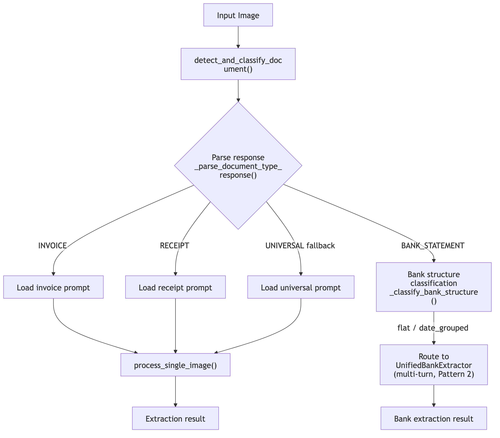
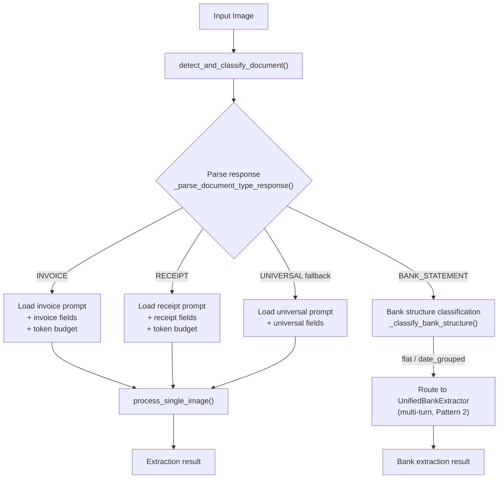
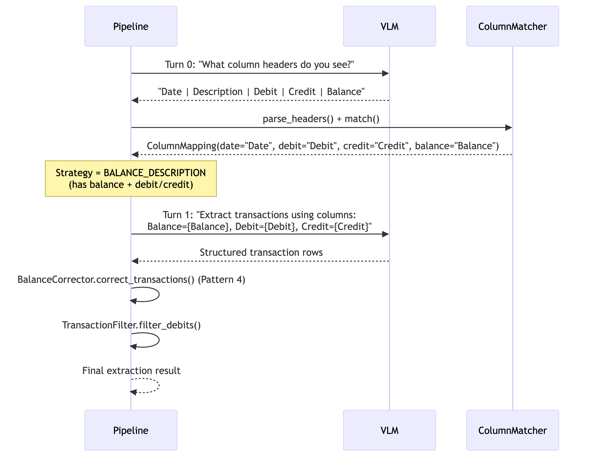
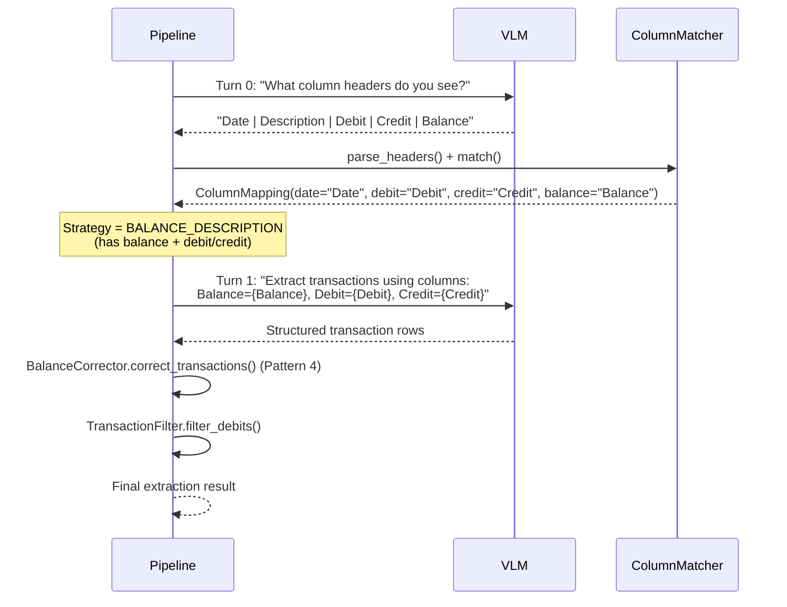
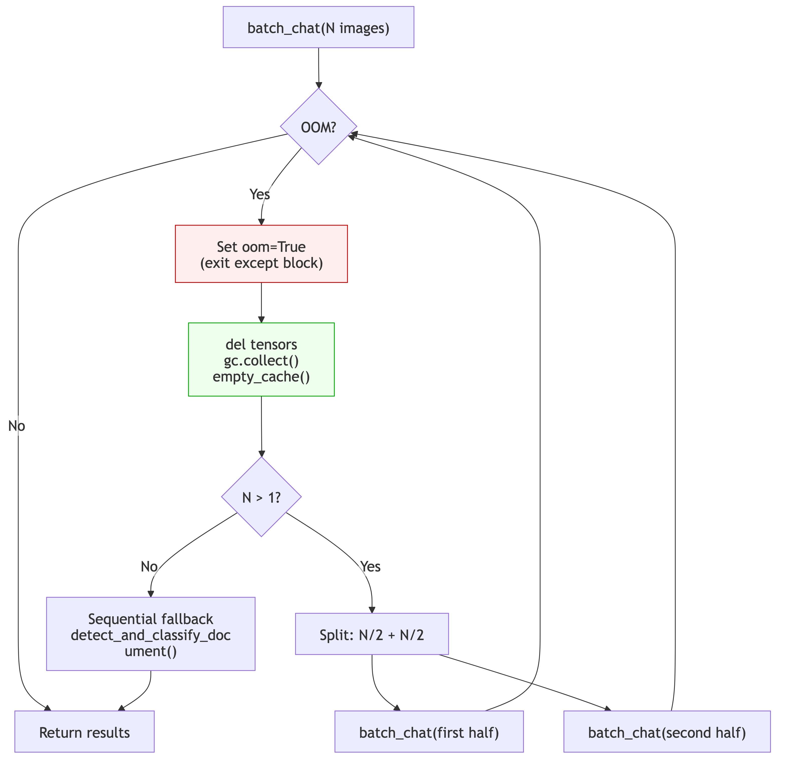
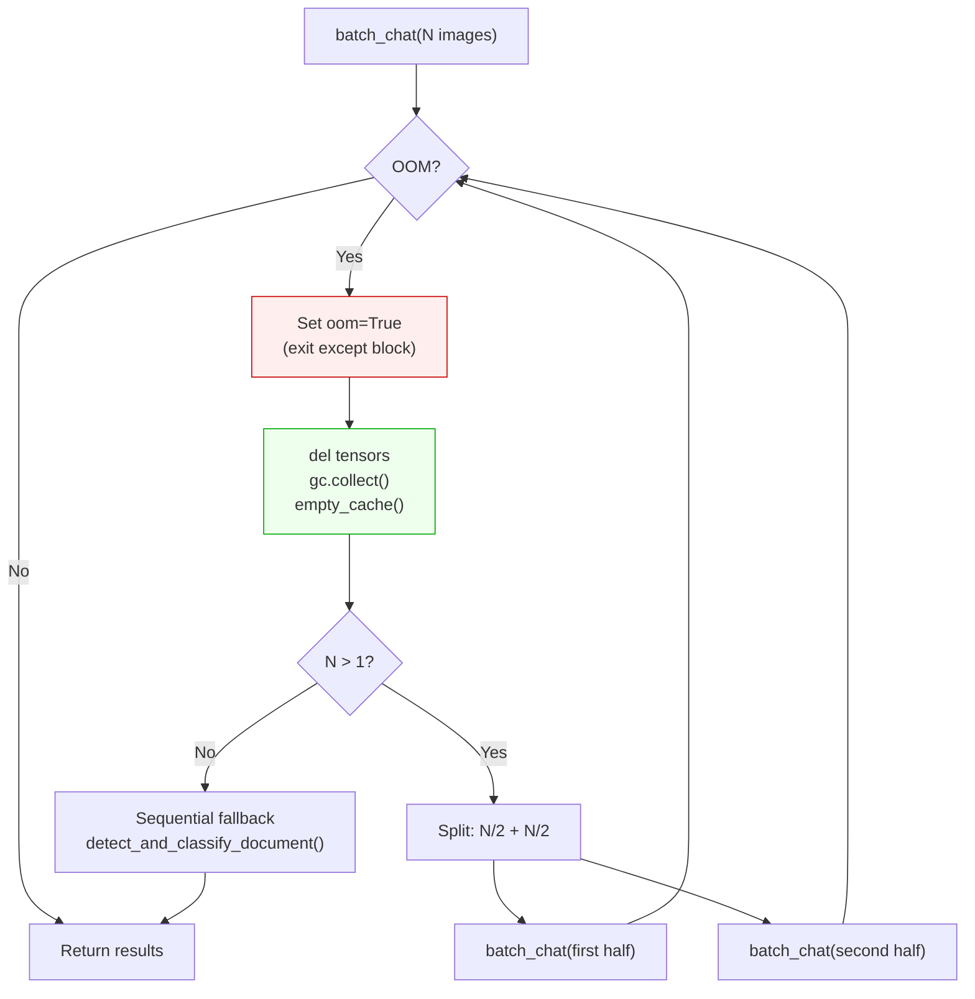
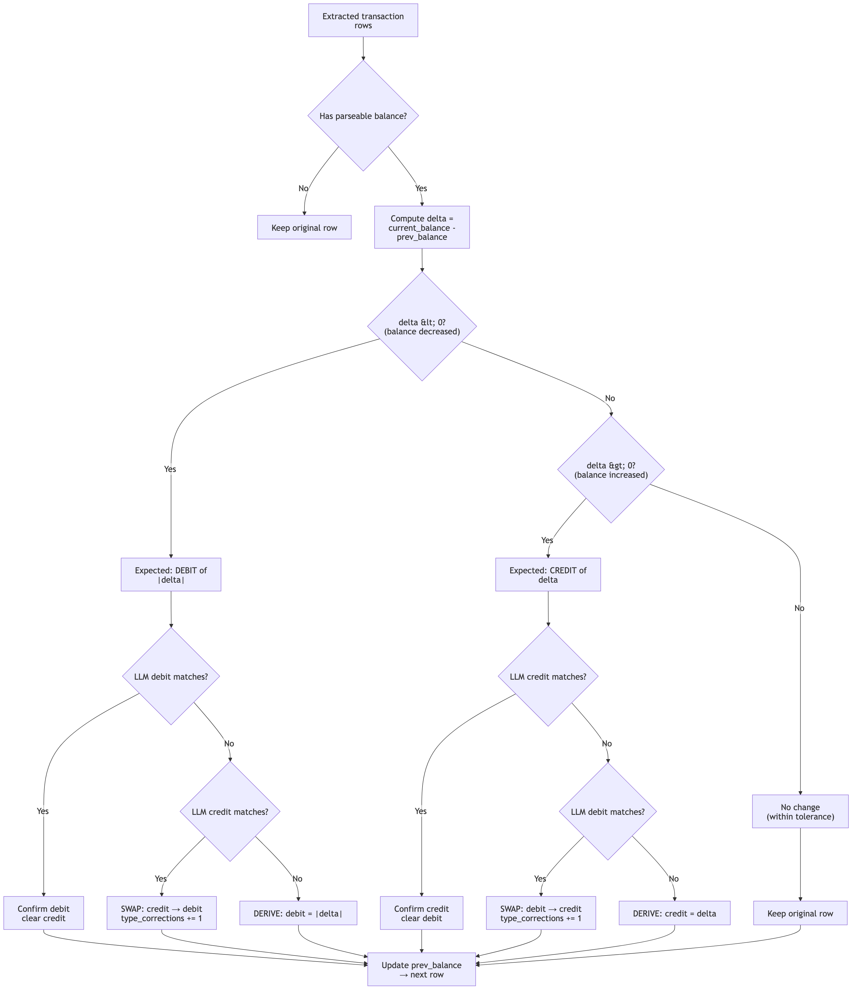
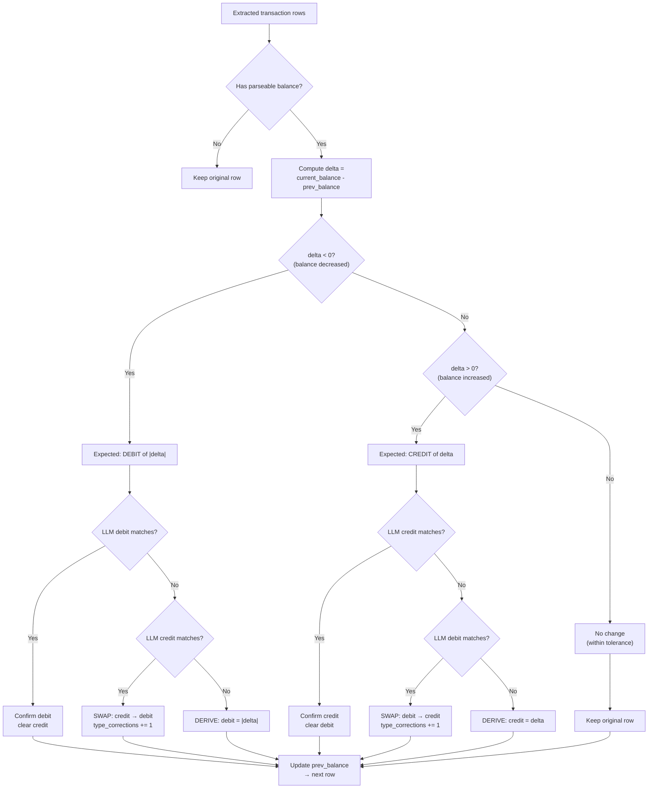

# Agentic Patterns in the Document Extraction Pipeline

## Introduction

"Agentic" in this context means **observe-reason-act loops where model output drives subsequent pipeline decisions**. Rather than running a single fixed prompt against every document, the pipeline uses VLM outputs as runtime signals — to select prompts, choose extraction strategies, recover from failures, and verify its own arithmetic. Each pattern below follows this loop: the system *observes* something (a classification, a header layout, an OOM error, a balance mismatch), *reasons* about it (maps to a strategy, halves a batch, computes a delta), and *acts* accordingly (routes to a prompt, retries, corrects a value).

Four patterns are implemented today. None require external tool use or explicit chain-of-thought prompting — they emerge from the pipeline's control flow around the VLM.

---

## Pattern 1: Dynamic Routing (Detect-then-Route)

The pipeline never runs a generic "extract everything" prompt. Instead, a lightweight detection call classifies the document first, and the classification output selects the extraction prompt, field list, and token budget.

### How it works

1. **Detect** — `base_processor.py:detect_and_classify_document()` (line 240) sends the image with a short detection prompt loaded from `document_type_detection.yaml`. The model returns a free-text classification (e.g., `"This is an invoice"`).

2. **Parse** — `_parse_document_type_response()` (line 191) maps the raw response to a canonical type (`INVOICE`, `BANK_STATEMENT`, `RECEIPT`, etc.) using exact-match on `type_mappings`, then keyword fallback from the YAML, then `settings.fallback_type` as a last resort.

3. **Route** — `base_processor.py:process_document_aware()` (line 339) uses the canonical type to resolve:
   - **Extraction prompt** — looked up in `prompt_config["extraction_files"]` per document type (line 363)
   - **Field list** — loaded from `field_definitions.yaml` for that type (line 414)
   - **Token budget** — `_calculate_max_tokens()` scales with the field count (line 418)
   - **Bank branch** — `BANK_STATEMENT` types get a second-level structure classification before routing to the bank extractor (line 353)

4. **Extract** — the type-specific prompt, field list, and token budget are passed to `process_single_image()` (line 425).

In batch mode, `batch_processor.py:_process_image()` (line 1043) orchestrates the same detect-then-route loop per image.

### Diagram



<details>
<summary>Mermaid source</summary>



</details>

### Why this is agentic

The detection call is not a preprocessing step done by a separate classifier — it is the *same VLM* making an observation that the pipeline uses to decide what to do next. The model's first output literally selects its own second prompt.

---

## Pattern 2: Multi-Turn Bank Statement Extraction (Observe-Reason-Act)

Bank statements are too structurally varied for a single prompt. The pipeline uses a two-turn conversation where Turn 0 output determines the Turn 1 strategy.

### How it works

1. **Turn 0 — Observe column headers** (`unified_bank_extractor.py:extract()`, line 1077):
   The VLM receives a `turn0_header_detection` prompt and returns the visible column headers (e.g., `"Date, Description, Debit, Credit, Balance"`).

2. **Column matching — Reason about structure** (`ColumnMatcher.match()`, line 136):
   `ResponseParser.parse_headers()` splits the raw response into a `list[str]`. `ColumnMatcher` maps each header to a semantic role (`date`, `description`, `debit`, `credit`, `balance`, `amount`) using exact-match then substring-match against patterns from `bank_column_patterns.yaml`.

3. **Strategy selection — Decide extraction approach** (lines 1100-1125):
   The `ColumnMapping` determines which extraction strategy to use:

   | Columns detected | Strategy |
   |---|---|
   | balance + debit/credit | `BALANCE_DESCRIPTION` |
   | balance + amount (no debit/credit) | `AMOUNT_DESCRIPTION` |
   | debit/credit (no balance) | `DEBIT_CREDIT_DESCRIPTION` |
   | none of the above | `TABLE_EXTRACTION` (generic fallback) |

4. **Turn 1 — Act with strategy-specific prompt** (e.g., `_extract_balance_description()`, line 1151):
   The Turn 1 prompt is templated with the *actual detected column names* from the mapping:
   ```python
   prompt = prompt_template.format(
       balance_col=mapping.balance,
       desc_col=mapping.description or "Description",
       debit_col=mapping.debit or "Debit",
       credit_col=mapping.credit or "Credit",
   )
   ```
   This makes the extraction prompt document-specific, not generic.

### Diagram



<details>
<summary>Mermaid source</summary>



</details>

### Why this is agentic

The model's Turn 0 output (header names) is not discarded — it flows through `ColumnMatcher` and directly parameterizes the Turn 1 prompt. The pipeline adapts its extraction behavior to what the model observed in the document, rather than using a one-size-fits-all prompt.

---

## Pattern 3: Self-Correcting OOM Fallback

Batch inference can trigger CUDA out-of-memory errors when tile counts vary across images. Rather than failing, the pipeline recursively halves the batch until it fits in GPU memory.

### How it works

1. **Attempt batch inference** (`document_aware_internvl3_processor.py:batch_detect_documents()`, line 647):
   The pipeline concatenates pixel values from all images in the batch and calls `model.batch_chat()`.

2. **Catch OOM — flag only, do not cleanup inside except** (line 706):
   ```python
   oom = False
   try:
       responses = self.model.batch_chat(...)
   except torch.cuda.OutOfMemoryError:
       oom = True  # Flag — exit except ASAP
   ```
   This is critical: inside an `except` block, Python's traceback holds references to all intermediate activation tensors from the failed forward pass. Calling `torch.cuda.empty_cache()` there is a no-op because the tensors are still referenced.

3. **Cleanup outside except** (line 712):
   ```python
   if oom:
       del pixel_values, all_pixel_values, num_patches_list
       gc.collect()
       torch.cuda.empty_cache()
   ```
   Now the traceback is gone and tensors can actually be freed.

4. **Recursive split** (line 718):
   ```python
   mid = len(image_paths) // 2
   r1 = self.batch_detect_documents(image_paths[:mid])
   r2 = self.batch_detect_documents(image_paths[mid:])
   return r1 + r2
   ```
   Base case: batch size 1 falls back to sequential `detect_and_classify_document()`.

The same pattern is implemented in `batch_extract_documents()` (line 865) and in `_resilient_generate()` (line 271) which adds a 3-attempt retry with progressively minimal generation configs.

### Diagram



<details>
<summary>Mermaid source</summary>



</details>

### Why this is agentic

The pipeline observes a runtime failure (OOM), reasons about the cause (batch too large for available VRAM), and acts by adapting its batch strategy — all without human intervention. The recursive halving finds the largest batch size that fits, maximizing throughput while guaranteeing completion.

---

## Pattern 4: Balance Arithmetic Self-Verification

After the VLM extracts bank transactions, the pipeline uses an accounting invariant to detect and correct misclassified debits and credits.

### The invariant

For any consecutive pair of transactions with parseable balances:

```
balance_delta = current_balance - previous_balance

if delta < 0 → transaction is a DEBIT  of abs(delta)
if delta > 0 → transaction is a CREDIT of delta
if delta ≈ 0 → no significant transaction (within tolerance)
```

### How it works

`BalanceCorrector.correct_transactions()` (`unified_bank_extractor.py`, line 766) walks the transaction rows in chronological order, maintaining a sliding `prev_balance`:

1. **Skip non-transactions** — Opening/Closing Balance rows are passed through unchanged.
2. **Parse balance** — If unparseable, preserve the row and keep `prev_balance` intact to maintain the chain for the next parseable row.
3. **Bootstrap** — The first row with a valid balance sets `prev_balance`; no correction is possible yet.
4. **For each subsequent row**, compute `balance_delta` and apply one of three corrections:

   | Scenario | Action |
   |---|---|
   | LLM put amount in debit and delta confirms debit | Clear credit column (LLM was right) |
   | LLM put amount in credit but delta says debit | **Swap**: move credit value to debit column |
   | Neither column matches the expected amount | **Derive**: set debit/credit from the delta |

   The symmetric logic applies when the delta indicates a credit.

### Diagram



<details>
<summary>Mermaid source</summary>



</details>

### Worked example

Suppose the VLM extracts these rows:

| Row | Description | Debit | Credit | Balance |
|-----|-------------|-------|--------|---------|
| 1 | Opening Balance | — | — | $1,000.00 |
| 2 | Electric bill | — | $150.00 | $850.00 |
| 3 | Salary deposit | — | $2,000.00 | $2,850.00 |

**Row 2**: `delta = 850 - 1000 = -150` (negative = debit). The LLM put $150.00 in the *credit* column, but the delta says debit. The corrector **swaps**: moves $150.00 to debit, clears credit. `type_corrections += 1`.

**Row 3**: `delta = 2850 - 850 = +2000` (positive = credit). The LLM put $2,000.00 in credit and the delta confirms it. No correction needed.

Corrected output:

| Row | Description | Debit | Credit | Balance |
|-----|-------------|-------|--------|---------|
| 1 | Opening Balance | — | — | $1,000.00 |
| 2 | Electric bill | $150.00 | — | $850.00 |
| 3 | Salary deposit | — | $2,000.00 | $2,850.00 |

### Prerequisite: chronological ordering

Balance arithmetic requires oldest-first ordering. Before calling `correct_transactions()`, the pipeline checks `is_chronological_order()` and calls `sort_by_date()` if needed (lines 1209-1219 in `_extract_balance_description()`).

### Why this is agentic

The pipeline treats the VLM's extraction as a *hypothesis*, not ground truth. It observes the extracted values, reasons about them using an external invariant (accounting math), and acts by correcting misalignments. This is a form of self-verification — the system checks its own work using domain knowledge that doesn't require another model call.

---

## Summary

| Pattern | Key Files | Observe | Reason | Act |
|---|---|---|---|---|
| **Dynamic Routing** | `base_processor.py`, `batch_processor.py` | VLM classifies document type | Map response to canonical type via YAML mappings | Select type-specific prompt, field list, token budget |
| **Multi-Turn Bank Extraction** | `unified_bank_extractor.py` | VLM reads column headers (Turn 0) | `ColumnMatcher` maps headers to semantic roles, selects strategy | Template Turn 1 prompt with actual column names |
| **OOM Fallback** | `document_aware_internvl3_processor.py` | CUDA OOM error during batch inference | Batch is too large for VRAM; cleanup outside except block | Recursively halve batch until it fits |
| **Balance Self-Verification** | `unified_bank_extractor.py` | Extracted debit/credit values + balance column | `balance_delta` determines true transaction type | Swap or derive correct debit/credit values |

---

## What We Don't Do (Yet)

The following agentic capabilities are **not** currently implemented:

- **Re-prompting on low confidence** — Detection returns a confidence score, but the pipeline never re-asks the model with a refined prompt when confidence is low. A low-confidence detection just uses the fallback type.
- **Tool use** — The VLM has no access to external tools (calculators, databases, web search). All verification is done in Python code, not by the model.
- **Explicit chain-of-thought planning** — The model is not asked to plan its extraction strategy or explain its reasoning. Strategy selection is deterministic code driven by Turn 0 output.
- **Multi-model consensus** — The pipeline supports multiple models (InternVL3, Llama) but never runs both on the same document to cross-check results.
- **Iterative refinement** — If extraction output is malformed or incomplete, the pipeline does not retry with a corrective prompt. It parses what it gets and moves on.
- **Human-in-the-loop escalation** — Low-confidence or heavily-corrected results are not flagged for human review. All output is treated as final.
