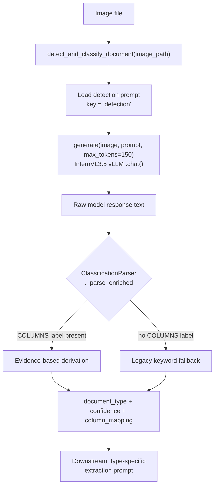
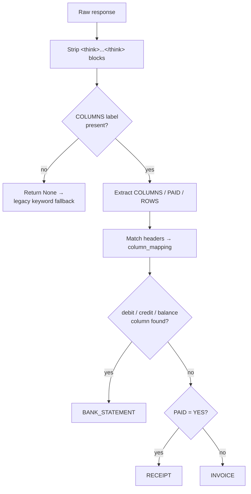
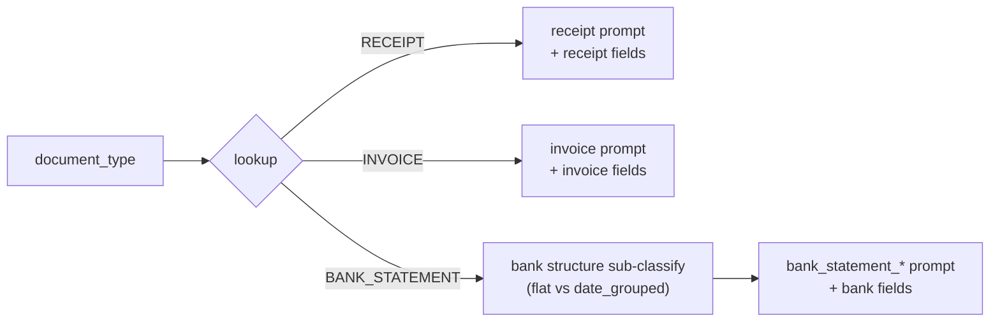

# Document Classification

> How the pipeline decides **what kind of document** an image is, before any
> field extraction happens. This is a self-contained guide for reusing the
> classification step on a new task.

## TL;DR

The classifier takes an image and returns a **canonical document type**
(`RECEIPT`, `INVOICE`, `BANK_STATEMENT`, …). The novel part is *how* it decides:

- The VLM is **not** asked "what document is this?". Instead it is asked three
  concrete, observable questions (what are the table column headers, is there
  payment evidence, how many rows).
- The Python layer then **derives the type from that evidence** — the model
  reports facts, the code makes the decision. This is far more robust than
  trusting a model's one-word self-classification, especially with reasoning
  ("thinking") models that drift.

If you want to adapt this to a new task, the pattern to copy is
**"ask for evidence, derive the label in code"** — see
[Reusing this for a new task](#reusing-this-for-a-new-task).

---

## Where it lives

| Component | Path |
|---|---|
| Entry method `detect_and_classify_document()` | `models/orchestrator.py` |
| Evidence parser + type derivation | `common/turn_parsers.py` (`ClassificationParser`) |
| Classification prompt | `prompts/document_type_detection.yaml` |
| Pipeline stage (`KFP_TASK=classify`) | `stages/classify.py` |
| Config | `config/run_config.yml` (`classification:`, `token_budgets.classify`) |

---

## The big picture



**The contract** — `detect_and_classify_document(image_path) -> dict`:

```python
{
    "document_type": "RECEIPT",      # canonical label (UPPERCASE)
    "confidence": 1.0,               # 1.0 ok · 0.1 on exception
    "raw_response": "...",           # full model text, kept for audit
    "prompt_used": "detection",
    "column_mapping": {...},         # present only for BANK_STATEMENT
}
```

On any exception it returns the configured `fallback_type` with
`confidence: 0.1` — it never raises into the pipeline.

---

## Step 1 — The prompt asks for *evidence*, not a verdict

The live prompt (`prompts/document_type_detection.yaml`, key `detection`, wired
in `cli.py` as `"detection_key": "detection"`) is deliberately small:

```text
Look at this document image and answer each question:

1. COLUMNS: If there is a transaction table with rows of dates,
   descriptions, and amounts, list the exact column headers
   separated by " | ".
   If there is no transaction table, write NONE.

2. PAID: Is there evidence that payment was completed?
   Look for: payment method, "PAID" stamp, amount tendered,
   change given, receipt number, EFTPOS/card details.
   Answer YES or NO.

3. ROWS: How many line items or transaction rows are visible?
   Answer with a number.
```

Why this shape:

- **Observable questions** ("list the column headers") are things a VLM is good
  at. "Classify this document" forces it to do reasoning we can't inspect.
- The answers are **auditable** — `raw_response` is stored, so a wrong call can
  be traced to a wrong fact, not a black-box guess.
- It keeps the response **short** (`token_budgets.classify: 150`), which is fast
  and cheap.

> The file also contains a `detection_complex` prompt that *does* ask the model
> to name the type directly. It is kept for reference/fallback but is **not** the
> default path.

---

## Step 2 — Derive the type from the evidence (in code)

`ClassificationParser._parse_enriched()` (`common/turn_parsers.py`) turns the
three answers into a label. The decision is pure Python:



The core of it:

```python
if has_bank_columns:        # column_mapping has debit/credit/balance
    doc_type = "BANK_STATEMENT"
elif paid:                  # PAID: YES
    doc_type = "RECEIPT"
else:
    doc_type = "INVOICE"
```

Design points worth stealing:

- **Reasoning-model defense.** `<think>...</think>` blocks (and an unterminated
  `<think>` tail from a truncated response) are stripped *first*, so the model's
  internal monologue — e.g. "there's no table with headers like Date, Debit" —
  can never be mistaken for the answer.
- **Prose is never harvested as data.** Column headers are only recovered from a
  genuinely tabular, pipe-delimited line (`>= 2` pipes). This stopped receipts
  being wrongly promoted to `BANK_STATEMENT` from a sentence that merely
  *mentioned* "balance".
- **Tables alone don't mean bank statement.** Invoices and receipts have tables
  too (Qty | Price | Total). The discriminator is specifically the financial
  columns `debit / credit / balance`.

### Fallback path

If the response doesn't even contain a `COLUMNS` label, the parser returns
`None` and the orchestrator falls back to legacy keyword matching
(`type_mappings` / `fallback_keywords` in the same YAML), and ultimately to
`classification.fallback_type` (`UNIVERSAL`). Note: unrecognized labels do **not**
fail fast here — they resolve to the configured fallback type.

---

## Step 3 — Routing into extraction

The classification result selects the **type-specific extraction prompt** and
**field list** downstream (`process_document_aware()` in `orchestrator.py`):



`BANK_STATEMENT` gets a second, finer vision sub-classification
(`_classify_bank_structure`) into `bank_statement_flat` vs
`bank_statement_date_grouped`, which picks the matching extraction prompt.
The `column_mapping` produced during classification is carried forward so the
bank extractor knows which physical column is debit/credit/balance.

---

## Running the classify stage

In production this runs as its own KFP pod (`KFP_TASK=classify`). Never invoke
the module by hand — the entrypoint sets the model path, tiling, and GPU env:

```bash
KFP_TASK=classify bash entrypoint.sh
# → python3 -m stages.classify --data-dir <images> --output-dir <CLASSIFICATIONS>
```

**Input:** a directory of images.
**Output:** `classifications.jsonl` — one JSON record per image:

```json
{"image_path": "/data/img_001.png", "image_name": "img_001.png",
 "document_type": "RECEIPT", "confidence": 1.0,
 "raw_response": "1. COLUMNS: NONE\n2. PAID: YES\n3. ROWS: 4",
 "prompt_used": "detection"}
```

The stage is **resumable**: on restart it skips images already present in the
output and appends, rather than re-classifying everything.

---

## Configuration

All knobs live in `config/run_config.yml` (YAML is the single source of truth —
there are no hardcoded Python defaults):

```yaml
pipeline:
  classification:
    fallback_type: UNIVERSAL   # used when evidence + keywords both fail

  token_budgets:
    classify: 150              # max tokens for the detection response
```

The prompt file and prompt key are wired in `cli.py`:

```python
"detection_file": detection_path,          # prompts/document_type_detection.yaml
"detection_key": "detection",              # the enriched COLUMNS/PAID/ROWS prompt
```

---

## Reusing this for a new task

To classify a different set of document types, you generally do **not** touch the
orchestrator or stage plumbing. You change three things:

1. **The prompt** (`prompts/document_type_detection.yaml`, or a new YAML wired via
   `detection_key`). Replace the three questions with the *observable evidence*
   that distinguishes your new classes. Keep them concrete and answerable from
   the pixels (headers present? a particular field present? a count?).

2. **The derivation rule** (`ClassificationParser._parse_enriched`, or a new
   parser class). Encode your "if evidence X then label Y" logic in Python.
   Order matters — put the most specific rule first (as bank-columns is checked
   before payment evidence).

3. **The label set + routing** — add your canonical labels to the extraction
   prompt/field lookups if the classified docs then get extracted.

The reusable principle, regardless of domain:

> **Ask the VLM for facts it can see. Decide the label in code from those facts.**
> Strip any chain-of-thought before parsing, and only treat strongly-structured
> output (tables/pipes) as data — never prose.

A second, fully worked example of this exact pattern already exists for trust
documents: `prompts/trust_document_type_detection.yaml` +
`common/trust_classify_parser.py` (`stages/trust_classify.py`). It asks
HEADER / HAS_ABN / HAS_TFN / HAS_DISTRIBUTION_TABLE / HAS_ITEM_13 / ADDRESSED_TO
and derives `TRUST_RETURN` / `DISTRIBUTION_STMT` / `INCOME_SCHEDULE` /
`BENEFICIARY_ITR` with priority-ordered rules. Copy whichever is closer to your
task.
