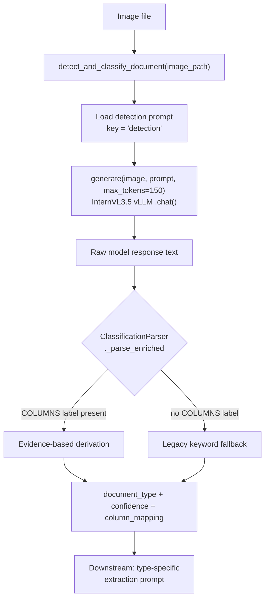
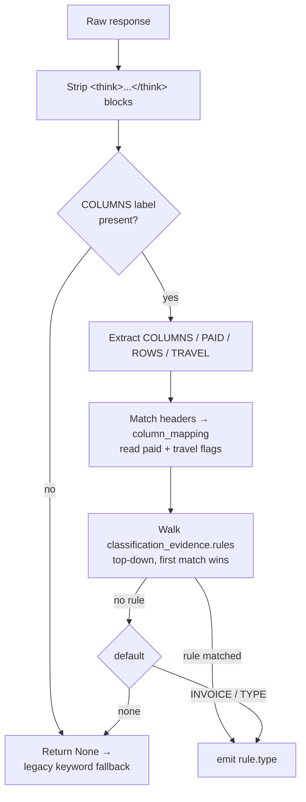
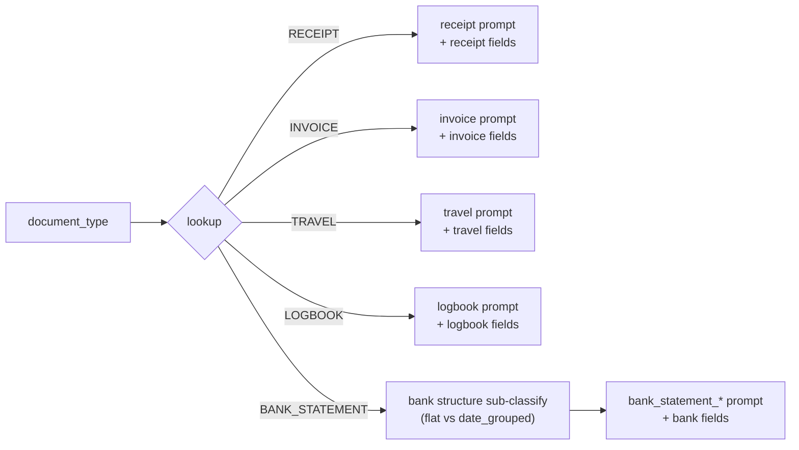

# Document Classification

> How the pipeline decides **what kind of document** an image is, before any
> field extraction happens. This is a self-contained guide for reusing the
> classification step on a new task.

## TL;DR

The classifier takes an image and returns a **canonical document type**
(`RECEIPT`, `INVOICE`, `BANK_STATEMENT`, `TRAVEL`, `LOGBOOK`, …). The novel part
is *how* it decides:

- The VLM is **not** asked "what document is this?". Instead it is asked a few
  concrete, observable questions (what are the table column headers, is there
  payment evidence, how many rows, is this a travel document).
- The Python layer then **derives the type from that evidence** using
  declarative rules in YAML (`classification_evidence`) — the model reports
  facts, the rules make the decision. This is far more robust than trusting a
  model's one-word self-classification, especially with reasoning ("thinking")
  models that drift.

There are **two kinds of evidence**, and the difference matters when you add a
new type:

| Evidence kind | Example | Detects |
|---|---|---|
| **Column roles** — semantic columns recovered from the table headers | `debit`/`credit`/`balance`, `distance`/`odometer`/`purpose`, `gst`/`unit_price`/`quantity` | `BANK_STATEMENT`, `LOGBOOK`, `INVOICE` |
| **Boolean flags** — a direct YES/NO observation | `paid`, `travel` | `RECEIPT`, `TRAVEL` |

Boolean flags exist because some document types have **no distinctive table** to
key off. A flight itinerary/boarding pass has no financial ledger columns — the
model literally answers `COLUMNS: NONE` — so it can only be caught by asking a
dedicated `TRAVEL: YES/NO` question. See
[The TRAVEL case](#the-travel-case-when-columns-arent-enough).

If you want to adapt this to a new task, the pattern to copy is
**"ask for evidence, derive the label from declarative rules"** — see
[Reusing this for a new task](#reusing-this-for-a-new-task).

---

## Where it lives

| Component | Path |
|---|---|
| Entry method `detect_and_classify_document()` | `models/orchestrator.py` |
| Evidence parser + rule evaluator | `common/turn_parsers.py` (`ClassificationParser`) |
| Classification prompt + evidence rules (`column_roles`, `classification_evidence`) | `prompts/document_type_detection.yaml` |
| Pipeline stage (`KFP_TASK=classify`) | `stages/classify.py` |
| Config | `config/run_config.yml` (`classification:`, `token_budgets.classify`) |

---

## The big picture



**The contract** — `detect_and_classify_document(image_path) -> dict`:

```python
{
    "document_type": "RECEIPT",      # canonical label (UPPERCASE)
    "confidence": 1.0,               # 1.0 ok · 0.1 on exception
    "raw_response": "...",           # full model text, kept for audit
    "prompt_used": "detection",
    "column_mapping": {...},         # present only for BANK_STATEMENT
}
```

On any exception it returns the configured `fallback_type` with
`confidence: 0.1` — it never raises into the pipeline.

---

## Step 1 — The prompt asks for *evidence*, not a verdict

The live prompt (`prompts/document_type_detection.yaml`, key `detection`, wired
in `cli.py` as `"detection_key": "detection"`) is deliberately small:

```text
Look at this document image and answer each question:

1. COLUMNS: If there is a transaction table with rows of dates,
   descriptions, and amounts, list the exact column headers
   separated by " | ".
   If there is no transaction table, write NONE.

2. PAID: Is there evidence that payment was completed?
   Look for: payment method, "PAID" stamp, amount tendered,
   change given, receipt number, EFTPOS/card details.
   Answer YES or NO.

3. ROWS: How many line items or transaction rows are visible?
   Answer with a number.

4. TRAVEL: Is this a flight ticket, e-ticket, boarding pass, or
   travel itinerary (showing passenger names, flights, or travel
   legs)? Answer YES or NO.
```

Each question yields one piece of evidence: `COLUMNS` → the column roles,
`PAID` → the `paid` flag, `ROWS` → a complexity tier, `TRAVEL` → the `travel`
flag. `Q1`/`Q3` are *column-role* evidence; `Q2`/`Q4` are *boolean-flag*
evidence (see the [TL;DR](#tldr) table).

Why this shape:

- **Observable questions** ("list the column headers", "is this a boarding
  pass") are things a VLM is good at. "Classify this document" forces it to do
  reasoning we can't inspect.
- The answers are **auditable** — `raw_response` is stored, so a wrong call can
  be traced to a wrong fact, not a black-box guess.
- It keeps the response **short** (`token_budgets.classify: 150`), which is fast
  and cheap.
- **Add evidence, not verdicts.** When a new type can't be told apart by the
  existing facts, the fix is to add a *new observable question* (as `TRAVEL` was
  added) — never to ask the model for the final label.

> The file also contains a `detection_complex` prompt that *does* ask the model
> to name the type directly. It is kept for reference/fallback but is **not** the
> default path.

---

## Step 2 — Derive the type from the evidence (YAML-driven rules)

`ClassificationParser._parse_enriched()` (`common/turn_parsers.py`) turns the
answers into a label. The Python layer parses the evidence — matching headers to
a `column_mapping` and reading the `paid` / `travel` booleans; the **decision
itself is declared in YAML** (`classification_evidence` in
`prompts/document_type_detection.yaml`) and walked generically — no hardcoded
type heuristics:



The rules (`prompts/document_type_detection.yaml`) — first match wins:

```yaml
classification_evidence:
  rules:
    - type: BANK_STATEMENT
      when: { any_roles: [debit, credit, balance] }   # financial ledger columns
    - type: LOGBOOK
      when: { any_roles: [distance, odometer, purpose] }
    - type: TRAVEL
      when: { travel: true }        # boolean flag — travel docs have no table
    - type: RECEIPT
      when: { paid: true }          # payment wins over an itemised table
    - type: INVOICE
      when: { any_roles: [gst, unit_price, quantity] }
  default: INVOICE                  # no match -> dominant non-bank/non-receipt type
```

`_evaluate_classification(column_mapping, paid, travel, evidence)` evaluates each
rule's `when:` clause against the present column roles and the `paid` / `travel`
flags, returning the first matching `type` (or the `default`). A `when:` clause
ANDs together any of these keys:

| `when:` key | Holds when |
|---|---|
| `any_roles: [...]` | at least one of the listed column roles is present |
| `all_roles: [...]` | every listed column role is present |
| `paid: true/false` | the `PAID` flag equals the given value |
| `travel: true/false` | the `TRAVEL` flag equals the given value |

**Order is precedence.** Column-based types (`BANK_STATEMENT`, `LOGBOOK`) are
checked first; `TRAVEL` sits before `RECEIPT` so a *paid* e-ticket stays
`TRAVEL` rather than being downgraded to a receipt. Adding a column-detectable
type is a pure YAML edit; adding a type that needs a brand-new fact requires a
prompt + parser change too — see
[Reusing this for a new task](#reusing-this-for-a-new-task).

> **`default: INVOICE`, not `none`.** A remote smoke (2026-06-20) showed
> `default: none` deferred unmatched docs to the keyword path and sent ~21% of
> the dev set to `UNIVERSAL` (extracted with the generic 33-field prompt),
> dropping F1 mean 0.650 → 0.626. `INVOICE` restores parity and routes unmatched
> docs to the focused invoice prompt. Because the default is a hard type (not
> `none`), an enriched response that contains a `COLUMNS` label **never** falls
> through to the legacy keyword path — see [Fallback path](#fallback-path).

Design points worth stealing:

- **Reasoning-model defence.** `<think>...</think>` blocks (and an unterminated
  `<think>` tail from a truncated response) are stripped *first*, so the model's
  internal monologue — e.g. "there's no table with headers like Date, Debit" —
  can never be mistaken for the answer.
- **Prose is never harvested as data.** Column headers are only recovered from a
  genuinely tabular, pipe-delimited line (`>= 2` pipes). This stopped receipts
  being wrongly promoted to `BANK_STATEMENT` from a sentence that merely
  *mentioned* "balance".
- **Tables alone don't mean bank statement.** Invoices and receipts have tables
  too (Qty | Price | Total). The discriminator is specifically the financial
  columns `debit / credit / balance`.
- **Boolean flags survive verbose drift.** The `TRAVEL` answer is recovered both
  from the terse inline form (`4. TRAVEL: YES`) and from a verbose
  chain-of-thought reply where the conclusion lands on a later line
  (`### 4. TRAVEL` … `Answer: YES`). The recovery anchors on the field heading,
  strips the echoed "Answer YES or NO" instruction, and takes the last explicit
  YES/NO — so neither the question echo nor a prose mention ("not a travel doc")
  can be misread as the answer.

### The TRAVEL case: when columns aren't enough

`TRAVEL` is the worked example of *why boolean evidence exists*. Travel documents
(flight ticket, e-ticket, boarding pass, multi-leg itinerary) carry **no
transaction table**: asked for `COLUMNS`, the model answers `NONE` and even
reasons *"this is a boarding pass and does not contain a transaction table"*.

Two consequences:

1. A column-role approach for travel is a **dead end** — there are no
   `flight`/`gate`/`seat` headers to match because the model never reports a
   table. (This was tried and reverted; don't re-attempt it.)
2. Without a travel-specific signal, every itinerary matched no rule and fell to
   `default: INVOICE`.

The fix was to ask a **direct observable question** — `TRAVEL: YES/NO` — and add
a `when: { travel: true }` rule. On the `synthetic_20260622` set this moved all
10 travel docs from `INVOICE` to `TRAVEL` with no regression on the other types.
The takeaway: if a type has no distinctive table, give the classifier a boolean
flag, don't try to invent columns the model can't see.

### Fallback path

The legacy keyword path is now reached in **one** situation: the response does
not contain a `COLUMNS` label at all (so `_parse_enriched` returns `None`). The
orchestrator then falls back to keyword matching (`type_mappings` /
`fallback_keywords` in the same YAML) and ultimately to
`classification.fallback_type` (`UNIVERSAL`).

Because `classification_evidence.default` is a hard type (`INVOICE`), an enriched
response that *does* contain a `COLUMNS` label can never defer to the keyword
path — an unmatched-but-enriched doc resolves to `INVOICE`, not `UNIVERSAL`.
(Setting `default: none` would re-enable that deferral; it was deliberately
disabled — see the note above.) Unrecognised labels do **not** fail fast here —
they resolve to the configured fallback type.

---

## Step 3 — Routing into extraction

The classification result selects the **type-specific extraction prompt** and
**field list** downstream (`process_document_aware()` in `orchestrator.py`):



Each canonical type maps to its own extraction prompt + field list (defined in
`config/field_definitions.yaml`, `supported_document_types`). `BANK_STATEMENT` is
the only one with a second step:

`BANK_STATEMENT` gets a second, finer vision sub-classification
(`_classify_bank_structure`) into `bank_statement_flat` vs
`bank_statement_date_grouped`, which picks the matching extraction prompt.
The `column_mapping` produced during classification is carried forward so the
bank extractor knows which physical column is debit/credit/balance.

---

## Running the classify stage

In production this runs as its own KFP pod (`KFP_TASK=classify`). Never invoke
the module by hand — the entrypoint sets the model path, tiling, and GPU env:

```bash
KFP_TASK=classify bash entrypoint.sh
# → python3 -m stages.classify --data-dir <images> --output-dir <CLASSIFICATIONS>
```

**Input:** a directory of images.
**Output:** `classifications.jsonl` — one JSON record per image:

```json
{"image_path": "/data/img_001.png", "image_name": "img_001.png",
 "document_type": "RECEIPT", "confidence": 1.0,
 "raw_response": "1. COLUMNS: NONE\n2. PAID: YES\n3. ROWS: 4\n4. TRAVEL: NO",
 "prompt_used": "detection"}
```

The stage is **resumable**: on restart it skips images already present in the
output and appends, rather than re-classifying everything.

---

## Configuration

All knobs live in `config/run_config.yml` (YAML is the single source of truth —
there are no hardcoded Python defaults):

```yaml
pipeline:
  classification:
    fallback_type: UNIVERSAL   # used when evidence + keywords both fail

  token_budgets:
    classify: 150              # max tokens for the detection response
```

The prompt file and prompt key are wired in `cli.py`:

```python
"detection_file": detection_path,          # prompts/document_type_detection.yaml
"detection_key": "detection",              # the enriched COLUMNS/PAID/ROWS prompt
```

---

## Reusing this for a new task

You do **not** touch the orchestrator or stage plumbing. Which files you change
depends on whether the existing evidence can already tell your new type apart.

### Case A — the new type is distinguishable by *existing* evidence (pure YAML)

If your type has a distinctive table column or is separated by `paid`/`travel`,
it's a YAML-only change in `prompts/document_type_detection.yaml`:

1. (If column-based) add the semantic column under `column_roles:` with its
   header keywords.
2. Add a rule to `classification_evidence.rules` at the right precedence.
3. Add the canonical label to `config/field_definitions.yaml`
   (`supported_document_types`) plus its extraction prompt/fields. The rule
   validator fails fast if a rule emits a type that isn't supported.

No Python edit — `_evaluate_classification` walks the rules generically.

### Case B — the new type needs a *new* fact (prompt + parser + YAML)

This is what `TRAVEL` required, because no existing fact distinguished it. Four
edits (see the `TRAVEL` commit as the reference diff):

1. **Prompt** — add a new observable question (e.g. a `FOO: YES/NO` field) to the
   `detection` prompt.
2. **Parser** (`common/turn_parsers.py`) — extract the new field in
   `_parse_enriched` and thread it through `_when_matches` /
   `_evaluate_classification` as a new flag (mirror how `travel` is wired); or,
   for a new column role, just add it under `column_roles`.
3. **Validation** (`common/prompt_catalog.py`) — add the new key to
   `allowed_when_keys` so `when: { foo: true }` passes fail-fast validation.
4. **YAML + routing** — add the `when: { foo: true }` rule and the label/fields
   as in Case A.

### Either case

Keep the questions concrete and answerable from the pixels (headers present? a
particular field present? a count? is it an X?), and put the most specific rule
first — order is precedence.

The reusable principle, regardless of domain:

> **Ask the VLM for facts it can see. Decide the label in code from those facts.**
> Strip any chain-of-thought before parsing, and only treat strongly-structured
> output (tables/pipes) as data — never prose.

A second, fully worked example of this exact pattern already exists for trust
documents: `prompts/trust_document_type_detection.yaml` +
`common/trust_classify_parser.py` (`stages/trust_classify.py`). It asks
HEADER / HAS_ABN / HAS_TFN / HAS_DISTRIBUTION_TABLE / HAS_ITEM_13 / ADDRESSED_TO
and derives `TRUST_RETURN` / `DISTRIBUTION_STMT` / `INCOME_SCHEDULE` /
`BENEFICIARY_ITR` with priority-ordered rules. Copy whichever is closer to your
task.
