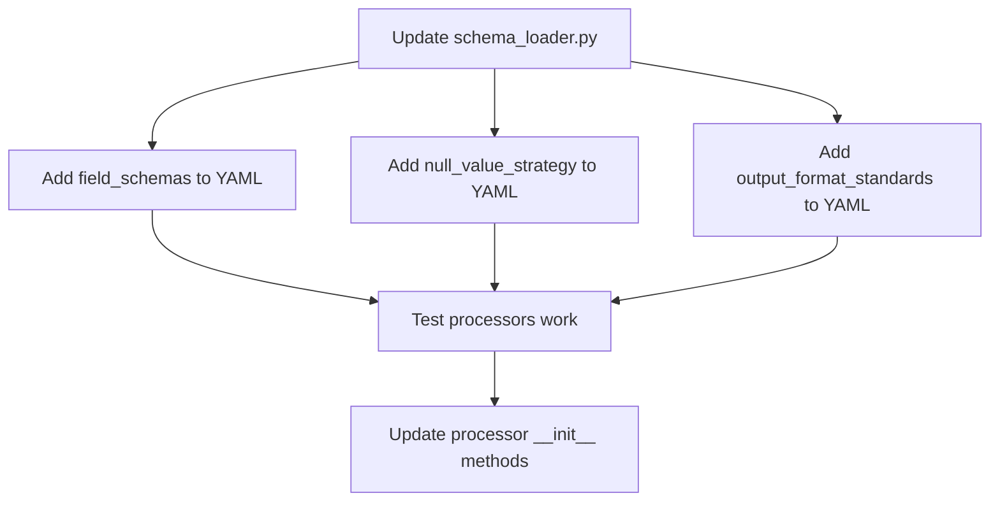

# Field Schema Enhancement Implementation Plan

**Project**: LMM_POC Field Schema Research-Based Improvements  
**Document Version**: 2.0 (Updated August 26, 2025)  
**Created**: August 24, 2025  
**Based on**: `field_schema_research_analysis.md`

## Overview

This implementation plan tracks the actual progress of field schema enhancements. **Updated to reflect completed work and lessons learned from CoT integration performance regression.**

**Target Performance Goals:**
- Precision: 95.5% (Applied KIE Pipeline benchmark)
- Field Completeness: >90% for clearly visible fields  
- Format Compliance: >98% adherence to standardized formats
- Null Value Accuracy: 40-60% reduction in false positives

## ✅ COMPLETED PHASES (August 24-26, 2025)

### ✅ Phase 1: Critical Enhancements (COMPLETED)
**Status**: COMPLETED August 24-25, 2025  
**Result**: Successfully implemented with 90.6% accuracy maintained

#### ✅ Task 1.1: Add Formal Schema Definitions (COMPLETED)
**Status**: ✅ COMPLETED  
**Files Modified**: `common/field_schema.yaml`  
**Implementation**: Added `field_schemas` section with 5 field types:
- `monetary`: Currency format with examples
- `numeric_id`: ABN format with validation notes  
- `date`: Date formats with extraction guidelines
- `phone`: Australian phone number formats
- `list_format`: Comma-separated list standards

#### ✅ Task 1.2: Enhanced Null Value Strategy (COMPLETED)
**Status**: ✅ COMPLETED  
**Files Modified**: `common/field_schema.yaml`  
**Implementation**: Added comprehensive `null_value_strategy` section:
- Research-backed principle: "NOT_FOUND is better than guessed values"
- Specific guidance for critical fields (ABN, monetary amounts)
- Quality confidence indicators for extraction decisions

### ✅ Phase 2.1: Chain-of-Thought Integration (COMPLETED - SIMPLIFIED APPROACH)
**Status**: ✅ COMPLETED with lessons learned  
**Result**: Simplified CoT approach achieved 90.6% accuracy  

#### ✅ Task 2.1: Integrate Chain-of-Thought (CoT) Prompting (COMPLETED - SIMPLIFIED)
**Status**: ✅ COMPLETED (Simplified version)  
**Files Modified**: `common/field_schema.yaml`, `common/schema_loader.py`  
**Implementation**: 
- Added `extraction_methodologies` with 6 simplified CoT patterns
- Integrated CoT instructions into prompt generation pipeline
- **LESSON LEARNED**: Complex CoT caused -7% accuracy regression (90.6% → 83.6%)
- **SOLUTION**: Reverted to simplified CoT approach with brief focus tips

**Critical Finding**: Detailed step-by-step CoT instructions create cognitive overload in vision-language models. Simple focus tips (`💡 FOCUS: • ABN: Look for 'ABN' label`) are significantly more effective than verbose reasoning chains.

## ❌ ATTEMPTED BUT REVERTED (August 26, 2025)

### ❌ Complete CoT Integration (REVERTED)
**Status**: ❌ REVERTED due to performance regression  
**Problem**: Detailed CoT instructions caused:
- Accuracy drop: 90.6% → 83.6% (-7.0%)  
- Prompt bloat: 2,868 → 4,082 characters (+42.3%)
- Critical extraction errors: ABN corruption, GST calculation errors
- Field name confusion in model responses

**Git States**:
- ❌ Problematic: `4baa328` (Complete CoT - 83.6% accuracy)
- ✅ Stable: `34958ea` (Simplified CoT - 90.6% accuracy) ← CURRENT STATE

**Analysis**: Documented in `docs/CoT_integration_performance_analysis.md`

## 🚧 REMAINING PHASES (Not Started)

**Current Status**: On stable simplified CoT approach (90.6% accuracy)
**Next Priority**: Consider incremental improvements only, avoid wholesale changes

### 🚧 Task 1.3: Format Standardization (NOT STARTED)
**Status**: DEFERRED - Current flexible approach working well
**Estimated Time**: 3 hours if needed
**Files Modified**: `common/field_schema.yaml`
**Risk Assessment**: LOW priority - current extraction handles format variations well

### 🚧 Phase 2.2: Self-Validation Framework (NOT STARTED) 
**Status**: DEFERRED - High complexity, uncertain benefit
**Estimated Time**: 5 hours
**Files Modified**: `common/field_schema.yaml`, `common/schema_loader.py`
**Risk Assessment**: MEDIUM-HIGH risk of prompt bloat similar to complex CoT

### 🚧 Phase 3: Performance Monitoring (NOT STARTED)
**Status**: DEFERRED - Consider for production deployment
**Estimated Time**: 4 hours  
**Files Modified**: Create new `common/performance_monitor.py`

## CURRENT IMPLEMENTATION STATUS SUMMARY

### ✅ What's Working (90.6% Accuracy)
1. **Simplified Field Schema** (Phase 1.1 & 1.2)
   - Flexible field format definitions without rigid constraints
   - Research-backed null value strategy 
   - Comprehensive extraction guidance

2. **Simplified CoT Integration** (Phase 2.1 - Simplified)
   - Brief focus tips for complex fields (`💡 FOCUS: • ABN: Look for 'ABN' label`)
   - Integrated into prompt generation pipeline
   - Avoids cognitive overload while providing guidance

### 🎯 Key Lessons Learned
1. **Less is More**: Simple prompts outperform complex step-by-step instructions
2. **Prompt Length Matters**: Keep groups under 3,000 characters to maintain model focus
3. **Incremental Testing**: Always test changes on small scale before full deployment
4. **Performance Regression Protocol**: Immediate rollback on accuracy drops >5%

### 🚨 Avoid These Patterns (Proven to Cause Regression)
- ❌ Detailed step-by-step CoT reasoning chains
- ❌ Verbose validation instructions within prompts  
- ❌ Multiple CoT sections per prompt group
- ❌ Prompts longer than 4,000 characters

### 📋 Recommended Next Steps
1. **Maintain Current State**: Stay on simplified approach (90.6% accuracy)
2. **Micro-improvements Only**: Single-sentence enhancements, not wholesale changes
3. **A/B Test Changes**: Always compare new vs current performance
4. **Document Everything**: Performance analysis for all changes

### 📊 Performance Benchmarks
- **Baseline**: 90.6% accuracy (commit `34958ea`)
- **Problematic**: 83.6% accuracy (commit `4baa328` - reverted)
- **Target**: Maintain >90% accuracy with any future changes

---

## DEPRECATED SECTIONS (Pre-Implementation Details)

**Note**: The following sections contain the original detailed implementation plans that were written before actual implementation. They are preserved for reference but should not be followed as the actual implementation differs significantly.
   
   Add the following YAML structure:
   ```yaml
   # Field format schemas with validation patterns
   field_schemas:
     monetary:
       type: "number"
       format: "currency"
       regex_pattern: "^\$\d+\.\d{2}$"
       examples: ["$58.62", "$1,234.56", "$0.99"]
       validation_rules:
         - "Must include $ symbol"
         - "Exactly 2 decimal places"
         - "No spaces between $ and digits"
         - "Use commas for thousands separator"
     
     abn:
       type: "string" 
       format: "australian_business_number"
       regex_pattern: "^\d{2}\s?\d{3}\s?\d{3}\s?\d{3}$"
       examples: ["12 345 678 901", "12345678901"]
       validation_rules:
         - "Exactly 11 digits total"
         - "May include spaces in format XX XXX XXX XXX"
         - "Must not be confused with BSB (6 digits)"
     
     date:
       type: "string"
       format: "date"
       regex_pattern: "^\d{2}/\d{2}/\d{4}$"
       examples: ["15/03/2024", "01/12/2025"]
       validation_rules:
         - "DD/MM/YYYY format only"
         - "Use leading zeros for single digits"
         - "Convert other formats to this standard"
     
     phone:
       type: "string"
       format: "australian_phone"
       regex_pattern: "^0[2-9]\d{8}$"
       examples: ["0298765432", "0412345678"]
       validation_rules:
         - "Exactly 10 digits including area code"
         - "Must start with 0"
         - "Remove spaces, brackets, hyphens"
     
     list_format:
       type: "array"
       format: "comma_separated"
       examples: ["Rice 1kg, Cheese Block 500g, Frozen Peas 1kg"]
       validation_rules:
         - "Single line with comma-space separation"
         - "No multiple blocks or headers"
         - "Consistent ordering across related lists"
   ```

2. **Update Schema Processing Modules**

   **CRITICAL**: Before adding new YAML sections, update modules to handle them:

   **Update `common/schema_loader.py`**:
   ```python
   # Add method to SchemaLoader class
   def get_field_schemas(self) -> dict:
       """Get field format schemas for validation."""
       return self.schema.get('field_schemas', {})
   
   def get_null_value_strategy(self) -> dict:
       """Get null value handling strategy."""
       return self.schema.get('null_value_strategy', {})
   
   def get_format_standards(self) -> dict:
       """Get output format standardization rules."""
       return self.schema.get('output_format_standards', {})
   
   def validate_schema_structure(self) -> bool:
       """Validate new schema sections exist and are properly formatted."""
       required_new_sections = [
           'field_schemas', 'null_value_strategy', 'output_format_standards'
       ]
       
       missing = []
       for section in required_new_sections:
           if section not in self.schema:
               missing.append(section)
       
       if missing:
           print(f"⚠️  Missing new schema sections: {missing}")
           print("💡 These sections are optional but recommended for enhanced functionality")
       
       return len(missing) == 0
   ```

   **Update processors to handle new schema sections**:
   ```python
   # In models/llama_processor.py and models/internvl3_processor.py
   # Add to __init__ method:
   
   try:
       # Validate enhanced schema structure
       if hasattr(self.schema_loader, 'validate_schema_structure'):
           self.schema_loader.validate_schema_structure()
           
       # Access new schema sections safely
       self.field_schemas = self.schema_loader.get_field_schemas() if hasattr(self.schema_loader, 'get_field_schemas') else {}
       self.format_standards = self.schema_loader.get_format_standards() if hasattr(self.schema_loader, 'get_format_standards') else {}
       
   except Exception as e:
       print(f"⚠️  Enhanced schema features not available: {e}")
       print("💡 Falling back to basic schema functionality")
   ```

3. **Validation Steps**
   ```bash
   # STEP 1: Update modules FIRST
   python -c "
   from common.schema_loader import SchemaLoader
   loader = SchemaLoader()
   print('Schema loader updated successfully')
   print('Has new methods:', hasattr(loader, 'get_field_schemas'))
   "
   
   # STEP 2: Then add YAML sections and test
   python -c "import yaml; yaml.safe_load(open('common/field_schema.yaml'))"
   
   # STEP 3: Test new functionality
   python -c "
   from common.schema_loader import SchemaLoader
   loader = SchemaLoader()
   schemas = loader.get_field_schemas()
   print(f'Field schemas loaded: {len(schemas)} types')
   "
   
   # Run ruff checks
   ruff check common/field_schema.yaml common/schema_loader.py
   ```

### Task 1.2: Enhance Null Value Strategy
**Estimated Time**: 2 hours  
**Files Modified**: `common/field_schema.yaml`

#### Implementation Steps

1. **Add Null Value Strategy Section**
   ```bash
   # Location: After field_schemas section
   ```
   
   Add:
   ```yaml
   # Enhanced null value strategy based on Unstract (2024) research
   null_value_strategy:
     principle: "NOT_FOUND is better than guessed values"
     description: "Research-validated approach to handling missing or unclear information"
     
     use_not_found_when:
       - "Text is blurry, partially obscured, or low quality"
       - "Multiple possible interpretations exist"
       - "Field would require calculation or inference"
       - "Information appears present but is illegible"
       - "Similar-looking text exists but doesn't match field requirements"
     
     never_guess_for:
       critical_fields:
         - "BUSINESS_ABN: Never guess digit sequences"
         - "TOTAL_AMOUNT: Never calculate from line items during extraction"
         - "BANK_BSB_NUMBER: Never confuse with ABN or phone numbers"
       monetary_fields:
         - "All amounts: Never calculate missing values"
         - "GST_AMOUNT: Never derive from subtotal"
       identification_fields:
         - "Phone numbers: Never guess area codes"
         - "Postcodes: Never assume 4-digit format"
     
     quality_indicators:
       high_confidence: "Text is clearly visible and unambiguous"
       medium_confidence: "Text is visible but may have minor OCR issues"
       low_confidence: "Text is partially visible or has interpretation ambiguity - use NOT_FOUND"
   ```

### Task 1.3: Implement Extraction-TimeFormat Standardization
**Estimated Time**: 3 hours  
**Files Modified**: `common/field_schema.yaml`

#### Implementation Steps

1. **Add Output Format Standards Section**
   ```yaml
   # Output format standardization to prevent variation issues
   output_format_standards:
     description: "Standardized formats to prevent variation issues identified in research"
     
     date_standardization:
       required_format: "DD/MM/YYYY"
       examples:
         correct: ["15/03/2024", "01/12/2025", "31/01/2024"]
         incorrect: ["March 15, 2024", "15-03-2024", "2024/03/15", "15/3/24"]
       conversion_rules:
         - "Convert 'March 15, 2024' to '15/03/2024'"
         - "Convert '15-03-2024' to '15/03/2024'" 
         - "Convert '2024/03/15' to '15/03/2024'"
         - "Use leading zeros for single-digit days/months"
         - "Convert 2-digit years to 4-digit (24 → 2024)"
     
     monetary_standardization:
       required_format: "$X.XX"
       rules:
         - "Always include dollar sign ($)"
         - "Exactly 2 decimal places"
         - "No spaces between $ and digits"
         - "Use commas for thousands (e.g., $1,234.56)"
         - "Never use currency codes (AUD, USD)"
       examples:
         correct: ["$58.62", "$1,234.56", "$0.99", "$12,345.67"]
         incorrect: ["$58.6", "58.62", "$58", "$ 58.62", "AUD 58.62"]
     
     phone_standardization:
       required_format: "10 digits with area code"
       examples:
         correct: ["0298765432", "0412345678", "0398765432"]
         incorrect: ["(02) 9876 5432", "02 9876 5432", "98765432", "+61 2 9876 5432"]
       rules:
         - "Remove all spaces, brackets, and hyphens"
         - "Maintain leading zero and area code"
         - "Remove country code +61"
         - "Ensure exactly 10 digits total"
     
     list_standardization:
       required_format: "Comma-separated values on single line"
       examples:
         descriptions: "Rice 1kg, Cheese Block 500g, Frozen Peas 1kg"
         quantities: "3, 3, 1"
         prices: "$3.80, $8.50, $4.20"
       rules:
         - "One complete line per field type"
         - "Comma followed by single space separation"
         - "No multiple blocks or repeated field headers"
         - "Maintain consistent ordering across related lists"
   ```

2. **Update Field Instructions**
   
   Update existing field instructions to reference format standards:
   ```yaml
   # Example: Update TOTAL_AMOUNT instruction (line 212)
   # From:
   instruction: "[total amount in dollars with 2 decimals (e.g. $58.62) or NOT_FOUND]"
   # To:
   instruction: "[total amount in standardized format $X.XX (see output_format_standards.monetary_standardization) or NOT_FOUND]"
   ```

#### Validation Steps
```bash
# Test YAML structure
python -c "
import yaml
with open('common/field_schema.yaml') as f:
    data = yaml.safe_load(f)
    print(f'Schema version: {data.get(\"schema_version\")}')
    print(f'Total fields: {data.get(\"total_fields\")}')
    print(f'Format standards defined: {\"output_format_standards\" in data}')
"

# Check file size hasn't grown excessively
ls -la common/field_schema.yaml
```

## Phase 2: Advanced Features (High Impact, Medium Risk)
**Timeline**: 5-7 days  
**Prerequisites**: Phase 1 complete and tested

### Task 2.1: Integrate Chain-of-Thought (CoT) Prompting
**Estimated Time**: 6 hours  
**Files Modified**: `common/field_schema.yaml`, `common/schema_loader.py`

#### Implementation Steps

1. **Add CoT Methodology to field_schema.yaml**
   ```yaml
   # Add after validation_rules section (line 377)
   extraction_methodologies:
     description: "Chain-of-Thought reasoning patterns for complex field extraction"
     
     abn_extraction:
       description: "Step-by-step ABN identification process"
       steps:
         step1: "Scan document header and business details section"
         step2: "Look for 11-digit numbers with 'ABN' label or similar"
         step3: "Verify format: XX XXX XXX XXX or 11 consecutive digits"  
         step4: "Confirm it's not BSB (6 digits) or phone (10 digits)"
         step5: "Extract exact digits, preserve spacing if present"
       validation_check: "Count digits - must be exactly 11 total"
     
     monetary_extraction:
       description: "Financial amount identification with validation"
       steps:
         step1: "Identify document sections: totals area, line items, tax details"
         step2: "Look for $ symbols and decimal patterns (X.XX)"
         step3: "Distinguish between unit prices and line totals"
         step4: "Verify decimal places (exactly 2 for Australian currency)"
         step5: "Cross-reference with field labels (Total, GST, Subtotal)"
       validation_check: "Ensure format matches $X.XX exactly"
     
     line_item_extraction:
       description: "Structured list extraction methodology"  
       steps:
         step1: "Identify line item table or list structure"
         step2: "Extract descriptions in order: product names only, no quantities"
         step3: "Extract quantities in same order: numbers only, no units"
         step4: "Extract unit prices in same order: individual prices, not line totals"
         step5: "Format as comma-separated values, one line per field type"
       validation_check: "Verify same number of items in each list"
     
     banking_extraction:
       description: "Banking information identification process"
       steps:
         step1: "Look for banking section, usually separate from business details"
         step2: "Find BSB: exactly 6 digits, often formatted XXX-XXX"
         step3: "Find account number: varies in length, separate from BSB"
         step4: "Find bank name: financial institution, not business name"
         step5: "Find account holder: may differ from business name"
       validation_check: "BSB must be exactly 6 digits, not 11-digit ABN"
   ```

2. **Update schema_loader.py to Support CoT Prompting**
   
   **CRITICAL**: Update `common/schema_loader.py` FIRST before adding YAML sections.
   
   Add method to `SchemaLoader` class:
   ```python
   def _generate_cot_instructions(self, field_name: str) -> str:
       """Generate Chain-of-Thought instructions for complex fields."""
       methodologies = self.schema.get('extraction_methodologies', {})
       
       # Map fields to methodologies
       field_to_methodology = {
           'BUSINESS_ABN': 'abn_extraction',
           'TOTAL_AMOUNT': 'monetary_extraction', 
           'SUBTOTAL_AMOUNT': 'monetary_extraction',
           'GST_AMOUNT': 'monetary_extraction',
           'LINE_ITEM_DESCRIPTIONS': 'line_item_extraction',
           'LINE_ITEM_QUANTITIES': 'line_item_extraction', 
           'LINE_ITEM_PRICES': 'line_item_extraction',
           'BANK_NAME': 'banking_extraction',
           'BANK_BSB_NUMBER': 'banking_extraction',
           'BANK_ACCOUNT_NUMBER': 'banking_extraction'
       }
       
       methodology_key = field_to_methodology.get(field_name)
       if not methodology_key or methodology_key not in methodologies:
           return ""
           
       methodology = methodologies[methodology_key]
       steps = methodology.get('steps', {})
       validation = methodology.get('validation_check', '')
       
       cot_instruction = f"\n\nCOT REASONING FOR {field_name}:\n"
       for step_key in sorted(steps.keys()):
           cot_instruction += f"- {steps[step_key]}\n"
       
       if validation:
           cot_instruction += f"- VALIDATION: {validation}\n"
           
       return cot_instruction
   ```

3. **Integrate CoT into Prompt Generation**
   
   Modify `_generate_single_pass_prompt` method:
   ```python
   # In the field listing section, add CoT instructions for complex fields
   complex_fields = ['BUSINESS_ABN', 'TOTAL_AMOUNT', 'LINE_ITEM_DESCRIPTIONS', 
                     'LINE_ITEM_QUANTITIES', 'LINE_ITEM_PRICES']
   
   for field_info in self.schema['fields']:
       field_name = field_info['name']
       if field_name in complex_fields:
           cot_instructions = self._generate_cot_instructions(field_name)
           # Add to prompt generation logic
   ```

#### Critical Module Update Order
```bash
# STEP 1: Update schema_loader.py with new methods FIRST
python -c "
from common.schema_loader import SchemaLoader
loader = SchemaLoader()
print('Methods added:', hasattr(loader, '_generate_cot_instructions'))
"

# STEP 2: Add extraction_methodologies to YAML SECOND
# (Add YAML content as specified above)

# STEP 3: Test CoT integration THIRD
python -c "
from common.schema_loader import SchemaLoader
loader = SchemaLoader()
# Test CoT instruction generation
cot = loader._generate_cot_instructions('BUSINESS_ABN')
print('CoT Instructions Generated:', bool(cot))
print('Length:', len(cot))
"

# STEP 4: Test full prompt generation still works
python -c "
from common.schema_loader import SchemaLoader
loader = SchemaLoader()
prompt = loader.generate_dynamic_prompt('llama', 'single_pass')
print('Prompt generated successfully:', len(prompt) > 100)
"

# STEP 5: Update models to use CoT (if they reference methodologies directly)
ruff check common/schema_loader.py models/*.py
```

### Task 2.2: Add Self-Validation Framework  
**Estimated Time**: 5 hours  
**Files Modified**: `common/field_schema.yaml`, `common/schema_loader.py`

#### Implementation Steps

1. **Add Validation Framework to field_schema.yaml**
   ```yaml
   # Add after extraction_methodologies section
   self_validation_framework:
     description: "Post-extraction validation prompts for quality assurance"
     
     critical_field_validation:
       abn_check:
         prompt: "Before finalizing ABN: Count digits (must be exactly 11). Verify it's in business header, not contact section. Confirm it's labeled as ABN."
         severity: "critical"
         fields: ["BUSINESS_ABN"]
       
       total_amount_check:
         prompt: "Before finalizing TOTAL_AMOUNT: Is this the final amount due? Does it include tax? Is decimal formatting correct (exactly 2 places)?"
         severity: "critical" 
         fields: ["TOTAL_AMOUNT"]
     
     mathematical_consistency:
       subtotal_gst_total:
         prompt: "If all three values present: Does SUBTOTAL + GST ≈ TOTAL (within $0.02)? If not, re-examine each amount."
         fields: ["SUBTOTAL_AMOUNT", "GST_AMOUNT", "TOTAL_AMOUNT"]
         tolerance: 0.02
         formula: "SUBTOTAL + GST = TOTAL"
       
       gst_percentage:
         prompt: "If GST and SUBTOTAL present: Is GST approximately 10% of SUBTOTAL? Australian standard GST rate is 10%."
         fields: ["SUBTOTAL_AMOUNT", "GST_AMOUNT"] 
         expected_ratio: 0.10
         tolerance_range: [0.095, 0.105]
       
       line_item_consistency:
         prompt: "If line items present: Do DESCRIPTIONS, QUANTITIES, and PRICES have the same count? Are they in matching order?"
         fields: ["LINE_ITEM_DESCRIPTIONS", "LINE_ITEM_QUANTITIES", "LINE_ITEM_PRICES"]
         rule: "equal_count"
     
     format_consistency:
       date_format:
         prompt: "Before finalizing dates: Are they in DD/MM/YYYY format? Convert if necessary."
         fields: ["INVOICE_DATE", "DUE_DATE", "STATEMENT_DATE_RANGE"]
         standard_format: "DD/MM/YYYY"
       
       currency_format:
         prompt: "Before finalizing monetary values: Do they include $ symbol and exactly 2 decimal places?"
         fields: ["TOTAL_AMOUNT", "SUBTOTAL_AMOUNT", "GST_AMOUNT", "LINE_ITEM_PRICES"]
         required_format: "$X.XX"
       
       banking_format:
         prompt: "Before finalizing banking: Is BSB exactly 6 digits? Is it different from the 11-digit ABN?"
         fields: ["BANK_BSB_NUMBER", "BUSINESS_ABN"]
         validation_rules:
           - "BSB must be exactly 6 digits"
           - "ABN must be exactly 11 digits"
           - "They must be different values"
   ```

2. **Add Validation Integration to schema_loader.py**
   
   **CRITICAL**: Update `common/schema_loader.py` BEFORE adding `self_validation_framework` to YAML.
   
   ```python
   def _generate_validation_prompts(self, strategy: str) -> str:
       """Generate self-validation prompts based on extraction strategy."""
       validation_framework = self.schema.get('self_validation_framework', {})
       if not validation_framework:
           return ""
       
       validation_prompt = "\n\nSELF-VALIDATION CHECKLIST:\n"
       validation_prompt += "Before finalizing your extraction, verify:\n\n"
       
       # Critical field validations
       critical_validations = validation_framework.get('critical_field_validation', {})
       for check_name, check_info in critical_validations.items():
           validation_prompt += f"✓ {check_info['prompt']}\n"
       
       # Mathematical consistency checks  
       math_validations = validation_framework.get('mathematical_consistency', {})
       for check_name, check_info in math_validations.items():
           validation_prompt += f"✓ {check_info['prompt']}\n"
       
       # Format consistency checks
       format_validations = validation_framework.get('format_consistency', {})
       for check_name, check_info in format_validations.items():
           validation_prompt += f"✓ {check_info['prompt']}\n"
       
       validation_prompt += "\nOnly provide final output after completing these checks.\n"
       return validation_prompt
   ```

3. **Integrate into Prompt Generation**
   ```python
   # In _generate_single_pass_prompt method, add validation prompts before closing
   validation_prompts = self._generate_validation_prompts(strategy)
   if validation_prompts:
       prompt_parts.append(validation_prompts)
   ```

#### Validation Steps
```bash
# Test validation prompt generation
python -c "
from common.schema_loader import SchemaLoader
loader = SchemaLoader()
validation = loader._generate_validation_prompts('single_pass')
print('Validation prompts generated:', bool(validation))
print('Contains mathematical checks:', 'SUBTOTAL + GST' in validation)
"
```

### Task 2.3: Enhanced Error Handling
**Estimated Time**: 3 hours  
**Files Modified**: `common/schema_loader.py`, `common/grouped_extraction.py`

#### Implementation Steps

1. **Add Schema Validation Method**
   ```python
   # Add to SchemaLoader class
   def validate_schema_integrity(self) -> bool:
       """Validate schema file integrity and required sections."""
       required_sections = [
           'fields', 'groups', 'grouping_strategies', 
           'field_schemas', 'null_value_strategy',
           'output_format_standards'
       ]
       
       missing_sections = []
       for section in required_sections:
           if section not in self.schema:
               missing_sections.append(section)
       
       if missing_sections:
           raise ValueError(f"Missing required schema sections: {missing_sections}")
       
       # Validate field count matches declared total
       declared_total = self.schema.get('total_fields', 0)
       actual_total = len(self.schema.get('fields', []))
       
       if declared_total != actual_total:
           raise ValueError(f"Field count mismatch: declared {declared_total}, found {actual_total}")
       
       return True
   ```

2. **Add Format Validation**
   ```python
   def validate_field_format(self, field_name: str, value: str) -> tuple[bool, str]:
       """Validate field value against schema format requirements."""
       field_schemas = self.schema.get('field_schemas', {})
       
       # Find field type
       field_info = next((f for f in self.schema['fields'] if f['name'] == field_name), None)
       if not field_info:
           return False, f"Unknown field: {field_name}"
       
       field_type = field_info.get('type', 'text')
       schema_info = field_schemas.get(field_type, {})
       
       if not schema_info:
           return True, "No format validation defined"  # Allow through
       
       # Check regex pattern if defined
       import re
       pattern = schema_info.get('regex_pattern')
       if pattern and not re.match(pattern, value):
           examples = schema_info.get('examples', [])
           return False, f"Format mismatch. Expected pattern: {pattern}. Examples: {examples}"
       
       return True, "Format valid"
   ```

## Phase 3: Optimization and Integration (Medium Impact, Low Risk)
**Timeline**: 3-4 days  
**Prerequisites**: Phases 1 and 2 complete and tested

### Task 3.1: Performance Monitoring Integration
**Estimated Time**: 4 hours  
**Files Modified**: Create new `common/performance_monitor.py`

#### Implementation Steps

1. **Create Performance Monitoring Module**
   ```python
   # common/performance_monitor.py
   import json
   import time
   from pathlib import Path
   from typing import Dict, Any, List
   from dataclasses import dataclass
   from datetime import datetime

   @dataclass
   class ExtractionMetrics:
       document_id: str
       processing_time: float
       fields_extracted: int
       fields_total: int
       format_compliance_score: float
       null_value_count: int
       validation_pass_rate: float
       model_used: str
       timestamp: datetime

   class PerformanceMonitor:
       def __init__(self, metrics_file: Path = None):
           self.metrics_file = metrics_file or Path("extraction_metrics.jsonl")
           self.current_session_metrics: List[ExtractionMetrics] = []
       
       def start_extraction(self, document_id: str, model: str) -> float:
           """Start timing an extraction operation."""
           return time.time()
       
       def end_extraction(self, start_time: float, document_id: str, 
                         extracted_data: Dict, model: str) -> ExtractionMetrics:
           """End timing and calculate metrics."""
           processing_time = time.time() - start_time
           
           # Calculate metrics
           total_fields = 25  # From schema
           extracted_fields = sum(1 for v in extracted_data.values() if v != "NOT_FOUND")
           null_count = sum(1 for v in extracted_data.values() if v == "NOT_FOUND")
           
           # Format compliance checking would go here
           format_score = self._calculate_format_compliance(extracted_data)
           
           metrics = ExtractionMetrics(
               document_id=document_id,
               processing_time=processing_time,
               fields_extracted=extracted_fields,
               fields_total=total_fields,
               format_compliance_score=format_score,
               null_value_count=null_count,
               validation_pass_rate=1.0,  # Placeholder
               model_used=model,
               timestamp=datetime.now()
           )
           
           self._save_metrics(metrics)
           return metrics
       
       def _calculate_format_compliance(self, data: Dict) -> float:
           """Calculate format compliance score."""
           # Implementation would check against field_schemas
           return 0.95  # Placeholder
       
       def _save_metrics(self, metrics: ExtractionMetrics):
           """Save metrics to JSONL file."""
           with open(self.metrics_file, 'a') as f:
               json.dump(metrics.__dict__, f, default=str)
               f.write('\n')
   ```

2. **Integrate with Existing Processors**
   ```python
   # Update models/llama_processor.py and internvl3_processor.py
   
   # Add to __init__ method:
   from common.performance_monitor import PerformanceMonitor
   self.performance_monitor = PerformanceMonitor()
   
   # In process_single_image method:
   start_time = self.performance_monitor.start_extraction(image_path, "llama")
   # ... existing processing logic ...
   metrics = self.performance_monitor.end_extraction(start_time, image_path, result, "llama")
   ```

#### Validation Steps
```bash
# Test performance monitoring
python -c "
from common.performance_monitor import PerformanceMonitor, ExtractionMetrics
import time
from datetime import datetime

monitor = PerformanceMonitor()
start = monitor.start_extraction('test_doc', 'llama')
time.sleep(0.1)  # Simulate processing
test_data = {'TOTAL_AMOUNT': '$58.62', 'BUSINESS_ABN': 'NOT_FOUND'}
metrics = monitor.end_extraction(start, 'test_doc', test_data, 'llama')
print(f'Metrics recorded: {metrics.processing_time > 0}')
"
```

### Task 3.2: Advanced Validation Rules
**Estimated Time**: 3 hours  
**Files Modified**: `common/field_schema.yaml`, create `common/business_logic_validator.py`

#### Implementation Steps

1. **Extend Interdependency Rules in field_schema.yaml**
   ```yaml
   # Extend existing interdependency_rules section
   advanced_validation_rules:
     document_type_consistency:
       description: "Fields should be consistent with document type"
       rules:
         invoice_rules:
           required_if_invoice: ["SUPPLIER_NAME", "TOTAL_AMOUNT", "INVOICE_DATE"]
           prohibited_if_invoice: ["OPENING_BALANCE", "CLOSING_BALANCE"]
           condition: "DOCUMENT_TYPE contains 'INVOICE'"
         
         statement_rules:
           required_if_statement: ["OPENING_BALANCE", "CLOSING_BALANCE"]
           optional_if_statement: ["STATEMENT_DATE_RANGE"]
           condition: "DOCUMENT_TYPE contains 'STATEMENT'"
     
     australian_business_rules:
       description: "Australian business document validation"
       rules:
         abn_format:
           pattern: "^\d{2}\s?\d{3}\s?\d{3}\s?\d{3}$"
           checksum_validation: true
           description: "ABN must be valid Australian Business Number"
         
         gst_calculation:
           formula: "GST = SUBTOTAL * 0.10"
           tolerance: 0.02
           description: "GST should be 10% of subtotal (within 2 cents)"
         
         bsb_validation:
           pattern: "^\d{6}$"
           description: "BSB must be exactly 6 digits"
           not_equal_to: ["BUSINESS_ABN"]
     
     cross_field_consistency:
       description: "Consistency checks across related fields"  
       rules:
         contact_consistency:
           business_contacts: ["SUPPLIER_NAME", "BUSINESS_ADDRESS", "BUSINESS_PHONE"]
           payer_contacts: ["PAYER_NAME", "PAYER_ADDRESS", "PAYER_PHONE", "PAYER_EMAIL"]
           rule: "If one field in group is present, related fields should be checked"
         
         temporal_consistency:
           date_sequence: ["INVOICE_DATE", "DUE_DATE"]
           rule: "DUE_DATE should be after or equal to INVOICE_DATE"
           tolerance_days: 0
   ```

2. **Create Business Logic Validator**
   ```python
   # common/business_logic_validator.py
   from typing import Dict, List, Tuple, Any
   import re
   from datetime import datetime

   class BusinessLogicValidator:
       def __init__(self, schema: Dict):
           self.schema = schema
           self.validation_rules = schema.get('advanced_validation_rules', {})
       
       def validate_extraction(self, extracted_data: Dict[str, str]) -> List[Tuple[str, str, str]]:
           """Validate extracted data against business logic rules.
           
           Returns list of (field_name, severity, message) tuples.
           """
           violations = []
           
           # Document type consistency
           doc_type = extracted_data.get('DOCUMENT_TYPE', '').upper()
           violations.extend(self._validate_document_type_consistency(extracted_data, doc_type))
           
           # Australian business rules
           violations.extend(self._validate_australian_business_rules(extracted_data))
           
           # Cross-field consistency
           violations.extend(self._validate_cross_field_consistency(extracted_data))
           
           return violations
       
       def _validate_document_type_consistency(self, data: Dict, doc_type: str) -> List[Tuple[str, str, str]]:
           """Validate fields are consistent with document type."""
           violations = []
           doc_rules = self.validation_rules.get('document_type_consistency', {}).get('rules', {})
           
           if 'INVOICE' in doc_type and 'invoice_rules' in doc_rules:
               rules = doc_rules['invoice_rules']
               for required_field in rules.get('required_if_invoice', []):
                   if data.get(required_field) == 'NOT_FOUND':
                       violations.append((required_field, 'warning', 
                                        f'Field typically required for invoices'))
           
           return violations
       
       def _validate_australian_business_rules(self, data: Dict) -> List[Tuple[str, str, str]]:
           """Validate Australian business-specific rules."""
           violations = []
           
           # ABN validation
           abn = data.get('BUSINESS_ABN', 'NOT_FOUND')
           if abn != 'NOT_FOUND' and not self._validate_abn_format(abn):
               violations.append(('BUSINESS_ABN', 'error', 'Invalid ABN format'))
           
           # GST calculation validation  
           subtotal = self._parse_currency(data.get('SUBTOTAL_AMOUNT', 'NOT_FOUND'))
           gst = self._parse_currency(data.get('GST_AMOUNT', 'NOT_FOUND'))
           
           if subtotal and gst:
               expected_gst = subtotal * 0.10
               if abs(gst - expected_gst) > 0.02:
                   violations.append(('GST_AMOUNT', 'warning', 
                                    f'GST {gst} differs from expected {expected_gst:.2f} (10% of subtotal)'))
           
           return violations
       
       def _validate_abn_format(self, abn: str) -> bool:
           """Validate ABN format and checksum."""
           # Remove spaces and check length
           abn_digits = re.sub(r'\s', '', abn)
           if not re.match(r'^\d{11}$', abn_digits):
               return False
           
           # ABN checksum validation (simplified)
           weights = [10, 1, 3, 5, 7, 9, 11, 13, 15, 17, 19]
           digits = [int(d) for d in abn_digits]
           digits[0] -= 1  # Subtract 1 from first digit
           
           checksum = sum(d * w for d, w in zip(digits, weights))
           return checksum % 89 == 0
       
       def _parse_currency(self, value: str) -> float:
           """Parse currency string to float."""
           if value == 'NOT_FOUND' or not value:
               return None
           
           # Remove $ symbol and commas, convert to float
           try:
               clean_value = re.sub(r'[$,]', '', value)
               return float(clean_value)
           except (ValueError, TypeError):
               return None
   ```

#### Validation Steps
```bash
# Test business logic validator
python -c "
from common.business_logic_validator import BusinessLogicValidator
import yaml

# Load schema
with open('common/field_schema.yaml') as f:
    schema = yaml.safe_load(f)

validator = BusinessLogicValidator(schema)

# Test data
test_data = {
    'BUSINESS_ABN': '12 345 678 901',
    'SUBTOTAL_AMOUNT': '$100.00',
    'GST_AMOUNT': '$10.00',
    'TOTAL_AMOUNT': '$110.00',
    'DOCUMENT_TYPE': 'INVOICE'
}

violations = validator.validate_extraction(test_data)
print(f'Validation complete. Violations found: {len(violations)}')
for field, severity, message in violations:
    print(f'  {severity.upper()}: {field} - {message}')
"
```

## Testing and Validation Framework

### Comprehensive Testing Plan

#### Unit Tests
Create `tests/test_field_schema_enhancements.py`:

```python
import pytest
import yaml
from pathlib import Path
from common.schema_loader import SchemaLoader
from common.business_logic_validator import BusinessLogicValidator
from common.performance_monitor import PerformanceMonitor

class TestSchemaEnhancements:
    
    @pytest.fixture
    def schema_loader(self):
        return SchemaLoader()
    
    @pytest.fixture
    def sample_extraction_data(self):
        return {
            'BUSINESS_ABN': '12 345 678 901',
            'TOTAL_AMOUNT': '$58.62',
            'SUBTOTAL_AMOUNT': '$53.29',
            'GST_AMOUNT': '$5.33',
            'DOCUMENT_TYPE': 'INVOICE',
            'SUPPLIER_NAME': 'Test Supplier Pty Ltd',
            'LINE_ITEM_DESCRIPTIONS': 'Rice 1kg, Cheese Block 500g',
            'LINE_ITEM_QUANTITIES': '2, 1',
            'LINE_ITEM_PRICES': '$3.80, $8.50'
        }
    
    def test_schema_integrity(self, schema_loader):
        """Test schema file loads and has required sections."""
        assert schema_loader.validate_schema_integrity()
        
        # Check new sections exist
        schema = schema_loader.schema
        assert 'field_schemas' in schema
        assert 'null_value_strategy' in schema
        assert 'output_format_standards' in schema
        assert 'extraction_methodologies' in schema
        assert 'self_validation_framework' in schema
    
    def test_format_validation(self, schema_loader):
        """Test format validation for different field types."""
        # Valid formats
        assert schema_loader.validate_field_format('TOTAL_AMOUNT', '$58.62')[0]
        assert schema_loader.validate_field_format('BUSINESS_ABN', '12 345 678 901')[0]
        assert schema_loader.validate_field_format('INVOICE_DATE', '15/03/2024')[0]
        
        # Invalid formats  
        assert not schema_loader.validate_field_format('TOTAL_AMOUNT', '$58.6')[0]
        assert not schema_loader.validate_field_format('BUSINESS_ABN', '12345')[0]
        assert not schema_loader.validate_field_format('INVOICE_DATE', 'March 15, 2024')[0]
    
    def test_cot_instruction_generation(self, schema_loader):
        """Test Chain-of-Thought instruction generation."""
        cot_abn = schema_loader._generate_cot_instructions('BUSINESS_ABN')
        assert 'step1' in cot_abn
        assert 'VALIDATION' in cot_abn
        assert '11' in cot_abn  # Should mention 11 digits
        
        cot_monetary = schema_loader._generate_cot_instructions('TOTAL_AMOUNT')
        assert 'step1' in cot_monetary
        assert '$' in cot_monetary
    
    def test_validation_framework(self, schema_loader, sample_extraction_data):
        """Test self-validation framework integration."""
        validation_prompts = schema_loader._generate_validation_prompts('single_pass')
        assert 'VALIDATION CHECKLIST' in validation_prompts
        assert 'ABN' in validation_prompts
        assert 'SUBTOTAL + GST' in validation_prompts
    
    def test_business_logic_validator(self, schema_loader, sample_extraction_data):
        """Test business logic validation."""
        validator = BusinessLogicValidator(schema_loader.schema)
        violations = validator.validate_extraction(sample_extraction_data)
        
        # Should pass basic validation
        critical_violations = [v for v in violations if v[1] == 'error']
        assert len(critical_violations) == 0
    
    def test_performance_monitoring(self):
        """Test performance monitoring integration."""
        monitor = PerformanceMonitor()
        start_time = monitor.start_extraction('test_doc', 'llama')
        
        # Simulate some processing time
        import time
        time.sleep(0.01)
        
        test_data = {'TOTAL_AMOUNT': '$58.62', 'BUSINESS_ABN': 'NOT_FOUND'}
        metrics = monitor.end_extraction(start_time, 'test_doc', test_data, 'llama')
        
        assert metrics.processing_time > 0
        assert metrics.fields_extracted == 1
        assert metrics.null_value_count == 1

# Integration Tests
class TestEndToEndIntegration:
    
    def test_full_prompt_generation_with_enhancements(self):
        """Test full prompt generation includes all enhancements."""
        loader = SchemaLoader()
        
        # Test single-pass prompt
        single_pass_prompt = loader.generate_dynamic_prompt('llama', 'single_pass')
        assert len(single_pass_prompt) > 1000
        assert 'CoT REASONING' in single_pass_prompt
        assert 'VALIDATION CHECKLIST' in single_pass_prompt
        
        # Test grouped prompt
        grouped_prompt = loader.generate_dynamic_prompt('llama', 'detailed_grouped')
        assert len(grouped_prompt) > 500
        assert 'critical' in grouped_prompt.lower()
    
    def test_backwards_compatibility(self):
        """Test that existing functionality still works."""
        loader = SchemaLoader()
        
        # Original methods should still work
        templates = loader.get_available_model_templates('llama', 'field_grouped')
        assert len(templates) > 0
        
        # Field information should be preserved
        fields = loader.get_fields_by_group('critical')
        assert 'BUSINESS_ABN' in [f['name'] for f in fields]
        assert 'TOTAL_AMOUNT' in [f['name'] for f in fields]
```

#### Running Tests

```bash
# Run all tests
python -m pytest tests/test_field_schema_enhancements.py -v

# Run specific test categories
python -m pytest tests/test_field_schema_enhancements.py::TestSchemaEnhancements -v

# Run with coverage
python -m pytest tests/test_field_schema_enhancements.py --cov=common --cov-report=html
```

### Integration Testing

#### Test with Real Documents
```bash
# Test enhanced extraction on sample documents
python llama_keyvalue.py --use-enhanced-schema --test-mode

# Compare performance before/after enhancements
python scripts/compare_performance.py --baseline=old_results --enhanced=new_results
```

#### Validation Testing
```bash
# Test validation framework
python -c "
from common.schema_loader import SchemaLoader
from common.business_logic_validator import BusinessLogicValidator

# Load enhanced schema
loader = SchemaLoader()
validator = BusinessLogicValidator(loader.schema)

# Test validation on various document types
test_cases = [
    # Valid invoice
    {'DOCUMENT_TYPE': 'INVOICE', 'TOTAL_AMOUNT': '$100.00', 'SUPPLIER_NAME': 'Test Co'},
    
    # Invalid ABN
    {'BUSINESS_ABN': '123456', 'TOTAL_AMOUNT': '$50.00'},
    
    # Inconsistent GST
    {'SUBTOTAL_AMOUNT': '$100.00', 'GST_AMOUNT': '$5.00', 'TOTAL_AMOUNT': '$105.00'}
]

for i, test_data in enumerate(test_cases):
    violations = validator.validate_extraction(test_data)
    print(f'Test case {i+1}: {len(violations)} violations found')
"
```

## Timeline and Milestones

### Phase 1 (Days 1-5): Critical Enhancements
- **Day 1**: Task 1.1 - Add formal schema definitions
- **Day 2**: Task 1.2 - Enhance null value strategy  
- **Day 3-4**: Task 1.3 - Implement format standardization
- **Day 5**: Phase 1 testing and validation

**Milestone**: Enhanced schema with format definitions and standardization

### Phase 2 (Days 6-12): Advanced Features
- **Day 6-8**: Task 2.1 - Integrate Chain-of-Thought prompting
- **Day 9-11**: Task 2.2 - Add self-validation framework
- **Day 12**: Task 2.3 - Enhanced error handling

**Milestone**: Complete advanced prompt engineering features

### Phase 3 (Days 13-16): Optimization
- **Day 13-14**: Task 3.1 - Performance monitoring integration
- **Day 15**: Task 3.2 - Advanced validation rules
- **Day 16**: Final integration testing and documentation

**Milestone**: Production-ready enhanced extraction system

## Success Criteria

### Quantitative Metrics
- **Precision**: Achieve ≥95.5% on test document set
- **Format Compliance**: ≥98% adherence to standardized formats
- **Processing Time**: No more than 20% increase in processing time
- **False Positive Reduction**: 40-60% reduction in incorrect extractions

### Qualitative Assessments
- **Prompt Quality**: CoT instructions improve extraction reasoning
- **Error Messages**: Clear, actionable validation feedback
- **Maintainability**: Enhanced schema remains readable and editable
- **Backwards Compatibility**: Existing functionality preserved

### Performance Benchmarks

#### Before Enhancement Baseline
```bash
# Establish baseline metrics
python benchmark_extraction.py --mode=baseline --output=baseline_metrics.json
```

#### After Enhancement Testing  
```bash
# Test enhanced performance
python benchmark_extraction.py --mode=enhanced --output=enhanced_metrics.json

# Compare results
python compare_performance.py baseline_metrics.json enhanced_metrics.json
```

## Critical Module Dependencies and Update Order

### ⚠️ **CRITICAL IMPLEMENTATION SEQUENCE**

The implementation MUST follow this exact sequence to avoid breaking existing functionality:

#### **Phase 1 Dependencies**


#### **Module Update Requirements**

**Before adding ANY new YAML sections:**

1. **common/schema_loader.py** - Add accessor methods for new sections
2. **models/llama_processor.py** - Add safe loading of enhanced features  
3. **models/internvl3_processor.py** - Add safe loading of enhanced features
4. **common/grouped_extraction.py** - Validate still works with enhanced schema

**Required Code Changes Summary:**
```python
# ALL modules that load field_schema.yaml must handle new sections gracefully:

# Option 1: Safe access pattern
field_schemas = schema.get('field_schemas', {})  # Returns empty dict if missing

# Option 2: Try-except pattern  
try:
    methodologies = schema['extraction_methodologies']
except KeyError:
    methodologies = {}  # Fallback for old schema format

# Option 3: Version checking pattern
schema_version = schema.get('schema_version', '1.0')
if schema_version >= '1.1':
    # Use enhanced features
    pass
else:
    # Use basic functionality
    pass
```

### **Backwards Compatibility Strategy**

#### **Schema Version Management**
```yaml
# Update schema_version when adding new sections
schema_version: "1.1"  # Increment from 1.0

# Add compatibility metadata
compatibility:
  minimum_loader_version: "1.1"
  deprecated_features: []
  breaking_changes: []
```

#### **Graceful Degradation**
```python
# All processors must handle missing enhanced sections
class SchemaLoader:
    def get_field_schemas(self) -> dict:
        """Get field schemas with fallback to empty dict."""
        if 'field_schemas' not in self.schema:
            logger.warning("Enhanced field schemas not available - using basic validation")
            return {}
        return self.schema['field_schemas']
```

### **Testing Strategy for Module Updates**

#### **Integration Test Sequence**
```bash
# Test 1: Baseline - existing functionality works
python -c "from common.schema_loader import SchemaLoader; SchemaLoader().generate_dynamic_prompt('llama', 'single_pass')"

# Test 2: Enhanced methods added but schema not updated yet
python -c "from common.schema_loader import SchemaLoader; print(hasattr(SchemaLoader(), 'get_field_schemas'))"

# Test 3: Enhanced schema sections added
python -c "from common.schema_loader import SchemaLoader; print(len(SchemaLoader().get_field_schemas()))"

# Test 4: Full integration with processors
python llama_keyvalue.py --test-single-document

# Test 5: Backwards compatibility with old schema
mv field_schema.yaml field_schema_enhanced.yaml
cp field_schema_backup.yaml field_schema.yaml  # Old version
python -c "from common.schema_loader import SchemaLoader; SchemaLoader()._generate_cot_instructions('BUSINESS_ABN')"  # Should not crash
```

## Risk Mitigation

### Technical Risks
1. **Schema File Size Growth**: Monitor file size, consider splitting if >10MB
2. **Prompt Length Limits**: Test with model token limits (4K, 8K, 32K)
3. **Processing Performance**: Benchmark before/after, optimize if >20% slower
4. **Backwards Compatibility**: Maintain comprehensive test suite

### Implementation Risks
1. **Complex Integration**: Implement incrementally, test each phase
2. **Validation Logic Errors**: Extensive unit testing for business rules  
3. **Format Standard Conflicts**: Document any Australian vs international differences

### Rollback Plan
1. **Git Branching**: Use feature branches for each phase
2. **Schema Versioning**: Increment schema_version for each major change
3. **Rollback Scripts**: Automated scripts to revert to previous schema version
4. **Performance Monitoring**: Alert system for performance degradation

---

**Implementation Plan Prepared By**: Claude Code Analysis  
**Based on Research Analysis**: `field_schema_research_analysis.md`  
**Total Estimated Time**: 16 days (3 phases)  
**Priority**: Phase 1 Critical Enhancements - Start Immediately