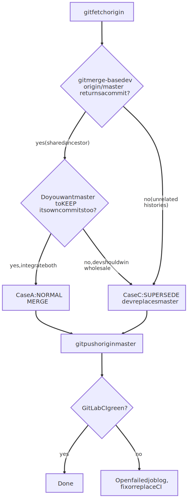
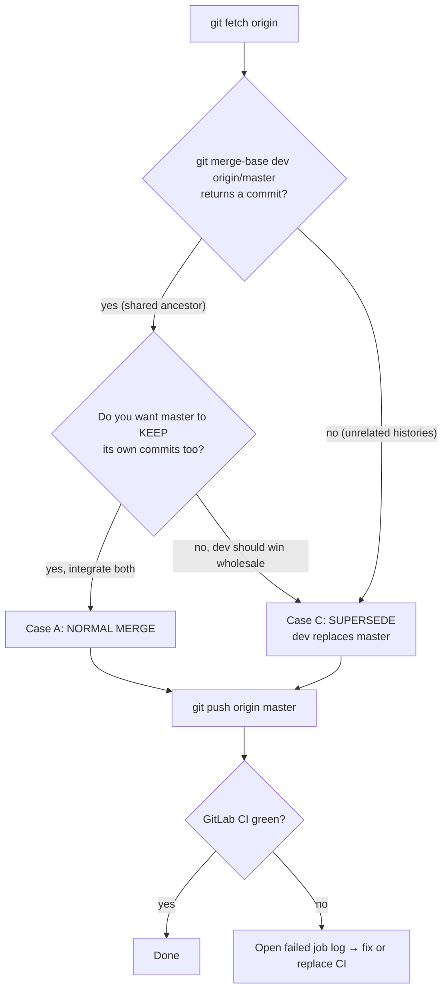

# Git Workflow — Merging a Dev Branch into `master`

A practical, safe procedure for landing a dev branch onto the **production trunk**.

> **Context this is written for.** The production/canonical repo is the PROD GitLab
> (`git@<PROD-gitlab-host>:du-1mm/lmm-poc.git`). Its trunk is **`master`**,
> you are the **only** contributor to `master`, and other developers work in isolated dev
> branches that never commit to `master`. GitLab CI runs `kfp_ci_validation` on pushes.
> (Your local GitHub clone uses `main` and is a *separate* repo — don't conflate the two.)

---

## Golden rules

1. **Always `git fetch` first.** You cannot reason about — or fast-forward — a remote branch your
   clone hasn't downloaded. Most "weird" merge/push behaviour traces back to a stale view of the remote.
2. **Never `git push --force` (or `--force-with-lease`) to `master`.** It rewrites shared history,
   can be blocked by branch protection, and orphans other people's branches. If a push is rejected,
   *integrate*, don't force.
3. **On the production box, run one command at a time** and read its output before the next —
   especially for anything that writes to `master`.
4. **Check the relationship before you merge** (`git merge-base`). The right command depends on
   whether the histories are *related* or *unrelated*.
5. **A merge writes nothing to the server.** Only `git push` does. So you can merge, inspect, and
   even `git reset --hard` to undo locally — right up until you push.

---

## Decide which case you're in



<details>
<summary>Mermaid source (for editing / GitHub-native rendering)</summary>



> If you edit the diagram above, re-render the SVG with `/render-svg docs/git-workflow-merge-dev-to-master.md`.

</details>

- **Case A — Normal merge:** `dev` builds on `master`'s history; you want `master` to gain `dev`'s
  commits while keeping its own. This is the everyday case.
- **Case C — Supersede:** `dev` should *become* `master` going forward, discarding the old trunk's
  content (e.g. unrelated histories, or a deliberate clean break). This is what was done on
  2026-06-02 to make the trust-distribution line the trunk.

---

## Step 0 — Always start here

```bash
git fetch origin
git checkout master
git merge-base master origin/master && echo "RELATED" || echo "UNRELATED histories"
git rev-list --left-right --count master...origin/master   # left = local ahead, right = remote ahead
```

If `master` is behind `origin/master`, sync it first:

```bash
git merge --ff-only origin/master    # fast-forward local master to the remote (no merge commit)
```

---

## Case A — Normal merge (related histories)

Use this when `dev` shares history with `master` and you want to integrate.

```bash
# 1. make sure master is current with the remote
git fetch origin
git checkout master
git merge --ff-only origin/master

# 2. (optional, recommended) preview what dev brings in
git log --oneline master..dev          # commits dev adds
git diff --stat master..dev            # files dev changes

# 3. merge dev into master
git merge --no-ff dev -m "merge: integrate dev into master"
#    --no-ff keeps an explicit merge commit (clearer history on a trunk).
#    If conflicts appear: resolve files, `git add <file>`, then `git commit` (no -m needed).

# 4. publish
git push origin master
```

**Conflict resolution policy (optional knobs):**

```bash
# prefer the DEV side on every conflicting hunk:
git merge --no-ff -X theirs dev -m "merge: integrate dev (dev wins conflicts)"

# prefer the MASTER side on every conflicting hunk:
git merge --no-ff -X ours   dev -m "merge: integrate dev (master wins conflicts)"
```

> `-X theirs` / `-X ours` (a.k.a. `--strategy-option`) only auto-resolve **conflicting hunks**
> during a real 3-way merge. They do **not** replace one branch with another, and they do nothing
> if the merge is "Already up to date." For a wholesale replacement, see Case C.

---

## Case C — Supersede (dev becomes the new trunk)

Use this when you want `master`'s **content** to become exactly `dev`, discarding the old trunk —
including when the histories are **unrelated** (no common ancestor). This avoids a force-push.

```bash
# 1. get the real remote trunk
git fetch origin

# 2. start from the line you want to keep
git checkout dev          # or: git checkout master && git merge --ff-only dev, if master==dev

# 3. (recommended) see what you're about to drop from the OLD trunk
git log --oneline origin/master ^dev | head -40        # commits only on old master
git diff --diff-filter=A --name-status dev origin/master   # whole files on old master, absent from dev

# 4. supersede: keep YOUR tree, record old master as a parent
git merge -s ours --allow-unrelated-histories origin/master \
  -m "merge: supersede master with <dev> as new trunk"
#    -s ours  → result tree = your branch, old trunk ignored content-wise but kept as ancestry.
#    --allow-unrelated-histories → required only when merge-base reported UNRELATED.
#    Expect: "Merge made by the 'ours' strategy." No conflicts are possible with -s ours.

# 5. move master to this commit and push (fast-forward — no --force)
git branch -f master HEAD     # if you ran step 2 on `dev`; skip if you were already on master
git checkout master
git push origin master
```

**Why this works (and a plain merge/push didn't):** `-s ours` records `origin/master` as a parent,
so the remote tip becomes an *ancestor* of your new commit. The push is then a normal
fast-forward — accepted without `--force` — and the old history stays reachable for audit
(also anchored by any `kfp-discovery-*` tags).

> ⚠️ `-s ours` (a whole *strategy*) is **not** the same as `-X ours` (a conflict *option*).
> The strategy is the supersede tool; the option only nudges conflict resolution.

---

## After the push — CI

A push to `master` triggers the GitLab pipeline (`kfp_ci_validation`).

```text
Project → CI/CD → Pipelines → newest run for your commit
If red: open the failed job → scroll to the bottom → read the non-zero-exit error.
```

- A push that **succeeded** is *not* undone by a failing pipeline — the commit is on `master`.
- A near-instant (~1s) failure is usually a script/early error or a broken `include:`/missing
  template, not your code. Re-running the job can clear a transient failure.

---

## Troubleshooting

| Symptom | Cause | Fix |
|---|---|---|
| `! [rejected] master -> master (fetch first)` | Remote `master` has commits you don't have (non-fast-forward / diverged) | `git fetch`, then **Case A** (integrate) or **Case C** (supersede). **Never** `--force`. |
| `git merge dev` says `Already up to date.` | `master` already equals `dev` | Nothing to merge; the real work is the **push** (and possibly reconciling with `origin/master`). |
| `fatal: refusing to merge unrelated histories` | `dev` and `origin/master` share no ancestor | Add `--allow-unrelated-histories` (you're in **Case C**). |
| `git branch -r` doesn't list `origin/master` | Clone hasn't fetched it yet | `git fetch origin`. |
| Push blocked by branch protection | `master` is protected on GitLab | As owner, either temporarily relax protection in the GitLab UI, or land via a Merge Request. |

---

## Quick reference

```bash
# everyday: integrate a dev branch
git fetch origin && git checkout master && git merge --ff-only origin/master
git merge --no-ff dev -m "merge: integrate dev into master"
git push origin master

# clean break: make dev the new trunk (even with unrelated history)
git fetch origin && git checkout dev
git merge -s ours --allow-unrelated-histories origin/master -m "merge: supersede master with dev"
git branch -f master HEAD && git checkout master
git push origin master
```
