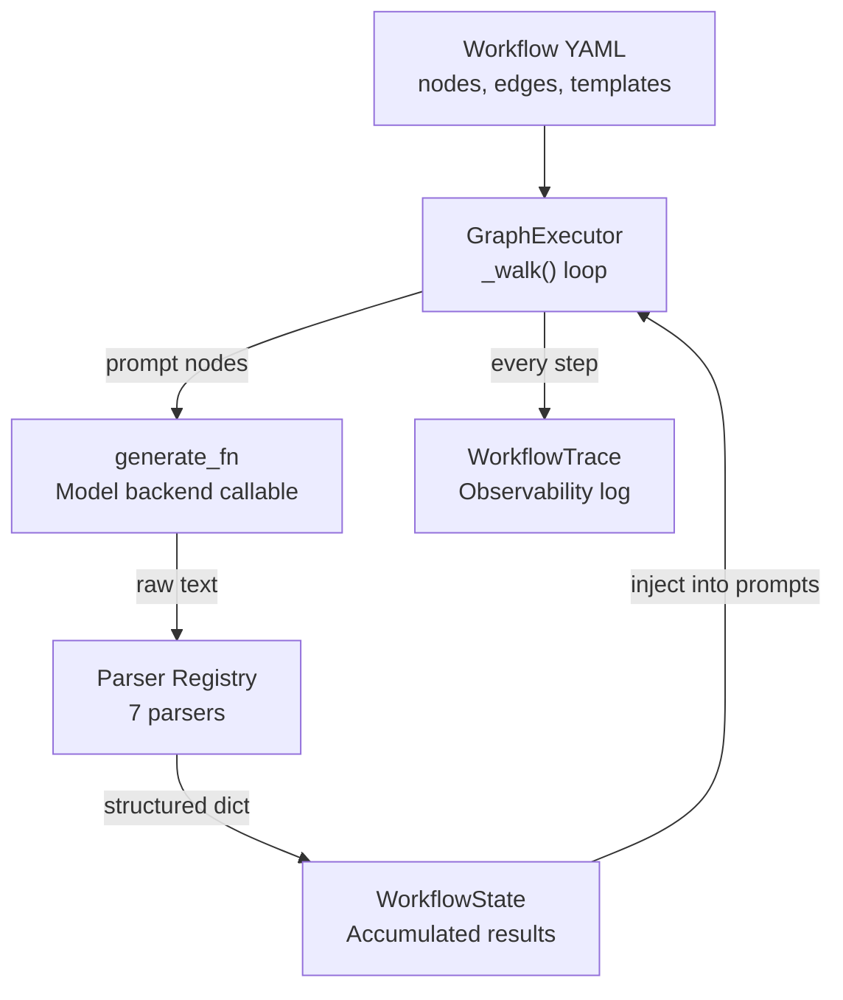
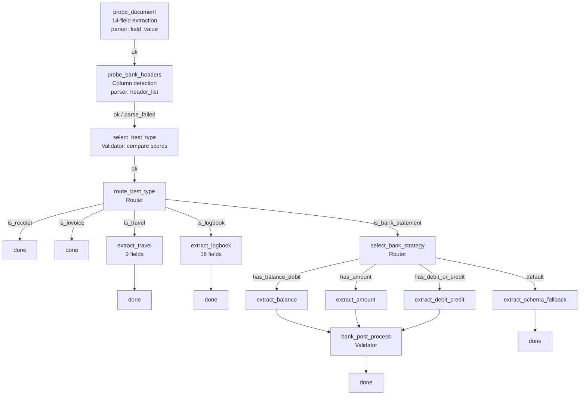
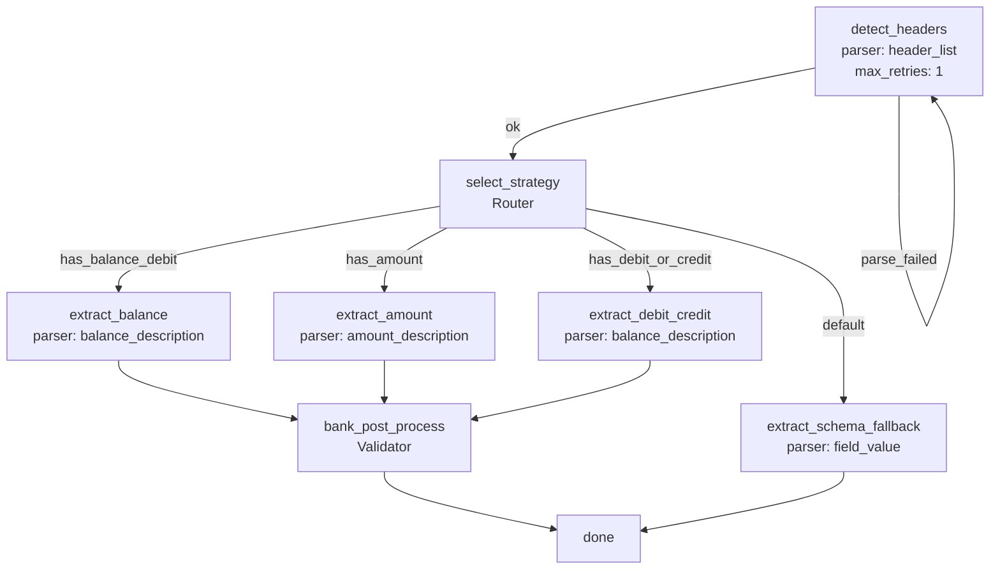
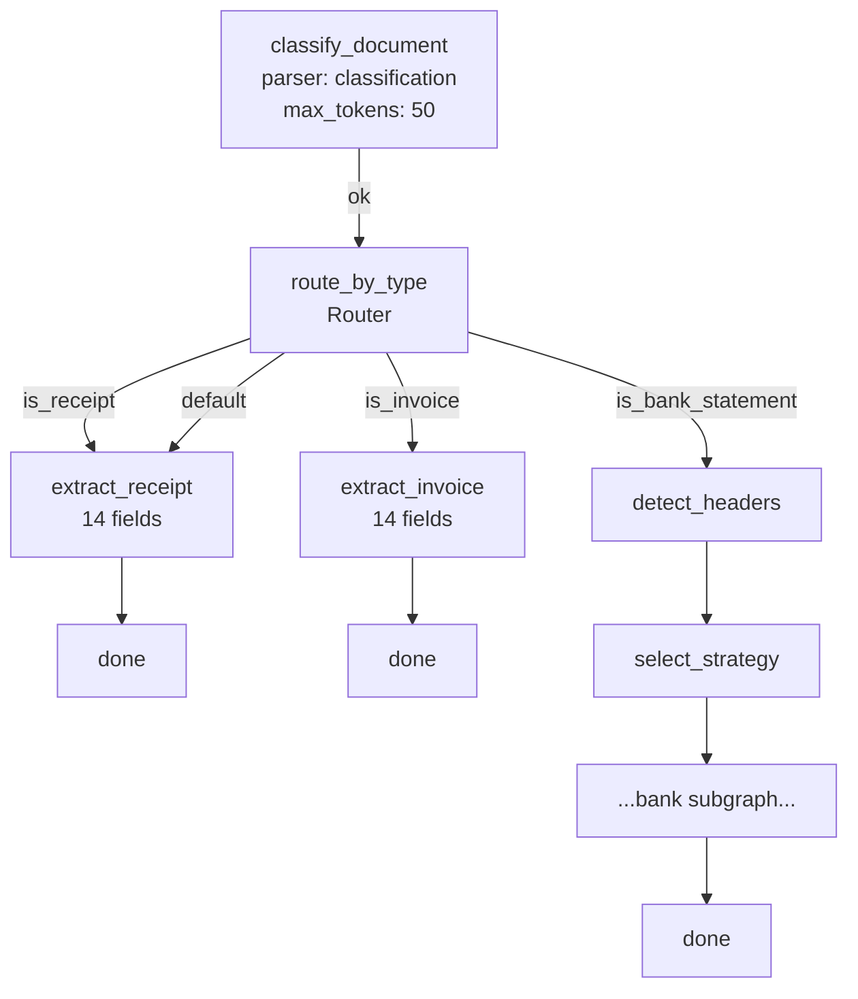
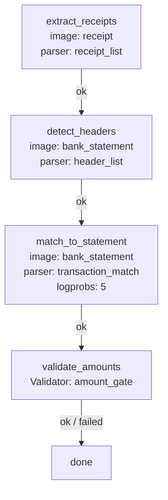
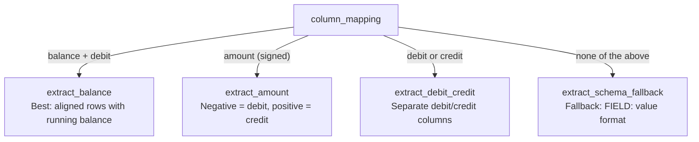

# Agentic Graph-Based Extraction Engine

The graph-based extraction engine replaces the traditional classify-then-extract pipeline with YAML-defined node graphs that walk through probe, classify, extract, validate, and post-process steps in a single coordinated execution. The engine is ~200 lines of Python with no framework dependencies.

## Table of Contents

- [Why Graphs](#why-graphs)
- [Architecture](#architecture)
- [GraphExecutor](#graphexecutor)
  - [Constructor](#constructor)
  - [Public API](#public-api)
  - [The Walk Loop](#the-walk-loop)
  - [Node Execution](#node-execution)
  - [State and Injection](#state-and-injection)
  - [Final Field Assembly](#final-field-assembly)
- [Node Types](#node-types)
  - [Prompt Nodes](#prompt-nodes)
  - [Validator Nodes](#validator-nodes)
  - [Router Nodes](#router-nodes)
- [Parsers](#parsers)
- [Self-Refine Retry](#self-refine-retry)
- [Workflows](#workflows)
  - [Robust Extract](#robust-extract-probe-based-classification)
  - [Bank Extract](#bank-extract)
  - [Unified Extract](#unified-extract)
  - [Transaction Link](#transaction-link-cross-image)
- [Probe-Based Classification](#probe-based-classification)
  - [Scoring Logic](#scoring-logic)
  - [State Cleanup](#state-cleanup)
  - [Document Type Normalisation](#document-type-normalisation)
- [Bank Subgraph](#bank-subgraph)
  - [Header Detection](#header-detection)
  - [Strategy Selection](#strategy-selection)
  - [Extraction Strategies](#extraction-strategies)
  - [Post-Processing](#bank-post-processing)
- [Wiring: stages/extract.py](#wiring-stagesextractpy)
- [Authoring a New Workflow](#authoring-a-new-workflow)
- [Dataclass Reference](#dataclass-reference)

---

## Why Graphs

The classic pipeline has a structural vulnerability: if classification gets the document type wrong, the extraction prompt is for the wrong type and the output is garbage. There is no recovery path.

Graph workflows fix this by making classification and extraction part of the same execution. The robust workflow runs extraction probes for multiple document families and picks the type whose probe extracted the most real fields. The extraction IS the classification -- there is nothing to misclassify.

Additional benefits:

- **Self-refine**: On parse failure, the graph retries with reflection (the error message is fed back as context)
- **Typed state**: `WorkflowState` carries parsed results between nodes, enabling downstream nodes to reference upstream outputs
- **Observability**: `WorkflowTrace` records every node visited, edge taken, retry count, token usage, and timing
- **Declarative**: Workflows are YAML files. Adding a new workflow or modifying an existing one requires no Python changes

---

## Architecture



Key files:

| File | Role |
|------|------|
| `common/graph_executor.py` | GraphExecutor class -- the walk loop |
| `common/extraction_types.py` | Dataclasses: WorkflowState, WorkflowTrace, NodeResult, ExtractionSession |
| `common/turn_parsers.py` | Parser protocol + 7 concrete parsers |
| `common/bank_post_process.py` | Bank validators: `run_bank_post_process()`, `run_select_best_type()` |
| `prompts/workflows/*.yaml` | Workflow definitions |
| `stages/extract.py` | Wiring: builds executors, runs workflows |

---

## GraphExecutor

### Constructor

```python
GraphExecutor(
    generate_fn: Callable[[Image.Image, str, NodeGenParams], GenerateResult],
    parsers: dict[str, TurnParser],
    *,
    default_max_tokens: int = 4096,
    max_graph_steps: int = 20,
)
```

| Parameter | Description |
|-----------|-------------|
| `generate_fn` | Model inference callable. Receives (PIL image, prompt string, generation params). Returns `GenerateResult(text, logprobs?)`. The executor never touches the model directly. |
| `parsers` | Registry of named parsers (e.g. `"field_value"` -> `FieldValueParser()`). Built by `build_parser_registry()`. |
| `default_max_tokens` | Fallback token budget when a node doesn't specify `max_tokens`. |
| `max_graph_steps` | Circuit breaker. If the walk exceeds this many steps, a `RuntimeError` is raised to prevent infinite loops. |

### Public API

```python
executor.run(
    document_type: str,
    definition: dict[str, Any],
    *,
    images: dict[str, str] | None = None,     # cross-image workflows
    image_path: str | None = None,             # single-image workflows
    image_name: str | None = None,
    extra_fields: dict[str, str] | None = None,
) -> ExtractionSession
```

The method dispatches on the shape of `definition`:

| Shape | Mode | Required kwarg |
|-------|------|----------------|
| `{"inputs": [...], "nodes": {...}, ...}` | Cross-image (e.g. transaction linking) | `images` dict mapping input names to file paths |
| `{"nodes": {...}, ...}` | Single-image | `image_path` string |

Returns an `ExtractionSession` containing all node results, final extracted fields, the chosen strategy, and the full trace.

### The Walk Loop

`_walk()` is the core loop. It maintains:

| Variable | Type | Purpose |
|----------|------|---------|
| `state` | `WorkflowState` | Accumulated parsed results from all nodes |
| `trace` | `WorkflowTrace` | Nodes visited, edges taken, timing |
| `retries` | `dict[str, int]` | Retry count per node (for self-refine) |
| `current` | `str` | Current node key |
| `steps` | `int` | Step counter (for circuit breaker) |

**Algorithm:**

```
current = first node in YAML (insertion order)
while current != "done":
    if steps >= max_graph_steps: raise RuntimeError
    node_def = nodes[current]
    trace.nodes_visited.append(current)

    result, edge = execute_node(current, node_def, state, images, retries)
    state.node_results[current] = result

    next_node = node_def["edges"][edge]
    trace.edges_taken.append((current, edge, next_node))
    current = next_node

# Post-processing (declarative steps from YAML)
run_post_processing(workflow_meta.get("post_processing", []), state)

# Build final flat field dict
final_fields = _build_final_fields(document_type, state, extra_fields)
return ExtractionSession(...)
```

The walk terminates when any edge points to the sentinel value `"done"`.

### Node Execution

`_execute_node()` uses structural pattern matching on the node definition dict:

```python
match node_def:
    case {"type": "validator", "check": str(check_name), "edges": dict()}:
        # Run validator function, return (NodeResult, "ok" | "failed")

    case {"type": "router", "edges": dict(edges)}:
        # Evaluate routing logic, return (NodeResult, edge_name)

    case {"template": str(template), "edges": dict(), **rest}:
        # Model call: generate -> parse -> return (NodeResult, edge)
```

### State and Injection

Nodes can inject values from upstream results into their prompt templates using the `inject` key:

```yaml
extract_balance:
  template: |
    Extract transactions from this bank statement.
    The balance column is: {balance_col}
    The description column is: {desc_col}
  inject:
    balance_col: "detect_headers.column_mapping.balance"
    desc_col: "detect_headers.column_mapping.description"
```

**Resolution**: `_resolve_inject()` replaces `{placeholder}` in the template with the value at the dot-path in `WorkflowState`:

```
{balance_col}  <--  inject.balance_col = "detect_headers.column_mapping.balance"
                                          ^^^^^^^^^^^^^^^  ^^^^^^^^^^^^^^^  ^^^^^^^
                                          node key         parsed dict key  nested key
```

**Defaults**: Use pipe syntax for fallback values:

```yaml
inject:
  balance_col: "detect_headers.column_mapping.balance|Balance"
```

If the dot-path resolves to `None`, the default after `|` is used.

**Error handling**: If injection fails (upstream node not found or key missing), a `RuntimeError` is raised with diagnostic details including the first 500 characters of the upstream node's raw response.

### Final Field Assembly

`_build_final_fields()` runs after the walk completes and produces the flat `dict[str, str]` that becomes the extraction output.

**Standard documents** (receipt, invoice, travel, logbook): iterates all `state.node_results`, collects every uppercase, non-underscore-prefixed key from each parsed dict.

**Transaction linking** (when `match_to_statement` or `validate_amounts` exists): builds pipe-delimited fields from the match records:

| Output Field | Source |
|-------------|--------|
| `RECEIPT_DATE` | receipt dates |
| `RECEIPT_DESCRIPTION` | match `RECEIPT_STORE` |
| `RECEIPT_TOTAL` | match `RECEIPT_TOTAL` |
| `BANK_TRANSACTION_DATE` | match `TRANSACTION_DATE` |
| `BANK_TRANSACTION_DESCRIPTION` | match `TRANSACTION_DESCRIPTION` |
| `BANK_TRANSACTION_DEBIT` | match `TRANSACTION_AMOUNT` |
| `BANK_STATEMENT_FILE` | bank statement filename |

---

## Node Types

### Prompt Nodes

A prompt node sends a template to the model and parses the response. This is the most common node type.

```yaml
probe_document:
  template: |
    Extract ALL data from this document image.
    DOCUMENT_TYPE: NOT_FOUND
    SUPPLIER_NAME: NOT_FOUND
    ...
  parser: field_value
  max_tokens: 2048
  edges:
    ok: probe_bank_headers
```

| Key | Required | Default | Description |
|-----|----------|---------|-------------|
| `template` | Yes | -- | Prompt text. May contain `{placeholder}` for injection. |
| `parser` | No | `"field_value"` | Parser name from registry. |
| `max_tokens` | No | `4096` | Token budget for generation. |
| `temperature` | No | `0.0` | Sampling temperature. |
| `stop` | No | `None` | Stop sequences (list of strings). |
| `image` | No | `"primary"` | Which image to use (for cross-image workflows). |
| `max_retries` | No | `0` | Number of self-refine retries on parse failure. |
| `reflection` | No | `None` | Template appended on retry, with `{error}` placeholder. |
| `inject` | No | `{}` | Map of placeholder -> dot-path for state injection. |
| `output_schema` | No | `None` | JSON schema for structured output (bypasses parser). |
| `logprobs` | No | `None` | Number of logprobs to request. |
| `edges` | Yes | -- | Map of edge names to next node keys. |

**Edge convention**: `ok` for successful parse, `parse_failed` for retry loops.

### Validator Nodes

A validator runs a pure-Python function that checks or transforms accumulated state. No model call.

```yaml
bank_post_process:
  type: validator
  check: bank_post_process
  edges:
    ok: done
    failed: done
```

| Key | Required | Description |
|-----|----------|-------------|
| `type` | Yes | Must be `"validator"`. |
| `check` | Yes | Validator function name (dispatched in `_run_validator()`). |
| `edges` | Yes | Map with at least `ok`. May include `failed`. |

**Registered validators:**

| Name | Function | Purpose |
|------|----------|---------|
| `bank_post_process` | `run_bank_post_process()` | Transform bank extraction rows into pipe-delimited schema fields |
| `select_best_type` | `run_select_best_type()` | Compare document probe vs bank probe, pick winner |
| `amount_gate` | `enforce_amount_gate()` | Verify receipt totals match bank debit amounts |

Validators always return `(bool, dict[str, Any])`. The bool determines the edge (`ok` or `failed`), the dict is stored as the node's parsed result.

### Router Nodes

A router selects an edge based on accumulated state. No model call, no new data.

```yaml
route_best_type:
  type: router
  edges:
    is_receipt: done
    is_invoice: done
    is_bank_statement: select_bank_strategy
    is_travel: extract_travel
    is_logbook: extract_logbook
    default: done
```

| Key | Required | Description |
|-----|----------|-------------|
| `type` | Yes | Must be `"router"`. |
| `edges` | Yes | Map of edge names to next node keys. Must include `default`. |

**Routing logic** (`_evaluate_router()`):

1. **Document-type routing**: checks `classify_document` or `select_best_type` nodes for a `DOCUMENT_TYPE` field. Constructs edge name `is_{type_lowercase}` and returns it if it exists in edges.

2. **Column-based routing**: checks `detect_headers` node for `column_mapping`. Returns:
   - `has_balance_debit` if both balance and debit columns detected
   - `has_amount` if amount column detected
   - `has_debit_or_credit` if debit or credit column detected

3. **Fallback**: returns `"default"`.

---

## Parsers

Parsers implement the `TurnParser` protocol:

```python
class TurnParser(Protocol):
    def parse(self, raw_response: str, context: WorkflowState) -> dict[str, Any]: ...
```

They raise `ParseError` when the response cannot be structured. The registry is built by `build_parser_registry()`:

| Name | Class | Input | Output |
|------|-------|-------|--------|
| `field_value` | `FieldValueParser` | `FIELD: value` lines | `{"FIELD": "value", ...}` |
| `header_list` | `HeaderListParser` | Numbered/bullet list of headers | `{"headers": [...], "column_mapping": {"date": ..., "description": ..., ...}}` |
| `classification` | `ClassificationParser` | Free-text doc type | `{"DOCUMENT_TYPE": "RECEIPT", "_raw_classification": "..."}` |
| `receipt_list` | `ReceiptListParser` | `--- RECEIPT N ---` blocks | `{"receipts": [{...}], "formatted_text": "...", "receipt_count": N}` |
| `transaction_match` | `TransactionMatchParser` | `--- RECEIPT N ---` match blocks | `{"matches": [{...}], "match_count": N}` |
| `balance_description` | `BalanceDescriptionParser` | Tabular bank data | `{"rows": [{...}], "date_col": ..., "debit_col": ..., ...}` |
| `amount_description` | `AmountDescriptionParser` | Tabular bank data (signed amounts) | `{"rows": [{...}], "date_col": ..., "amount_col": ..., ...}` |

### HeaderListParser Column Matching

The header parser maps raw column headers to semantic roles using keyword patterns:

| Role | Keywords |
|------|----------|
| `date` | date, trans date, transaction date, value date, posting date |
| `description` | description, details, transaction, particulars, narrative, reference |
| `debit` | debit, withdrawal, withdrawals, dr, money out |
| `credit` | credit, deposit, deposits, cr, money in |
| `balance` | balance, running balance, closing balance |
| `amount` | amount, transaction amount |

Matching: exact prefix first, then substring for multi-word keywords.

---

## Self-Refine Retry

When a prompt node has `max_retries > 0` and a `reflection` template, parse failures trigger a retry loop:

```yaml
detect_headers:
  template: |
    List the column headers in this bank statement's transaction table.
    Output ONLY the headers, one per line, numbered.
  parser: header_list
  max_retries: 1
  reflection: |
    Your previous response could not be parsed:
    {error}
    Please list ONLY the column headers, one per line, numbered.
  edges:
    ok: select_strategy
    parse_failed: detect_headers    # <-- loops back to self
```

**Mechanism:**

1. Parser raises `ParseError`
2. If `attempt <= max_retries` and `reflection` template exists:
   - Store error in `parsed = {"error": str(exc), "raw": text}`
   - Set edge to `"parse_failed"` (loops back to same node)
   - Increment `retries[key]`
3. On retry (attempt > 1):
   - Previous error is retrieved from `state.node_results[key].parsed["error"]`
   - Reflection template is rendered with `{error}` replaced
   - Reflection is appended to the original prompt
4. If retries exhausted:
   - Edge is set to `"ok"` (proceed with error dict as parsed result)
   - Downstream nodes handle the error gracefully

---

## Workflows

### Robust Extract (Probe-Based Classification)

**File**: `prompts/workflows/robust_extract.yaml`
**Flag**: `--graph-robust`
**Purpose**: Eliminate misclassification by using extraction as classification.



**Model calls per document type:**

| Type | Calls | Nodes Hit |
|------|-------|-----------|
| Receipt | 2 | probe_document, probe_bank_headers |
| Invoice | 2 | probe_document, probe_bank_headers |
| Travel | 3 | probe_document, probe_bank_headers, extract_travel |
| Logbook | 3 | probe_document, probe_bank_headers, extract_logbook |
| Bank Statement | 4 | probe_document, probe_bank_headers, detect_headers (reused), extract_* |

For receipt/invoice, the probe_document node already extracts all 14 fields. No additional extraction call is needed -- the probe's fields flow directly to final output.

### Bank Extract

**File**: `prompts/workflows/bank_extract.yaml`
**Flag**: `--graph-bank`
**Purpose**: Graph-based bank statement extraction as an alternative to the legacy `UnifiedBankExtractor`.



This is the same bank subgraph used inside `robust_extract.yaml`. When used standalone via `--graph-bank`, the document is already classified as a bank statement by Stage 1 (classify).

### Unified Extract

**File**: `prompts/workflows/unified_extract.yaml`
**Flag**: `--graph-unified`
**Purpose**: Classify and extract in a single graph pass. Lighter than robust (1 classification call instead of 2 probes) but vulnerable to misclassification.



### Transaction Link (Cross-Image)

**File**: `prompts/workflows/transaction_link.yaml`
**Flag**: programmatic (not exposed via CLI flag)
**Purpose**: Match receipts to bank statement debit transactions across two images.



This is the only cross-image workflow. It declares two inputs in the YAML:

```yaml
inputs:
  - name: receipt
    type: image
  - name: bank_statement
    type: image
```

Nodes reference their image via the `image` key (e.g. `image: receipt`, `image: bank_statement`).

**Matching rules** (enforced by prompt and `amount_gate` validator):
1. **Strict amount matching** (first gate): receipt total must be numerically equal to bank debit
2. **Description matching**: receipt store name should appear in bank transaction description
3. **Date matching**: same day or up to 5 business days later
4. **Amount gate validator**: post-hoc verification that parsed amounts actually match (catches model hallucinations where it reports MATCH despite different amounts)

**Post-processing**: dedup by `RECEIPT_STORE` to prevent duplicate matches.

---

## Probe-Based Classification

The `select_best_type` validator (`common/bank_post_process.py`) implements the "extraction IS classification" strategy.

### Scoring Logic

```python
def run_select_best_type(state: WorkflowState) -> tuple[bool, dict[str, Any]]:
```

**Document probe score**: Count non-`NOT_FOUND`, uppercase, non-underscore fields from `probe_document.parsed`. Maximum ~15.

**Bank probe score**: Count non-`None` values in `probe_bank_headers.parsed["column_mapping"]`. Maximum ~6 (date, description, debit, credit, balance, amount).

**Decision rule**:

```
if bank_score >= 3 AND doc_score < 6:
    best_type = "BANK_STATEMENT"
else:
    best_type = normalize(probe_document.DOCUMENT_TYPE)
```

The threshold is deliberately asymmetric: bank statements have sparse field extraction (most receipt/invoice fields come back as NOT_FOUND) and rich column detection. A bank score of 3+ with a low document score is a strong signal.

### State Cleanup

When the winner is determined, the loser's results are removed from state to prevent field leakage into `_build_final_fields()`:

| Winner | Cleanup |
|--------|---------|
| Bank | Delete `probe_document` from state. Rename `probe_bank_headers` to `detect_headers` so the bank subgraph's inject paths resolve correctly. |
| Document | Delete `probe_bank_headers` from state. Keep `probe_document` -- its fields ARE the final output. |

### Document Type Normalisation

`_normalize_doc_type()` maps the model's free-text `DOCUMENT_TYPE` field to a canonical type:

| Raw Value | Normalised |
|-----------|-----------|
| `RECEIPT` | `RECEIPT` |
| `INVOICE`, `TAX INVOICE`, `CREDIT NOTE`, `QUOTE` | `INVOICE` |
| `BANK_STATEMENT`, `CREDIT CARD STATEMENT` | `BANK_STATEMENT` |
| `TRAVEL`, `ITINERARY`, `BOARDING PASS`, `E-TICKET` | `TRAVEL` |
| `LOGBOOK`, `VEHICLE LOGBOOK`, `MILEAGE LOG` | `LOGBOOK` |
| Anything else | `RECEIPT` (fallback) |

**Receipt override**: If the document probe extracted a non-NOT_FOUND `PAYMENT_DATE` field, the type is forced to `RECEIPT` regardless of what the model said. Payment date is a strong receipt signal (invoices have due dates, not payment dates).

---

## Bank Subgraph

The bank subgraph handles the complexity of extracting transactions from bank statements, which vary widely in column structure.

### Header Detection

The `detect_headers` node asks the model to list column headers from the statement's transaction table:

```
List the column headers in this bank statement's transaction table.
Output ONLY the headers, one per line, numbered.
```

The `HeaderListParser` maps raw headers to semantic roles:

```
1. Date                    -> date
2. Transaction Details     -> description
3. Debit                   -> debit
4. Credit                  -> credit
5. Balance                 -> balance
```

Self-refine: `max_retries: 1` with reflection. If the parser can't extract headers, it retries with the error message appended.

### Strategy Selection

The `select_bank_strategy` router (or `select_strategy` in standalone bank_extract.yaml) picks the extraction strategy based on which columns were detected:



| Edge | Condition | Strategy |
|------|-----------|----------|
| `has_balance_debit` | `balance` AND `debit` both detected | Best case: debit amounts + running balance for verification |
| `has_amount` | `amount` detected | Signed amount column: negative = withdrawal |
| `has_debit_or_credit` | `debit` OR `credit` detected | Separate columns without balance |
| `default` | Nothing useful detected | Schema fallback: extract as flat fields |

### Extraction Strategies

Each strategy node injects the detected column names into its prompt:

**extract_balance**: Asks model to extract rows as `date | description | debit | credit | balance`. Parser: `balance_description`. Post-process: chronological sorting, balance correction via `BalanceCorrector`, debit filtering via `TransactionFilter.filter_debits()`.

**extract_amount**: Asks model to extract rows with a signed amount column. Parser: `amount_description`. Post-process: filter to negative amounts only (debits) via `TransactionFilter.filter_negative_amounts()`.

**extract_debit_credit**: Like extract_balance but without balance column. Parser: `balance_description`. Post-process: debit filtering.

**extract_schema_fallback**: Asks model to extract debit transactions as `FIELD: value` pairs. Parser: `field_value`. No post-processing (already in final format).

### Bank Post-Processing

The `bank_post_process` validator transforms parsed rows into the final pipe-delimited schema:

```python
# Input: list of row dicts from parser
{"Date": "03/05/2025", "Description": "Coffee Shop", "Debit": "$4.50", ...}

# Output: pipe-delimited schema fields
{
    "DOCUMENT_TYPE": "BANK_STATEMENT",
    "STATEMENT_DATE_RANGE": "01/05/2025 - 31/05/2025",
    "TRANSACTION_DATES": "03/05/2025 | 07/05/2025 | ...",
    "LINE_ITEM_DESCRIPTIONS": "Coffee Shop | Groceries | ...",
    "TRANSACTION_AMOUNTS_PAID": "$4.50 | $52.30 | ...",
    "ACCOUNT_BALANCE": "$1,245.67 | $1,193.37 | ...",
}
```

Steps:
1. Detect which extraction strategy produced the data
2. For balance strategy: sort chronologically, correct balances, filter to debits
3. Align arrays (dates, descriptions, amounts, balances)
4. Compute date range from first and last transaction dates
5. Join each array with ` | ` separator

The validator always returns `(True, fields)` -- it transforms but never rejects.

---

## Wiring: stages/extract.py

The extract stage builds and runs graph executors via helper functions:

### Building an Executor

```python
def _build_unified_executor(processor, workflow_name="unified_extract.yaml"):
    # 1. Load YAML
    yaml_path = Path("prompts/workflows") / workflow_name
    definition = yaml.safe_load(yaml_path.read_text())

    # 2. Create generate_fn that wraps the model backend
    def generate_fn(image, prompt, params):
        text = processor.generate(image, prompt, max_tokens=params.max_tokens, ...)
        return GenerateResult(text=text)

    # 3. Build executor with parser registry
    executor = GraphExecutor(generate_fn, build_parser_registry())
    return executor, definition
```

### Running a Workflow

```python
# For each image:
session = executor.run(
    document_type="UNKNOWN",     # robust/unified determines type during walk
    definition=definition,
    image_path=str(image_path),
    image_name=image_path.name,
)

# Write result
writer.write_record({
    "image_name": session.image_name,
    "image_path": session.image_path,
    "document_type": session.document_type,
    "extracted_data": session.final_fields,
    "prompt_used": f"graph_robust_{session.strategy}",
})
```

### CLI Flags

| Flag | Executor Builder | Workflow YAML |
|------|-----------------|---------------|
| `--graph-robust` | `_build_unified_executor(processor, "robust_extract.yaml")` | `robust_extract.yaml` |
| `--graph-unified` | `_build_unified_executor(processor)` | `unified_extract.yaml` |
| `--graph-bank` | `_build_graph_bank_executor(processor)` | `bank_extract.yaml` |

The `--graph-robust` and `--graph-unified` flags skip the classification stage entirely -- images are discovered directly from `--data-dir`. The `--graph-bank` flag requires `--classifications` from a prior classify stage.

---

## Authoring a New Workflow

### Step 1: Define the graph in YAML

Create `prompts/workflows/my_workflow.yaml`:

```yaml
name: my_workflow
description: >
  Brief description of what this workflow does.

nodes:
  # First node is the start node (YAML insertion order)
  step_one:
    template: |
      Your prompt template here.
      Use {placeholder} for injected values.
    parser: field_value          # or any registered parser
    max_tokens: 2048
    edges:
      ok: step_two

  step_two:
    template: |
      Another prompt. Previous result: {prev_value}
    inject:
      prev_value: "step_one.SOME_FIELD"
    parser: field_value
    max_tokens: 1024
    edges:
      ok: my_validator

  my_validator:
    type: validator
    check: my_check_name
    edges:
      ok: done
      failed: done

# Optional declarative post-processing
post_processing:
  - type: dedup
    field: SOME_FIELD
```

### Step 2: Register a new validator (if needed)

Add to `_run_validator()` in `common/graph_executor.py`:

```python
case "my_check_name":
    from common.my_module import run_my_check
    return run_my_check(state)
```

The function must return `tuple[bool, dict[str, Any]]`.

### Step 3: Register a new parser (if needed)

Add to `build_parser_registry()` in `common/turn_parsers.py`:

```python
def build_parser_registry() -> dict[str, TurnParser]:
    return {
        # ... existing parsers ...
        "my_parser": MyParser(),
    }
```

The parser must implement `parse(raw_response: str, context: WorkflowState) -> dict[str, Any]`.

### Step 4: Wire up in stages/extract.py

Add a new flag and builder:

```python
# In main():
@app.command()
def main(
    # ... existing flags ...
    my_workflow: bool = typer.Option(False, "--my-workflow/--no-my-workflow"),
):
    if my_workflow:
        return _run_unified(
            image_dir, output, workflow_name="my_workflow.yaml", label="my_workflow",
            model_type=model, verbose=verbose, debug=debug, config_path=config,
        )
```

### Step 5: Add to entrypoint.sh (optional)

If the workflow should be available as a `KFP_TASK`:

```bash
run_my_workflow)
    log "Mode: my_workflow (3-stage pipeline)."
    # ... same pattern as run_graph_robust ...
    python3 -m stages.extract \
      --data-dir "${image_dir:?}" \
      --output-dir "$RAW_EXTRACTIONS" \
      --my-workflow \
      "${OPT_MODEL[@]}" || exit $?
    # ... clean, evaluate ...
    ;;
```

### Checklist

| What | File | Action |
|------|------|--------|
| Workflow graph | `prompts/workflows/my_workflow.yaml` | Create |
| Validator (if new) | `common/graph_executor.py` | Add case to `_run_validator()` |
| Validator logic (if new) | `common/my_module.py` | Create function returning `(bool, dict)` |
| Parser (if new) | `common/turn_parsers.py` | Add class + registry entry |
| CLI flag | `stages/extract.py` | Add typer option + dispatch |
| Entrypoint (optional) | `entrypoint.sh` | Add KFP_TASK case |
| Run script (optional) | `scripts/run_my_workflow.sh` | Create |

---

## Dataclass Reference

Defined in `common/extraction_types.py`:

### WorkflowState

Accumulated state across all nodes in a graph walk.

| Attribute | Type | Description |
|-----------|------|-------------|
| `node_results` | `dict[str, NodeResult]` | Parsed results keyed by node name |

| Method | Signature | Description |
|--------|-----------|-------------|
| `has(key)` | `(str) -> bool` | Whether a node result exists |
| `get(dot_path)` | `(str) -> Any` | Dot-path access: `"node.field.subfield"` |

### NodeResult

Result of executing a single node.

| Field | Type | Description |
|-------|------|-------------|
| `key` | `str` | Node name |
| `image_ref` | `str` | Which image was used (`"primary"`, `"receipt"`, etc.) |
| `prompt_sent` | `str` | Full prompt after injection |
| `raw_response` | `str` | Raw model output (empty for validators/routers) |
| `parsed` | `dict[str, Any]` | Structured output from parser |
| `elapsed` | `float` | Wall-clock seconds |
| `attempt` | `int` | Attempt number (1 = first try, 2+ = retry) |
| `edge_taken` | `str` | Which edge was selected |

### WorkflowTrace

Observability record of the graph walk.

| Field | Type | Description |
|-------|------|-------------|
| `nodes_visited` | `list[str]` | Node keys in execution order |
| `edges_taken` | `list[tuple[str, str, str]]` | `(from_node, edge_name, to_node)` |
| `total_model_calls` | `int` | Count of actual generation calls |
| `total_elapsed` | `float` | Sum of all node elapsed times |
| `retries` | `dict[str, int]` | Retry counts per node |

### ExtractionSession

Final output of a graph walk.

| Field | Type | Description |
|-------|------|-------------|
| `image_path` | `str` | Path to the primary image |
| `image_name` | `str` | Image filename |
| `document_type` | `str` | Determined document type |
| `node_results` | `list[NodeResult]` | All node results in execution order |
| `final_fields` | `dict[str, str]` | Flat extraction output |
| `strategy` | `str` | Last model-call node key (e.g. `"extract_balance"`) |
| `trace` | `WorkflowTrace` | Full observability trace |
| `input_images` | `dict[str, str]` | Image paths keyed by input name |

### NodeGenParams

Generation parameters passed to `generate_fn`.

| Field | Type | Default | Description |
|-------|------|---------|-------------|
| `max_tokens` | `int` | `4096` | Token budget |
| `temperature` | `float` | `0.0` | Sampling temperature |
| `stop` | `list[str] \| None` | `None` | Stop sequences |
| `output_schema` | `dict \| None` | `None` | JSON schema for structured output |
| `logprobs` | `int \| None` | `None` | Number of logprobs to request |

### GenerateResult

Return type from `generate_fn`.

| Field | Type | Description |
|-------|------|-------------|
| `text` | `str` | Generated text |
| `logprobs` | `Any \| None` | Token logprobs (if requested) |
