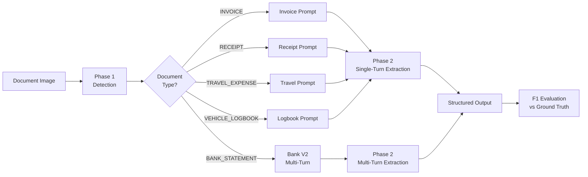
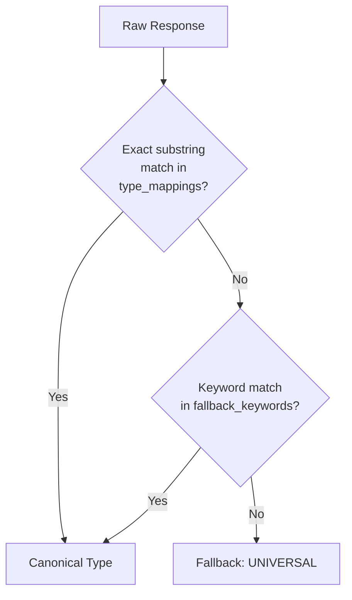
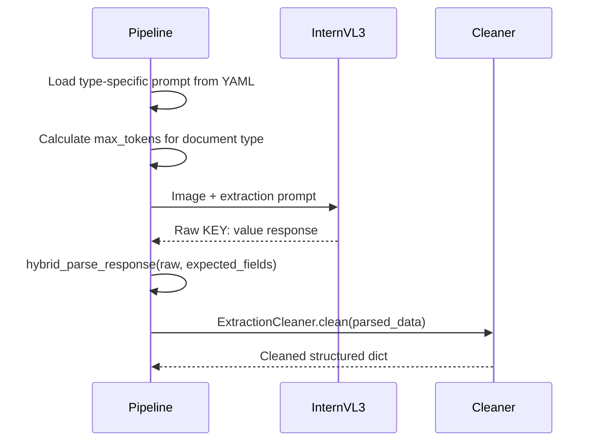
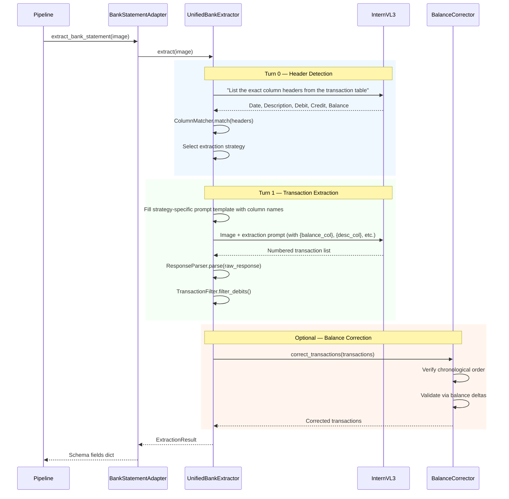
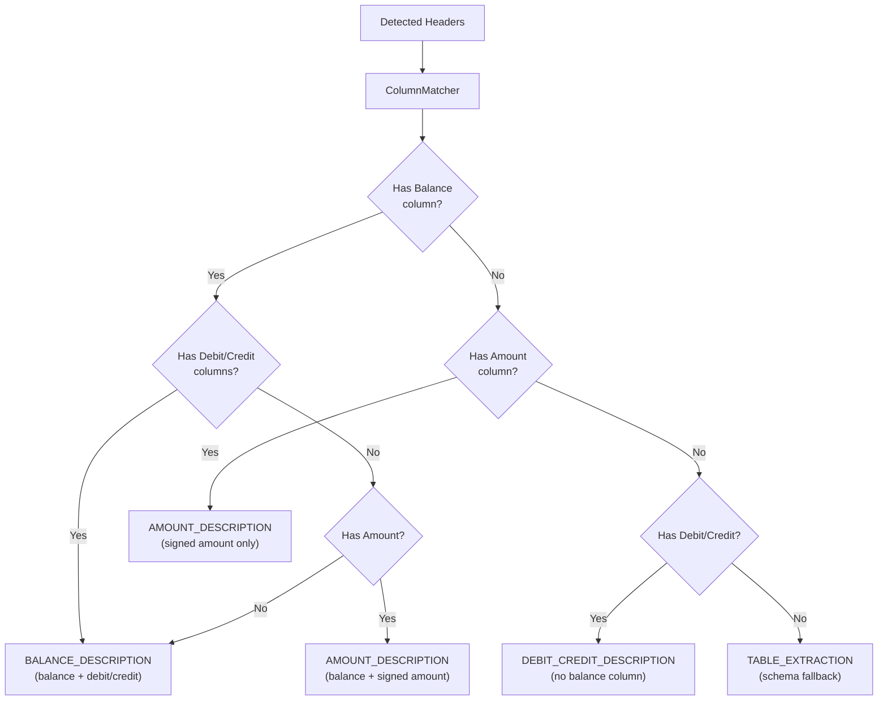
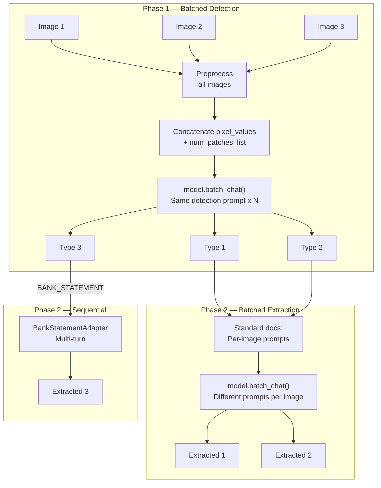
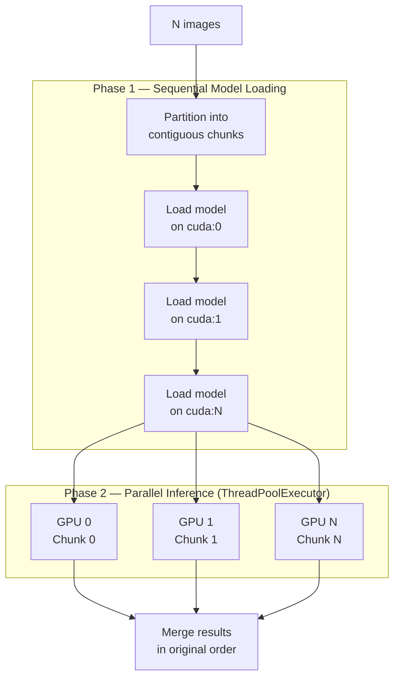
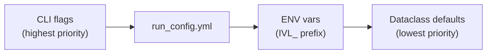

# InternVL3 Document Extraction Pipeline

## Overview

This system uses **InternVL3.5-8B** (0.3B vision encoder + 8.2B language model) to extract structured fields from scanned business documents. The pipeline operates in two phases — **detection** (classify the document type) then **extraction** (apply a type-specific prompt to pull structured fields) — with a specialised multi-turn path for bank statements.



---

## Phase 1: Document Classification

A single detection prompt is sent with the image. The model responds with a document type label, which is normalised via YAML-driven mappings.

### Detection Prompt

```text
What type of business document is this?

Answer with one of:
- INVOICE (includes bills, quotes, estimates)
- RECEIPT (includes purchase receipts)
- BANK_STATEMENT (includes credit card statements)
- TRAVEL_EXPENSE (includes boarding passes, airline tickets, train/bus tickets)
- VEHICLE_LOGBOOK (includes motor vehicle logbooks, mileage logs, trip logs for ATO)
```

### Generation Parameters (Detection)

| Parameter | Value | Rationale |
|-----------|-------|-----------|
| `max_new_tokens` | 200 | Short classification response |
| `temperature` | 0.1 | Near-deterministic for consistency |
| `do_sample` | False | Greedy decoding |

### Type Resolution

The raw model response is resolved to a canonical type through a three-stage cascade:



The `type_mappings` dictionary maps variations (e.g. `"credit card statement"` -> `BANK_STATEMENT`), while `fallback_keywords` provides a second chance via keyword lists per type.

---

## Phase 2: Type-Specific Extraction

Each document type has a dedicated extraction prompt that specifies the exact fields and formatting rules. The model receives the image + prompt and returns a structured `KEY: value` response.

### Generation Parameters (Extraction)

| Parameter | Value | Rationale |
|-----------|-------|-----------|
| `max_new_tokens` | Dynamic per type | Bank statements need ~1500 tokens; invoices ~600 |
| `temperature` | 0.0 | Deterministic extraction |
| `do_sample` | False | Greedy decoding |
| `use_cache` | True | KV-cache for efficiency |

---

### Extracted Fields by Document Type

#### INVOICE (14 fields)

- `DOCUMENT_TYPE`, `BUSINESS_ABN`, `SUPPLIER_NAME`, `BUSINESS_ADDRESS`
- `PAYER_NAME`, `PAYER_ADDRESS`, `INVOICE_DATE`
- `LINE_ITEM_DESCRIPTIONS`, `LINE_ITEM_QUANTITIES`, `LINE_ITEM_PRICES`, `LINE_ITEM_TOTAL_PRICES`
- `IS_GST_INCLUDED`, `GST_AMOUNT`, `TOTAL_AMOUNT`

**Formatting rules:** ABN as 11 digits (no spaces). Dates as DD/MM/YYYY. Line items pipe-separated. Amounts as `$X.XX`.

#### RECEIPT (14 fields)

Same schema as INVOICE. `INVOICE_DATE` represents the transaction date.

#### TRAVEL_EXPENSE (9 fields)

- `DOCUMENT_TYPE`, `PASSENGER_NAME`, `SUPPLIER_NAME`
- `TRAVEL_MODE` (plane/train/bus/taxi/uber/ferry)
- `TRAVEL_ROUTE` (pipe-separated legs), `TRAVEL_DATES` (DD Mon YYYY)
- `INVOICE_DATE` (issue date, distinct from travel date)
- `GST_AMOUNT`, `TOTAL_AMOUNT`

#### VEHICLE_LOGBOOK (16 fields)

- `DOCUMENT_TYPE`, `VEHICLE_MAKE`, `VEHICLE_MODEL`, `VEHICLE_REGISTRATION`, `ENGINE_CAPACITY`
- `LOGBOOK_PERIOD_START`, `LOGBOOK_PERIOD_END`
- `ODOMETER_START`, `ODOMETER_END`, `TOTAL_KILOMETERS`
- `BUSINESS_KILOMETERS`, `BUSINESS_USE_PERCENTAGE`
- `JOURNEY_DATES`, `JOURNEY_DISTANCES`, `JOURNEY_PURPOSES`

**Formatting rules:** Odometer as integer km. Business percentage as decimal.

#### BANK_STATEMENT (5 fields)

- `DOCUMENT_TYPE`, `STATEMENT_DATE_RANGE`
- `LINE_ITEM_DESCRIPTIONS`, `TRANSACTION_DATES`, `TRANSACTION_AMOUNTS_PAID`

Extracted via multi-turn strategy (see below).

### Standard Document Flow (Invoice / Receipt / Travel / Logbook)



The prompt instructs the model to return data as labelled key-value pairs:

```text
SUPPLIER_NAME: Acme Pty Ltd
BUSINESS_ABN: 12345678901
INVOICE_DATE: 15/03/2026
LINE_ITEM_DESCRIPTIONS: Widget A | Widget B | Service Fee
LINE_ITEM_PRICES: $10.00 | $25.00 | $50.00
TOTAL_AMOUNT: $85.00
```

Missing fields are returned as `NOT_FOUND` — a sentinel that the evaluation layer handles explicitly.

---

## Bank Statement Extraction (Multi-Turn)

Bank statements are the most complex document type. They contain tabular transaction data with highly variable layouts across financial institutions. A specialised multi-turn strategy replaces the single-prompt approach.

### Why Multi-Turn?

| Challenge | Single-Turn Problem | Multi-Turn Solution |
|-----------|-------------------|---------------------|
| Variable column layouts | Model guesses column semantics | Turn 0 detects actual column headers |
| Debit vs credit ambiguity | Misclassified transaction direction | Strategy-specific prompts with column names |
| Long transaction tables | Truncated output | Dedicated extraction turn with high token budget |
| Balance column presence | One prompt can't handle all formats | Strategy selection adapts to layout |

### Multi-Turn Architecture



### Strategy Selection

After Turn 0 identifies the column headers, the `ColumnMatcher` maps them to semantic types. The extraction strategy is then selected based on which columns are present:



| Strategy | When Used | Prompt Template |
|----------|-----------|-----------------|
| `BALANCE_DESCRIPTION` | Balance + Debit/Credit columns present | Requests numbered list with date, description, debit/credit, balance |
| `AMOUNT_DESCRIPTION` | Signed Amount column (negative = debit) | Requests numbered list; negative amounts = withdrawals |
| `DEBIT_CREDIT_DESCRIPTION` | Debit/Credit but no Balance column | Extracts debits only; skips Opening/Closing Balance rows |
| `TABLE_EXTRACTION` | Column detection failed entirely | Direct schema-based fallback; returns 5 standard fields |

### Balance Correction

An optional post-processing step uses **balance arithmetic** to correct debit/credit misclassification:

1. Sort transactions chronologically (detect and reverse if in reverse-chronological order)
2. For each adjacent pair: `delta = balance[i] - balance[i-1]`
3. If delta sign contradicts the transaction type, reclassify
4. Report correction statistics

This exploits the accounting invariant that the running balance must be consistent with individual transaction amounts.

---

## Batched Inference

For non-bank documents, the pipeline supports **batched inference** via InternVL3's `batch_chat()` API, processing multiple images in a single forward pass.



**OOM resilience**: If a batch fails with `OutOfMemoryError`, the batch is split in half and retried recursively until `batch_size=1`. GPU memory is freed *outside* the except block to avoid Python traceback reference pinning.

---

## Multi-GPU Parallelism

When multiple GPUs are available (`--num-gpus N`, or `0` for auto-detect), the `MultiGPUOrchestrator` distributes images across GPUs with an independent model replica on each.



### Design Choices

- **ThreadPoolExecutor, not multiprocessing.** PyTorch releases the GIL during CUDA kernel execution, so threads give true GPU parallelism without the serialization overhead of process-based IPC. Each thread drives an independent model on a pinned `cuda:K` device.
- **Sequential loading, parallel inference.** Model loading is serialized behind a lock to avoid race conditions in the `transformers` lazy-import machinery. Once all models are loaded, inference runs fully parallel.
- **Contiguous partitioning.** Images are split into equal contiguous chunks (not interleaved), so results can be concatenated back in original order without resorting.
- **Result merging.** `batch_results` and `processing_times` are concatenated. Document type counts are summed across GPUs. Batch statistics (timings, throughput) are averaged.

### Configuration

| Parameter | Source | Default |
| --------- | ------ | ------- |
| `num_gpus` | CLI `--num-gpus` / YAML `processing.num_gpus` | `0` (auto-detect all) |
| `device_map` | Per-GPU override | `cuda:0`, `cuda:1`, ... |
| `batch_size` | Per-GPU (same value) | Auto-detected from VRAM |

When `num_gpus=1` or only one GPU is detected, the orchestrator is bypassed and the pipeline runs on a single device.

---

## Evaluation

Extracted fields are compared against ground truth CSV files using position-aware F1 scoring.

| Field Category | Comparison Method |
|----------------|-------------------|
| Monetary (`GST_AMOUNT`, `TOTAL_AMOUNT`) | Numeric match with 1% tolerance |
| Boolean (`IS_GST_INCLUDED`) | Normalised true/false/yes/no |
| Date (`INVOICE_DATE`, `STATEMENT_DATE_RANGE`) | Date-aware parsing (handles month names, day prefixes, ranges) |
| ID (`BUSINESS_ABN`) | Exact match after stripping labels and spaces |
| Text (`SUPPLIER_NAME`, `PAYER_NAME`) | Levenshtein similarity (ANLS-style, threshold 0.5) |
| Lists (`LINE_ITEM_DESCRIPTIONS`, `TRANSACTION_DATES`) | Position-by-position with fuzzy matching (0.75 threshold) |

The primary metric is **median F1** across all fields for a document, with a pass threshold of 0.8.

---

## Configuration Cascade

All tuneable parameters follow a strict precedence order, with no hardcoded values in Python code:



| Config Source | Controls |
|---|---|
| `config/run_config.yml` | Model path, dtype, max_tiles, batch sizes, generation params, GPU thresholds |
| `config/field_definitions.yaml` | Fields per document type, min_tokens, evaluation thresholds, critical fields |
| `prompts/document_type_detection.yaml` | Detection prompts, type mappings, fallback type |
| `prompts/internvl3_prompts.yaml` | Extraction prompts per document type |
| `config/bank_prompts.yaml` | Multi-turn bank extraction prompt templates |
| `config/bank_column_patterns.yaml` | Header-to-semantic-column matching patterns |

---

## Key Architectural Decisions

| Decision | Rationale |
|----------|-----------|
| **Two-phase pipeline** (detect then extract) | Type-specific prompts yield higher accuracy than a universal prompt; detection is cheap (~200 tokens) |
| **YAML-driven prompts** | Prompts are iterable without code changes; version-controlled separately from logic |
| **Multi-turn bank extraction** | Bank statement layouts vary wildly across institutions; adaptive strategy selection handles this diversity |
| **Balance correction as post-processing** | Exploits accounting invariants to catch model errors without additional inference cost |
| **Greedy decoding (temperature=0)** | Extraction is deterministic — we want the most likely field value, not creative variation |
| **Duck-typed processor interface** | Adding a new model (e.g. Qwen3-VL) requires implementing `generate()`, `detect_and_classify_document()`, `process_document_aware()` — no base class coupling beyond that |
| **Batch inference with OOM fallback** | Maximises GPU throughput while gracefully degrading under memory pressure |
| **Threads over processes for multi-GPU** | PyTorch releases the GIL during CUDA kernels; threads avoid IPC serialization overhead while giving true GPU parallelism |
| **Config cascade (CLI > YAML > ENV > defaults)** | Reproducible runs via YAML; easy overrides via CLI for experimentation |
| **Position-aware F1 over set-based F1** | Line item order matters for downstream accounting systems; set-based metrics would miss ordering errors |
