# InternVL3.5-38B on 4xA10G: vLLM Tensor Parallelism Deep Dive

## 1. Executive Summary

This document explains how InternVL3.5-38B (~77 GB in BF16) is distributed across
a cluster of 4x NVIDIA A10G GPUs (24 GiB each, 96 GiB total) using vLLM's tensor
parallelism engine. It covers the model architecture, the sharding strategy, the
inference pipeline, and the memory budget. Appendices provide deeper treatment of
the InternVL3 architecture, attention backends, and PagedAttention.

---

## 2. Cluster Topology

| Resource | Specification |
|----------|---------------|
| GPUs | 4x NVIDIA A10G (Ampere) |
| VRAM per GPU | 24 GiB GDDR6X |
| Total VRAM | 96 GiB |
| Interconnect | PCIe Gen4 (no NVLink) |
| Model | InternVL3.5-38B (~77 GB BF16) |
| Inference engine | vLLM 0.18 with tensor parallelism (TP=4) |

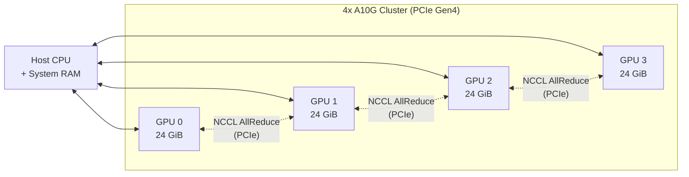

> **Note:** Without NVLink, inter-GPU communication uses PCIe, which is slower than
> NVLink-equipped systems (e.g., A100/H100). This makes AllReduce operations the
> primary bottleneck. vLLM minimises these by placing AllReduce only at layer
> boundaries (2 per transformer layer: post-attention and post-FFN).

---

## 3. InternVL3.5 Architecture Overview

InternVL3.5 is a vision-language model (VLM) with three components:

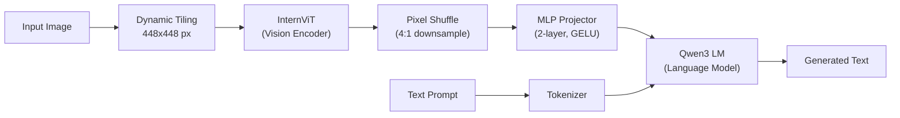

| Component | Parameters | Role |
|-----------|-----------|------|
| InternViT (Vision Encoder) | ~300M--6B | Encodes image tiles into visual token embeddings |
| MLP Projector | ~100M | Bridges vision encoder output dim to LM hidden dim |
| Qwen3 Language Model | ~32B | Autoregressive text generation conditioned on visual + text tokens |

### Dynamic Resolution Tiling

Rather than resizing all images to a fixed resolution, InternVL3 splits the input
image into multiple 448x448 tiles plus a thumbnail of the full image:

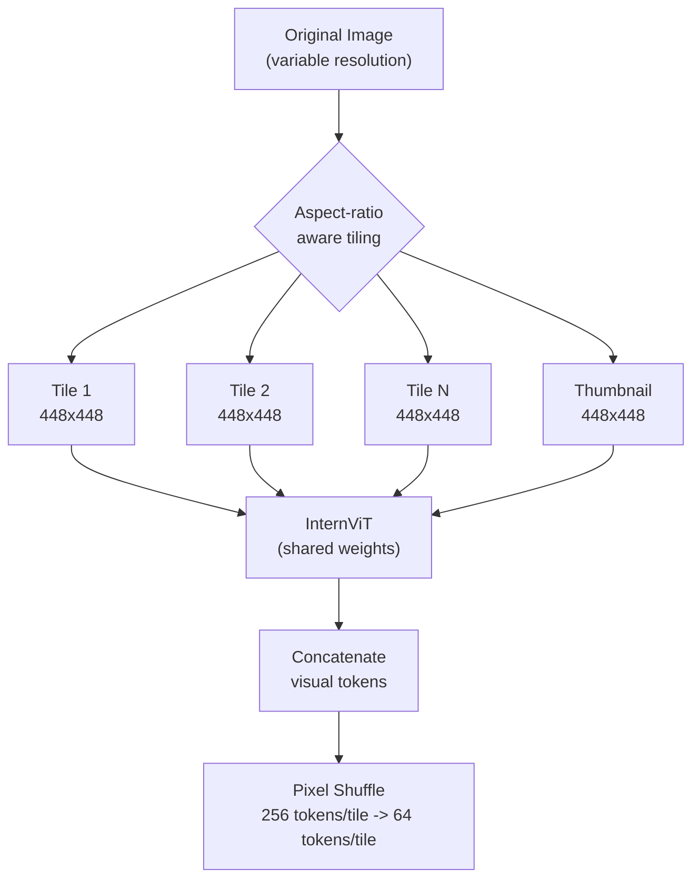

Each tile produces 256 visual tokens from the ViT, which pixel shuffle reduces to
64 tokens per tile. With `max_tiles=18`, one image can produce up to
18 x 64 = 1,152 visual tokens fed to the language model.

---

## 4. Tensor Parallelism: How Weights Are Distributed

Tensor parallelism (TP) shards **each transformer layer's weight matrices** across
all 4 GPUs. Every GPU holds a slice of every layer -- this is fundamentally
different from pipeline parallelism, which assigns whole layers to different GPUs.

### 4.1 Sharding Strategy

For each transformer layer in the Qwen3 language model:

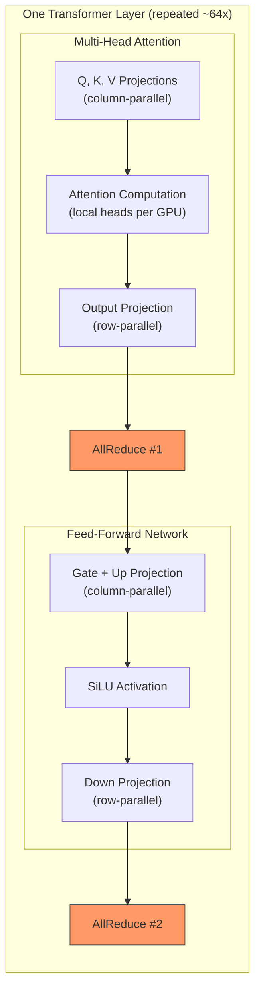

| Operation | Sharding | Communication |
|-----------|----------|---------------|
| Q, K, V projection | Column-parallel: each GPU gets `hidden_dim / 4` columns | None (independent) |
| Attention heads | Each GPU computes its local `num_heads / 4` heads | None (independent) |
| Output projection | Row-parallel: each GPU multiplies partial result | AllReduce to sum |
| Gate/Up projection | Column-parallel: each GPU gets `ffn_dim / 4` columns | None (independent) |
| Down projection | Row-parallel: each GPU multiplies partial result | AllReduce to sum |

### 4.2 Per-GPU Weight Distribution

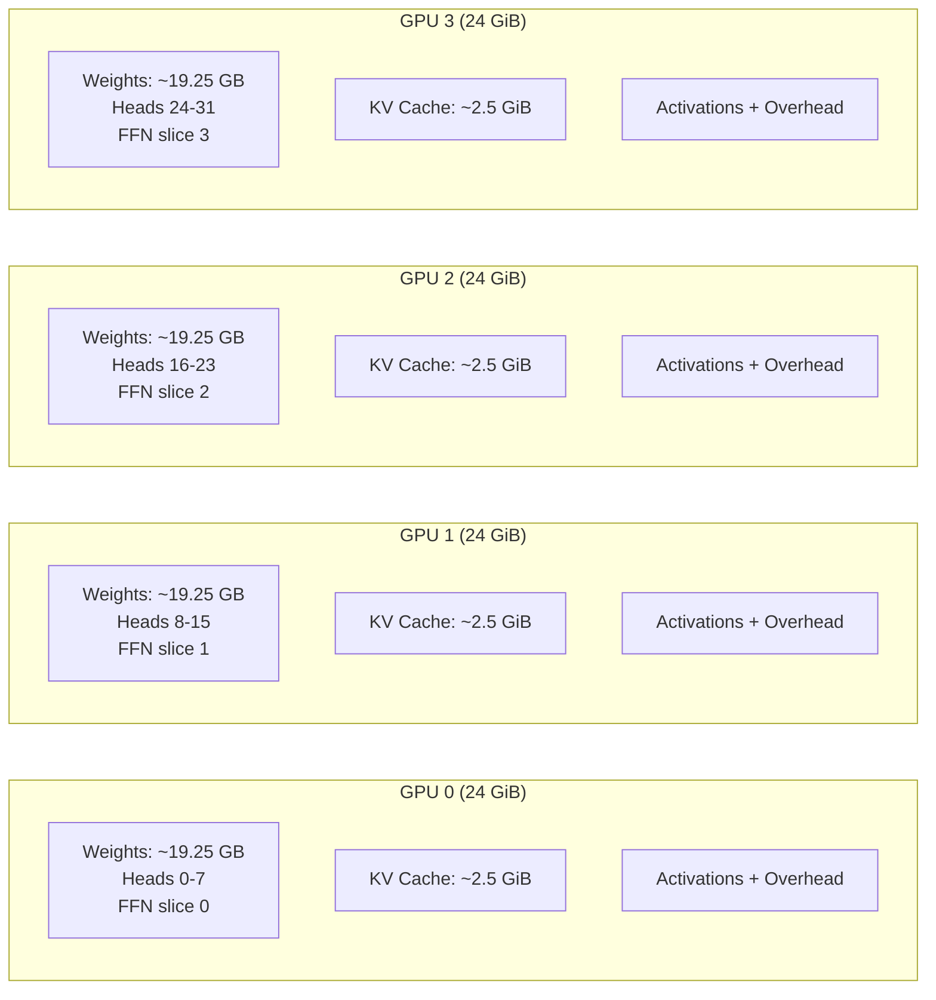

### 4.3 Vision Encoder Distribution

The vision encoder (InternViT) is handled differently from the language model:

- **vLLM replicates the vision encoder on all GPUs** for models that support it,
  or runs it only on rank 0 with broadcast
- Since InternViT is relatively small (~300M--6B params, ~0.6--12 GB) compared to
  the language model (~32B params, ~64 GB), the overhead is acceptable
- Vision encoding runs once during the **prefill phase** -- it is not repeated
  during autoregressive decoding

---

## 5. The VLM Inference Pipeline

A single inference request flows through these stages:

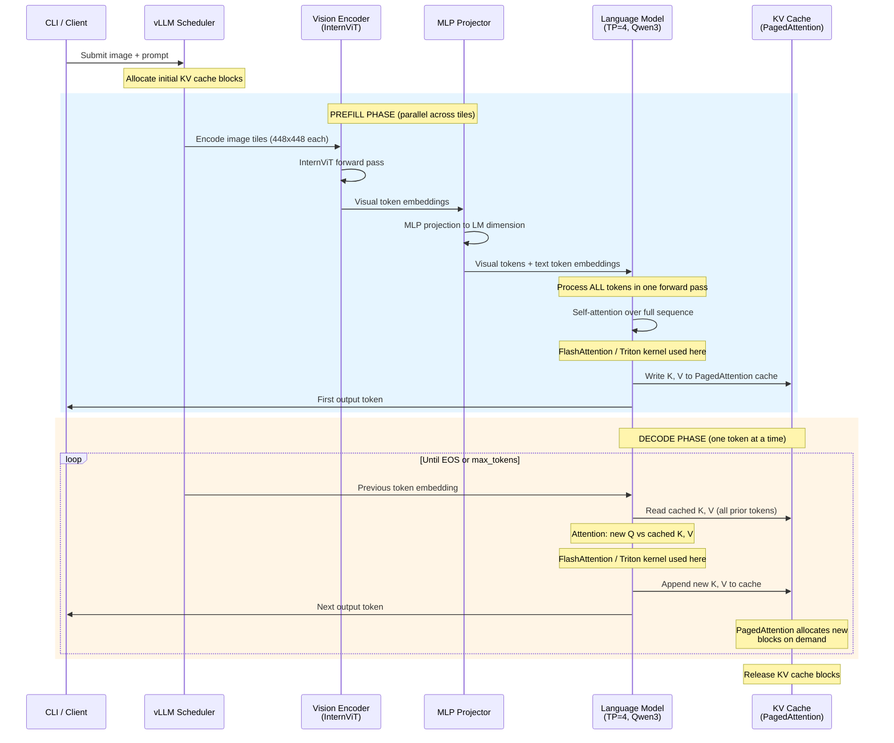

### 5.1 Prefill Phase

The prefill phase processes the **entire input** (visual tokens + text prompt) in
a single forward pass:

1. **Image tiling**: The input image is divided into 448x448 tiles
2. **Vision encoding**: InternViT processes all tiles, producing visual token
   embeddings
3. **Projection**: The MLP projector maps visual embeddings to the language model's
   hidden dimension
4. **Full-sequence attention**: The language model runs self-attention over the
   concatenated visual + text tokens. This is the most compute-intensive step and
   is where **FlashAttention/Triton kernels** provide the largest speedup
5. **KV cache population**: Keys and values for all input tokens are written to the
   PagedAttention cache

The prefill phase is **compute-bound** -- the GPU cores are fully utilised
processing the long input sequence.

### 5.2 Decode Phase

The decode phase generates tokens **one at a time** autoregressively:

1. The new token's query attends to **all prior keys/values** stored in the KV cache
2. Only one new K, V pair is appended per layer per step
3. PagedAttention dynamically allocates new cache blocks as the sequence grows

The decode phase is **memory-bandwidth-bound** -- reading the full KV cache each
step dominates. This is where tensor parallelism helps: each GPU reads only its
local KV cache shard (1/4 of the heads), reducing memory bandwidth pressure.

---

## 6. Memory Budget (38B on 4xA10G)

| Component | Per GPU | Total (4 GPUs) |
|-----------|---------|-----------------|
| Model weights (BF16) | ~19.25 GiB | ~77 GiB |
| KV cache (PagedAttention) | ~2.5 GiB | ~10 GiB |
| Activations + workspace | ~0.5 GiB | ~2 GiB |
| CUDA context + fragmentation | ~1.75 GiB | ~7 GiB |
| **Total** | **~24 GiB** | **~96 GiB** |

With `gpu_memory_utilization=0.92`, vLLM reserves 92% of each GPU's VRAM
(~22 GiB), leaving 2 GiB as a safety buffer for CUDA context and allocator
overhead.

The `max_model_len=4096` setting limits the maximum sequence length, which in turn
caps the KV cache memory requirement. With 4096 tokens and the 38B model's
head dimensions, each GPU needs approximately 2.5 GiB for KV cache -- this fits
within the available headroom after loading weights.

> **Comparison with 2x L40S (48 GiB each):** On the sandbox cluster, TP=2 puts
> ~38.5 GB of weights per GPU, leaving only ~5.5 GiB for KV cache.
> `max_model_len=4096` is required there too, since 8192 tokens would need ~1.0 GiB
> KV cache but only ~0.58 GiB was available after weight loading.

---

## 7. Data Flow Through Tensor Parallelism

This diagram shows how a single transformer layer processes tokens across 4 GPUs:

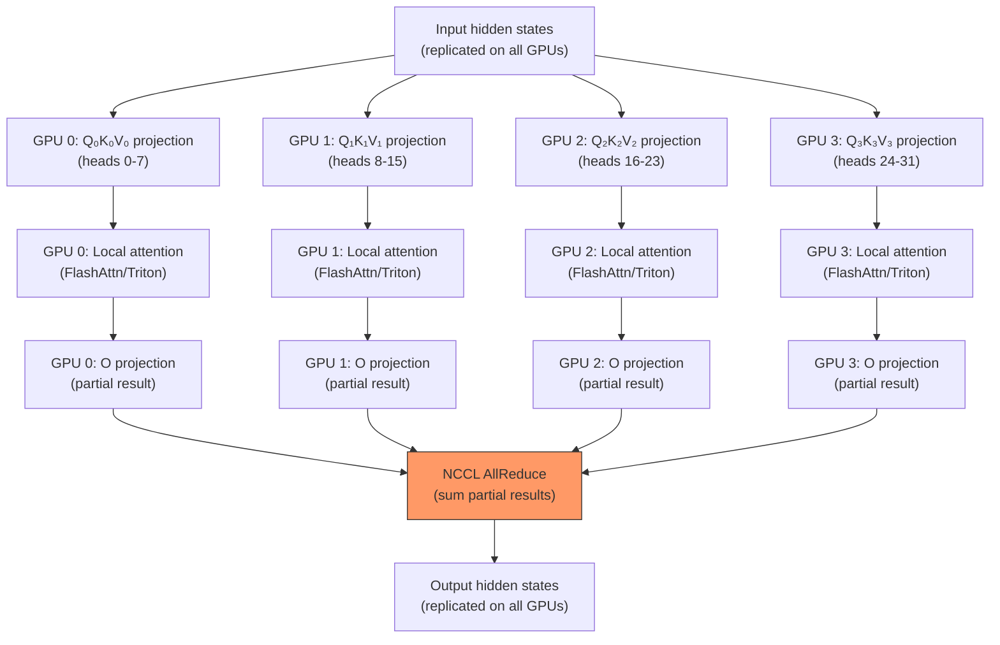

Each attention computation is **fully independent** on each GPU -- no cross-GPU
communication until the AllReduce after the output projection. This is what makes
tensor parallelism efficient: the expensive attention computation is embarrassingly
parallel.

---

## Appendix A: InternVL3.5 Architecture

### A.1 Model Family

| Variant | Vision Encoder | Language Model | Total Params | BF16 Size |
|---------|---------------|----------------|-------------|-----------|
| InternVL3.5-1B | InternViT-300M | Qwen3-0.6B | ~1B | ~2 GB |
| InternVL3.5-8B | InternViT-300M | Qwen3-8B | ~8B | ~16 GB |
| InternVL3.5-14B | InternViT-300M | Qwen3-14B | ~14B | ~28 GB |
| InternVL3.5-38B | InternViT-6B | Qwen3-32B | ~38B | ~77 GB |

### A.2 InternViT (Vision Encoder)

InternViT is a Vision Transformer (ViT) variant optimised for high-resolution
document and scene understanding:

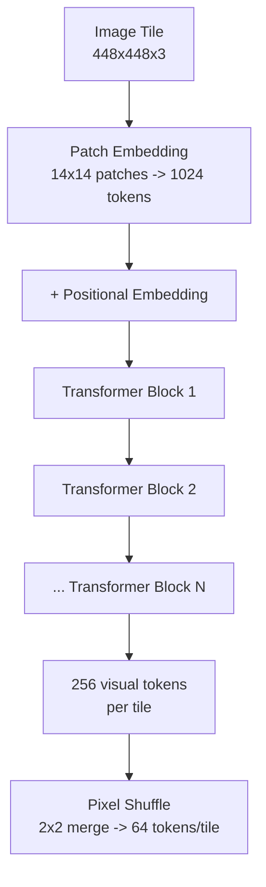

- **Patch size**: 14x14 pixels
- **Tokens per tile**: (448/14)^2 = 1,024 tokens before pixel shuffle
- **After pixel shuffle**: 256 tokens merged to 64 tokens per tile (4:1 reduction)
- **Multi-tile output**: With N tiles, the vision encoder produces N x 64 visual
  tokens

### A.3 MLP Projector

A 2-layer MLP with GELU activation bridges the vision encoder's output dimension
to the language model's hidden dimension:

```
visual_tokens (dim=V) -> Linear(V, H) -> GELU -> Linear(H, H) -> projected_tokens (dim=H)
```

Where `V` is the InternViT hidden dimension and `H` is the Qwen3 hidden dimension.

### A.4 Language Model (Qwen3)

The language model is a standard decoder-only transformer with:

- **RoPE** (Rotary Position Embeddings) for position encoding
- **Grouped Query Attention (GQA)**: Fewer KV heads than Q heads, reducing KV
  cache size
- **SwiGLU FFN**: Gate + Up projection with SiLU activation, followed by Down
  projection
- **RMSNorm**: Pre-norm architecture with RMS normalisation

The visual tokens are treated identically to text tokens once projected -- the
language model sees a flat sequence of `[visual_tokens, text_tokens]` and applies
causal self-attention over the full sequence.

---

## Appendix B: Attention Backends -- FlashAttention & Triton

### B.1 The Problem: Standard Attention is O(N^2) Memory

Standard self-attention computes:

```
Attention(Q, K, V) = softmax(QK^T / sqrt(d)) * V
```

The intermediate matrix `QK^T` has shape `[seq_len x seq_len]`. For a sequence
of 4,096 tokens, this is a 16M-element matrix **per head, per layer**. With 32
heads and 64 layers, this becomes prohibitively expensive in memory.

### B.2 FlashAttention: Tiled, Fused Computation

FlashAttention avoids materialising the full `QK^T` matrix by computing attention
in **tiles** that fit in GPU SRAM (on-chip memory):

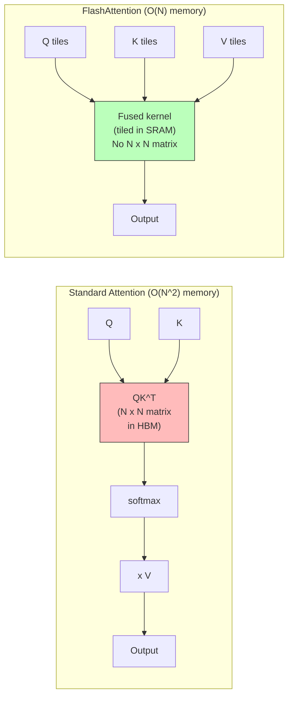

Key properties:
- **IO-aware**: Minimises reads/writes between HBM (GPU main memory) and SRAM
  (on-chip cache)
- **No O(N^2) materialisation**: Computes softmax incrementally using the online
  softmax trick
- **Exact**: Not an approximation -- produces identical results to standard
  attention

### B.3 Triton Attention Backend

Triton is a Python-based DSL (domain-specific language) for writing GPU kernels,
developed by OpenAI. vLLM includes a Triton-based implementation of the same
fused attention algorithm as FlashAttention:

| Aspect | FlashAttention 2 | Triton Backend |
|--------|------------------|----------------|
| Implementation | Hand-tuned CUDA C++ | Triton DSL (Python-like) |
| Compilation | Requires `flash-attn` package (CUDA compilation) | Compiled by Triton JIT at runtime |
| Performance | ~10-20% faster (hand-optimised memory access) | Slightly slower but very close |
| Portability | Specific CUDA compute capabilities | Any GPU Triton supports |
| Availability | Separate pip install, may fail to compile | Bundled with PyTorch |

**In vLLM 0.18+**, if `flash-attn` is installed, vLLM uses it automatically. If
not, it falls back to Triton or other available backends. No environment variable
is needed.

### B.4 Where Attention Backends Appear in the Pipeline

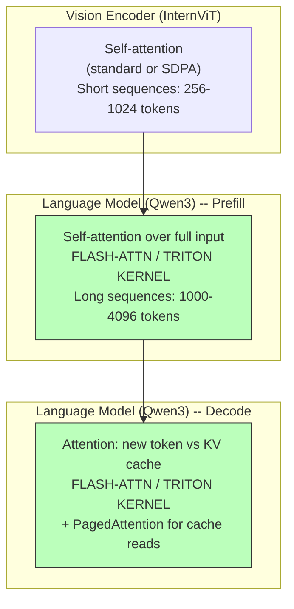

- **Vision encoder**: Uses standard attention or PyTorch SDPA. Sequences are short
  (256-1024 tokens per tile), so FlashAttention provides modest benefit here
- **LM prefill**: The **primary beneficiary**. The full input sequence (visual +
  text tokens, potentially 1000-4000 tokens) is processed in one pass.
  FlashAttention/Triton avoids the O(N^2) memory explosion
- **LM decode**: Each decoding step attends new queries to the full cached KV
  sequence. The attention backend is used here with PagedAttention providing the
  cached K, V tensors

---

## Appendix C: PagedAttention

### C.1 The Problem: KV Cache Fragmentation

During autoregressive generation, each layer stores Key and Value tensors for all
previously generated tokens. In naive implementations, this KV cache is
pre-allocated as a contiguous block per sequence:

```
Sequence A: [████████████░░░░░░░░]  <- Pre-allocated, partially used
Sequence B: [██████░░░░░░░░░░░░░░]  <- Pre-allocated, mostly wasted
                     ^^^^^^^^^^^^
                     Wasted memory (internal fragmentation)
```

With variable-length sequences, this leads to significant memory waste.

### C.2 PagedAttention: Virtual Memory for KV Cache

PagedAttention (introduced by vLLM) applies the operating system's virtual memory
concept to KV cache management:

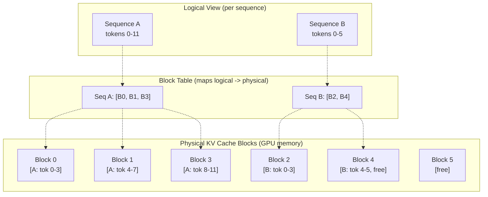

Key properties:

- **Fixed-size blocks**: KV cache is divided into blocks of fixed token count
  (typically 16 tokens per block)
- **Non-contiguous allocation**: Blocks for a single sequence need not be
  physically adjacent in GPU memory
- **On-demand allocation**: New blocks are allocated only when a sequence grows
  beyond its current capacity
- **Near-zero waste**: Only the last block of each sequence may have unused slots
  (internal fragmentation bounded by block size)

### C.3 PagedAttention with Tensor Parallelism

When combined with TP=4, PagedAttention operates independently on each GPU:

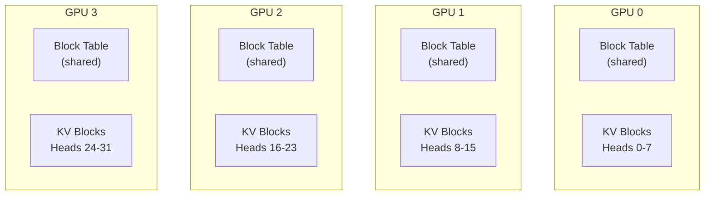

- The **block table** (logical-to-physical mapping) is replicated on all GPUs
- Each GPU stores KV cache only for its **local attention heads** (1/4 of total)
- This means KV cache memory per GPU scales as `total_kv_cache / tp_size`
- Block allocation decisions are made centrally by the vLLM scheduler and broadcast
  to all workers

### C.4 Memory Efficiency Gains

| Approach | Memory utilisation | Concurrent sequences |
|----------|-------------------|---------------------|
| Naive pre-allocation | ~50-60% (fragmentation) | Limited by worst-case allocation |
| PagedAttention | ~95-98% (near-zero waste) | 2-4x more concurrent sequences |

For our document extraction workload (single image, single response), the primary
benefit is not concurrency but **predictable memory usage** -- vLLM can precisely
calculate how much KV cache fits in the remaining VRAM after loading model weights,
which is how it determines the maximum supported `max_model_len`.

---

## Appendix D: Configuration Reference

### D.1 vLLM LLM() Parameters (as used in our loader)

```python
LLM(
    model=str(cfg.model_path),          # Path to InternVL3.5-38B weights
    tensor_parallel_size=tp_size,       # Auto-detected: 4 on A10G cluster
    max_model_len=4096,                 # Max context length (reduced for 38B)
    gpu_memory_utilization=0.92,        # Reserve 92% of each GPU's VRAM
    limit_mm_per_prompt={"image": 1},   # One image per prompt
    trust_remote_code=True,             # Required for InternVL3 custom code
    disable_log_stats=True,             # Suppress per-request stat logging
)
```

### D.2 CLI Usage

```bash
conda activate LMM_POC_VLLM

VLLM_LOGGING_LEVEL=WARNING python cli.py \
  --model internvl3-38b-vllm \
  --data-dir evaluation_data/bank \
  --ground-truth evaluation_data/bank/ground_truth_bank.csv \
  --output-dir evaluation_data/output/bank_ivl35_38b_vllm
```

### D.3 GPU Auto-Detection

The loader detects GPU count without initialising CUDA (which would break vLLM's
fork-based workers):

1. If `CUDA_VISIBLE_DEVICES` is set, parse it (e.g., `"0,1,2,3"` -> TP=4)
2. Otherwise, run `nvidia-smi -L` and count output lines
3. Fallback to TP=1 if detection fails
