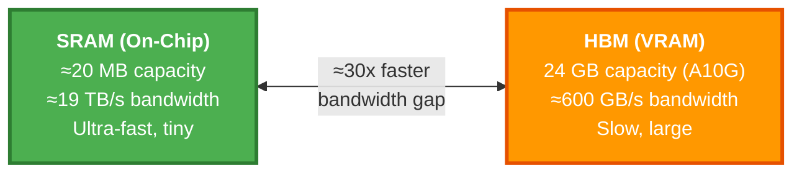
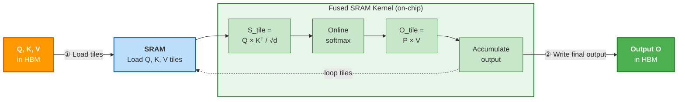
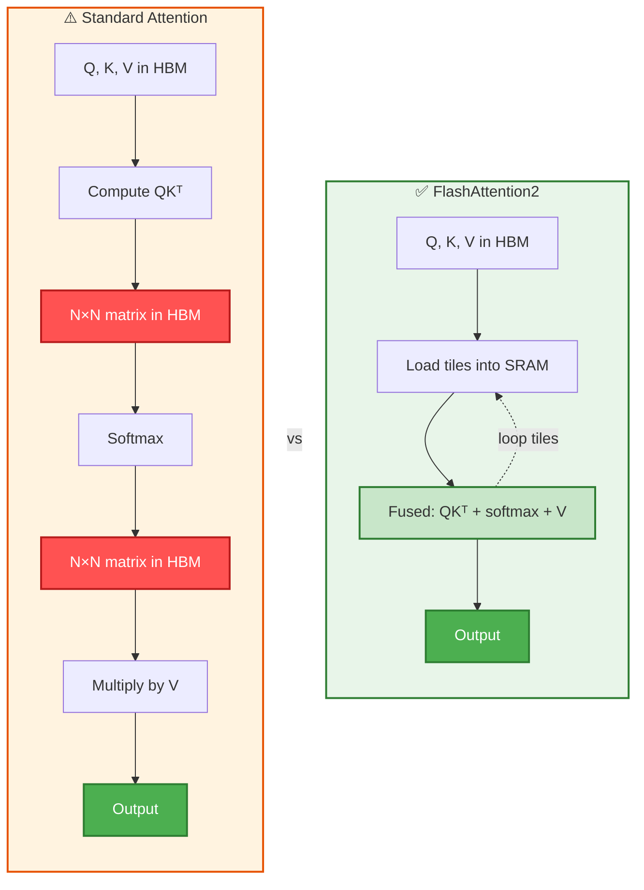
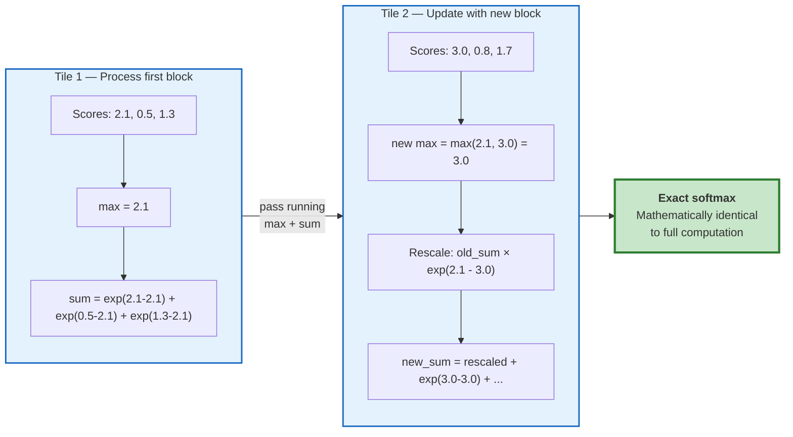

# Standard Attention vs FlashAttention2

## Overview

FlashAttention2 fundamentally changes **where** and **how** attention is computed on the GPU.
The algorithm produces identical results — the difference is purely in memory access patterns and hardware utilisation.

---

## GPU Memory Hierarchy

Understanding the hardware is key to understanding why FlashAttention2 is faster.

> **The bottleneck is not compute — it's memory bandwidth.**
> The GPU can compute far faster than it can move data between HBM and SRAM.

---

## Standard Attention — Step by Step

Standard attention materialises the full N×N attention matrix in HBM (VRAM),
requiring **multiple round trips** between slow HBM and fast SRAM.

**6 HBM transfers** — each one is slow. Two massive N×N matrices stored in VRAM.

---

## FlashAttention2 — Step by Step

FlashAttention2 **tiles** the computation so the N×N matrix is never fully materialised.
Everything stays in fast SRAM using an online softmax algorithm.

**2 HBM transfers** — read once, write once. The N×N matrix **never exists** in VRAM.

---

## Side-by-Side Comparison

---

## Memory Usage — InternVL3.5-8B on A10G (24 GB)

How the available VRAM budget changes based on attention implementation:

```mermaid
flowchart LR
    subgraph STD["Standard Attention"]
        direction LR
        SM_model["<b>Model Weights</b><br/>≈17 GB"]
        SM_attn["<b>N×N Attention</b><br/><b>Matrices</b><br/>≈1-2 GB"]
        SM_kv["<b>KV Cache +</b><br/><b>Activations</b><br/>≈4 GB"]
        SM_free["<b>Free</b><br/>≈1-2 GB"]
        SM_model ~~~ SM_attn ~~~ SM_kv ~~~ SM_free
    end

    STD ~~~|"vs"| FA2

    subgraph FA2["FlashAttention2"]
        direction LR
        FM_model["<b>Model Weights</b><br/>≈17 GB"]
        FM_kv["<b>KV Cache +</b><br/><b>Activations</b><br/>≈2 GB"]
        FM_free["<b>Free</b><br/>≈5-6 GB"]
        FM_model ~~~ FM_kv ~~~ FM_free
    end

    style SM_attn fill:#FF5252,color:#fff,stroke:#B71C1C,stroke-width:2px
    style SM_free fill:#FFF9C4,stroke:#F57F17,stroke-width:2px
    style FM_free fill:#C8E6C9,stroke:#2E7D32,stroke-width:3px
    style STD fill:#FFF3E0,stroke:#E65100,stroke-width:2px
    style FA2 fill:#E8F5E9,stroke:#2E7D32,stroke-width:2px
    style SM_model fill:#90CAF9,stroke:#1565C0
    style FM_model fill:#90CAF9,stroke:#1565C0
    style SM_kv fill:#CE93D8,stroke:#6A1B9A
    style FM_kv fill:#CE93D8,stroke:#6A1B9A
```

---

## Impact on Micro-Batch Size

| Metric | Standard Attention | FlashAttention2 |
|--------|-------------------|-----------------|
| Attention memory | O(N²) — full N×N in VRAM | O(N) — tiles in SRAM only |
| HBM round trips | 6 per attention layer | 2 per attention layer |
| Speed | Memory-bandwidth bound | Compute bound (ideal) |
| A10G batch size (InternVL3.5) | **~2 images** | **~3–4 images** |
| A10G throughput | Baseline | **~2–3x faster** |

---

## The Online Softmax Trick

The key algorithmic insight enabling FlashAttention2 — computing exact softmax without seeing all values at once:

Each tile updates a **running maximum** and **running sum**, rescaling previous results.
The final output is **mathematically identical** to computing softmax over the full row.

---

## Summary

| | Standard | FlashAttention2 |
|--|---------|-----------------|
| N×N matrix in VRAM | Yes | Never |
| Memory scaling | O(N²) | O(N) |
| Computation location | HBM ↔ SRAM ping-pong | Fused in SRAM |
| Bottleneck | Memory bandwidth | Compute (ideal) |
| Result | Identical | Identical |
| Implementation | PyTorch default | `pip install flash-attn` |

> FlashAttention2 doesn't change **what** is computed — it changes **where** it's computed.
> By keeping work in fast SRAM and eliminating HBM round trips, it unlocks both speed and memory savings.
