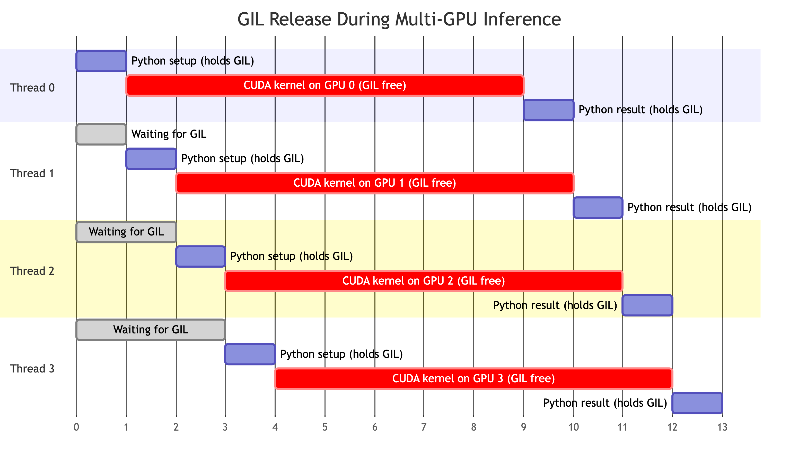
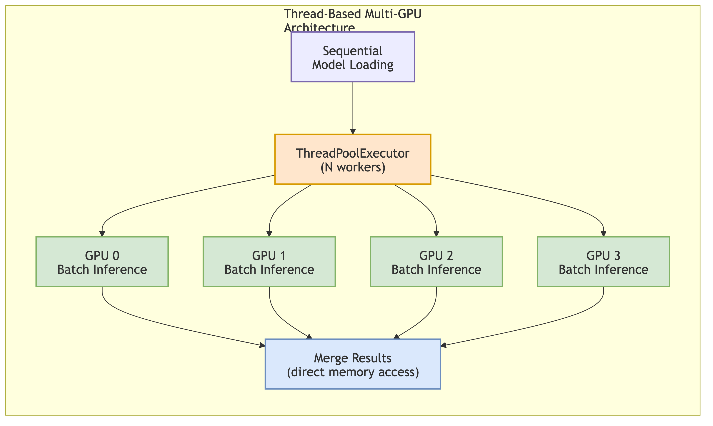
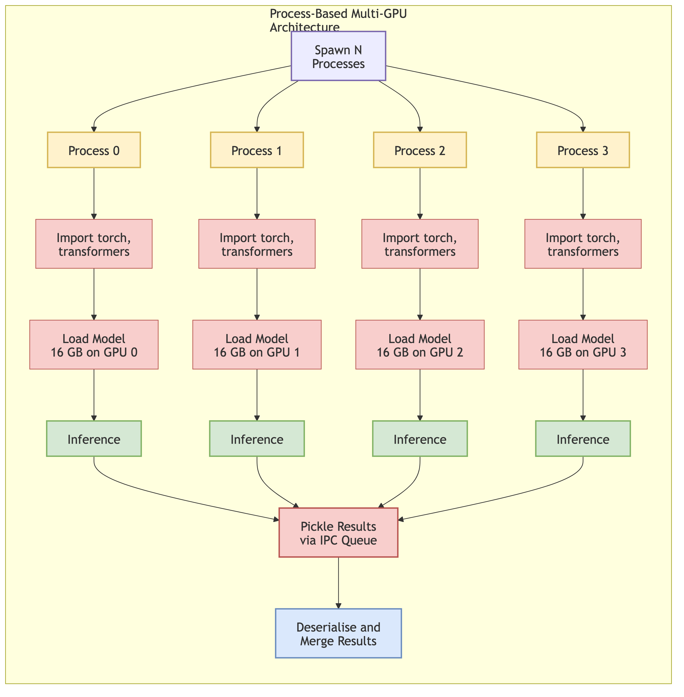
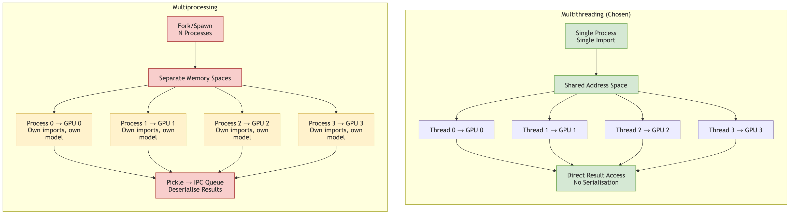

# Multithreading vs Multiprocessing for Multi-GPU Inference

## The GIL Problem

Python's **Global Interpreter Lock (GIL)** prevents multiple threads from executing Python bytecode at the same time. Even on a 64-core server, only one thread runs Python at any given moment. This is the standard reason people reach for `multiprocessing` instead of `threading` when they want true parallelism in Python.

For CPU-bound work, this reasoning is correct. But GPU inference is not CPU-bound.

---

## PyTorch's Escape Hatch

PyTorch is mostly C++ and CUDA under the hood. When you call `model.generate()`, the actual computation happens in:

1. **CUDA kernels** — matrix multiplies, attention, softmax, etc. running on the GPU
2. **C++ extension code** — tensor operations in libtorch

PyTorch **explicitly releases the GIL** before entering these native/CUDA code paths (via `pybind11::gil_scoped_release`). That means while GPU 0 is running a forward pass, the GIL is free, so another Python thread can submit work to GPU 1 simultaneously.

The timeline looks like this:

```text
Thread 0:  [Python setup] → release GIL → [CUDA kernel on GPU 0] → reacquire GIL → [Python result handling]
Thread 1:  [Python setup] → release GIL → [CUDA kernel on GPU 1] → reacquire GIL → [Python result handling]
                                           ^^^^^^^^^^^^^^^^^^^^^^^^
                                           These run truly in parallel
```

With four GPUs, the overlap becomes dramatic — each thread holds the GIL for microseconds of Python setup, then releases it for seconds of CUDA execution:



The Python bookkeeping (building inputs, parsing outputs) still serialises under the GIL, but that's **microseconds** compared to the **seconds** spent in CUDA inference. So threads give you ~100% GPU utilisation across multiple devices without the complexity of multiprocessing.

This is the key insight: **the GIL only restricts Python bytecode execution, not C++/CUDA execution**. Since GPU inference spends >99% of wall-clock time in CUDA kernels, the GIL is effectively invisible.

---

## Approach 1: Multithreading (`ThreadPoolExecutor`)

```python
from concurrent.futures import ThreadPoolExecutor, as_completed

def run_on_gpu(gpu_id: int, images: list[Path], model) -> list[dict]:
    """Each thread runs inference on its assigned GPU."""
    return [model.process(img) for img in images]

# Models already loaded on separate GPUs
with ThreadPoolExecutor(max_workers=num_gpus) as executor:
    futures = {
        executor.submit(run_on_gpu, i, chunk, models[i]): i
        for i, chunk in enumerate(image_chunks)
    }
    for future in as_completed(futures):
        gpu_id = futures[future]
        results[gpu_id] = future.result()
```

**How it works:**

- All threads share the same process and address space
- Each thread holds a reference to a model already loaded on a specific GPU
- When a thread calls `model.generate()`, PyTorch releases the GIL and dispatches CUDA kernels
- While GPU 0 runs kernels, Thread 1 can acquire the GIL, do its Python setup, then release the GIL and dispatch to GPU 1
- Result collection is direct — no serialisation or IPC needed



---

## Approach 2: Multiprocessing (`ProcessPoolExecutor`)

```python
from multiprocessing import Process, Queue

def worker(gpu_id: int, image_paths: list[str], result_queue: Queue):
    """Each process loads its own model and runs inference."""
    model = load_model(device=f"cuda:{gpu_id}")  # 16 GB load per process
    results = [model.process(img) for img in image_paths]
    result_queue.put((gpu_id, results))           # Must pickle results back

processes = []
result_queue = Queue()
for i, chunk in enumerate(image_chunks):
    p = Process(target=worker, args=(i, chunk, result_queue))
    processes.append(p)
    p.start()

for p in processes:
    p.join()
```

**How it works:**

- Each process has its own Python interpreter, GIL, and memory space
- Models cannot be shared — each process loads its own copy from disk/cache
- Results must be serialised (pickled) to pass back to the parent process
- Process startup includes forking/spawning a new Python interpreter and re-importing all modules



---

## Side-by-Side Comparison



| Criterion | Multithreading | Multiprocessing |
| --- | --- | --- |
| **Serialisation cost** | None — threads share memory | Must pickle results across process boundaries |
| **Model sharing** | Direct reference to loaded model | Each process loads its own 16 GB copy |
| **Memory overhead** | Minimal (shared address space) | N x model size (separate copies per process) |
| **Startup time** | Microseconds per thread | Seconds per process (fork + reimport) |
| **Import cost** | Import `transformers`/`torch` once | Each process reimports everything |
| **Cleanup** | Context managers work naturally | Requires signal handling, IPC for graceful shutdown |
| **Debugging** | Standard stack traces | Errors in child processes are harder to surface |
| **True GPU parallelism** | Yes (GIL released during CUDA) | Yes (separate GIL per process) |
| **True CPU parallelism** | No (single GIL) | Yes (separate GIL per process) |

The last two rows are the crux. Multiprocessing gives you CPU parallelism that threading cannot. But GPU inference doesn't need CPU parallelism — the GPU does the heavy lifting, and PyTorch releases the GIL while it runs.

---

## Why We Chose Threads

For this project (VLM document extraction with InternVL3/Llama), multithreading wins decisively:

1. **No serialisation tax.** Multiprocessing would require pickling 16 GB model objects or re-loading them from disk in each child process. Threads share the same loaded models directly.

2. **Shared address space.** The orchestrator can directly read per-GPU results without IPC. No queues, no pipes, no shared memory segments.

3. **Single import.** `transformers`, `torch`, `flash_attn`, and all dependencies are imported once. With multiprocessing, each of N processes reimports everything — adding seconds of startup per GPU.

4. **Simple lifecycle management.** Thread-based context managers (`__enter__`/`__exit__`) handle model loading and cleanup naturally. Process-based cleanup requires signal handling, zombie process prevention, and IPC for graceful shutdown.

5. **The GIL doesn't matter.** The Python bookkeeping between CUDA calls (tokenising inputs, parsing JSON outputs) takes microseconds. The CUDA inference takes seconds. The GIL serialises the microseconds; the seconds run in true parallel.


---

## The Caveat: Sequential Model Loading

There is one place where threads cause trouble: **model loading**.

The `transformers` library uses lazy imports and module-level caching that are not thread-safe. If two threads call `AutoModel.from_pretrained()` simultaneously, they can hit race conditions in the import machinery — corrupted module state, partial loads, or cryptic errors.

The solution is simple: **load models sequentially, run inference in parallel.**

```python
import threading

_load_lock = threading.Lock()

def load_model_on_gpu(gpu_id: int):
    with _load_lock:  # One model loads at a time
        model = AutoModel.from_pretrained(
            model_path,
            device_map=f"cuda:{gpu_id}",
            torch_dtype=torch.bfloat16,
        )
    return model

# Phase 1: Sequential loading (safe)
models = [load_model_on_gpu(i) for i in range(num_gpus)]

# Phase 2: Parallel inference (fast)
with ThreadPoolExecutor(max_workers=num_gpus) as executor:
    futures = [executor.submit(infer, models[i], chunks[i]) for i in range(num_gpus)]
```

This adds a small amount of startup time (loading is sequential rather than parallel), but loading from a local model cache is fast — typically 10-30 seconds per model. The alternative (multiprocessing to avoid the race) would add far more overhead from process creation and re-importing.

---

## When Multiprocessing Would Win

Multithreading is the right choice for our workload, but multiprocessing has legitimate advantages in other scenarios:

- **CPU-heavy preprocessing** — if each image required minutes of CPU work (OCR, feature extraction) before hitting the GPU, the GIL would become a real bottleneck
- **Memory isolation** — if one GPU worker could corrupt shared state in ways that crash the whole process, isolation matters
- **Fault tolerance** — a segfault in one process doesn't kill the others; a segfault in one thread kills the whole process
- **Library compatibility** — some CUDA libraries or custom extensions don't release the GIL properly, making threads block each other

For batch VLM inference where >99% of wall-clock time is spent in GIL-released CUDA kernels, none of these apply.

---

## Summary

The overall pattern: **load models sequentially for safety, then run inference in parallel threads across GPUs.** The GIL, which normally makes Python threads useless for parallelism, is irrelevant here because PyTorch releases it during the only part that matters — the GPU computation.

| Criterion | Threading | Multiprocessing |
| --- | :-: | :-: |
| GPU parallelism | Yes | Yes |
| Serialisation overhead | None | High |
| Memory efficiency | High | Low (N copies) |
| Startup cost | Negligible | Seconds per process |
| Code complexity | Low | Medium-High |
| **Best for GPU inference** | **Yes** | No |
