# Threads, Processes, and Thread Safety in Python GPU Inference

A technical reference for understanding concurrency primitives, the GIL, and thread safety
in the context of PyTorch-based vision-language model inference — with InternVL3.5-8B
running on multi-GPU A10G instances.

---

## Table of Contents

1. [Processes vs Threads — Fundamentals](#1-processes-vs-threads--fundamentals)
2. [The Global Interpreter Lock (GIL)](#2-the-global-interpreter-lock-gil)
3. [Thread Safety — Core Concepts](#3-thread-safety--core-concepts)
4. [PyTorch and CUDA Thread Safety](#4-pytorch-and-cuda-thread-safety)
5. [HuggingFace Transformers Thread Safety](#5-huggingface-transformers-thread-safety)
6. [InternVL3.5-8B: Multi-GPU Threading in Practice](#6-internvl35-8b-multi-gpu-threading-in-practice)
7. [Free-Threaded Python (3.13+)](#7-free-threaded-python-313)
8. [Decision Framework](#8-decision-framework)
9. [References](#9-references)

---

## 1. Processes vs Threads — Fundamentals

### What is a Process?

A **process** is an independent program execution with its own:

- **Virtual address space** — isolated memory, invisible to other processes
- **File descriptor table** — separate handles to open files, sockets, devices
- **Python interpreter instance** — including its own GIL
- **OS-level scheduling entity** — the kernel context-switches between processes

Processes communicate via **Inter-Process Communication (IPC)**: pipes, sockets, shared memory,
or message queues. Data must be **serialised** (pickled) to cross process boundaries.

### What is a Thread?

A **thread** is a lightweight execution unit **within** a process:

- **Shares the process's address space** — all threads see the same memory
- **Has its own stack** — local variables, function call chain
- **Has its own program counter** — can execute different code simultaneously
- **Shares file descriptors, heap, and global state** with sibling threads

Threads communicate via **shared memory** directly — no serialisation needed.

### Memory Model Comparison

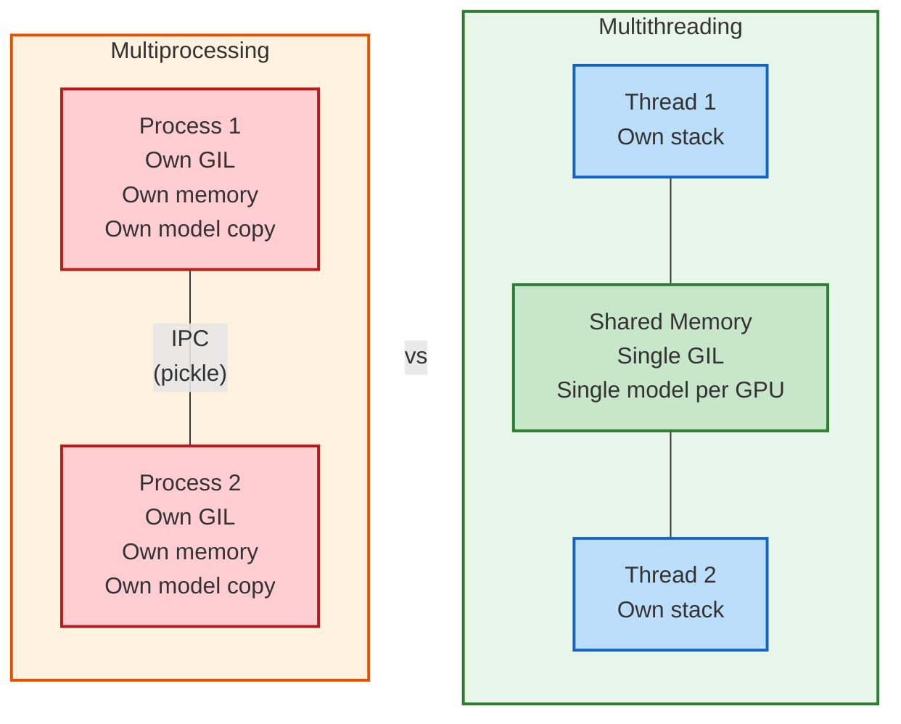

### Cost Comparison

| Resource | Thread creation | Process creation |
|----------|:-:|:-:|
| **Time** | Microseconds | Milliseconds to seconds |
| **Memory** | Stack only (8 MB default) | Full address space clone |
| **Startup imports** | None (shared) | Re-import everything |
| **Model loading** | Shared reference | Separate 17 GB copy |

For InternVL3.5-8B at 17 GB per model: 4 processes = 68 GB RAM/VRAM,
4 threads = 17 GB per GPU (shared references to the same per-GPU model).

---

## 2. The Global Interpreter Lock (GIL)

### What the GIL Does

The GIL is a **mutex** (mutual exclusion lock) inside CPython that protects access to Python
objects. Only one thread can execute Python bytecode at a time.

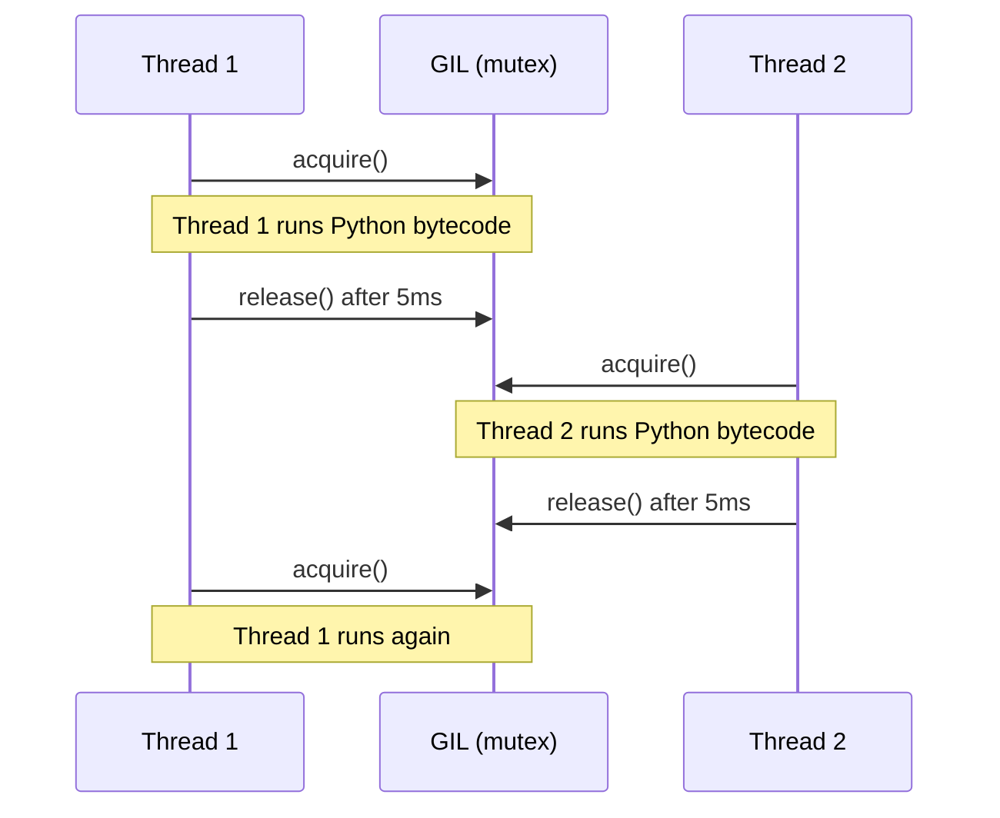

The GIL is released every **5 milliseconds** (`sys.getswitchinterval()`) to give other
threads a chance, but only one thread holds it at any moment.

### Why the GIL Exists

CPython's memory management uses **reference counting** — every object has a `refcount` field
that tracks how many variables point to it. When `refcount` drops to zero, the object is freed.

Without the GIL, two threads could simultaneously:
1. Decrement the same object's refcount
2. Both see it reach zero
3. Both try to free the same memory → **double-free crash**

The GIL prevents this by ensuring only one thread modifies refcounts at a time.

### Why the GIL Doesn't Matter for GPU Inference

The GIL only protects **Python bytecode execution**. C extensions can explicitly release
the GIL before entering native code:

```c
// PyTorch's C++ code (simplified)
Py_BEGIN_ALLOW_THREADS          // Release the GIL
result = cuda_forward_pass();   // GPU computation — seconds
Py_END_ALLOW_THREADS            // Reacquire the GIL
```

PyTorch uses `pybind11::gil_scoped_release` throughout its CUDA paths. This means:

```mermaid
gantt
    title GIL Ownership During 4-GPU Inference
    dateFormat X
    axisFormat %s

    section Thread 0 (GPU 0)
    Python setup     :crit, t0a, 0, 1
    CUDA inference   :active, t0b, 1, 30
    Python cleanup   :crit, t0c, 30, 31

    section Thread 1 (GPU 1)
    Python setup     :crit, t1a, 1, 2
    CUDA inference   :active, t1b, 2, 31
    Python cleanup   :crit, t1c, 31, 32

    section Thread 2 (GPU 2)
    Python setup     :crit, t2a, 2, 3
    CUDA inference   :active, t2b, 3, 32
    Python cleanup   :crit, t2c, 32, 33

    section Thread 3 (GPU 3)
    Python setup     :crit, t3a, 3, 4
    CUDA inference   :active, t3b, 4, 33
    Python cleanup   :crit, t3c, 33, 34
```

**Red** (critical) = holds GIL. **Blue** (active) = GIL released, true parallelism.
The GIL is held for ~1% of wall-clock time; ~99% runs in parallel on GPUs.

### GIL Accounting for InternVL3.5-8B

| Phase | Time | GIL held? | Notes |
|-------|------|:-:|-------|
| Tokenise input | 1-5 ms | Yes | Python string processing |
| Build pixel_values tensor | 2-10 ms | Partially | NumPy/torch ops release GIL |
| Vision encoder forward | 200-500 ms | **No** | CUDA kernels |
| LLM autoregressive decode | 2-8 s | **No** | CUDA kernels per token |
| Detokenise output | 0.5-2 ms | Yes | Python string processing |
| JSON parsing | 0.1-1 ms | Yes | Python stdlib |

Total time under GIL: ~10-20 ms per image.
Total CUDA time: ~2-9 seconds per image.
**GIL overhead: < 1%.**

---

## 3. Thread Safety — Core Concepts

### What Does "Thread-Safe" Mean?

Code is **thread-safe** if it behaves correctly when called simultaneously from multiple
threads. "Correctly" means no data corruption, no crashes, and deterministic results.

### The Three Hazards

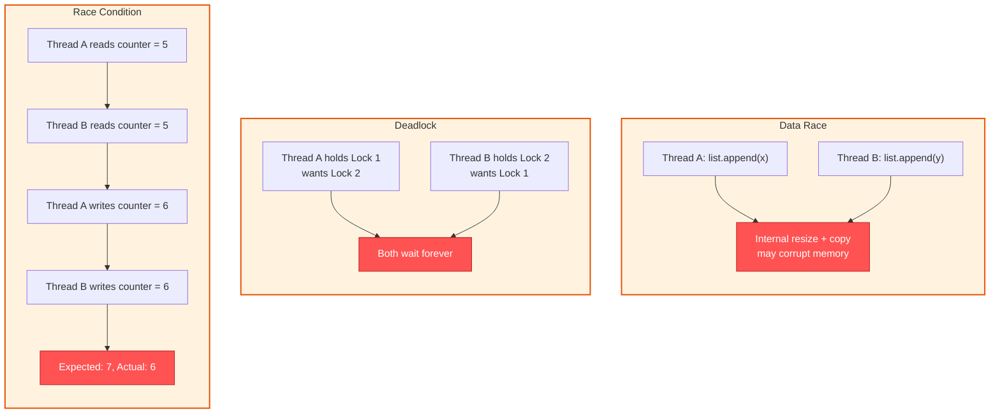

1. **Race condition** — outcome depends on thread scheduling order
2. **Deadlock** — two threads each hold a lock the other needs
3. **Data race** — unsynchronised concurrent access to shared mutable state

### Synchronisation Primitives

| Primitive | Purpose | Python API |
|-----------|---------|------------|
| **Lock (Mutex)** | Mutual exclusion — one thread at a time | `threading.Lock()` |
| **RLock** | Re-entrant lock — same thread can acquire multiple times | `threading.RLock()` |
| **Semaphore** | Allow up to N threads concurrently | `threading.Semaphore(N)` |
| **Event** | Signal between threads (set/wait) | `threading.Event()` |
| **Condition** | Wait for a condition to become true | `threading.Condition()` |
| **Barrier** | Block until N threads arrive | `threading.Barrier(N)` |

### The GIL vs Thread Safety

A common misconception: **the GIL does NOT make Python code thread-safe.**

The GIL guarantees that only one thread executes bytecode at a time, but a single
"Python operation" often compiles to **multiple bytecodes**. The GIL can switch
between threads between any two bytecodes:

```python
# This is NOT thread-safe despite the GIL:
counter = 0

def increment():
    global counter
    counter += 1
    # Compiles to:
    #   LOAD_GLOBAL  counter    ← GIL could switch here
    #   LOAD_CONST   1
    #   BINARY_ADD
    #   STORE_GLOBAL counter    ← Another thread sees stale value
```

The GIL protects **CPython internals** (refcounts, object allocation). It does **not**
protect your application logic from race conditions.

---

## 4. PyTorch and CUDA Thread Safety

### CUDA Streams and Thread-Default Contexts

Each CUDA **device** has a **default stream** — a queue of operations that execute in order.
PyTorch assigns a default stream per device, and operations on different devices naturally
run in parallel (they use different streams on different GPUs).

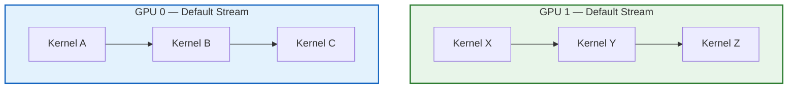

**Key guarantee**: Operations on GPU 0's default stream execute in order. Operations on
GPU 1's default stream also execute in order. But the two streams run **independently and
in parallel** — no synchronisation needed between them.

This is why our threading approach works: each thread processes on a different GPU,
each GPU has its own stream, and the streams never interfere.

### What PyTorch Guarantees as Thread-Safe

Per [PyTorch's documentation on thread safety](https://pytorch.org/docs/stable/notes/multiprocessing.html):

| Operation | Thread-safe? | Notes |
|-----------|:-:|-------|
| Inference on separate GPUs | Yes | Different CUDA contexts, separate streams |
| `torch.no_grad()` context | Yes | Thread-local state since PyTorch 1.5+ |
| `torch.cuda.set_device()` | Yes | Thread-local device selection |
| Creating tensors | Yes | Allocator is thread-safe |
| Model forward pass (same model, same GPU) | **No** | Concurrent forward passes share buffers |
| Modifying model weights | **No** | Requires external synchronisation |
| `torch.cuda.empty_cache()` | Yes | Global operation, but safe to call from any thread |

### The Critical Rule: One Model Per GPU Per Thread

If two threads run inference on the **same model on the same GPU**, they can corrupt
intermediate buffers. Our architecture avoids this entirely:

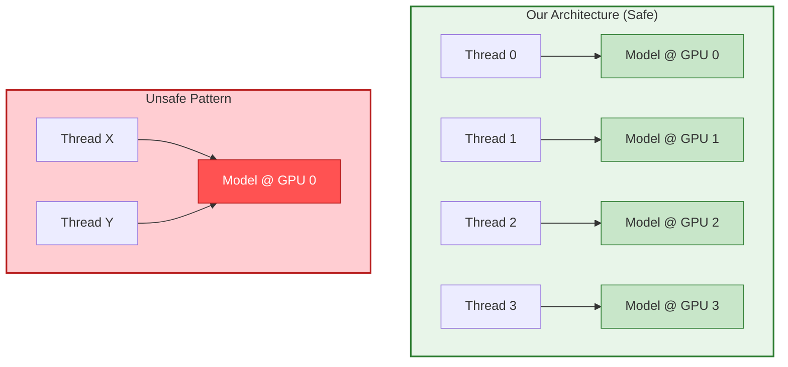

Each GPU has its own model instance. Each thread exclusively owns its GPU assignment.
No shared mutable state between threads during inference.

---

## 5. HuggingFace Transformers Thread Safety

### The `_LazyModule` Problem

HuggingFace `transformers` uses a custom `_LazyModule` class to defer imports until
first use — this keeps `import transformers` fast by not loading all 300+ model
implementations eagerly.

The problem: `_LazyModule` was **not designed for concurrent access**.

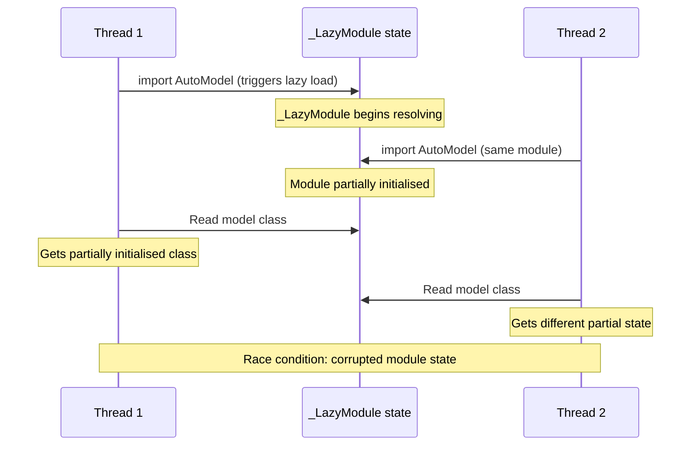

When two threads trigger the lazy import of the same module simultaneously:

1. Thread A enters `_LazyModule.__getattr__` and starts resolving the real module
2. Thread B enters the same `__getattr__` before A finishes
3. Module-level state is in an intermediate state
4. One or both threads get a corrupted module reference

This manifests as: `AttributeError`, `ImportError`, or (worst case) silently loading
the wrong model class.

### The `from_pretrained` Race

`AutoModel.from_pretrained()` is also not thread-safe because it:

1. Downloads/caches model files (filesystem operations with temp files)
2. Dynamically imports the model class (triggers `_LazyModule` resolution)
3. Reads `config.json` and dispatches to the correct model implementation
4. Allocates GPU memory via CUDA allocator

Steps 1-3 involve shared global state (module cache, file system, import machinery)
that can race between threads.

### The Solution: `threading.Lock` Around Loading

```python
import threading

_model_load_lock = threading.Lock()

def load_model_on_gpu(gpu_id: int, model_path: str):
    """Thread-safe model loading — one at a time."""
    with _model_load_lock:
        model = AutoModel.from_pretrained(
            model_path,
            device_map=f"cuda:{gpu_id}",
            torch_dtype=torch.bfloat16,
            trust_remote_code=True,
        )
    return model
```

This is exactly what `common/multi_gpu.py` does: models load sequentially behind a
lock, then inference runs in parallel. The sequential loading adds ~10-30 seconds of
startup (per GPU) but eliminates the race condition entirely.

### Tokeniser Thread Safety

HuggingFace tokenisers (the Rust `tokenizers` backend) **are** thread-safe for encoding.
The `PreTrainedTokenizerFast` class wraps a Rust tokeniser that handles concurrent
calls correctly. However, the **slow** Python tokenisers (`PreTrainedTokenizer`) are
not guaranteed thread-safe.

InternVL3.5-8B uses a fast tokeniser, so concurrent tokenisation is safe — but in our
architecture, each thread has its own tokeniser instance anyway (loaded per-GPU), making
the point moot.

---

## 6. InternVL3.5-8B: Multi-GPU Threading in Practice

### Architecture Overview

InternVL3.5-8B consists of:

- **InternViT-300M** — vision encoder (300M parameters)
- **MLP Projector** — maps vision tokens to language embedding space
- **InternLM2.5-7B-Chat** — language model backbone (32 transformer layers)

Total: ~8.5B parameters, ~17 GB in bfloat16.

### Data Parallel Threading Architecture

Our implementation uses **data parallelism with threading**:

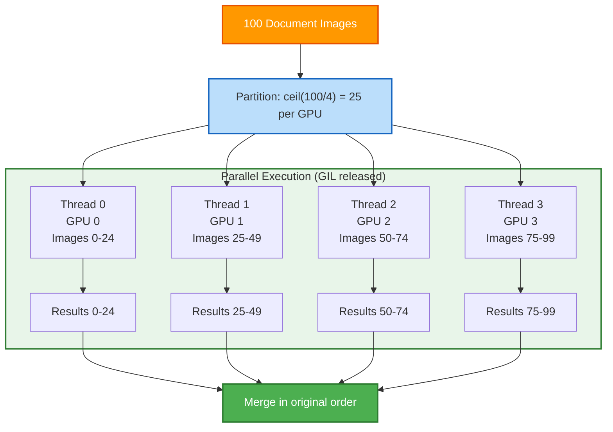

### Two-Phase Execution Model

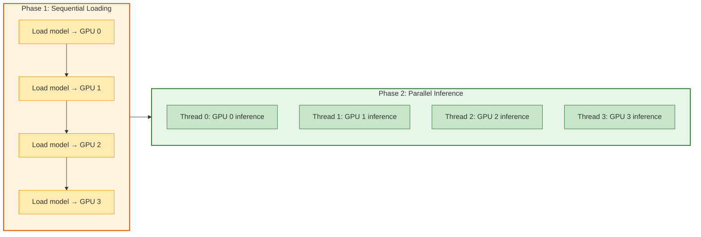

**Phase 1** is sequential because of the `_LazyModule` and `from_pretrained` race conditions
described in [Section 5](#5-huggingface-transformers-thread-safety). Each model loads in
~10-30 seconds from local cache.

**Phase 2** runs with the GIL released during CUDA kernels. All four GPUs process their
image chunks simultaneously with ~100% utilisation.

### Thread Safety Guarantees in Our Architecture

| Component | Thread-safe? | How we ensure safety |
|-----------|:-:|----------------------|
| Model loading | No (transformers) | `_model_load_lock` serialises loading |
| CUDA inference on separate GPUs | Yes (PyTorch) | One model per GPU, one thread per model |
| Image partitioning | N/A | Done before threads start |
| Result collection | Yes | Each thread writes to its own index in `gpu_results[]` |
| Result merging | N/A | Done after all threads complete |
| `torch.no_grad()` | Yes | Thread-local context since PyTorch 1.5 |
| Tokenisation | Yes | Each thread has its own tokeniser instance |

### Bank Statement Multi-Turn Flow

Bank statements require **sequential multi-turn extraction** — multiple inference calls
per document with conversation history. This works correctly with threading because:

1. Each thread processes its own bank statements independently
2. Conversation history is local to the thread's processing function
3. No shared state between threads during multi-turn extraction

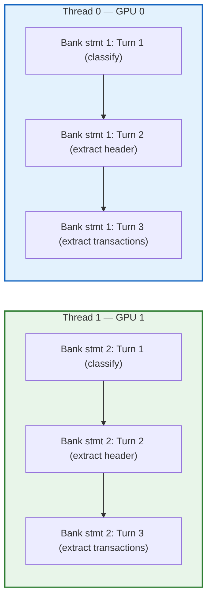

Each GPU independently runs its multi-turn conversation. The threads never share
conversation state, so no synchronisation is needed.

### `split_model()` vs Data Parallelism

InternVL provides a `split_model()` function for **pipeline parallelism** — splitting
the model's layers across multiple GPUs:

```python
# Pipeline parallelism: ONE model across 4 GPUs
device_map = split_model('InternVL3_5-8B')
# GPU 0: Vision Encoder + MLP + Layers 0-4  (5 LLM layers)
# GPU 1: Layers 5-14                        (10 LLM layers)
# GPU 2: Layers 15-24                       (10 LLM layers)
# GPU 3: Layers 25-31                       (7 LLM layers)
```

This is fundamentally different from our **data parallel** approach:

| Aspect | Pipeline (`split_model`) | Data Parallel (our approach) |
|--------|:-:|:-:|
| Models loaded | 1 (split across GPUs) | 4 (one per GPU) |
| GPU utilisation | Only 1 GPU active at a time | All 4 GPUs active simultaneously |
| VRAM per GPU | Partial model (~5 GB) | Full model (~17 GB) |
| Throughput | 1x (sequential pipeline) | ~4x (true parallelism) |
| Threading needed | No | Yes (ThreadPoolExecutor) |
| Thread safety concern | None | Model loading race condition |

We chose data parallelism because A10G GPUs have 24 GB VRAM — enough for a full
InternVL3.5-8B model (17 GB) with room for inference (~7 GB remaining for KV cache,
activations, and micro-batching).

---

## 7. Free-Threaded Python (3.13+)

### What Is Free-Threaded Python?

[PEP 703](https://peps.python.org/pep-0703/) introduced an **experimental** build of
CPython 3.13 that removes the GIL entirely. This is enabled via a compile-time flag
(`--disable-gil`) and is available as `python3.13t`.

In free-threaded Python, multiple threads can execute Python bytecode **truly
in parallel** — no GIL switching, no 5ms time slices.

### Impact on GPU Inference

For our use case, removing the GIL has **minimal positive impact** and **significant risks**:

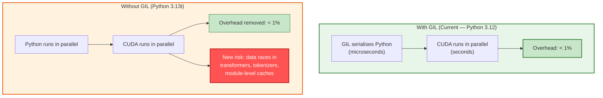

### Why Removing the GIL Makes Things Worse

The GIL, while limiting, provides an **accidental safety net** for code that was not
designed for true concurrency:

1. **`_LazyModule` races become real crashes.** With the GIL, the `_LazyModule` race
   condition in transformers is rare because threads interleave at 5ms boundaries.
   Without the GIL, two threads can *simultaneously* execute `_LazyModule.__getattr__`,
   guaranteeing corruption.

2. **Reference counting needs atomics.** Free-threaded Python replaces simple refcount
   increments with **atomic operations** and **biased reference counting**, adding overhead
   to every object creation/deletion. For code that creates millions of temporary tensors,
   this overhead is measurable.

3. **Ecosystem readiness.** As of early 2026, the free-threading ecosystem status
   ([py-free-threading.github.io](https://py-free-threading.github.io/tracking/)):

   | Package | Free-threading status |
   |---------|----------------------|
   | **NumPy** | Experimental support (significant effort invested) |
   | **SciPy** | Experimental since 1.15.0 (tests passing) |
   | **PyTorch** | Active development, not production-ready |
   | **transformers** | No official free-threading support |
   | **flash-attn** | No official free-threading support |

### Recommendation

**Stay on Python 3.12 with the GIL for production GPU inference.** The GIL overhead
is negligible (< 1%), our sequential loading pattern already handles the transformers
race condition, and free-threaded Python introduces new risks without meaningful
performance gains for this workload.

Free-threaded Python is promising for **CPU-bound** parallel workloads (data preprocessing,
scientific computing). For GPU inference where the GIL is released during CUDA kernels,
it solves a problem that doesn't exist.

---

## 8. Decision Framework

### When to Use Each Approach

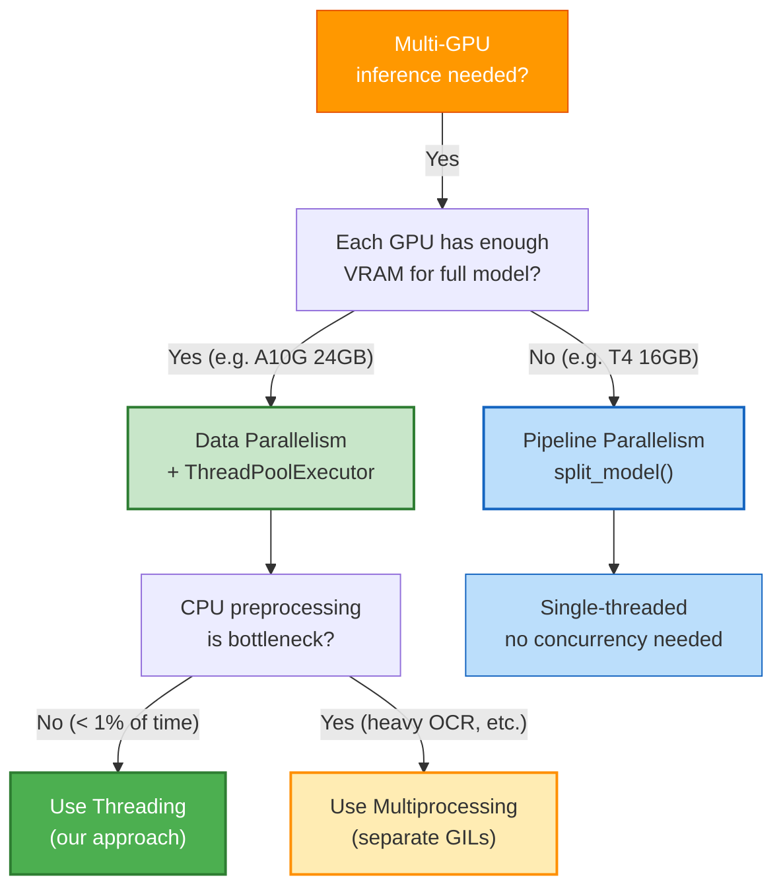

### Quick Reference Table

| Scenario | Approach | Reason |
|----------|----------|--------|
| 4x A10G (24 GB each) + InternVL3.5-8B | **Threading** | Full model fits per GPU; GIL irrelevant during CUDA |
| 4x T4 (16 GB each) + InternVL3.5-8B | **Pipeline (`split_model`)** | Model too large for single T4 |
| CPU-heavy preprocessing per image | **Multiprocessing** | GIL blocks CPU parallelism |
| Single GPU, multiple images | **Batched inference** | `batch_chat()` API, no threading needed |
| Fault isolation required | **Multiprocessing** | Process crash doesn't kill other workers |
| Bank statement multi-turn | **Threading (sequential per GPU)** | Each thread manages its own conversation state |

---

## 9. References

### Python Concurrency

1. **Python threading documentation** — [docs.python.org/3/library/threading.html](https://docs.python.org/3/library/threading.html)
2. **Python GIL** — [wiki.python.org/moin/GlobalInterpreterLock](https://wiki.python.org/moin/GlobalInterpreterLock)
3. **PEP 703 — Making the Global Interpreter Lock Optional** — [peps.python.org/pep-0703](https://peps.python.org/pep-0703/)
4. **Free-threaded Python compatibility tracking** — [py-free-threading.github.io/tracking](https://py-free-threading.github.io/tracking/)
5. **Quansight — Free-threaded CPython one year recap** — [labs.quansight.org/blog/free-threaded-one-year-recap](https://labs.quansight.org/blog/free-threaded-one-year-recap)

### PyTorch Thread Safety

6. **PyTorch Multiprocessing best practices** — [pytorch.org/docs/stable/notes/multiprocessing.html](https://pytorch.org/docs/stable/notes/multiprocessing.html)
7. **PyTorch CUDA semantics** — [pytorch.org/docs/stable/notes/cuda.html](https://pytorch.org/docs/stable/notes/cuda.html)
8. **`pybind11::gil_scoped_release`** — [pybind11.readthedocs.io/en/stable/advanced/misc.html#global-interpreter-lock-gil](https://pybind11.readthedocs.io/en/stable/advanced/misc.html#global-interpreter-lock-gil)

### HuggingFace Transformers

9. **Transformers `_LazyModule` implementation** — [github.com/huggingface/transformers/blob/main/src/transformers/utils/import_utils.py](https://github.com/huggingface/transformers/blob/main/src/transformers/utils/import_utils.py)
10. **`_LazyModule` pickling issue (#12549)** — [github.com/huggingface/transformers/issues/12549](https://github.com/huggingface/transformers/issues/12549)
11. **Transformers dynamic module utilities** — [github.com/huggingface/transformers/blob/main/src/transformers/dynamic_module_utils.py](https://github.com/huggingface/transformers/blob/main/src/transformers/dynamic_module_utils.py)

### InternVL3.5

12. **InternVL3.5 technical report** — [huggingface.co/papers/2508.18265](https://huggingface.co/papers/2508.18265)
13. **InternVL documentation** — [internvl.readthedocs.io/en/latest](https://internvl.readthedocs.io/en/latest/)
14. **InternVL GitHub repository** — [github.com/OpenGVLab/InternVL](https://github.com/OpenGVLab/InternVL)
15. **`split_model()` multi-GPU examples** — [huggingface.co/OpenGVLab/InternVL2-8B](https://huggingface.co/OpenGVLab/InternVL2-8B)

### CUDA and GPU Architecture

16. **NVIDIA A10G specifications** — 24 GB GDDR6X, 600 GB/s bandwidth
17. **CUDA Streams documentation** — [docs.nvidia.com/cuda/cuda-c-programming-guide/index.html#streams](https://docs.nvidia.com/cuda/cuda-c-programming-guide/index.html#streams)

---

## Related Documentation

- [Threading vs Multiprocessing](threading_vs_multiprocessing.md) — practical comparison for our pipeline
- [Three Approaches to GPU Parallelism](three_approaches_to_gpu_parallelism.md) — pipeline vs multiprocessing vs threading
- [Multi-GPU Design Decisions](multi_gpu_design_decisions.md) — quick reference
- [Multi-GPU Strategy](MULTI_GPU_STRATEGY.md) — deep dive into strategy selection
- [Standard vs FlashAttention2](standard_vs_flash_attention.md) — attention mechanism comparison
