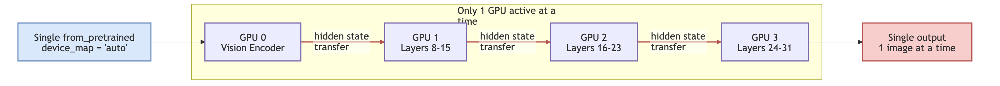
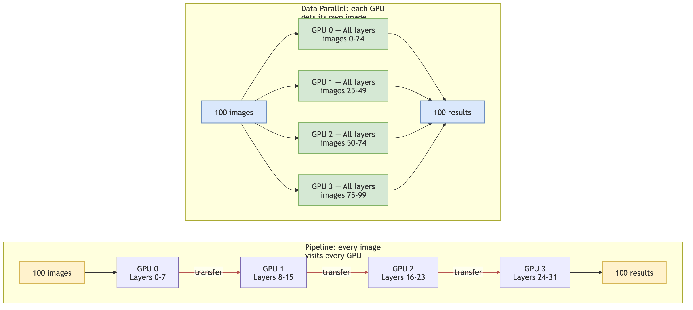

# Three Approaches to Multi-GPU Inference

How do you scale a vision-language model across multiple GPUs? There are three practical approaches, each with fundamentally different trade-offs. This document compares them and explains why we chose data parallelism with multithreading.

---

## 1. Pipeline Parallelism (`device_map="auto"`)

**One model, sharded across GPUs layer-by-layer.**

HuggingFace Accelerate assigns transformer layers to GPUs based on available memory. A single `from_pretrained(..., device_map="auto")` call distributes the model automatically. At each layer boundary, a PyTorch hook moves the hidden state tensor to the next GPU via `.to(device)`.

HuggingFace describes this as "pretty naive — there is no clever pipeline parallelism involved, just using the GPUs sequentially" [[1]](#references).



**The pipeline bubble problem.** During autoregressive generation, each token requires a full sequential pass through all layers. With layers split across N GPUs, only one GPU is active at any moment — the others idle in a "bubble." CMU's PipeFill paper measured pipeline bubbles at 15-30% idle time in training, exceeding 60% in some configurations [[2]](#references). For inference on 2 GPUs, each GPU is idle roughly 50% of the time.

**No throughput gain for models that fit on one GPU.** TensorRT-LLM benchmarks show that pipeline parallelism across 2 GPUs actually *reduced* throughput from 22.2 to 21.1 tokens/s and increased latency from 45.1 to 53.9 ms/token [[3]](#references). The forward pass is inherently sequential — you cannot compute layer 17 until layer 16 produces its output.

**When it makes sense:** When the model does not fit on a single GPU (70B+ parameters). For our 8B model at 16 GB in bfloat16, every GPU we use has enough memory. Pipeline parallelism solves the wrong problem.

---

## 2. Data Parallelism with Multiprocessing

**N full model copies, one per GPU, in separate OS processes.**

Each process spawns its own Python interpreter, imports all dependencies, loads its own model copy, runs inference independently, then pickles results back to the parent via IPC.

**The overhead is substantial:**

- **Process spawning**: CUDA requires `spawn` (not `fork`), which is ~20x slower at ~42 ms per process [[4]](#references)
- **Import duplication**: `import transformers` alone takes 5+ seconds [[5]](#references); combined with torch and model loading, each worker takes 30-60 seconds to become ready [[6]](#references)
- **IPC serialisation**: Results must be pickled across process boundaries. Non-tensor data (configs, metadata) goes through Python's pickle; CUDA tensors use IPC handles but require the sender to stay alive [[7]](#references)

**When it makes sense:** Fault isolation (one GPU crash doesn't kill others), CPU-heavy preprocessing (true CPU parallelism bypasses the GIL), or long-running servers where spawn cost amortises to nothing. Also required when using thread-unsafe libraries like bitsandbytes quantisation [[8]](#references).

---

## 3. Data Parallelism with Multithreading (Chosen)

**N full model copies, one per GPU, in threads within a single process.**

Each thread holds a reference to a model already loaded on its assigned GPU. When a thread calls `model.generate()`, PyTorch releases the GIL via `pybind11::gil_scoped_release` and dispatches CUDA kernels. While GPU 0 runs a forward pass, the GIL is free — another thread can submit work to GPU 1 simultaneously [[9]](#references).


```text
Thread 0:  [Python setup] → release GIL → [CUDA kernel on GPU 0] → reacquire GIL → [result]
Thread 1:  [Python setup] → release GIL → [CUDA kernel on GPU 1] → reacquire GIL → [result]
                                           ^^^^^^^^^^^^^^^^^^^^^^^^
                                           These run truly in parallel
```

The Python bookkeeping (tokenising inputs, parsing JSON) takes microseconds. The CUDA inference takes seconds. The GIL serialises the microseconds; the seconds run in true parallel. Profiling shows >50% of wall-clock time at batch-size-1 is CPU overhead waiting for kernel launches [[10]](#references) — exactly the time other threads can use.

**Advantages over multiprocessing:**

- **Zero serialisation cost** — threads share memory, results are accessed directly
- **Single import** — `torch`, `transformers`, `flash_attn` imported once, not N times
- **Microsecond startup** — thread creation vs seconds for process spawning
- **Simple lifecycle** — context managers work naturally, no zombie process handling

**The one caveat:** `transformers` has lazy-import race conditions, so model loading is serialised behind a `threading.Lock`. Once all models are loaded, inference runs in full parallel. This adds 10-30 seconds of sequential startup (loading from local cache), far less than multiprocessing's per-worker import overhead.

---

## How Images Are Distributed

This is the fundamental difference between the approaches. Given 100 images and 4 GPUs:

**Pipeline parallelism** sends every image through every GPU. Each GPU holds a slice of the model's layers, so all 100 images must traverse the full GPU 0 → 1 → 2 → 3 chain, with hidden state transfers at each boundary. The GPUs split the *model*, not the *data*.

**Data parallelism** (threading or multiprocessing) sends each image to exactly one GPU. The images are partitioned — GPU 0 gets images 0-24, GPU 1 gets 25-49, etc. Each GPU holds the complete model and processes its subset independently. The GPUs split the *data*, not the *model*. No inter-GPU communication occurs during inference.



This is why data parallelism scales linearly with GPU count for throughput — each GPU works independently on its partition. Pipeline parallelism cannot improve throughput because the sequential chain is the bottleneck.

---

## Side-by-Side Comparison

| Criterion | Pipeline Parallelism | Multiprocessing | Multithreading |
| --- | --- | --- | --- |
| **What gets split** | The model (layers across GPUs) | The data (images across GPUs) | The data (images across GPUs) |
| **Model copies** | 1 (sharded) | N (full copy per GPU) | N (full copy per GPU) |
| **Image routing** | Every image visits every GPU | Each image visits 1 GPU | Each image visits 1 GPU |
| **Inter-GPU communication** | Every layer boundary | None | None |
| **Throughput scaling (4 GPUs)** | ~1x (pipeline bubble) | ~4x | ~4x |
| **Combined with batching** | Limited by single pipeline | ~12-20x | ~12-20x |
| **Startup overhead** | Minimal | 30-60s per worker | Microseconds per thread |
| **Import cost** | Once | N times (5+ sec each) | Once |
| **Result transfer** | N/A (single model) | Pickle via IPC | Direct memory access |
| **VRAM efficiency** | High (shared weights) | Low (N copies) | Low (N copies) |
| **Fault isolation** | N/A | Full (process boundary) | None (shared process) |
| **Works on PCIe (no NVLink)** | Poorly | Fully | Fully |
| **Bank statement multi-turn** | No improvement | Linear speedup | Linear speedup |

---

## Why We Chose Multithreading

Our workload is **batch document extraction** with InternVL3.5-8B (16 GB in bfloat16). The model fits on a single 24 GB GPU. We need throughput, not lower per-image latency.

1. **Pipeline parallelism solves the wrong problem.** We're not memory-constrained — we're throughput-constrained. Sharding an 8B model across 4 GPUs gives ~1x throughput with 4x the complexity.

2. **Multiprocessing pays overhead we don't need.** Each worker re-imports transformers (5+ sec), re-spawns a Python interpreter (42 ms), and pickles results back. For a 100-image batch job, that startup cost is significant. We don't need fault isolation for batch inference.

3. **Multithreading gives us data parallelism with zero overhead.** PyTorch releases the GIL during CUDA execution. Threads share loaded models, share results, and share a single import. Combined with per-GPU batching, 4 GPUs deliver 12-20x throughput over a single-GPU sequential baseline.

The overall pattern: **load models sequentially for safety, run inference in parallel threads across GPUs, merge results directly from shared memory.**


---

## References

1. HuggingFace, ["Handling Big Models for Inference"](https://huggingface.co/docs/accelerate/en/concept_guides/big_model_inference) — Accelerate documentation on `device_map="auto"` behaviour
2. Yile Gu et al., ["PipeFill: Using GPUs During Bubbles in Pipeline-Parallel LLM Training"](https://arxiv.org/abs/2410.07192) — CMU, 2024. Pipeline bubble measurements (15-60% idle)
3. NVIDIA TensorRT-LLM, [Issue #1102: Pipeline Parallelism Performance](https://github.com/NVIDIA/TensorRT-LLM/issues/1102) — Benchmarks showing PP2 slower than single GPU
4. SuperFastPython, ["Forking is 20x Faster Than Spawning"](https://superfastpython.com/fork-faster-than-spawn/) — Process creation benchmarks (spawn ~42 ms vs fork ~2 ms)
5. HuggingFace Transformers, [Issue #16863: Import Time](https://github.com/huggingface/transformers/issues/16863) — `import transformers` taking 5+ seconds
6. HuggingFace Transformers, [Issue #23870: DataLoader Slowdown](https://github.com/huggingface/transformers/issues/23870) — Combined torch + transformers import at 23.6 seconds
7. PyTorch, ["Multiprocessing Best Practices"](https://docs.pytorch.org/docs/stable/notes/multiprocessing.html) — CUDA tensor sharing, IPC handles, shared memory
8. HuggingFace Transformers, [Issue #25197: Multithreading with Quantisation](https://github.com/huggingface/transformers/issues/25197) — Thread-unsafe bitsandbytes behaviour
9. PyTorch, ["CUDA Semantics"](https://docs.pytorch.org/docs/stable/notes/cuda.html) — GIL release during CUDA operations, thread-local device selection
10. Fireworks AI, ["Speed, Python: Pick Two"](https://fireworks.ai/blog/speed-python-pick-two-how-cuda-graphs-enable-fast-python-code-for-deep-learning) — Profiling showing ~57% CPU overhead at batch-size-1 (LLaMA-2 7B, A100)
