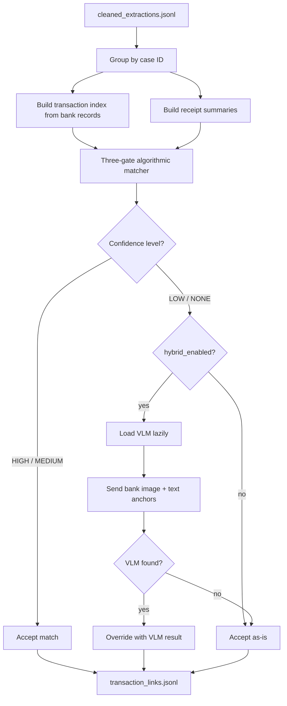
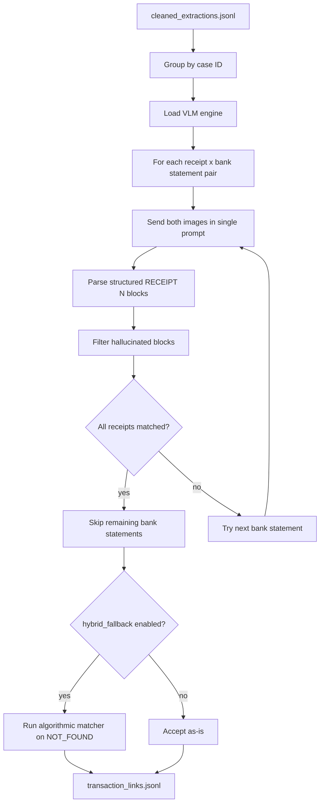

# Transaction Linking: Branch Comparison

Reference document comparing two linking implementations across `feature/vllm-parallel` and `feature/multi-image-vlm-linking`. Written to inform the design of a more challenging 4-document linking scenario.

## Upstream Repository

**Repo:** `git@github.com:tmnestor/LMM_POC.git`

**Branch status:**

| Branch | Status | Linking exists? |
|---|---|---|
| `main` | Base branch | No linking code — linking is feature-branch only |
| `feature/vllm-parallel` | Active development | Yes — algorithmic-first implementation |
| `feature/multi-image-vlm-linking` | Active development | Yes — VLM-first implementation |

**Files worth importing** (everything else is dead weight or unrelated stages):

From `feature/vllm-parallel`:

| File | Import? | Reason |
|------|---------|--------|
| `common/transaction_matcher.py` | Yes | Pure algorithmic matcher — zero VLM deps, well-tested, reusable |
| `common/vlm_verifier.py` | Maybe | Single-image verification logic — useful if keeping hybrid mode |
| `stages/link.py` | Reference only | Orchestrator tightly coupled to full pipeline stages/io |
| `common/extraction_types.py` | Check | Defines `GenerateResult`, `NodeGenParams` used by vlm_verifier |

From `feature/multi-image-vlm-linking`:

| File | Import? | Reason |
|------|---------|--------|
| `common/vlm_linker.py` | Yes | Multi-image VLM caller + parser — self-contained |
| `prompts/single_receipt_link.yaml` | Yes | Proven single-receipt prompt template |
| `prompts/multi_image_link.yaml` | Yes | Multi-receipt prompt template |
| `stages/link.py` | Reference only | Orchestrator — useful for logic but carries pipeline baggage |
| `common/bank_types.py` | Check | Bank column metadata types (19 lines) |

Shared across both branches:

| File | Import? | Reason |
|------|---------|--------|
| `common/transaction_matcher.py` | Yes | Core types (`BankTransaction`, `ReceiptSummary`, `LinkResult`), three-gate matcher, `group_by_case()`, `normalize_date()`, `parse_amount()` |

**Fetching specific files from upstream:**

```bash
# From vllm-parallel
git show origin/feature/vllm-parallel:common/transaction_matcher.py > transaction_matcher.py
git show origin/feature/vllm-parallel:common/vlm_verifier.py > vlm_verifier.py

# From multi-image-vlm-linking
git show origin/feature/multi-image-vlm-linking:common/vlm_linker.py > vlm_linker.py
git show origin/feature/multi-image-vlm-linking:prompts/single_receipt_link.yaml > single_receipt_link.yaml
git show origin/feature/multi-image-vlm-linking:prompts/multi_image_link.yaml > multi_image_link.yaml
```

---

## Overview

Both branches solve the same problem — matching receipts/invoices to debit transactions on bank statements — but invert the roles of algorithmic matching and VLM inference.

| Aspect | `vllm-parallel` | `multi-image-vlm-linking` |
|---|---|---|
| Primary strategy | Algorithmic (text-based) | VLM (vision-based) |
| VLM role | Fallback verifier | Primary matcher |
| VLM input | 1 image (bank only) + text anchors | 2 images (receipt + bank) |
| Algorithmic role | Primary matcher | Fallback for VLM NOT_FOUND |
| GPU requirement | Optional (only for low-confidence) | Always required |
| Prompt variants | Single verification prompt (hardcoded) | Config-driven (`vlm_prompt` key selects YAML) |
| Max tokens | 1024 (short verification) | 4096 (full read + match) |

---

## Branch 1: `feature/vllm-parallel` — Algorithmic-First

### Architecture



### Three-Gate Matching Algorithm

**Gate 1 — Amount (hard gate, eliminates non-candidates):**

```
|receipt.total - txn.amount| <= amount_tolerance  (default: $0.01)
```

No candidates pass = confidence NONE. No further scoring.

**Gate 2 — Date (soft, business-day proximity):**

```
same day        -> score = 1.0
within window   -> score = 1.0 - (business_days / (window_days + 1))
beyond window   -> score = 0.0
```

Default window: 5 business days (Mon-Fri only). Accounts for bank posting delays.

**Gate 3 — Description (soft, token overlap):**

```
1. Normalize both strings: uppercase, & -> AND, strip punctuation, tokenize
2. score = supplier_tokens_found_in_bank_description / total_supplier_tokens
3. Match if score >= description_threshold (default: 0.6)
```

Handles bank naming variations (e.g. "Bunnings Warehouse" -> "BUNNINGS 2847 VIC").

**Confidence assignment:**

| Amount | Date | Description | Confidence |
|--------|------|-------------|------------|
| match  | match | match      | HIGH       |
| match  | match | no         | MEDIUM     |
| match  | no    | match      | MEDIUM     |
| match  | no    | no         | LOW        |
| no     | -     | -          | NONE       |

**One-to-one constraint (greedy assignment):**

1. Score all receipts against the full transaction index
2. Sort by confidence (HIGH first), then by combined date + description score
3. Process in order: match receipt, remove claimed transaction from pool
4. Positional tiebreaker: prefer earlier row index

### VLM Verification (Hybrid Mode)

Triggered only for results at or below `vlm_verification_threshold` (default: LOW).

- **NONE results:** VLM searches ALL bank statement images in the case
- **LOW/MEDIUM/HIGH results:** VLM re-verifies against the already-matched bank statement only
- **Single-image design:** VLM receives only the bank statement image; receipt fields are embedded as text "attention anchors" in the prompt
- **Rationale:** Receipts are short documents with reliable extraction. Bank statements (15-30 rows) suffer attention decay. Anchoring with receipt fields (exact amount, supplier keywords, date window) focuses the VLM's search

### Key Files

| File | Purpose | Lines |
|------|---------|-------|
| `common/transaction_matcher.py` | Algorithmic matching engine (zero VLM dependencies) | 577 |
| `common/vlm_verifier.py` | Single-image VLM verification module | 395 |
| `stages/link.py` | Stage orchestrator | 514 |

### Configuration (`config/run_config.yml`)

```yaml
linking:
  enabled: true
  case_key_pattern: "^(?P<case>[^_]+)_"
  amount_tolerance: 0.01
  date_window_days: 5
  description_threshold: 0.6
  hybrid_enabled: true
  vlm_verification_threshold: LOW    # Verify LOW + NONE
  vlm_max_tokens: 1024
  vlm_temperature: 0.0
```

---

## Branch 2: `feature/multi-image-vlm-linking` — VLM-First

### Architecture



### Multi-Image VLM Linking

Each VLM call receives two images and a structured prompt:

- **Image 1:** Receipt or invoice
- **Image 2:** Bank statement

The VLM reads the receipt (store name, date, total), then scans the bank statement table row by row to find a matching debit. Two prompt variants are available:

**`single_receipt_link`** — optimized for one-receipt-per-image datasets. Amount match alone is sufficient. Description and date are tiebreakers only when multiple rows share the same amount.

**`multi_image_link`** — handles multiple receipts per image. Requires the VLM to enumerate separate receipts in Image 1, then match each against the bank statement independently.

The prompt is selected via `linking.vlm_prompt` in YAML (config-driven, not hardcoded).

### Hallucination Filtering

The VLM-first approach requires two anti-hallucination guards that the algorithmic approach does not need:

**Bank-row echo filter (`_is_bank_row_echo`):** Detects when the VLM reads transaction rows from the bank statement and reports them as separate receipts. Filtered when `RECEIPT_STORE` exactly equals `TRANSACTION_DESCRIPTION` (legitimate matches never have this — receipts have full names, banks abbreviate).

**Spurious receipt filter (`_filter_spurious_receipts`):** When extraction found a single receipt with a known total, additional unmatched VLM blocks whose total differs from the extraction are dropped. Prevents the VLM from fabricating extra receipts by misreading Image 1.

**Placeholder filter (`_is_placeholder`):** Drops blocks where `RECEIPT_STORE` is empty, starts with `[`, or is a known placeholder word (e.g. "unknown", "n/a", "not specified").

### Best-Across-Statements Logic

For each receipt image, the system tries each bank statement in the case:

1. Call VLM with receipt + bank statement
2. Track best result per receipt index (FOUND overrides NOT_FOUND)
3. If all receipts on this image are matched, skip remaining bank statements (early exit)

This replaces the algorithmic branch's greedy one-to-one constraint. The VLM handles deduplication implicitly (it sees both documents and chooses the best row), but there is no formal enforcement that two receipts cannot match the same bank row.

### Algorithmic Fallback

For NOT_FOUND records after all VLM calls complete, runs the same `match_receipt()` from `transaction_matcher.py`:

- Only overrides NOT_FOUND -> FOUND (never downgrades)
- Gated by `hybrid_min_confidence` (default: LOW) — requires at least LOW confidence to override
- Uses separate config keys: `hybrid_amount_tolerance`, `hybrid_date_window_days`, `hybrid_description_threshold`

### Key Files

| File | Purpose | Lines |
|------|---------|-------|
| `common/vlm_linker.py` | Multi-image VLM caller + response parser | 371 |
| `stages/link.py` | Stage orchestrator with VLM-first logic | 732 |
| `prompts/single_receipt_link.yaml` | Single-receipt prompt template | 75 |
| `prompts/multi_image_link.yaml` | Multi-receipt prompt template | 101 |
| `common/transaction_matcher.py` | Algorithmic fallback (shared with Branch 1) | 577 |

### Configuration (`config/run_config.yml`)

```yaml
linking:
  enabled: true
  case_key_pattern: "^(?P<case>[^_]+)_"
  vlm_prompt: single_receipt_link       # or multi_image_link
  vlm_max_tokens: 4096
  vlm_temperature: 0.0
  hybrid_fallback: true
  hybrid_amount_tolerance: 0.01
  hybrid_date_window_days: 5
  hybrid_description_threshold: 0.3     # lower than algorithmic-first (0.6)
  hybrid_min_confidence: LOW
```

---

## Design Trade-offs

### Algorithmic-First Strengths

- **Deterministic and reproducible:** Same input always produces the same output
- **CPU-only when sufficient:** GPU loaded only when algorithmic confidence is low
- **Fast:** Millisecond matching per case (VLM calls take seconds)
- **Formal one-to-one constraint:** Greedy assignment with priority ordering prevents double-matching
- **No hallucination risk:** Operates on already-extracted text, not raw images

### Algorithmic-First Weaknesses

- **Extraction-dependent:** If the extract stage misreads an amount, date, or supplier, the matcher cannot recover
- **Attention decay upstream:** Long bank statements (15-30 rows) cause missed/misread transactions during extraction, which propagates to linking
- **Text normalization fragility:** Token overlap for description matching relies on heuristic normalization that may not handle all bank abbreviation patterns

### VLM-First Strengths

- **Bypasses extraction errors:** Reads both documents from raw images, so extraction mistakes do not propagate
- **Contextual understanding:** VLM sees both documents simultaneously, enabling visual cross-referencing
- **Config-driven prompts:** Easy to swap prompt strategies without code changes
- **Handles unseen formats:** VLM can interpret novel bank statement layouts without schema changes

### VLM-First Weaknesses

- **Always requires GPU:** Cannot run without a loaded model
- **Hallucination risk:** Requires multiple filtering stages to catch fabricated receipts and echoed bank rows
- **Non-deterministic:** Same input may produce slightly different results across runs (even at temperature 0.0)
- **No formal one-to-one constraint:** Nothing prevents two receipts from claiming the same bank row
- **Slower:** Each receipt x bank pair requires a full VLM inference call
- **Higher token budget:** 4096 max tokens vs 1024 for verification-only

---

## Shared Components

Both branches share `common/transaction_matcher.py` with the same core types:

- `BankTransaction` — parsed bank row (date, description, amount, source_image, row_index)
- `ReceiptSummary` — parsed receipt fields (image_name, supplier_name, date, total, document_type)
- `LinkResult` — match outcome (receipt, transaction, confidence, match_scores, reasoning)
- `group_by_case()` — groups records by case ID using regex on filename
- `build_transaction_index()` — parses pipe-delimited bank fields into flat transaction list
- `match_receipt()` / `match_all_receipts()` — the three-gate matcher with greedy assignment
- `normalize_date()` / `parse_amount()` — field normalization utilities

---

## Implications for 4-Document Scenario

The current implementations handle a 2-document scenario (receipt + bank statement). A 4-document scenario introduces new challenges that neither branch fully addresses:

- **Multi-image context window:** VLM-first already handles 2 images per call; scaling to 4 increases token consumption and attention decay risk
- **Cross-document reasoning:** Algorithmic matching would need a richer graph structure beyond pairwise receipt-to-bank matching
- **One-to-many relationships:** A single transaction might relate to multiple supporting documents
- **Ordering and priority:** Which documents to compare first, and how to propagate partial matches across document combinations
- **Hallucination surface:** More images per prompt increases the VLM's opportunity to fabricate or cross-contaminate fields between documents
