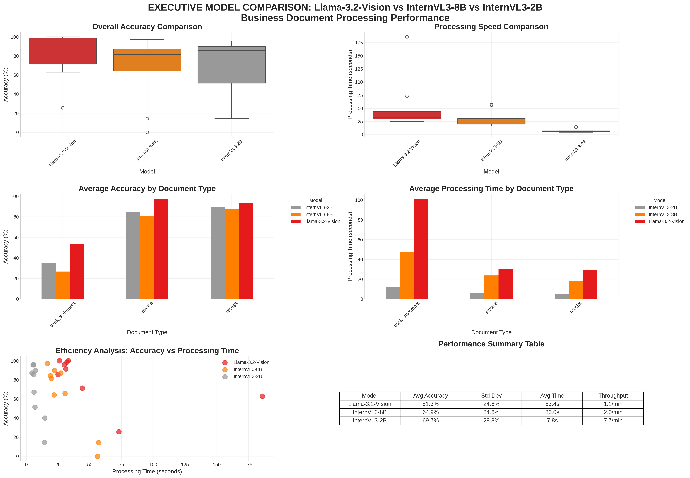

# Executive Model Comparison Report

**Generated**: 2025-09-14 23:29:12

## Performance Dashboard

## Executive Summary

### Llama-3.2-Vision
- **Average Accuracy**: 81.3%
- **Average Processing Time**: 53.4 seconds
- **Throughput**: 1.1 documents per minute
- **Documents Processed**: 9

### InternVL3-8B
- **Average Accuracy**: 64.9%
- **Average Processing Time**: 30.0 seconds
- **Throughput**: 2.0 documents per minute
- **Documents Processed**: 9

### InternVL3-2B
- **Average Accuracy**: 69.7%
- **Average Processing Time**: 7.8 seconds
- **Throughput**: 7.7 documents per minute
- **Documents Processed**: 9

## Document Type Performance

| document_type   |   InternVL3-2B |   InternVL3-8B |   Llama-3.2-Vision |
|:----------------|---------------:|---------------:|-------------------:|
| bank_statement  |        35.2381 |        26.6667 |            53.3333 |
| invoice         |        84.2857 |        80.4762 |            97.1429 |
| receipt         |        89.5238 |        87.619  |            93.3333 |

## Key Findings

- **Accuracy Leader**: Llama-3.2-Vision
- **Speed Leader**: InternVL3-2B
- **Best for Invoices**: Llama-3.2-Vision
- **Best for Receipts**: Llama-3.2-Vision
- **Best for Bank Statements**: Llama-3.2-Vision

## Recommendations

Detailed recommendations and analysis available in the full comparison notebook.
