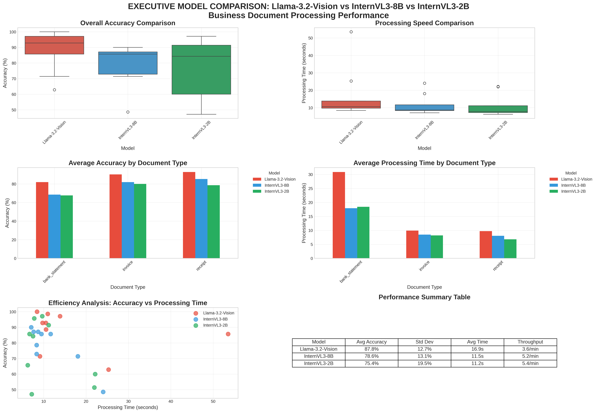

# Executive Model Comparison Report

**Generated**: 2025-09-17 02:52:55

## Performance Dashboard

## Executive Summary

### Llama-3.2-Vision
- **Average Accuracy**: 87.8%
- **Average Processing Time**: 16.9 seconds
- **Throughput**: 3.6 documents per minute
- **Documents Processed**: 9

### InternVL3-8B
- **Average Accuracy**: 78.6%
- **Average Processing Time**: 11.5 seconds
- **Throughput**: 5.2 documents per minute
- **Documents Processed**: 9

### InternVL3-2B
- **Average Accuracy**: 75.4%
- **Average Processing Time**: 11.2 seconds
- **Throughput**: 5.4 documents per minute
- **Documents Processed**: 9

## Document Type Performance

| document_type   |   InternVL3-2B |   InternVL3-8B |   Llama-3.2-Vision |
|:----------------|---------------:|---------------:|-------------------:|
| bank_statement  |        67.619  |        68.5714 |            81.9048 |
| invoice         |        80      |        81.9048 |            90.2857 |
| receipt         |        78.5714 |        85.2381 |            92.8571 |

## Key Findings

- **Accuracy Leader**: Llama-3.2-Vision
- **Speed Leader**: InternVL3-2B
- **Best for Invoices**: Llama-3.2-Vision
- **Best for Receipts**: Llama-3.2-Vision
- **Best for Bank Statements**: Llama-3.2-Vision

## Recommendations

Detailed recommendations and analysis available in the full comparison notebook.
