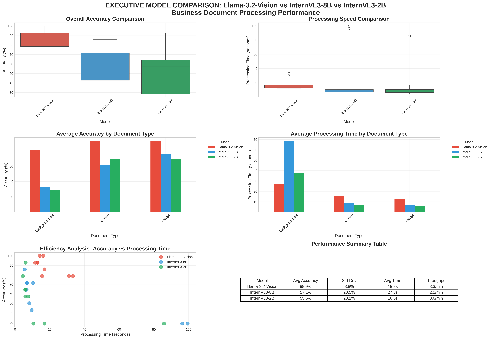

# Executive Model Comparison Report

**Generated**: 2025-09-24 22:54:44

## Performance Dashboard

## Executive Summary

### Llama-3.2-Vision
- **Average Accuracy**: 88.9%
- **Average Processing Time**: 18.3 seconds
- **Throughput**: 3.3 documents per minute
- **Documents Processed**: 9

### InternVL3-8B
- **Average Accuracy**: 57.1%
- **Average Processing Time**: 27.8 seconds
- **Throughput**: 2.2 documents per minute
- **Documents Processed**: 9

### InternVL3-2B
- **Average Accuracy**: 55.6%
- **Average Processing Time**: 16.6 seconds
- **Throughput**: 3.6 documents per minute
- **Documents Processed**: 9

## Document Type Performance

| document_type   |   InternVL3-2B |   InternVL3-8B |   Llama-3.2-Vision |
|:----------------|---------------:|---------------:|-------------------:|
| bank_statement  |        28.5714 |        33.3333 |            80.9524 |
| invoice         |        69.0476 |        61.9048 |            92.8571 |
| receipt         |        69.0476 |        76.1905 |            92.8571 |

## Key Findings

- **Accuracy Leader**: Llama-3.2-Vision
- **Speed Leader**: InternVL3-2B
- **Best for Invoices**: Llama-3.2-Vision
- **Best for Receipts**: Llama-3.2-Vision
- **Best for Bank Statements**: Llama-3.2-Vision

## Recommendations

Detailed recommendations and analysis available in the full comparison notebook.
