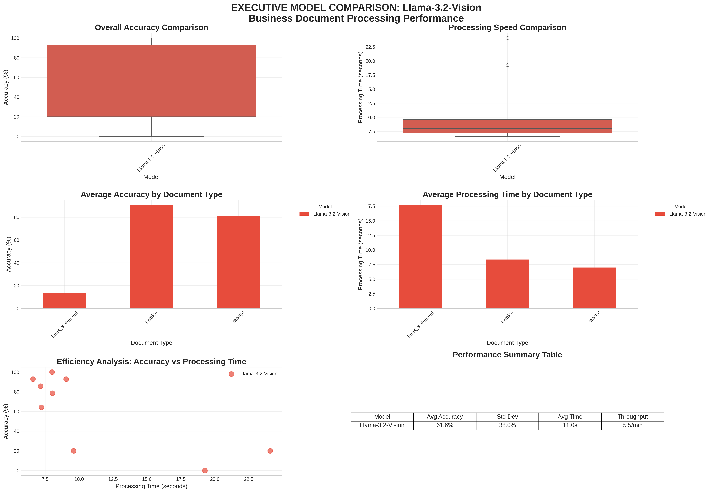

# Executive Model Comparison Report

**Generated**: 2025-10-01 00:17:56

## Performance Dashboard

## Executive Summary

### Llama-3.2-Vision
- **Average Accuracy**: 61.6%
- **Average Processing Time**: 11.0 seconds
- **Throughput**: 5.5 documents per minute
- **Documents Processed**: 9

### InternVL3-Quantized
- **Average Accuracy**: 54.6%
- **Average Processing Time**: 49.8 seconds
- **Throughput**: 1.2 documents per minute
- **Documents Processed**: 9

### InternVL3-Non-Quantized
- **Average Accuracy**: 68.9%
- **Average Processing Time**: 10.5 seconds
- **Throughput**: 5.7 documents per minute
- **Documents Processed**: 9

## Document Type Performance

| document_type   |   InternVL3-Non-Quantized |   InternVL3-Quantized |   Llama-3.2-Vision |
|:----------------|--------------------------:|----------------------:|-------------------:|
| bank_statement  |                   40      |               6.66667 |            13.3333 |
| invoice         |                   73.8095 |              66.6667  |            90.4762 |
| receipt         |                   92.8571 |              90.4762  |            80.9524 |

## Key Findings

- **Accuracy Leader**: InternVL3-Non-Quantized
- **Speed Leader**: InternVL3-Non-Quantized
- **Best for Invoices**: Llama-3.2-Vision
- **Best for Receipts**: InternVL3-Non-Quantized
- **Best for Bank Statements**: InternVL3-Non-Quantized

## Recommendations

Detailed recommendations and analysis available in the full comparison notebook.
