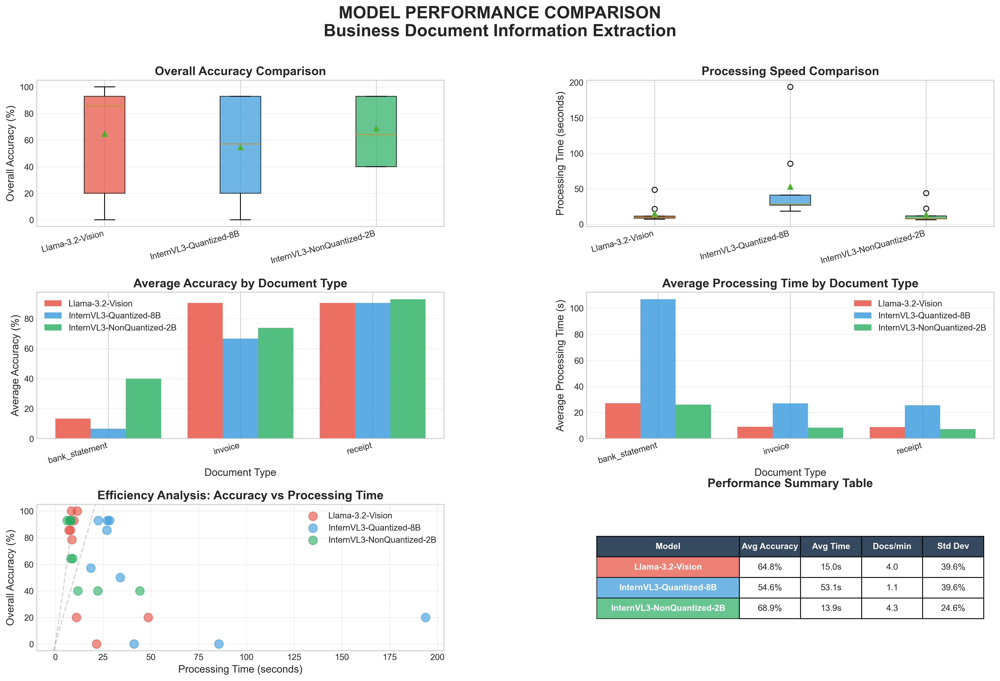

# Executive Model Comparison Report

**Generated**: 2025-10-12 16:55:21

## Performance Dashboard

## Executive Summary

### Llama-3.2-Vision
- **Average Accuracy**: 64.8%
- **Average Processing Time**: 15.0 seconds
- **Throughput**: 4.0 documents per minute
- **Documents Processed**: 9

### InternVL3-Quantized-8B
- **Average Accuracy**: 54.6%
- **Average Processing Time**: 53.1 seconds
- **Throughput**: 1.1 documents per minute
- **Documents Processed**: 9

### InternVL3-NonQuantized-2B
- **Average Accuracy**: 68.9%
- **Average Processing Time**: 13.9 seconds
- **Throughput**: 4.3 documents per minute
- **Documents Processed**: 9

## Document Type Performance

| document_type   |   InternVL3-NonQuantized-2B |   InternVL3-Quantized-8B |   Llama-3.2-Vision |
|:----------------|----------------------------:|-------------------------:|-------------------:|
| bank_statement  |                     40      |                  6.66667 |            13.3333 |
| invoice         |                     73.8095 |                 66.6667  |            90.4762 |
| receipt         |                     92.8571 |                 90.4762  |            90.4762 |

## Key Findings

- **Accuracy Leader**: InternVL3-NonQuantized-2B
- **Speed Leader**: InternVL3-NonQuantized-2B
- **Best for Invoices**: Llama-3.2-Vision
- **Best for Receipts**: InternVL3-NonQuantized-2B
- **Best for Bank Statements**: InternVL3-NonQuantized-2B

## Recommendations

Detailed recommendations and analysis available in the full comparison notebook.
