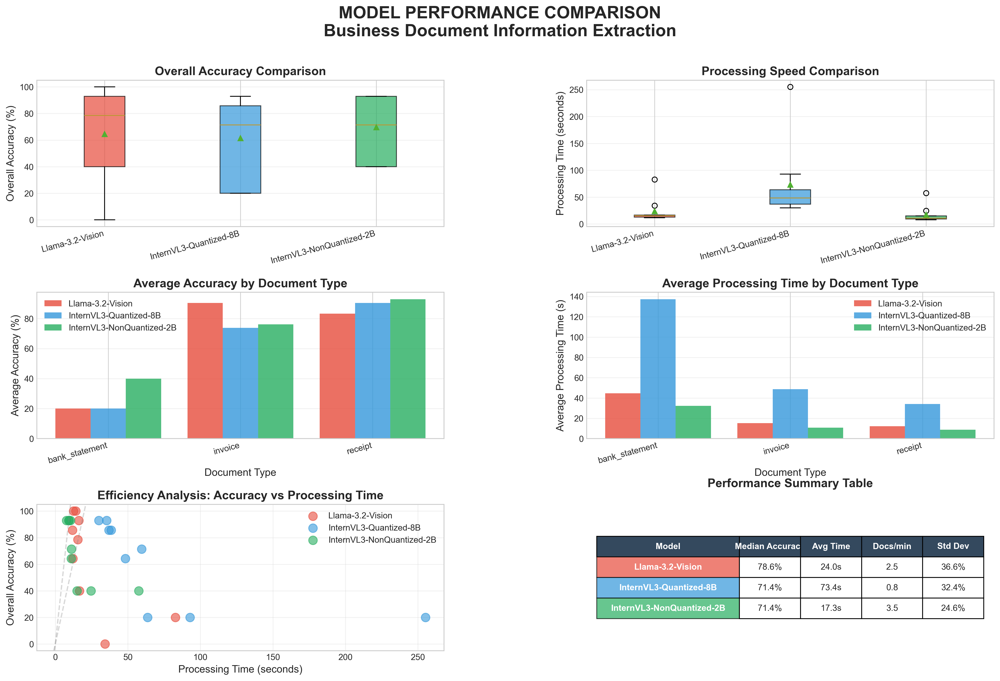

# Executive Model Comparison Report

**Generated**: 2025-10-15 15:20:22

## Performance Dashboard

## Executive Summary

### Llama-3.2-Vision
- **Average Accuracy**: 64.6%
- **Average Processing Time**: 24.0 seconds
- **Throughput**: 2.5 documents per minute
- **Documents Processed**: 9

### InternVL3-Quantized-8B
- **Average Accuracy**: 61.4%
- **Average Processing Time**: 73.4 seconds
- **Throughput**: 0.8 documents per minute
- **Documents Processed**: 9

### InternVL3-NonQuantized-2B
- **Average Accuracy**: 69.7%
- **Average Processing Time**: 17.3 seconds
- **Throughput**: 3.5 documents per minute
- **Documents Processed**: 9

## Document Type Performance

| document_type   |   InternVL3-NonQuantized-2B |   InternVL3-Quantized-8B |   Llama-3.2-Vision |
|:----------------|----------------------------:|-------------------------:|-------------------:|
| bank_statement  |                     40      |                  20      |            20      |
| invoice         |                     76.1905 |                  73.8095 |            90.4762 |
| receipt         |                     92.8571 |                  90.4762 |            83.3333 |

## Key Findings

- **Accuracy Leader**: InternVL3-NonQuantized-2B
- **Speed Leader**: InternVL3-NonQuantized-2B
- **Best for Invoices**: Llama-3.2-Vision
- **Best for Receipts**: InternVL3-NonQuantized-2B
- **Best for Bank Statements**: InternVL3-NonQuantized-2B

## Recommendations

Detailed recommendations and analysis available in the full comparison notebook.
