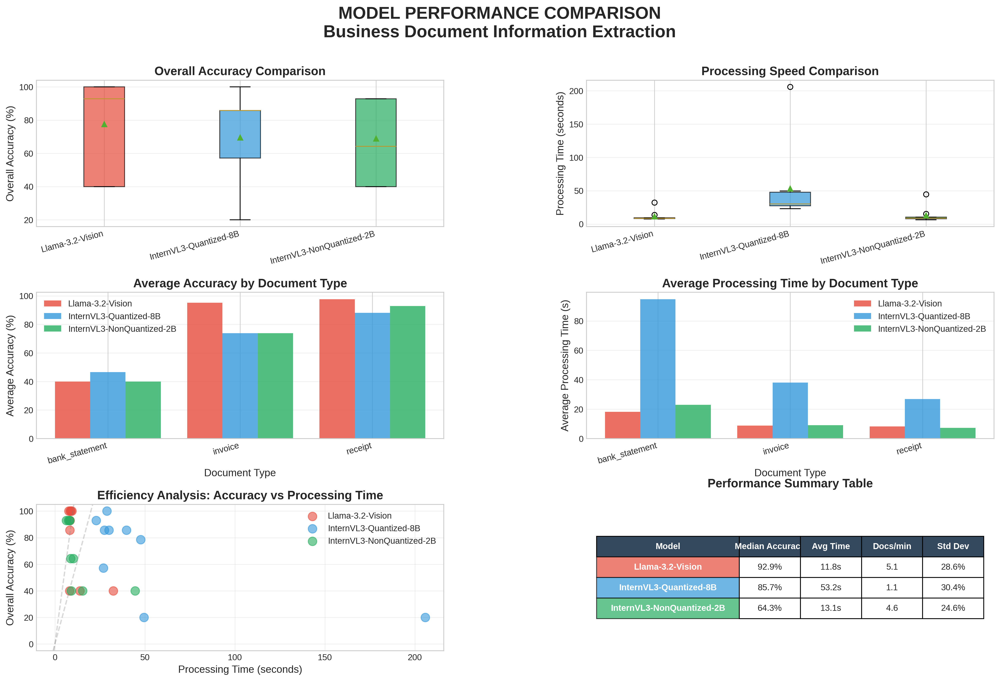

# Executive Model Comparison Report

**Generated**: 2025-10-16 03:14:22

## Performance Dashboard

## Executive Summary

### Llama-3.2-Vision
- **Average Accuracy**: 77.6%
- **Average Processing Time**: 11.8 seconds
- **Throughput**: 5.1 documents per minute
- **Documents Processed**: 9

### InternVL3-Quantized-8B
- **Average Accuracy**: 69.5%
- **Average Processing Time**: 53.2 seconds
- **Throughput**: 1.1 documents per minute
- **Documents Processed**: 9

### InternVL3-NonQuantized-2B
- **Average Accuracy**: 68.9%
- **Average Processing Time**: 13.1 seconds
- **Throughput**: 4.6 documents per minute
- **Documents Processed**: 9

## Document Type Performance

| document_type   |   InternVL3-NonQuantized-2B |   InternVL3-Quantized-8B |   Llama-3.2-Vision |
|:----------------|----------------------------:|-------------------------:|-------------------:|
| bank_statement  |                     40      |                  46.6667 |            40      |
| invoice         |                     73.8095 |                  73.8095 |            95.2381 |
| receipt         |                     92.8571 |                  88.0952 |            97.619  |

## Key Findings

- **Accuracy Leader**: Llama-3.2-Vision
- **Speed Leader**: Llama-3.2-Vision
- **Best for Invoices**: Llama-3.2-Vision
- **Best for Receipts**: Llama-3.2-Vision
- **Best for Bank Statements**: InternVL3-Quantized-8B

## Recommendations

Detailed recommendations and analysis available in the full comparison notebook.
