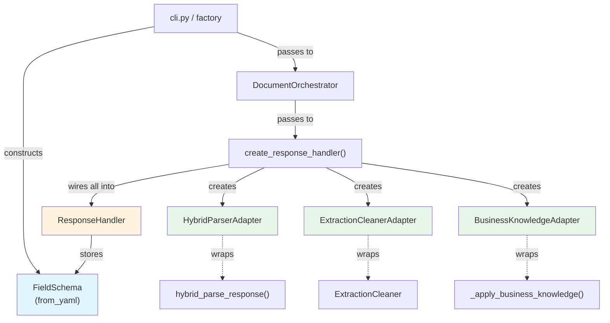
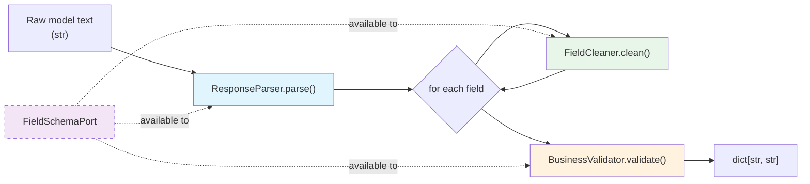

# Response Handler: Ports & Adapters Design

This is the third iteration of the response handler interface. It applies the
ports & adapters pattern (hexagonal architecture) specifically at the boundary
where raw model output crosses into the domain layer.

Previous designs:
- `response_handler_interface_design.md` -- simple facade, no swappable parts
- `response_handler_interface.md` -- maximum-flexibility Protocols with value objects

This design sits between the two: four narrow Protocols (ports), thin default
adapters wrapping existing code, and a coordinator that composes them. No value
objects -- the coordinator returns plain `dict[str, str]`.

---

## 1. Interface Signatures

```python
"""common/response_handler.py

Ports & adapters for the response handling boundary.

Ports (Protocol classes):
    FieldSchemaPort    -- "what fields exist and their types"
    ResponseParser     -- "how to convert raw text to dict"
    FieldCleaner       -- "how to normalize individual values"
    BusinessValidator  -- "how to check cross-field business rules"

Coordinator:
    ResponseHandler    -- composes all four ports into parse -> clean -> validate

Factory:
    create_response_handler()  -- wires default adapters for production use
"""

from typing import Protocol, runtime_checkable


# ---------------------------------------------------------------------------
# Port A: Field schema (what fields exist and their types)
# ---------------------------------------------------------------------------

@runtime_checkable
class FieldSchemaPort(Protocol):
    """Read-only view of field metadata needed by the response handler.

    This is the narrowest slice of FieldSchema that parsing and cleaning
    actually require. The real FieldSchema satisfies this Protocol as-is
    (structural subtyping) -- no adapter class needed.

    Why a port?
    - Decouples the handler from YAML loading and the lru_cache singleton.
    - Tests inject a 3-field stub dataclass instead of reading disk.
    - Makes the dependency on field metadata explicit in the constructor.
    """

    @property
    def extraction_fields(self) -> tuple[str, ...]:
        """Universal superset of all extraction field names."""
        ...

    @property
    def field_types(self) -> dict[str, str]:
        """Map each field name to its type tag.

        Known type tags: monetary, date, list, boolean, calculated,
        transaction_list, text.
        """
        ...

    def resolve_doc_type(self, raw_type: str) -> str:
        """Resolve a document type alias to its canonical lowercase form.

        Examples:
            "tax invoice" -> "invoice"
            "statement"   -> "bank_statement"
        """
        ...


# ---------------------------------------------------------------------------
# Port B: Parsing strategy (how to convert raw text to dict)
# ---------------------------------------------------------------------------

@runtime_checkable
class ResponseParser(Protocol):
    """Convert raw model text to a raw field dict.

    Contract:
    - Returns a dict whose keys are exactly ``expected_fields``.
    - Missing/unparseable fields have value ``"NOT_FOUND"``.
    - Values are raw strings -- no cleaning has been applied.
    - Must never raise on malformed input; returns all-NOT_FOUND instead.

    The default adapter wraps ``hybrid_parse_response()`` from
    ``common/extraction_parser.py`` which tries JSON -> plain text ->
    markdown fallback internally.
    """

    def parse(
        self,
        raw_response: str,
        expected_fields: list[str],
    ) -> dict[str, str]:
        """Parse raw model output into {field_name: raw_value}.

        Args:
            raw_response: Complete text string from the model.
            expected_fields: Ordered list of field names to extract.

        Returns:
            Dict with exactly ``expected_fields`` as keys.
            Values are raw extracted strings or ``"NOT_FOUND"``.
        """
        ...


# ---------------------------------------------------------------------------
# Port C: Per-field cleaning (how to normalize individual values)
# ---------------------------------------------------------------------------

@runtime_checkable
class FieldCleaner(Protocol):
    """Normalize a single field value based on its name and type.

    Contract:
    - Input: one (field_name, raw_value) pair.
    - Output: cleaned string, or ``"NOT_FOUND"``.
    - Stateless per call -- no cross-field logic.
    - Must handle ``"NOT_FOUND"`` input by returning ``"NOT_FOUND"``.

    The default adapter wraps ``ExtractionCleaner.clean_field_value()``
    which routes by field type: monetary, list, date, id, address, text.
    """

    def clean(self, field_name: str, raw_value: str) -> str:
        """Clean and normalize a single extracted value.

        Args:
            field_name: Uppercase field name (e.g. ``"TOTAL_AMOUNT"``).
            raw_value: Raw string from the parser.

        Returns:
            Cleaned string or ``"NOT_FOUND"``.
        """
        ...


# ---------------------------------------------------------------------------
# Port D: Cross-field business validation
# ---------------------------------------------------------------------------

@runtime_checkable
class BusinessValidator(Protocol):
    """Validate and optionally correct an entire extraction dict.

    Contract:
    - Input: complete dict after per-field cleaning.
    - Output: same dict, possibly with corrected values.
    - Must never raise -- returns input unchanged on internal errors.
    - May log warnings for diagnostics.

    The default adapter wraps
    ``ExtractionCleaner._apply_business_knowledge()`` which checks:
    - GST amount consistency (total = subtotal + GST)
    - Line item pricing (unit_price * qty = total_price)
    - Bank statement transaction count alignment
    """

    def validate(self, cleaned_data: dict[str, str]) -> dict[str, str]:
        """Apply cross-field business rules to cleaned extraction data.

        Args:
            cleaned_data: Dict of cleaned field values. All expected
                fields are present as keys.

        Returns:
            Validated (possibly corrected) dict. Same keys as input.
        """
        ...


# ---------------------------------------------------------------------------
# Coordinator: ResponseHandler
# ---------------------------------------------------------------------------

class ResponseHandler:
    """Compose parse -> clean -> validate into a single ``handle()`` call.

    This is the ONLY class the orchestrator needs to import for response
    handling. All internal complexity (which parse format succeeded,
    field-type routing, GST rules, transaction count checks) is hidden.

    The four ports compose as a strict linear pipeline:

        raw_response
            |
            v
        ResponseParser.parse()      -> dict[str, str]  (raw values)
            |
            v
        FieldCleaner.clean()        -> dict[str, str]  (per-field, in a loop)
            |
            v
        BusinessValidator.validate() -> dict[str, str]  (cross-field)
            |
            v
        return to caller

    There are no circular dependencies between ports. Each port's output
    is the next port's input.

    Note on FieldSchemaPort: the coordinator stores it but does NOT use it
    directly in the pipeline today. It is available for adapters that need
    field metadata (e.g. a future parser that uses the schema for alias
    resolution, or a cleaner that reads field_types from the schema instead
    of from hardcoded pattern lists). Storing it here ensures the schema is
    injected once and available to any port that needs it, without requiring
    each port to accept it independently.
    """

    def __init__(
        self,
        *,
        schema: FieldSchemaPort,
        parser: ResponseParser,
        cleaner: FieldCleaner,
        validator: BusinessValidator,
    ) -> None:
        """Wire the four ports.

        All four are required -- no defaults. Use ``create_response_handler()``
        factory for production wiring with defaults.

        Args:
            schema: Field metadata (types, aliases, extraction fields).
            parser: Converts raw model text to raw field dict.
            cleaner: Normalizes individual field values.
            validator: Applies cross-field business rules.
        """
        ...

    @property
    def schema(self) -> FieldSchemaPort:
        """Expose the injected schema for callers that need field metadata.

        The orchestrator uses this for field list lookups and token budget
        calculations -- things that are outside the response handler's scope
        but need the same schema instance.
        """
        ...

    def handle(
        self,
        raw_response: str,
        expected_fields: list[str],
    ) -> dict[str, str]:
        """Run the full parse -> clean -> validate pipeline.

        This is the primary entry point. It replaces the inline
        parse/clean loop in both ``process_single_image()`` and
        ``extract_batch()``.

        Steps:
            1. ``parser.parse(raw_response, expected_fields)``
            2. For each field: ``cleaner.clean(field_name, value)``
            3. ``validator.validate(cleaned_dict)``

        Args:
            raw_response: Raw model output string. May be empty.
            expected_fields: Field names to extract. Determines the keys
                in the returned dict.

        Returns:
            Cleaned, validated dict with exactly ``expected_fields`` as
            keys. Missing fields have value ``"NOT_FOUND"``.
        """
        ...

    def handle_batch(
        self,
        raw_responses: list[str],
        field_lists: list[list[str]],
    ) -> list[dict[str, str]]:
        """Handle multiple responses (one per image in a batch).

        Convenience method -- calls ``handle()`` per item. No batch-level
        cross-document logic today. This is the extension point if we
        need batch-level validation later (e.g. deduplication across
        images in the same batch).

        Args:
            raw_responses: One raw model string per image.
            field_lists: Parallel list of per-image expected field lists.

        Returns:
            List of cleaned, validated dicts (same order as inputs).

        Raises:
            ValueError: If ``len(raw_responses) != len(field_lists)``.
        """
        ...


# ---------------------------------------------------------------------------
# Factory: wires default adapters for production use
# ---------------------------------------------------------------------------

def create_response_handler(
    *,
    schema: FieldSchemaPort | None = None,
    debug: bool = False,
) -> ResponseHandler:
    """Create a ResponseHandler wired with production-default adapters.

    This is the drop-in replacement for the inline parse/clean/validate
    logic currently in DocumentOrchestrator. The orchestrator calls this
    once in ``__init__()`` and stores the result.

    Default wiring:
    - parser:    HybridParserAdapter  (wraps hybrid_parse_response)
    - cleaner:   ExtractionCleanerAdapter  (wraps ExtractionCleaner.clean_field_value)
    - validator: BusinessKnowledgeAdapter  (wraps ExtractionCleaner._apply_business_knowledge)
    - schema:    get_field_schema() singleton if not provided

    Args:
        schema: Explicit FieldSchema. If None, falls back to the
            module-level singleton via ``get_field_schema()``.
        debug: Propagated to cleaner/validator for diagnostic output.

    Returns:
        Fully wired ResponseHandler ready for ``handle()`` calls.
    """
    ...
```

### Default Adapters

These are thin wrappers that make existing functions satisfy the Protocol
interfaces. They live alongside the Protocols in `common/response_handler.py`
(or in a separate `common/response_handler_adapters.py` if the file grows
past 300 lines).

```python
"""Default adapters wrapping existing implementations."""

from common.extraction_cleaner import ExtractionCleaner
from common.extraction_parser import hybrid_parse_response
from common.field_schema import FieldSchema, get_field_schema


class HybridParserAdapter:
    """Adapter: wraps hybrid_parse_response() as a ResponseParser.

    This delegates to the existing function which internally tries
    JSON -> plain text -> markdown fallback. No logic changes.
    """

    def parse(
        self, raw_response: str, expected_fields: list[str]
    ) -> dict[str, str]:
        return hybrid_parse_response(raw_response, expected_fields)


class ExtractionCleanerAdapter:
    """Adapter: wraps ExtractionCleaner.clean_field_value() as a FieldCleaner.

    Owns a private ExtractionCleaner instance for the per-field
    type-routing logic (monetary, date, list, id, address, text).
    """

    def __init__(self, *, debug: bool = False) -> None:
        self._cleaner = ExtractionCleaner(debug=debug)

    def clean(self, field_name: str, raw_value: str) -> str:
        return self._cleaner.clean_field_value(field_name, raw_value)


class BusinessKnowledgeAdapter:
    """Adapter: wraps ExtractionCleaner._apply_business_knowledge().

    Owns a private ExtractionCleaner instance for the cross-field
    validation logic (GST, line-item pricing, transaction counts).
    """

    def __init__(self, *, debug: bool = False) -> None:
        self._cleaner = ExtractionCleaner(debug=debug)

    def validate(self, cleaned_data: dict[str, str]) -> dict[str, str]:
        return self._cleaner._apply_business_knowledge(cleaned_data)
```

**Key design decision**: `FieldSchema` itself already structurally satisfies
`FieldSchemaPort` (it has `extraction_fields`, `field_types`, and
`resolve_doc_type`). No adapter wrapper is needed -- the real `FieldSchema`
can be passed directly as the `schema` argument. This is the benefit of
using a structural Protocol rather than an ABC.

---

## 2. Usage Examples

### 2a. Orchestrator `__init__` -- wiring

```python
# --- OLD (3 imports, 2 stored attributes) ---
from common.extraction_cleaner import ExtractionCleaner
from common.extraction_parser import hybrid_parse_response
from common.field_schema import get_field_schema
...
self.cleaner = ExtractionCleaner(debug=debug)
self.document_field_lists = (
    field_definitions
    if field_definitions is not None
    else get_field_schema().get_all_doc_type_fields()
)

# --- NEW (1 import, 1 stored attribute) ---
from common.response_handler import create_response_handler
...
schema = get_field_schema()
self._response_handler = create_response_handler(schema=schema, debug=debug)
self.document_field_lists = (
    field_definitions
    if field_definitions is not None
    else schema.get_all_doc_type_fields()
)
```

The orchestrator's import surface drops from 3 modules to 1. `self.cleaner`
is no longer an instance attribute.

### 2b. `process_single_image()` -- before vs after

**Before** (lines 568-576 of orchestrator.py):
```python
extracted_data = hybrid_parse_response(
    raw_response, expected_fields=active_fields
)

for field_name, value in extracted_data.items():
    extracted_data[field_name] = self.cleaner.clean_field_value(
        field_name, value
    )
# BUG: _apply_business_knowledge() is never called.

found = sum(1 for v in extracted_data.values() if v != "NOT_FOUND")
```

**After** (1 line replaces 8):
```python
extracted_data = self._response_handler.handle(raw_response, active_fields)

found = sum(1 for v in extracted_data.values() if v != "NOT_FOUND")
```

The `found` count stays in the orchestrator because it feeds into the result
dict metadata (`extracted_fields_count`, `response_completeness`). That
metadata is an orchestrator concern (it includes `image_name`,
`processing_time`) -- the handler should not know about it.

### 2c. `extract_batch()` -- before vs after

**Before** (lines 736-747):
```python
for i, response in enumerate(responses):
    doc_field_list = field_lists_per_image[i]
    document_type = classification_infos[i]["document_type"]

    extracted_data = hybrid_parse_response(
        response, expected_fields=doc_field_list
    )

    for field_name in doc_field_list:
        raw_value = extracted_data.get(field_name, "NOT_FOUND")
        if raw_value != "NOT_FOUND":
            extracted_data[field_name] = self.cleaner.clean_field_value(
                field_name, raw_value
            )
        else:
            extracted_data[field_name] = "NOT_FOUND"
    # BUG: _apply_business_knowledge() is never called.
```

**After** (two options):
```python
# Option A: inline loop (preserves existing structure)
for i, response in enumerate(responses):
    extracted_data = self._response_handler.handle(
        response, field_lists_per_image[i]
    )
    ...

# Option B: batch convenience
all_extracted = self._response_handler.handle_batch(
    responses, field_lists_per_image
)
for i, extracted_data in enumerate(all_extracted):
    ...
```

### 2d. Test with mock ports -- no GPU, no YAML, no regex

```python
"""Tests that verify the pipeline wiring without any real implementations."""

from dataclasses import dataclass


# --- Minimal stubs (each satisfies one Protocol) ---

class StubParser:
    """Assigns each line of the response to a field, in order."""

    def parse(
        self, raw_response: str, expected_fields: list[str]
    ) -> dict[str, str]:
        lines = raw_response.strip().split("\n") if raw_response.strip() else []
        result = {f: "NOT_FOUND" for f in expected_fields}
        for i, field in enumerate(expected_fields):
            if i < len(lines):
                result[field] = lines[i]
        return result


class IdentityCleaner:
    """Returns value unchanged -- no normalization."""

    def clean(self, field_name: str, raw_value: str) -> str:
        return raw_value


class NoOpValidator:
    """Returns dict unchanged -- no business rules."""

    def validate(self, cleaned_data: dict[str, str]) -> dict[str, str]:
        return cleaned_data


@dataclass(frozen=True)
class StubSchema:
    """Minimal schema for tests. Satisfies FieldSchemaPort structurally."""

    extraction_fields: tuple[str, ...] = ("TOTAL_AMOUNT", "INVOICE_DATE")
    field_types: dict[str, str] | None = None

    def __post_init__(self) -> None:
        if self.field_types is None:
            object.__setattr__(
                self, "field_types",
                {"TOTAL_AMOUNT": "monetary", "INVOICE_DATE": "date"},
            )

    def resolve_doc_type(self, raw_type: str) -> str:
        return raw_type.lower()


# --- Actual tests ---

def test_handle_runs_parse_clean_validate_in_sequence() -> None:
    handler = ResponseHandler(
        schema=StubSchema(),
        parser=StubParser(),
        cleaner=IdentityCleaner(),
        validator=NoOpValidator(),
    )

    result = handler.handle(
        raw_response="$42.00\n15/03/2026",
        expected_fields=["TOTAL_AMOUNT", "INVOICE_DATE"],
    )

    assert result == {
        "TOTAL_AMOUNT": "$42.00",
        "INVOICE_DATE": "15/03/2026",
    }


def test_handle_fills_not_found_for_missing_fields() -> None:
    handler = ResponseHandler(
        schema=StubSchema(),
        parser=StubParser(),
        cleaner=IdentityCleaner(),
        validator=NoOpValidator(),
    )

    result = handler.handle(
        raw_response="$42.00",
        expected_fields=["TOTAL_AMOUNT", "INVOICE_DATE", "GST_AMOUNT"],
    )

    assert result["TOTAL_AMOUNT"] == "$42.00"
    assert result["INVOICE_DATE"] == "NOT_FOUND"
    assert result["GST_AMOUNT"] == "NOT_FOUND"


def test_cleaner_is_applied_per_field() -> None:
    """Demonstrate swapping just the cleaner port."""

    class UpperCleaner:
        def clean(self, field_name: str, raw_value: str) -> str:
            return raw_value.upper() if raw_value != "NOT_FOUND" else raw_value

    handler = ResponseHandler(
        schema=StubSchema(),
        parser=StubParser(),
        cleaner=UpperCleaner(),
        validator=NoOpValidator(),
    )

    result = handler.handle(
        raw_response="hello",
        expected_fields=["TOTAL_AMOUNT"],
    )

    assert result["TOTAL_AMOUNT"] == "HELLO"


def test_validator_sees_cleaned_data() -> None:
    """Demonstrate that validator runs AFTER cleaning."""

    class RecordingValidator:
        def __init__(self) -> None:
            self.last_input: dict[str, str] | None = None

        def validate(self, cleaned_data: dict[str, str]) -> dict[str, str]:
            self.last_input = cleaned_data.copy()
            return cleaned_data

    class PrefixCleaner:
        def clean(self, field_name: str, raw_value: str) -> str:
            return f"CLEANED_{raw_value}"

    validator = RecordingValidator()
    handler = ResponseHandler(
        schema=StubSchema(),
        parser=StubParser(),
        cleaner=PrefixCleaner(),
        validator=validator,
    )

    handler.handle(
        raw_response="$42.00",
        expected_fields=["TOTAL_AMOUNT"],
    )

    # Validator should see cleaned values, not raw ones
    assert validator.last_input == {"TOTAL_AMOUNT": "CLEANED_$42.00"}


def test_handle_batch_rejects_mismatched_lengths() -> None:
    handler = ResponseHandler(
        schema=StubSchema(),
        parser=StubParser(),
        cleaner=IdentityCleaner(),
        validator=NoOpValidator(),
    )

    import pytest
    with pytest.raises(ValueError, match="length mismatch"):
        handler.handle_batch(
            raw_responses=["response1", "response2"],
            field_lists=[["TOTAL_AMOUNT"]],  # only 1, but 2 responses
        )
```

**Key point**: Zero YAML files loaded, zero `get_field_schema()` calls, zero
`ExtractionCleaner` instances, zero GPU. Each port is independently mockable.
The `StubSchema` dataclass structurally satisfies `FieldSchemaPort` without
any adapter wrapper -- this is structural subtyping working as intended.

---

## 3. What Complexity It Hides

After this refactor, callers of `ResponseHandler.handle()` no longer see
or need to know about these internal details:

| Hidden detail | How it was visible before |
|---|---|
| JSON vs plain-text vs markdown parse dispatch | `hybrid_parse_response()` import and direct call |
| JSON truncation repair heuristics | Internal to `_try_parse_json()` / `_repair_truncated_json()` |
| Field-type routing (monetary / date / list / id / address / text) | `ExtractionCleaner._get_field_type()` match/case dispatch |
| Per-type regex patterns (currency symbols, comma removal, markdown artifacts) | `_clean_monetary_field`, `_clean_date_field`, etc. |
| Business rule dispatch (GST + line-item pricing + bank txn count checks) | `_apply_business_knowledge()` match/case tree |
| FieldSchema singleton calls inside parser and cleaner | `get_field_schema()` in `_get_extraction_fields()`, `_load_doc_type_alias_map()`, `_normalize_document_type()` |
| The per-field cleaning loop itself | The `for field_name, value in extracted_data.items()` iteration |
| The asymmetry between single and batch paths | `process_single_image` iterates `.items()`, `extract_batch` iterates doc_field_list with an extra NOT_FOUND guard |
| The missing business-validation bug | Both paths skip `_apply_business_knowledge()` today |

The orchestrator's remaining responsibility in response handling is exactly:

```python
extracted_data = self._response_handler.handle(raw_response, active_fields)
found = sum(1 for v in extracted_data.values() if v != "NOT_FOUND")
```

Everything else is delegated.

---

## 4. Dependency Strategy

### 4.1 Dependency flow diagram



### 4.2 Per-port dependency management

| Port | Default adapter | Internal dependencies | How it gets them |
|---|---|---|---|
| `FieldSchemaPort` | **None needed** (FieldSchema satisfies it structurally) | `yaml`, `pathlib` (loaded once in `from_yaml`) | Constructed by caller, injected into handler |
| `ResponseParser` | `HybridParserAdapter` | `orjson` (optional), `re`, `dateutil`, hidden `get_field_schema()` call | Adapter imports `hybrid_parse_response` directly |
| `FieldCleaner` | `ExtractionCleanerAdapter` | `re`, hidden `get_field_schema()` in `_normalize_document_type()` | Adapter owns private `ExtractionCleaner` |
| `BusinessValidator` | `BusinessKnowledgeAdapter` | `re` | Adapter owns private `ExtractionCleaner` |

### 4.3 Eliminating hidden singleton calls (phased)

The `get_field_schema()` singleton is currently called in three hidden
locations inside the response handling path:

1. `extraction_parser.py:27` -- `_get_extraction_fields()` (default field list)
2. `extraction_parser.py:33` -- `_load_doc_type_alias_map()` (alias resolution)
3. `extraction_cleaner.py:431` -- `_normalize_document_type()` (doc type cleaning)

**Phase 1 (this PR)**: The `ResponseHandler` always passes `expected_fields`
explicitly to the parser, so call site #1 is never hit (the `if
expected_fields is None` branch in `hybrid_parse_response` is bypassed).
Call sites #2 and #3 still use the singleton but are idempotent (the
singleton returns the same frozen object that was injected into the handler).

**Phase 2 (follow-up)**: Modify `HybridParserAdapter` to accept
`FieldSchemaPort` in its constructor and pass the injected schema's alias
map to the parser. Eliminates call site #2.

**Phase 3 (follow-up)**: Modify `ExtractionCleanerAdapter` to inject the
schema into `_normalize_document_type()`. Eliminates call site #3. At this
point, no code in the response handling pipeline calls `get_field_schema()`.

### 4.4 Why FieldSchema needs no adapter wrapper

The real `FieldSchema` dataclass (from `common/field_schema.py`) already has:
- `extraction_fields: tuple[str, ...]` (property-compatible attribute)
- `field_types: dict[str, str]` (property-compatible attribute)
- `resolve_doc_type(self, raw_type: str) -> str` (method)

Because `FieldSchemaPort` is a `@runtime_checkable` Protocol with structural
subtyping, `isinstance(get_field_schema(), FieldSchemaPort)` is `True`
at runtime. No wrapper needed. This is the cleanest possible integration --
the port describes what we need, and the real type already provides it.

---

## 5. Trade-offs

### Gains

| # | Gain | Detail |
|---|---|---|
| 1 | **Fixes the missing validation bug** | Both `process_single_image()` and `extract_batch()` currently skip `_apply_business_knowledge()`. With `handle()`, the three steps always run in sequence. The bug is fixed by construction -- there is no way to call parse + clean without validate. |
| 2 | **Eliminates duplication** | The parse/clean loop is implemented once inside `handle()`. Two 8-15 line blocks in the orchestrator become two 1-line calls. |
| 3 | **GPU-free testability** | Each port is a Protocol with 1 method. A test stub is 3-5 lines. No YAML files, no model, no CUDA. |
| 4 | **Explicit FieldSchema dependency** | The orchestrator's constructor receives `FieldSchema` and passes it through. No hidden `get_field_schema()` calls in the public path. Tests inject a tiny `StubSchema` dataclass. |
| 5 | **Independent port mockability** | Want to test that the validator sees cleaned data? Mock the cleaner with a prefix adder and assert on validator input. Want to test that parsing handles empty strings? Mock cleaner + validator as no-ops and test the parser alone. |
| 6 | **Swap-ability for experimentation** | New parse format (YAML)? Implement `ResponseParser.parse()`. New cleaning logic? Implement `FieldCleaner.clean()`. New business rules? Implement `BusinessValidator.validate()`. No changes to existing code. |
| 7 | **Linear pipeline, no cycles** | Parse -> Clean -> Validate is strict sequence. Each port's output is the next port's input. No circular dependencies, no re-entrant calls. |

### Costs

| # | Cost | Detail | Mitigation |
|---|---|---|---|
| 1 | **Four Protocols for one concrete implementation (today)** | We only have one parser, one cleaner, one validator in production. The Protocols exist for testability and future flexibility, not because we have multiple implementations now. | Each Protocol is 1 method. The ceremony is minimal. The testing benefit alone justifies them. |
| 2 | **One level of indirection** | Following "what happens to my response" requires: orchestrator -> `handle()` -> parser/cleaner/validator. Previously it was: orchestrator -> `hybrid_parse_response()` -> cleaner loop. | The indirection replaces duplicated inline code. Net comprehension cost is lower because there is one path instead of two divergent ones. |
| 3 | **Two `ExtractionCleaner` instances in default adapters** | `ExtractionCleanerAdapter` and `BusinessKnowledgeAdapter` each own a private `ExtractionCleaner`. This creates two instances where there was one before. | `ExtractionCleaner` is stateless except for `debug` flag and constant pattern lists. Two instances cost negligible memory. A future refactor could split the cleaner into two classes, eliminating the duplication. |
| 4 | **Hidden singleton calls remain (phase 1)** | `_normalize_document_type()` and `_load_doc_type_alias_map()` still call `get_field_schema()` internally. The injected schema in `ResponseHandler` does not fully reach those code paths yet. | The singleton returns the same frozen object, so behavior is identical. Phases 2-3 eliminate these calls. The interface is correct from day 1; the implementation catches up incrementally. |
| 5 | **No streaming support** | `handle()` requires the complete raw response upfront. If model output were streamed token-by-token, this interface would need extension. | All backends (`ModelBackend.generate()`, `BatchInference.generate_batch()`) return complete strings today. Streaming is not on the roadmap. |
| 6 | **Handler returns plain dict, not a value object** | The prior design (`response_handler_interface.md`) returned `HandlerResult` / `ParsedResponse` dataclasses carrying metadata (parse_strategy, extracted_fields_count). This design drops those to keep the return type simple. | The orchestrator already computes `extracted_fields_count` and `response_completeness` from the dict. Adding those to the handler's return value is unnecessary coupling. If `parse_strategy` tracing is needed later, it can be added as an optional diagnostic method (`handler.last_parse_strategy`) without changing the `handle()` return type. |

### What this design deliberately does NOT do

- **Does not change the result dict shape**. The orchestrator still constructs
  the 8-key result dict that `ExtractionResult` (protocol.py) defines.
- **Does not refactor `hybrid_parse_response()` or `ExtractionCleaner`
  internals**. Those modules are wrapped, not rewritten.
- **Does not split the parser into separate JSON/plaintext/markdown
  strategies**. The `ResponseParser` port has one `parse()` method. The
  current `hybrid_parse_response()` handles format fallback internally.
  If separate strategies are wanted later, the chain-of-responsibility
  pattern from `response_handler_interface.md` can be applied inside a
  new `ResponseParser` adapter without changing the port interface.
- **Does not merge `extraction_parser.py` and `extraction_cleaner.py`**.
  They remain separate modules, composed by the adapter layer.
- **Does not introduce a `ParsedResponse` value object**. The return type
  is `dict[str, str]` -- the simplest possible contract.

### Port composition diagram



### File placement

All Protocols, the coordinator, the default adapters, and the factory
function live in one file:

```
common/
    response_handler.py    # ~250 lines: 4 Protocols + ResponseHandler + 3 adapters + factory
    extraction_parser.py   # unchanged (phase 1)
    extraction_cleaner.py  # unchanged (phase 1)
    field_schema.py        # unchanged
```

No new files beyond `response_handler.py`. The existing modules are
wrapped, not moved or renamed.
